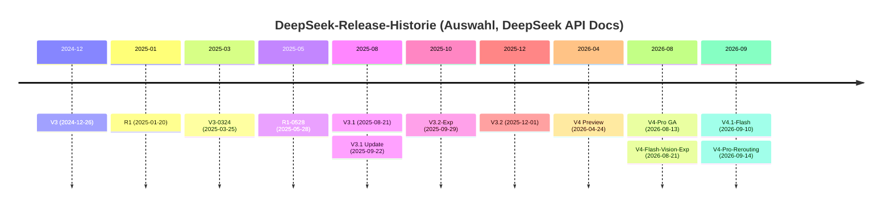
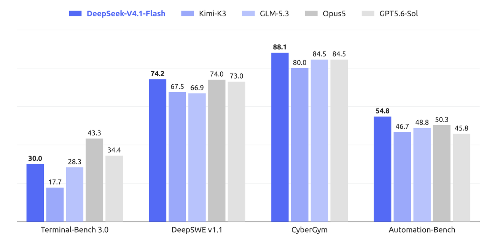
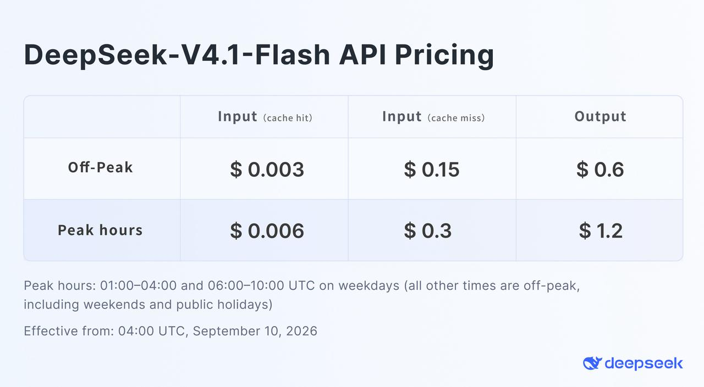

# DeepSeek-V4.1-Flash: Offizielle Quellen, kanonischer Name und API-Eckdaten

## Kanonischer Name und Abweichungen zum Auftragsnamen

Das Zielmodell dieses Wikis ist öffentlich unter dem Namen **DeepSeek-V4.1-Flash** dokumentiert; die Release-Meldung vom 10.09.2026 titelt „DeepSeek-V4.1-Flash: Smarter, Faster, More Efficient" [Release News](https://api-docs.deepseek.com/news/news260910, accessed 2026-09-12). In der API heißt das Modell schlicht `deepseek-flash`; die offizielle Preisseite führt als „Model Version" `DeepSeek-V4.1-Flash` [Models & Pricing](https://api-docs.deepseek.com/quick_start/pricing, accessed 2026-09-12). Der Auftragsname „DeepSeek V4.1 Flash" stimmt damit überein; die kanonische Schreibweise mit Bindestrichen lautet `DeepSeek-V4.1-Flash`.

Drei Namens-Stolperfallen sind dokumentiert:

1. Die **Legacy-Namen** `deepseek-v4-flash` und `deepseek-v4-flash-vision-exp` werden weiter akzeptiert, aber auf DeepSeek-V4.1-Flash geroutet — die zugehörigen Modelle sind retired und werden „at the Flash price" abgerechnet [Models & Pricing](https://api-docs.deepseek.com/quick_start/pricing, accessed 2026-09-12). „V4-Flash" und „V4.1-Flash" bezeichnen also ab dem 10.09.2026 denselben Endpunkt, aber unterschiedliche Modellgenerationen.
2. Ab **04:00 UTC am 14.09.2026** werden alle `deepseek-v4-pro`-Anfragen auf V4.1-Flash zum Flash-Preis geroutet („until V4.1-Pro launches"); V4-Pro wird auslaufend betrieben [Release News](https://api-docs.deepseek.com/news/news260910, accessed 2026-09-12).
3. Die lokale Umgebung dieses Wikis läuft unter der Modell-ID `deepseek/deepseek-flash` (Provider `deepseek`) — das ist der reguläre API-Name des Zielmodells, nicht ein separates Derivat (lokale Quelle: `~/.config/opencode/opencode.json`, siehe [01-06-betrieb-umgebung.md](01-06-betrieb-umgebung.md)).

## Release-Datum und Versionsgeschichte

Release-Datum des Zielmodells ist der **10.09.2026** (Preiswirksamkeit ab 04:00 UTC desselben Tages) [Release News](https://api-docs.deepseek.com/news/news260910, accessed 2026-09-12). Die öffentlich dokumentierte Releases-Historie (Sidebar der DeepSeek-API-Doku) umfasst:

*Abbildung: Release-Zeitleiste auf Basis der News-Sidebar der DeepSeek-API-Doku [News-Übersicht](https://api-docs.deepseek.com/news/news260910, accessed 2026-09-12).*

Das V4-Preview (24.04.2026) führte die V4-Generation ein: DeepSeek-V4-Pro mit 1,6T Gesamt-/49B aktiven Parametern und DeepSeek-V4-Flash mit 284B/13B, beide mit 1M-Kontext und Dual-Mode (Thinking/Non-Thinking), inklusive neuartiger Attention „Token-wise compression + DSA (DeepSeek Sparse Attention)" [V4 Preview Release](https://api-docs.deepseek.com/news/news260424, accessed 2026-09-12). Die V4-Pro-GA-Meldung (13.08.2026) ergänzte den flexiblen `reasoning_effort` und native OpenAI-Responses-API-Unterstützung [V4-Pro GA Release](https://api-docs.deepseek.com/news/news260813, accessed 2026-09-12). V4.1-Flash löst die V4-Flash-Linie ab und wird als „smallest model in our new architecture family, with native visual understanding" beschrieben — „smallest" bezieht sich auf die neue V4.1-Familie, nicht auf einen kleineren Parameterumfang gegenüber V4-Flash (552B vs. 284B Gesamtparameter) [Release News](https://api-docs.deepseek.com/news/news260910, accessed 2026-09-12).

Lokale Ergänzung: Der opencode-Modellkatalog führt zusätzlich datierte Snapshots (`deepseek-v4-flash-0731`, `deepseek-v4-pro-0813`, `deepseek-v4-flash-vision-exp`) mit Release-Daten 2026-07-31/2026-08-12/2026-08-21 sowie `deepseek-flash` mit Release-Datum 2026-09-10 (lokale Quelle: `~/.cache/opencode/models.json`).

## Offizielle Bezugsquellen

- **Gewichte und Tech Report:** HuggingFace-Repo `deepseek-ai/DeepSeek-V4.1-Flash` mit 48 Safetensors-Shards, MIT-Lizenz, Tech-Report-PDF (`DeepSeek_V41_Tech_Report.pdf`, 51 Seiten, erstellt 10.09.2026), Referenz-Encoding, Minimal-Inference-Skripten und DeepSWE-Reproduktionsanleitung [Model Card](https://huggingface.co/deepseek-ai/DeepSeek-V4.1-Flash, accessed 2026-09-12).
- **Prompt-Format-Referenz:** `encoding/encoding.py` („standalone prompt-format reference"), ausdrücklich ohne Jinja-Chat-Template; für Produktion zusätzlich die Rust-Bibliothek `deepseek-recipe` [encoding/README](https://huggingface.co/deepseek-ai/DeepSeek-V4.1-Flash/blob/main/encoding/README.md, accessed 2026-09-12) [deepseek-recipe](https://github.com/deepseek-ai/deepseek-recipe, accessed 2026-09-12).
- **Agent-Harness:** „DeepSeek Harness" im Developer Preview, verlinkt aus der API-Doku [Your First API Call](https://api-docs.deepseek.com/, accessed 2026-09-12); Org-Repo `deepseek-ai/deepseek-harness` („Everything is a Plugin.") [GitHub](https://github.com/deepseek-ai/deepseek-harness, accessed 2026-09-12).
- **Offline-Tokenizer:** `deepseek_v4_tokenizer.zip` von cdn.deepseek.com zur Offline-Token-Berechnung [Token & Token Usage](https://api-docs.deepseek.com/quick_start/token_usage, accessed 2026-09-12).
- **Erste-Partei-Endpunkte:** OpenAI-kompatibel `https://api.deepseek.com`, Anthropic-kompatibel `https://api.deepseek.com/anthropic` [Your First API Call](https://api-docs.deepseek.com/, accessed 2026-09-12).

## API-Eckdaten (offiziell)

| Eigenschaft | deepseek-flash (V4.1-Flash) |
|---|---|
| Kontextlänge | 1M Token [Models & Pricing](https://api-docs.deepseek.com/quick_start/pricing, accessed 2026-09-12) |
| Max. Output | MAXIMUM: 384K Token [Models & Pricing](https://api-docs.deepseek.com/quick_start/pricing, accessed 2026-09-12) |
| Thinking | Non-Thinking und Thinking (Default an, Default-Effort `high`) [Models & Pricing](https://api-docs.deepseek.com/quick_start/pricing, accessed 2026-09-12) [Thinking Mode](https://api-docs.deepseek.com/guides/thinking_mode, accessed 2026-09-12) |
| Vision | unterstützt (V4-Pro: nicht unterstützt) [Models & Pricing](https://api-docs.deepseek.com/quick_start/pricing, accessed 2026-09-12) |
| Features | JSON Output, Tool Calls, Responses API, Anthropic API, Chat Prefix (Beta); FIM nur im Non-Thinking-Modus [Models & Pricing](https://api-docs.deepseek.com/quick_start/pricing, accessed 2026-09-12) |
| Concurrency-Limit | 2500 [Models & Pricing](https://api-docs.deepseek.com/quick_start/pricing, accessed 2026-09-12) |
| Preis (pro 1M Token, off-peak/peak) | Cache-Hit $0.003/$0.006; Cache-Miss $0.15/$0.30; Output $0.6/$1.2 [Models & Pricing](https://api-docs.deepseek.com/quick_start/pricing, accessed 2026-09-12) |
| Peak-Zeiten | 01:00–04:00 und 06:00–10:00 UTC, Mo–Fr; off-peak = halber Preis [Models & Pricing](https://api-docs.deepseek.com/quick_start/pricing, accessed 2026-09-12) |
| Empfohlene Sampling-Parameter | `temperature=1.0`, `top_p=0.95` oder `1.0`, `max_tokens ≥ 256K` [Model Card](https://huggingface.co/deepseek-ai/DeepSeek-V4.1-Flash, accessed 2026-09-12) |

Im Thinking-Modus sind `temperature`, `presence_penalty` und `frequency_penalty` wirkungslos; `top_p` hat eine Untergrenze von 0.95, im Non-Thinking-Modus ist es fest 1.0 [Thinking Mode](https://api-docs.deepseek.com/guides/thinking_mode, accessed 2026-09-12). Für Tool-Nutzung muss `reasoning_content` vollständig zurückgegeben werden, sonst antwortet die API mit Fehler 400 [Thinking Mode](https://api-docs.deepseek.com/guides/thinking_mode, accessed 2026-09-12).

Die Preise des Vorgängers im Vergleich: V4-Pro kostete off-peak $0.66 (Cache-Miss-Input) / $1.98 (Output) pro 1M Token — V4.1-Flash liegt bei rund einem Viertel davon [Models & Pricing](https://api-docs.deepseek.com/quick_start/pricing, accessed 2026-09-12).

*Abbildung 1: Leistungsvergleich V4.1-Flash vs. Vorgänger aus der offiziellen Release-Meldung (Quelle: [Release News](https://api-docs.deepseek.com/news/news260910, accessed 2026-09-12)).*

*Abbildung 2: Offizielle Preistabelle zur V4.1-Flash-Einführung (Quelle: [Release News](https://api-docs.deepseek.com/news/news260910, accessed 2026-09-12)).*

## Partner und Provider-Lage

Die Release-Meldung nennt offizielle Partner: „WorkBuddy (including CodeBuddy) & OpenCode now fully support V4.1-Flash" [Release News](https://api-docs.deepseek.com/news/news260910, accessed 2026-09-12). In der z.ai-Dokumentation (Z.AI Developer Docs, Übersichtsseite `llms.txt`) findet sich zum Prüfzeitpunkt kein Eintrag zu DeepSeek-Modellen; die Plattform dokumentiert dort ihre GLM-Modelle (GLM-5.3, GLM-5.3-Flash u. a.) [Z.AI Developer Docs](https://docs.z.ai/llms.txt, accessed 2026-09-12). V4.1-Flash wird über den DeepSeek-Erstparteien-Endpunkt und Drittanbieter-Kataloge (z. B. opencode-Modellkatalog, lokale Quelle) angeboten.

## Lücken offener Punkte

- Eine unabhängige Reproduktion der offiziellen Angaben (Parameterzahlen, Kontext-/Output-Limits) durch Dritte liegt zum Recherchezeitpunkt nicht vor *[unkenntlich — keine Quelle gefunden]*.
- Weder ein Abkündigungstermin für den API-Namen `deepseek-flash` noch ein Termin für den V4.1-Pro-Launch sind öffentlich kommuniziert [Models & Pricing](https://api-docs.deepseek.com/quick_start/pricing, accessed 2026-09-12). Für Integrationen ist der reguläre API-Name `deepseek-flash` deshalb die risikoärmste Wahl (eigene Einschätzung).
- Wann die lokale opencode-Instanz auf `deepseek/deepseek-flash` umgestellt wurde, dokumentiert keine lokale Quelle (siehe [01-06-betrieb-umgebung.md](01-06-betrieb-umgebung.md)).
- Ob der lokale Proxy (localhost:9099) 1:1 an `api.deepseek.com` weiterleitet oder über eine andere Infrastruktur routet, ist von der Instanz aus nicht belegbar (siehe [01-06-betrieb-umgebung.md](01-06-betrieb-umgebung.md)).

## Quellen

1. DeepSeek (2026): DeepSeek-V4.1-Flash: Smarter, Faster, More Efficient. Release News, 10.09.2026. https://api-docs.deepseek.com/news/news260910 (accessed 2026-09-12)
2. DeepSeek (2026): Models & Pricing. API-Dokumentation. https://api-docs.deepseek.com/quick_start/pricing (accessed 2026-09-12)
3. DeepSeek (2026): Your First API Call. API-Dokumentation. https://api-docs.deepseek.com/ (accessed 2026-09-12)
4. DeepSeek (2026): Thinking Mode. API-Dokumentation. https://api-docs.deepseek.com/guides/thinking_mode (accessed 2026-09-12)
5. DeepSeek (2026): Token & Token Usage. API-Dokumentation. https://api-docs.deepseek.com/quick_start/token_usage (accessed 2026-09-12)
6. DeepSeek (2026): DeepSeek-V4-Pro GA Release. News, 13.08.2026. https://api-docs.deepseek.com/news/news260813 (accessed 2026-09-12)
7. DeepSeek (2026): DeepSeek V4 Preview Release. News, 24.04.2026. https://api-docs.deepseek.com/news/news260424 (accessed 2026-09-12)
8. DeepSeek-AI (2026): DeepSeek-V4.1-Flash — Model Card. Hugging Face. https://huggingface.co/deepseek-ai/DeepSeek-V4.1-Flash (accessed 2026-09-12)
9. Z.AI (2026): Developer Docs — Übersicht (llms.txt). https://docs.z.ai/llms.txt (accessed 2026-09-12)
10. Lokale Quellen (2026-09-12): `~/.config/opencode/opencode.json`; `~/.cache/opencode/models.json`; GitHub-Org-Übersicht https://github.com/deepseek-ai (accessed 2026-09-12)
