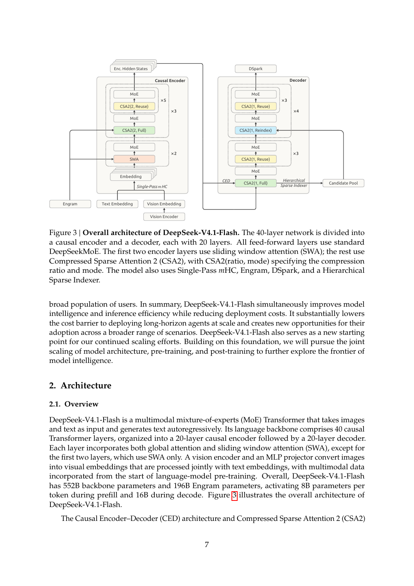
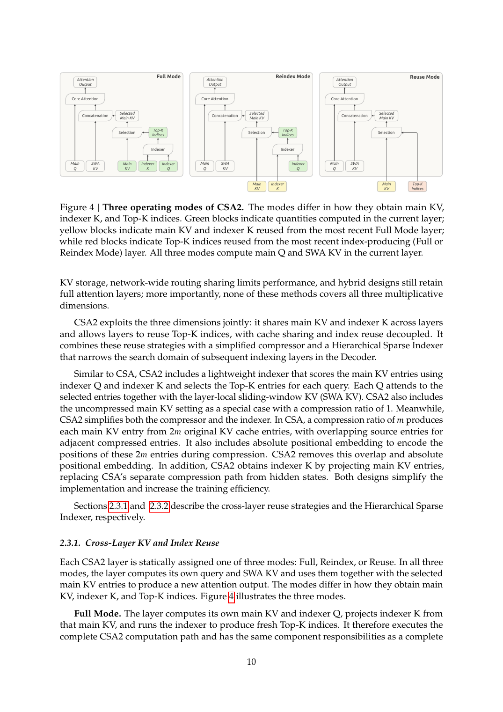

## Überblick

DeepSeek-V4.1-Flash ist ein multimodales Mixture-of-Experts-(MoE-)Modell mit 552B Backbone- und 196B Engram-Parametern, das Kontexte bis eine Million Token unterstützt [Model Card](https://huggingface.co/deepseek-ai/DeepSeek-V4.1-Flash, accessed 2026-09-12). Das 40-Layer-Backbone teilt sich in 20 kausale Encoder- und 20 Decoder-Layer; die ersten beiden Layer nutzen ausschließlich Sliding-Window-Attention (SWA), alle übrigen globales Attention plus SWA [Tech Report](https://huggingface.co/deepseek-ai/DeepSeek-V4.1-Flash/blob/main/DeepSeek_V41_Tech_Report.pdf, accessed 2026-09-12).

Kernstück ist die Causal Encoder-Decoder-(CED-)Architektur: Die globalen KV-Einträge des Decoders stammen aus dem Hidden State der letzten Encoder-Schicht statt aus den Decoder-Hidden-States; dadurch aktiviert das Modell nur 8B Parameter pro Token im Prefill und 16B im Decode [Model Card](https://huggingface.co/deepseek-ai/DeepSeek-V4.1-Flash, accessed 2026-09-12). CSA2 und FP4-KV-Caching drücken den globalen KV-Cache (stets in HBM) auf 890 Bytes pro Token — rund ein Viertel des Werts von DeepSeek-V4-Flash; SWA Bounded Replay senkt den persistenten Cache auf etwa ein Achtel [Tech Report](https://huggingface.co/deepseek-ai/DeepSeek-V4.1-Flash/blob/main/DeepSeek_V41_Tech_Report.pdf, accessed 2026-09-12). Die Release-News nennen das „asymmetric architecture" [Release News](https://api-docs.deepseek.com/news/news260910, accessed 2026-09-12).

*Abbildung 1: Gesamtarchitektur (Figure 3 des Tech-Reports): Causal Encoder und Decoder mit CSA2-Modusannotationen, MoE, Single-Pass mHC, Engram und DSpark (Quelle: [Tech Report](https://huggingface.co/deepseek-ai/DeepSeek-V4.1-Flash/blob/main/DeepSeek_V41_Tech_Report.pdf, accessed 2026-09-12))*

## MoE-Struktur

Jede der 40 Schichten ist ein MoE-Layer aus 1 shared expert und 384 routed experts (Zwischendimension 2304), von denen 6 pro Token aktiviert werden [Tech Report](https://huggingface.co/deepseek-ai/DeepSeek-V4.1-Flash/blob/main/DeepSeek_V41_Tech_Report.pdf, accessed 2026-09-12). Dieselben Werte stehen in der config.json, die zudem sqrtsoftplus-Scoring, noaux_tc-Topk, norm_topk_prob true und routed_scaling_factor 1.5 nennt [config.json](https://huggingface.co/deepseek-ai/DeepSeek-V4.1-Flash/raw/main/config.json, accessed 2026-09-12); aktiviert wird mit SwiGLU samt Clamping-Schwelle 10 [Tech Report](https://huggingface.co/deepseek-ai/DeepSeek-V4.1-Flash/blob/main/DeepSeek_V41_Tech_Report.pdf, accessed 2026-09-12). Basis sind die shared und fine-grained routed experts von DeepSeekMoE [Tech Report](https://huggingface.co/deepseek-ai/DeepSeek-V4.1-Flash/blob/main/DeepSeek_V41_Tech_Report.pdf, accessed 2026-09-12). Neu ist modalitätsspezifisches Load Balancing: getrennte Experten-Korrektur-Biases für Bild- und Text-Tokens, unabhängig aktualisiert [Tech Report](https://huggingface.co/deepseek-ai/DeepSeek-V4.1-Flash/blob/main/DeepSeek_V41_Tech_Report.pdf, accessed 2026-09-12).

## Causal Encoder-Decoder (CED)

CED adressiert die Prefill-Last agentischer Workloads mit vielen Tool-Calls und ist von YoCo inspiriert (KV-Sharing der oberen Layer-Hälfte) [Tech Report](https://huggingface.co/deepseek-ai/DeepSeek-V4.1-Flash/blob/main/DeepSeek_V41_Tech_Report.pdf, accessed 2026-09-12). Für Decoder-Layer l > L/2 werden die globalen KV-Einträge C_l und Kompressionsgewichte Z_l nicht aus dem eigenen Hidden State H_l gewonnen, sondern über layer-spezifische Projektionen aus dem Hidden State der Schicht L/2: C_l = H_L/2 · W_l_KV, Z_l = H_L/2 · W_l_Z [Tech Report](https://huggingface.co/deepseek-ai/DeepSeek-V4.1-Flash/blob/main/DeepSeek_V41_Tech_Report.pdf, accessed 2026-09-12). Der Encoder arbeitet kausal, nicht bidirektional; die SWA bleibt layerweise aus H_l berechnet [Tech Report](https://huggingface.co/deepseek-ai/DeepSeek-V4.1-Flash/blob/main/DeepSeek_V41_Tech_Report.pdf, accessed 2026-09-12). Für N ≫ n_win sinkt die Prefill-Komplexität von O(N·L) auf O(N·L/2 + n_win·L/2) ≈ O(N·L/2) — nahezu halbierte Prefill-Compute; den nötigen SWA-Replay adressiert Bounded Replay (siehe KV-Abschnitt) [Tech Report](https://huggingface.co/deepseek-ai/DeepSeek-V4.1-Flash/blob/main/DeepSeek_V41_Tech_Report.pdf, accessed 2026-09-12).

## CSA2 und Sparse Attention (Full-, Reindex-, Reuse-Modus)

CSA2 senkt die KV-Kosten entlang dreier multiplikativer Dimensionen — Eintragsgröße (GQA, MLA), Sequenzkompression (je m Token ein Eintrag) und Layer-Reuse — und bedient alle zugleich: main KV und indexer K werden über Layer geteilt, Top-K-Indizes wiederverwendet, Sharing und Index-Reuse sind entkoppelt [Tech Report](https://huggingface.co/deepseek-ai/DeepSeek-V4.1-Flash/blob/main/DeepSeek_V41_Tech_Report.pdf, accessed 2026-09-12). Anders als der CSA-HCA-Hybrid von DeepSeek-V4 nutzt V4.1-Flash reines CSA2 [Tech Report](https://huggingface.co/deepseek-ai/DeepSeek-V4.1-Flash/blob/main/DeepSeek_V41_Tech_Report.pdf, accessed 2026-09-12).

Jede CSA2-Schicht erhält statisch einen Modus; alle berechnen eigene main Queries und SWA-KV [Tech Report](https://huggingface.co/deepseek-ai/DeepSeek-V4.1-Flash/blob/main/DeepSeek_V41_Tech_Report.pdf, accessed 2026-09-12):

- **Full Mode**: eigener main KV und indexer Q, indexer K aus dem main KV projiziert, frische Top-K-Indizes.
- **Reindex Mode**: main KV und indexer K der nächstgelegenen vorangehenden Schicht, eigene Indexer-Query rescoort die geteilten Keys, frische Top-K-Indizes.
- **Reuse Mode**: main KV plus die zuletzt dagegen berechneten Top-K-Indizes, ohne eigene Indexer-Berechnung [Tech Report](https://huggingface.co/deepseek-ai/DeepSeek-V4.1-Flash/blob/main/DeepSeek_V41_Tech_Report.pdf, accessed 2026-09-12).

Layerzuordnung: 18 Encoder-CSA2-Layer mit Kompressionsrate m=2 in drei Gruppen à sechs (erster Layer Full, fünf Reuse); 20 Decoder-Layer mit m=1 in fünf Gruppen à vier (erste Gruppe Full + 3× Reuse, die übrigen vier Reindex + 3× Reuse) [Tech Report](https://huggingface.co/deepseek-ai/DeepSeek-V4.1-Flash/blob/main/DeepSeek_V41_Tech_Report.pdf, accessed 2026-09-12); die config.json kodiert das in compress_ratios (2/1/0) sowie kv_source_layer_ids [2, 8, 14, 20] und index_source_layer_ids [2, 8, 14, 20, 24, 28, 32, 36] [config.json](https://huggingface.co/deepseek-ai/DeepSeek-V4.1-Flash/raw/main/config.json, accessed 2026-09-12). Der Indexer hat 32 Query-Heads mit Head-Dimension 128 und wählt Top-512; die Haupt-Attention hat 64 Query-Heads, Head-Dimension 512, Query-Kompressionsdimension 1280 und 8 Ausgabe-Gruppen à 1024; SWA-Fenster 128 [Tech Report](https://huggingface.co/deepseek-ai/DeepSeek-V4.1-Flash/blob/main/DeepSeek_V41_Tech_Report.pdf, accessed 2026-09-12).

Der Hierarchical Sparse Indexer wirkt nur im Decoder: Der erste Full-Mode-Layer (Decoder-Layer 20) scored alle kausal sichtbaren Positionen und bildet blockweise einen Kandidaten-Pool (2.048 Blöcke à 8 Positionen ergeben bis 16.384 Kandidaten); Reindex-Layer scoren nur darin, Reuse-Layer gar nicht, sodass der Indexer-Aufwand pro Query tieferer Layer von linear in der Kontextlänge auf konstant fällt [Tech Report](https://huggingface.co/deepseek-ai/DeepSeek-V4.1-Flash/blob/main/DeepSeek_V41_Tech_Report.pdf, accessed 2026-09-12). Die Beschränkung wird im Post-Training eingeführt und in Training wie Inferenz identisch angewandt [Tech Report](https://huggingface.co/deepseek-ai/DeepSeek-V4.1-Flash/blob/main/DeepSeek_V41_Tech_Report.pdf, accessed 2026-09-12).

*Abbildung 2: CSA2-Modi Full, Reindex und Reuse (Figure 4 des Tech-Reports); grün: im Layer berechnet, gelb: main KV und indexer K wiederverwendet, rot: Top-K-Indizes wiederverwendet (Quelle: [Tech Report](https://huggingface.co/deepseek-ai/DeepSeek-V4.1-Flash/blob/main/DeepSeek_V41_Tech_Report.pdf, accessed 2026-09-12))*

## KV-Cache (890 Bytes/Token, FP4 KV, SWA Bounded Replay)

Der globale KV-Cache (stets in HBM) misst 890 Bytes pro Token — rund ein Viertel des Werts von DeepSeek-V4-Flash; Treiber sind CSA2-Cross-Layer-Reuse und FP4-KV-Caching [Tech Report](https://huggingface.co/deepseek-ai/DeepSeek-V4.1-Flash/blob/main/DeepSeek_V41_Tech_Report.pdf, accessed 2026-09-12). Gespeichert wird im MXFP4-Format (OCP), konkret E2M1 mit einem E4M3-Scale pro 16 Kanäle; V4.1 folgt NVFP4 ohne dessen zweite globale Skalierungsebene, weil die Cache-Magnituden weit unter dem Format-Maximum 2688 bleiben [Tech Report](https://huggingface.co/deepseek-ai/DeepSeek-V4.1-Flash/blob/main/DeepSeek_V41_Tech_Report.pdf, accessed 2026-09-12). Die Quantisierung wird per QAT im Post-Training gelernt und nach der RoPE-Rotation angewandt; die SWA-KV bleibt wegen Quantisierungsempfindlichkeit in FP8, FP4 halbiert den Speicher nahezu gegenüber dem FP8-Haupt-KV von V4 — in HBM wie bei SSD-Offload [Tech Report](https://huggingface.co/deepseek-ai/DeepSeek-V4.1-Flash/blob/main/DeepSeek_V41_Tech_Report.pdf, accessed 2026-09-12).

SWA-KV liegt zur Laufzeit in einem verteilten Host-DRAM-Pool (10% des DRAM pro Maschine, TTL nur Minuten), während globales KV mit garantierter Lebensdauer von mindestens 72 Stunden persistiert bleibt [Tech Report](https://huggingface.co/deepseek-ai/DeepSeek-V4.1-Flash/blob/main/DeepSeek_V41_Tech_Report.pdf, accessed 2026-09-12). SWA Bounded Replay rekonstruiert fehlende SWA-Zustände approximativ aus den letzten n_win Token [Tech Report](https://huggingface.co/deepseek-ai/DeepSeek-V4.1-Flash/blob/main/DeepSeek_V41_Tech_Report.pdf, accessed 2026-09-12); die Encoder-Variante macht Prefix-Caching nur vom globalen KV abhängig, die Decoder-Variante begrenzt den Decoder-Pass auf n_win Token und halbiert so die Gesamt-Prefill-Compute [Tech Report](https://huggingface.co/deepseek-ai/DeepSeek-V4.1-Flash/blob/main/DeepSeek_V41_Tech_Report.pdf, accessed 2026-09-12). Der Report nennt die Einbußen „negligible", ohne konkrete Benchmark-Deltas *[unkenntlich — keine Quelle gefunden]* [Tech Report](https://huggingface.co/deepseek-ai/DeepSeek-V4.1-Flash/blob/main/DeepSeek_V41_Tech_Report.pdf, accessed 2026-09-12). Ergebnis: persistenter KV-Cache ca. 1/8 von V4-Flash, SWA-Fenster n_win = 128; im Deployment laufen die Reuse-Mode-Layer mit 15 Kernels im Prefill und 11 im Decode [Tech Report](https://huggingface.co/deepseek-ai/DeepSeek-V4.1-Flash/blob/main/DeepSeek_V41_Tech_Report.pdf, accessed 2026-09-12).

*Abbildung 3: Globaler KV-Cache pro Token (Bytes) im Versionsvergleich: 890 Bytes bei V4.1-Flash gegenüber 3.514 (V4-Flash), 48.068 (V3.2) und 389.120 (V1) (Quelle: [Model Card](https://huggingface.co/deepseek-ai/DeepSeek-V4.1-Flash, accessed 2026-09-12))*

## Weitere Komponenten (Single-Pass mHC, Engram, DSpark, Vision-Encoder DeepSeek-ViT)

**Single-Pass mHC**: mHC hält n Residual-Streams, die über tokenweise Koeffizienten (A, B, C) gemischt werden; die Single-Pass-Variante verschiebt die Input-Mixing-Koeffizienten um einen Block (X_{l+1} = B_l·X_l + C_l·F_l(A_{l−1}·X_l)), sodass Tiles sofort nutzbar sind — laut Report mit vernachlässigbarer Qualitätseinbuße [Tech Report](https://huggingface.co/deepseek-ai/DeepSeek-V4.1-Flash/blob/main/DeepSeek_V41_Tech_Report.pdf, accessed 2026-09-12). Im Deployment fusioniert der Mega-mHC-Kernel Residual-Update, Input-Mixing und Koeffizienten-Vorhersage und halbiert so den Activation-Memory-Traffic [Tech Report](https://huggingface.co/deepseek-ai/DeepSeek-V4.1-Flash/blob/main/DeepSeek_V41_Tech_Report.pdf, accessed 2026-09-12).

**Engram**: Das konditionale Speichermodul (196B Parameter in zwei Modulen an Layer 1 und 14) nutzt N-Gramm-Ordnungen {2, 3, 4}, 8 Hash-Köpfe, 2048 Embedding-Dimension pro Ordnung und rund 16M Tabelleneinträge pro Kopf in FP8; die kurze kausale Konvolution des Originaldesigns entfällt, optimiert wird mit Momentum plus Sinkhorn-Balancing, die Inferenz nutzt RDMA-Prefetch aus dem Host-Speicher [Tech Report](https://huggingface.co/deepseek-ai/DeepSeek-V4.1-Flash/blob/main/DeepSeek_V41_Tech_Report.pdf, accessed 2026-09-12).

**DSpark**: Das spekulative Decoding verbindet semi-autoregressives Drafting mit confidence-scheduled Verification: drei Drafter-Blöcke (SWA-Fenster 128), ein Forward-Pass für fünf Draft-Positionen parallel, ein Markov-Head für Token-Abhängigkeiten, ein Confidence-Head für Akzeptanzwahrscheinlichkeiten und ein Scheduler für die Verifikationslänge [Tech Report](https://huggingface.co/deepseek-ai/DeepSeek-V4.1-Flash/blob/main/DeepSeek_V41_Tech_Report.pdf, accessed 2026-09-12). DSpark wird nach dem Pre-Training mit eingefrorenem Backbone trainiert und ersetzt das MTP-Modul [Tech Report](https://huggingface.co/deepseek-ai/DeepSeek-V4.1-Flash/blob/main/DeepSeek_V41_Tech_Report.pdf, accessed 2026-09-12).

**Vision-Encoder DeepSeek-ViT**: von Grund auf für variable Auflösungen trainiert; gegenüber dem Standard-ViT ersetzt 2D-RoPE die absoluten Positions-Embeddings, das Patch-Embedding ist eine lineare Projektion (Muon-Kompatibilität), es nutzt RMSNorm und SwiGLU, und ein 3×3-Pixel-Unshuffle reduziert die Zahl visueller Token um Faktor 9 (bis ca. 1344×1344 Pixel); der zweilagige MLP-Projektor hat Hidden-Dimension 5120 [Tech Report](https://huggingface.co/deepseek-ai/DeepSeek-V4.1-Flash/blob/main/DeepSeek_V41_Tech_Report.pdf, accessed 2026-09-12).

## Offiziell belegt vs. spekulativ

**Offiziell belegt**: Alle Aussagen der Abschnitte zuvor stammen aus Tech-Report, Model Card, config.json und Release-News [Tech Report](https://huggingface.co/deepseek-ai/DeepSeek-V4.1-Flash/blob/main/DeepSeek_V41_Tech_Report.pdf, accessed 2026-09-12) [Model Card](https://huggingface.co/deepseek-ai/DeepSeek-V4.1-Flash, accessed 2026-09-12) [config.json](https://huggingface.co/deepseek-ai/DeepSeek-V4.1-Flash/raw/main/config.json, accessed 2026-09-12) [Release News](https://api-docs.deepseek.com/news/news260910, accessed 2026-09-12). Nicht abgedeckt sind konkrete Qualitätsdeltas der approximativen Replay-Pfade, eine unabhängige Reproduktion der Architekturdaten sowie absolute Latenz-, Durchsatz- und Kostenzahlen und Hardware-Anforderungen für 1M-Kontext *[unkenntlich — keine Quelle gefunden]*; alle Herstellerangaben in diesem Dokument sind nicht unabhängig verifiziert. Der Marker *[unkenntlich — keine Quelle gefunden]* kennzeichnet durchgängig Punkte, zu denen die Recherche keine Quelle fand.

**Spekulativ / Community**: Die Hacker-News-Diskussion zum Release (10.09.2026, 570 Kommentare) enthält Einordnungen und Spekulationen, aber keine abweichenden Architekturbehauptungen [HN-Diskussion](https://news.ycombinator.com/item?id=49639090, accessed 2026-09-12):

- Größenkritik: 284B → 552B („almost twice that"), verbunden mit Zweifeln an echter statt „benchmaxxing"-Performance [HN-Kommentar](https://news.ycombinator.com/item?id=49639317, accessed 2026-09-12).
- Engram als Score-Erklärung: „extra 200B engram so of course the score improves" [HN-Kommentar](https://news.ycombinator.com/item?id=49639396, accessed 2026-09-12).
- Präzisions-Deutung: „theoretically FP8, but really internally its mostly FP4 already" [HN-Kommentar](https://news.ycombinator.com/item?id=49640554, accessed 2026-09-12); durch die config.json nicht gedeckt (FP8-Gewichte, fp4-Experten) [config.json](https://huggingface.co/deepseek-ai/DeepSeek-V4.1-Flash/raw/main/config.json, accessed 2026-09-12).
- Encoder-Frage: „GPT (which is decoder only) ruled out Encoder for a reason?" [HN-Kommentar](https://news.ycombinator.com/item?id=49640944, accessed 2026-09-12); die Antwort, der kausale Encoder sei nicht bidirektional [HN-Kommentar](https://news.ycombinator.com/item?id=49649203, accessed 2026-09-12), deckt sich mit dem Tech-Report.
- Release-Spekulation über ein kommendes Pro-Modell [HN-Kommentar](https://news.ycombinator.com/item?id=49639919, accessed 2026-09-12).

Einschränkung: Weitere Community-Quellen (u. a. Reddit) waren während der Recherche nicht abrufbar (old.reddit.com lieferte nur eine Captcha-Seite); nutzbar war die Hacker-News-Algolia-API. Spekulative Behauptungen zu CED-Interna, CSA2 oder Engram jenseits des offiziell Dokumentierten wurden nicht gefunden.

## Quellen

1. DeepSeek-AI (2026): DeepSeek-V4.1-Flash: Pushing the Limits of KV Cache Compression. Technical Report (PDF), 10.09.2026. https://huggingface.co/deepseek-ai/DeepSeek-V4.1-Flash/blob/main/DeepSeek_V41_Tech_Report.pdf (accessed 2026-09-12)
2. DeepSeek-AI (2026): DeepSeek-V4.1-Flash — Model Card. Hugging Face. https://huggingface.co/deepseek-ai/DeepSeek-V4.1-Flash (accessed 2026-09-12)
3. DeepSeek-AI (2026): config.json des Modells DeepseekV41ForCausalLM. Hugging Face. https://huggingface.co/deepseek-ai/DeepSeek-V4.1-Flash/raw/main/config.json (accessed 2026-09-12)
4. DeepSeek (2026): DeepSeek-V4.1-Flash: Smarter, Faster, More Efficient. Release News, 10.09.2026. https://api-docs.deepseek.com/news/news260910 (accessed 2026-09-12)
5. Hacker News (2026): DeepSeek v4.1 Flash. Diskussion vom 10.09.2026, 570 Kommentare. https://news.ycombinator.com/item?id=49639090 (accessed 2026-09-12) — zitierte Kommentare: 49639317, 49639396, 49639919, 49640554, 49640944, 49649203.
