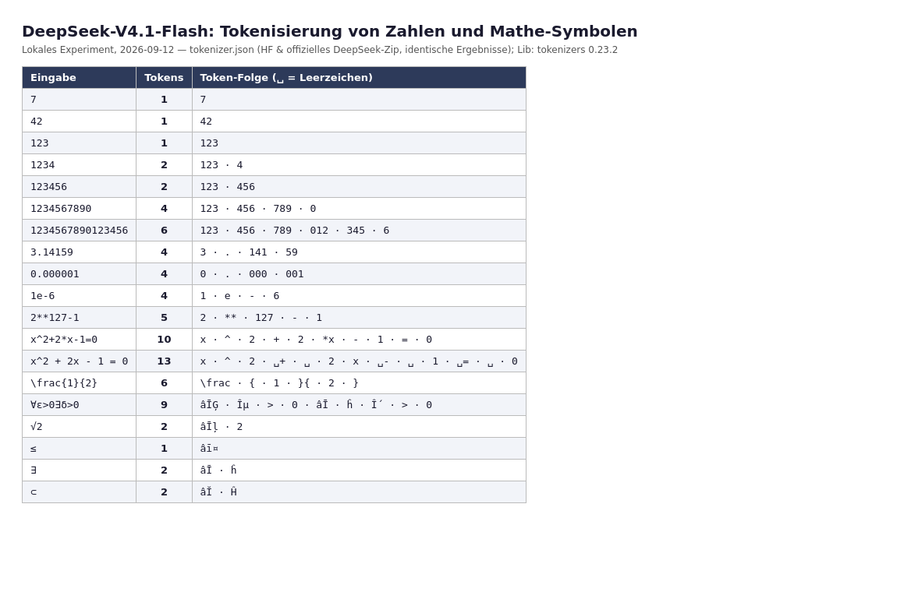

# DeepSeek-V4.1-Flash: Tokenizer, Zahlen-Tokenisierung und Mathe-Symbole

## Was der Tokenizer ist (Primärquellen)

Das Modell nutzt einen **Byte-Level-BPE-Tokenizer** (GPT-2-Bauart, `type: BPE`, kein `byte_fallback`, kein UNK-Token): 128.000 BPE-Vokabeleinträge, 127.741 Merges und 1.283 Added/Special-Tokens (drei davon auf bestehenden IDs 0–2); insgesamt 129.280 eindeutige Token-IDs — identisch mit `vocab_size` in der `config.json` [tokenizer.json](https://huggingface.co/deepseek-ai/DeepSeek-V4.1-Flash/blob/main/tokenizer.json, accessed 2026-09-12) [config.json](https://huggingface.co/deepseek-ai/DeepSeek-V4.1-Flash/raw/main/config.json, accessed 2026-09-12). Der Normalizer ist leer (keine Unicode-Vorverarbeitung) [tokenizer.json](https://huggingface.co/deepseek-ai/DeepSeek-V4.1-Flash/blob/main/tokenizer.json, accessed 2026-09-12).

DeepSeek stellt den Tokenizer auch offiziell offline bereit (`deepseek_v4_tokenizer.zip` mit `tokenizer.json`, `tokenizer_config.json` und `deepseek_tokenizer.py`) [Token & Token Usage](https://api-docs.deepseek.com/quick_start/token_usage, accessed 2026-09-12). Die offizielle Doku nennt die grobe Konversionsrate „1 English character ≈ 0.3 token" und zählt als typische Einheit „a Chinese word, an English word, a number, or a symbol" [Token & Token Usage](https://api-docs.deepseek.com/quick_start/token_usage, accessed 2026-09-12).

Entscheidend für Zahlen ist die **Pre-Tokenization**: Der erste Split-Regelblock isoliert Ziffernläufe und schneidet sie in Gruppen von höchstens drei Ziffern (`\p{N}{1,3}`, `behavior: Isolated`) — noch vor der Byte-Level-BPE [tokenizer.json](https://huggingface.co/deepseek-ai/DeepSeek-V4.1-Flash/blob/main/tokenizer.json, accessed 2026-09-12). Danach folgen CJK-Split, ein Kontraktions-/Wort-/Interpunktions-Split und die Byte-Level-Stufe (`use_regex: false`) [tokenizer.json](https://huggingface.co/deepseek-ai/DeepSeek-V4.1-Flash/blob/main/tokenizer.json, accessed 2026-09-12).

## Lokales Experiment (Methode)

Am 2026-09-12 wurden beide verfügbaren Tokenizer-Dateien (HF-Repo und offizielles DeepSeek-Zip) mit `tokenizers` 0.23.2 unter Python 3.12 geladen und auf identische Test-Strings angewandt. Ergebnis: Auf allen getesteten Eingaben liefern beide **identische Token-IDs** (Dateigrößen 6.367.096 vs. 6.367.257 Bytes; Unterschied nur in Metadaten/Normalisierung). Die Messreihe umfasst 19 Tabellen-Einträge (Abbildung 1) plus die im Text einzeln genannten Einzelmessungen; eine Vollerhebung des Vokabulars ist es nicht. Messskript und Rohdaten liegen dauerhaft im Wiki bei: `assets/01-03-messskript.py`, `assets/01-03-rohdaten-symbole.txt`, `assets/01-03-rohdaten-bausteine.txt`. Die folgende Tabelle ist ein lokales Experiment-Ergebnis, keine offizielle Dokumentation; die zugrunde liegenden Artefakte sind Primärquellen [tokenizer.json](https://huggingface.co/deepseek-ai/DeepSeek-V4.1-Flash/blob/main/tokenizer.json, accessed 2026-09-12) [Offizieller Tokenizer](https://cdn.deepseek.com/api-docs/deepseek_v4_tokenizer.zip, accessed 2026-09-12).

*Abbildung 1: Lokale Tokenisierungsmessung vom 2026-09-12 (␣ = Leerzeichen; Symbole als Byte-Level-Repräsentation, z. B. „âĪĢ" = UTF-8-Bytes E2 88 80 = ∀). Quelle der Daten: tokenizer.json-Artefakte beider Bezugswege.*

## Befunde: Zahlen

- **Ein- bis dreistellige Zahlen sind genau ein Token** (`7`, `42`, `123` → je 1 Token). Ab vier Stellen greift die 3er-Gruppierung: `1234` → `['123','4']` (2 Tokens), `123456` → `['123','456']` (2 Tokens), `1234567890` → `['123','456','789','0']` (4 Tokens).
- **Lange Zahlen kosten etwa ein Token je drei Ziffern**: eine 45-stellige Zahl → 15 Tokens (nachgemessen am 12.09.2026, zwei Ziffernmuster); `123456789012345678901234567890` (30 Ziffern) → 10 Tokens. Kein Ziffernlauf über drei Stellen wird je als ein Token kodiert.
- **Dezimaltrennzeichen und Vorzeichen sind eigene Tokens**: `3.14159` → `['3','.','141','59']`; `0.000001` → `['0','.','000','001']`; `-17` → `['-','17']`; rationale Schreibweise `1/2` → `['1','/','2']`.
- **Wissenschaftliche Notation wird nicht kompakt kodiert**: `1e-6` → `['1','e','-','6']` (4 Tokens), `1e308` → 3 Tokens; ein Exponent wie `10^6` kostet 3 Tokens.
- **Tausendertrenner helfen nicht**: `1,000,000` und `1 000 000` kosten je 5 Tokens — die Separatoren kosten jeweils ein Token.

## Befunde: Operatoren, Symbole, LaTeX

- **Gängige ASCII-Operatoren und Sonderformen sind Einzeltokens**: `+`, `-`, `=`, `^` je 1; bemerkenswert: `**` (Potenz in Python-Syntax) ist **ein** Token, und `*x` verschmilzt zu einem Token. `2**127-1` kostet nur 5 Tokens, genauso wie `2^127-1`.
- **Leerzeichen kosten Tokens**: Dieselbe Gleichung `x^2+2*x-1=0` benötigt kompakt **10** Tokens, mit Leerzeichen (`x^2 + 2x - 1 = 0`) **13** Tokens — Leerzeichen vor Operatoren werden teils an den Operator gemerged (`␣+`, `␣-`, `␣=`), teils stehen sie als eigene Tokens (`␣`).
- **Unicode-Mathe-Symbole sind gemischt**: Ein Token für häufige Zeichen (∀, ≤, ≥, ≈, ∈, ∫, √, ∑, π, ∞, ×, ÷, ∂, ∇, ¬, ∧, ∪, ∩, ℝ und alle getesteten griechischen Buchstaben), **zwei Tokens** für seltenere (∃, ∨, ↔, ⊢, ⊨, ∉, ⊂, ⊆, ∅, ∮, ℵ, ℏ sowie ℕ, ℤ, ℚ, ℂ). Ursache ist die Byte-Level-Kodierung: 3-Byte-Zeichen werden nur dann je zu einem Token gemerged, wenn der Merge im Vokabular existiert. `∀ε>0∃δ>0` kostet damit 9 Tokens für 8 Zeichen.
- **LaTeX-Bruch kostet 6 Tokens**: `\frac{1}{2}` → `['\frac','{','1','}{','2','}']` — `\frac` ist ein Token, aber die Klammerstruktur zerfällt.
- **Indizes, Vektoren, Klammern** (Rohdaten: `assets/01-03-rohdaten-bausteine.txt`): `x_1` 3 Tokens, `x_{12}` 4, `a_{i,j}` 5, `\vec{v}` 4, `\hat{x}` 3, `\sum_{i=1}^{n}` 8, `\int_0^1` 5, `\mathbb{R}` 3, `A^T` 3, `A^{-1}` 4; einfache Tupel bleiben günstig (`(a,b)`, `[a,b]`, `{a,b}` je 3 Tokens).

## Steuer- und Special-Tokens

Die Spezialtokens des Prompt-Formats sind Einzel-IDs im Vokabular: `<｜begin▁of▁sentence｜>` = 0, `<｜end▁of▁sentence｜>` = 1, `<｜System｜>` = 128799, `<｜User｜>` = 128803, `<｜Assistant｜>` = 128804, `<think>` = 128821, `</think>` = 128822, `<｜latest_reminder｜>` = 128828, `<｜action｜>` = 128829 u. a.; `<｜deepseek_image｜>` = 129264 entspricht `image_token_id` der `config.json` [tokenizer.json](https://huggingface.co/deepseek-ai/DeepSeek-V4.1-Flash/blob/main/tokenizer.json, accessed 2026-09-12) [config.json](https://huggingface.co/deepseek-ai/DeepSeek-V4.1-Flash/raw/main/config.json, accessed 2026-09-12). Das Denkformat nutzt `<think>`/`</think>` als Blockgrenzen; im chat-Modus wird der Denkblock sofort geschlossen [encoding/README](https://huggingface.co/deepseek-ai/DeepSeek-V4.1-Flash/blob/main/encoding/README.md, accessed 2026-09-12).

## Implikationen für Arithmetik (Brücke zu Cluster 02)

*Eigene Analyse auf Basis der Messungen; die übergreifende Forschungsliteratur dazu bündelt Cluster 02 (geplant: `02-01-tokenisierung-arithmetik.md`).*

1. **Stellenwert-Grenzen:** Da Ziffernläufe bei drei Stellen geschnitten werden, liegen Ziffern einer mehrstelligen Zahl regelmäßig in getrennten Tokens („123|4"): Schriftliches Rechnen über Stellenwertgrenzen (Übertrag) ist damit ein Vorgang über Token-Grenzen hinweg. Ob und wie stark das die Genauigkeit senkt, ist eine empirische Frage des A/B-Tests, nicht dieses Artikels (Markierung: Hypothese).
2. **3er-Gruppierung als Chance:** Die Gruppierung entspricht der Tausender-Gliederung — Notationen, die ihre Zahlen ebenfalls in 3er-Blöcken strukturieren, sprechen die native Tokenisierung an (Hypothese, testbar über Token-Zählungen).
3. **Kompaktheit ist messbar:** Whitespace und Klammerstrukturen kosten Tokens (13 vs. 10 Tokens für dieselbe Gleichung; 6 Tokens für einen LaTeX-Bruch). Eine Notation, die Formeln ohne Leerraum, mit ASCII-Operatoren und ohne LaTeX-Klammerwälder schreibt, spart im gemessenen Rahmen ~20–30 % Output-Tokens (lokale Messung; Stichprobe klein).
4. **Symbol-Wahl ist Token-ökonomisch messbar:** Bevorzugt man ein-tokenige Symbole (∀, ∈, ∫) gegenüber zwei-tokenigen (∃, ⊂, ⊆), sinkt der Tokenpreis pro Symbol um die Hälfte (lokale Messung).

## Grenzen des Befunds

- Die Messungen decken ASCII-Zahlen, gängige Operatoren, eine Auswahl an Unicode-Symbolen und zwei LaTeX-Konstrukte ab; das Ergebnis ist nicht auf das Gesamtvokabular generalisiert.
- Ob der Inferenz-Server des Modells exakt denselben Tokenizer (inkl. Added-Tokens-Reihenfolge) verwendet, ist aus den öffentlichen Quellen ableitbar, aber nicht unabhängig verifiziert *[unkenntlich — keine Quelle gefunden]*.
- Eine unabhängige, veröffentlichte Analyse der Zahlen-Tokenisierung von V4.1-Flash war zum Recherchezeitpunkt nicht auffindbar (Release vor 2 Tagen).

## Quellen

1. DeepSeek-AI (2026): tokenizer.json des Modells DeepSeek-V4.1-Flash. Hugging Face. https://huggingface.co/deepseek-ai/DeepSeek-V4.1-Flash/blob/main/tokenizer.json (accessed 2026-09-12)
2. DeepSeek (2026): Token & Token Usage (inkl. deepseek_v4_tokenizer.zip). API-Dokumentation. https://api-docs.deepseek.com/quick_start/token_usage (accessed 2026-09-12)
3. DeepSeek-AI (2026): config.json (vocab_size, image_token_id). Hugging Face. https://huggingface.co/deepseek-ai/DeepSeek-V4.1-Flash/raw/main/config.json (accessed 2026-09-12)
4. DeepSeek-AI (2026): encoding/README.md (Prompt-Format, Special-Tokens). Hugging Face. https://huggingface.co/deepseek-ai/DeepSeek-V4.1-Flash/blob/main/encoding/README.md (accessed 2026-09-12)
5. Lokales Experiment 2026-09-12: `tokenizers` 0.23.2; Messskript `assets/01-03-messskript.py`, Rohdaten `assets/01-03-rohdaten-symbole.txt` und `assets/01-03-rohdaten-bausteine.txt`; offizielles Zip via cdn.deepseek.com (siehe Quelle 2).
