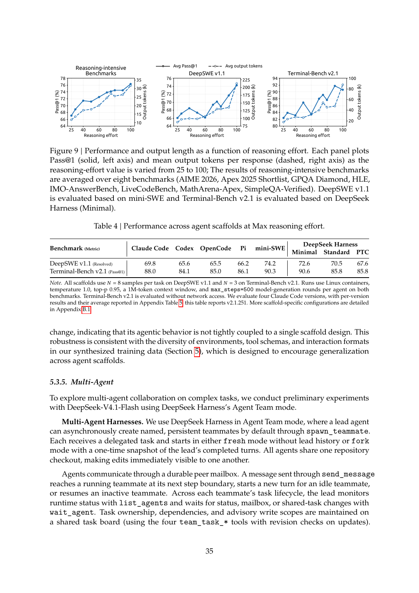

# DeepSeek-V4.1-Flash: Training, Reasoning-Modi und Fähigkeiten

## Überblick

DeepSeek-V4.1-Flash ist ein multimodales Mixture-of-Experts-Modell mit 552B Backbone-Parametern, das Bilder und Text nativ verarbeitet, im Decode 16B und im Prefill 8B Parameter pro Token aktiviert und Kontexte bis eine Million Tokens verarbeitet [Model Card](https://huggingface.co/deepseek-ai/DeepSeek-V4.1-Flash, accessed 2026-09-12). Das Training umfasst ein Pretraining auf einem multimodalen Korpus von 45T Tokens und ein Post-Training nach dem Muster SFT → RL → On-Policy Distillation (OPD) ohne algorithmische Neuerungen [Tech Report](https://huggingface.co/deepseek-ai/DeepSeek-V4.1-Flash/blob/main/DeepSeek_V41_Tech_Report.pdf, accessed 2026-09-12). Die Instruct-Version erlaubt einen kontinuierlich steuerbaren Reasoning-Aufwand zwischen 1 und 100 und läuft seit September 2026 in der Produktionsbereitstellung des Herstellers [Model Card](https://huggingface.co/deepseek-ai/DeepSeek-V4.1-Flash, accessed 2026-09-12) [Tech Report](https://huggingface.co/deepseek-ai/DeepSeek-V4.1-Flash/blob/main/DeepSeek_V41_Tech_Report.pdf, accessed 2026-09-12). Alle im Text genannten Leistungswerte stammen aus Hersteller-eigenen Evaluationen [Model Card](https://huggingface.co/deepseek-ai/DeepSeek-V4.1-Flash, accessed 2026-09-12).

## Pretraining

Das Pretraining umfasst 45T Tokens; die sparse Attention wird von Beginn an bei 64K Sequenzlänge trainiert, ohne dichte Vorstufe, und ab 34T Tokens auf Sequenzen bis 1M Tokens erweitert [Tech Report](https://huggingface.co/deepseek-ai/DeepSeek-V4.1-Flash/blob/main/DeepSeek_V41_Tech_Report.pdf, accessed 2026-09-12) [Model Card](https://huggingface.co/deepseek-ai/DeepSeek-V4.1-Flash, accessed 2026-09-12). Die Batch-Größe bleibt konstant bei 100,6 Millionen Tokens; nach 2000 Schritten Warmup bleibt die Lernrate bis 28T Tokens bei 2,6 × 10⁻⁴, sinkt bis 40T Tokens kosinusförmig auf 2,6 × 10⁻⁵ und bleibt bis Trainingsende konstant [Tech Report](https://huggingface.co/deepseek-ai/DeepSeek-V4.1-Flash/blob/main/DeepSeek_V41_Tech_Report.pdf, accessed 2026-09-12). Als Optimierer dienen Muon für lineare Transformationen, AdamW für RMSNorm- und übrige Parameter sowie Sinkhorn-balancierte Updates für Embeddings und Prediction Head [Tech Report](https://huggingface.co/deepseek-ai/DeepSeek-V4.1-Flash/blob/main/DeepSeek_V41_Tech_Report.pdf, accessed 2026-09-12).

Der Korpus vereinigt Text- und Multimodaldaten im Token-Verhältnis 7:1 [Tech Report](https://huggingface.co/deepseek-ai/DeepSeek-V4.1-Flash/blob/main/DeepSeek_V41_Tech_Report.pdf, accessed 2026-09-12). Multimodale Daten stammen aus Bild-Text-Paaren, verschachtelten Bild-Text-Dokumenten — überwiegend aus Webseiten und PDFs, mehrstufig gefiltert und mit SmolVLM qualitätsbewertet — und domänenspezifischen Datensätzen für Grounding, OCR und Long-Tail-Wissen; hinzu kommen Bild-Code-Paare und Computer-Use-Trajektorien für multimodales agentisches Verständnis; die Daten werden bewusst in ursprünglicher Webform genutzt statt großflächig synthetisiert [Tech Report](https://huggingface.co/deepseek-ai/DeepSeek-V4.1-Flash/blob/main/DeepSeek_V41_Tech_Report.pdf, accessed 2026-09-12). In der Textkuratierung werden modellgenerierte Inhalte mit geringem Informationsgewinn gefiltert und verstärkt aktueller Code aus Open-Source-Repositories aufgenommen [Tech Report](https://huggingface.co/deepseek-ai/DeepSeek-V4.1-Flash/blob/main/DeepSeek_V41_Tech_Report.pdf, accessed 2026-09-12).

Der Vision-Encoder DeepSeek-ViT wird separat trainiert: zunächst kontrastiv mit SigLIP-Verlust auf rund 47B Bild-Text-Paaren bei maximal 224 × 224 Pixeln, danach autoregressiv an einem 4B-MoE-Sprachmodell auf 236B Tokens aus Bildbeschreibungen, Alt-Texten, Diagrammen und OCR; das Hilfs-Sprachmodell wird danach verworfen [Tech Report](https://huggingface.co/deepseek-ai/DeepSeek-V4.1-Flash/blob/main/DeepSeek_V41_Tech_Report.pdf, accessed 2026-09-12).

## Post-Training (SFT, RL, On-Policy Distillation)

Der Bericht betont, dass keine neuen Post-Training-Algorithmen eingeführt werden: Auf SFT folgen Reinforcement Learning und zuletzt OPD [Tech Report](https://huggingface.co/deepseek-ai/DeepSeek-V4.1-Flash/blob/main/DeepSeek_V41_Tech_Report.pdf, accessed 2026-09-12). Die Neuerungen liegen in der Datenpipeline: automatisierte Synthese verifizierbarer Aufgaben samt Lösungen und Reward-Signalen, Konstruktion interaktiver Agentenumgebungen sowie Filterung, Deduplizierung und Schwierigkeitskalibrierung [Tech Report](https://huggingface.co/deepseek-ai/DeepSeek-V4.1-Flash/blob/main/DeepSeek_V41_Tech_Report.pdf, accessed 2026-09-12). Jede Aufgabe wird als Tripel aus Problem, Umgebung und Verifikationssystem formalisiert und über die Dimensionen Schwierigkeit und Korrektheit bewertet, die zugleich als Reward für das Training der Aufgabenkonstruktion dienen [Tech Report](https://huggingface.co/deepseek-ai/DeepSeek-V4.1-Flash/blob/main/DeepSeek_V41_Tech_Report.pdf, accessed 2026-09-12). Coding-Agenten-Umgebungen entstehen aus internen und externen Agentensitzungen sowie öffentlichen GitHub-Repositories ab einem Sterne-Schwellenwert; spezialisierte Agenten bauen, testen, inspizieren und reparieren sie [Tech Report](https://huggingface.co/deepseek-ai/DeepSeek-V4.1-Flash/blob/main/DeepSeek_V41_Tech_Report.pdf, accessed 2026-09-12).

Das RL skaliert über Trainingscompute und Scaffold-Anzahl, läuft asynchron und wird über Model-Merging aufeinanderfolgender Läufe reinitialisiert [Tech Report](https://huggingface.co/deepseek-ai/DeepSeek-V4.1-Flash/blob/main/DeepSeek_V41_Tech_Report.pdf, accessed 2026-09-12). Rollouts laufen unterbrechungssicher getrennt vom Trainingspool; die hauseigene Sandbox-Plattform DSec bewältigt dabei Millionen gleichzeitiger Instanzen [Tech Report](https://huggingface.co/deepseek-ai/DeepSeek-V4.1-Flash/blob/main/DeepSeek_V41_Tech_Report.pdf, accessed 2026-09-12).

Die abschließende OPD-Stufe trainiert im Vollvokabular über Datensätze aller Domänen mit über 40 Lehrermodellen aus verschiedenen Entwicklungsstufen, die sich architektonisch unterscheiden dürfen; Datenmischung und aktive Lehrer sind zur Laufzeit anpassbar [Tech Report](https://huggingface.co/deepseek-ai/DeepSeek-V4.1-Flash/blob/main/DeepSeek_V41_Tech_Report.pdf, accessed 2026-09-12). Der Bericht folgert, dass der Grenzertrag der Daten- und Umgebungsentwicklung über dem algorithmischer Neuerungen liegt [Tech Report](https://huggingface.co/deepseek-ai/DeepSeek-V4.1-Flash/blob/main/DeepSeek_V41_Tech_Report.pdf, accessed 2026-09-12).

## Reasoning-Modi und Steuerung

Im RL wird ein skalarer Effort-Wert b ∈ {1, …, 100} an den Systemprompt gehängt („Reasoning Effort: {effort} (range 1–100; higher values request more thorough reasoning)“) und konditioniert ein- wie mehrstufige Aufgaben [Tech Report](https://huggingface.co/deepseek-ai/DeepSeek-V4.1-Flash/blob/main/DeepSeek_V41_Tech_Report.pdf, accessed 2026-09-12). Belohnungen werden innerhalb gleicher Effort-Stufen zentriert, die Längenstrafe sinkt exponentiell mit dem Effort; zur Deployment-Zeit sind interpolierte Zwischenwerte nutzbar [Tech Report](https://huggingface.co/deepseek-ai/DeepSeek-V4.1-Flash/blob/main/DeepSeek_V41_Tech_Report.pdf, accessed 2026-09-12). Die Produktions-API führt drei Stufen: max = 100, high = 75, low = 50 [Tech Report](https://huggingface.co/deepseek-ai/DeepSeek-V4.1-Flash/blob/main/DeepSeek_V41_Tech_Report.pdf, accessed 2026-09-12).

Laut API-Dokumentation ist der Denkmodus standardmäßig aktiv (Stufe high); schalten lässt er sich über den `thinking`-Parameter, der Aufwand über `reasoning_effort` (low, high, max) [API-Doku: Thinking Mode](https://api-docs.deepseek.com/guides/thinking_mode, accessed 2026-09-12). Weitere angeforderte Stufen werden abgebildet: minimal und low auf low, medium, high und xhigh auf high, max und ultra auf max [API-Doku: Thinking Mode](https://api-docs.deepseek.com/guides/thinking_mode, accessed 2026-09-12). Im Denkmodus haben `temperature`, `presence_penalty` und `frequency_penalty` keine Wirkung, `top_p` hat eine Untergrenze von 0.95; im Nicht-Denkmodus ist `top_p` auf 1.0 fixiert [API-Doku: Thinking Mode](https://api-docs.deepseek.com/guides/thinking_mode, accessed 2026-09-12). Die Gedankenkette erscheint als `reasoning_content` auf derselben Ebene wie `content`; bei Anfragen mit Tools muss sie in allen Folgeanfragen vollständig zurückgesendet werden, sonst antwortet die API mit Fehler 400, ohne Tools wird sie ignoriert [API-Doku: Thinking Mode](https://api-docs.deepseek.com/guides/thinking_mode, accessed 2026-09-12).

Im Prompt-Format markieren `<think>` und `</think>` den Reasoning-Block; im chat-Modus setzt die Referenzimplementierung direkt nach dem Assistant-Präfix ein `</think>`, sodass das Modell ohne Denkblock antwortet [Encoding-Referenz](https://huggingface.co/deepseek-ai/DeepSeek-V4.1-Flash/blob/main/encoding/README.md, accessed 2026-09-12). Der Effort-Präfix wird nur im thinking-Modus gerendert und nur am Gesprächsanfang eingefügt — konsistent mit dem RL-Format, das die Instruktion an den Systemprompt hängt (siehe oben); im chat-Modus ist damit keine Effort-Steuerung vorgesehen. Die Referenz akzeptiert ganze Zahlen von 1 bis 100 sowie die Aliasse low (50), high (75) und max (100), Standard ist high (75) [Encoding-Referenz](https://huggingface.co/deepseek-ai/DeepSeek-V4.1-Flash/blob/main/encoding/README.md, accessed 2026-09-12). Der Parameter `drop_thinking` (Standard True) entfernt Reasoning früherer Assistenten-Turns vor der letzten Nutzernachricht, wird bei Tool-Nutzung aber automatisch deaktiviert, damit Werkzeugaufrufe über mehrere Schritte nachvollziehbar bleiben [Encoding-Referenz](https://huggingface.co/deepseek-ai/DeepSeek-V4.1-Flash/blob/main/encoding/README.md, accessed 2026-09-12). Tool-Aufrufe werden in `<｜DSML｜ calls>`-Blöcke gefasst, deren Tag-Namen (`calls`, `invoke`, `parameter`) in V4.1 ein führendes Leerzeichen tragen, anders als im V4-Format [Encoding-Referenz](https://huggingface.co/deepseek-ai/DeepSeek-V4.1-Flash/blob/main/encoding/README.md, accessed 2026-09-12).

Zur Wirkung der Steuerung: Eine Erhöhung von 25 auf 100 hebt den mittleren Pass@1 über acht reasoning-intensive Benchmarks von 67,1 % auf 76,3 %, auf DeepSWE v1.1 von 66,0 % auf 74,2 % und auf Terminal-Bench 2.1 von 82,4 % auf 90,6 %, bei etwa 2,5-fachem Ausgabevolumen [Tech Report](https://huggingface.co/deepseek-ai/DeepSeek-V4.1-Flash/blob/main/DeepSeek_V41_Tech_Report.pdf, accessed 2026-09-12). Der Bereich 60–80 erreicht den Großteil der Genauigkeit des Maximums zu weniger als der Hälfte des Token-Budgets, während der letzte Schritt zu 100 Trajektorien um das 1,6- bis 1,8-Fache verlängert [Tech Report](https://huggingface.co/deepseek-ai/DeepSeek-V4.1-Flash/blob/main/DeepSeek_V41_Tech_Report.pdf, accessed 2026-09-12). Auf Mathematik-Benchmarks wächst die mittlere Antwortlänge zwischen Effort 25 und 100 bei AIME 2026 von 4,6k auf 11,4k Tokens und bei MathArena Apex 2025 von 29,1k auf 86,1k Tokens; MathArena Apex 2025 gewinnt 40,3 Punkte (25,3 % → 65,6 %), die Apex-2025-Shortlist 11,5 Punkte, ohne dass ein Benchmark bei steigendem Effort zurückfällt [Tech Report](https://huggingface.co/deepseek-ai/DeepSeek-V4.1-Flash/blob/main/DeepSeek_V41_Tech_Report.pdf, accessed 2026-09-12).

Die Kernwerte als Tabelle:

| Effort 25 → 100 | Pass@1 bei 25 | Pass@1 bei 100 |
| :--- | :---: | :---: |
| 8 reasoning-intensive Benchmarks (Ø) | 67,1 % | 76,3 % |
| DeepSWE v1.1 | 66,0 % | 74,2 % |
| Terminal-Bench 2.1 | 82,4 % | 90,6 % |

*Abbildung 1: Performance und Output-Länge über den Reasoning-Effort (Figure 9 des Tech-Reports, S. 35) (Quelle: [Tech Report](https://huggingface.co/deepseek-ai/DeepSeek-V4.1-Flash/blob/main/DeepSeek_V41_Tech_Report.pdf, accessed 2026-09-12)).*

## Mathe- und Code-Fähigkeiten laut Primärquellen

Für das Basismodell nennt die Model Card BigCodeBench 60,6 (Pass@1, 3-shot), HumanEval 79,4 (Pass@1, 0-shot), GSM8K 93,0 (EM, 8-shot), MATH 61,1 (EM, 4-shot) und MGSM 80,2 (EM, 8-shot) [Model Card](https://huggingface.co/deepseek-ai/DeepSeek-V4.1-Flash, accessed 2026-09-12). BigCodeBench, HumanEval und GSM8K liegen über beiden Vorgängern (DeepSeek-V4-Flash-Base und DeepSeek-V4-Pro-Base), MATH bleibt mit 61,1 unter dem Wert von V4-Pro-Base (64,5), und MGSM liegt mit 80,2 unter beiden Vorgängermodellen (85,7 und 84,4) [Model Card](https://huggingface.co/deepseek-ai/DeepSeek-V4.1-Flash, accessed 2026-09-12). Die Model Card betont, dass Basismodelle intern unter gleichen Einstellungen evaluiert wurden und Werte innerhalb von 0,3 Punkten als gleichwertig gelten [Model Card](https://huggingface.co/deepseek-ai/DeepSeek-V4.1-Flash, accessed 2026-09-12).

Für die Instruct-Version werden alle Werte bei maximalem Effort (`reasoning_effort=100`) mit `temperature=1.0, top_p=0.95` berichtet [Model Card](https://huggingface.co/deepseek-ai/DeepSeek-V4.1-Flash, accessed 2026-09-12): Codeforces 3471 gegen 3289 (V4-Flash) und 3348 (V4-Pro), MathArena Apex 65,6 % Pass@1 gleichauf mit Kimi K3 (65,6 %) und vor V4-Pro (65,3 %), GPQA Diamond 90,9 % sowie HLE 36,8 % beziehungsweise 39,1 % im text-only Teilsatz [Model Card](https://huggingface.co/deepseek-ai/DeepSeek-V4.1-Flash, accessed 2026-09-12). Die acht Benchmarks der Effort-Skalierung sind AIME 2026, Apex 2025 Shortlist, GPQA Diamond, HLE, IMO-AnswerBench, LiveCodeBench, MathArena-Apex und SimpleQA-Verified [Tech Report](https://huggingface.co/deepseek-ai/DeepSeek-V4.1-Flash/blob/main/DeepSeek_V41_Tech_Report.pdf, accessed 2026-09-12). Alle Angaben sind Hersteller-eigene Evaluationen, teils auf internen Benchmarks wie Codeforces [Tech Report](https://huggingface.co/deepseek-ai/DeepSeek-V4.1-Flash/blob/main/DeepSeek_V41_Tech_Report.pdf, accessed 2026-09-12); unabhängige Reproduktionen werden in den Quellen nicht berichtet.

## Lücken und offene Punkte

Der Bericht nennt weder Volumen noch Mischungsverhältnis der SFT-Daten *[unkenntlich — keine Quelle gefunden]*; RL-Algorithmen und Hyperparameter werden nicht spezifiziert (betont wird nur, dass keine neuen Algorithmen eingeführt wurden), und Hinweise zu Seeds oder Wiederholbarkeit der Evaluationen fehlen [Tech Report](https://huggingface.co/deepseek-ai/DeepSeek-V4.1-Flash/blob/main/DeepSeek_V41_Tech_Report.pdf, accessed 2026-09-12). Offen bleibt auch, welche endliche Menge von Effort-Stufen im RL trainiert wurde und wie die drei API-Stufen darin verankert sind; die Angaben unterscheiden sich: kontinuierlich 1–100 in der Encoding-Referenz, benannte Stufen in der API-Dokumentation [Encoding-Referenz](https://huggingface.co/deepseek-ai/DeepSeek-V4.1-Flash/blob/main/encoding/README.md, accessed 2026-09-12) [API-Doku: Thinking Mode](https://api-docs.deepseek.com/guides/thinking_mode, accessed 2026-09-12). Nicht dargelegt ist zudem die Verteilung von chat- und thinking-Trajektorien in den Trainingsdaten *[unkenntlich — keine Quelle gefunden]*. Schließlich fehlen unabhängig erhobene Mathematik-Benchmarks; AIME 2026 und MathArena Apex 2025 über Effort-Stufen erscheinen nur grafisch, nicht als Tabelle [Tech Report](https://huggingface.co/deepseek-ai/DeepSeek-V4.1-Flash/blob/main/DeepSeek_V41_Tech_Report.pdf, accessed 2026-09-12).

## Quellen

1. DeepSeek-AI: *DeepSeek-V4.1-Flash: Pushing the Limits of KV Cache Compression* (Technical Report, PDF). https://huggingface.co/deepseek-ai/DeepSeek-V4.1-Flash/blob/main/DeepSeek_V41_Tech_Report.pdf (accessed 2026-09-12)
2. DeepSeek-AI: *DeepSeek-V4.1-Flash Model Card* (Hugging Face Repository). https://huggingface.co/deepseek-ai/DeepSeek-V4.1-Flash (accessed 2026-09-12)
3. DeepSeek-AI: *DeepSeek-V4.1 text and vision encoding* (Referenzimplementation und README). https://huggingface.co/deepseek-ai/DeepSeek-V4.1-Flash/blob/main/encoding/README.md (accessed 2026-09-12)
4. DeepSeek: *Thinking Mode* (DeepSeek API Docs). https://api-docs.deepseek.com/guides/thinking_mode (accessed 2026-09-12)
