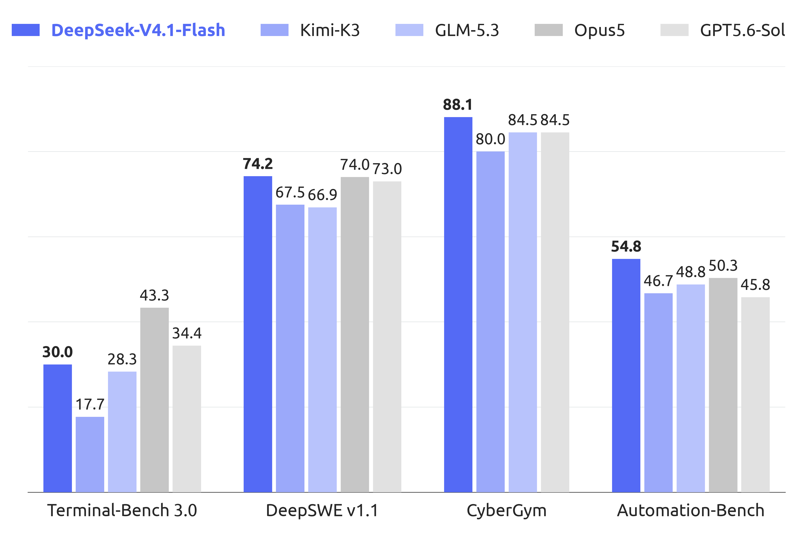
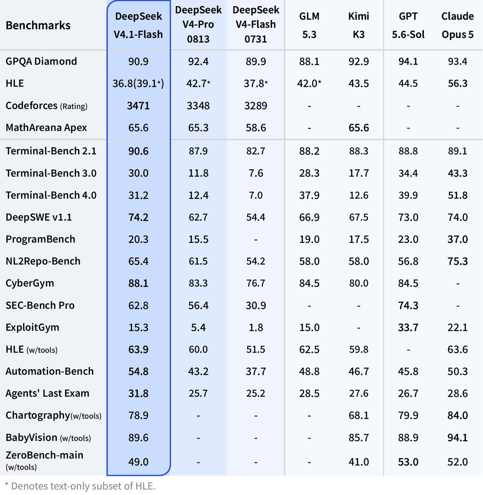

# DeepSeek-V4.1-Flash: Benchmarks, Stärken und Grenzen

## Überblick

DeepSeek hat DeepSeek-V4.1-Flash am 10. September 2026 veröffentlicht und als kleinste Variante der neuen Architekturfamilie positioniert; das Modell ist als API-Modell unter dem Namen `deepseek-flash` und zugleich als offene Gewichte unter MIT-Lizenz verfügbar [Release-News V4.1](https://api-docs.deepseek.com/news/news260910, accessed 2026-09-12) [Model Card](https://huggingface.co/deepseek-ai/DeepSeek-V4.1-Flash, accessed 2026-09-12). Der Hersteller erklärt, „Tests by multiple parties“ zeigten V4.1-Flash bei Leistung, Kosten, Geschwindigkeit und Gesamtlaufzeit vor dem bisherigen Flaggschiff V4-Pro (eine unabhängige Bestätigung dieser Tests ist nicht dokumentiert); infolgedessen wird V4-Pro ausgemustert und V4-Flash stillgelegt [Release-News V4.1](https://api-docs.deepseek.com/news/news260910, accessed 2026-09-12) [IT之家](https://www.ithome.com/1/000/719.htm, accessed 2026-09-12). Preislich liegt V4.1-Flash off-peak bei $0.15 (Cache-Miss-Input) und $0.6 (Output) pro 1M Token — rund ein Viertel der V4-Pro-Preise ($0.66/$1.98) [Models & Pricing](https://api-docs.deepseek.com/quick_start/pricing, accessed 2026-09-12). Alle in diesem Dokument genannten Benchmark-Zahlen sind Hersteller-eigene Evaluationen: Die Basiswerte stammen aus Deepseeks internem Evaluationsrahmen, die Instruct-Werte gelten für maximalen Reasoning-Aufwand (`reasoning_effort=100`) bei `temperature=1.0, top_p=0.95` [Tech Report](https://huggingface.co/deepseek-ai/DeepSeek-V4.1-Flash/blob/main/DeepSeek_V41_Tech_Report.pdf, accessed 2026-09-12) [Model Card](https://huggingface.co/deepseek-ai/DeepSeek-V4.1-Flash, accessed 2026-09-12). Unabhängige Reproduktionen der Zahlen waren bis zum Stichtag 12. September 2026 nicht auffindbar (siehe „Dokumentierte Schwächen“).

## Benchmarks Basis-Modell

Die drei Base-Checkpoints wurden unter identischen Einstellungen verglichen; Punktabstände bis 0,3 gelten den Autoren als gleichwertig [Model Card](https://huggingface.co/deepseek-ai/DeepSeek-V4.1-Flash, accessed 2026-09-12). V4.1-Flash-Base liegt bei MMLU-Pro (74,1), BigCodeBench (60,6), HumanEval (79,4) und GSM8K (93,0) vor beiden Vorgängern; zurück liegt er gegenüber V4-Pro-Base bei MATH (61,1 zu 64,5), SimpleQA-Verified (42,3 zu 55,2) und LongBench-V2 (45,2 zu 51,5) sowie gegenüber V4-Flash-Base bei MGSM (80,2 zu 85,7) und DROP (87,9 zu 88,6) [Model Card](https://huggingface.co/deepseek-ai/DeepSeek-V4.1-Flash, accessed 2026-09-12). Die multimodalen Benchmarks weist die Tabelle nur für V4.1-Flash-Base aus [Model Card](https://huggingface.co/deepseek-ai/DeepSeek-V4.1-Flash, accessed 2026-09-12).

| Benchmark (Metrik) | Shots | V4-Flash-Base (284B/13B) | V4-Pro-Base (1,6T/49B) | V4.1-Flash-Base (552B/8B–16B) |
| :--- | :---: | :---: | :---: | :---: |
| **Weltwissen** | | | | |
| AGIEval (EM) | 3–5 | 83,9 | 84,4 | 83,4 |
| MMLU-Pro (EM) | 5 | 68,3 | 73,5 | 74,1 |
| C-Eval (EM) | 5 | 92,1 | 93,1 | 92,1 |
| MultiLoKo (LLM-Judge) | 5 | 42,6 | 50,9 | 45,5 |
| SimpleQA-Verified (EM) | 25 | 30,1 | 55,2 | 42,3 |
| SuperGPQA (EM) | 5 | 46,5 | 53,9 | 53,1 |
| **Sprache & Reasoning** | | | | |
| BBH (EM) | 3 | 86,9 | 87,5 | 86,1 |
| BBEH (EM) | 1 | 25,4 | 29,8 | 27,2 |
| DROP (F1) | 1 | 88,6 | 88,7 | 87,9 |
| HellaSwag (EM) | 0 | 85,7 | 88,0 | 87,2 |
| **Code & Mathe** | | | | |
| BigCodeBench (Pass@1) | 3 | 56,8 | 59,2 | 60,6 |
| HumanEval (Pass@1) | 0 | 69,5 | 76,8 | 79,4 |
| GSM8K (EM) | 8 | 90,8 | 92,6 | 93,0 |
| MATH (EM) | 4 | 57,4 | 64,5 | 61,1 |
| MGSM (EM) | 8 | 85,7 | 84,4 | 80,2 |
| **Langkontext** | | | | |
| LongBench-V2 (EM) | 1 | 44,7 | 51,5 | 45,2 |
| **Multimodal** | | | | |
| MMMU-Pro (EM) | 4 | — | — | 56,5 |
| CVBench (EM) | 4 | — | — | 77,9 |
| DocVQA (LLM-Judge) | 4 | — | — | 95,6 |
| RefCOCO-avg (Acc@0.5) | 0 | — | — | 86,0 |

## Benchmarks Instruct-Modell

Alle Instruct-Werte gelten bei Maximal-Effort. Code-Agent-Benchmarks laufen im Minimal-Modus des DeepSeek-Harness mit 1M-Kontextfenster (DeepSWE v1.1 mit mini-SWE, SEC-Bench Pro mit Claude Code), visuelle Agenten mit Claude Code bei 512k Kontext; † kennzeichnet das text-only-Teilset von HLE [Model Card](https://huggingface.co/deepseek-ai/DeepSeek-V4.1-Flash, accessed 2026-09-12). Die Spitzenwerte von V4.1-Flash lauten Codeforces-Rating 3471, MathArena Apex 65,6 (gleichauf mit Kimi K3), Terminal-Bench 2.1 90,6, DeepSWE v1.1 74,2, CyberGym 88,1, AutomationBench 54,8 und Agent's Last Exam 31,8 [Model Card](https://huggingface.co/deepseek-ai/DeepSeek-V4.1-Flash, accessed 2026-09-12) [Release-News V4.1](https://api-docs.deepseek.com/news/news260910, accessed 2026-09-12). Deutliche Rückstände zeigen sich auf GPQA Diamond (90,9 gegen 93,4 bei Opus-5 und 94,1 bei GPT-5.6 Sol) und auf HLE (36,8 gesamt bzw. 39,1 im text-only-Teilset gegen 56,3 bzw. 44,5); auch die visuellen Agenten-Benchmarks Chartography (78,9), BabyVision (89,6) und ZeroBench-main (49,0) bleiben unter den Spitzenwerten der geschlossenen Modelle [Model Card](https://huggingface.co/deepseek-ai/DeepSeek-V4.1-Flash, accessed 2026-09-12). Derselbe Checkpoint schwankt zudem mit dem Harness: DeepSWE v1.1 zwischen 65,5 (OpenCode) und 74,2 (mini-SWE), Terminal-Bench 2.1 zwischen 84,1 (Codex) und 90,6 (DeepSeek Harness Minimal; Harness-Versionen und Seeds nennt die Quelle nicht) [Model Card](https://huggingface.co/deepseek-ai/DeepSeek-V4.1-Flash, accessed 2026-09-12).

| Benchmark (Metrik) | Opus-5.0 | GPT-5.6 Sol | K3 | GLM-5.3 | V4-Pro | V4-Flash | V4.1-Flash |
| :--- | :---: | :---: | :---: | :---: | :---: | :---: | :---: |
| GPQA Diamond (Pass@1) | 93,4 | 94,1 | 92,9 | 88,1 | 92,4 | 89,9 | 90,9 |
| HLE (Pass@1) | 56,3 | 44,5 | 43,5 | 42,0† | 42,7† | 37,8† | 36,8 (39,1†) |
| Codeforces (Rating) | — | — | — | — | 3348 | 3289 | 3471 |
| MathArena Apex (Pass@1) | — | — | 65,6 | — | 65,3 | 58,6 | 65,6 |
| Terminal-Bench 2.1 (Pass@1) | 89,1 | 88,8 | 88,3 | 88,2 | 87,9 | 82,7 | 90,6 |
| Terminal-Bench 3.0 (Pass@1) | 43,3 | 34,4 | 17,7 | 28,3 | 11,8 | 7,6 | 30,0 |
| Terminal-Bench 4.0 (Pass@1) | 51,8 | 39,9 | 12,6 | 37,9 | 12,4 | 7,0 | 31,2 |
| DeepSWE v1.1 (Resolved) | 74,0 | 73,0 | 67,5 | 66,9 | 62,7 | 54,4 | 74,2 |
| ProgramBench (Almost@1) | 37,0 | 23,0 | 17,5 | 19,0 | 15,5 | — | 20,3 |
| NL2Repo-Bench (Score) | 75,3 | 56,8 | 58,0 | 58,0 | 61,5 | 54,2 | 64,0 * |
| CyberGym (Pass@1) | — | 84,5 | 80,0 | 84,5 | 83,3 | 76,7 | 88,1 |
| SEC-Bench Pro (Pass@1) | — | 74,3 | — | — | 56,4 | 30,9 | 62,8 |
| ExploitGym (Pass@1) | 22,1 | 33,7 | — | 15,0 | 5,4 | 1,8 | 15,3 |
| HLE w/ tools (Pass@1) | 63,6 | — | 59,8 | 62,5 | 60,0 | 51,5 | 63,9 |
| AutomationBench (Pass@1) | 50,3 | 45,8 | 46,7 | 48,8 | 43,2 | 37,7 | 54,8 |
| Agent's Last Exam (Pass@1) | 28,6 | 26,7 | 27,6 | 28,5 | 25,7 | 25,2 | 31,8 |
| Chartography w/ tools (Pass@1) | 84,0 | 79,9 | 68,1 | — | — | — | 78,9 |
| BabyVision w/ tools (Pass@1) | 94,1 | 88,9 | 85,7 | — | — | — | 89,6 |
| ZeroBench-main w/ tools (Pass@5) | 52,0 | 53,0 | 41,0 | — | — | — | 49,0 |

\* Der NL2Repo-Wert lautet 64,0 in der Model Card, aber 65,4 in der Tech-Report-Tabelle und in der Release-Grafik (siehe Konfliktpunkte).

*Abbildung 1: Agentic-Benchmark-Performance von V4.1-Flash (Figure 1a der Model Card/Tech-Reports) (Quelle: [Model Card](https://huggingface.co/deepseek-ai/DeepSeek-V4.1-Flash, accessed 2026-09-12)).*

## Vergleich zu Vorgängern (V4-Flash, V4-Pro)

Gegenüber den Vorgängern gewinnt die Instruct-Version bei DeepSWE v1.1 (74,2 gegen 54,4 für V4-Flash und 62,7 für V4-Pro), Terminal-Bench 2.1 (90,6 gegen 82,7/87,9), Terminal-Bench 3.0 (30,0 gegen 7,6/11,8) und Terminal-Bench 4.0 (31,2 gegen 7,0/12,4); auf dem text-only-Teilset von HLE steht sie mit 39,1 über V4-Flash (37,8†), aber unter V4-Pro (42,7†). Auf MathArena Apex liegt sie mit 65,6 deutlich über V4-Flash (58,6) und praktisch gleichauf mit V4-Pro (65,3); auf GPQA Diamond bleibt sie mit 90,9 hinter V4-Pro (92,4) zurück [Model Card](https://huggingface.co/deepseek-ai/DeepSeek-V4.1-Flash, accessed 2026-09-12). Für die Base-Varianten gilt das Bild des vorigen Abschnitts [Model Card](https://huggingface.co/deepseek-ai/DeepSeek-V4.1-Flash, accessed 2026-09-12). Offiziell wird V4-Flash samt Vision-Variante stillgelegt (Kompatibilitätsnamen werden vorübergehend auf V4.1-Flash geroutet), und ab dem 14. September 2026, 04:00 UTC werden alle `deepseek-v4-pro`-Anfragen auf V4.1-Flash zum V4.1-Flash-Preis umgeleitet — bis zum Start von V4.1-Pro [Release-News V4.1](https://api-docs.deepseek.com/news/news260910, accessed 2026-09-12) [IT之家](https://www.ithome.com/1/000/719.htm, accessed 2026-09-12). Bereits im Beta-Test fragte DeepSeek Anwender, ob V4.1 Flash online V4 Pro vollständig ersetzen könne [Tencent-News](https://news.qq.com/rain/a/20260908A0BSUW00, accessed 2026-09-12).

Ältere Release-Dokumente erlauben nur eingeschränkte Vergleiche: Die V4-Pro-GA-Meldung (13. August 2026) nennt für V4-Pro-0813 unter anderem Terminal-Bench 2.1 87,9, DeepSWE 62,7, HLE 42,7 ohne bzw. 60,0 mit Tools, Toolathlon-Verified 74,1 und DSBench-FullStack 71,1 [Release-News V4-Pro GA](https://api-docs.deepseek.com/news/news260813, accessed 2026-09-12); das V4-Preview (24. April 2026) zeigt für V4-Pro-Max SimpleQA-Verified 57,9, HLE 37,7, Apex Shortlist 90,2, Codeforces 3206 und SWE Verified 80,6 [Release-News V4-Preview](https://api-docs.deepseek.com/news/news260424, accessed 2026-09-12). Beide Grafiken nutzen andere Benchmark-Versionen und andere Vergleichsmodelle (etwa Opus-4.8 statt Opus-5.0) und sind mit der V4.1-Tabelle daher nicht direkt vergleichbar [Release-News V4-Pro GA](https://api-docs.deepseek.com/news/news260813, accessed 2026-09-12) [Model Card](https://huggingface.co/deepseek-ai/DeepSeek-V4.1-Flash, accessed 2026-09-12). Benchmark-Vergleiche zur V3.2- oder R1-Generation enthalten die V4.1-Dokumente nicht; die Release-Historie führt diese Modelle nur als frühere Einträge [Release-News V4.1](https://api-docs.deepseek.com/news/news260910, accessed 2026-09-12).

*Abbildung 2: Offizieller Benchmark-Vergleich V4.1-Flash vs. Vorgänger (Quelle: [Release News](https://api-docs.deepseek.com/news/news260910, accessed 2026-09-12)).*

## Dokumentierte Schwächen und Zuverlässigkeit

Der Tech Report benennt die Grenzen selbst: Die neu eingeführten Architekturänderungen erzeugten „robustness boundaries that have yet to be fully characterized“; potenzielle Auswahlfehler in CSA2 und die approximative Zustandsrekonstruktion von SWA Bounded Replay könnten in ungetesteten Randfällen zu Fähigkeitsverlusten führen, weshalb die Stress-Tests auf sparse Retrieval über lange Kontexte und Cache-Resumption-Grenzen ausgeweitet werden [Tech Report](https://huggingface.co/deepseek-ai/DeepSeek-V4.1-Flash/blob/main/DeepSeek_V41_Tech_Report.pdf, accessed 2026-09-12). Der Bericht stellt außerdem fest, dass Standard-Benchmarks zunehmend sättigen, und warnt, die schmale Punktedifferenz zu Frontier-Modellen bedeute keine Gleichwertigkeit auf „complex, high-difficulty reasoning and edge cases“ [Tech Report](https://huggingface.co/deepseek-ai/DeepSeek-V4.1-Flash/blob/main/DeepSeek_V41_Tech_Report.pdf, accessed 2026-09-12). Trotz abgeschirmter Evaluationsumgebungen (kein Netzzugang, entfernte Git-Historien, bereinigte Build- und Paketcaches) beobachtete DeepSeek „exploit-seeking behavior“ beim Testen, etwa das Dekompilieren von Ubuntu-Kernpaketen in CyberGym; die Standard-Evaluationsinfrastruktur werde für Modell-Gaming zunehmend anfällig [Tech Report](https://huggingface.co/deepseek-ai/DeepSeek-V4.1-Flash/blob/main/DeepSeek_V41_Tech_Report.pdf, accessed 2026-09-12). Im Wissensbereich bleibt der Base-Checkpoint bei SimpleQA-Verified mit 42,3 deutlich unter V4-Pro-Base (55,2) [Model Card](https://huggingface.co/deepseek-ai/DeepSeek-V4.1-Flash, accessed 2026-09-12).

Die Schlagzeilenwerte sind zudem Effort-abhängig: Auf MathArena Apex 2025 steigt der Pass@1-Wert von 25,3 Prozent bei Aufwand 25 auf 65,6 Prozent bei Aufwand 100, bei einem Ausgabevolumen von 29,1k auf 86,1k Tokens (AIME 2026: 4,6k auf 11,4k); über Coding-Scaffolds korreliert der Aufwand nur lose mit der Genauigkeit, mit Plateaus und Einbrüchen bei Zwischenstufen [Tech Report](https://huggingface.co/deepseek-ai/DeepSeek-V4.1-Flash/blob/main/DeepSeek_V41_Tech_Report.pdf, accessed 2026-09-12). Für visuelle Agenten räumt DeepSeek eine „measurable gap“ gegenüber führenden geschlossenen Modellen ein [Tech Report](https://huggingface.co/deepseek-ai/DeepSeek-V4.1-Flash/blob/main/DeepSeek_V41_Tech_Report.pdf, accessed 2026-09-12). Unabhängige Belastbarkeit: Die chinesische Fachpresse referiert die Herstellerangaben [IT之家](https://www.ithome.com/1/000/719.htm, accessed 2026-09-12); ein unabhängiger Analystenbeitrag betont, dass nicht alle Dimensionen gewonnen wurden, und empfiehlt, nach dem eigenen Aufgabenprofil zu evaluieren [AI工具宝箱](https://www.aitoollab.cn/articles/deepseek-v4-1-flash-release-2026/, accessed 2026-09-12); ein weiterer Blog ordnet die „全面超越“-Formulierung ausdrücklich als Hersteller-Rahmung ein [AI助手-Blog](https://blog.aihubplus.com/post/deepseek-v41-flash/, accessed 2026-09-12). Eine Sekundärquelle nennt Community-Geschwindigkeitsmessungen von 300–400 Tokens/s (Spitze 507 Tokens/s), vermischt dabei aber Beta- und Release-Angaben und ist als Beleg schwach [AI工具集](https://ai-bot.cn/deepseek-v4-1-flash/, accessed 2026-09-12). Eine unabhängige Reproduktion der Benchmarks oder dokumentierte Halluzinationsraten waren nicht auffindbar; ein Erfahrungsbericht auf Zhihu war zum Abrufzeitpunkt nicht erreichbar (HTTP 403) — dies bleibt eine Lücke. Öffentliche SLA-, Latenz- oder Durchsatzzusagen nennt keine der Quellen; dokumentiert ist nur das Concurrency-Limit (2500 für `deepseek-flash`) [Models & Pricing](https://api-docs.deepseek.com/quick_start/pricing, accessed 2026-09-12). Keine der zitierten Quellen evaluiert notations- oder formatbezogene Aspekte (LaTeX-Treue, strukturierte Ausgabe, Zeichen-Ökonomie); diese Lücke motiviert die eigenen Notationstests (siehe Cluster 05).

## Konfliktpunkte

1. **NL2Repo-Bench:** Die Model Card nennt 64,0 für V4.1-Flash [Model Card](https://huggingface.co/deepseek-ai/DeepSeek-V4.1-Flash, accessed 2026-09-12), Tech-Report-Tabelle und Release-Grafik nennen 65,4 [Tech Report](https://huggingface.co/deepseek-ai/DeepSeek-V4.1-Flash/blob/main/DeepSeek_V41_Tech_Report.pdf, accessed 2026-09-12) [Release-News V4.1](https://api-docs.deepseek.com/news/news260910, accessed 2026-09-12); eine Erklärung für die Abweichung geben die Quellen nicht.
2. **HLE-Vergleich:** Für V4.1-Flash werden Gesamtwert (36,8) und text-only-Teilset (39,1†) berichtet, für GLM-5.3, V4-Pro und V4-Flash nur der mit † markierte text-only-Wert, für Opus-5, GPT-5.6 Sol und K3 gar kein Teilset-Hinweis [Model Card](https://huggingface.co/deepseek-ai/DeepSeek-V4.1-Flash, accessed 2026-09-12). Ein direkter Vergleich 36,8 gegen 42,7† mischt unterschiedliche Teilsets.
3. **AutomationBench über Releases:** Für V4-Pro-0813/V4-Flash-0731 nennt die GA-Tabelle 31,8/25,1 [Release-News V4-Pro GA](https://api-docs.deepseek.com/news/news260813, accessed 2026-09-12), die V4.1-Tabelle 43,2/37,7 für nominell dieselben Modelle [Model Card](https://huggingface.co/deepseek-ai/DeepSeek-V4.1-Flash, accessed 2026-09-12); der Tech Report verweist auf „AutomationBench v1.0.6“, was eine Versionsdifferenz nahelegt, aber nicht belegt.
4. **Referenzmodelle ohne Zahlen:** Die Conclusion des Tech Reports vergleicht mit „Fable-5 and GPT-6 Astra“, die in keiner Tabelle auftauchen; die Tabellen selbst benchmarken gegen Opus-5 und GPT-5.6 Sol [Tech Report](https://huggingface.co/deepseek-ai/DeepSeek-V4.1-Flash/blob/main/DeepSeek_V41_Tech_Report.pdf, accessed 2026-09-12).
5. **„Ahead of V4-Pro“ versus Einzelwerte:** Die Release-Aussage bezieht sich auf Performance, Kosten, Geschwindigkeit und Gesamtlaufzeit insgesamt [Release-News V4.1](https://api-docs.deepseek.com/news/news260910, accessed 2026-09-12), während einzelne Zeilen (etwa HLE ohne Tools 36,8/39,1† gegen 42,7†) einen Rückstand zeigen [Model Card](https://huggingface.co/deepseek-ai/DeepSeek-V4.1-Flash, accessed 2026-09-12) [AI助手-Blog](https://blog.aihubplus.com/post/deepseek-v41-flash/, accessed 2026-09-12).
6. **V4-Pro-Status ab 14.09.2026:** Release-Meldung und chinesische Presse berichten, dass alle `deepseek-v4-pro`-Anfragen ab dem 14.09.2026, 04:00 UTC auf V4.1-Flash umgeleitet werden [Release-News V4.1](https://api-docs.deepseek.com/news/news260910, accessed 2026-09-12) [IT之家](https://www.ithome.com/1/000/719.htm, accessed 2026-09-12); die offizielle Preisseite formuliert dagegen in Fußnote (2), man werde den API-Zugang für DeepSeek V4 Pro nach dem 14.09.2026 fortsetzen, „with the billing method remaining unchanged" [Models & Pricing](https://api-docs.deepseek.com/quick_start/pricing, accessed 2026-09-12). Beide Aussagen stehen ungelöst nebeneinander.

## Quellen

1. DeepSeek-AI: *DeepSeek-V4.1-Flash Model Card* (Hugging Face Repository). https://huggingface.co/deepseek-ai/DeepSeek-V4.1-Flash (accessed 2026-09-12)
2. DeepSeek-AI: *DeepSeek-V4.1-Flash: Pushing the Limits of KV Cache Compression* (Technical Report, PDF). https://huggingface.co/deepseek-ai/DeepSeek-V4.1-Flash/blob/main/DeepSeek_V41_Tech_Report.pdf (accessed 2026-09-12)
3. DeepSeek: *DeepSeek-V4.1-Flash Release 2026/09/10* (API News). https://api-docs.deepseek.com/news/news260910 (accessed 2026-09-12)
4. DeepSeek: *DeepSeek-V4-Pro GA Release* (API News, 2026/08/13). https://api-docs.deepseek.com/news/news260813 (accessed 2026-09-12)
5. DeepSeek: *DeepSeek V4 Preview Release* (API News, 2026/04/24). https://api-docs.deepseek.com/news/news260424 (accessed 2026-09-12)
6. IT之家: *DeepSeek V4.1 Flash 模型正式发布：全面超越 V4 Pro、原生多模态视觉理解，最高降价 60%* (2026-09-10). https://www.ithome.com/1/000/719.htm (accessed 2026-09-12)
7. 腾讯科技: *DeepSeek V4.1 Flash开始限时内测：新架构、原生多模态* (Tencent News, 2026-09-08). https://news.qq.com/rain/a/20260908A0BSUW00 (accessed 2026-09-12)
8. AI工具宝箱: *DeepSeek V4.1 Flash 发布：552B 最小尺寸反超旗舰 V4 Pro、升级还降价* (2026-09-11). https://www.aitoollab.cn/articles/deepseek-v4-1-flash-release-2026/ (accessed 2026-09-12)
9. AI 助手: *DeepSeek V4.1 Flash 发布：API 价格下调，OpenCode Go 限时提供 4 倍用量* (2026-09-11). https://blog.aihubplus.com/post/deepseek-v41-flash/ (accessed 2026-09-12)
10. AI工具集: *DeepSeek V4.1 Flash – DeepSeek 开源的全新大语言模型* (2026-09). https://ai-bot.cn/deepseek-v4-1-flash/ (accessed 2026-09-12)
11. DeepSeek: *Models & Pricing* (API-Docs). https://api-docs.deepseek.com/quick_start/pricing (accessed 2026-09-12)
