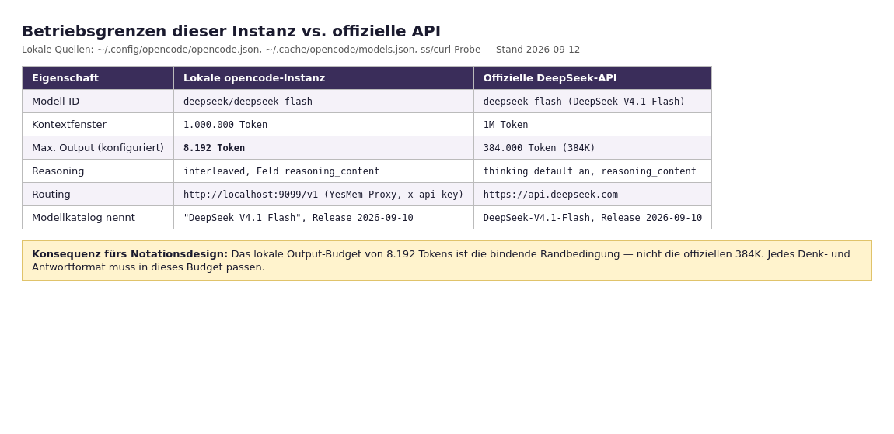

# Betriebsgrenzen dieser Instanz: lokale Konfiguration vs. offizielle API

> **Hinweis:** Alle Angaben dieses Artikels mit der Markierung „lokale Quelle" stammen aus der Betriebsumgebung dieses Wikis (Konfigurationsdateien, Prozess-/Netzstatus, direkte Proben vom 2026-09-12), nicht aus öffentlicher Dokumentation. Sie beschreiben **diese** Instanz, nicht das Modell allgemein.

## Was diese Instanz ist

Dieses Wiki läuft auf einem opencode-Agenten mit dem Modell `deepseek/deepseek-flash` (Model-ID der Umgebungs-Metadaten dieser Session; lokale Quelle). Die opencode-Konfiguration (`~/.config/opencode/opencode.json`, lokale Quelle) definiert dazu:

- `model: "deepseek/deepseek-flash"` und `small_model: "deepseek/deepseek-flash"` (lokale Quelle).
- Provider `deepseek` mit `baseURL: "http://localhost:9099/v1"` — **alle** Provider dieser Konfiguration (anthropic, openai, mistral, moonshotai, ollama, zai-coding-plan, gateway u. a.) zeigen auf denselben lokalen Endpunkt (lokale Quelle).
- Für das Modell `deepseek-flash`: `limit: {context: 1000000, output: 8192}`, Name „DeepSeek Flash", dazu `interleaved: {field: "reasoning_content"}` (lokale Quelle).
- Für `deepseek-v4-pro`: `limit: {context: 1000000, output: 65536}`, ebenfalls `interleaved: {field: "reasoning_content"}` (lokale Quelle).

Der Modellkatalog (`~/.cache/opencode/models.json`, lokale Quelle) führt `deepseek/deepseek-flash` als **„DeepSeek V4.1 Flash"** mit `release_date: 2026-09-10`, Kontext 1.000.000 und Output 384.000 (Katalogwert). Der Katalog enthält außerdem Vorläufer- und Snapshot-Einträge (`deepseek-v4-flash`, `deepseek-v4-flash-0731`, `deepseek-v4-pro-0813`, `deepseek-v4-flash-vision-exp`); die Release-Daten 2026-04-24 sowie 2026-07-31/2026-08-12 liegen in anderen Provider-Namespaces desselben Katalogs, während der Eintrag `deepseek-v4-flash` im DeepSeek-Namespace selbst das Release-Datum 2026-09-10 trägt (lokale Quelle) — deckungsgleich mit der offiziellen Versionsgeschichte [Release News](https://api-docs.deepseek.com/news/news260910, accessed 2026-09-12).

*Abbildung 1: Gegenüberstellung lokale opencode-Konfiguration vs. offizielle DeepSeek-API (lokale Quellen: `~/.config/opencode/opencode.json`, `~/.cache/opencode/models.json`; offizielle Werte: [Models & Pricing](https://api-docs.deepseek.com/quick_start/pricing, accessed 2026-09-12)).*

## Proxy-Routing (lokal)

Der Endpunkt `localhost:9099` gehört zu einem **YesMem-Prozess** (Prozessname `yesmem`, Kommando `/home/carsten/.local/bin/yesmem proxy`; Netzstatus-Probe 2026-09-12: PID 342443 lauscht auf 127.0.0.1:9099; lokale Quelle). Eine direkte Probe gegen `http://localhost:9099/v1/models` wird mit `authentication_error: "x-api-key header is required"` beantwortet — der Proxy verlangt also einen API-Key-Header (lokale Quelle; Kommando: `curl -s http://localhost:9099/v1/models`, Einzelprobe ohne Wiederholung). Die opencode-Auth-Ablage enthält einen Provider-Eintrag `deepseek` (Schlüsselnamen geprüft, Werte nicht ausgelesen; lokale Quelle).

**Nicht verifizierbar von hier:** welches Upstream der Proxy für `deepseek/*` anspricht (Erstparteien-API, eigener Account, Reseller) und ob die lokale Kette dieselben Limits durchsetzt wie die offizielle API. Diese Lücke ist für den Testplan relevant, weil das effektive Output-Budget davon abhängen kann (siehe unten).

## Der zentrale Unterschied: Output-Budget

Die offizielle API erlaubt für V4.1-Flash **384K Output-Tokens** und empfiehlt `max_tokens ≥ 256K` [Models & Pricing](https://api-docs.deepseek.com/quick_start/pricing, accessed 2026-09-12) [Model Card](https://huggingface.co/deepseek-ai/DeepSeek-V4.1-Flash, accessed 2026-09-12). Die lokale opencode-Konfiguration begrenzt dasselbe Modell auf **8.192 Output-Tokens** (lokale Quelle). Das ist ein Faktor ~47 Unterschied zwischen offizieller Fähigkeit und lokaler De-facto-Grenze.

Für das Notationsdesign folgt daraus (lokale Analyse, klar als solche markiert):

1. **Das Output-Budget ist die bindende Randbedingung des Projekts, nicht das Kontextfenster.** Ein 1M-Kontext lädt zu großen Eingaben ein; die Antwort (+ Denken) muss aber in 8.192 Tokens passen. Jedes Antwortformat — Beweisschritt-Traces, SMT/Lean-Zeugen, HALT-Traces — konkurriert um dasselbe knappe Kontingent.
2. **Denk-Inhalte sind Teil der Antwort.** `reasoning_content` ist Bestandteil der Modellantwort und wird auf der Output-Seite erzeugt [Thinking Mode](https://api-docs.deepseek.com/guides/thinking_mode, accessed 2026-09-12); die Preisseite unterscheidet nur Input-/Output-Tokens [Models & Pricing](https://api-docs.deepseek.com/quick_start/pricing, accessed 2026-09-12). Konservativ ist daher mit Denken + Antwort zusammen innerhalb des Budgets zu planen. Ob die lokale Kette Denk-Tokens gegen dasselbe 8.192-Limit zählt, konnte nicht verifiziert werden *[unkenntlich — keine Quelle gefunden]*.
3. **Token-Ökonomie schlägt direkt auf die Erfolgsmessung durch.** Da die Notation in Token gemessen wird (siehe [01-03-tokenizer-zahlen.md](01-03-tokenizer-zahlen.md)), ist „passt in 8.192" eine harte Implementierungsbedingung für den Testplan (Cluster 05).

## Interleaved Reasoning

Die lokale Konfiguration deklariert für `deepseek-flash` und `deepseek-v4-pro` `interleaved: {field: "reasoning_content"}` — der Client erwartet Denk-Inhalte im Feld `reasoning_content` (lokale Quelle). Das deckt sich mit der offiziellen Doku: Im Thinking-Modus wird die Gedankenkette „via the `reasoning_content` parameter, at the same level as `content`" zurückgegeben; bei Tool-Nutzung muss sie vollständig zurückgesendet werden (sonst Fehler 400), ohne Tools wird sie ignoriert [Thinking Mode](https://api-docs.deepseek.com/guides/thinking_mode, accessed 2026-09-12). Die V4.1-Prompt-Referenz führt Denken als `<think>…</think>`-Block; im chat-Modus wird der Block sofort geschlossen [encoding/README](https://huggingface.co/deepseek-ai/DeepSeek-V4.1-Flash/blob/main/encoding/README.md, accessed 2026-09-12).

Lokale Beobachtung aus dem Betrieb: In dieser Session (Agenten mit Tool-Nutzung) werden Denk-Inhalte im Verlauf mitgeführt — konsistent mit der Tool-Regel „`reasoning_content` in allen Folge-Requests zurückgeben" [Thinking Mode](https://api-docs.deepseek.com/guides/thinking_mode, accessed 2026-09-12) [encoding/README](https://huggingface.co/deepseek-ai/DeepSeek-V4.1-Flash/blob/main/encoding/README.md, accessed 2026-09-12).

## Was das für das Notationsprojekt heißt

- **Input-seitig** ist die Instanz großzügig: 1M Kontext, 1M-Katalogwert (lokale Quelle) — Notation kann als Präfix/Systemanweisung großzügig eingeführt werden, auch mit Beispielen und Grammatik (Input-Tokens sind zusätzlich billiger als Output-Tokens [Models & Pricing](https://api-docs.deepseek.com/quick_start/pricing, accessed 2026-09-12)).
- **Output-seitig** ist sie knapp: 8.192 Tokens (lokale Quelle). Kandidaten-Notationen müssen ihre Trace- und Zeugen-Formate gegen dieses Budget rechnen; das gehört als Abnahmekriterium in den Testplan (Cluster 05).
- **Reproduzierbarkeit:** Aussagen über „dieses Modell" in den übrigen Wiki-Dateien beziehen sich auf die öffentliche Modellversion; Aussagen über „diese Instanz" nur auf die hier dokumentierte Betriebsumgebung. Testergebnisse dieser Instanz sind nicht automatisch auf die offizielle API (384K-Output) übertragbar — und umgekehrt.

## Offene Punkte

- Upstream-Routing des YesMem-Proxys für `deepseek/*` unbekannt (lokale Lücke).
- Durchsetzung des 8.192-Limits (Client vs. Proxy) nicht getestet; ein systematischer Test gehört in den Harness (Cluster 05).
- Ob und wie die lokale Kette Reasoning-Tokens budgetiert, nicht verifizierbar *[unkenntlich — keine Quelle gefunden]*.
- Ein Erfahrungswert, welchen Anteil des 8.192-Token-Budgets Denk-Inhalte typischerweise verbrauchen, liegt nicht vor.

## Quellen

1. Lokale Quelle: `~/.config/opencode/opencode.json` (Model-ID, Provider, Limits, interleaved-Konfiguration), gelesen 2026-09-12.
2. Lokale Quelle: `~/.cache/opencode/models.json` (Katalogname „DeepSeek V4.1 Flash", Release-Datum, Katalog-Limits), gelesen 2026-09-12.
3. Lokale Quelle: Prozess-/Netz-Proben (`ss -tlnp`, curl gegen `http://localhost:9099/v1/models`), 2026-09-12.
4. DeepSeek (2026): Models & Pricing. https://api-docs.deepseek.com/quick_start/pricing (accessed 2026-09-12)
5. DeepSeek (2026): Thinking Mode. https://api-docs.deepseek.com/guides/thinking_mode (accessed 2026-09-12)
6. DeepSeek-AI (2026): DeepSeek-V4.1-Flash — Model Card. https://huggingface.co/deepseek-ai/DeepSeek-V4.1-Flash (accessed 2026-09-12)
7. DeepSeek-AI (2026): encoding/README.md. https://huggingface.co/deepseek-ai/DeepSeek-V4.1-Flash/blob/main/encoding/README.md (accessed 2026-09-12)
