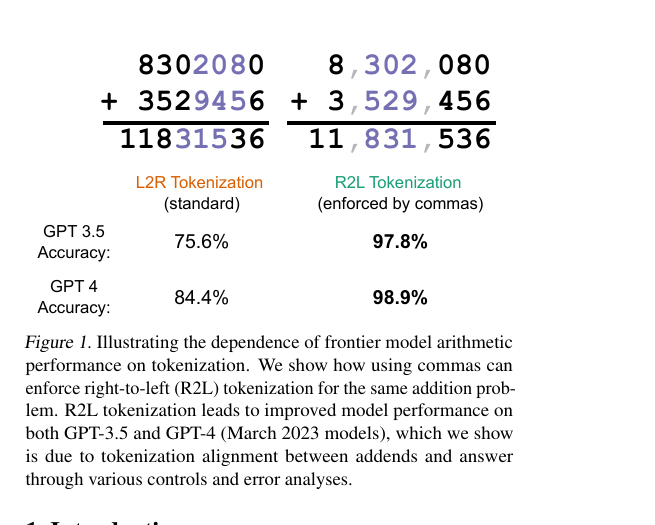

## Worum es geht

Die Zerlegung von Zahlen in Tokens verändert die Rechengenauigkeit desselben Modells auf derselben Additionsaufgabe um zweistellige Prozentbeträge, ohne dass ein Parameter geändert wird [Tokenization counts](https://arxiv.org/abs/2402.14903, accessed 2026-09-12). Für eine auf Tokenizer und Attention zugeschnittene Mathematik-Notation ist die Ziffern-Tokenisierung damit der am besten messbare Stellhebel. Dieses Dokument sammelt die belegten Effektgrößen samt Versuchsdesign; Kernfall ist die mehrstellige Addition mit Stellenübertrag.

## Ziffern-Tokenisierung im Modell

Byte Pair Encoding (BPE) verschmilzt iterativ die häufigsten Zeichenpaare; für Zahlen entstehen so statistische, idiosynkratische Tokens: Die Zahl 710 kann ein eigener Token sein, 711 nicht [Tokenization counts](https://arxiv.org/abs/2402.14903, accessed 2026-09-12). Die Anbieter reagieren unterschiedlich: GPT-3.5 und GPT-4 (cl100k_base) nutzen eigene Tokens für alle ein- bis dreistelligen Zahlen und zerlegen längere Zahlen in Dreier-Chunks von links nach rechts (L2R); PaLM, Llama und Mistral tokenisieren einzelne Ziffern, GPT-3, Claude v2.1, Gopher, Chinchilla, GPT-J und OLMo bleiben bei reinem BPE [Tokenization counts](https://arxiv.org/abs/2402.14903, accessed 2026-09-12). Die Chunks segmentieren alle N-stelligen Zahlen einheitlich, doch bei einem Stellenübertrag laufen Eingabe- und Ausgabe-Tokenisierung auseinander: Wächst die Antwort um eine Stelle, verschieben sich die Token-Grenzen zwischen Addenden und Summe [Tokenization counts](https://arxiv.org/abs/2402.14903, accessed 2026-09-12).

Der Trade-off ist Kompression: Dreistellige Tokens lassen Modelle pro Token mehr numerische Information sehen, was die Wahl trotz der Nachteile erklärt [Tokenization counts](https://arxiv.org/abs/2402.14903, accessed 2026-09-12). Der konstruktive Fall: Das fine-getunte LLaMA-Modell Goat erreicht nach Autorenangabe nahezu perfekte Genauigkeit bei großer Addition und Subtraktion und führt dies auf LLaMAs konsistente Zahlen-Tokenisierung zurück [Goat](https://arxiv.org/abs/2305.14201, accessed 2026-09-12).

## Befunde

**Ankerbefund: Richtung der Tokenisierung (Singh und Strouse 2024).** Aufbau: few-shot-Addition über die OpenAI-Chat-API, Addenden mit 7 bis 9 Stellen, 90 Probleme (je zehn pro Stellenlängen-Paar), 1 bis 8 Shots, greedy decoding; Hauptmodell gpt-3.5-turbo-0301. Rechts-nach-links-Tokenisierung (R2L) wird erzwungen, indem Zahlen mit Kommas in Dreiergruppen geschrieben werden; da das Vokabular keine Tokens aus Zahlen und Kommas enthält, werden die Kommas separat tokenisiert und die Ziffern-Grenzen verschieben sich [Tokenization counts](https://arxiv.org/abs/2402.14903, accessed 2026-09-12).

Ergebnis (8-Shot): GPT-3.5 steigt von 75.6% auf 97.8%, GPT-4 von 84.4% auf 98.9%; die Arbeit fasst das als bis zu 20% höhere Genauigkeit durch R2L zusammen [Tokenization counts](https://arxiv.org/abs/2402.14903, accessed 2026-09-12). Die weiteren Messungen nutzen 8 Shots, das für L2R günstigste Setting; Kontrollen mit anderen Einzel-Token-Separatoren (Leerzeichen, Punkt, Dollar, Raute) zeigen, dass die Richtung wirkt und nicht die Komma-Semantik [Tokenization counts](https://arxiv.org/abs/2402.14903, accessed 2026-09-12).

*Abbildung 1: L2R- gegen R2L-Tokenisierung am selben Additionsproblem; GPT-3.5 75,6% gegen 97,8%, GPT-4 84,4% gegen 98,9% (Quelle: [Tokenization counts](https://arxiv.org/abs/2402.14903, accessed 2026-09-12))*

**Wo L2R einbricht.** Auf 1300 längenkontrollierten Problemen (13 Längentripel aus je 100) fällt die L2R-Genauigkeit auf 8.25%, wenn die Antwort eine Stelle länger ist als die Addenden ("length mismatch"); 92% dieser Probleme werden verfehlt [Tokenization counts](https://arxiv.org/abs/2402.14903, accessed 2026-09-12). Die Fehler sind stereotyp: Die ersten drei Ziffern (erster Output-Token) sind stets korrekt, die vierte Ziffer ist in den 91.25% fehlerhaften Fällen immer falsch [Tokenization counts](https://arxiv.org/abs/2402.14903, accessed 2026-09-12). Die Restfehler sind fast nur Off-by-one-Fehler an Token-Grenzen (R2L: 24 von 25; L2R im Längenmatch: 53 von 56) [Tokenization counts](https://arxiv.org/abs/2402.14903, accessed 2026-09-12). Wird im Prompt verlangt, das Problem erst in R2L zu wiederholen und dann zu lösen, steigt die Format-Adhärenz von 13.3% (1 Shot) auf 98.9% (8 Shots), und die Genauigkeit nähert sich jener bei direkter R2L-Eingabe [Tokenization counts](https://arxiv.org/abs/2402.14903, accessed 2026-09-12).

**Lernen von Grund auf (Lee et al. 2023).** NanoGPT wird von zufälliger Initialisierung auf dreistelliger Addition trainiert; verglichen werden das Standardformat ("plain", höchstwertige Stelle zuerst) und das umgekehrte Ausgabeformat ("reverse", niedrigstwertige zuerst) plus Scratchpad-Varianten [Teaching Arithmetic](https://arxiv.org/abs/2307.03381, accessed 2026-09-12). Plain plateaut bei knapp über 85% selbst mit 10.000 Beispielen; Reverse lernt die Addition in einer scharfen Phase Transition zwischen 1000 und 4000 Beispielen praktisch perfekt [Teaching Arithmetic](https://arxiv.org/abs/2307.03381, accessed 2026-09-12). Unter zufälliger Störung der ersten beiden Ausgabe-Tokens bleibt Reverse exakt bei 81.26% (relaxed 100%), Plain bricht auf 49.88% exakt beziehungsweise 61.55% relaxed ein [Teaching Arithmetic](https://arxiv.org/abs/2307.03381, accessed 2026-09-12). Nach Pretraining auf k Stellen brauchen Reverse und Scratchpad konsistent 1000 bis 5000 Beispiele für die nächste Stelle, Plain deutlich mehr, wachsend mit der Stellenzahl [Teaching Arithmetic](https://arxiv.org/abs/2307.03381, accessed 2026-09-12). Grenzen: Bei Multiplikation wirkt Reverse nicht, dort hilft nur das detaillierte Scratchpad; und Fine-Tuning eines plain-vortrainierten GPT-3 mit Reverse oder vereinfachtem Scratchpad kann schlechter sein als mit Plain [Teaching Arithmetic](https://arxiv.org/abs/2307.03381, accessed 2026-09-12).

**Atomare Ausrichtung bei Zähl- und Sortieraufgaben (Zhang et al. 2025).** Je 1000 zufällige Instanzen pro Längenintervall, identische Prompts; variiert wird nur das String-Format von roher BPE-Tokenisierung bis zu atomar ausgerichteten Tokens (eine Ziffer beziehungsweise ein Zielzeichen pro Token), die Zählaufgaben laufen auf GPT-4o-mini, Claude 3.5 Sonnet, Qwen Turbo und o1 [Tokenization Constraints](https://arxiv.org/abs/2505.14178, accessed 2026-09-12). Beim Zählen von "a" mit Chain-of-Thought und Länge 20 bis 30 steigt die Genauigkeit von 9.10% auf 81.60% (Δ 72.5 Punkte) [Tokenization Constraints](https://arxiv.org/abs/2505.14178, accessed 2026-09-12). Die Autoren berichten Genauigkeitsvarianz von über 70% allein durch die Tokenisierung (ihre Metrik ist der Tokenization Degradation Gap Δtok; die Lauf-zu-Lauf-Varianz derselben Experimente liegt dagegen unter 1 Prozent); selbst o1 erreicht auf arithmetischen Strings von 30 bis 40 Zeichen nur etwa 50% [Tokenization Constraints](https://arxiv.org/abs/2505.14178, accessed 2026-09-12).

## Belegte Effektgroessen

| Befund | Zahl | Quelle |
|---|---|---|
| Addition 8-Shot, GPT-3.5: L2R gegen R2L | 75.6% gegen 97.8% | [Tokenization counts](https://arxiv.org/abs/2402.14903, accessed 2026-09-12) |
| Addition 8-Shot, GPT-4 (März 2023): L2R gegen R2L | 84.4% gegen 98.9% | [Tokenization counts](https://arxiv.org/abs/2402.14903, accessed 2026-09-12) |
| L2R bei Antwort eine Stelle länger ("length mismatch") | 8.25%; 92% der Fälle verfehlt | [Tokenization counts](https://arxiv.org/abs/2402.14903, accessed 2026-09-12) |
| Stereotypie: vierte Ziffer in fehlerhaften Mismatch-Fällen immer falsch | 91.25% der Fälle | [Tokenization counts](https://arxiv.org/abs/2402.14903, accessed 2026-09-12) |
| NanoGPT, zufällige Initialisierung, 3-stellige Addition: Plain-Plateau gegen Reverse-Phase | knapp über 85% (10.000 Beispiele) gegen perfekt ab ca. 2500 (Phase 1000 bis 4000) | [Teaching Arithmetic](https://arxiv.org/abs/2307.03381, accessed 2026-09-12) |
| Robustheit unter zufälliger Störung früher Output-Tokens (exakt) | Reverse 81.26% gegen Plain 49.88% | [Teaching Arithmetic](https://arxiv.org/abs/2307.03381, accessed 2026-09-12) |
| Tokens pro Trainingsbeispiel (3-stellige Addition) | 13 plain, 15 reverse, 64 einfaches, 281 detailliertes Scratchpad | [Teaching Arithmetic](https://arxiv.org/abs/2307.03381, accessed 2026-09-12) |
| Zählen mit CoT, Länge 20 bis 30: rohe BPE-Tokens gegen atomar ausgerichtete Tokens | 9.10% gegen 81.60% (Δ 72.5 Punkte) | [Tokenization Constraints](https://arxiv.org/abs/2505.14178, accessed 2026-09-12) |
| Genauigkeitsvarianz allein durch Tokenisierungsformat | über 70% (Tokenization Degradation Gap); Lauf-zu-Lauf-Varianz unter 1% | [Tokenization Constraints](https://arxiv.org/abs/2505.14178, accessed 2026-09-12) |

## Implikationen fuer Notationsdesign

- Notationsregeln sollten Input- und Output-Tokenisierung am Stellenübertrag angleichen; der 8.25%-Einbruch bei L2R-Dreier-Chunks verweist auf Ziffernatomik oder stellentreue Grenzen als Default [Tokenization counts](https://arxiv.org/abs/2402.14903, accessed 2026-09-12).
- Die Bearbeitungsrichtung gehört explizit ins Format: Stellenwert-niedrig-zuerst ist das lern- und robustere Schema (Phase Transition um 2500 Beispiele; 81.26% exakt unter Störung) [Teaching Arithmetic](https://arxiv.org/abs/2307.03381, accessed 2026-09-12).
- Trennzeichen sind ein Inferenzzeit-Hebel ohne Retraining: Komma, Leerzeichen, Punkt, Dollar und Raute wirken gleichwertig, solange sie Token-Grenzen verschieben; für L2R-Modelle ist "erst wiederholen, dann antworten" belegt (Adhärenz 13.3% auf 98.9%) [Tokenization counts](https://arxiv.org/abs/2402.14903, accessed 2026-09-12).
- Token-Budget mitdenken: Detaillierte Scratchpads erkaufen Sample-Effizienz mit bis zu 20-fachem Tokenaufwand (281 gegen 13 pro Beispiel); Reverse ist die günstigste wirksame Variante [Teaching Arithmetic](https://arxiv.org/abs/2307.03381, accessed 2026-09-12).
- Formatkonsistenz zwischen Vortraining und Feinabstimmung einhalten: Ein Wechsel des Zahlenformats kann die Genauigkeit senken, das Design muss das Trainingsregime der Zielmodelle einbeziehen [Teaching Arithmetic](https://arxiv.org/abs/2307.03381, accessed 2026-09-12).
- Vorschläge wie Triadic Suffix Tokenization (Dreier-Triaden mit Größenordnungs-Markern, 10.000 Zusatz-Tokens für 33 Größenordnungen) sind unvalidiert; solche Schemata gehören als Hypothese ins Wiki, nicht als Befund [Triadic Suffix](https://arxiv.org/abs/2604.11582, accessed 2026-09-12).

## Konflikte und offene Punkte

- Kein Konsens zur Zahlen-Tokenisierung: Single-digit-Vokabulare, 1- bis 3-stellige Chunks und reines BPE existieren parallel; die Ankerstudie fordert kontrollierte Pretraining-Ablationen als "gold experiment", das bislang niemand durchgeführt hat [Tokenization counts](https://arxiv.org/abs/2402.14903, accessed 2026-09-12).
- Die Wirkung hängt vom Regime ab: Reverse hilft beim Training von Grund auf und beim Prompting von API-Modellen, kann aber beim Fine-Tuning eines plain-vortrainierten Modells schaden [Teaching Arithmetic](https://arxiv.org/abs/2307.03381, accessed 2026-09-12); ein einheitliches "bestes Format" ist nicht ableitbar.
- Der Mechanismus der stereotypen Fehler ist ungeklärt: Ähnliche Entropie bei richtigen und falschen Antworten (2.061 gegen 2.066 nats, nahe am Zufallsniveau von etwa 2.3) und die richtige Antwort nur in 49.6% der Fehlerfälle unter den Top-5-Tokens deuten auf Raten zwischen zehn Ziffern-Tokens, ohne den Mechanismus zu beweisen [Tokenization counts](https://arxiv.org/abs/2402.14903, accessed 2026-09-12).
- Die Übertragbarkeit ist begrenzt: Die Ankerbefunde stammen von GPT-Checkpoints aus 2023, Llama und Mistral wurden in den Zähl-Experimenten nicht getestet (Limitation der Autoren) [Tokenization Constraints](https://arxiv.org/abs/2505.14178, accessed 2026-09-12); der Effekt nimmt mit Modellgröße ab, kehrt im kleineren GPT-4 Turbo aber zurück [Tokenization counts](https://arxiv.org/abs/2402.14903, accessed 2026-09-12).
- Berichtsgrenzen und Anschluss: Die zitierten Studien nennen Punktwerte ohne Unsicherheitsintervalle; der Ankerbefund stützt sich auf 90 Additionsprobleme. Zielmodell-spezifische Tokenizer-Fakten liefert Cluster 01 (01-03), die Messmethodik für einen eigenen Test Cluster 05.

## Quellen

- Singh, A. K. und Strouse, D. (2024): Tokenization counts: the impact of tokenization on arithmetic in frontier LLMs. arXiv:2402.14903. https://arxiv.org/abs/2402.14903 (accessed 2026-09-12)
- Lee, N., Sreenivasan, K., Lee, J. D., Lee, K. und Papailiopoulos, D. (2023): Teaching Arithmetic to Small Transformers. arXiv:2307.03381. https://arxiv.org/abs/2307.03381 (accessed 2026-09-12)
- Zhang, X., Cao, J., Wei, J., Xu, Y. und You, C. (2025): Tokenization Constraints in LLMs: A Study of Symbolic and Arithmetic Reasoning Limits. arXiv:2505.14178. https://arxiv.org/abs/2505.14178 (accessed 2026-09-12)
- Liu, T. und Low, B. K. H. (2023): Goat: Fine-tuned LLaMA Outperforms GPT-4 on Arithmetic Tasks. arXiv:2305.14201. https://arxiv.org/abs/2305.14201 (accessed 2026-09-12)
- Chetverina, O. (2026): A Triadic Suffix Tokenization Scheme for Numerical Reasoning. arXiv:2604.11582. https://arxiv.org/abs/2604.11582 (accessed 2026-09-12)
