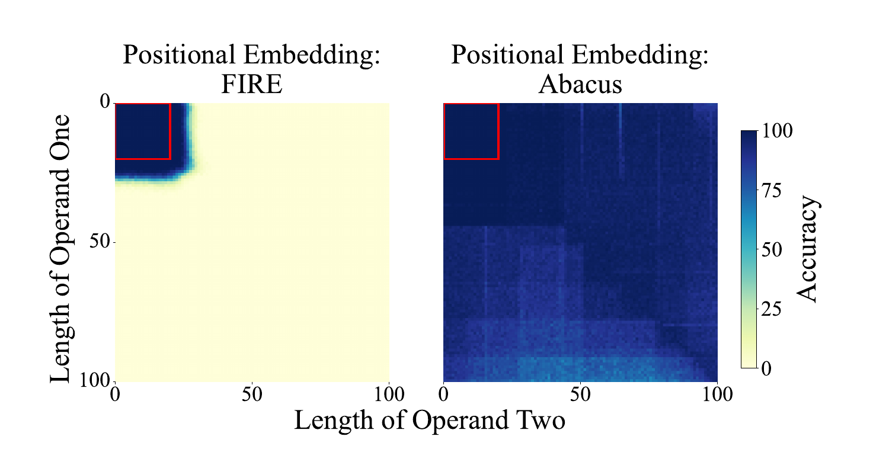

## Worum es geht

Wenn die Ziffernstellung das eigentliche Problem der Arithmetik in Transformern wäre und nicht die Rechenoperation selbst, dann müssten Eingriffe in Embeddings und Positionskodierung dieselbe Aufgabe dramatisch verbessern, ohne die Aufgabenstellung zu ändern. Vier Arbeiten zeigen genau das: Abacus-Embeddings heben die Genauigkeit bei 100-stelliger Addition auf bis zu 99 Prozent [McLeish 2024](https://arxiv.org/abs/2405.17399, accessed 2026-09-12); xVal ersetzt die Tokenfolge durch ein kontinuierliches Zahl-Token [Golkar 2024](https://arxiv.org/abs/2310.02989, accessed 2026-09-12); Padding und reversed product machen aus einem an 4 Ziffern scheiternden Modell eines, das 15 Stellen multipliziert [Shen 2023](https://arxiv.org/abs/2311.14737, accessed 2026-09-12); randomisierte Positionskodierungen entschärfen die Längengeneralisierung [Ruoss 2023](https://arxiv.org/abs/2305.16843, accessed 2026-09-12). Die Effektgrößen belegen: Ein Teil der Mathe-Schwäche ist eine Repräsentationsschwäche, die im Notationsdesign adressierbar ist.

## Wie Transformer Zahlen intern kodieren

Vier belegte Befunde zeichnen dasselbe Bild: Das Modell rechnet nicht mit Magnituden, sondern mit Positionen und Oberflächenmerkmalen. Erstens gelingt es Standard-Transformern nach Befund von McLeish et al. nicht, die exakte Position jeder Ziffer in langen Ziffernfolgen zuverlässig zu repräsentieren; selbst bei Millionen Trainingsbeispielen scheitern sie an mehrstelliger Addition [McLeish 2024](https://arxiv.org/abs/2405.17399, accessed 2026-09-12). Die frühere Gegenmaßnahme, explizite Index-Hinweise, verdoppelt Ausgabelänge und Inferenzkosten [McLeish 2024](https://arxiv.org/abs/2405.17399, accessed 2026-09-12). Zweitens sind Positionskodierungen für längere Sequenzen außerhalb der Trainingsverteilung, auch relative Kodierungen; Ruoss et al. machen dieses Out-of-Distribution-Verhalten zum Ansatzpunkt ihrer Reparatur [Ruoss 2023](https://arxiv.org/abs/2305.16843, accessed 2026-09-12). Drittens diktiert das Oberflächenformat die erlernte Prozedur: Bei Multiplikationen unterschiedlicher Stellenzahl variiert die Position des Operators, und die eigentliche Regel wird dadurch unnötig schwer lernbar [Shen 2023](https://arxiv.org/abs/2311.14737, accessed 2026-09-12). Viertens: Diskrete Zahl-Token erzeugen eine Diskontinuität, die xVal als Grund für fehlende numerische Eignung nennt; Encodings ohne feste Tokenzahl pro Zahl können zudem Scheinkorrelationen mit der Zahl-Länge erzeugen [Golkar 2024](https://arxiv.org/abs/2310.02989, accessed 2026-09-12). Arithmetik-Baselines sind zudem seedsensitiv: Je nach Initialisierung schwankt die Genauigkeit zwischen nahezu perfekt bei 100 Ziffern und 0 Prozent bei 90 Ziffern [McLeish 2024](https://arxiv.org/abs/2405.17399, accessed 2026-09-12).

## Interventionen: Embeddings und Positionen

### Abacus-Embeddings: Ziffernstelle als eigenes Signal

McLeish et al. geben jedem Ziffern-Token ein gelerntes Positions-Embedding relativ zum Beginn der Zahl; Ziffern gleicher Signifikanz erhalten dasselbe Embedding, was die Stellen explizit ausrichtet. Training: aufsteigende Indizes ab zufälligem Startoffset β aus U[1, k] (k = 100 als Default), beim Test beginnt jedes Embedding bei 1 [McLeish 2024](https://arxiv.org/abs/2405.17399, accessed 2026-09-12). Training nur auf 20-stelligen Operanden (eine GPU, ein Tag) ergibt bis zu 99 Prozent Exakt-Treffer bei 100 Ziffern; der Generalisierungsfaktor auf 120 Ziffern beträgt 6× gegenüber 2,5× vorher [McLeish 2024](https://arxiv.org/abs/2405.17399, accessed 2026-09-12). Input Injection senkt den Generalisierungsfehler um 50 Prozent gegenüber der Abacus-Baseline, und in Kombination mit looped transformer layers steigt die Out-of-Distribution-Genauigkeit von 92,9 auf 99,1 Prozent, eine Fehlerreduktion um 87 Prozent [McLeish 2024](https://arxiv.org/abs/2405.17399, accessed 2026-09-12).

*Abbildung 1: Zero-shot Exakt-Treffer-Genauigkeit für Addition, Training bis 20 Ziffern; links state-of-the-art Embeddings (FIRE), rechts Abacus Embeddings. Der rote Rahmen markiert die Trainingsverteilung. (Quelle: [Transformers Can Do Arithmetic with the Right Embeddings](https://arxiv.org/abs/2405.17399, accessed 2026-09-12))*

### xVal: eine Zahl, ein kontinuierliches Token

xVal kodiert jede Zahl als einzelnes Token: Die Magnitude fließt multiplikativ ins Embedding ein, wird in eine lernbare Richtung gedreht, und ein modifizierter Inferenzmodus macht das Modell zu einer stetigen Funktion der Eingangszahlen [Golkar 2024](https://arxiv.org/abs/2310.02989, accessed 2026-09-12). Der Vokabular-Zuwachs beträgt ein Element, gegenüber 28 bis 28 800 bei den Vergleichsencodings, bei einem Token pro Zahl gegenüber bis zu fünf [Golkar 2024](https://arxiv.org/abs/2310.02989, accessed 2026-09-12). Im Temperatur-Task (MSE) erreicht xVal 1,75 statt 73 (P10) bzw. 2,14 (FP15), in 9 statt 19 Stunden (gegen FP15) [Golkar 2024](https://arxiv.org/abs/2310.02989, accessed 2026-09-12). Bei Planetenbahnen sagt xVal die letzten 10 Zeitschritte korrekt voraus und interpoliert zwischen Trainingswerten; textbasierte Encodings reproduzieren dort nur explizit gesehene Zahlen [Golkar 2024](https://arxiv.org/abs/2310.02989, accessed 2026-09-12). Trade-off: Mehr xVal-Tokens pro Zahl verbessern die In-Distribution-Zeitreihen, verschlechtern aber die Out-of-Distribution-Generalisierung [Golkar 2024](https://arxiv.org/abs/2310.02989, accessed 2026-09-12).

### Padding, reversed product und random embedding

Shen et al. ändern das Datenformat: Beide Faktoren werden auf die maximale Stellenzahl mit Nullen aufgefüllt, und die Produktziffern werden mit der niederwertigsten Stelle zuerst ausgegeben, weil deren Berechnung nur die niederwertigsten Faktorenziffern braucht [Shen 2023](https://arxiv.org/abs/2311.14737, accessed 2026-09-12). Mit 300 000 Trainingsbeispielen und einem GPT2-small-Modell (124M; der Abstract nennt 100M) erreicht die Kombination aus Padding und reversed product zuverlässige direkte Multiplikation bis 15 × 15 Ziffern, nahezu perfekt bis 12 Ziffern; das ungepolsterte Format scheitert bereits bei 4 × 4 [Shen 2023](https://arxiv.org/abs/2311.14737, accessed 2026-09-12). Für Addition genügen 120 000 Beispiele, um von 10 auf 12 Ziffern zu extrapolieren, während übliches Training keine Extrapolation zeigt; im natürlichen Sprachkontext liegt die Genauigkeit fast perfekt bis 5 Ziffern statt bis 3 [Shen 2023](https://arxiv.org/abs/2311.14737, accessed 2026-09-12). Ergänzend erreicht ein random embedding (pro Epoche neu gezogene Gauß-Vektoren in einem Teil der Embedding-Dimensionen) etwa die Generalisierungsfähigkeit des Recursive-Scratchpad-Formats [Shen 2023](https://arxiv.org/abs/2311.14737, accessed 2026-09-12).

### Randomisierte Positionskodierungen

Ruoss et al. simulieren beim Training die Positionen längerer Sequenzen und wählen daraus eine zufällige geordnete Teilmenge passend zur Sequenzlänge; subsampled wird einmal pro Batch [Ruoss 2023](https://arxiv.org/abs/2305.16843, accessed 2026-09-12). 6000 Modelle auf 15 algorithmischen Tasks (modulare Arithmetik, Binär-Addition/-Multiplikation, String-Umkehrung, Bucket Sort) ergeben im Mittel 12,0 Punkte höhere Testgenauigkeit, auf einzelnen Tasks bis zu 43,5 Punkte [Ruoss 2023](https://arxiv.org/abs/2305.16843, accessed 2026-09-12). Die Sortierung der subsampled Positionen ist entscheidend und bringt 15,7 Punkte im Mittel; mit kurzen Trainingssequenzen lässt sich über 90 Prozent Testgenauigkeit erreichen, bei etwa 35,4-fach geringerer Trainingszeit als beim naiven Training auf längeren Sequenzen [Ruoss 2023](https://arxiv.org/abs/2305.16843, accessed 2026-09-12). Die Arbeit testet Length Generalization auf algorithmischen Tasks, nicht numerische Extrapolation; Abacus übernimmt die Idee randomisierter Positionen als zufälligen Startoffset [McLeish 2024](https://arxiv.org/abs/2405.17399, accessed 2026-09-12).

## Belegte Effektgrößen

| Befund | Zahl | Quelle |
|---|---|---|
| Addition mit Abacus, Training 20 Ziffern, 1 GPU, 1 Tag | bis 99 % Exakt-Treffer bei 100 Ziffern | [McLeish 2024](https://arxiv.org/abs/2405.17399, accessed 2026-09-12) |
| Generalisierungsfaktor Abacus (120 Ziffern) | 6× vs. 2,5× bisheriger Stand | [McLeish 2024](https://arxiv.org/abs/2405.17399, accessed 2026-09-12) |
| Baseline-Varianz über Seeds | nahezu perfekt bei 100 Ziffern bis 0 % bei 90 Ziffern | [McLeish 2024](https://arxiv.org/abs/2405.17399, accessed 2026-09-12) |
| xVal vs. P10 und FP15, Temperatur-Task (MSE) | 1,75 vs. 73 bzw. 2,14 | [Golkar 2024](https://arxiv.org/abs/2310.02989, accessed 2026-09-12) |
| xVal Laufzeit vs. FP15 (gleiche Samples) | 9 h vs. 19 h | [Golkar 2024](https://arxiv.org/abs/2310.02989, accessed 2026-09-12) |
| xVal Vokabular und Tokens pro Zahl | 1 und 1, gegenüber 28 bis 28 800 und bis 5 | [Golkar 2024](https://arxiv.org/abs/2310.02989, accessed 2026-09-12) |
| Multiplikation mit Padding + reversed product | 15 × 15 Ziffern, vorher Scheitern bei 4 × 4 | [Shen 2023](https://arxiv.org/abs/2311.14737, accessed 2026-09-12) |
| Addition: Extrapolation mit 120k Samples | 10 auf 12 Ziffern | [Shen 2023](https://arxiv.org/abs/2311.14737, accessed 2026-09-12) |
| Addition im Sprachkontext | fast perfekt bis 5 statt bis 3 Ziffern | [Shen 2023](https://arxiv.org/abs/2311.14737, accessed 2026-09-12) |
| Randomisierte Positionskodierungen | +12,0 Punkte im Mittel, bis +43,5 | [Ruoss 2023](https://arxiv.org/abs/2305.16843, accessed 2026-09-12) |
| Sortierung der Positionen | +15,7 Punkte im Mittel | [Ruoss 2023](https://arxiv.org/abs/2305.16843, accessed 2026-09-12) |
| Effizienz randomisiert vs. naiv länger trainieren | über 90 % Genauigkeit, ca. 35,4-fach schneller | [Ruoss 2023](https://arxiv.org/abs/2305.16843, accessed 2026-09-12) |

## Implikationen für Notationsdesign

- Ziffernstellung explizit machen: Eine Notation, die den Stellenwert jeder Ziffer an dieselbe Information bindet (Abacus-Prinzip, Spaltenausrichtung, Padding), adressiert den belegt größten Engpass bei mehrstelligen Operationen [McLeish 2024](https://arxiv.org/abs/2405.17399, accessed 2026-09-12).
- Längengeneralisierung mitdenken: Randomisierte Startoffsets (Abacus) und Positions-Subsets (Ruoss) sind der belegte Hebel, damit ein auf kurzen Stellenzahlen trainiertes Modell längere Eingaben verarbeitet [Ruoss 2023](https://arxiv.org/abs/2305.16843, accessed 2026-09-12).
- Konventionen bevorzugen, die Ziffern gleicher Signifikanz an dieselbe Position bringen: least-significant-first in Eingabe und Ausgabe, Nullpadding auf einheitliche Breite; beides lässt die Zahl als Wert unverändert [Shen 2023](https://arxiv.org/abs/2311.14737, accessed 2026-09-12).
- Token-Budget pro Zahl minimieren: xVal zeigt den Gewinn eines Tokens pro Zahl, warnt aber, dass mehr Tokens die OOD-Generalisierung verschlechtern [Golkar 2024](https://arxiv.org/abs/2310.02989, accessed 2026-09-12).
- Trennschärfe wahren: Padding, reversed product und Stellungs-Konventionen sind textseitig notierbar und in formale Mathematik rückführbar; Abacus und xVal sind Architektur- und Embedding-Eingriffe, die den Text unverändert lassen. Für das Wiki sind das zwei verschiedene Interventionsklassen [McLeish 2024](https://arxiv.org/abs/2405.17399, accessed 2026-09-12).

## Konflikte und offene Punkte

- Messmethodik: McLeish et al. berichten Mittelwerte über drei Läufe und grenzen sich von einem best-of-ten-Schema ab; die Seedvarianz früherer Arbeiten erschwert den Vergleich einzelner Maßnahmen [McLeish 2024](https://arxiv.org/abs/2405.17399, accessed 2026-09-12).
- Padding ja oder nein: Shen et al. nutzen Nullpadding als zentralen Hebel, McLeish et al. verzichten bewusst darauf und erzielen ebenfalls Spitzenwerte; gegeneinander getestet wurden die Ansätze nicht [Shen 2023](https://arxiv.org/abs/2311.14737, accessed 2026-09-12) [McLeish 2024](https://arxiv.org/abs/2405.17399, accessed 2026-09-12).
- Absolute Embeddings mit endlicher Reichweite: Abacus kann als absolute Positionskodierung technisch nicht über die trainierten Relativpositionen hinaus generalisieren; die Reichweite hängt am Hyperparameter k [McLeish 2024](https://arxiv.org/abs/2405.17399, accessed 2026-09-12). Ruoss et al. argumentieren dagegen, dass sogar relative Kodierungen out-of-distribution werden; dieselbe Beobachtung, andere Diagnose [Ruoss 2023](https://arxiv.org/abs/2305.16843, accessed 2026-09-12).
- xVal-Handel: Kontinuierliche Einzeltoken-Encodings verbessern Interpolation und Effizienz, erkaufen das aber mit einem Trade-off zwischen Token-Anzahl und OOD-Generalisierung; evaluiert wurde auf zwei wissenschaftlichen Datensätzen mit from-scratch-Modellen [Golkar 2024](https://arxiv.org/abs/2310.02989, accessed 2026-09-12).
- Übertragbarkeit: Alle vier Studien trainieren kleine Modelle der GPT2-small-Klasse auf synthetischen oder wissenschaftlichen Daten von Grund auf; ob dieselben Effektgrößen bei großen vortrainierten LLMs auftreten, ist offen und für das Design hochrelevant [McLeish 2024](https://arxiv.org/abs/2405.17399, accessed 2026-09-12).
- Zuordnung in der Auftragsliste: Die vermutete arXiv-ID 2303.03974 für das Randomized-Positions-Paper verweist auf eine Arbeit aus der Gravitationswellenphysik; die hier zitierte Arbeit ist arXiv:2305.16843 [Ruoss 2023](https://arxiv.org/abs/2305.16843, accessed 2026-09-12).
- Berichtsgrenzen: Mehrere Erfolgszahlen sind Best- oder "bis zu"-Werte (etwa 99 Prozent) ohne Streuungsangabe, obwohl McLeish et al. über drei Läufe mitteln; Testset-Umfänge sind nicht durchgängig dokumentiert. Zielmodell- und Szenariofragen (API-Inferenz gegen eigenes Training) behandeln die Cluster 01 und 05.

## Quellen

1. McLeish, Sean; Bansal, Arpit; Stein, Alex; Jain, Neel; Kirchenbauer, John; Bartoldson, Brian R.; Kailkhura, Bhavya; Bhatele, Abhinav; Geiping, Jonas; Schwarzschild, Avi; Goldstein, Tom: *Transformers Can Do Arithmetic with the Right Embeddings*. arXiv:2405.17399v2, NeurIPS 2024, 23.12.2024. Verfügbar unter: https://arxiv.org/abs/2405.17399 (accessed 2026-09-12).
2. Golkar, Siavash; Pettee, Mariel; Eickenberg, Michael; Bietti, Alberto; Cranmer, Miles; Krawezik, Geraud; Lanusse, Francois; McCabe, Michael; Ohana, Ruben; Parker, Liam; Régaldo-Saint Blancard, Bruno; Tesileanu, Tiberiu; Cho, Kyunghyun; Ho, Shirley (Polymathic AI Collaboration): *xVal: A Continuous Numerical Tokenization for Scientific Language Models*. arXiv:2310.02989v2, NeurIPS Workshop on ML for the Physical Sciences, 15.12.2024. Verfügbar unter: https://arxiv.org/abs/2310.02989 (accessed 2026-09-12).
3. Shen, Ruoqi; Bubeck, Sébastien; Eldan, Ronen; Lee, Yin Tat; Li, Yuanzhi; Zhang, Yi: *Positional Description Matters for Transformers Arithmetic*. arXiv:2311.14737, 22.11.2023. Verfügbar unter: https://arxiv.org/abs/2311.14737 (accessed 2026-09-12).
4. Ruoss, Anian; Delétang, Grégoire; Genewein, Tim; Grau-Moya, Jordi; Csordás, Róbert; Bennani, Mehdi; Legg, Shane; Veness, Joel: *Randomized Positional Encodings Boost Length Generalization of Transformers*. arXiv:2305.16843, 26.05.2023. Verfügbar unter: https://arxiv.org/abs/2305.16843 (accessed 2026-09-12).
