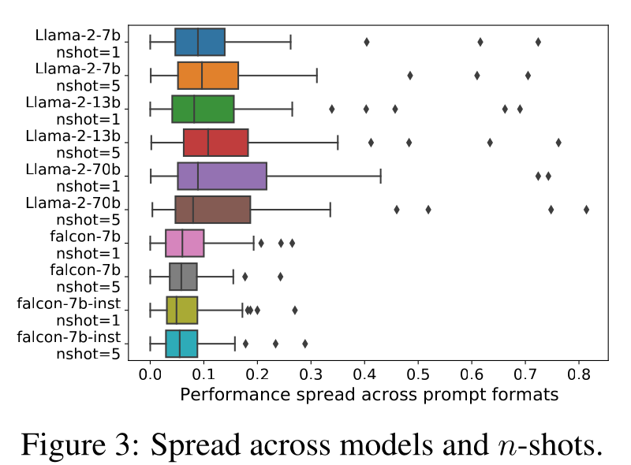

## Worum es geht

Die Genauigkeit eines LLM auf derselben Aufgabe hängt auch von der oberflächlichen Präsentation ab. Dieses Dokument sammelt belegte Effektgrößen zu vier Achsen der Format-Sensitivität: Streuung über bedeutungsäquivalente Prompt-Formate, Reihenfolge von Prämissen und Beispielen, Länge der Begründung sowie Token-Budget und Overthinking. Notation ist damit Wirkhebel und Störfaktor zugleich: Jede Ablation muss Formatvarianten kontrollieren. Ankerquelle ist FormatSpread (Sclar et al., ICLR 2024).

## Format-Spannweite bei Prompts

Der Spread ist die Differenz zwischen bester und schlechtester Genauigkeit über bedeutungsäquivalente Prompt-Formate; Sclar et al. messen ihn auf 53 Super-NaturalInstructions-Aufgaben mit LLaMA-2, Falcon und GPT-3.5-Turbo [Sclar et al. 2024](https://arxiv.org/abs/2310.11324, accessed 2026-09-12). Er erreicht bis zu 76 Genauigkeitspunkte bei LLaMA-2-13B und im Mittel rund 10 Punkte über 50+ Aufgaben [Sclar et al. 2024](https://arxiv.org/abs/2310.11324, accessed 2026-09-12). Mit 10 zufälligen Formaten pro Aufgabe liegt der Median bei 7.5 Punkten; 20% der Aufgaben erreichen mindestens 15 (LLaMA-2) beziehungsweise 9 Punkte (Falcon), einzelne über 70 [Sclar et al. 2024](https://arxiv.org/abs/2310.11324, accessed 2026-09-12). GPT-3.5-Turbo erreicht über Suchräume von 320 Formaten einen maximalen Spread von 56 Punkten bei einem Median von 6.4 [Sclar et al. 2024](https://arxiv.org/abs/2310.11324, accessed 2026-09-12). Sensitivität bleibt trotz Modellskalierung, mehr Few-Shot-Beispielen und Instruction-Tuning; Modellvergleiche kippen bei Formatwechsel mit Wahrscheinlichkeit 0.141 beziehungsweise 0.140 (in 76% und 47% dieser Fälle beide Richtungen signifikant), und Formatleistungen korrelieren zwischen Modellen nur schwach [Sclar et al. 2024](https://arxiv.org/abs/2310.11324, accessed 2026-09-12).

*Abbildung 1: Streuung der Genauigkeit über Prompt-Formate je Modell und Few-Shot-Anzahl (Boxplots, Rauten: Ausreißer-Aufgaben). (Quelle: [Sclar et al. 2024](https://arxiv.org/abs/2310.11324, accessed 2026-09-12))*

Die Feinstruktur der Formate: 24% aller atomaren Formatänderungen verschieben die Genauigkeit um mindestens 5 Punkte (exaktes Präfix-Matching); belastbare Einzeleffekte zeigen nur Trennzeichen (22% der Aufgaben mit stark unterschiedlichen Verteilungen) und Nummerierungsformate (10%), während Klammerungs- und Whitespace-Varianten als Einzelmerkmal in keiner Aufgabe unterscheidbar sind [Sclar et al. 2024](https://arxiv.org/abs/2310.11324, accessed 2026-09-12). Einen Schritt weiter geht SATQuest (ACL 2026), das identische logische Probleme in vier Formaten stellt (mathematische Notation, DIMACS-Maschinenformat, Story, DualStory): DeepSeek-R1 und QwQ-32B verlieren im DIMACS-Format 9% beziehungsweise 10% Genauigkeit gegenüber der mathematischen Notation, o3-mini bleibt stabil, und Modelle, die zuerst in vertraute Notation übersetzen, argumentieren robuster [Zhao et al. 2026](https://arxiv.org/abs/2509.00930, accessed 2026-09-12).

## Reihenfolge und Struktur

Die Reihenfolge der Few-Shot-Beispiele entscheidet zwischen Leistung nahe dem Stand der Technik und Zufallsniveau; dieselbe Permutation fällt von 88.7% auf 51.6% beim Wechsel von GPT2-XL auf GPT2-Large, und gute Permutationen korrelieren zwischen GPT-3-2.7B und GPT-3-175B nur mit 0.05 [Lu et al. 2022](https://arxiv.org/abs/2104.08786, accessed 2026-09-12). Weder mehr Trainingsbeispiele noch Kalibrierung senken die Varianz systematisch; entropiebasierte Auswahl bringt im Mittel 13% relative Verbesserung, bei Hochvarianzmodellen bis 30% [Lu et al. 2022](https://arxiv.org/abs/2104.08786, accessed 2026-09-12).

Beim deduktiven Reasoning kostet das Umsortieren semantisch äquivalenter Prämissen über 30 Punkte: GPT-4-turbo und PaLM 2-L verlieren 20 bis 30 Punkte, Gemini 1.0 Pro und GPT-3.5-turbo fallen von über 65% auf unter 25% [Chen et al. 2024, Premise Order](https://arxiv.org/abs/2402.08939, accessed 2026-09-12). Alle Modelle sind am stärksten, wenn die Prämissenreihenfolge dem Beweisverlauf folgt [Chen et al. 2024, Premise Order](https://arxiv.org/abs/2402.08939, accessed 2026-09-12). Auf dem aus GSM8K abgeleiteten Benchmark R-GSM (nur Satzreihenfolge umgestellt) fällt GPT-3.5-turbo auf ursprünglich gelösten Aufgaben von 100% auf 64.9%, GPT-4-turbo auf 89.9%; mindestens 10% der gelösten Aufgaben misslingen allen Modellen, und 45.0% der GPT-4-turbo-Fehler folgen den Zahlen in Auftretensreihenfolge statt zeitlicher Abhängigkeiten [Chen et al. 2024, Premise Order](https://arxiv.org/abs/2402.08939, accessed 2026-09-12).

## Begruendungslänge und Token-Budget

Mehr Begründungsschritte bei konstantem Informationsgehalt heben die Genauigkeit: GSM8K steigt mit Auto-CoT von 65.8% auf 78.8%, während Komprimieren die Leistung auf Zero-Shot-Niveau zurückwirft [Jin et al. 2024](https://arxiv.org/abs/2401.04925, accessed 2026-09-12). Auch sachlich falsche Begründungen nützen, solange die Länge der Inferenzkette erhalten bleibt; komplexe Aufgaben profitieren stärker [Jin et al. 2024](https://arxiv.org/abs/2401.04925, accessed 2026-09-12).

o1-artige Modelle verbrauchen für "2 plus 3" im Schnitt rund 1953 Prozent mehr Tokens als konventionelle Modelle für dieselbe Antwort; dokumentiert ist ein Beispiel mit 13 Lösungen für diese triviale Frage [Chen et al. 2024, Overthinking](https://arxiv.org/abs/2412.21187, accessed 2026-09-12). In über 92% der gelösten Fälle liefert bereits die erste Lösungsrunde die richtige Antwort; auf MATH500 generiert QwQ-32B-Preview im Mittel 2407.9 Tokens bei 52.3% Outcome-Effizienz, gegen 593.1 Tokens und 86.8% bei einem konventionellen Modell mit einer Lösung [Chen et al. 2024, Overthinking](https://arxiv.org/abs/2412.21187, accessed 2026-09-12). Die Self-Training-Kürzung spart auf MATH500 48.6% der Tokens bei erhaltener Genauigkeit; auf der einfachsten Schwierigkeitsstufe bleibt die Effizienz unter 50% [Chen et al. 2024, Overthinking](https://arxiv.org/abs/2412.21187, accessed 2026-09-12).

## Belegte Effektgroessen

| Befund | Zahl | Quelle |
|---|---|---|
| Spread über Prompt-Formate: LLaMA-2-13B / GPT-3.5-Turbo (320 Formate) | bis 76 / bis 56 Punkte, Median 6.4 | [Sclar et al. 2024](https://arxiv.org/abs/2310.11324, accessed 2026-09-12) |
| Median bei 10 zufälligen Formaten je Aufgabe | 7.5 Punkte; 20% der Aufgaben erreichen mindestens 15 beziehungsweise 9 | [Sclar et al. 2024](https://arxiv.org/abs/2310.11324, accessed 2026-09-12) |
| Atomare Formatänderungen | 24% verschieben mindestens 5 Punkte | [Sclar et al. 2024](https://arxiv.org/abs/2310.11324, accessed 2026-09-12) |
| Beispielreihenfolge (SST-2, vier Beispiele) | 88.7% gegen 51.6% nach Modellwechsel; Rangkorrelation 0.05 | [Lu et al. 2022](https://arxiv.org/abs/2104.08786, accessed 2026-09-12) |
| Prämissen-Permutation, deduktives Reasoning | Rückgang über 30 Punkte; von über 65% auf unter 25% | [Chen et al. 2024, Premise Order](https://arxiv.org/abs/2402.08939, accessed 2026-09-12) |
| R-GSM, ursprünglich gelöste Aufgaben | 100% auf 64.9% (GPT-3.5-turbo), 100% auf 89.9% (GPT-4-turbo) | [Chen et al. 2024, Premise Order](https://arxiv.org/abs/2402.08939, accessed 2026-09-12) |
| Verlängerte CoT-Schritte (GSM8K, Auto-CoT) | 65.8% auf 78.8% | [Jin et al. 2024](https://arxiv.org/abs/2401.04925, accessed 2026-09-12) |
| Overthinking: "2 plus 3" / Token-Kürzung MATH500 | rund 1953% mehr Tokens (Beispiel mit 13 Lösungen); 48.6% Kürzung bei erhaltener Genauigkeit | [Chen et al. 2024, Overthinking](https://arxiv.org/abs/2412.21187, accessed 2026-09-12) |
| DIMACS gegen mathematische Notation | Genauigkeitsverlust 9% (DeepSeek-R1) und 10% (QwQ-32B) | [Zhao et al. 2026](https://arxiv.org/abs/2509.00930, accessed 2026-09-12) |

## Implikationen fuer Notationsdesign

- Spannweite statt Einzelwert: Bei bis zu 76 Punkten Spread und kippenden Modellrankings sollte jede Ablation mehrere Notationen prüfen und die Spanne ausweisen [Sclar et al. 2024](https://arxiv.org/abs/2310.11324, accessed 2026-09-12).
- Pro Zielmodell kalibrieren: Formate und Permutationen korrelieren schwach zwischen Modellen (0.05; Umkehrwahrscheinlichkeit rund 0.14) [Lu et al. 2022](https://arxiv.org/abs/2104.08786, accessed 2026-09-12), [Sclar et al. 2024](https://arxiv.org/abs/2310.11324, accessed 2026-09-12).
- Struktur vor Zeichenkosmetik: Prämissen entlang des Beweisverlaufs anordnen und die Beispielreihenfolge stabil halten [Chen et al. 2024, Premise Order](https://arxiv.org/abs/2402.08939, accessed 2026-09-12).
- Einzelmerkmale nur im Bündel testen: Klammerung und Whitespace wirken allein nicht nachweisbar, Trennzeichen und Nummerierung dagegen stark; Ablationen brauchen Faktorkombinationen [Sclar et al. 2024](https://arxiv.org/abs/2310.11324, accessed 2026-09-12).
- Prompt-Begründung explizit, Antwort-Budget begrenzt: Zwischenschritte helfen im Prompt [Jin et al. 2024](https://arxiv.org/abs/2401.04925, accessed 2026-09-12), Mehrfachlösungen bringen nach der ersten korrekten Antwort kaum Genauigkeit [Chen et al. 2024, Overthinking](https://arxiv.org/abs/2412.21187, accessed 2026-09-12).
- Vertraute Notation als Brücke: Übersetzen in mathematische Notation bleibt robuster als direktes Rechnen im Maschinenformat [Zhao et al. 2026](https://arxiv.org/abs/2509.00930, accessed 2026-09-12).

## Konflikte und offene Punkte

- Begründungslänge: Jin et al. zeigen Nutzen längerer Prompt-Begründungen, Chen et al. minimalen Genauigkeitsbeitrag zusätzlicher generierter Lösungen; die Quellen führen die Ebenen (Demonstrationen gegen Antwortketten) nicht zusammen [Jin et al. 2024](https://arxiv.org/abs/2401.04925, accessed 2026-09-12), [Chen et al. 2024, Overthinking](https://arxiv.org/abs/2412.21187, accessed 2026-09-12).
- Permutationsrobustheit: Frühere Arbeiten fanden Modelle robust gegen vertauschte Wörter; Chen et al. zeigen hohe Brittleness bei syntaktisch validen, bedeutungserhaltenden Umordnungen. Unaufgelöst [Chen et al. 2024, Premise Order](https://arxiv.org/abs/2402.08939, accessed 2026-09-12).
- Ursache der Varianz offen: Weder Modellgröße noch mehr Trainingsbeispiele noch Instruction-Tuning beseitigen die Sensitivität; ein Mechanismus fehlt [Lu et al. 2022](https://arxiv.org/abs/2104.08786, accessed 2026-09-12), [Sclar et al. 2024](https://arxiv.org/abs/2310.11324, accessed 2026-09-12).
- Notationswechsel jenseits von Prompt-Formaten: Für ASCII gegen LaTeX oder Unicode und für einzelne Klammerstile liefern die geprüften Quellen keine Genauigkeits-Deltas; belastbar ist nur der Vergleich DIMACS gegen mathematische Notation (9% und 10%) [Zhao et al. 2026](https://arxiv.org/abs/2509.00930, accessed 2026-09-12), [Sclar et al. 2024](https://arxiv.org/abs/2310.11324, accessed 2026-09-12).
- Berichtsgrenzen: Signifikanzangaben existieren punktuell (Sclar et al. berichten Umkehrwahrscheinlichkeiten), Streuungsmaße und Testsetgrößen fehlen sonst weitgehend; die Spread-Zahlen stammen aus generischen NLP-Aufgaben, nicht aus Mathematik. Messdesign für einen eigenen Test: Cluster 05 (05-05).

## Quellen

- Sclar, M., Choi, Y., Tsvetkov, Y. und Suhr, A. (2024): Quantifying Language Models' Sensitivity to Spurious Features in Prompt Design or: How I learned to start worrying about prompt formatting. ICLR 2024, arXiv:2310.11324. https://arxiv.org/abs/2310.11324 (accessed 2026-09-12)
- Lu, Y., Bartolo, M., Moore, A., Riedel, S. und Stenetorp, P. (2022): Fantastically Ordered Prompts and Where to Find Them: Overcoming Few-Shot Prompt Order Sensitivity. ACL 2022, arXiv:2104.08786. https://arxiv.org/abs/2104.08786 (accessed 2026-09-12)
- Chen, X., Chi, R. A., Wang, X. und Zhou, D. (2024): Premise Order Matters in Reasoning with Large Language Models. ICML 2024, arXiv:2402.08939. https://arxiv.org/abs/2402.08939 (accessed 2026-09-12)
- Jin, M., Yu, Q., Shu, D., Zhao, H., Hua, W., Meng, Y., Zhang, Y. und Du, M. (2024): The Impact of Reasoning Step Length on Large Language Models. Findings of ACL 2024, arXiv:2401.04925. https://arxiv.org/abs/2401.04925 (accessed 2026-09-12)
- Chen, X., Xu, J., Liang, T., He, Z., Pang, J., Yu, D., Song, L., Liu, Q., Zhou, M., Zhang, Z., Wang, R., Tu, Z., Mi, H. und Yu, D. (2024): Do NOT Think That Much for 2+3=? On the Overthinking of o1-Like LLMs. arXiv:2412.21187. https://arxiv.org/abs/2412.21187 (accessed 2026-09-12)
- Zhao, Y., Li, Y., Bo, Z., Takezoe, R., Hui, H., Guang, M., Ren, L., Qin, X. und Long, K. (2026): SATQuest: A Verifier for Logical Reasoning Evaluation and Reinforcement Fine-Tuning of LLMs. ACL 2026, arXiv:2509.00930. https://arxiv.org/abs/2509.00930 (accessed 2026-09-12)
