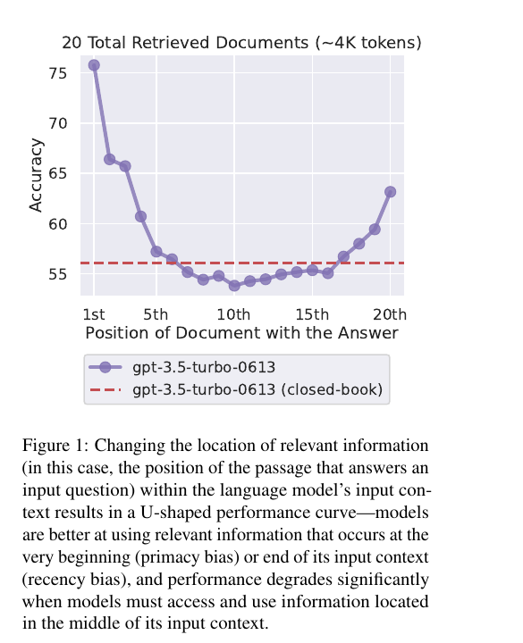

## Worum es geht

Eine Mathematik-Notation wirkt nur, wenn das Modell die Information an ihrer Position nutzt und das Format genug Zwischenschritte erlaubt. Dieses Dokument belegt mit Zahlen drei Befundgruppen: Positions- und Distanzeffekte im Kontext (U-Kurve, effektive Kontextlänge), die Verankerung der Attention an Anfangstokens (attention sinks) und den Gewinn expliziter Zwischenschritte (Scratchpad, CoT). Daraus folgen Randbedingungen für Position, Distanz, Schrittgranularität und Struktur der Notation.

## Wo im Kontext steht Information nutzbar

Liu et al. variieren in Multi-Dokument-Fragebeantwortung und Key-Value-Retrieval die Position der relevanten Information; die Genauigkeit folgt einer U-Kurve mit höchsten Werten am Anfang oder Ende und deutlichem Abfall in der Mitte [Liu et al. 2023](https://arxiv.org/abs/2307.03172, accessed 2026-09-12). Bei GPT-3.5-Turbo fällt sie in der Kontextmitte unter das Niveau ohne jegliche Dokumente (56.1%) [Liu et al. 2023](https://arxiv.org/abs/2307.03172, accessed 2026-09-12). Im Multi-Dokument-Setting zeigt Llama-2-13B zwischen bester und schlechtester Position eine Differenz von 20 Punkten, nach zusätzlichem Fine-Tuning noch 10; die U-Kurve tritt nur in den größeren Modellen (13B, 70B) auf, das 7B-Modell ist rein recency-geprägt [Liu et al. 2023](https://arxiv.org/abs/2307.03172, accessed 2026-09-12). Beim Key-Value-Retrieval (300 Paare, etwa 16K Tokens) ist das Bild gemischt: manche Modelle bleiben robust, andere folgen dem U-Muster [Liu et al. 2023](https://arxiv.org/abs/2307.03172, accessed 2026-09-12).

RULER quantifiziert die effektive Kontextlänge mit 17 Modellen und 13 Aufgaben über 4K bis 128K Tokens; Schwelle ist Llama2-7B bei 4K mit 85.6% [Hsieh et al. 2024](https://arxiv.org/abs/2404.06654, accessed 2026-09-12). Obwohl alle Modelle mindestens 32K Tokens beanspruchen, hält nur die Hälfte diese Länge effektiv; Gemini-1.5-Pro übertrifft die größte getestete Länge, Yi-34B-200K degradiert mit steigender Komplexität und scheitert beim UUID-Retrieval jenseits 128K [Hsieh et al. 2024](https://arxiv.org/abs/2404.06654, accessed 2026-09-12).

Levy et al. isolieren den Längeneffekt von der Position: Bei dupliziertem Fülltext sinkt die mittlere Genauigkeit schon bei rund 3000 Tokens Padding von 0.92 auf 0.68, auch bei positionsunabhängig mehrfach vorliegenden Schlüsselpassagen; besonders groß ist der Einbruch bei Beweisstücken aus zwei nicht benachbarten Stellen [Levy et al. 2024](https://arxiv.org/abs/2402.14848, accessed 2026-09-12). CoT-Prompting schließt den Effekt in den meisten Modellen nicht (Ausnahme GPT-4) [Levy et al. 2024](https://arxiv.org/abs/2402.14848, accessed 2026-09-12).

*Abbildung 1: GPT-3.5-Turbo, 20 Dokumente (etwa 4K Tokens): Genauigkeit am Anfang und Ende am höchsten, in der Mitte unter der geschlossene-Buch-Baseline. (Quelle: [Liu et al. 2023](https://arxiv.org/abs/2307.03172, accessed 2026-09-12))*

## Lokalitaet der Attention

Xiao et al. finden über alle Schichten und Köpfe eine ungewöhnlich starke Attention auf die ersten Tokens, unabhängig von deren Semantik (attention sink) [Xiao et al. 2024](https://arxiv.org/abs/2309.17453, accessed 2026-09-12). Verdrängt reine Fenster-Attention deren KV-Cache, bricht die Sprachmodellierung ein: Llama-2-13B springt von 5.40 Perplexität (4+1020, erstes PG-19-Buch, 65K Tokens) auf 5158.07 im 1024er-Fenster; vier Zeilenumbruch-Tokens stellen vergleichbare Werte wieder her (5.60) [Xiao et al. 2024](https://arxiv.org/abs/2309.17453, accessed 2026-09-12). Vier Anfangstokens genügen in der Regel: Llama-2-7B erreicht 3359.95 ohne, 11.88 mit einem, 10.51 mit zwei, 9.59 mit vier und 9.54 mit acht [Xiao et al. 2024](https://arxiv.org/abs/2309.17453, accessed 2026-09-12). Mit festem Präfix bleibt die Modellierung bis 4 Millionen Tokens stabil (bis 22.2-facher Speedup) [Xiao et al. 2024](https://arxiv.org/abs/2309.17453, accessed 2026-09-12). Der Effekt entsteht, weil frühe Tokens für alle späteren sichtbar sind; ein einzelnes trainierbares Sink-Token kann die Rolle übernehmen [Xiao et al. 2024](https://arxiv.org/abs/2309.17453, accessed 2026-09-12).

## Schrittformate und Rechentiefe

Nye et al. lassen Modelle Zwischenschritte in ein "Scratchpad" ausgeben; dadurch werden Zustände im Kontext per Attention referenzierbar, Fehlerfortpflanzung sinkt durch Token-Quantisierung, und die Rechenzeit passt sich der Aufgabenschwierigkeit an [Nye et al. 2021](https://arxiv.org/abs/2112.00114, accessed 2026-09-12). Bei schriftlicher Addition (Training auf 1 bis 8 Stellen) scheitern Modelle ohne Scratchpad selbst in der größten getesteten Größe; auf 9- und 10-stelliger Out-of-Distribution-Addition versagt die Baseline vollständig, das Scratchpad-Modell verbessert sich von 2M bis 1B Parameter [Nye et al. 2021](https://arxiv.org/abs/2112.00114, accessed 2026-09-12). Polynomauswertung: 8.8% auf 20.1% (Few-Shot), 31.8% auf 50.7% (Fine-Tuning) [Nye et al. 2021](https://arxiv.org/abs/2112.00114, accessed 2026-09-12). Synthetische Python-Programme: 11% auf 26.5% (Few-Shot), 20% auf 41.5% (Fine-Tuning); auf MBPP mit Zusatzdaten sind 26.6% der Aufgaben korrekt ausgeführt, das beste Modell liefert für fast 42% aller Traces die exakte Kette [Nye et al. 2021](https://arxiv.org/abs/2112.00114, accessed 2026-09-12).

Li et al. begründen dies theoretisch: Ohne CoT lösen Transformatoren konstanter Tiefe mit konstanter Bit-Präzision nur AC0, mit polynomgroßem Embedding nur TC0; mit T CoT-Schritten löst konstante Tiefe mit O(log n) Embedding jedes Problem, das boolesche Schaltkreise der Größe T lösen [Li et al. 2024](https://arxiv.org/abs/2402.12875, accessed 2026-09-12). Empirisch liegt die Genauigkeit ohne CoT auf der Permutationskomposition S5 bei etwa 20% (Zufallsniveau); CoT hebt drastisch, besonders bei geringer Tiefe, und iteriertes Quadrieren ist mit CoT selbst bei Tiefe 1 perfekt ausdrückbar [Li et al. 2024](https://arxiv.org/abs/2402.12875, accessed 2026-09-12). Jeder generierte Zwischenschritt kauft serielle Rechenoperationen, die ein flacher Einzeldurchlauf nicht hat [Li et al. 2024](https://arxiv.org/abs/2402.12875, accessed 2026-09-12).

## Belegte Effektgroessen

| Befund | Zahl | Quelle |
|---|---|---|
| Positionsabhängigkeit (Multi-Dokument-QA) | Kontextmitte unter geschlossene-Buch-Niveau (56.1%); Llama-2-13B: 20 Punkte Differenz (10 nach Fine-Tuning); U-Kurve nur in 13B und 70B | [Liu et al. 2023](https://arxiv.org/abs/2307.03172, accessed 2026-09-12) |
| Key-Value-Retrieval | 300 Paare (etwa 16K Tokens); einige Modelle perfekt, andere U-förmig | [Liu et al. 2023](https://arxiv.org/abs/2307.03172, accessed 2026-09-12) |
| Effektive Kontextlänge | Von 17 Modellen mit Anspruch 32K+ bleibt nur die Hälfte über der Schwelle 85.6% | [Hsieh et al. 2024](https://arxiv.org/abs/2404.06654, accessed 2026-09-12) |
| Längeneffekt | 0.92 auf 0.68 bei etwa 3000 Tokens Padding, auch bei duplizierten Schlüsselpassagen | [Levy et al. 2024](https://arxiv.org/abs/2402.14848, accessed 2026-09-12) |
| Attention-Sink und Streaming | Llama-2-13B: 5158.07 auf 5.40 (4+1020); vier Anfangstokens genügen; stabil bis 4M Tokens, bis 22.2-facher Speedup gegenüber Sliding-Window-Recomputation | [Xiao et al. 2024](https://arxiv.org/abs/2309.17453, accessed 2026-09-12) |
| Scratchpad Addition (9-10 Stellen, OOD) | Baseline scheitert vollständig; Verbesserung von 2M bis 1B Parameter | [Nye et al. 2021](https://arxiv.org/abs/2112.00114, accessed 2026-09-12) |
| Scratchpad Polynome und Programme | Polynome: 8.8% auf 20.1% (Few-Shot), 31.8% auf 50.7% (Fine-Tuning); Programme: 11% auf 26.5%, 20% auf 41.5%; MBPP 26.6% korrekt | [Nye et al. 2021](https://arxiv.org/abs/2112.00114, accessed 2026-09-12) |
| CoT-Token-Budget | Ohne CoT nur AC0; T CoT-Schritte erreichen Schaltkreisgröße T | [Li et al. 2024](https://arxiv.org/abs/2402.12875, accessed 2026-09-12) |
| CoT empirisch | S5 ohne CoT etwa 20% (Zufallsniveau); mit CoT drastisch besser bei geringer Tiefe | [Li et al. 2024](https://arxiv.org/abs/2402.12875, accessed 2026-09-12) |

## Implikationen fuer Notationsdesign

- Ränder statt Mitte: Aufgabe, Definitionen und Fakten an Anfang oder Ende platzieren; die Kontextmitte ist schlechter als gar keine Dokumente [Liu et al. 2023](https://arxiv.org/abs/2307.03172, accessed 2026-09-12).
- Kontext kurz halten: Reasoning degradiert lange vor der technischen Grenze, auch bei positionsneutralem Fülltext [Levy et al. 2024](https://arxiv.org/abs/2402.14848, accessed 2026-09-12); kompakte Notation ist ein Wirksamkeitshebel.
- Anfang verankern: Cache- und Verdichtungsverfahren sollten das Anfangskontext nicht verdrängen; vier Anfangstokens tragen die Verankerung [Xiao et al. 2024](https://arxiv.org/abs/2309.17453, accessed 2026-09-12).
- Schritte benennen und adressierbar halten: Zwischenzustände sichtbar in den Kontext (Namen, Indizes), die Gewinne beruhen auf Attention auf frühere Schritte [Nye et al. 2021](https://arxiv.org/abs/2112.00114, accessed 2026-09-12).
- Schrittgranularität als Rechenbudget: Mehr explizite Schritte entsprechen mehr serieller Tiefe; die Out-of-Distribution-Gewinne bei 9-10-stelliger Addition gibt es nur mit Scratchpad [Li et al. 2024](https://arxiv.org/abs/2402.12875, accessed 2026-09-12), [Nye et al. 2021](https://arxiv.org/abs/2112.00114, accessed 2026-09-12).
- Effektive statt nominelle Länge budgetieren: an der effektiven Grenze ausrichten (bei der Hälfte der geprüften Modelle 32K), nicht an der beworbenen Maximallänge [Hsieh et al. 2024](https://arxiv.org/abs/2404.06654, accessed 2026-09-12).

## Konflikte und offene Punkte

- Position gegen Länge: Liu et al. messen Positionseffekte bei fester Länge, Levy et al. Längeneffekte ohne Positionsvarianz; die Mechanismen sind nicht getrennt messbar [Liu et al. 2023](https://arxiv.org/abs/2307.03172, accessed 2026-09-12), [Levy et al. 2024](https://arxiv.org/abs/2402.14848, accessed 2026-09-12).
- CoT als Gegenmittel: Levy et al. finden keine Schließung der Längendegradation, Li et al. und Nye et al. starke Gewinne auf kompakten Kontexten; der Widerspruch bleibt offen [Levy et al. 2024](https://arxiv.org/abs/2402.14848, accessed 2026-09-12), [Li et al. 2024](https://arxiv.org/abs/2402.12875, accessed 2026-09-12), [Nye et al. 2021](https://arxiv.org/abs/2112.00114, accessed 2026-09-12).
- Sink gegen Primacy: Xiao et al. erklären den Sink als Softmax-Artefakt, Liu et al. den Anfangsvorteil als Primacy-Bias; eine gemeinsame Erklärung fehlt [Xiao et al. 2024](https://arxiv.org/abs/2309.17453, accessed 2026-09-12), [Liu et al. 2023](https://arxiv.org/abs/2307.03172, accessed 2026-09-12).
- Übertrag auf mathematische Notation: Keine der geprüften Quellen testet Formelnotation; direkte Messungen dazu: *[unkenntlich — keine Quelle gefunden]*.
- RULER-Schwelle: Die Grenze 85.6% ist eine qualitative Setzung; mit anderer Schwelle verschiebt sich die effektive Länge [Hsieh et al. 2024](https://arxiv.org/abs/2404.06654, accessed 2026-09-12).
- Berichtsgrenzen: Stichprobengrößen pro Positionsbedingung und Unsicherheitsmaße fehlen; Modellversionen sind undatiert (GPT-3.5-Turbo, GPT-4). Zielmodellwerte und Messmethodik: Cluster 01 und 05.

## Quellen

- Liu, N. F., Lin, K., Hewitt, J., Paranjape, A., Bevilacqua, M., Petroni, F. und Liang, P. (2023): Lost in the Middle: How Language Models Use Long Contexts. TACL 2023, arXiv:2307.03172. https://arxiv.org/abs/2307.03172 (accessed 2026-09-12)
- Hsieh, C.-P., Sun, S., Kriman, S., Acharya, S., Rekesh, D., Jia, F., Zhang, Y. und Ginsburg, B. (2024): RULER: What's the Real Context Size of Your Long-Context Language Models? COLM 2024, arXiv:2404.06654. https://arxiv.org/abs/2404.06654 (accessed 2026-09-12)
- Li, Z., Liu, H., Zhou, D. und Ma, T. (2024): Chain of Thought Empowers Transformers to Solve Inherently Serial Problems. ICLR 2024, arXiv:2402.12875. https://arxiv.org/abs/2402.12875 (accessed 2026-09-12)
- Nye, M., Andreassen, A. J., Gur-Ari, G., Michalewski, H., Austin, J., Bieber, D., Dohan, D., Lewkowycz, A., Bosma, M., Luan, D., Sutton, C. und Odena, A. (2021): Show Your Work: Scratchpads for Intermediate Computation with Language Models. arXiv:2112.00114. https://arxiv.org/abs/2112.00114 (accessed 2026-09-12)
- Xiao, G., Tian, Y., Chen, B., Han, S. und Lewis, M. (2024): Efficient Streaming Language Models with Attention Sinks. ICLR 2024, arXiv:2309.17453. https://arxiv.org/abs/2309.17453 (accessed 2026-09-12)
- Levy, M., Jacoby, A. und Goldberg, Y. (2024): Same Task, More Tokens: the Impact of Input Length on the Reasoning Performance of Large Language Models. ACL 2024, arXiv:2402.14848. https://arxiv.org/abs/2402.14848 (accessed 2026-09-12)
