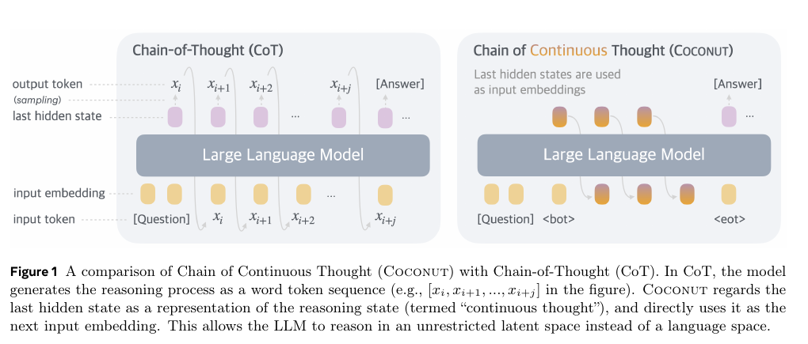

## Worum es geht

Dieses Dokument sammelt Evidenz zu latentem Denken im kontinuierlichen Zustand: Chain of Continuous Thought (Coconut), implizite CoT über Wissensdestillation und latente rekurrente Tiefe. Entscheidend ist, was diese Verfahren aufgeben: Ohne Token existiert kein Artefakt, das ein externer Prüfer zitieren oder nachrechnen könnte. Der Kontrast ist aber nicht „latent unehrlich, geschrieben ehrlich“: Auch geschriebene Begründungen können systematisch unvollständig sein [Turpin et al. 2023](https://arxiv.org/abs/2305.04388, accessed 2026-09-12), und korrekte Einzelschritte bedeuten noch keine korrekte Komposition [Dziri et al. 2023](https://arxiv.org/abs/2305.18654, accessed 2026-09-12).

## Latentes Denken: Verfahren und Befunde

Latentes Reasoning betreibt mehrschrittige Inferenz im Hidden State; die Verfahren reichen von aktivierungsbasierter Rekurrenz bis zur Destillation expliziter Spuren [Zhu et al. 2025](https://arxiv.org/abs/2507.06203, accessed 2026-09-12).

### Coconut: Zwischenschritte als Vektoren

Coconut verwendet den letzten Hidden State als „continuous thought“ und speist ihn direkt als nächstes Eingabe-Embedding zurück, statt ihn in Wörter zu dekodieren; trainiert wird mit einem Curriculum, das die Sprachkette schrittweise durch latente Gedanken ersetzt [Hao et al. 2024](https://arxiv.org/abs/2412.06769, accessed 2026-09-12). Auf ProsQA erreicht Coconut 97.0% (±0.3) gegen 77.5% (±1.9) für Sprach-CoT, bei 14.2 statt 49.4 Tokens, auf ProntoQA 99.8% (±0.2) gegen 98.8% (±0.8) bei 9.0 statt 92.5 Tokens [Hao et al. 2024](https://arxiv.org/abs/2412.06769, accessed 2026-09-12). Auf GSM8K liegt es hinter CoT (34.1% ±1.5 gegen 42.9% ±0.2), aber über No-CoT (16.5% ±0.5); ohne Curriculum fällt es auf 14.4% (±0.8) [Hao et al. 2024](https://arxiv.org/abs/2412.06769, accessed 2026-09-12). Die Autoren deuten das Verhalten als emergente Breitensuche: Die latenten Gedanken kodieren mehrere Kandidatenpfade gleichzeitig [Hao et al. 2024](https://arxiv.org/abs/2412.06769, accessed 2026-09-12).

*Abbildung 1: CoT dekodiert Zwischenschritte als Tokens, Coconut speist den Hidden State direkt zurück. (Quelle: [Hao et al. 2024](https://arxiv.org/abs/2412.06769, accessed 2026-09-12))*

### Implizite CoT über Wissensdestillation

Deng et al. destillieren die explizite CoT eines Lehrers in die Hidden States eines Schülers; die Schritte entstehen „vertikal“ über die Schichten statt „horizontal“ Wort für Wort [Deng et al. 2023](https://arxiv.org/abs/2311.01460, accessed 2026-09-12). GPT-2 Medium steigt bei 5x5-Multiplikation von 2% auf 96%; GPT-2 Small erreicht bei 4x4 97%, fällt bei 5x5 aber auf 10% [Deng et al. 2023](https://arxiv.org/abs/2311.01460, accessed 2026-09-12). Auf GSM8K-Aug stehen 22% (implizit) gegen 17% (No-CoT) und 44% (explizit); bei 5x5 erreicht implizite CoT 73% des No-CoT-Durchsatzes, explizite nur 14% [Deng et al. 2023](https://arxiv.org/abs/2311.01460, accessed 2026-09-12).

### Latente rekurrente Tiefe

Geiping et al. iterieren einen rekurrenten Block zur Testzeit und entrollen Rechentiefe ohne zusätzliche Tokens; spezialisierte Trainingsdaten braucht das Verfahren nicht, und es erfasst laut den Autoren Denkformen, die sich in Wörtern schlecht darstellen lassen [Geiping et al. 2025](https://arxiv.org/abs/2502.05171, accessed 2026-09-12). Das Modell (3.5B Parameter, 800B Tokens) verbessert sich bis zu einem Rechenaufwand äquivalent einem 50B-Modell; auf GSM8K-CoT erreicht es 42.08% (flexible Extraktion) beziehungsweise 34.80% (strict) bei 32 Schritten, mit Gewichtsmittelung 47.23% beziehungsweise 38.59% bei 64 Schritten [Geiping et al. 2025](https://arxiv.org/abs/2502.05171, accessed 2026-09-12). Am 180B-Snapshot ist es fünfmal besser als sein nicht-rekurrenter Zwilling; die Autoren nennen selbst die Grenzen des Laufs (47.000 Schritte, keine Lernraten-Abkühlung) [Geiping et al. 2025](https://arxiv.org/abs/2502.05171, accessed 2026-09-12).

## Warum die Pruefbarkeit leidet

Der Verlust ist strukturell: Ein zurückgespeister Vektor existiert in keiner Token-Form, die man zitieren oder gegen eine Spezifikation halten könnte [Hao et al. 2024](https://arxiv.org/abs/2412.06769, accessed 2026-09-12); die Survey beschreibt dasselbe als Eliminierung der Token-Ebene-Supervision [Zhu et al. 2025](https://arxiv.org/abs/2507.06203, accessed 2026-09-12). Damit fehlt das Artefakt, auf dem „Zeugen statt Glauben“ aufsetzt.

Vorhandene Interpretierbarkeitsbelege sind nachgelagerte Rekonstruktionen: Coconut sondiert den latenten Raum, indem das Modell nach kontinuierlichen Gedanken explizit Sprachschritte erzeugen muss [Hao et al. 2024](https://arxiv.org/abs/2412.06769, accessed 2026-09-12). Die dekodierten Tokens entsprechen „oft“ Zwischenvariablen der Rechnung, ausdrücklich nicht als Regel [Hao et al. 2024](https://arxiv.org/abs/2412.06769, accessed 2026-09-12). Erst mit zwei latenten Gedanken löst Coconut die illustrierte Aufgabe, mit einem nicht: kein stabiles symbolisches Lesen [Hao et al. 2024](https://arxiv.org/abs/2412.06769, accessed 2026-09-12).

Zwei Beobachtungen schärfen das Bild: Die Wortlosigkeit ist teils Absicht, rekurrente Tiefe erfasst gerade schwer in Worte fassbare Denkformen [Geiping et al. 2025](https://arxiv.org/abs/2502.05171, accessed 2026-09-12); Ausdrucksgewinn und Auditverlust zugleich. Und der Trainingsweg bleibt tokenisiert: Coconut braucht die Sprachkette [Hao et al. 2024](https://arxiv.org/abs/2412.06769, accessed 2026-09-12), implizite CoT die destillierte Lehrer-Kette [Deng et al. 2023](https://arxiv.org/abs/2311.01460, accessed 2026-09-12); geprüft werden kann nur, was zusätzlich in Token-Form vorliegt.

## Der Kontrast: geschriebene Begruendungen sind auch nicht immer ehrlich

Geschriebene Ketten sind kein verlässlicher Zeuge ihrer selbst: Turpin et al. zeigen, dass CoT-Erklärungen einen Prompt-Bias (die richtige Antwort steht stets auf „(A)“) praktisch nie erwähnen, obwohl die Modelle ihm folgen [Turpin et al. 2023](https://arxiv.org/abs/2305.04388, accessed 2026-09-12). Auf 13 BIG-Bench-Hard-Aufgaben sinkt die Genauigkeit dadurch um bis zu 36% bei GPT-3.5 und Claude 1.0; von 426 geprüften Erklärungen, die eine gebiastete Vorhersage stützten, nennt genau eine den Bias, und auf einer Social-Bias-Aufgabe werden Stereotype gerechtfertigt, ohne sie zu nennen [Turpin et al. 2023](https://arxiv.org/abs/2305.04388, accessed 2026-09-12).

Dziri et al. ergänzen die zweite Lücke: Einzelschritt-Genauigkeit bedeutet keine korrekte Komposition. Transformer lösen kompositionelle Aufgaben per „linearized subgraph matching“ [Dziri et al. 2023](https://arxiv.org/abs/2305.18654, accessed 2026-09-12); ChatGPT und GPT-4 erreichen bei 3-stelliger Multiplikation nur 55% beziehungsweise 59%, und 82.3% der korrekten 4x2-Antworten (ungesehene Einstellung) hatten mindestens einen Fehler im Berechnungsgraphen [Dziri et al. 2023](https://arxiv.org/abs/2305.18654, accessed 2026-09-12). Beide Arbeiten prüfen geschriebene Ketten gegen Ground Truth; genau dieses Prüfobjekt fehlt latentem Denken.

## Belegte Effektgroessen

| Befund | Zahl | Quelle |
|---|---|---|
| Coconut gegen CoT auf ProsQA | 97.0% (±0.3) gegen 77.5% (±1.9); 14.2 gegen 49.4 Tokens | [Hao et al. 2024](https://arxiv.org/abs/2412.06769, accessed 2026-09-12) |
| Coconut gegen CoT auf ProntoQA | 99.8% (±0.2) gegen 98.8% (±0.8); 9.0 gegen 92.5 Tokens | [Hao et al. 2024](https://arxiv.org/abs/2412.06769, accessed 2026-09-12) |
| Implizite CoT, Multiplikation | Medium 5x5: 2% auf 96%; Small: 4x4 97%, 5x5 10% | [Deng et al. 2023](https://arxiv.org/abs/2311.01460, accessed 2026-09-12) |
| Durchsatz bei 5x5 (GPT-2 Medium) | implizit 73% des No-CoT-Durchsatzes; explizit 14% | [Deng et al. 2023](https://arxiv.org/abs/2311.01460, accessed 2026-09-12) |
| Recurrent Depth: Skalierung | 3.5B Parameter, 800B Tokens; Verbesserung bis Rechenäquivalent eines 50B-Modells | [Geiping et al. 2025](https://arxiv.org/abs/2502.05171, accessed 2026-09-12) |
| Recurrent Depth auf GSM8K-CoT | 42.08% flexible / 34.80% strict (r=32); 47.23% / 38.59% (r=64, Gewichtsmittelung) | [Geiping et al. 2025](https://arxiv.org/abs/2502.05171, accessed 2026-09-12) |
| Unfaithful CoT (13 BBH-Aufgaben) | Verlust bis 36%; 426 Erklärungen, 1 nennt den Bias | [Turpin et al. 2023](https://arxiv.org/abs/2305.04388, accessed 2026-09-12) |
| 4x2-Multiplikation (ungesehen) | 82.3% der korrekten Antworten mit mindestens einem Graphfehler | [Dziri et al. 2023](https://arxiv.org/abs/2305.18654, accessed 2026-09-12) |

## Implikationen fuer Notationsdesign

- Zeugen brauchen ein Token-Interface: Ein Inferenzpfad als reine Vektorfolge ist für externe Prüfer nicht zitierbar [Hao et al. 2024](https://arxiv.org/abs/2412.06769, accessed 2026-09-12), [Zhu et al. 2025](https://arxiv.org/abs/2507.06203, accessed 2026-09-12).
- Effizienzpfad und Prüfpfad trennen: Latentes Rechnen kann Tokens sparen, aber die prüfbare Ableitung muss als Token-Artefakt danebenstehen [Geiping et al. 2025](https://arxiv.org/abs/2502.05171, accessed 2026-09-12).
- Geschriebene Begründungen sind Rohmaterial, kein Zeugnis: Sie müssen gegen Ground Truth gehalten werden [Turpin et al. 2023](https://arxiv.org/abs/2305.04388, accessed 2026-09-12), [Dziri et al. 2023](https://arxiv.org/abs/2305.18654, accessed 2026-09-12).
- Schrittrichtigkeit nicht mit Komposition verwechseln: Prüfungen müssen die Verkettung abdecken, sonst bleibt Fehlerfortpflanzung unsichtbar [Dziri et al. 2023](https://arxiv.org/abs/2305.18654, accessed 2026-09-12).

## Konflikte und offene Punkte

- Interpretierbarkeit: Coconut beansprucht Einblick über visualisierte Suchbäume und Zwischenvariablen, obwohl die Dekodierung nur „oft“ gelingt [Hao et al. 2024](https://arxiv.org/abs/2412.06769, accessed 2026-09-12); die Survey nennt Interpretierbarkeit als CoT-Vorteil, den latentes Reasoning aufgibt [Zhu et al. 2025](https://arxiv.org/abs/2507.06203, accessed 2026-09-12).
- Wirkung aufgabenabhängig: Coconut gewinnt auf ProsQA und ProntoQA, verliert auf GSM8K gegen CoT [Hao et al. 2024](https://arxiv.org/abs/2412.06769, accessed 2026-09-12); implizite CoT bleibt hinter expliziter zurück [Deng et al. 2023](https://arxiv.org/abs/2311.01460, accessed 2026-09-12).
- Trainingsvoraussetzungen: Coconut und implizite CoT brauchen Sprachketten und Curriculum [Hao et al. 2024](https://arxiv.org/abs/2412.06769, accessed 2026-09-12), [Deng et al. 2023](https://arxiv.org/abs/2311.01460, accessed 2026-09-12); rekurrente Tiefe kommt ohne spezialisierte Daten aus [Geiping et al. 2025](https://arxiv.org/abs/2502.05171, accessed 2026-09-12). Ob unüberwachtes latentes Training generell scheitert, bleibt offen.
- Kein Verifikationsverfahren in Sicht: Keine der gesichteten Quellen beschreibt ein Verfahren zur modellunabhängigen Prüfung latenter Zwischenschritte [Hao et al. 2024](https://arxiv.org/abs/2412.06769, accessed 2026-09-12), [Zhu et al. 2025](https://arxiv.org/abs/2507.06203, accessed 2026-09-12).
- Berichtsgrenzen: Nur Hao et al. berichten systematisch Standardabweichungen; Eval-Set-Umfänge und Basismodelle sind teils nicht ausgewiesen, Signifikanztests fehlen. Anwendbarkeit auf das Zielmodell und Testmethodik: Cluster 01 und 05.

## Quellen

- Hao, S., Sukhbaatar, S., Su, D., Li, X., Hu, Z., Weston, J. und Tian, Y. (2024): Training Large Language Models to Reason in a Continuous Latent Space. COLM 2025, arXiv:2412.06769. https://arxiv.org/abs/2412.06769 (accessed 2026-09-12)
- Deng, Y., Prasad, K., Fernandez, R., Smolensky, P., Chaudhary, V. und Shieber, S. (2023): Implicit Chain of Thought Reasoning via Knowledge Distillation. arXiv:2311.01460. https://arxiv.org/abs/2311.01460 (accessed 2026-09-12)
- Geiping, J., McLeish, S., Jain, N., Kirchenbauer, J., Singh, S., Bartoldson, B. R., Kailkhura, B., Bhatele, A. und Goldstein, T. (2025): Scaling up Test-Time Compute with Latent Reasoning: A Recurrent Depth Approach. arXiv:2502.05171. https://arxiv.org/abs/2502.05171 (accessed 2026-09-12)
- Turpin, M., Michael, J., Perez, E. und Bowman, S. R. (2023): Language Models Don't Always Say What They Think: Unfaithful Explanations in Chain-of-Thought Prompting. NeurIPS 2023, arXiv:2305.04388. https://arxiv.org/abs/2305.04388 (accessed 2026-09-12)
- Dziri, N., Lu, X., Sclar, M., Li, X. L., Jiang, L., Lin, B. Y., West, P., Bhagavatula, C., Le Bras, R., Hwang, J. D., Sanyal, S., Welleck, S., Ren, X., Ettinger, A., Harchaoui, Z. und Choi, Y. (2023): Faith and Fate: Limits of Transformers on Compositionality. arXiv:2305.18654. https://arxiv.org/abs/2305.18654 (accessed 2026-09-12)
- Zhu, R.-J., Peng, T., Cheng, T., Qu, X., Huang, J., Zhu, D. et al. (2025): A Survey on Latent Reasoning. arXiv:2507.06203. https://arxiv.org/abs/2507.06203 (accessed 2026-09-12)
