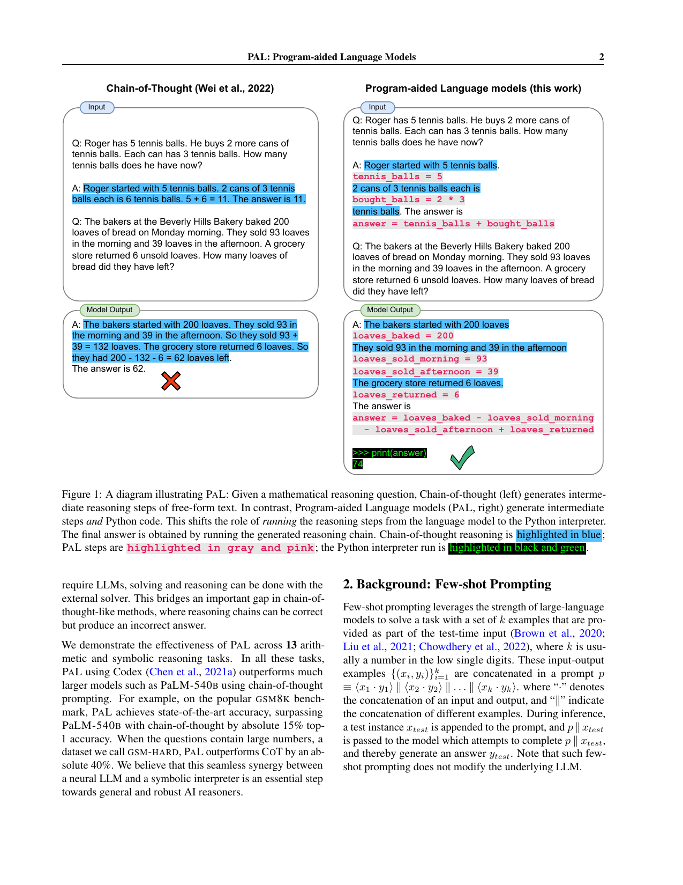
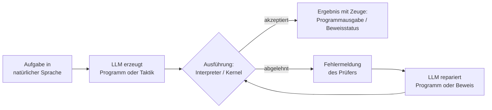

## Worum es geht

Das Wiki prüft, ob eine auf Tokenizer und Attention zugeschnittene Mathematik-Notation das Modell besser rechnen lässt und in formale Mathematik rückführbar bleibt. Dieses Dokument belegt den radikalsten Kandidaten: Mathematik als Artefakt ausgeben, das eine Maschine ausführt oder prüft; im ersten Strang Code, im zweiten Lean- oder Isabelle-Beweise. Kernaussage: Ausführung ist der Anker, der aus Token-Vorhersage eine verifizierbare Rechnung macht (Zeuge statt Glauben); der Preis sind Tool-Fehler, Spezifikationslücken und Formaliserungsaufwand.

## Rechnen auslagern: Code im Loop

PAL verlagert das Rechnen in den Python-Interpreter: Das LLM erzeugt ein Programm, die Ausführung liefert das Ergebnis, nur die Aufgabenzerlegung bleibt Modellaufgabe [Gao et al. 2023, PAL](https://arxiv.org/abs/2211.10435, accessed 2026-09-12). Auf GSM8K erreicht PAL mit Codex 72.0 Prozent gegen 65.6 für CoT mit demselben Modell und liegt 15 Punkte über PaLM-540B mit CoT (56.9); auf GSM-HARD wächst der Abstand auf 40 Punkte. Entscheidend ist die Ausführungs-Ablation: Bloße Simulation der Ausführung fällt auf 23.2 Prozent, kurz gefasster Code ohne Ausführung 47.8, ohne Code 19.7; mit Self-Consistency steigt PAL auf 80.4 [Gao et al. 2023, PAL](https://arxiv.org/abs/2211.10435, accessed 2026-09-12).

*Abbildung 1: Chain-of-Thought rechnet im Text und verrechnet sich (links); PAL erzeugt Python-Code, der Interpreter liefert die Antwort (rechts). (Quelle: [Gao et al. 2023, PAL](https://arxiv.org/abs/2211.10435, accessed 2026-09-12))*

PoT trennt Reasoning und Computation bei gleicher Grundidee: mittlerer Gewinn über CoT rund 12 Prozent im Zero-Shot-Setting über acht Datensätze; Einzelwerte mit Codex auf GSM8K 71.6 gegen 65.4, AQuA 54.1 gegen 45.3, SVAMP 85.2 gegen 77.0. Ohne mehrstufige Zuweisungen fällt GSM8K auf 45.8, ohne Fragevariablen-Anbindung auf 60.2 [Chen et al. 2023, PoT](https://arxiv.org/abs/2211.12588, accessed 2026-09-12).

Chain of Code erweitert um Emulation: Der Interpreter führt den definierbaren Code aus, semantische Teile wie Sarkasmus-Erkennung simuliert ein LMulator. Auf BIG-Bench Hard erreicht CoC 84 Prozent gegen 72 für CoT (text-davinci-003) und übertrifft den menschlichen Durchschnitt (68); mit gpt-4 91 gegen 88 [Li et al. 2024, Chain of Code](https://arxiv.org/abs/2312.04474, accessed 2026-09-12).

ToRA trainiert das Ineinandergreifen an 16k verschränkten Sprach-und-Tool-Trajektorien mit Output-Space-Shaping. Über zehn mathematische Datensätze ergibt das 13 bis 19 Punkte absolut; ToRA-Code-34B erreicht auf MATH 50.8 Prozent gegen GPT-4 mit CoT 42.5 (GPT-4 mit Code: 51.8). Die verschränkte Form schlägt rationale-only um 29.0 und program-only um 6.7 Punkte (LLaMA-2) [Gou et al. 2024, ToRA](https://arxiv.org/abs/2309.17452, accessed 2026-09-12).

## Formale Sprachen als Ausgabeformat

Bei Lean und Isabelle entscheidet der Kernel; das Modell produziert Taktiken oder ganze Beweise. LeanDojo macht das Interface programmierbar und extrahiert 98.734 Theoreme mit Premise-Annotationen; ReProver kombiniert Taktik-Generierung mit Retrieval und beweist 51.2 Prozent der Theoreme im Split mit neuartigen Premissen, gegenüber 47.6 ohne Retrieval und 29.0 für GPT-4 zero-shot, bei einer GPU-Woche Trainingsaufwand. Auf MiniF2F erreicht es Pass@1 26.5, auf ProofNet 13.8; 39 Beweise entstanden für Theoreme ohne bestehenden Lean-Beweis [Yang et al. 2023, LeanDojo](https://arxiv.org/abs/2306.15626, accessed 2026-09-12).

HTPS kombiniert Baumsuche mit Online-Training gegen den Prüfer: 65.4 Prozent auf gehaltenen Metamath-Theoremen (GPT-f: 56.5), kumulativ 82.6; auf miniF2F von 31 auf 42 Prozent, im Test Pass@64 41.0 gegen 36.6, bei 1360 A100-Tagen (GPT-f: 2000) [Lample et al. 2022, HTPS](https://arxiv.org/abs/2205.11491, accessed 2026-09-12).

Baldur erzeugt ganze Isabelle/HOL-Beweise und repariert sie mit der Prüfer-Fehlermeldung. Von 6.336 Testtheoremen beweist es 47.9 Prozent (64 Samples), Suchverfahren 39.0, Sledgehammer 25.6; die Reparatur korrigierte 266 Beweise, zusammen mit Thor ergibt das 65.7 gegen 57.0 [First et al. 2023, Baldur](https://arxiv.org/abs/2303.04910, accessed 2026-09-12).

DeepSeek-Prover synthetisiert aus 8 Millionen formalen Aussagen Trainingsdaten für DeepSeekMath 7B: MiniF2F-test 46.3 Prozent (64 Samples), 52.0 kumulativ, bis 50.0 bei 65.536 Versuchen, gegen GPT-4-turbo 23.0; auf FIMO 5 von 148, GPT-4 keines. V1.5 bezieht Proof-Assistant-Feedback ins Reinforcement Learning ein und erreicht 63.5 auf MiniF2F-test, 25.3 auf ProofNet [Xin et al. 2024, DeepSeek-Prover](https://arxiv.org/abs/2405.14333, accessed 2026-09-12), [Xin et al. 2024, V1.5](https://arxiv.org/abs/2408.08152, accessed 2026-09-12).

Draft, Sketch, and Prove zeigt die informell-formale Brücke: Formale Skizzen aus informellen Beweisen lenken den Prover; die Rate steigt von 20.9 auf 39.3 [Jiang et al. 2023, DSP](https://arxiv.org/abs/2210.12283, accessed 2026-09-12).

## Ausfuehrung als Pruefanker

Zwischen simulierter und ausgeführter Rechnung liegen bei PAL fast 49 Punkte (23.2 gegen 72.0); das Ergebnis entsteht im Interpreter. Bei den formalen Sprachen leistet der Kernel dasselbe: Baldur repariert gegen Fehlermeldungen, V1.5 optimiert gegen das Assistenten-Feedback [First et al. 2023, Baldur](https://arxiv.org/abs/2303.04910, accessed 2026-09-12), [Xin et al. 2024, V1.5](https://arxiv.org/abs/2408.08152, accessed 2026-09-12).

Die Kosten sind belegt. Von 100 ToRA-Trajektorien auf MATH entfallen 28 Prozent der Fehler auf die Tool-Schicht (10 Nutzung, 9 Syntax, 9 Laufzeit), 38 auf Reasoning, 21 auf Diagramme; 3 Prozent ließen sich nicht als Programm formalisieren [Gou et al. 2024, ToRA](https://arxiv.org/abs/2309.17452, accessed 2026-09-12). Spezifikationslücken: Ein von HTPS gefundener Beweis war kernel-gültig für eine fehlerhafte formale Aussage, weil Leans Subtraktion natürlicher Zahlen den Ausdruck stillschweigend abschneidet; auf der korrigierten Aussage verliert er die Gültigkeit [Lample et al. 2022, HTPS](https://arxiv.org/abs/2205.11491, accessed 2026-09-12). DeepSeek-Prover filterte zu einfache autoformalisierte Aussagen. Aufwand: DSP zeigt den Übersetzungsbedarf informell nach formal, DeepSeek-Prover bezahlt 20 Punkte Verbesserung mit bis zu 65.536 Generierungen pro Theorem [Xin et al. 2024, DeepSeek-Prover](https://arxiv.org/abs/2405.14333, accessed 2026-09-12), [Jiang et al. 2023, DSP](https://arxiv.org/abs/2210.12283, accessed 2026-09-12).

## Belegte Effektgroessen

| Befund | Zahl | Quelle |
|---|---|---|
| PAL gegen CoT (Codex) | GSM8K 72.0 gegen 65.6 (Standardabweichung über Läufe: 0.16 gegen 1.10), plus 15 über PaLM-540B CoT, GSM-HARD plus 40; Simulation statt Ausführung 23.2 gegen 72.0 | [Gao et al. 2023, PAL](https://arxiv.org/abs/2211.10435, accessed 2026-09-12) |
| PoT gegen CoT | rund 12 Prozent; GSM8K 71.6/65.4; SVAMP 85.2/77.0 | [Chen et al. 2023, PoT](https://arxiv.org/abs/2211.12588, accessed 2026-09-12) |
| Chain of Code BIG-Bench Hard | 84 gegen 72; gpt-4 91 gegen 88; Human 68 | [Li et al. 2024, CoC](https://arxiv.org/abs/2312.04474, accessed 2026-09-12) |
| ToRA über zehn Datensätze | 13 bis 19 absolut; 34B MATH 50.8 gegen GPT-4-CoT 42.5 | [Gou et al. 2024, ToRA](https://arxiv.org/abs/2309.17452, accessed 2026-09-12) |
| ToRA Verschränkung gegen Einzelformate | plus 29.0 und plus 6.7 Punkte (LLaMA-2) | [Gou et al. 2024, ToRA](https://arxiv.org/abs/2309.17452, accessed 2026-09-12) |
| ToRA Fehlermodi auf MATH | Tool-Schicht 28; Reasoning 38; Diagramme 21; nicht programmierbar 3 | [Gou et al. 2024, ToRA](https://arxiv.org/abs/2309.17452, accessed 2026-09-12) |
| ReProver LeanDojo | 51.2 gegen 47.6 und 29.0; MiniF2F 26.5; ProofNet 13.8 | [Yang et al. 2023, LeanDojo](https://arxiv.org/abs/2306.15626, accessed 2026-09-12) |
| HTPS | Metamath 65.4/56.5 (GPT-f), online 82.6; miniF2F 31 auf 42, Pass@64 41.0/36.6 | [Lample et al. 2022, HTPS](https://arxiv.org/abs/2205.11491, accessed 2026-09-12) |
| Baldur Isabelle/HOL | 47.9 gegen 39.0; Reparatur 266 Beweise; mit Thor 65.7 | [First et al. 2023, Baldur](https://arxiv.org/abs/2303.04910, accessed 2026-09-12) |
| DeepSeek-Prover | MiniF2F-test 46.3/52.0; GPT-4 23.0; V1.5 63.5 und 25.3 | [Xin et al. 2024, DeepSeek-Prover](https://arxiv.org/abs/2405.14333, accessed 2026-09-12), [Xin et al. 2024, V1.5](https://arxiv.org/abs/2408.08152, accessed 2026-09-12) |
| DSP informelle Skizzen | 20.9 auf 39.3 auf Wettbewerbsproblemen | [Jiang et al. 2023, DSP](https://arxiv.org/abs/2210.12283, accessed 2026-09-12) |

## Implikationen fuer Notationsdesign

- Ausgabe als ausführbares Artefakt planen (Programm, Taktik, Beweis), nicht als Zahlentext; die belegten Gewinne sind zweistellig [Gao et al. 2023, PAL](https://arxiv.org/abs/2211.10435, accessed 2026-09-12).
- Jeder zentrale Schritt hinterlässt einen Zeugen (Programmausgabe, Kernel-Status); Fehlermeldungen des Prüfers sind Reparatur- und Trainingssignal [First et al. 2023, Baldur](https://arxiv.org/abs/2303.04910, accessed 2026-09-12).
- Reasoning und Computation verzahnen: Die verschränkte Form schlägt beide Einzelformate, und 3 Prozent der Aufgaben lassen sich gar nicht als Programm formalisieren [Gou et al. 2024, ToRA](https://arxiv.org/abs/2309.17452, accessed 2026-09-12).
- Der Programmtext ist Teil der Notation: Sprechende Variablennamen und tragende Zwischenschritte verschieben die Genauigkeit um mehr als zehn Punkte [Gao et al. 2023, PAL](https://arxiv.org/abs/2211.10435, accessed 2026-09-12), [Chen et al. 2023, PoT](https://arxiv.org/abs/2211.12588, accessed 2026-09-12).
- Kosten einpreisen: Tool-Fehlerquote 28 Prozent, Spezifikationslücken, Budgets bis 65.536 Generierungen pro Theorem [Gou et al. 2024, ToRA](https://arxiv.org/abs/2309.17452, accessed 2026-09-12), [Xin et al. 2024, DeepSeek-Prover](https://arxiv.org/abs/2405.14333, accessed 2026-09-12).

## Konflikte und offene Punkte

- Emulation gegen Ausführung: Chain of Code nutzt sie erfolgreich für semantische Teile, PAL zeigt den Einbruch bei vollständiger Simulation; die Grenze ist offen [Li et al. 2024, Chain of Code](https://arxiv.org/abs/2312.04474, accessed 2026-09-12), [Gao et al. 2023, PAL](https://arxiv.org/abs/2211.10435, accessed 2026-09-12).
- Beweisraten sind quer über Arbeiten nicht vergleichbar: andere Assistentversionen, Splits, Budgets; Baldurs 65.7 gelten für Isabelle/HOL, die Lean-Zahlen (26.5 bis 63.5) für andere Setups [Yang et al. 2023, LeanDojo](https://arxiv.org/abs/2306.15626, accessed 2026-09-12), [First et al. 2023, Baldur](https://arxiv.org/abs/2303.04910, accessed 2026-09-12), [Xin et al. 2024, V1.5](https://arxiv.org/abs/2408.08152, accessed 2026-09-12).
- Verifiziert heißt nicht intendiert: Der Kernel prüft die formale Aussage, nicht die gemeinte; HTPS dokumentiert einen gültigen Beweis für eine fehlerhafte Formalisierung, DeepSeek-Prover filterte zu einfache Aussagen [Lample et al. 2022, HTPS](https://arxiv.org/abs/2205.11491, accessed 2026-09-12), [Xin et al. 2024, DeepSeek-Prover](https://arxiv.org/abs/2405.14333, accessed 2026-09-12).
- Zählweise in einem Paper: LeanDojo nennt 65 neu gefundene Beweise im Abstract, 33 und 39 in den Abschnitten; der Unterschied ist nicht aufgelöst [Yang et al. 2023, LeanDojo](https://arxiv.org/abs/2306.15626, accessed 2026-09-12).
- Übertragbarkeit: Die Code-Loop-Zahlen stammen aus 2022/2023; mit gpt-4 schrumpft der CoC-Abstand bereits (91 gegen 88) [Li et al. 2024, Chain of Code](https://arxiv.org/abs/2312.04474, accessed 2026-09-12).
- Berichtsgrenzen: Unsicherheitsangaben fehlen fast überall (PAL berichtet Standardabweichungen über Läufe); Stichprobengrößen und Modellversionen (etwa "Codex" pauschal) sind nicht durchgängig dokumentiert. Kosten-, Szenario- und Testmethodikfragen liegen in den Clustern 01 und 05.

## Quellen

- Gao, L. et al. (2023): PAL: Program-aided Language Models. arXiv:2211.10435. https://arxiv.org/abs/2211.10435 (accessed 2026-09-12)
- Chen, W. et al. (2023): Program of Thoughts Prompting: Disentangling Computation from Reasoning for Numerical Reasoning Tasks. TMLR 2023, arXiv:2211.12588. https://arxiv.org/abs/2211.12588 (accessed 2026-09-12)
- Li, C. et al. (2024): Chain of Code: Reasoning with a Language Model-Augmented Code Emulator. ICML 2024 Oral, arXiv:2312.04474. https://arxiv.org/abs/2312.04474 (accessed 2026-09-12)
- Gou, Z. et al. (2024): ToRA: A Tool-Integrated Reasoning Agent for Mathematical Problem Solving. ICLR 2024, arXiv:2309.17452. https://arxiv.org/abs/2309.17452 (accessed 2026-09-12)
- Yang, K. et al. (2023): LeanDojo: Theorem Proving with Retrieval-Augmented Language Models. NeurIPS 2023, arXiv:2306.15626. https://arxiv.org/abs/2306.15626 (accessed 2026-09-12)
- Lample, G. et al. (2022): HyperTree Proof Search for Neural Theorem Proving. arXiv:2205.11491. https://arxiv.org/abs/2205.11491 (accessed 2026-09-12)
- First, E. et al. (2023): Baldur: Whole-Proof Generation and Repair with Large Language Models. arXiv:2303.04910. https://arxiv.org/abs/2303.04910 (accessed 2026-09-12)
- Xin, H. et al. (2024): DeepSeek-Prover: Advancing Theorem Proving in LLMs through Large-Scale Synthetic Data. arXiv:2405.14333. https://arxiv.org/abs/2405.14333 (accessed 2026-09-12)
- Xin, H. et al. (2024): DeepSeek-Prover-V1.5: Harnessing Proof Assistant Feedback for Reinforcement Learning and Monte-Carlo Tree Search. arXiv:2408.08152. https://arxiv.org/abs/2408.08152 (accessed 2026-09-12)
- Jiang, A. Q. et al. (2023): Draft, Sketch, and Prove: Guiding Formal Theorem Provers with Informal Proofs. arXiv:2210.12283. https://arxiv.org/abs/2210.12283 (accessed 2026-09-12)
