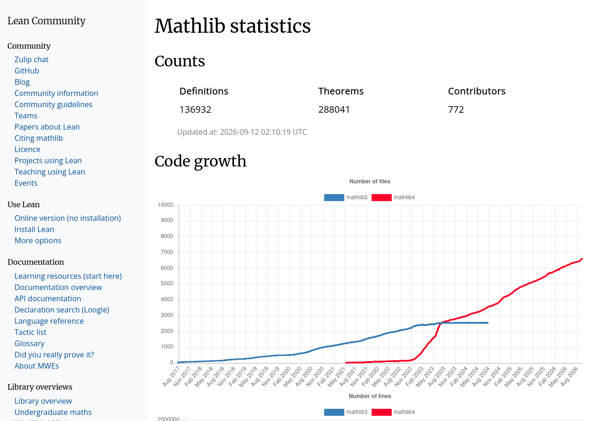
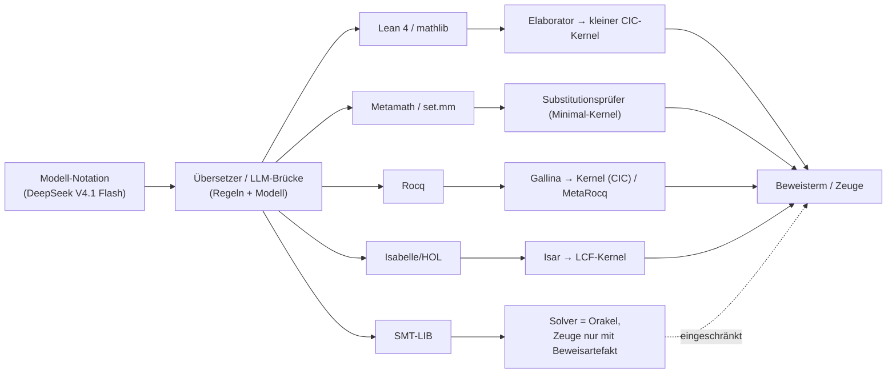

# Formale Systeme im Vergleich: Lean 4/mathlib, Metamath, Coq/Rocq, Isabelle/HOL, SMT-LIB

## 1 Einordnung: Das Zielsystem ist Teil des Übersetzungsproblems

Wenn eine modell-native Mathematik-Notation — etwa die eines Sprachmodells wie DeepSeek V4.1 Flash — in prüfbare formale Mathematik rücküberführt werden soll, dann ist die Wahl des formalen Zielsystems keine nachgelagerte Implementierungsentscheidung, sondern sie prägt die gesamte Übersetzungskette. Das Leitprinzip „Zeugen, nicht Glauben" verlangt, dass am Ende ein Artefakt steht, das ein unabhängig prüfbarer Prüfer akzeptiert: ein Beweisterm, eine Herleitung, ein Substitutionsprotokoll. Ob ein solcher Zeuge überhaupt entstehen kann und wie teuer seine Erzeugung und Prüfung ist, hängt von Eigenschaften des Zielsystems ab, die sich an sechs Kriterien festmachen lassen.

**Kernel-Größe und Vertrauensbasis (Trusted Computing Base).** Je kleiner der Kern ist, den man glauben muss, desto belastbarer ist der Zeuge. Metamath verlangt im Extremfall nur das Nachvollziehen von Substitutionen; Lean, Rocq und Isabelle setzen auf kleine Kerne unterhalb großer Elaboratoren und Taktikschichten; SMT-Solver sind dagegen Entscheidungsprozeduren, deren Ausgabe „unsat" nicht ohne Weiteres als Beweisspur im engeren Sinn lesbar ist. Dieser Punkt entscheidet darüber, wo genau im System der Beweis verankert werden muss und wie viel Software zwischen Notation und Kernel vertraut werden muss.

**Grammatik-Regelmäßigkeit.** Für eine mechanische Übersetzung ist entscheidend, wie regelmäßig die Oberflächensprache des Zielsystems ist. Extremfälle sind SMT-LIB mit uniformen S-Expressions und Metamath mit einem tokenbasierten Substitutionskalkül; auf der anderen Seite stehen Lean 4 und Rocq, deren Oberflächensprache Notation, Koerzionsauflösung und Makroexpansion durch einen Elaborator geschickt wird — was Mächtigkeit und Bequemlichkeit bringt, aber die Übersetzung an eine komplexe Elaborationssemantik bindet.

**Ökosystemgröße und Toolchain-Reife.** Bibliotheksumfang, Prüfwerkzeuge, Interaktionsprotokolle (REPLs, Server) und Dokumentation bestimmen, ob eine Übersetzung überhaupt gegen eine nennenswerte Wissensbasis prüfbar ist. Mathlib, das AFP und die Rocq-Paketlandschaft sind hier die Referenzpunkte.

**Verfügbare LLM-Trainingsdaten und LLM-Tooling.** Die Rückübersetzung aus einer Modell-Notation wird in der Praxis über Sprachmodelle laufen. Systeme, für die große Korpusse und maschinenlesbare Interaktionsschnittstellen existieren (LeanDojo/Lean, PISA/Isabelle, CoqGym/Rocq, GPT-f/Metamath), bieten dem Übersetzer Trainings- und Evaluationsmaterial; Systeme ohne solche Brücken verlangen eigene Infrastruktur.

**Community-Größe.** Beiträgerzahlen, Konferenzen, Paketmanager und langfristige Governance entscheiden darüber, ob das Zielsystem in fünf Jahren noch prüfbar ist — ein unterschätzter Faktor für die Lebensdauer formalisierter Notebooks.

**Prüfgeschwindigkeit.** Für Formalisierungen im großen Stil zählt, wie schnell ein unabhängiger Prüflauf einen Zeugen bestätigen kann. Metamath gibt hier mit Sekunden für die Wiederverifikation ganzer Datenbanken einen Referenzwert; die anderen Systeme kompensieren langsameres Prüfen durch Automatisierung und Bibliotheken.

Die folgenden Abschnitte stellen fünf Kandidaten vor: Lean 4/mathlib, Metamath, Rocq (ehemals Coq), Isabelle/HOL und SMT-LIB. Die Darstellung folgt jeweils diesen Kriterien; die Vergleichstabelle in Abschnitt 7 fasst sie zusammen, Abschnitt 8 zieht die Konsequenzen für die Notationsfrage.

## 2 Lean 4 und mathlib

Lean 4 ist ein interaktiver Theorembeweiser und Programmiersprache, der auf dem Calculus of Inductive Constructions aufsetzt und dessen Architektur explizit auf einen kleinen, vertrauenswürdigen Kern zuschneidet: Die Projektseite formuliert, dass „Lean's minimal trusted kernel guarantees absolute correctness in mathematical proof, software and hardware verification" ([Lean Programming Language](https://lean-lang.org/, accessed 2026-09-12)). Das System ist eine vollständige Neimplementierung in Lean selbst, mit erweiterbarem Parser, Elaborator, Taktiken, Entscheidungsprozeduren und einem für Theorembeweiser maßgeschneiderten hygienischen Makrosystem ([The Lean 4 Theorem Prover and Programming Language](https://lean-lang.org/learn/, accessed 2026-09-12); Publikation: de Moura/Ullrich, CADE-28, 2021, [DOI](https://doi.org/10.1007/978-3-030-79876-5_37, accessed 2026-09-12)). Diese Erweiterbarkeit ist zweischneidig: Sie ist der Grund, warum Lean trotz kleiner Kernel eine reichhaltige Notation erlaubt — und zugleich der Grund, warum eine Übersetzung in Lean zwei Ebenen bewältigen muss, die Oberflächensprache und die Elaboration in den Kern.

Die mathematische Bibliothek mathlib ist die größte Community-Formalisierung in Lean. Die offizielle Statistikseite weist 136.932 Definitionen, 288.041 Theoreme und 772 Beitragende aus (abgerufen 2026-09-12) ([Mathlib statistics](https://leanprover-community.github.io/mathlib_stats.html, accessed 2026-09-12)); die Lean-Startseite nennt mathlib „over a million lines of formalized mathematics" ([Lean Programming Language](https://lean-lang.org/, accessed 2026-09-12)). Die Architektur der Bibliothek — abhängig typisierte Fundamente, klassische Mathematik, eine tiefe Hierarchie algebraischer Strukturen und großskalige Automatisierung — wurde bereits 2019/2020 im Mathlib-Paper beschrieben ([The Lean mathematical library](https://arxiv.org/abs/1910.09336, accessed 2026-09-12)).

*Abbildung 1: Mathlib-Statistikseite mit Definitions-/Theorem-/Contributor-Zählung und Wachstumskurve (Quelle: [Mathlib statistics](https://leanprover-community.github.io/mathlib_stats.html, accessed 2026-09-12))*

Für die LLM-Anbindung ist Lean das am besten erschlossene System. LeanDojo stellt eine offene Spielwiese aus Toolkits, Daten, Modellen und Benchmarks bereit: Es extrahiert Daten aus Lean, erlaubt programmatische Interaktion mit der Beweisumgebung und liefert einen Benchmark aus 98.734 Theoremen und Beweisen aus mathlib samt fein annotierten Prämissen; das Modell ReProver (Retrieval-Augmented Prover) wurde damit trainiert und schlug auch GPT-4-Baselines ohne Retrieval ([LeanDojo: Theorem Proving with Retrieval-Augmented Language Models](https://arxiv.org/abs/2306.15626, accessed 2026-09-12)). Die Lean-Projektseite listet darüber hinaus ein ganzes Cluster maschinenorientierter Werkzeuge: REPL, Pantograph, LeanDojo, LeanSearch und LeanExplore ([Learn — Lean Lang](https://lean-lang.org/learn/, accessed 2026-09-12)).

Organisatorisch wird Lean seit Juli 2023 von der Lean FRO getragen, einer gemeinnützigen „Focused Research Organization" unter dem Dach von Convergent Research, geleitet von Chief Architect Leonardo de Moura (Lean-Erfinder, 2013) und Head of Engineering Sebastian Ullrich ([About — Lean Lang](https://lean-lang.org/fro/about, accessed 2026-09-12)). Sichtbare industrielle Nutzung — von der Verifikation der AWS-Autorisierungssprache Cedar über die Rust-Verifikationstoolchain Aeneas bis zu Kryptographie-Bibliotheken — belegt, dass Lean über die Mathematik hinaus als Verifikationsplattform verankert wird ([Lean Programming Language](https://lean-lang.org/, accessed 2026-09-12)).

## 3 Metamath

Metamath ist das Gegenmodell zur reichhaltigen Oberflächensprache: eine „simple and flexible computer-processable language", deren einzige Schlussregel die Substitution ist ([Metamath Home Page](https://us.metamath.org/, accessed 2026-09-12)). Eine mathematische Theorie ist eine Datenbank aus Axiomen, Definitionen, Theoremen und Beweisen; ein Beweis ist eine Folge von Substitutionsinstanzen von Axiomen und früheren Resultaten. Alles, was man zum Nachvollziehen braucht, ist die Fähigkeit, Zeichenketten zu ersetzen und zu vergleichen — „The only rule you need to know in order to follow the symbol manipulations in a Metamath proof is substitution" ([Metamath Proof Explorer Home Page](https://us.metamath.org/mpeuni/mmset.html, accessed 2026-09-12)). Die formale Spezifikation der Sprache umfasst im Metamath-Buch rund vier Seiten von insgesamt 248 Seiten ([Metamath Home Page](https://us.metamath.org/, accessed 2026-09-12); [Metamath: A Computer Language for Mathematical Proofs](https://us.metamath.org/downloads/metamath.pdf, accessed 2026-09-12)).

Diese Radikalität schlägt sich in der Vertrauensbasis nieder. Raph Levien schrieb einen unabhängigen Verifier in Python, von dem es im Projekt heißt, „those 300 lines of code, plus a couple dozen axioms, effectively give you the building blocks for all of mathematics" ([Metamath Home Page](https://us.metamath.org/, accessed 2026-09-12)). Um Programmierfehler einzelner Prüfer auszuschließen, wird set.mm, die mengentheoretische Hauptdatenbank (Metamath Proof Explorer), routinemäßig von fünf unabhängig entwickelten Verifiern in fünf Sprachen geprüft: metamath (C), mmj2 (Java), smetamath-rs (Rust), checkmm (C++) und mmverify.py (Python) ([Metamath Home Page](https://us.metamath.org/, accessed 2026-09-12)).

Das Beweisformat ist bewusst maschinennah. Normale Beweise werden als Sequenz von Labels notiert, die eine Konstruktion in umgekehrter polnischer Notation (RPN) beschreibt — der Stapel wird von innen heraus aufgebaut, bis die Behauptung übrig bleibt ([Metamath: A Computer Language for Mathematical Proofs](https://us.metamath.org/downloads/metamath.pdf, accessed 2026-09-12)). Für große Datenbanken gibt es zusätzlich ein komprimiertes Format der Gestalt `$= ( label-list ) compressed-proof $.`, das dieselbe Herleitung kompakter kodiert; es lässt sich verlustfrei in das Normalformat überführen ([Metamath: A Computer Language for Mathematical Proofs](https://us.metamath.org/downloads/metamath.pdf, accessed 2026-09-12)). Die Prüfarchitektur trennt Verifikation strikt von Beweisfindung: Verifikation ist deterministisch und so schnell, dass die Wiederverifikation einer ganzen Datenbank Sekunden dauert ([Metamath: A Computer Language for Mathematical Proofs](https://us.metamath.org/downloads/metamath.pdf, accessed 2026-09-12)).

Zur Größe von set.mm kursieren je nach Zählweise unterschiedliche Angaben. Die Metamath-Proof-Explorer-Homepage nennt „over 26,000 completely worked out proofs in its main sections (and over 41,000 counting 'mathboxes')" ([Metamath Proof Explorer Home Page](https://us.metamath.org/mpeuni/mmset.html, accessed 2026-09-12)); die Metamath-Startseite wirbt mit „Over 40,000 proofs" ([Metamath Home Page](https://us.metamath.org/, accessed 2026-09-12)); die FAQ derselben Seite spricht dagegen von „over 23,000 proven theorems" ([Metamath Home Page](https://us.metamath.org/, accessed 2026-09-12)). Die Zahlen unterscheiden sich nach Zählweise (Beweise versus Theoreme, Hauptsektionen versus Mathboxes) und älterem Textstand; für einen Vergleich mit anderen Systemen sollte man deshalb stets die Zählweise mitnennen. Der logische Unterbau der Datenbank ist denkbar schmal: Für Logik plus ZFC genügen nach Projektangabe 20 Axiome und 2 Regeln ([Metamath Proof Explorer Home Page](https://us.metamath.org/mpeuni/mmset.html, accessed 2026-09-12)).

In der LLM-Geschichte ist Metamath der historische Vorläufer: GPT-f (Polu & Sutskever) erzeugte 2020 Beweise für die Metamath-Sprache und fand neue kurze Beweise, die in die Hauptbibliothek aufgenommen wurden — nach Angaben der Autoren das erste Mal, dass ein System auf Basis tiefen Lernens von einer formalen Mathematik-Community akzeptierte Beweise beisteuerte ([Generative Language Modeling for Automated Theorem Proving](https://arxiv.org/abs/2009.03393, accessed 2026-09-12)). Das Format, das GPT-f lernte, ist dabei zugleich das Beweisformat der Datenbank: ein Zeugenformat, das ein Modell in Reinform erzeugen kann.

## 4 Coq und Rocq

Der Rocq Prover — bis vor Kurzem bekannt als Coq — ist der Veteran unter den hier verglichenen Systemen. Er implementiert die Spezifikationssprache Gallina über dem „Polymorphic, Cumulative Calculus of Inductive Constructions", einer Theorie, die höhere Logik und eine reich typisierte funktionale Programmiersprache verbindet; Prüfen erfolgt durch einen „relatively small certification kernel", aus dem sich zertifizierte Programme nach OCaml, Haskell oder Scheme extrahieren lassen ([About The Rocq Prover](https://rocq-prover.org/about, accessed 2026-09-12)). Die Entwicklungslinie reicht von der Calculus-of-Constructions-Implementierung bei INRIA-Rocquencourt 1984 (Thierry Coquand, Gérard Huet) über die Erweiterung zur Calculus of Inductive Constructions 1991 (Christine Paulin) bis heute; mehr als 200 Personen haben beigetragen ([About The Rocq Prover](https://rocq-prover.org/about, accessed 2026-09-12)).

Aktuell ist das Projekt in einer Umbenennungs- und Erneuerungsphase. Die Projektseite selbst hält fest: „The Rocq Prover was formerly known as the Coq Proof Assistant (see more on the name evolution)" ([Welcome to a World of Rocq](https://rocq-prover.org/, accessed 2026-09-12)). Die jüngsten Releases sind Rocq Prover 9.2.0 (März 2026) und Rocq Platform 2026.07.0; die Plattform enthält übergangsweise weiterhin Coq-Versionen von 8.12.2 bis 8.20.1 neben Rocq 9.0 ([Welcome to a World of Rocq](https://rocq-prover.org/, accessed 2026-09-12)). Für die Vertrauensbasis ist das Projekt MetaRocq interessant: Die Kernlogik ist in Rocq selbst formalisiert, und ein verifizierter Referenz-Checker, dessen Korrektheit und Vollständigkeit gegenüber dieser Spezifikation bewiesen wurde, kann extrahiert werden, um die vertrauenswürdige Codebasis einer Formalisierung auf die Theoriespezifikation zu reduzieren ([Welcome to a World of Rocq](https://rocq-prover.org/, accessed 2026-09-12)). Das System wurde mit dem ACM Software System Award ausgezeichnet ([Welcome to a World of Rocq](https://rocq-prover.org/, accessed 2026-09-12)).

Das Ökosystem umfasst die Standardbibliothek, die Mathematical-Components-Bibliothek samt SSReflect-Erweiterung — mit abgeleiteten Beweisen wie dem des Vier-Farben-Satzes —, den verifizierten C-Compiler CompCert mit dem Verified Software Toolchain sowie Entwicklungen in Homotopy Type Theory ([Welcome to a World of Rocq](https://rocq-prover.org/, accessed 2026-09-12)). Die Projektseite beschreibt Rocq als von „hundreds of developers, companies, research labs, teachers" genutzt ([Welcome to a World of Rocq](https://rocq-prover.org/, accessed 2026-09-12)).

Für maschinelles Lernen war Rocq früh im Spiel: CoqGym (Yang & Deng, ICML 2019) baute eine Lernumgebung mit 71.000 von Menschen geschriebenen Beweisen aus 123 Projekten und trainierte mit ASTactic ein Modell, das Taktiken als abstrakte Syntaxbäume erzeugt ([Learning to Prove Theorems via Interacting with Proof Assistants](https://arxiv.org/abs/1905.09381, accessed 2026-09-12)). Der Korpus datiert von 2019; die in diesem Kapitel zitierten neueren LLM-Arbeiten bauen auf Lean- und Isabelle-Korpora auf.

## 5 Isabelle/HOL

Isabelle ist ein generischer Beweiser mit dem Logical Framework Isabelle/Pure als Basis; die verbreitetste Instanz ist Isabelle/HOL, eine Umgebung für Logik höherer Stufe, die „ready to use for big applications" ist ([Overview](https://isabelle.in.tum.de/overview.html, accessed 2026-09-12)). Aktuell ist die Version Isabelle2025-2 (Januar 2026) ([Isabelle](https://isabelle.in.tum.de/, accessed 2026-09-12)). Die Sicherheitsarchitektur folgt dem LCF-Ansatz: „Isabelle follows the well-known LCF system approach to achieve a secure system" — alle Ableitungen laufen durch einen kleinen Kern, während Taktiken und Erweiterungen in ML außerhalb der Vertrauensbasis liegen ([Overview](https://isabelle.in.tum.de/overview.html, accessed 2026-09-12)). Beweise werden in der Regel in der strukturierten Sprache Isar notiert, die Beweistext erzeugt, der „naturally understandable for both humans and computers" sein soll ([Overview](https://isabelle.in.tum.de/overview.html, accessed 2026-09-12)). Hinzu kommt starke Automatisierung: ein Klassischer-Reasoner, ein Simplifier, lineare Arithmetik, algebraische Entscheidungsprozeduren — und Sledgehammer, das externe First-Order-Prover einbindet ([Overview](https://isabelle.in.tum.de/overview.html, accessed 2026-09-12)).

Die Bibliothekslandschaft besteht aus der Isabelle-Distribution und dem Archive of Formal Proofs (AFP). Die offizielle Statistik beziffert das AFP mit 1.027 Einträgen, 608 Autoren, etwa 325.700 Lemmas und etwa 5,43 Millionen Codezeilen (Stand der Seite, abgerufen 2026-09-12) ([Statistics — Archive of Formal Proofs](https://www.isa-afp.org/statistics/, accessed 2026-09-12)). Ein Vergleich mit mathlib (288.041 Theoreme) zeigt: Beide Ökosysteme bewegen sich in derselben Größenklasse, unterscheiden sich aber im Stil — AFP ist eine Sammlung weitgehend unabhängiger Einträge, mathlib eine integrierte Bibliothek.

Als LLM-Datenbasis dient vor allem der Isabelle-Korpus PISA, der in der Literatur als Standard-Benchmark für das maschinelle Beweisen von Isabelle-Theoremen mit Sprachmodellen zitiert wird und auf Jiang et al. 2021 zurückgeht ([Magnushammer: A Transformer-Based Approach to Premise Selection](https://arxiv.org/abs/2303.04488, accessed 2026-09-12)). Magnushammer, ein Transformer zur Prämissenauswahl, erreichte auf PISA eine Erfolgsrate von 59,5 % gegenüber 38,3 % für Sledgehammer; kombiniert mit dem Prover Thor stieg der Stand der Technik auf 71,0 % ([Magnushammer: A Transformer-Based Approach to Premise Selection](https://arxiv.org/abs/2303.04488, accessed 2026-09-12)). Bemerkenswert für die Übersetzungsfrage: Neuere Arbeiten bauen für Isabelle bewusst minimalistische Zwischensprachen („its core design comprises only 10 operations") und übersetzen bestehende Isar-Beweise automatisch — ein Beleg dafür, dass die Brücke zwischen Oberflächensprache und maschinennahem Format selbst Gegenstand aktiver Forschung ist ([A Minimalist Proof Language for Neural Theorem Proving over Isabelle/HOL](https://arxiv.org/abs/2507.18885, accessed 2026-09-12)).

## 6 SMT-LIB

SMT-LIB ist kein Beweisassistent, sondern ein Standardisierungsprojekt: eine internationale Initiative, die seit 2003 rigorose Beschreibungen von Hintergrundtheorien, gemeinsame Ein-/Ausgabesprachen für SMT-Solver, eine Community und eine Benchmark-Bibliothek bereitstellt ([SMT-LIB The Satisfiability Modulo Theories Library](https://smt-lib.org/, accessed 2026-09-12)). Der aktuelle Sprachstandard ist Version 2.7 von Barrett, Fontaine und Tinelli; die neueste Ausgabe datiert auf den 9. September 2026 ([The SMT-LIB Standard: Version 2.7](https://smt-lib.org/language.shtml, accessed 2026-09-12)). Grammatisch ist SMT-LIB extrem regelmäßig: „every expression in this version is a legal S-expression of Common Lisp"; eine S-Expression ist „either a non-parenthesis token or a (possibly empty) sequence of S-expressions enclosed in parentheses" ([The SMT-LIB Standard: Version 2.7](https://smt-lib.org/papers/smt-lib-reference-v2.7-r2026-09-09.pdf, accessed 2026-09-12)). Für mechanische Erzeugung und Parsing ist das die günstigste Ausgangslage unter allen hier betrachteten Systemen.

Die praktische Dynamik des Feldes bündelt sich in SMT-COMP, dem jährlichen Wettbewerb. Die 21. Ausgabe (SMT-COMP 2026) findet im Rahmen des SMT Workshop 2026 statt, der an die IJCAR-26 angeschlossen ist, und umfasst neben dem Hauptwettbewerb unter anderem einen Model-Validation-Track, einen Parallel-Track und einen Cloud-Track ([SMT-COMP 2026](https://smt-comp.github.io/2026/, accessed 2026-09-12)). Solver wie Z3 sind dabei als Einzelwerkzeuge eingebunden ([SMT-LIB Software Solvers](https://smt-lib.org/solvers.shtml, accessed 2026-09-12)).

Die Rolle im Formalisierungszusammenhang ist kategorial anders als die der Beweisassistenten. Ein SMT-Solver entscheidet Erfüllbarkeit in einer Theorie: Er liefert „sat" samt Modell oder „unsat" — aber er ist eine Entscheidungsprozedur, kein interaktiver Beweiser mit Herleitungsprotokoll. Die SMT-LIB-Initiative formuliert das Programm entsprechend als Gewährleistung „common input and output languages" für Solver, nicht als Erzeugung kernelprüfbarer Beweisterme ([SMT-LIB The Satisfiability Modulo Theories Library](https://smt-lib.org/, accessed 2026-09-12)). In Assistenzsystemen treten solche Solver deshalb vor allem als Orakel und Backend auf — etwa via Sledgehammer in Isabelle, das externe Prover einbindet ([Overview](https://isabelle.in.tum.de/overview.html, accessed 2026-09-12)). Für die Rückübersetzung aus einer Modell-Notation bedeutet das: SMT-LIB ist als Ziel eines Übersetzers attraktiv wegen seiner regulären Syntax und der mächtigen Automatisierung, aber als Ort für „Zeugen, nicht Glauben" nur geeignet, soweit Prüfbarkeit der Solver-Antwort gewährleistet werden kann. Wo ein „unsat" nicht als unabhängig prüfbare Herleitung vorliegt, bleibt die Antwort eine Behauptung des Solvers — das Gegenbild zum kernelgeprüften Beweis.

## 7 Vergleichstabelle

| System | Kernel / Vertrauensbasis | Grammatik-Regelmäßigkeit | Ökosystem-Größe | LLM-Trainingsdaten / Tooling | Prüfgeschwindigkeit | Eignung als Rückübersetzungs-Ziel |
|---|---|---|---|---|---|---|
| **Lean 4/mathlib** | Kleiner CIC-Kernel („minimal trusted kernel"), darüber großer, erweiterbarer Elaborator [Lean](https://lean-lang.org/, accessed 2026-09-12) | Reich; Elaboration, Makros, Taktiken — Übersetzung muss zwei Ebenen bewältigen [Learn](https://lean-lang.org/learn/, accessed 2026-09-12) | 136.932 Definitionen, 288.041 Theoreme, 772 Beitragende [Mathlib statistics](https://leanprover-community.github.io/mathlib_stats.html, accessed 2026-09-12) | LeanDojo (98.734 Theoreme, MIT), REPL, Pantograph [LeanDojo](https://arxiv.org/abs/2306.15626, accessed 2026-09-12) | In den hier zitierten Quellen nicht beziffert; Kernel klein gehalten [Lean](https://lean-lang.org/, accessed 2026-09-12) | Sehr gut: dichteste LLM-Brücken, größte integrierte Bibliothek; Preis: Elaborationsabhängigkeit |
| **Metamath** | Substitution als einzige Regel; Verifier mit ~300 Zeilen Code möglich; 5 unabhängige Verifier [Metamath](https://us.metamath.org/, accessed 2026-09-12) | Extrem regulär: tokenbasiert, RPN-Beweisformat, Kompressionsvariante [Buch](https://us.metamath.org/downloads/metamath.pdf, accessed 2026-09-12) | set.mm: über 26.000 Beweise in Hauptsektionen, über 41.000 mit Mathboxes [MPE](https://us.metamath.org/mpeuni/mmset.html, accessed 2026-09-12) | GPT-f als Pionierarbeit; kleinere heutige Aktivität [GPT-f](https://arxiv.org/abs/2009.03393, accessed 2026-09-12) | Wiederverifikation einer Datenbank in Sekunden [Buch](https://us.metamath.org/downloads/metamath.pdf, accessed 2026-09-12) | Gut für kompakte Zeugen; schmälere Automatisierung und Tool-Landschaft |
| **Rocq (Coq)** | „Relatively small certification kernel"; MetaRocq-Referenzchecker [About Rocq](https://rocq-prover.org/about, accessed 2026-09-12) | Reich; Gallina, Taktiken, Extraktion; Umbenennung/Plattform im Fluss [Rocq](https://rocq-prover.org/, accessed 2026-09-12) | 40+ Jahre Entwicklung, >200 Beitragende, Stdlib, MathComp, CompCert [About Rocq](https://rocq-prover.org/about, accessed 2026-09-12) | CoqGym (71.000 Beweise, 123 Projekte, ICML 2019) [CoqGym](https://arxiv.org/abs/1905.09381, accessed 2026-09-12) | „Fast proof checker", bytecode-/native-Conversion [Rocq](https://rocq-prover.org/, accessed 2026-09-12) | Solide; LLM-Ökosystem kleiner als bei Lean/Isabelle |
| **Isabelle/HOL** | LCF-Ansatz: kleiner Kern, ML außerhalb der Vertrauensbasis [Overview](https://isabelle.in.tum.de/overview.html, accessed 2026-09-12) | Mittel: Isar für Menschen lesbar; Sledgehammer bindet externe Prover ein [Overview](https://isabelle.in.tum.de/overview.html, accessed 2026-09-12) | AFP: 1.027 Einträge, 608 Autoren, ~325.700 Lemmas [AFP-Statistik](https://www.isa-afp.org/statistics/, accessed 2026-09-12) | PISA-Korpus; Magnushammer/Thor-SOTA (71,0 % auf PISA) [Magnushammer](https://arxiv.org/abs/2303.04488, accessed 2026-09-12) | In den zitierten Quellen nicht beziffert; LCF-Kern begrenzt den Prüfaufwand [Overview](https://isabelle.in.tum.de/overview.html, accessed 2026-09-12) | Gut; Automatisierung stark, Übersetzung/Korpora aktiv erforscht |
| **SMT-LIB** | Kein Kernel im hiesigen Sinn: Solver als Entscheidungsprozedur; Ergebnisprüfung nur bei Beweisartefakten [SMT-LIB](https://smt-lib.org/, accessed 2026-09-12) | Sehr hoch: uniforme S-Expressions (Common-Lisp-kompatibel) [Standard 2.7](https://smt-lib.org/papers/smt-lib-reference-v2.7-r2026-09-09.pdf, accessed 2026-09-12) | Standard seit 2003; Solverszene, SMT-COMP (21. Auflage 2026) [SMT-COMP](https://smt-comp.github.io/2026/, accessed 2026-09-12) | Kaum Proof-Assistant-LLM-Brücken; Solver als Backend/Orakel [Sledgehammer in Isabelle](https://isabelle.in.tum.de/overview.html, accessed 2026-09-12) | Entscheidungsprozeduren für typische Queries ausgelegt [SMT-LIB](https://smt-lib.org/, accessed 2026-09-12) | Als Orakel/Backend attraktiv; als Zeugnisort nur eingeschränkt („Trust") |

## 8 Konsequenz für die Notationsfrage

Für die Frage, welches formale Zielsystem die Rückübersetzung aus einer modell-nativen Notation tragen kann, lassen sich aus dem Vergleich vier Eigenschaften ableiten, die zusammenwirken müssen.

Erstens braucht die Übersetzung eine **mechanisch beherrschbare Zielgrammatik**. Je regulärer das Ziel, desto deterministischer kann ein Übersetzer (Regelwerk plus Sprachmodell) arbeiten. Metamath und SMT-LIB sind hier Extremfälle: Substitution beziehungsweise S-Expressions lassen keine Interpretationsspielräume; Lean, Rocq und Isabelle verlangen zusätzlich die Beherrschung einer Elaborationssemantik — was nur mit vorhandenen Werkzeugen (REPLs, LeanDojo, Taktik-Schnittstellen) praktikabel ist.

Zweitens entscheidet die **Vertrauensbasis** darüber, ob das Ergebnis ein Zeuge im Sinne von „Zeugen, nicht Glauben" ist. Am saubersten ist die Kette dort, wo der zu glaubende Kern klein ist: Metamath reduziert die Prüfung auf Substitution; Lean, Rocq und Isabelle verankern in kleinen Kerneln (CIC beziehungsweise LCF), verstecken diese aber unter großen Werkzeugschichten; SMT liefert ohne Beweisartefakt gar keinen kernelprüfbaren Zeugen. Für die Rückübersetzung heißt das: Der Beweis muss in der Zielsprache vollständig materialisierbar sein — nicht nur als „Solver sagt ja".

Drittens zählt die **vorhandene Brücke vom Modell ins Zielsystem**. Die praktische Rückübersetzung wird über LLM-Tooling laufen. Lean ist hier am besten versorgt (LeanDojo, REPL, Pantograph, Benchmarks mit Prämissenannotation), Isabelle folgt mit dem PISA-Ökosystem, Rocq mit der älteren CoqGym-Linie, Metamath mit der Pionierlinie um GPT-f und dem RPN-Beweisformat, das Modelle direkt erzeugen können. Ein System ohne solche Brücken müsste diese erst geschaffen werden.

Viertens und pragmatisch: **Trainingsdaten und Community** entscheiden über Robustheit. Ein Übersetzer, der auf 98.734 Lean-Beweisen, 325.700 AFP-Lemmas und 71.000 CoqGym-Beweisen feinjustiert werden kann, hat rund um die Zielsprachen ein Vokabular, das ein Modell bereits kennt. Das erklärt, warum Lean in der aktuellen LLM-Formalisierung die Referenzrolle spielt, obwohl Metamath die kleinere Vertrauensbasis und SMT-LIB die regulärste Grammatik hat: Die Rückübersetzung ist kein reines Prüfproblem, sondern ein Übersetzungsproblem mit maschinellen Übersetzern — und die brauchen Daten, Werkzeuge und eine gepflegte Zielsprache.

Der Trade-off ist damit sichtbar. Metamath maximiert Prüfeinfachheit und minimiert die Vertrauensbasis, verlangt aber die Akzeptanz einer ungewöhnlichen, schmucklosen Darstellung und bietet weniger Automatisierung. Lean maximiert Übersetzbarkeit mit Modellen und Bibliotheksreichtum, bindet die Prüfung aber an einen elaborationsgetriebenen Build. Isabelle kombiniert starke Automation mit einem etablierten Archiv, Rocq bietet die längste Historie und werkzeugbasierte Trust-Reduktion über MetaRocq, SMT-LIB schließlich ist als Orakel-Backend hochattraktiv, aber kein Ort, an dem ein Beweis „wohnt". Für eine modell-native Mathematik-Notation, die in prüfbare formale Mathematik rücküberführt werden soll, spricht der Gesamtbefund dafür, das Zielsystem nicht nach einem einzigen Kriterium zu wählen, sondern die Kriterien zu staffeln: Zeugen in einem kleinen Kernel, Übersetzung über eine vorhandene LLM-Brücke, Daten aus einem großen Korpus. Kollidieren die Kriterien, gilt die Vorrangregel: Der prüfende Kern und die vorhandene LLM-Brücke wiegen schwerer als Prüfgeschwindigkeit und Korpusgröße; die endgültige Gewichtung setzt der Entwurf (Cluster 05). Die Regel ist eine eigene Ableitung dieses Wikis, keine Quellenaussage. Wie diese Anforderungen zu konkreten Roundtrip-Kriterien verdichtet werden, behandelt Kapitel 03-05.

*Abbildung 2: Ebenen der Rückübersetzung von der Modell-Notation über Übersetzer und Zielsysteme bis zu den prüfenden Kernen. Gestrichelte Kante: SMT-LIB liefert ohne zusätzliches Beweisartefakt keinen kernelprüfbaren Zeugen.*

## Quellen

1. Mathlib statistics — [https://leanprover-community.github.io/mathlib_stats.html](https://leanprover-community.github.io/mathlib_stats.html) (accessed 2026-09-12)
2. Lean Programming Language (Projektseite) — [https://lean-lang.org/](https://lean-lang.org/) (accessed 2026-09-12)
3. About — Lean FRO — [https://lean-lang.org/fro/about](https://lean-lang.org/fro/about) (accessed 2026-09-12)
4. Learn — Lean Lang (inkl. „How to cite Lean" mit CADE-28-BibTeX) — [https://lean-lang.org/learn/](https://lean-lang.org/learn/) (accessed 2026-09-12)
5. de Moura, L., Ullrich, S.: The Lean 4 Theorem Prover and Programming Language. CADE-28, 2021 — [https://doi.org/10.1007/978-3-030-79876-5_37](https://doi.org/10.1007/978-3-030-79876-5_37) (accessed 2026-09-12)
6. The Lean mathematical library (Mathlib-Paper, CPP 2020) — [https://arxiv.org/abs/1910.09336](https://arxiv.org/abs/1910.09336) (accessed 2026-09-12)
7. LeanDojo: Theorem Proving with Retrieval-Augmented Language Models (NeurIPS 2023) — [https://arxiv.org/abs/2306.15626](https://arxiv.org/abs/2306.15626) (accessed 2026-09-12)
8. Metamath Home Page (inkl. FAQ, Verifier-Liste, mmverify.py) — [https://us.metamath.org/](https://us.metamath.org/) (accessed 2026-09-12)
9. Metamath Proof Explorer Home Page (mmset.html) — [https://us.metamath.org/mpeuni/mmset.html](https://us.metamath.org/mpeuni/mmset.html) (accessed 2026-09-12)
10. Megill, N., Wheeler, D. A.: Metamath: A Computer Language for Mathematical Proofs — [https://us.metamath.org/downloads/metamath.pdf](https://us.metamath.org/downloads/metamath.pdf) (accessed 2026-09-12)
11. Polu, S., Sutskever, I.: Generative Language Modeling for Automated Theorem Proving (GPT-f, 2020) — [https://arxiv.org/abs/2009.03393](https://arxiv.org/abs/2009.03393) (accessed 2026-09-12)
12. Welcome to a World of Rocq (Projektseite) — [https://rocq-prover.org/](https://rocq-prover.org/) (accessed 2026-09-12)
13. About The Rocq Prover (Gallina, CIC, Kernel, Geschichte) — [https://rocq-prover.org/about](https://rocq-prover.org/about) (accessed 2026-09-12)
14. Yang, K., Deng, J.: Learning to Prove Theorems via Interacting with Proof Assistants (CoqGym, ICML 2019) — [https://arxiv.org/abs/1905.09381](https://arxiv.org/abs/1905.09381) (accessed 2026-09-12)
15. Isabelle (Projektseite, Release Isabelle2025-2) — [https://isabelle.in.tum.de/](https://isabelle.in.tum.de/) (accessed 2026-09-12)
16. Isabelle Overview (LCF, Isar, Sledgehammer) — [https://isabelle.in.tum.de/overview.html](https://isabelle.in.tum.de/overview.html) (accessed 2026-09-12)
17. Statistics — Archive of Formal Proofs — [https://www.isa-afp.org/statistics/](https://www.isa-afp.org/statistics/) (accessed 2026-09-12)
18. SMT-LIB The Satisfiability Modulo Theories Library — [https://smt-lib.org/](https://smt-lib.org/) (accessed 2026-09-12)
19. The SMT-LIB Standard: Version 2.7 (Barrett, Fontaine, Tinelli) — [https://smt-lib.org/papers/smt-lib-reference-v2.7-r2026-09-09.pdf](https://smt-lib.org/papers/smt-lib-reference-v2.7-r2026-09-09.pdf) (accessed 2026-09-12)
20. SMT-COMP 2026 — [https://smt-comp.github.io/2026/](https://smt-comp.github.io/2026/) (accessed 2026-09-12)
21. Magnushammer: A Transformer-Based Approach to Premise Selection (ICLR 2024; PISA-Zahlen) — [https://arxiv.org/abs/2303.04488](https://arxiv.org/abs/2303.04488) (accessed 2026-09-12)
22. A Minimalist Proof Language for Neural Theorem Proving over Isabelle/HOL (OOPSLA 2026) — [https://arxiv.org/abs/2507.18885](https://arxiv.org/abs/2507.18885) (accessed 2026-09-12)
23. SMT-LIB Software: Solvers — [https://smt-lib.org/solvers.shtml](https://smt-lib.org/solvers.shtml) (accessed 2026-09-12)
24. SMT-LIB Standard — Language (Versionsübersicht des Referenzdokuments, u. a. r2026-09-09) — [https://smt-lib.org/language.shtml](https://smt-lib.org/language.shtml) (accessed 2026-09-12)
