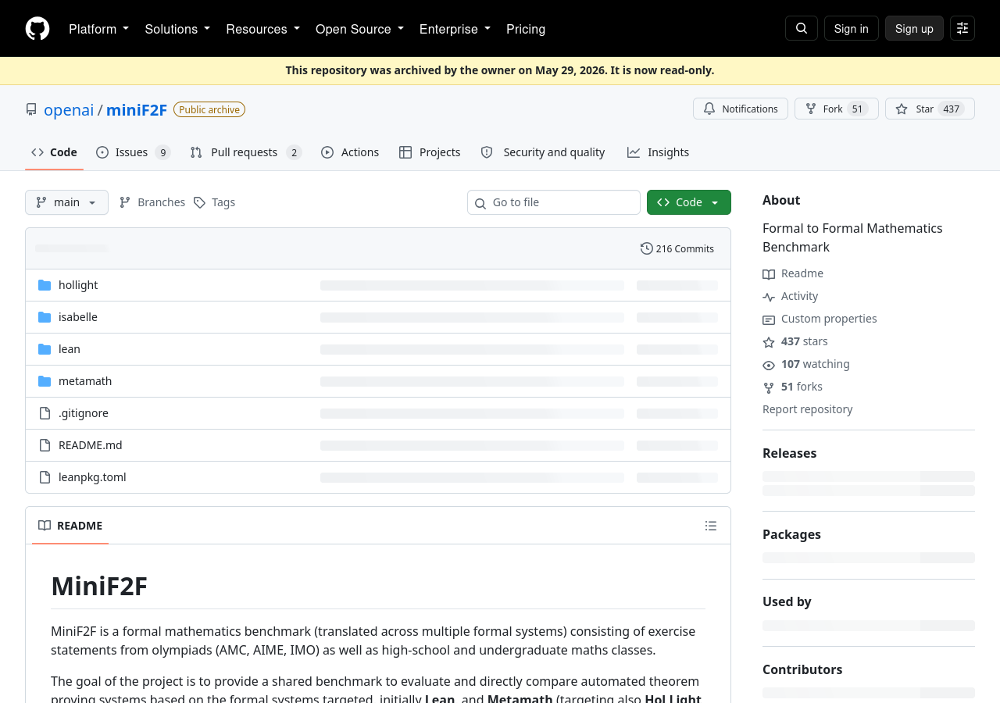
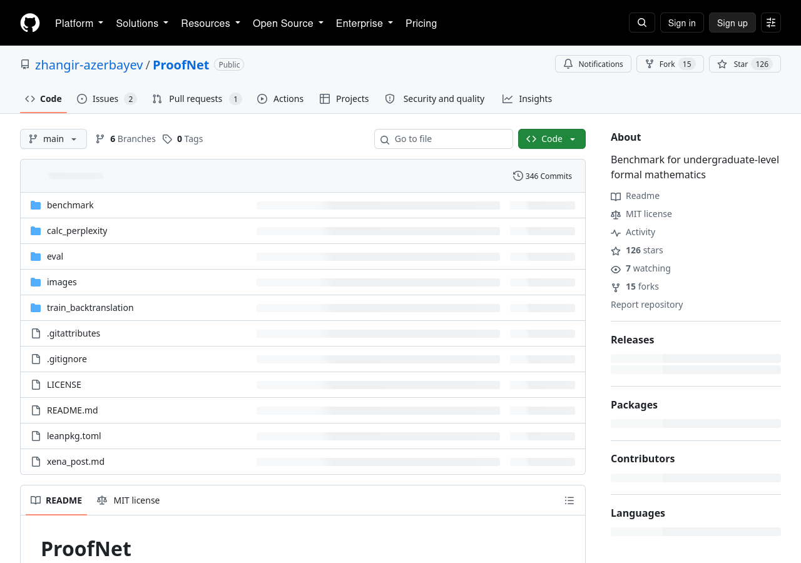
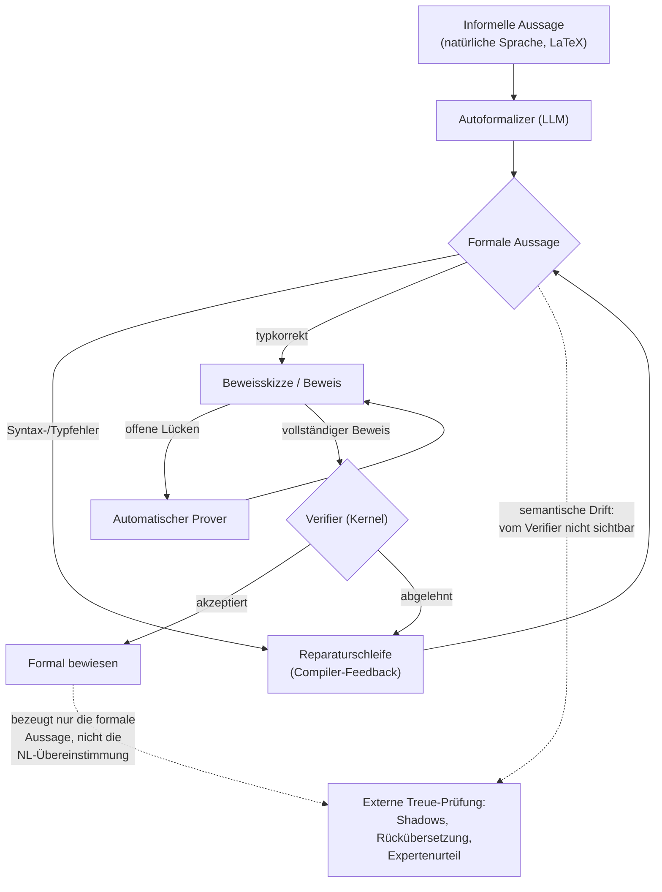

# Autoformalisierung: Verfahren, Benchmarks, Fehlertaxonomie und das Spezifikationsproblem

## 1. Einordnung: Was Autoformalisierung ist und warum sie hier zählt

Autoformalisierung ist die automatische Übersetzung von natürlicher Mathematiksprache in formale Spezifikationen und Beweise. Die Definition stammt aus Wu et al. (2022): "Autoformalization is the process of automatically translating from natural language mathematics to formal specifications and proofs" [Wu et al., Autoformalization with Large Language Models, arXiv:2205.12615](https://arxiv.org/abs/2205.12615, accessed 2026-09-12). Der Survey von Weng et al. fasst sie entsprechend als Umwandlung informeller mathematischer Aussagen in verifizierbare formale Repräsentationen [Weng et al., Autoformalization in the Era of Large Language Models: A Survey, arXiv:2505.23486](https://arxiv.org/abs/2505.23486, accessed 2026-09-12). Ein funktionierendes Autoformalisierungssystem würde die Kosten manueller Formalisierung senken und den großen Bestand natürlichsprachlicher Mathematik für Maschinenbeweiser erschließen [Wu et al.](https://arxiv.org/abs/2205.12615, accessed 2026-09-12).

Für dieses Wiki ist die Richtung entscheidend: Der Auftrag verlangt eine Notation, die in prüfbare formale Mathematik rücküberführbar ist — "Zeugen, nicht Glauben". Die Abbildung Notation→formal ist strukturell dieselbe Übersetzungsaufgabe wie NL→formal: In beiden Fällen wird eine informelle, für Menschen lesbare Darstellung auf eine formale Sprache abgebildet, deren Grammatik und Semantik vom Beweissystem vorgegeben werden. Die Autoformalisierungsforschung liefert damit das empirische Material für genau die Frage, die auch die Rücküberführung aus unserer Notation betrifft: Wie zuverlässig gelingt eine solche Abbildung, wo bricht sie, und was davon kann eine Maschine selbst prüfen?

Die Ausgangslage ist von Datenarmut geprägt: Die Archive of Formal Proofs, eine der größten formalen Bibliotheken, umfasst nach Wu et al. nur 180 MB — weniger als 0,18 % der Trainingsdaten von Codex — und ausgerichtete Paare aus natürlichem Text und formalem Code existieren praktisch nicht [Wu et al.](https://arxiv.org/abs/2205.12615, accessed 2026-09-12). Deshalb arbeiten alle hier beschriebenen Verfahren mit Few-Shot-Prompting, synthetischen Daten oder Rückübersetzung — nicht mit massenhaft parallelisierten Korpora.

## 2. Verfahren

### 2.1 Direkte Übersetzung: NL→Theorem-Statement

Wu et al. (2022) übersetzen Aufgaben aus dem MATH-Datensatz direkt in Isabelle/HOL-Statements, per Few-Shot-Prompting mit Codex und PaLM [Wu et al.](https://arxiv.org/abs/2205.12615, accessed 2026-09-12). Zur quantitativen Bewertung nutzen sie BLEU-Werte gegen menschliche Isabelle-Referenzen (Codex: 57,13 im Bereich Algebra, 43,33 im Bereich Zahlentheorie; PaLM 540B: 50,30/36,16; PaLM 64B: 43,13/31,43; PaLM 8B: 31,49/22,10) [Wu et al.](https://arxiv.org/abs/2205.12615, accessed 2026-09-12). Der zentrale Befund stammt aus einer manuellen Auswertung von 150 zufällig gezogenen MATH-Aufgaben (je 50 aus algebra, number_theory und intermediate_algebra): Codex übersetzte 38 davon perfekt — eine Quote von 25,3 % [Wu et al.](https://arxiv.org/abs/2205.12615, accessed 2026-09-12). Zwei Fallstudien belegen die Grenzen: Ein kleineres Modell (8B, 64B) scheitert an einer Formalierung, die das 540B-Modell korrekt löst; und Codex erfindet für den Begriff "lineare Funktion" zunächst ein nicht existierendes Prädikat `linear f`, bis der Prompt ein Beispiel enthält, das den Begriff erklärt [Wu et al.](https://arxiv.org/abs/2205.12615, accessed 2026-09-12).

Die Arbeit demonstriert zugleich den Nutzen: Aus 3.908 autoformalisierten MATH-Trainingsaufgaben waren 3.363 syntaktisch korrekt; mit diesen konnte ein neuronaler Beweiser per Expert Iteration verbessert werden, von 29,6 % auf 35,2 % Erfolgsquote im Test-Teil von miniF2F (Validierungsteil: 28,3 %→37,3 %) [Wu et al.](https://arxiv.org/abs/2205.12615, accessed 2026-09-12).

### 2.2 Sketch-basiert: Draft, Sketch, and Prove

DSP (Jiang et al., 2022/2023) übersetzt nicht nur Statements, sondern informelle Beweise: Ein LLM (der "Autoformalizer") wandelt einen informellen Beweis in eine formale Beweisskizze um, in der die schwierigen Zwischenschritte als offene Lücken markiert sind ("Draft, Sketch, and Prove"); ein separater automatischer Beweiser schließt die Lücken [Jiang et al., Draft, Sketch, and Prove, arXiv:2210.12283](https://arxiv.org/abs/2210.12283, accessed 2026-09-12). Auf miniF2F (Isabelle) hebt das die Erfolgsquote von 20,9 % (Baseline: Sledgehammer plus Heuristiken) auf 38,9 % mit LLM-generierten informellen Beweisen und auf 39,3 % mit menschlich geschriebenen informellen Beweisen im Test-Teil; im Validierungsteil sind es bis zu 43,9 % mit dem 62B-Minerva-Modell [Jiang et al.](https://arxiv.org/abs/2210.12283, accessed 2026-09-12). Die Ablationen isolieren die Beiträge: Ohne Inline-Kommentare, die informelle Beweisabschnitte mit Sketch-Abschnitten ausrichten, sinkt die Quote um 4,9 Punkte (Validierung) bzw. 2,8 Punkte (Test); ohne das vorgelagerte Entwerfen informeller Beweise um 3,7 bzw. 5,3 Punkte; ohne den automatischen Beweiser zum Schließen der Lücken um 9,8 bzw. 9,0 Punkte [Jiang et al.](https://arxiv.org/abs/2210.12283, accessed 2026-09-12).

Für die Notationsfrage ist DSP doppelt relevant: Es zeigt erstens, dass das LLM die *Struktur* eines informellen Beweises in eine formale Struktur übertragen kann, und zweitens, dass diese Struktur die Beweissuche des nachgelagerten Provers messbar verbessert — der Übergang zwischen Darstellungsformen ist also nicht nur Kosmetik.

### 2.3 Iterative Reparatur und Selbstkorrektur mit Compiler-Feedback

Der nächste Baustein ist die Schleife: Generieren, vom Compiler scheitern lassen, aus der Fehlermeldung reparieren. Baldur (First et al., 2023) erzeugt ganze Beweise auf einmal statt Schritt für Schritt und kombiniert das mit einem separat feinabgestimmten Reparaturmodell, das einen gescheiterten Beweisversuch samt Fehlermeldung als Zusatzkontext erhält; auf 6.336 Isabelle/HOL-Theoremen steigert das die Anzahl automatisch bewiesener Theoreme gegenüber dem Vorgängersystem Thor um 8,7 Prozentpunkte, zusammen erreichen Baldur und Thor 65,7 % [First et al., Baldur: Whole-Proof Generation and Repair with Large Language Models, arXiv:2303.04910](https://arxiv.org/abs/2303.04910, accessed 2026-09-12).

Neuere Systeme machen die Schleife zum Kern der Skalierung: Goedel-Prover-V2 (2025) nutzt "verifier-guided self-correction", bei der das Modell Beweise iterativ anhand von Lean-Compiler-Feedback überarbeitet; die Erfolgsquote auf miniF2F steigt im Selbstkorrektur-Modus von 88,1 % auf 90,4 % (pass@32), und das Modell löst 86 Aufgaben von PutnamBench [Lin et al., Goedel-Prover-V2, arXiv:2508.03613](https://arxiv.org/abs/2508.03613, accessed 2026-09-12). Dass sich dieses Signal auch als Trainingsziel nutzen lässt, zeigt APRIL (2026): ein Datensatz aus 260.000 überwachten Tupeln aus fehlgeschlagenen Lean-Beweisen, Compiler-Diagnosen, korrigierten Beweisen und natürlichsprachlichen Diagnosen; ein darauf feinabgestimmtes 4B-Modell übertrifft in der Einzelversuch-Reparatur die stärkste Open-Source-Baseline [Wang et al., Learning to Repair Lean Proofs from Compiler Feedback, arXiv:2602.02990](https://arxiv.org/abs/2602.02990, accessed 2026-09-12).

Warum Compiler-Feedback überhaupt trägt, quantifiziert ProofNet: Die Typkorrektheitsrate (welcher Anteil der generierten Statements überhaupt wohlgeformter Lean-Code ist) korreliert stark mit der eigentlichen Formalisierungsgenauigkeit, und unter den typkorrekten Generierungen von Code-davinci-002 war etwa die Hälfte auch inhaltlich korrekt [Azerbayev et al., ProofNet, arXiv:2302.12433](https://arxiv.org/abs/2302.12433, accessed 2026-09-12). Der Compiler ist damit ein nützlicher, aber kein hinreichender Filter — die andere Hälfte der typkorrekten Outputs war semantisch falsch (dazu Abschnitt 4).

### 2.4 Retrieval-Augmentierung und Premise Selection

Autoformalisierung und Beweisen werden besser, wenn das Modell zur Laufzeit auf Bibliothekswissen zugreifen kann. Auf der Statement-Ebene zeigt ProofNet: Wenn dem Modell per "Prompt Retrieval" ähnliche bereits formalisierte Theoreme als Kontext mitgegeben werden, steigt die Formalisierungsgenauigkeit um 2,7 Punkte und die Typkorrektheitsrate sogar um 21,5 Punkte [Azerbayev et al.](https://arxiv.org/abs/2302.12433, accessed 2026-09-12). Auf der Bibliotheksebene identifiziert LeanDojo die Auswahl relevanter Prämissen ("Premise Selection") als "key bottleneck" des formalen Beweisens und liefert mit ReProver einen retrieval-augmentierten Beweiser, der trainierbare Zugriffs- und Negativbeispiele aus der Programmanalyse von Lean nutzt; der zugehörige Benchmark umfasst 98.734 Theoreme aus mathlib [Yang et al., LeanDojo, arXiv:2306.15626](https://arxiv.org/abs/2306.15626, accessed 2026-09-12). Magnushammer zeigt, dass reine Transformer-Prämisse-Retrieval die etablierten symbolischen Werkzeuge übertrifft: 34,0 % gegenüber 20,9 % auf miniF2F und 59,5 % gegenüber 38,3 % auf PISA; kombiniert mit einem sprachmodellbasierten Beweiser steigt die Erfolgsquote auf PISA von 57,0 % auf 71,0 % — bei viermal weniger Parametern [Mikuła et al., Magnushammer, arXiv:2303.04488](https://arxiv.org/abs/2303.04488, accessed 2026-09-12).

Für die Notation ist das ein Hinweis darauf, dass die Qualität des *Kontexts* (welche Bausteine werden sichtbar gemacht) ebenso stark wirkt wie die Qualität der Übersetzung selbst — ein Argument dafür, dass eine Notations-Designentscheidung auch eine Retrieval-Designentscheidung ist.

### 2.5 Verifier-in-the-loop und RL (kurz)

Die systematische Nutzung des Verifiers als Belohnungssignal — Expert Iteration, Reinforcement Learning aus Beweiser-Feedback — ist ein eigenes Feld und wird im Kapitel [03-03-llm-prover-stand.md](03-03-llm-prover-stand.md) behandelt. Für diesen Abschnitt genügt der Hinweis, dass bereits Wu et al. den Verifier als Datenproduzenten nutzen (Expert Iteration auf autoformalisierten Theoremen) [Wu et al.](https://arxiv.org/abs/2205.12615, accessed 2026-09-12) und dass Goedel-Prover-V2 die Selbstkorrektur explizit in die "standard expert iteration and reinforcement learning pipeline" einbettet [Lin et al.](https://arxiv.org/abs/2508.03613, accessed 2026-09-12). Wichtig für das hiesige Erkenntnisinteresse: All diese Schleifen verstärken, was der Verifier sehen kann — die formale Aussage. Ob die formale Aussage das informelle Original *meint*, gehört nicht zum verstärkten Signal (Abschnitt 5).

## 3. Benchmarks

### 3.1 miniF2F

miniF2F (Zheng et al., 2021) ist der Standard-Benchmark für formale Olympiade-Mathematik und dient in der Autoformalisierung als Referenzkorpus wie als Beweisziel. Er umfasst 488 Problemstatements aus AIME, AMC und IMO sowie Material aus gymnasialer und universitärer Mathematik und zielt auf die formalen Systeme Metamath, Lean, Isabelle (im Paper als partiell geführt) und HOL Light (partiell); Version 1 besteht aus 244 Test- und 244 Validierungsstatements [Zheng et al., miniF2F, arXiv:2109.00110](https://arxiv.org/abs/2109.00110, accessed 2026-09-12). Das Repository beziffert die Bestände je System mit 244/244 (Lean), 244/244 (Metamath), 244/244 (Isabelle) und 165/165 (HOL Light), wobei HOL Light also weiterhin nur teilweise abgedeckt ist [miniF2F-Repository](https://github.com/openai/miniF2F, accessed 2026-09-12). Die Baseline-Zahlen der Originalarbeit: GPT-f erreichte auf Metamath Pass@1 von 1,3 % und Pass@8 von 1,6 %; GPT-f/PACT auf Lean Pass@1 von 24,6 % und Pass@8 von 29,2 % auf dem Test-Teil; die deterministische "tidy"-Baseline löste 44 von 244 Test-Statements [Zheng et al.](https://arxiv.org/abs/2109.00110, accessed 2026-09-12). miniF2F ist bewusst als "cross-system benchmark" angelegt, inspiriert von der IMO-Grand-Challenge-Idee eines formal-zu-formalen Wettbewerbs [Zheng et al.](https://arxiv.org/abs/2109.00110, accessed 2026-09-12).

*Abbildung 1: Repositorieseite von miniF2F mit den Beständen je formalem System (Lean/Metamath/Isabelle je 244 Test- und 244 Validierungsstatements, HOL Light 165/165). Screenshot vom 2026-09-12, Quelle: [github.com/openai/miniF2F](https://github.com/openai/miniF2F, accessed 2026-09-12).*

### 3.2 ProofNet

ProofNet (Azerbayev et al., 2023) verschiebt das Niveau von Olympiade auf Grundstudium: 371 Beispiele, jeweils bestehend aus einem formalen Theorem-Statement in Lean 3, einem natürlichsprachlichen Statement und einem natürlichsprachlichen Beweis; die Themen umfassen reelle und komplexe Analysis, lineare Algebra, abstrakte Algebra und Topologie [Azerbayev et al.](https://arxiv.org/abs/2302.12433, accessed 2026-09-12). Der Benchmark dient explizit der Messung von Autoformalisierung *und* formalem Beweisen [Azerbayev et al.](https://arxiv.org/abs/2302.12433, accessed 2026-09-12). Die Baseline: Code-davinci-002 formalisierte per In-Context-Learning 13,4 % der Theoreme korrekt; Prompt-Retrieval verbesserte das um 2,7 Punkte; destillierte Rückübersetzung ("distilled backtranslation") hob ein 1,3B-Modell auf 3,2 % Genauigkeit — bemerkenswerterweise über der In-Context-Leistung eines 6,7B-Modells, das keine korrekten Formalisierungen erzielte [Azerbayev et al.](https://arxiv.org/abs/2302.12433, accessed 2026-09-12). Wichtige methodische Pointe der Arbeit: Da zwei in Lean nicht definitional gleiche Statements denselben mathematischen Inhalt haben können, wurde die Korrektheit der Autoformalisierungen von menschlichen Experten beurteilt — nicht automatisch [Azerbayev et al.](https://arxiv.org/abs/2302.12433, accessed 2026-09-12). Das Repository weist außerdem darauf hin, dass die Lean-3-Originalversion nicht mehr gepflegt wird und Lean-4-Ports existieren, etwa im DeepSeek-Prover-V1.5-Repository [ProofNet-Repository](https://github.com/zhangir-azerbayev/ProofNet, accessed 2026-09-12).

*Abbildung 2: Repositorieseite von ProofNet mit dem Hinweis auf fortgeführte Lean-4-Ports. Screenshot vom 2026-09-12, Quelle: [github.com/zhangir-azerbayev/ProofNet](https://github.com/zhangir-azerbayev/ProofNet, accessed 2026-09-12).*

### 3.3 PutnamBench und FormalMATH

PutnamBench (2024) formalisiert 640 Theoreme des William-Lowell-Putnam-Wettbewerbs in 1.692 handgefertigten Formalisierungen, mit Versionen in Lean 4 und Isabelle sowie einer substanziellen Teilmenge in Coq; etablierte neuronale und symbolische Beweiser lösten nur "a handful" der Probleme, was den Benchmark als offene Herausforderung ausweist [Tsoukalas et al., PutnamBench, arXiv:2407.11214](https://arxiv.org/abs/2407.11214, accessed 2026-09-12). FormalMATH (2025) geht auf Skalenebene: 5.560 formal verifizierte Lean-4-Probleme von Olympiade- bis Universitätsniveau, erzeugt mit einer Human-in-the-Loop-Pipeline aus LLM-Statement-Autoformalisierung, Multi-LLM-Semantikverifikation und negationsbasierter Widerlegungsfilterung ("negation-based disproof filtering"); die Pipeline behielt 72,09 % der generierten Statements vor der manuellen Endprüfung [Yu et al., FormalMATH, arXiv:2505.02735](https://arxiv.org/abs/2505.02735, accessed 2026-09-12). Auch hier zeigen die Ergebnisse die Lücke zum Sättigungspunkt: Selbst die stärksten Beweiser erreichten unter praktischen Sampling-Budgets nur 16,46 % Erfolgsquote [Yu et al.](https://arxiv.org/abs/2505.02735, accessed 2026-09-12).

Die Benchmark-Landschaft misst also zwei verschiedene Dinge, die in der Notationsdebatte nicht verwechselt werden dürfen: ob ein *Statement* korrekt übersetzt wurde (Autoformalisierungs-Benchmarks wie ProofNet und Teile von miniF2F) und ob ein *Beweis* gefunden werden kann (Prover-Benchmarks). Die belegten Zahlen laufen auseinander: Auf miniF2F erreichen moderne Beweiser im Selbstkorrekturmodus über 90 % [Lin et al.](https://arxiv.org/abs/2508.03613, accessed 2026-09-12), während die Statement-Autoformalisierung auf ProofNet-Niveau historisch bei 13,4 % lag [Azerbayev et al.](https://arxiv.org/abs/2302.12433, accessed 2026-09-12) und auch 2026 auf deutlich schwereren Statements weit darunter bleibt (Abschnitt 5).

## 4. Fehlertaxonomie

### 4.1 Fehlerklassen im Überblick

Die Fehler der Autoformalisierung lassen sich für dieses Wiki in drei Klassen einteilen, die unterschiedlich schwer zu erkennen sind: (a) syntaktische und Typ-Fehler, (b) semantische Drift zwischen formaler Aussage und informellem Original, (c) vakuöse bzw. inhaltsleere Aussagen, die formal wahr, aber nicht gemeint sind.

Zu (a): Die manuelle Auswertung von Wu et al. führt "Syntactical/type error" als eigene Kategorie (7/2/11 Nennungen in algebra/number_theory/intermediate_algebra) [Wu et al.](https://arxiv.org/abs/2205.12615, accessed 2026-09-12). ProofNet trennt Typkorrektheit ("typecheck rate") systematisch von inhaltlicher Korrektheit und berichtet für Code-davinci-002 eine Typkorrektheitsrate von 23,7 % bei 13,4 % Genauigkeit [Azerbayev et al.](https://arxiv.org/abs/2302.12433, accessed 2026-09-12).

Zu (b): Wu et al. nennen als Hauptfehlerquelle die "misalignment of informal and formal definitions" — Beispiel: "the greatest possible value" wird nicht auf die Isabelle-Funktion `Greatest`/`Max` abgebildet; ebenso scheitert die Zuordnung von Fakultät (`!n`) zu `fact n`; eine dritte Kategorie ist die "Wrong application of functions" (6/13/16 Nennungen), etwa Präfixfunktionen in Infix-Schreibweise [Wu et al.](https://arxiv.org/abs/2205.12615, accessed 2026-09-12). Die Kategorienzählungen in Tabelle 2 der Arbeit ergeben je Herkunftsbereich Spaltensummen über 50, sind also nicht disjunkt; die perfekten Übersetzungen summieren sich sauber zu 38 (13+17+8) [Wu et al.](https://arxiv.org/abs/2205.12615, accessed 2026-09-12).

ProofNet dokumentiert die semantischen Fälle im Detail: lexikalische Verwechslungen (das nicht existierende `simple_group` statt `is_simple_group`; `vector_space V` statt `module K V`; `{0}` statt `⊥`), vor allem aber fehlende oder falsche implizite Voraussetzungen — für einen Orthogonalraum-Typ muss der Raum eine `inner_product_space`-Struktur tragen und der Körper `is_R_or_C` erfüllen; "reliably inferring these kinds of implicit hypotheses is a major challenge for autoformalization systems" [Azerbayev et al.](https://arxiv.org/abs/2302.12433, accessed 2026-09-12). Bei kleineren Modellen beobachtet dieselbe Arbeit Endlosschleifen: wiederholte Ausgabe derselben Phrase statt eines Statements [Azerbayev et al.](https://arxiv.org/abs/2302.12433, accessed 2026-09-12).

### 4.2 Neuere Taxonomien: Typ-Fehler und semantische Fehler getrennt messen

Die Signal-Coverage-Matrix (2026) kreuzt den Lean-Elaborator (bestanden/durchgefallen) mit einem Semantikäquivalenz-Urteil und klassifiziert jeden Output in eine von vier Zellen: wahrer Erfolg (TS), nur typkorrekt (TO), nur semantisch korrekt (SO) oder beides verfehlt (BF) [Dai et al., The Signal-Coverage Matrix, arXiv:2606.28013](https://arxiv.org/abs/2606.28013, accessed 2026-09-12). Der Befund auf ProofNet# und MiniF2F-test mit DeepSeek V4-Pro: Die headline Typkorrektheit (TC%) ist binnen zwei Jahren von etwa 53 % auf etwa 76 % gestiegen, aber dieser Skalar verdeckt, welche Fehlerklasse behoben wird; drei elaborator-feedback-basierte Methoden gewinnen +34 bis +36 TS-Punkte, wobei der Gewinn zu rund 64 % einer Wiederherstellung der Typ-Schicht entspricht, während die semantische Schicht netto flach bleibt: 87,5 % der ursprünglichen semantischen Fehler wurden gerettet, aber 8 neue erzeugt [Dai et al.](https://arxiv.org/abs/2606.28013, accessed 2026-09-12).

FormalRx (2026) formalisiert die Diagnose noch feinkörniger: eine hierarchische "SCI Error Taxonomy" mit 28 Fehlerkategorien in strikter Prioritätsordnung, die vier Diagnosefähigkeiten trägt — Alignment-Urteil, Fehlerkategorisierung, Fehlerlokalisierung und Korrektur [Wang et al., FormalRx, arXiv:2607.04655](https://arxiv.org/abs/2607.04655, accessed 2026-09-12).

Die fehlgeschlagene Reparatur ist dabei ein eigener Fehlermodus. Die Signal-Coverage-Matrix zeigt das direkt: Reparaturverfahren erzeugen neue semantische Fehler, die vorher nicht da waren (8 neue bei 87,5 % geretteten) [Dai et al.](https://arxiv.org/abs/2606.28013, accessed 2026-09-12). FaithformBench (2026) adressiert die Messlücke: Bestehende Verfahren bewerten laut der Arbeit fast nur *korrekte* Eingaben und prüfen deshalb nicht, ob das Autoformalisierungssystem auch *falsche* Eingaben treu (d. h. als ungültig) übersetzt; der Benchmark erzeugt deshalb automatisch perturbierte, absichtlich ungültige Ableitungsschritte und misst Validitätserhalt auf ungestörten und Invaliditätserhalt auf gestörten Beispielen [Cornish et al., FaithformBench, arXiv:2608.10916](https://arxiv.org/abs/2608.10916, accessed 2026-09-12).

### 4.3 Vakuöse und inhaltsleere Aussagen

Der klassische Weg zu einer vakuös wahren Formalisierung führt über widersprüchliche Voraussetzungen: Aus inkonsistenten Annahmen folgt Beliebiges, der Satz wird beweisbar, ohne etwas zu besagen. Belegbar ist bisher nur die Vorstufe: Wu et al. führen "Inconsistent/missing assumption" als Fehlerkategorie (8/9/9 Nennungen) [Wu et al.](https://arxiv.org/abs/2205.12615, accessed 2026-09-12), und der Survey beschreibt unter dem Stichwort "semantic illusion" — der Nichtübereinstimmung zwischen generierter formaler Aussage und natürlichem Statement — unter anderem Verfahren, die selbst-widersprüchliche Hypothesen nach der Autoformalisierung herausfiltern [Weng et al.](https://arxiv.org/abs/2505.23486, accessed 2026-09-12). Eine Primärquelle, die Vakuosität in der Autoformalisierung direkt vermisst und quantifiziert (etwa "leere Typen", formal triviale Instanzen), ließ sich in dieser Recherche nicht finden; das bleibt eine belegte Lücke (Sättigung nach zwei erfolglosen Suchläufen). *[Teilaspekt unkenntlich — keine Primärquelle zur Quantifizierung von Vakuosität in der Autoformalisierung gefunden.]*

## 5. Spezifikationsproblem: Warum Treue intern nicht prüfbar ist

Der Kern des Problems ist schnell formuliert: Ein Beweisprüfer verifiziert die *formale* Aussage — er sagt nichts darüber, ob diese Aussage der informellen Intention entspricht. Die neuere Literatur formuliert das zunehmend scharf. Die Arbeit "The Faithfulness Gap" (2026): "a formal statement can typecheck and be provable, yet still encode a different theorem than the source intended" [Mohammad & Sheikh, The Faithfulness Gap, arXiv:2606.16541](https://arxiv.org/abs/2606.16541, accessed 2026-09-12). "Beyond Compilation" (2026) bringt es auf die knappste Form: "Lean verifies that a generated declaration is well typed, but not that it expresses the statement a user intended" [Zhang et al., Beyond Compilation, arXiv:2606.31002](https://arxiv.org/abs/2606.31002, accessed 2026-09-12).

Belegte Konsequenzen dieses Auseinanderfallens:

1. **Der Compile-Treue-Abstand ist systematisch.** In "Beyond Compilation" hat jedes von acht evaluierten Systemen auf 400 Statements einen nicht-verschwindenden Abstand zwischen Kompilierung und semantischer Treue, mit beobachteter Spanne von 3,0 bis 29,0 Prozentpunkten; der volle GPT-5.2-Agent mit Werkzeugen zeigt den größten Abstand: 89,5 % kompilieren, aber nur 60,5 % erfüllen das semantische Kriterium [Zhang et al.](https://arxiv.org/abs/2606.31002, accessed 2026-09-12). Der Schweregrad reicht also bis zu fast 30 Punkten — eine Prüfung, die nur den Compiler ausführt, akzeptiert in solchen Konfigurationen bis zu einem Drittel falscher Übersetzungen.

2. **Solver-Verdikte sind blind für Treue — beweisbar.** "Beyond Solver Verdicts" (2026-09) formalisiert das Muster als "Verdict-Preserving-Unfaithfulness" (VPU): eine falsche Enkodierung, die erfolgreich läuft und denselben Solver-Verdikt liefert wie die intendierte; die Arbeit beweist, dass strukturelle, rein verdiktbasierte Verifikationsheuristiken für solche Fälle mathematisch auf Zufallsniveau beschränkt sind [Singh et al., Beyond Solver Verdicts, arXiv:2609.11085](https://arxiv.org/abs/2609.11085, accessed 2026-09-12). Ein Checker, der nur "akzeptiert/abgelehnt" ausgibt, kann Treue also prinzipiell nicht leisten.

3. **Der Ausweg sind externe Vergleichsprüfungen.** SHADOWBENCH (2026) instanziiert das als SA-Pass: Eine generierte formale Aussage erhält nur dann volle Anerkennung, wenn sie kompiliert, jede "Shadow"-Aussage impliziert (Vorwärtsprüfung) und von deren Konjunktion impliziert wird (Rückwärtsprüfung); auf 178 Problemen auf Postgraduierten- bis Forschungsniveau erreicht ein Claude-Code-Agent (Opus 4.8) mit Numina-Lean-Agent 61,8 % Compile-Rate, aber nur 11,2 % SA-Pass, und SA-Pass stimmt mit Expertenurteilen zu 98,8 % überein (binäre Übereinstimmung) [Han et al., SHADOWBENCH, arXiv:2608.29270](https://arxiv.org/abs/2608.29270, accessed 2026-09-12). Auch "The Faithfulness Gap" arbeitet mit bidirektionalen Sonden ("Bidirectional Provability Fingerprinting") und einem kontinuierlichen Treue-Spektrum statt binärer Verdikte [Mohammad & Sheikh](https://arxiv.org/abs/2606.16541, accessed 2026-09-12).

4. **Etablierte Ersatzmetriken taugen nicht als Treuebeweis.** Der Survey stellt fest, dass Syntaxprüfung durch den Beweisassistenten nicht bedeutet, dass das Ergebnis "completely correct" ist — die formale Aussage muss zusätzlich semantisch äquivalent zum natürlichen Original sein — und dass die menschliche Nachprüfung zeitaufwändig und subjektiv ist, weshalb sie meist nur zur Kalibrierung automatischer Werkzeuge eingesetzt wird [Weng et al.](https://arxiv.org/abs/2505.23486, accessed 2026-09-12). BLEU als Näherung ist belegt irreführend: In ProofNet erhöht Prompt-Retrieval die Genauigkeit, *senkt* aber BLEU um über 10 Punkte [Azerbayev et al.](https://arxiv.org/abs/2302.12433, accessed 2026-09-12).

Für die Notations-Rücküberführung (Kapitel [03-05-roundtrip-anforderungen.md](03-05-roundtrip-anforderungen.md)) folgt daraus die Beweislast: Eine Notation, deren Übersetzung in formale Mathematik nur "kompiliert", ist als gesichert zu behandeln nur bis zu der Grenze, die der Verifier tatsächlich sehen kann — also nur für die formale Aussage selbst. Die Übereinstimmung von Notation und formaler Aussage braucht eigene Zeugen: Roundtrip-Tests (Notation→formal→Notation, Rückübersetzung), Konservativitäts-Checks über Sonden und Shadows, und wo möglich Experten- oder Differenzprüfungen. Das ist derselbe Stand, den die Autoformalisierungsforschung 2023–2026 erreicht hat: Der Beweiser wird nie zum Orakel für Bedeutung.

## 6. Pipeline-Darstellung

Die folgende kompakte Darstellung fasst die Verfahren aus Abschnitt 2 mit ihren Fehlerpfaden zusammen. Durchgezogene Kanten sind der Normalfall, gestrichelte Kanten markieren Fehlerpfade, die vom Verifier nicht sichtbar sind.

Die drei Fehlerpfade im Bild entsprechen den belegten Befunden: (1) syntaktische/Type-Fehler gehen in die Reparaturschleife und werden durch Compiler-Feedback adressiert [First et al.](https://arxiv.org/abs/2303.04910, accessed 2026-09-12); (2) semantische Drift passiert den Verifier unbemerkt und benötigt externe Prüfungen [Zhang et al.](https://arxiv.org/abs/2606.31002, accessed 2026-09-12); (3) selbst ein akzeptierter Beweis bezeugt nur die formale Aussage — die Treue zur informellen Quelle bleibt eine separate, nur extern bezeugbare Behauptung [Mohammad & Sheikh](https://arxiv.org/abs/2606.16541, accessed 2026-09-12).

## Quellen

1. Wu, Y., Jiang, A. Q., Li, W., Rabe, M. N., Staats, C., Jamnik, M., Szegedy, C.: *Autoformalization with Large Language Models*. arXiv:2205.12615. https://arxiv.org/abs/2205.12615 (accessed 2026-09-12).
2. Weng, K., Du, L., Li, S., Lu, W., Sun, H., Liu, H., Zhang, T.: *Autoformalization in the Era of Large Language Models: A Survey*. arXiv:2505.23486. https://arxiv.org/abs/2505.23486 (accessed 2026-09-12).
3. Zheng, K., Han, J. M., Polu, S.: *MiniF2F: a cross-system benchmark for formal Olympiad-level mathematics*. arXiv:2109.00110. https://arxiv.org/abs/2109.00110 (accessed 2026-09-12).
4. OpenAI: *miniF2F — Repository*. https://github.com/openai/miniF2F (accessed 2026-09-12).
5. Jiang, A. Q., Welleck, S., Zhou, J. P., Li, W., Liu, J., Jamnik, M., Lacroix, T., Wu, Y., Lample, G.: *Draft, Sketch, and Prove: Guiding Formal Theorem Provers with Informal Proofs*. arXiv:2210.12283. https://arxiv.org/abs/2210.12283 (accessed 2026-09-12).
6. First, E., Rabe, M. N., Ringer, T., Brun, Y.: *Baldur: Whole-Proof Generation and Repair with Large Language Models*. arXiv:2303.04910. https://arxiv.org/abs/2303.04910 (accessed 2026-09-12).
7. Lin, Y. et al.: *Goedel-Prover-V2: Scaling Formal Theorem Proving with Scaffolded Data Synthesis and Self-Correction*. arXiv:2508.03613. https://arxiv.org/abs/2508.03613 (accessed 2026-09-12).
8. Wang, E., Chess, S., Lee, D., Ge, S., Mallavarapu, A., Alper, J., Ilin, V.: *Learning to Repair Lean Proofs from Compiler Feedback (APRIL)*. arXiv:2602.02990. https://arxiv.org/abs/2602.02990 (accessed 2026-09-12).
9. Azerbayev, Z., Piotrowski, B., Schoelkopf, H., Ayers, E. W., Radev, D., Avigad, J.: *ProofNet: Autoformalizing and Formally Proving Undergraduate-Level Mathematics*. arXiv:2302.12433. https://arxiv.org/abs/2302.12433 (accessed 2026-09-12).
10. Azerbayev, Z. et al.: *ProofNet — Repository*. https://github.com/zhangir-azerbayev/ProofNet (accessed 2026-09-12).
11. Yang, K., Swope, A. M., Gu, A., Chalamala, R., Song, P., Yu, S., Godil, S., Prenger, R., Anandkumar, A.: *LeanDojo: Theorem Proving with Retrieval-Augmented Language Models*. arXiv:2306.15626. https://arxiv.org/abs/2306.15626 (accessed 2026-09-12).
12. Mikuła, M., Tworkowski, S., Antoniak, S., Piotrowski, B., Jiang, A. Q., Zhou, J. P., Szegedy, C., Kuciński, Ł., Miłoś, P., Wu, Y.: *Magnushammer: A Transformer-Based Approach to Premise Selection*. arXiv:2303.04488. https://arxiv.org/abs/2303.04488 (accessed 2026-09-12).
13. Tsoukalas, G., Lee, J., Jennings, J., Xin, J., Ding, M., Jennings, M., Thakur, A., Chaudhuri, S.: *PutnamBench: Evaluating Neural Theorem-Provers on the Putnam Mathematical Competition*. arXiv:2407.11214. https://arxiv.org/abs/2407.11214 (accessed 2026-09-12).
14. Yu, Z., Peng, R., Ding, K., Li, Y., Peng, Z., Liu, M., Zhang, Y., Yuan, Z., Xin, H., Huang, W., Wen, Y., Zhang, G., Liu, W.: *FormalMATH: Benchmarking Formal Mathematical Reasoning of Large Language Models*. arXiv:2505.02735. https://arxiv.org/abs/2505.02735 (accessed 2026-09-12).
15. Dai, C., Yan, Z., Lin, Z.: *The Signal-Coverage Matrix: Stratifying Type and Semantic Errors in Statement Autoformalization*. arXiv:2606.28013. https://arxiv.org/abs/2606.28013 (accessed 2026-09-12).
16. Wang, H., Huang, B., Wan, Y., Zhu, X., Liu, X., Huang, Y., Guo, Z.: *FormalRx: Rectify and eXamine Semantic Failures in Autoformalization*. arXiv:2607.04655. https://arxiv.org/abs/2607.04655 (accessed 2026-09-12).
17. Cornish, R., Ghinassi, I., Yeh, P.-H., Liu, S., Xu, Q., Yin, H., Wagner, D., Li, W., Teh, Y. W., Ong, L.: *FaithformBench: Benchmarking Faithfulness of Mathematical Chain-of-Thought Autoformalisation*. arXiv:2608.10916. https://arxiv.org/abs/2608.10916 (accessed 2026-09-12).
18. Mohammad, N. I. S., Sheikh, T.: *The Faithfulness Gap: Certifying Semantic Equivalence Between Natural-Language and Formal Mathematical Statements*. arXiv:2606.16541. https://arxiv.org/abs/2606.16541 (accessed 2026-09-12).
19. Zhang, K., Gallardo Candela, P., Murthy, S., Xie, Y., Wang, Z., Raissi, M.: *Beyond Compilation: Evaluating Faithful Natural-Language-to-Lean Statement Formalization*. arXiv:2606.31002. https://arxiv.org/abs/2606.31002 (accessed 2026-09-12).
20. Han, H., Kim, J., Park, S., Cheon, D., Park, Y., Jeon, M. J., Choe, S., Kong, S., Hur, W., Hwang, S., Hyeon, D.: *SHADOWBENCH: Toward Reliable Automatic Evaluation of Semantic Alignment in Autoformalization*. arXiv:2608.29270. https://arxiv.org/abs/2608.29270 (accessed 2026-09-12).
21. Singh, V., Ganguly, D., Goel, A., Torkamani, A., Han, X., Lilien, J., Erata, F., Chaudhary, V.: *Beyond Solver Verdicts: Generative Reward Models for Autoformalization*. arXiv:2609.11085. https://arxiv.org/abs/2609.11085 (accessed 2026-09-12).
