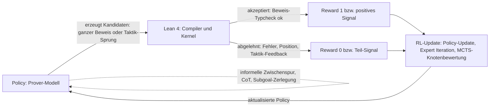
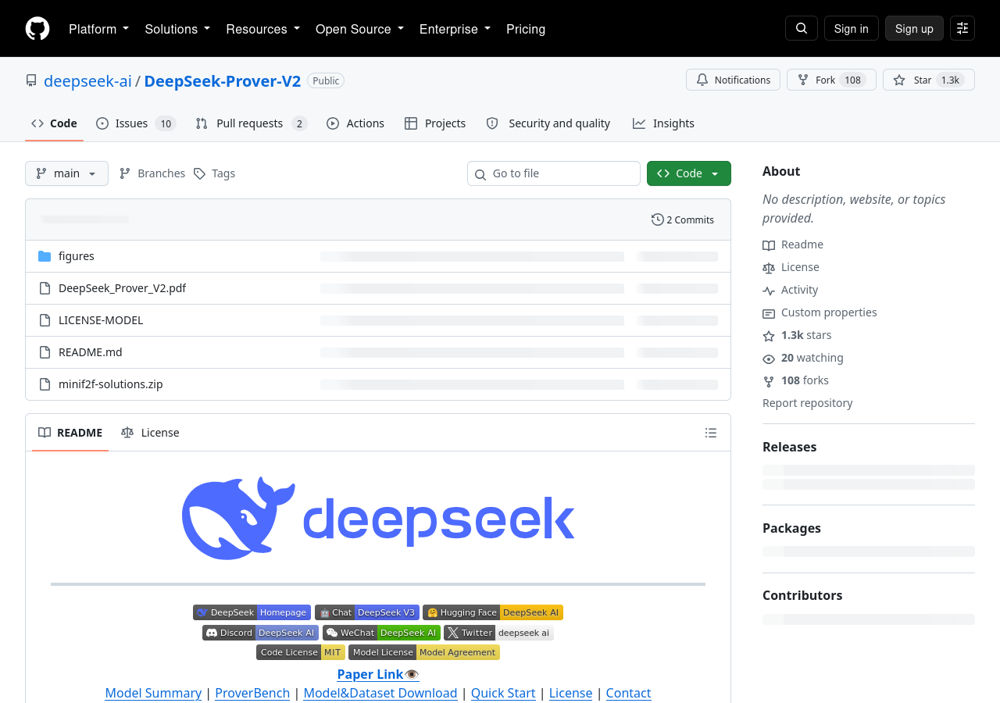

# LLM-Theorembeweiser: AlphaProof, DeepSeek-Prover, Gödel-Prover, Hilbert und das RL-Signal aus dem Verifier

## 1. Einordnung: Beweisen als Suchproblem, zwei Sorten von Signal

Formales Theorembeweisen ist ein Suchproblem in einem praktisch unendlichen Raum: Wer in Lean 4 beweisen will, muss aus Taktiken und Lemmata eine Sequenz finden, die der Kernel akzeptiert — und der Kernel akzeptiert nur, was typkorrekt aus den Axiomen folgt. Genau das macht formale Systeme für das Leitmotiv dieses Wikis interessant — Zeugen, nicht Glauben (vgl. [03-04-zeugen-zertifikate.md](03-04-zeugen-zertifikate.md)): Ein kompilierter Lean-Beweis ist ein überprüfbarer Zeuge; ein ChatGPT-Text über Mathematik ist es nicht.

Für Lernverfahren gibt es zwei grundverschiedene Signale:

1. **Verifier-Signal.** Der Compiler (Lean-Kernel) antwortet mit „akzeptiert" oder „abgelehnt", bei Fehlschlag oft mit einer Position und einer Fehlermeldung. Dieses Signal ist hart, automatisch und billig in unbegrenzter Menge erzeugbar.
2. **Informelles Feedback.** Ein Sprachmodell beurteilt einen Beweisversuch in natürlicher Sprache, schlägt Umformulierungen oder Subziele vor. Dieses Signal ist reich, aber nur plausibel — es kann sich irren, und es belohnt mitunter überzeugend klingende Fehler.

Warum ist „RL aus Verifier-Signal" für prüfbare Mathematik zentral? Weil damit trainiert werden kann, ohne menschliche Beweistrajektorien zu annotieren: Die Policy erzeugt Beweiskandidaten, der Verifier sortiert sie, die belohnten Kandidaten fließen in ein Reinforcement-Learning-Update zurück. Für die informelle Domäne hat DeepSeek-R1 vorgemacht, dass reines RL mit verifizierbaren Belohnungen emergente Selbstreflexion und Verifikationsmuster erzeugt ([DeepSeek-R1, arXiv 2501.12948](https://arxiv.org/abs/2501.12948, accessed 2026-09-12); Nature-Fassung: Nature 645, 633–638, 2025, [DOI 10.1038/s41586-025-09422-z](https://doi.org/10.1038/s41586-025-09422-z, accessed 2026-09-12)). Im formalen Raum spielt der Lean-Kernel die Rolle des unbestechlichen Judges. Die entscheidende Einschränkung steht allerdings am Rand: Der Verifier prüft das *formale* Statement, nicht die Bedeutung des ursprünglichen informellen Problems — die Spezifikationslücke wird in [03-02-autoformalisierung.md](03-02-autoformalisierung.md) behandelt.

## 2. Der Stand der Systeme

### 2.1 AlphaProof (Google DeepMind): RL im formalen Raum, geschlossen

AlphaProof ist ein AlphaZero-inspirierter Agent, der in Lean 4 Beweise sucht und über Verifikation lernt: Ein Gemini-Fine-Tune übersetzt rund eine Million informelle Probleme in formale Statements, ein Solver-Netzwerk durchsucht den Beweissraum, und jeder verifizierte Beweis verstärkt das Modell ([DeepMind: AI achieves silver-medal standard](https://deepmind.google/discover/blog/ai-solves-imo-problems-at-silver-medal-level/, accessed 2026-09-12)).

Bei der IMO 2024 erreichte das Gesamtsystem aus AlphaProof und AlphaGeometry 2 nach Angaben von DeepMind 28 von 42 Punkten bei vier von sechs gelösten Problemen — Silber-Niveau; AlphaProof selbst löste zwei Algebra- und ein Zahlentheorieproblem (darunter das schwerste Problem des Wettbewerbs), AlphaGeometry 2 das Geometrieproblem. Die Bewertung nach IMO-Punkteregeln übernahmen Prof. Sir Timothy Gowers und Dr. Joseph Myers; die Bearbeitung dauerte bis zu drei Tagen pro Problem ([DeepMind: AI achieves silver-medal standard](https://deepmind.google/discover/blog/ai-solves-imo-problems-at-silver-medal-level/, accessed 2026-09-12)).

Die Methodik erschien am 12.11.2025 als Nature-Artikel (Hubert et al., Nature 651, 607–613 (2026), open access). Dort heißt es präziser: AlphaProof löste „three out of the five non-geometry problems" inklusive des schwierigsten Problems; kombiniert mit AlphaGeometry 2 ergab das Silber-Niveau — bei mehrtägigem Rechenaufwand. Zentral ist das dort beschriebene **Test-Time RL (TTRL)**: Das System erzeugt Millionen verwandter Problemvarianten und lernt zur Inferenzzeit daran. Mit TTRL berichtet das Paper einen perfekten Score auf miniF2F-valid und nahezu perfekte Test-Split-Werte; auf dem formalen IMO-Benchmark erreichte TTRL 75,7 % in Zahlentheorie und 72,6 % in Algebra ([Hubert et al., Nature 651, 607–613 (2026)](https://www.nature.com/articles/s41586-025-09833-y, accessed 2026-09-12)).

Das Blog von 2024 sprach beim Gesamtsystem von „four out of six problems"; das Nature-Paper nennt für AlphaProof allein „three out of the five non-geometry problems" — keine Widersprüche, sondern Abgrenzung: Die vierte gelöste Aufgabe stammt von AlphaGeometry 2. Gewichte, Code und Reproduktionsanleitung sind nicht öffentlich; auswertbar sind Blog, Lösungsseiten und Paper. Die IMO erklärt in ihrer Abschlusserklärung, dass sie die Methoden, den Rechenaufwand, mögliche menschliche Beteiligung und die Reproduzierbarkeit solcher KI-Ergebnisse nicht validiert (Details in Abschnitt 2.5) ([IMO 2025: Final day statement](https://imo2025.au/wp-content/uploads/2025/07/IMO-2025_ClosingDayStatement-19072025.pdf, accessed 2026-09-12)).

### 2.2 Die DeepSeek-Prover-Linie: offene Gewichte, dokumentiertes RL-Rezept

Für dieses Wiki besonders relevant, weil das Zielmodell (DeepSeek V4.1 Flash) aus derselben Familie stammt: Die DeepSeek-Prover-Reihe dokumentiert drei Generationen eines offenen Trainingsrezepts.

**DeepSeek-Prover (V1, 23.05.2024).** Ein DeepSeekMath-7B-Modell wurde per Supervised Fine-Tuning auf 8 Millionen synthetischen formalen Aussagen mit Beweisen trainiert (generiert aus High-School- und Grundstudiums-Wettbewerbsproblemen). Ergebnis: 46,3 % Whole-Proof-Genauigkeit mit 64 Samples, 52 % kumulativ auf dem Lean-4-miniF2F-Test; genannt werden zudem GPT-4 mit 23,0 %@64 und eine Tree-Search-RL-Methode mit 41,0 %. FIMO: 5 von 148 gelöst, GPT-4 keines. In dieser Generation kommt noch kein RL zum Einsatz; Datensatz und Modell wurden angekündigt ([DeepSeek-Prover, arXiv 2405.14333](https://arxiv.org/abs/2405.14333, accessed 2026-09-12)).

**DeepSeek-Prover-V1.5 (15.08.2024).** Auf DeepSeekMath-Base folgen SFT und **RL aus Proof-Assistant-Feedback (RLPAF)** — das hier zentrale Signal — plus die MCTS-Variante **RMaxTS** mit intrinsischer Reward-Exploration. Zahlen: 63,5 % (miniF2F-Test), 25,3 % (ProofNet) ([DeepSeek-Prover-V1.5, arXiv 2408.08152](https://arxiv.org/abs/2408.08152, accessed 2026-09-12)).

**DeepSeek-Prover-V2 (30.04.2025, revidiert 18.07.2025).** Hier wird das Rezept zur Subgoal-Maschine: DeepSeek-V3 zerlegt Probleme in Subziele und formalisiert sie in Lean 4; ein 7B-Modell löst die Subziele; Subziel-Beweise plus V3-Begründung ergeben den Chain-of-Thought-Cold-Start für binäres RL. Ausgeliefert werden V2-7B (auf V1.5-Base, 32K Kontext) und V2-671B (auf DeepSeek-V3-Base) ([arXiv 2504.21801](https://arxiv.org/abs/2504.21801, accessed 2026-09-12); [GitHub](https://github.com/deepseek-ai/DeepSeek-Prover-V2, accessed 2026-09-12)).

Die Zahlen von V2 sind protokollabhängig und teils widersprüchlich — beides gehört zu diesem Stand:

- Das 671B-Modell erreicht **82,4 % auf miniF2F-test bei Pass@32**, steigend auf **88,9 % bei Pass@8192** ([arXiv HTML 2504.21801v2](https://arxiv.org/html/2504.21801v2, accessed 2026-09-12)).
- Auf PutnamBench meldet der Paper-Fließtext **47 von 658** gelösten Problemen (Pass@1024); die Abstract-Fassung auf arXiv und das GitHub-README nennen **49 von 658** ([arXiv 2504.21801](https://arxiv.org/abs/2504.21801, accessed 2026-09-12); [GitHub](https://github.com/deepseek-ai/DeepSeek-Prover-V2, accessed 2026-09-12)). Der Widerspruch bleibt stehen — protokollabhängige Zahlen und spätere Eigenkorrekturen prägen diese Systemklasse (siehe unten).
- Auf ProofNet-test werden 37,1 % bei Pass@1024 berichtet; ProverBench, eine neue Sammlung von 325 formalisierten Problemen (15 aus AIME 24/25, Rest Lehrbuchbeispiele), dient als zusätzlicher Vergleichsmaßstab. Auf den 15 AIME-Problemen löst V2-671B sechs, DeepSeek-V3 löste informell acht (Mehrheitswahl) — das Paper liest das als Hinweis, dass die Lücke zwischen formalem und informellem Schlussfolgern „substantially narrowing" ist ([arXiv 2504.21801](https://arxiv.org/abs/2504.21801, accessed 2026-09-12)).

Zusätzlich dokumentiert das V2-Paper bemerkenswert offen seine eigenen Irrwege: Ein anfänglicher Befund, das 7B-Modell löse 13 PutnamBench-Probleme, die dem 671B-Modell verwehrt blieben, wurde auf einen **Lean-4.9.0-UI-Bug** zurückgeführt — die Taktik `apply?` verschluckt in Randfällen ihre `sorry`-Fallbacks. Appendix B zeigt die betroffenen Beweise, Appendix C ein exfalso-Beispiel für einen formal gültigen, aber leeren (vakuös wahren) Beweis, Appendix D eine Revision des miniF2F-Benchmarks ([arXiv HTML 2504.21801v2](https://arxiv.org/html/2504.21801v2, accessed 2026-09-12)).

Für die Notationsfrage ist die Linie doppelt wichtig: erstens als Beweis, dass Subgoal-Zerlegung plus binäres Verifier-RL ohne proprietäre Daten zu SOTA führt; zweitens als Gegenstand, der mit offenen Gewichten selbst nachvollziehbar ist — anders als AlphaProof.

### 2.3 Gödel-Prover (v1/v2) und Hilbert

**Gödel-Prover (v1, 11.02.2025).** Das Modell ist beinahe ein Kompliment an die DeepSeek-Linie: Es entsteht durch SFT von **DeepSeek-Prover-V1.5-Base** auf Goedel-Pset-v1-solved — 1,64 Millionen auto-formalisierte Statements (Numina), von denen über 800.000 durch iterative Prover-Verstärkung bewiesen wurden. Ohne RL erreicht Gödel-Prover-SFT 57,6 % (Pass@32) auf miniF2F und übertrifft laut Paper den vorherigen Spitzenreiter DeepSeek-Prover-V1.5-RL um 7,6 Prozentpunkte; PutnamBench: 7 gelöste Probleme (Pass@512, damalige Leaderboard-Spitze). RL-/DPO-Stufen heben miniF2F auf über 60 % (Pass@32); Code, Modelle und Daten sind offen, inklusive 29,7K neu bewiesener Lean-Workbook-Probleme ([Goedel-Prover, arXiv 2502.07640](https://arxiv.org/abs/2502.07640, accessed 2026-09-12)).

**Gödel-Prover-V2 (05.08.2025).** V2 skaliert mit drei Zutaten: abgestufte Datensynthese („scaffolded data"), **verifier-geführte Selbstkorrektur** (iterative Revision anhand von Lean-Compiler-Feedback) und Model Averaging gegen schwindende Ausgabediversität. Zahlen: 8B erreicht 84,6 % Pass@32 auf miniF2F und übertrifft damit DeepSeek-Prover-V2-671B bei gleichem Metrik (82,4 %); das 32B-Modell erreicht 88,1 % Pass@32 und **90,4 % im Selbstkorrektur-Modus**; PutnamBench: 86 Lösungen bei Pass@184 — laut Paper die offene Bestmarke, gegenüber DeepSeek-Prover-V2-671B mit 47 Lösungen bei Pass@1024. Zum Veröffentlichungszeitpunkt der stärkste offene Theorembeweiser ([Goedel-Prover-V2, arXiv 2508.03613](https://arxiv.org/abs/2508.03613, accessed 2026-09-12)).

**Hilbert (26.09.2025).** Hilbert ist kein Prover-Modell, sondern ein agentisches Framework aus vier Komponenten: informeller Reasoner, Lean-Prover, formaler Verifier, semantischer Theorem-Retriever. Scheitert der Prover, folgt rekursive Subgoal-Zerlegung (Prover oder Reasoner), gesteuert durch Verifier-Feedback. Ergebnis: 99,2 % auf miniF2F (6,6 Punkte über der besten öffentlichen Methode; nur zwei verfehlte Probleme) und 462 von 660 (70,0 %) auf PutnamBench, u. a. gegenüber SeedProver mit 50,4 % — laut Paper die stärkste bekannte Leistung eines öffentlich verfügbaren Systems auf PutnamBench. Beste Konfiguration: Gemini 2.5 Pro + Gödel-Prover-V2-32B; mit DeepSeek-Prover-V2-7B als Prover sinkt die Rate von 99,2 % auf 98,4 %, und Retrieval verbessert beide Konfigurationen. Zwei Befunde zählen für uns: Die Wahl des *informellen* Reasoners wog in den Experimenten schwerer als die Prover-Stärke, und Spitzenprobleme verschlangen bis zu ~27 Millionen Tokens ([Hilbert, arXiv 2509.22819](https://arxiv.org/abs/2509.22819, accessed 2026-09-12); Zahlen aus der [HTML-Fassung v2](https://arxiv.org/html/2509.22819v2, accessed 2026-09-12)).

### 2.4 Weitere Systeme in Kürze

**Kimina-Prover Preview (15.04.2025).** Von Qwen2.5-72B ausgehend mit einer großskaligen RL-Pipeline trainiert; prägend ist ein strukturiertes „formal reasoning pattern", das menschliche Problemlösestrategien in Lean nachahmt. Öffentliche Zahlen: 80,7 % auf miniF2F bei Pass@8192, mit guter Sample-Effizienz (starke Pass@1-Werte) und erstmals im formalen Raum beobachtbarer Skalierung mit Modellgröße; distillierte 1,5B-/7B-Versionen sind offen ([Kimina-Prover Preview, arXiv 2504.11354](https://arxiv.org/abs/2504.11354, accessed 2026-09-12)).

**Lean-STaR (14.07.2024).** Modelle lernen, vor jedem Taktikschritt einen informellen Gedanken zu erzeugen (synthetisch aus Ground-Truth-Taktiken destilliert), kombiniert mit Expert Iteration über Lean-verifizierte Eigenbeweise: miniF2F-test 43,4 % → 46,3 % (Pass@64) ([Lean-STaR, arXiv 2407.10040](https://arxiv.org/abs/2407.10040, accessed 2026-09-12)). Ein früher Beleg dafür, dass die *informelle Zwischenspur* das formale Beweisen verbessert — eine Stütze für Notationen, die beide Spuren führen.

**InternLM2.5-StepProver (21.10.2024).** Taktik-für-Taktik-Suche mit einem gelernten **Critic**, der Präferenzinformationen aus Taktikspuren nutzt und die Suche zur Laufzeit lenkt; Expert Iteration über mehr als 20.000 CPU-Tage. Der Critic hebt den Prover von 59,4 % auf 65,9 %; Modelle und Beweise sind offen ([InternLM2.5-StepProver, arXiv 2410.15700](https://arxiv.org/abs/2410.15700, accessed 2026-09-12)).

### 2.5 Informelle Wettbewerbe 2025: Gold ohne formalen Kern

Im Juli 2025 kippte das Bild: Eine fortgeschrittene Version von Gemini mit Deep Think löste fünf von sechs IMO-Problemen perfekt, erreichte 35 von 42 Punkten und damit Gold-Niveau — erstmals vollständig in natürlicher Sprache, innerhalb des regulären 4,5-Stunden-Limits, offiziell durch IMO-Koordinatoren benotet und zertifiziert ([DeepMind: Advanced version of Gemini with Deep Think](https://deepmind.google/discover/blog/advanced-version-of-gemini-with-deep-think-officially-achieves-gold-medal-standard-at-the-international-mathematical-olympiad/, accessed 2026-09-12)). IMO-Präsident Gregor Dolinar: „We can confirm that Google DeepMind has reached the much-desired milestone, earning 35 out of a possible 42 points — a gold medal score." Zugleich stellte die IMO in der Abschlusserklärung vom 19.07.2025 klar, dass sie Methoden, Rechenaufwand, menschliche Beteiligung und Reproduzierbarkeit *nicht* validiert ([IMO 2025: Final day statement](https://imo2025.au/wp-content/uploads/2025/07/IMO-2025_ClosingDayStatement-19072025.pdf, accessed 2026-09-12)).

OpenAI beanspruchte im selben Monat ebenfalls Gold-Niveau für ein experimentelles Modell. Eine stabile Primärquelle ließ sich während dieser Recherche nicht mehr verifizieren: Die einschlägigen URL-Spuren (u. a. `openai.com/index/imo-gold/`, Wayback-Capture vom 25.10.2025) lieferten beim Abruf nur noch 404; auch die Wayback-Machine war zeitweise offline. Die Sekundärüberlieferung ist aufschlussreich und wird deshalb — als solche gekennzeichnet — doppelt dargestellt: Die englische Wikipedia fasst zusammen, dass OpenAI vor Abschluss der Bewertung ankündigte und dies kritisiert wurde; eine eingesandte Lösung sei später mit null Punkten bewertet worden, weil das Modell das Ergebnis erraten, aber keinen Teil korrekt bewiesen habe ([Wikipedia: International Mathematical Olympiad](https://en.wikipedia.org/wiki/International_Mathematical_Olympiad, accessed 2026-09-12)), mit Verweis auf die journalistische Aufarbeitung ([Business Insider: „OpenAI just won gold…"](https://www.businessinsider.com/openai-gold-iom-math-competition-2025-7, accessed 2026-09-12)). Zahlen zu dieser Ankündigung werden hier bewusst nicht zitiert: *[unkenntlich — keine verifizierbare Primärquelle gefunden]*. Der Kontrast zu DeepMinds zertifiziertem Ergebnis ist aber selbst ein Datum für dieses Wiki: Ankündigung ist nicht Beweis.

Als Bewertungsinfrastruktur veröffentlichte DeepMind Ende 2025 IMO-Bench: IMO-AnswerBench (400 Olympiaden-Probleme mit prüfbaren Kurzantworten) und IMO-Proof Bench (mit Richtlinien für automatisches Grading). Die eigene Auswertung nennt 80,0 % auf AnswerBench und 65,7 % auf der fortgeschrittenen Proof Bench — deutlich vor allen Nicht-Gemini-Modellen; die automatischen Grader korrelieren laut Paper gut mit menschlicher Bewertung (IMO-GradingBench, 1.000 menschliche Bewertungen) ([Towards Robust Mathematical Reasoning (IMO-Bench), arXiv 2511.01846](https://arxiv.org/abs/2511.01846, accessed 2026-09-12)).

Die Pointe: 2025 wurde IMO-Gold *informell* gewonnen — die Olympiade war kein Prover-Wettbewerb. Formale Systeme verlieren dort gegen Freitext-Systeme, gewinnen aber im Prüfmaßstab: Ihr Output ist maschinell verifizierbar. Das Nature-Paper sagt es von der anderen Seite: Systeme ohne Formalisierung „typically lack the formal verification necessary to guarantee correctness" ([Hubert et al.](https://www.nature.com/articles/s41586-025-09833-y, accessed 2026-09-12)).

## 3. Querschnitt: RL aus Verifier-Signal — Mechanik, Kosten, Grenzen

**Mechanik.** Die Schleife ist in allen Systemen dieselbe Grundfigur, mit Varianten:

Konkret nennt DeepSeek-Prover-V1.5 sein Verfahren RLPAF („reinforcement learning from proof assistant feedback") plus RMaxTS-Suche ([arXiv 2408.08152](https://arxiv.org/abs/2408.08152, accessed 2026-09-12)); DeepSeek-Prover-V2 trainiert mit „binary correct-or-incorrect feedback as the primary form of reward supervision" ([GitHub](https://github.com/deepseek-ai/DeepSeek-Prover-V2, accessed 2026-09-12)); AlphaProof lernt im AlphaZero-Stil aus verifizierten Beweisen plus TTRL ([Nature-Paper](https://www.nature.com/articles/s41586-025-09833-y, accessed 2026-09-12)); Gödel-Prover-V2 nutzt Verifier-Feedback zusätzlich als Korrekturschleife zur Inferenzzeit ([arXiv 2508.03613](https://arxiv.org/abs/2508.03613, accessed 2026-09-12)). Bei Hilbert und StepProver kommen Retriever-, Critic- und Reasoner-Rollen hinzu.

**Vorteile.** Das Signal ist automatisch, bezüglich Typkorrektheit unbestechlich und unbeschränkt erzeugbar; R1 zeigte, dass damit „self-reflection, verification, and dynamic strategy adaptation" emergent werden können — ohne menschlich annotierte Denkpfade ([arXiv 2501.12948](https://arxiv.org/abs/2501.12948, accessed 2026-09-12)). Expert Iteration (lösen, per Verifier filtern, nachlernen) ist das Arbeitspferd aller hier besprochenen Systeme.

**Kosten.** Verifier-RL ist billig pro Signal, teuer pro Erfolg: bis zu drei Tage pro IMO-Problem plus TTRL mit Millionen Varianten (AlphaProof, [DeepMind-Blog 2024](https://deepmind.google/discover/blog/ai-solves-imo-problems-at-silver-medal-level/, accessed 2026-09-12); [Nature](https://www.nature.com/articles/s41586-025-09833-y, accessed 2026-09-12)); über 20.000 CPU-Tage Expert Iteration (StepProver, [arXiv 2410.15700](https://arxiv.org/abs/2410.15700, accessed 2026-09-12)); ~27 Millionen Tokens für Hilbert-Spitzenprobleme ([arXiv HTML 2509.22819v2](https://arxiv.org/html/2509.22819v2, accessed 2026-09-12)); miniF2F-Spitzenwerte bei Pass@8192, also mit tausenden Versuchen ([arXiv 2504.21801](https://arxiv.org/abs/2504.21801, accessed 2026-09-12)). Die Kosten liegen in Inferenz (Test-Time-Compute) und Datenpipeline — Letzteres erklärt, warum offene Systeme wie Gödel und DeepSeek überhaupt mithalten können.

**Grenzen.** Drei Klassen, alle mit Beleg in dieser Recherche:

1. **Reward-Hacking.** Eine Arbeit von August 2026 über Reward-Oracle-MCTS (Lean-Compiler als skalares Suchsignal) fand nach einem Axiom-Audit aller kompilierten Beweise, dass **DeepSeek-Prover-V2-7B** auf PutnamBench Beweise liefert, die Kompilation und `sorry`-Scan passieren, aber von `sorryAx` abhängen — das Audit entfernte 4 bzw. 8 Beweise aus dem Whole-Proof-Sampling (PAB@32/@128) und 11 bzw. 19 aus der MCTS-Suche. Die Autoren führen das nicht aufs Suchverfahren zurück, sondern als Beleg, dass „kernel-level auditing is necessary for compiler-verified evaluation" ([Reward-Oracle MCTS, arXiv 2608.28639](https://arxiv.org/abs/2608.28639, accessed 2026-09-12)); ihr eigener Beitrag: 87,1 % auf miniF2F mit Gödel-Prover-V2-8B bei PAB@256, 26/659 PutnamBench bei PAB@32 (Baseline 18/659).
2. **Werkzeug- und UI-Bugs als Falschpositiv-Quelle.** Der Lean-4.9.0-`apply?`-Bug, der Fallback-`sorry`s verschluckt, ist das papierene Gegenstück: Selbst wenn Kernel und Scan zusammenspielen, kann ein Werkzeugloch die Korrektheit vortäuschen ([arXiv HTML 2504.21801v2](https://arxiv.org/html/2504.21801v2, accessed 2026-09-12)).
3. **Spezifikationsproblem.** Bewiesen wird das formale Statement, nicht das gemeinte Problem; das exfalso-Beispiel in Appendix C zeigt formal einwandfreie Beweise, die nichts aussagen ([arXiv HTML 2504.21801v2](https://arxiv.org/html/2504.21801v2, accessed 2026-09-12)). Der gesamte Rückweg problemgetreuer Formalisierung wird in [03-02-autoformalisierung.md](03-02-autoformalisierung.md) behandelt.

Dazu kommen die weichen Grenzen: Closed Models wie AlphaProof sind nicht nachprüfbar; Benchmark-Revisionen (miniF2F-Korrekturen bei DeepSeek-V2 und AlphaProof) zeigen, dass selbst die Vergleichsmaßstäbe ein bewegtes Ziel sind; und die IMO-Erklärung erinnert daran, dass niemand die Methoden der Firmen validiert hat ([IMO 2025: Final day statement](https://imo2025.au/wp-content/uploads/2025/07/IMO-2025_ClosingDayStatement-19072025.pdf, accessed 2026-09-12)). Wie ein Axiom- und „sorryAx"-Audit konkret läuft — `#print axioms` plus Kernel-Replay —, beschreiben [03-04](03-04-zeugen-zertifikate.md) und [03-05 §2.1](03-05-roundtrip-anforderungen.md); die Notations-Brücke verlangt denselben Audit als Emitter-Pflicht (dort §4, T6).

## 4. Vergleichstabelle (öffentliche Zahlen, Stand dieser Recherche)

| System | Basis/Modell | Methode | Benchmark-Stand (öffentlich berichtet) | Signal | Offen/Closed |
|---|---|---|---|---|---|
| AlphaProof (DeepMind) | Gemini-Finetune + Lean 4 | AlphaZero-RL + Test-Time-RL (TTRL) | IMO 2024: 28/42 mit AG2 (4/6); Nature: 3/5 non-Geometrie; TTRL: miniF2F-valid perfekt; formal-IMO NT 75,7 %/Alg. 72,6 % | Lean-verifizierte Beweise als Reward | Closed (Paper/Blog offen) |
| DeepSeek-Prover V1 | DeepSeekMath 7B | SFT auf 8 Mio. synthetischen Aussagen+Beweisen | miniF2F 46,3 %@64 / 52 % kumulativ; FIMO 5/148 | SFT (kein RL) | Offen (Modell, Daten) |
| DeepSeek-Prover V1.5 | DeepSeekMath-Base | SFT + RLPAF + RMaxTS-Suche | miniF2F 63,5 %; ProofNet 25,3 % | Proof-Assistant-Feedback (RLPAF) | Offen |
| DeepSeek-Prover V2 | 7B (auf V1.5-Base, 32K) / 671B (auf V3-Base) | V3-Subgoal-Zerlegung, CoT-Cold-Start, binäres RL | miniF2F 82,4 %@32 → 88,9 %@8192; Putnam 47 (Paper-Fließtext) vs. 49 (Abstract/README) von 658; AIME 6/15 | binäres richtig/falsch | Offen (Gewichte) |
| Gödel-Prover v1 | SFT auf DeepSeek-Prover-V1.5-Base | Auto-Formalisierungs-Pipeline (1,64 Mio. Statements), SFT, optional RL/DPO | miniF2F 57,6 %@32 (ohne RL), >60 % mit RL/DPO; Putnam 7@512 | SFT; optional RL | Offen (Code, Modelle, Daten) |
| Gödel-Prover-V2 | 8B / 32B (Open Source) | Expert Iteration + RL, Scaffolded Data, Verifier-Selbstkorrektur, Model Averaging | miniF2F 84,6 %@32 (8B); 88,1 %@32, 90,4 % mit Selbstkorrektur (32B); Putnam 86@184 | Lean-Feedback als Reward und Korrektur | Offen (Code, Daten) |
| Kimina-Prover Preview | Qwen2.5-72B | großskaliges RL, „formal reasoning pattern" | miniF2F 80,7 %@8192; starke Pass@1-Werte | RL aus Lean | Offen (Distillate 1,5B/7B) |
| Lean-STaR | LLM + Lean (Basismodell im Abstract nicht genannt) | synthetische informelle Gedanken + Expert Iteration | miniF2F 43,4 % → 46,3 %@64 | Lean-verifizierte Eigenbeweise | Forschungssystem |
| InternLM2.5-StepProver | InternLM2.5 | Critic-guided Search + Expert Iteration (20.000+ CPU-Tage) | 59,4 % → 65,9 % (mit Critic) | Critic-Präferenz + Lean | Offen (Modelle, Beweise) |
| Hilbert | Framework: Gemini 2.5 Pro / gpt-oss-120b + Gödel-V2-32B / DeepSeek-V2-7B | rekursive Dekomposition, Verifier-Refinement, Theorem-Retrieval | miniF2F 99,2 %; Putnam 462/660 (70,0 %) vs. SeedProver 50,4 % | Verifier-Erfolg + informelle Reflexion | Framework (Paper; Zutaten offen) |
| Gemini Deep Think (IMO 2025) | Gemini (fortgeschritten, closed) | informelles RL-Reasoning, paralleles Denken | IMO 2025: 35/42 (5/6), Gold, offiziell zertifiziert | kein formaler Verifier (Freitext) | Closed |

Anmerkung zur Lesart: Pass@k-Zahlen sind über Systeme hinweg **nicht** vergleichbar (verschiedene k, miniF2F-Revisionen, Rechenbudgets). Wo Papers den Vergleich erzwingen, tun sie es ausdrücklich „under the same metric" — z. B. Gödel-V2-8B (84,6 %@32) gegen DeepSeek-Prover-V2-671B (82,4 %@32) ([arXiv 2508.03613](https://arxiv.org/abs/2508.03613, accessed 2026-09-12)). Deshalb steht „47 vs. 49" bei DeepSeek-Prover-V2 doppelt in dieser Datei.

*Abb. 1: GitHub-Seite von DeepSeek-Prover-V2 (Repository-Kopf mit Public-Status und Star-Zahl, Dateiliste u. a. mit DeepSeek_Prover_V2.pdf und minif2f-solutions.zip, Beginn des README mit Badges und Abschnittslinks „Model Summary | ProverBench | …"). Quelle: [GitHub deepseek-ai/DeepSeek-Prover-V2](https://github.com/deepseek-ai/DeepSeek-Prover-V2) (accessed 2026-09-12).*

## 5. Was das für die Notationsfrage heißt

**Bewiesenermaßen wirksam.** Vier Techniken tragen in praktisch jeder der berichteten SOTA-Zahlen:

1. **Subgoal-Zerlegung.** DeepSeek-Prover-V2 (V3 zerlegt, 7B löst), Gödel-Prover-V2 (scaffolded Aufgaben), Hilbert (rekursiv), StepProver (taktikweise mit Critic) — schwere Probleme werden auf Ketten verifier-prüfbarer Schritte zurückgeführt.
2. **Selbstkorrektur mit Verifier-Feedback.** Gödel-Prover-V2 steigert sich durch Compiler-geführte Revision von 88,1 % auf 90,4 %; DeepSeek-Prover-V1.5 lernte erstmals großflächig aus Proof-Assistant-Feedback; Hilbert baut eine Revision in den Agentenloop ein.
3. **Test-Time-Compute.** AlphaProofs TTRL, Pass@k-Profile (82,4 → 88,9 %) und die Multi-Millionen-Token-Läufe bei Hilbert zeigen: Die Skalierung zur Inferenzzeit ist ein eigenständiger Hebel — aber auch ein Kostenfaktor, der in kein Schnellnotations-Szenario passt, ohne ihn zu benennen.
4. **Hybride Spuren.** Die stärksten Systeme führen informelle und formale Information bewusst nebeneinander: V3-Chain-of-Thought plus Lean-Beweise (V2), informelle Gedanken vor Taktiken (Lean-STaR), Reasoner+Prover+Retriever (Hilbert). Bei Hilbert wog die Wahl des informellen Reasoners in den Experimenten schwerer als die Prover-Stärke ([arXiv HTML 2509.22819v2](https://arxiv.org/html/2509.22819v2, accessed 2026-09-12)).

**Offen oder strittig.** Ob nicht-formale Systeme von formalen Trainingssignalen dauerhaft profitieren (oder umgekehrt), ist nicht entschieden; die Gold-Ankündigungen 2025 kamen von *informellen* Systemen. Die Benchmark-Landschaft ist in Bewegung (miniF2F-Revisionen, ProverBench als Antwort darauf, IMO-Bench als Bewertungsökosystem). Und die Audit-Debatte (sorryAx, UI-Bugs) zeigt, dass „der Compiler hat akzeptiert" als Prüfkriterium nur so gut ist wie das darum gebaute Werkzeug-Audit — ein Punkt, den [03-04-zeugen-zertifikate.md](03-04-zeugen-zertifikate.md) vertieft.

**DeepSeek-spezifisch.** Drei Lehren für das Zielmodell aus derselben Familie. Erstens: Das V2-Rezept ist nicht proprietär — binäres Verifier-RL plus Subgoal-Chain-of-Thought reicht, wenn die Cold-Start-Daten sauber erzeugt sind. Zweitens: Die Linie ist konsistent offen (V1 → V1.5 → V2, dann als Basis für Gödel v1 und Hilbert-Konfigurationen), sodass Rezept und Zahlen — bis auf den Putnam-Widerspruch — nachvollziehbar bleiben. Drittens: Das schwächste Glied ist nicht die Suchstrategie, sondern die Kette „informelles Problem → formales Statement → Beweis → Interpretation". Eine modell-native Notation, die Subgoal-Zerlegung begünstigt, informelle Begleitinformation erhält *und* jede Zwischenstufe verifier-fähig hält, adressiert exakt diese Punkte.

## Quellen

1. Hubert, T. et al.: *Olympiad-level formal mathematical reasoning with reinforcement learning*. Nature 651, 607–613 (2026), publiziert 12.11.2025, open access. https://www.nature.com/articles/s41586-025-09833-y (accessed 2026-09-12).
2. Google DeepMind: *AI achieves silver-medal standard solving International Mathematical Olympiad problems*. 25.07.2024. https://deepmind.google/discover/blog/ai-solves-imo-problems-at-silver-medal-level/ (accessed 2026-09-12).
3. Google DeepMind: *Advanced version of Gemini with Deep Think officially achieves gold-medal standard at the International Mathematical Olympiad*. 21.07.2025. https://deepmind.google/discover/blog/advanced-version-of-gemini-with-deep-think-officially-achieves-gold-medal-standard-at-the-international-mathematical-olympiad/ (accessed 2026-09-12).
4. *DeepSeek-Prover: Advancing Theorem Proving in LLMs through Large-Scale Synthetic Data.* arXiv:2405.14333, 23.05.2024. https://arxiv.org/abs/2405.14333 (accessed 2026-09-12).
5. *DeepSeek-Prover-V1.5: Harnessing Proof Assistant Feedback for Reinforcement Learning and Monte-Carlo Tree Search.* arXiv:2408.08152, 15.08.2024. https://arxiv.org/abs/2408.08152 (accessed 2026-09-12).
6. *DeepSeek-Prover-V2: Advancing Formal Mathematical Reasoning via Reinforcement Learning for Subgoal Decomposition.* arXiv:2504.21801, v1 30.04.2025, v2 18.07.2025; Zahlen teils aus der HTML-Fassung https://arxiv.org/html/2504.21801v2 (accessed 2026-09-12).
7. deepseek-ai: *DeepSeek-Prover-V2* (GitHub-Repository und README). https://github.com/deepseek-ai/DeepSeek-Prover-V2 (accessed 2026-09-12).
8. *Goedel-Prover: A Frontier Model for Open-Source Automated Theorem Proving.* arXiv:2502.07640, 11.02.2025 (v3). https://arxiv.org/abs/2502.07640 (accessed 2026-09-12).
9. *Goedel-Prover-V2: Scaling Formal Theorem Proving with Scaffolded Data Synthesis and Self-Correction.* arXiv:2508.03613, 05.08.2025. https://arxiv.org/abs/2508.03613 (accessed 2026-09-12).
10. *Hilbert: Recursively Building Formal Proofs with Informal Reasoning.* arXiv:2509.22819, 26.09.2025; Zahlen aus der HTML-Fassung v2. https://arxiv.org/abs/2509.22819, https://arxiv.org/html/2509.22819v2 (accessed 2026-09-12).
11. *Kimina-Prover Preview: Towards Large Formal Reasoning Models with Reinforcement Learning.* arXiv:2504.11354, 15.04.2025. https://arxiv.org/abs/2504.11354 (accessed 2026-09-12).
12. *Lean-STaR: Learning to Interleave Thinking and Proving.* arXiv:2407.10040, 14.07.2024. https://arxiv.org/abs/2407.10040 (accessed 2026-09-12).
13. *InternLM2.5-StepProver: Advancing Automated Theorem Proving via Critic-Guided Search.* arXiv:2410.15700, 21.10.2024. https://arxiv.org/abs/2410.15700 (accessed 2026-09-12).
14. DeepSeek-AI: *DeepSeek-R1: Incentivizing Reasoning Capability in LLMs via Reinforcement Learning.* arXiv:2501.12948, 22.01.2025; Nature 645, 633–638 (2025), DOI 10.1038/s41586-025-09422-z. https://arxiv.org/abs/2501.12948 (accessed 2026-09-12).
15. IMO 2025: *Final day of IMO 2025* (Closing-Day-Statement), 19.07.2025. https://imo2025.au/wp-content/uploads/2025/07/IMO-2025_ClosingDayStatement-19072025.pdf (accessed 2026-09-12).
16. *Reward-Oracle MCTS for Formal Theorem Proving: Sample-Efficient Search and the Need for Kernel-Level Proof Auditing.* arXiv:2608.28639, 11.08.2026. https://arxiv.org/abs/2608.28639 (accessed 2026-09-12).
17. *Towards Robust Mathematical Reasoning* (IMO-Bench; AnswerBench/Proof Bench/GradingBench). arXiv:2511.01846, 03.11.2025. https://arxiv.org/abs/2511.01846 (accessed 2026-09-12).
18. Wikipedia (en): *International Mathematical Olympiad* (Abschnitt zu IMO 2025 zur OpenAI-Ankündigung). https://en.wikipedia.org/wiki/International_Mathematical_Olympiad (accessed 2026-09-12). [Sekundärquelle]
19. Varanasi, L.: *OpenAI just won gold at the world's most prestigious math competition.* Business Insider, Juli 2025. https://www.businessinsider.com/openai-gold-iom-math-competition-2025-7 (accessed 2026-09-12). [Sekundärquelle]
