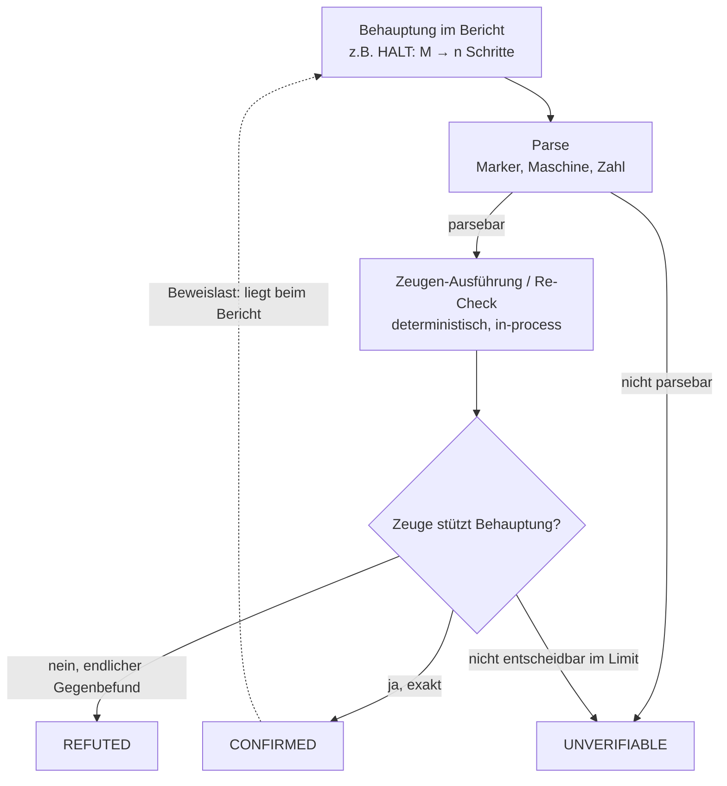

# Was "prüfbar" konkret heißt: Beweisterme, Zertifikate, SAT/UNSAT-Kerne, HALT-Zeugen

## Worum es geht

"Prüfbar" ist kein Attribut, das einer Aussage von selbst zukommt. Es beschreibt eine Kette: eine Behauptung, einen endlichen Zeugen, einen deterministischen Checker und ein Urteil. Dieses Kapitel konkretisiert die Kette an drei technisch realisierten Instanzen — Beweisterme (Lean/Coq/HOL Light), SAT/UNSAT-Zertifikate (DRAT/LRAT) und die lokale `[HALT: …]`-Mechanik des Pruefer-Branches P7 — und zieht daraus die Anforderungen an die Notations-Rücküberführung (Brücke zu 03-05). Die drei Instanzen stammen aus verschiedenen Welten; sie teilen aber exakt dasselbe Grundschema.

## 1. Das Grundschema: Behauptung → Zeuge → Checker → Verdict

Jede prüfbare Behauptung wird über einen endlichen Zeugen operationalisiert: eine Datei, einen Beweisterm, ein Zertifikat. Ein Checker — nicht der Produzent des Zeugen — entscheidet deterministisch, ob der Zeuge die Behauptung stützt. Das Ergebnis ist ein Verdict; im Pruefer-Kontext sind es drei Ausgänge: `CONFIRMED`, `REFUTED`, `UNVERIFIABLE`.

Die **Vertrauensbasis ist der Checker, nicht der Produzent**. Der Produzent (ein Theorembeweiser, ein SAT-Solver, ein Simulator) darf Fehler haben, ohne dass das Urteil falsch wird — solange der Checker korrekt arbeitet und den Zeugen unabhängig nachrechnet. Dieses Prinzip hat einen Namen: das **De-Bruijn-Kriterium**.

> "De Bruijn criterion. Some proof assistants create an 'independently checkable proof object' while the user is interactively proving a theorem. These proof objects should be simply checkable, by a program that a skeptic user could easily write him/herself. De Bruijn's Automath systems were the first to specifically focus on this aspect and therefore this property was coined 'De Bruijn criterion' by Barendregt." ([Geuvers, Proof assistants: History, ideas and future](https://www.cs.ru.nl/~herman/PUBS/proofassistants.pdf, accessed 2026-09-12))

Wiedijk gibt die praktische Konsequenz am Beispiel von HOL Light: "The main advantage of HOL Light is its elegant architecture, which makes it a very powerful and reliable system. A proof of the correctness of the 394 line HOL Light 'logical core' even has been formalized." ([Wiedijk, Formal Proof — Getting Started](https://www.cs.ru.nl/~freek/pubs/notices.pdf, accessed 2026-09-12); Verlagsfassung: [Notices of the AMS](https://www.ams.org/notices/200811/tx081101408p.pdf, accessed 2026-09-12)). Der Aufwand formaler Systeme verschiebt sich damit an eine andere Stelle: Der Zeuge wird groß, der Checker bleibt klein. Wiedijk nennt das Verhältnis von formalem Beweis zu seinem informellen Pendant den "de Bruijn factor"; es liegt nach seiner Angabe bei etwa Faktor vier ([Wiedijk 2008](https://www.cs.ru.nl/~freek/pubs/notices.pdf, accessed 2026-09-12)).

Daraus folgt die Beweislastverschiebung, die die Prüfer-Doktrin beschreibt: Die Last trifft den Bericht, nicht den Prüfer. Die lokale Prüfer-Theorie formuliert das gegen die deutsche Beweisrechtsdogmatik (§ 286 ZPO) gewandt: "Behauptet der Agent eine Tatsache, so muss der Bericht sie belegen; gelingt der Beleg nicht, lautet das Ergebnis `UNVERIFIABLE` und nicht `CONFIRMED`" (`yesdocs/pruefer/wiki/01-theorie/falsifizierbarkeit.md`, lokale Quelle, gelesen 2026-09-12). Ein `REFUTED` trägt seinerseits eine Beweislast: Es muss auf einem geprüften Basissatz ruhen, sonst bleibt es `UNVERIFIABLE` (ebd.).

## 2. Instanz 1 — Beweisterme: Der Kernel als Zeugenprüfer

In interaktiven Beweissystemen mit Dependent Type Theory ist der Zeuge ein **Beweisterm**, die Behauptung ein **Typ**. Der Zusammenhang ist die Formeln-als-Typen-Entsprechung, die Geuvers so formuliert: "Following the formulas-as-types principle, this amounts to Γ ⊢L ϕ if and only if ΓL, Γ ⊢type theory M : T(ϕ)" ([Geuvers](https://www.cs.ru.nl/~herman/PUBS/proofassistants.pdf, accessed 2026-09-12)). Der Checker ist ein **Typchecker**; Geuvers notiert für de Bruijns Automath: "the proof objects are basically encodings of natural deduction derivations that can be checked by a type checking algorithm" (ebd.). Typchecking ist damit Zeugenprüfung im wörtlichen Sinn: Der Term M wird nicht "verstanden", sondern gegen den Typ T geprüft — akzeptiert oder verworfen.

Coq, auf dem die spätere BB(5)-Verifikation beruht, wird im BB(5)-Paper als "proof assistant and programming language based on the Calculus of Inductive Constructions" beschrieben ([bbchallenge Collaboration et al., Determination of the fifth Busy Beaver value, arXiv:2509.12337](https://arxiv.org/abs/2509.12337, accessed 2026-09-12)). Für Lean 4 existiert die Checker-Instanz als eigenes Werkzeug: Das Repository `lean4checker` beschreibt seinen Zweck als "Replay the `Environment` for a given Lean module, ensuring that all declarations are accepted by the kernel" — und benennt gleich die Gefahr, gegen die es arbeitet: "This is not an external verifier, as it uses the Lean kernel itself. However it is useful as a tool to detect 'environment hacking', i.e. using metaprogramming facilities to build an inconsistent Lean `Environment`" ([leanprover/lean4checker](https://github.com/leanprover/lean4checker, accessed 2026-09-12)). Das Werkzeug wurde inzwischen in die Lean-Toolchain integriert und als `leanchecker` mit jeder Installation ausgeliefert (ebd.).

Die Vertrauensfrage bleibt dabei explizit: "For any proof assistant, trust in its implementation is required in order to accept as true the results it verifies. The open-source nature of most proof assistants facilitates bug discovery and resolution" ([bbchallenge Collaboration et al., arXiv:2509.12337](https://arxiv.org/abs/2509.12337, accessed 2026-09-12)). Das De-Bruijn-Kriterium verkleinert diese Vertrauensfläche — es eliminiert sie nicht. Genau deshalb wird über die Korrektheit kleiner Kerne (HOL Light, 394 Zeilen) überhaupt formal nachgedacht ([Wiedijk 2008](https://www.cs.ru.nl/~freek/pubs/notices.pdf, accessed 2026-09-12)), und deshalb ist Wiedijks Satz prägend: "Formalization of mathematics is about checking, and not about discovery" (ebd.).

Praktische Folge: Taktiken, Automation und Taktik-Programme (die "interaktive Seite" der Systeme) gehören nicht zur Vertrauensbasis. Sie produzieren Terme; der Kernel prüft sie. Ein fehlerhafter Taktik-Aufruf kann einen Beweisversuch scheitern lassen, aber keinen falschen Beweis erzeugen — sofern der Kernel korrekt ist.

## 3. Instanz 2 — SAT/UNSAT-Zertifikate: DRAT, LRAT, CakeML

Beim SAT-Problem ist die Asymmetrie der Prüfbarkeit besonders sichtbar. Eine **SAT**-Behauptung ("erfüllbar") hat einen offensichtlichen Zeugen: eine Belegung, die alle Klauseln erfüllt — trivial prüfbar. Eine **UNSAT**-Behauptung ("unerfüllbar") ist universell: Sie sagt, dass *keine* Belegung existiert — die Abwesenheit von etwas lässt sich nicht als einzelne Belegung vorzeigen. Ihr Zeuge muss deshalb eine **Herleitung** der leeren Klausel sein — ein Beweis, dass jede Belegung scheitert.

Das Standardformat für solche Zeugen ist **DRAT**. DRAT-trim, der Referenz-Checker, ist "a satisfiability proof checker based on the new DRAT proof format" ([Wetzler, Heule, Hunt, DRAT-trim: Efficient Checking and Trimming Using Expressive Clausal Proofs](https://www.cs.utexas.edu/~marijn/publications/drat-trim.pdf, accessed 2026-09-12)). Zwei Eigenschaften machen DRAT zur Vertrauensinfrastruktur: Die Prüfzeit ist vergleichbar mit der Laufzeit des beweisproduzierenden Solvers, und der Speicherbedarf ähnelt dem des Solvers — "which overcomes a major hurdle of resolution-based proof checkers" (ebd.). Die Motivation ist empirisch: "SAT solvers, as well as SMT and QBF solvers, have documented bugs" — die Autoren zitieren den Fall des Solvers Lingeling, dessen Blocked-Clause-Bug über eineinhalb Jahre unentdeckt blieb, obwohl der Solver auf Millionen von Benchmarks "experimentally correct" war und industriell verwendet wurde (ebd.). Zum Zeitpunkt des Papers wurden Preprocessing-Techniken wie Blocked-Clause-Addition von den zeitgenössischen Checkern nicht erfasst; DRAT schließt diese Lücke ("DRAT proofs are easy to emit, require relatively little space on disk, and can be used to check all known solving and preprocessing techniques", ebd.).

**LRAT** treibt die Idee weiter: "a new format, called LRAT, which extends the DRAT format with hints that facilitate a simple and fast validation algorithm. Checking validity of LRAT proofs can be implemented using trusted systems such as the languages supported by theorem provers. We demonstrate this by implementing two certified LRAT checkers, one in Coq and one in ACL2" ([Cruz-Filipe, Heule, Hunt, Kaufmann, Schneider-Kamp, Efficient Certified RAT Verification, arXiv:1612.02353](https://arxiv.org/abs/1612.02353, accessed 2026-09-12)). Die Architektur ist zweistufig: Ein nicht-zertifizierter Checker (eine Erweiterung von DRAT-trim) trimmt und optimiert das DRAT-Zertifikat und erzeugt dabei die LRAT-Hints; anschließend validiert ein **zertifizierter** Checker das optimierte Zertifikat als Beweis für die ursprüngliche Formel. Das Vertrauensargument ist in dieser Arbeit explizit: "We do not need to trust whether the original proof is correct. In fact, the non-certified checker might even produce an optimized proof from an incorrect proof." (ebd.). Die Treue zur De-Bruijn-Idee wird in den Ergebnissen greifbar: Der Coq-Checker verifizierte einen Praxisbeweis in 8 Minuten 25 Sekunden, und "the ACL2 LRAT checker is almost as fast as — and in some cases even faster than — non-certified checking" (ebd.).

Die dritte Realisierungsachse ist **Verifikation des Checkers selbst**. `cake_lpr` ist ein LRAT/LPR-Checker, der mit dem CakeML-Compiler erzeugt wurde; CakeML beschreibt sich als "an ecosystem of proofs and tools" mit "a proven-correct compiler that can bootstrap itself", und die Checker für SAT-Beweise (DRAT/LPR) werden dort explizit unter den "end-to-end verified applications" geführt ([CakeML](https://cakeml.org/, accessed 2026-09-12)). Das Repository beschreibt den Ablauf: `./cake_lpr example.cnf example.lpr` gibt bei Erfolg `s VERIFIED UNSAT` aus; ein fehlerhaftes Zertifikat führt zu stderr-Meldungen wie `c empty clause not derived at end of proof` ([tanyongkiam/cake_lpr](https://github.com/tanyongkiam/cake_lpr, accessed 2026-09-12)). Seit März 2024 unterstützt der Checker LRAT/LPR nativ im Binärformat (ebd.). Die Vertrauenskette ist hier nicht mehr "kleiner Kernel plus Coq-Formalisierung", sondern "kleiner Kernel plus verifizierter Compiler plus kompilierter Checker" — dieselbe Idee in einer anderen technischen Umsetzung.

Die Zeugenpflicht ist auch institutionell verankert: Die International SAT Competition führt seit mindestens 2005 eine eigene **Certified-UNSAT**-Kategorie, in der Solver getrennt gewertet werden, die zu ihren UNSAT-Ergebnissen prüfbare Zertifikate beisteuern ([The International SAT Competition Web Page](https://satcompetition.github.io/, accessed 2026-09-12)). Der Solver-Output allein genügt dort nicht mehr als Beleg.

## 4. Instanz 3 — HALT-Zeugen: die lokale `[HALT: … ]`-Mechanik (P7)

Die dritte Instanz ist lokal und zeigt das Grundschema in Reinform. Der Pruefer-Branch `yesloop/proofboy-p7-halt` implementiert einen optionalen Behauptungstyp `[HALT: <machine> -> <steps>]`: "A HALT claim asserts that the named machine of the bbchallenge standard notation halts after exactly the claimed number of steps. An optional `[SCORE: <machine> -> <ones>]` on the same line for the same machine additionally asserts the number of ones on the tape when it halts." (`proofboy/claimtypes/halt.py`, lokale Quelle, Branch `yesloop/proofboy-p7-halt`, gelesen 2026-09-12).

Die **Notation** ist die der bbchallenge-Community: Blöcke von Zuständen, getrennt durch `_`, je Block zwei Übergänge der Form `<schreiben><bewegen><nächster>` für die gelesenen Symbole 0 und 1, `Z` als Haltezustand (`proofboy/turing.py`, lokale Quelle, Branch `yesloop/proofboy-p7-halt`, gelesen 2026-09-12). Das BB(5)-Paper definiert dasselbe Format und nennt die Referenzmaschine: "1RB1LC_1RC1RB_1RD0LE_1LA1LD_---0LA represents the transition table of Figure 1(a) … the use of 1RZ instead of --- means that we know that the transition is reached and, thus, that the machine halts" ([bbchallenge Collaboration et al., arXiv:2509.12337](https://arxiv.org/abs/2509.12337, accessed 2026-09-12)). Genau diese Maschine — `1RB1LC_1RC1RB_1RD0LE_1LA1LD_1RZ0LA` — steht als Beispiel in der lokalen Simulator-Quelle (`proofboy/turing.py`); sie ist der 5-Zustands-Busy-Beaver-Sieger mit 47.176.870 Schritten (ebd.; [bbchallenge.org](https://bbchallenge.org/, accessed 2026-09-12)).

**Die Prüfkette** im Pruefer ist vollständig lokal: "The machine is re-run by `proofboy.turing`, in this process: no repository, no subprocess, no network, nothing to sandbox." (`proofboy/claimtypes/halt.py`, lokale Quelle). Der Simulator ist eine unabhängige Reimplementierung aus der Notation selbst: "It is a reimplementation from the notation itself, not a port of any community simulator" (`proofboy/turing.py`, lokale Quelle). Die Schrittzählung ist fest definiert: "every executed transition counts as one step, including the transition into the halt state Z. The score is the number of ones on the tape when the run stops" (ebd.).

**Die Verdict-Taxonomie** (halt.py):
- `CONFIRMED` — nur wenn die Maschine nach exakt den behaupteten Schritten hält, und bei vorhandenem `[SCORE]`-Marker mit exakt dem behaupteten Score.
- `REFUTED` — wenn sie früher hält; wenn sie innerhalb der behaupteten Schritte **nicht** hält ("a finite witness: not having halted after n steps proves it cannot halt exactly at step n; it is not a proof that the machine never halts"); oder wenn sie mit einem anderen Score hält.
- `UNVERIFIABLE` — wenn die Maschine nicht parst, die Schrittzahl keine schlichte nichtnegative Ganzzahl ist, widersprüchliche `[SCORE]`-Marker für dieselbe Maschine existieren oder die Schrittzahl das ausführbare Limit übersteigt.

Für die Brücke interessant ist, wie ein **neuer Zeugentyp** andockt: „A claim type is one module in this package plus one entry in `CLAIM_TYPES`: `pattern` finds its markers in a report line, `parse` turns one match into the claim's fields, `check` re-derives the claim against the world." Report-Parser und Checker-Dispatcher konsultieren die Registry, „so a new type needs no change to either" (`proofboy/claimtypes/__init__.py`, lokale Quelle, Branch `yesloop/proofboy-p7-halt`, gelesen 2026-09-12; Prozess: README, „Neuen Behauptungstyp hinzufuegen", ebd.). Genau diese Naht ist der Anschlusspunkt für neue Zeugenarten der Notations-Brücke (03-05 §3, Backend B).

Bemerkenswert ist die **Asymmetrie zwischen Halten und Nicht-Halten**. Halten ist durch endliche Ausführung bezeugbar: Der Re-Run reproduziert es in endlicher Zeit, per Konstruktion deterministisch. Nicht-Halten ist durch keinen endlichen Lauf bezeugbar — das sagt bereits die Unentscheidbarkeit des Halteproblems in Turings Originalarbeit ([Turing, On Computable Numbers, with an Application to the Entscheidungsproblem, Proc. London Math. Soc., 1936/37](https://doi.org/10.1112/plms/s2-42.1.230, accessed 2026-09-12); Einordnung: [Stanford Encyclopedia of Philosophy, Turing Machines](https://plato.stanford.edu/entries/turing-machine/, accessed 2026-09-12)). Die Implementierung zieht daraus die korrekte Grenze: Ein Lauf bis n Schritte kann eine Halte-Behauptung "nach n Schritten" widerlegen, aber niemals beweisen, "dass die Maschine nie hält" (halt.py). Eine Nicht-Halte-Behauptung wäre also — wenn überhaupt — nur über andere Beweismittel schließbar (Schranken, Invarianten, Decider-Beweise), nicht über Simulation.

Deshalb ist das **Schrittlimit** konstitutiv: `DEFAULT_HALT_LIMIT = 47_176_870` — "It carries the BB(5) champion's 47,176,870 steps; a claim beyond it stays UNVERIFIABLE (`--halt-limit` changes it)." (halt.py). Das Limit ist keine technische Nebensache, sondern die Grenze der ausführbaren Zeugenproduktion. Es ist genau auf den Champion zugeschnitten: "Cost: one claim at the limit means roughly five seconds of simulation, and a report may carry many claims; the limit bounds each claim, not the report." (ebd.). Der BB(5)-Kontext macht diese Verankerung historisch: Die Bestimmung von S(5) = 47.176.870 erforderte die Analyse von 181.385.789 Turingmaschinen und wurde als erster Busy-Beaver-Wert überhaupt formal verifiziert ("We prove that S(5) = 47,176,870 using the Coq proof assistant … the first Busy Beaver value ever to be formally verified", [arXiv:2509.12337](https://arxiv.org/abs/2509.12337, accessed 2026-09-12)). Die bbchallenge-Startseite meldet den Abschluss: "There remain 0 machines with 5 states to decide!!" mit Verweisen auf den Coq-Beweis und die offizielle Ankündigung ([bbchallenge.org](https://bbchallenge.org/, accessed 2026-09-12)).

Ein weiterer Punkt: **Der Bericht ist untrusted input.** Die Regexe für die Marker sind bewusst linear gebaut, weil ein Bericht feindlich sein kann ("A report is untrusted input, so the patterns stay linear", halt.py). Der Dispatcher fängt checker-interne Fehler ab und übersetzt sie in `UNVERIFIABLE` statt in einen Absturz: "A hostile report must never crash the verifier: embedded NUL bytes are rejected up front, and an unexpected checker error becomes UNVERIFIABLE instead of a traceback." (`proofboy/checks.py`, lokale Quelle, Branch `yesloop/proofboy-p7-halt`, gelesen 2026-09-12). Das ist die operative Fassung des De-Bruijn-Kriteriums: Die Vertrauensbasis darf durch Eingaben nicht angreifbar sein.

*Das Grundschema, instanziiert im Pruefer: Claim → Parse → deterministische Zeugen-Ausführung → drei Verdicts. `CONFIRMED` nur nach tatsächlich ausgeführtem Check (`proofboy/checks.py`, lokale Quelle).*

## 5. Anwendung: Beweislast, Granularität, ehrliche Ausgänge

Drei Konsequenzen der Prüfer-Doktrin verdienen hier explizit zu stehen, weil sie die Brücke zur Notation bilden:

**Beweislast beim Bericht.** Der Checker glaubt nichts. Er nimmt Zeugen und prüft sie. `CONFIRMED` setzt voraus, dass der Check tatsächlich lief und die Behauptung bewies: "The doctrine is strict: a verdict is `CONFIRMED` only when the check actually ran and proved the claim, and a claim that cannot be run is `UNVERIFIABLE` — never `CONFIRMED`." (`proofboy/checks.py`, lokale Quelle). In der lokalen Theorie entspricht das der zivilprozessualen Beweislast: "Die Last trifft den Bericht, nicht den Prüfer" (`yesdocs/pruefer/wiki/01-theorie/falsifizierbarkeit.md`, lokale Quelle).

**Granularität pro Behauptung.** Geprüft wird pro Behauptung, nicht pro Bericht. Ein Bericht ist ein Bündel von Sätzen; ein einzelner falscher Satz macht ihn nicht in Gänze falsch (ebd., mit Verweis auf Duhem). Im Claim-Modell ist das direkt sichtbar: `Claim`, `Result` und `Verdict` sind Einheiten pro Behauptung (`proofboy/model.py`, lokale Quelle, Branch `yesloop/proofboy-p7-halt`, gelesen 2026-09-12); der Dispatcher `run_claim` verarbeitet genau einen Claim (checks.py).

**UNVERIFIABLE als ehrlicher dritter Ausgang.** Die binäre Logik "bestätigt/widerlegt" erzeugt den Druck, behauptete Dinge zu glauben, wenn sie nicht widerlegbar sind. Der dritte Ausgang entzieht dem die Grundlage: Wo kein Zeuge vorhanden, kein Check ausführbar oder das Limit überschritten ist, lautet das Urteil `UNVERIFIABLE` — weder Zweifel noch Glaube (`yesdocs/pruefer/wiki/01-theorie/falsifizierbarkeit.md`, lokale Quelle).

Genau diese drei Eigenschaften sind die Anforderungen an die **Rücküberführung der Notation** (siehe 03-05): Eine modell-native Mathematik-Notation, die in prüfbare formale Mathematik überführt werden soll, muss zu jeder Behauptung eine Zeugenform mitliefern — nicht ein Glaubensbekenntnis. Das `[HALT: …]`-Muster zeigt, wie das aussieht: Gegenstand (Maschine), prüfbare Größe (Schrittzahl, optional Score), deterministischer Re-Check. Die Notation muss nicht die Wahrheit ihres Inhalts versprechen; sie muss Behauptungen so formulieren, dass ein kleiner unabhängiger Checker sie entscheiden kann — und sie muss die Grenze ausweisen, jenseits deren die Entscheidung `UNVERIFIABLE` lauten muss (`DEFAULT_HALT_LIMIT` ist genau so eine ausgewiesene Grenze; halt.py). Wo eine Aussage keinen endlichen Zeugen haben *kann* — Nicht-Halten ist der Fall —, darf die Notation die Nicht-Halte-Behauptung nicht simulieren, sondern muss sie als das markieren, was sie ist: höchstens eine Vermutung mit anderen Belegpfaden (vgl. bbchallenge: Coq-BB5 verifiziert Halten *und* Nicht-Halten über Decider, [arXiv:2509.12337](https://arxiv.org/abs/2509.12337, accessed 2026-09-12)).

*Die bbchallenge.org-Startseite (Screenshot vom 2026-09-12; [bbchallenge.org](https://bbchallenge.org/, accessed 2026-09-12)): Das Projekt verknüpft Crowd-Simulation, Decider und formale Verifikation — Zeugen werden hier institutionell eingefordert, das Halten des Champions ist per Simulation bezeugbar, das Nicht-Halten der übrigen 181 Millionen Maschinen nur per Beweis.*

## Quellen

1. F. Wiedijk, *Formal Proof — Getting Started*, Notices of the AMS 55(11), 1408–1414, 2008. https://www.cs.ru.nl/~freek/pubs/notices.pdf (accessed 2026-09-12); Verlagsfassung: https://www.ams.org/notices/200811/tx081101408p.pdf
2. H. Geuvers, *Proof assistants: History, ideas and future*, Sadhana 34(1), 2009. https://www.cs.ru.nl/~herman/PUBS/proofassistants.pdf (accessed 2026-09-12)
3. N. Wetzler, M. J. H. Heule, W. A. Hunt Jr., *DRAT-trim: Efficient Checking and Trimming Using Expressive Clausal Proofs*. Theory and Applications of Satisfiability Testing – SAT 2014, LNCS (Metadaten via Crossref verifiziert, 2026-09-12). https://www.cs.utexas.edu/~marijn/publications/drat-trim.pdf (accessed 2026-09-12)
4. L. Cruz-Filipe, M. J. H. Heule, W. A. Hunt Jr., M. Kaufmann, P. Schneider-Kamp, *Efficient Certified RAT Verification*. Automated Deduction – CADE 26, LNCS, 2017 (DOI 10.1007/978-3-319-63046-5_14, via Crossref verifiziert, 2026-09-12). https://arxiv.org/abs/1612.02353 (accessed 2026-09-12)
5. *CakeML* — A Verified Implementation of ML. https://cakeml.org/ (accessed 2026-09-12)
6. *cake_lpr* — LPR proof checking with CakeML. https://github.com/tanyongkiam/cake_lpr (accessed 2026-09-12)
7. *lean4checker* — Replay the `Environment` for a given Lean module, ensuring that all declarations are accepted by the kernel. https://github.com/leanprover/lean4checker (accessed 2026-09-12)
8. *The International SAT Competition Web Page*. https://satcompetition.github.io/ (accessed 2026-09-12)
9. *The Busy Beaver Challenge*. https://bbchallenge.org/ (accessed 2026-09-12)
10. The bbchallenge Collaboration et al., *Determination of the fifth Busy Beaver value*, arXiv:2509.12337. https://arxiv.org/abs/2509.12337 (accessed 2026-09-12)
11. *Turing Machines*, Stanford Encyclopedia of Philosophy. https://plato.stanford.edu/entries/turing-machine/ (accessed 2026-09-12)
12. A. M. Turing, *On Computable Numbers, with an Application to the Entscheidungsproblem*, Proceedings of the London Mathematical Society s2-42(1), 1936/37. https://doi.org/10.1112/plms/s2-42.1.230 (accessed 2026-09-12)

## Lokale Quellen

1. `yesdocs/pruefer/wiki/01-theorie/falsifizierbarkeit.md` — Prüfer-Doktrin: Beleg vs. Beweis, Beweislast, drei Ausgänge (lokale Quelle, gelesen 2026-09-12)
2. `proofboy/claimtypes/halt.py` — `[HALT]`/`[SCORE]`-Mechanik, Verdicts, `DEFAULT_HALT_LIMIT` (lokale Quelle, Branch `yesloop/proofboy-p7-halt`, gelesen 2026-09-12)
3. `proofboy/turing.py` — unabhängiger Simulator der bbchallenge-Notation, Schrittzählung und Score-Konvention (lokale Quelle, Branch `yesloop/proofboy-p7-halt`, gelesen 2026-09-12)
4. `proofboy/checks.py` — Checker-Doktrin, `run_claim`, Hostile-Input-Behandlung (lokale Quelle, Branch `yesloop/proofboy-p7-halt`, gelesen 2026-09-12)
5. `proofboy/model.py` — `Verdict`, `Result`, `Claim`, `ClaimType` (lokale Quelle, Branch `yesloop/proofboy-p7-halt`, gelesen 2026-09-12)
6. `proofboy/claimtypes/__init__.py` — Claim-Typ-Registry, `checker_for` (lokale Quelle, Branch `yesloop/proofboy-p7-halt`, gelesen 2026-09-12)
