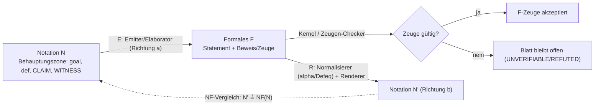
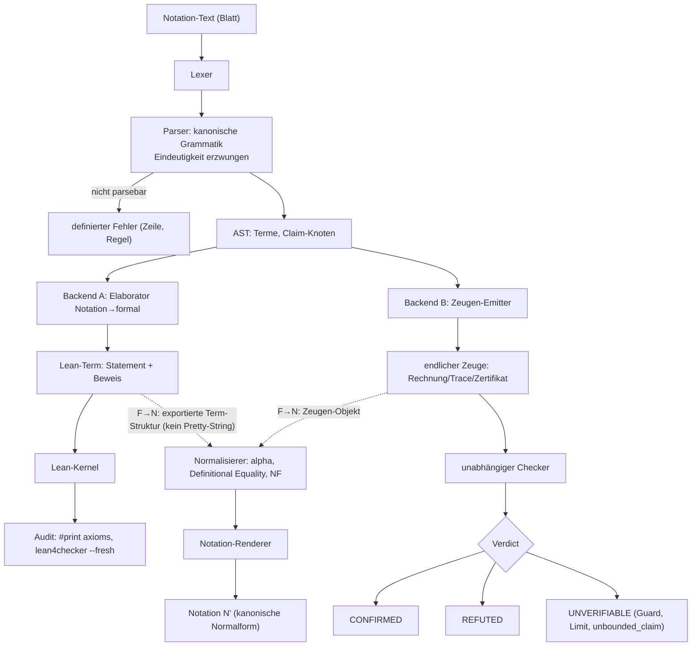
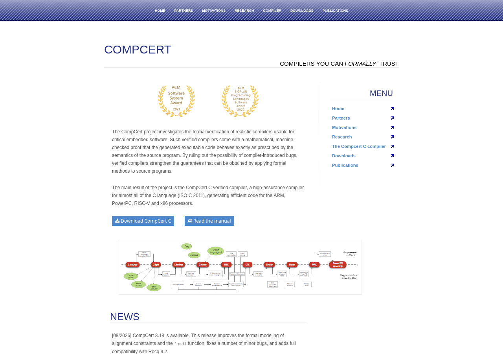

# Rücküberführbarkeit: Definition, Konservativität, Compiler-Skizze und Round-Trip-Tests

## Worum es geht

Diese Datei definiert, was „Rücküberführbarkeit" der modell-nativen Notation präzise bedeutet, welche Beweislast der Entwurf trägt und wie man sie testet. Sie schließt an [03-04](03-04-zeugen-zertifikate.md) an (Behauptung → Zeuge → Checker → Verdict) und liefert den Rahmen, den [05-03](../05-entwurf-testplan/05-03-mapping-formal.md) für die V1-Notation operationalisiert; bei Berührung hat dieses Kapitel nach der dort vereinbarten Schnittstelle Vorrang (`05-03-mapping-formal.md` §4, lokale Quelle, gelesen 2026-09-12). Kernsatz: Rücküberführbarkeit ist keine Aussage über Bedeutung, sondern über Form — und nur so viel wert wie die Tests, die sie belegen.

## 1. Definition: Rücküberführbarkeit ist zweistellig

Rücküberführbarkeit ist eine Eigenschaft des Paares (Notation, Zielsystem) — für V1: (V1-Notation; Lean 4 als Beweisziel plus Python-Zeugenstufe). `NF` bezeichne die definierte Normalform eines Notation-Artefakts (kanonische, voll geklammerte Schreibweise; `05-02-notations-spezifikation.md` §3, lokale Quelle). Sie besteht aus zwei Richtungen:

**(a) Notation → formal.** Jede im definierten Sprachumfang formulierte Behauptung wird in eine formale Formel plus Zeugen übersetzt. Definierter Sprachumfang ist die Behauptungszone des Blattes — `goal`, `def`, `CLAIM`, `WITNESS`, `[HALT]` —, nicht die freie Denkzone; Letztere ist ausdrücklich „nicht Teil des formalen Artefakts" (`05-02-notations-spezifikation.md` §7, lokale Quelle).

**(b) Formal → Notation.** Formale Objekte — Statements, Beweisterme, Zeugen — werden in die Notation zurückübersetzt, verlustarm bis auf die definierte Normalisierung. Entscheidender Implementierungspunkt: Die Rückrichtung liest die *Struktur* des formalen Objekts (Term, AST), nie dessen Pretty-Print-Ausgabe (§3.2).

### 1.1 Drei Präzisierungen

**Syntaktische Abdeckung (Totalität).** Für jedes wohlgeformte Artefakt aus dem definierten Umfang ist das Übersetzungsergebnis definiert: Übersetzung, klassifizierte Nicht-Abbildbarkeit oder definierter Fehler — nie stille Approximation. V1 setzt das auf beiden Stufen um: kanonische Grammatik ohne Alternativ-Syntax (`05-02-notations-spezifikation.md` §3, lokale Quelle) und ein Mapping, das jede Konstruktklasse mit Klasse und Verlust führt — „sauber", „teilweise", „nicht (V1)" (`05-03-mapping-formal.md` §1, lokale Quelle). Die dortige Setzung ist zugleich Abnahmekriterium: „Nichtabbildbarkeit wird als Parser-/Renderfehler gemeldet, nie approximiert" (`05-03-mapping-formal.md` §4, lokale Quelle). Totalität heißt also: definiertes Verhalten für alles, nicht Übersetzung von allem.

**Semantische Konservativität.** Eine Erweiterung ist konservativ, wenn sie keine neuen Theoreme über die Ausgangssprache erzeugt: „a theory T2 is a (proof theoretic) conservative extension of a theory T1 if every theorem of T1 is a theorem of T2, and any theorem of T2 in the language of T1 is already a theorem of T1" ([Conservative extension — Wikipedia](https://en.wikipedia.org/wiki/Conservative_extension, accessed 2026-09-12)); als Kriterium: „Any formula of L that is provable in L+ is provable in L" ([Definitions — SEP](https://plato.stanford.edu/entries/definitions/, accessed 2026-09-12)). Für die Brücke: Die Notation darf keine neue Beweiskraft einführen — „N beweist nichts, was F nicht beweist". Da Emitter und Renderer unverifizierter Code sind, ist das keine Selbstverständlichkeit, sondern eine zu prüfende Behauptung (Emitter-Audit, §2.1). Die SEP präzisiert: Konservativität ist „not an absolute property of a definition; the satisfaction is relative to the ground language" (ebd.) — hier relativ zu Lean 4 plus V1-Bibliothek.

**Zeugen-Fähigkeit.** Jede Behauptung muss eine endliche, unabhängig prüfbare Zeugenform mitliefern — das Grundschema aus [03-04](03-04-zeugen-zertifikate.md): Ein Produzent erzeugt einen endlichen Zeugen, ein Checker entscheidet deterministisch, das Urteil ist `CONFIRMED`, `REFUTED` oder `UNVERIFIABLE`. Lokale Vorbild-Instanz: Der `[HALT]`-Simulator ist eine unabhängige Reimplementierung aus der Notation selbst („a reimplementation from the notation itself, not a port of any community simulator", `proofboy/turing.py`, lokale Quelle, Branch `yesloop/proofboy-p7-halt`, gelesen 2026-09-12); ein Nicht-Halten im behaupteten Horizont ist „a finite witness: not having halted after n steps proves it cannot halt exactly at step n" (`proofboy/claimtypes/halt.py`, lokale Quelle, ebenda). Wo ein endlicher Zeuge unmöglich ist („hält nie"), darf die Notation keinen simulieren — `UNVERIFIABLE` muss zulässig bleiben (ebd.).

### 1.2 Roundtrips und Verluste

Zwei Kompositionen messen die Stabilität der Brücke:

- **N→F→N:** Emittieren ins formale Ziel, Rückübersetzen, Vergleich mit `NF`. Abweichung nach Normalisierung = Defekt.
- **F→N→F:** Formales Objekt rendern, zurück emittieren, Vergleich mit dem Original modulo α-Äquivalenz und Definitional Equality. Abweichung = Defekt.

„Verlustarm bis auf definierte Normalisierung" ist damit eine Messgröße, keine Vokabel: Defekte werden gezählt, je Klasse klassifiziert und dokumentiert. Die Verlustklassen sind benannt: (L1) syntaktische/Type-Fehler, (L2) fehlende Annahmen, (L3) Definitions-Mismatch, (L4) Zeugenfehler (`05-03-mapping-formal.md` §2, lokale Quelle; die Taxonomie dort folgt u. a. [Wu et al., Autoformalization](https://arxiv.org/abs/2205.12615, accessed 2026-09-12)).

*Eigene Darstellung: die zwei Richtungen und der N→F→N-Roundtrip als Normalform-Vergleich; F→N→F läuft dieselbe Kette umgekehrt (§4, T2/T3).*

## 2. Konservativität und Beweislast

### 2.1 Konservativ, konkret: der Emitter-Audit

Konservativität wird auf der Lean-Stufe zu einer endlichen Prüfbedingung: **Emittierte Beweise dürfen keine zusätzlichen Axiome verwenden.** Lean unterstützt das, weil es Axiome nicht verbirgt — „Lean automatically tracks the axioms that each proof depends on so that they can be audited" ([Lean Reference: Axioms](https://lean-lang.org/doc/reference/latest/Axioms/, accessed 2026-09-12)) —, und weil die Gefahr dokumentiert ist: „axioms that are inconsistent with one another, or just false, undermine the very foundations of proofs" (ebd.). Der Audit hat drei Ebenen:

1. **Statische Whitelist.** Kein `axiom`, kein `sorry`, kein `native_decide` (es erzeugt „a bespoke axiom for each invocation", ebd.), kein `Lean.ofReduceBool`/`Lean.reduceNat`, kein `unsafe`, kein `debug.skipKernelTC` — Letzteres ist die Umgehung, gegen die die Validierungsdoktrin gerichtet ist ([Lean Reference: Validating a Lean Proof](https://lean-lang.org/doc/reference/latest/ValidatingProofs/, accessed 2026-09-12)).
2. **`#print axioms`-Kontrolle pro Beweis.** Der Befehl „displays all the axioms that a definition transitively relies on" ([Lean Reference: Axioms](https://lean-lang.org/doc/reference/latest/Axioms/, accessed 2026-09-12)); erwartet werden höchstens die drei Standardaxiome `propext`, `Classical.choice`, `Quot.sound` — „standard axioms of Lean's logic, and benign"; „If `sorryAx` is reported, then this theorem or one of its dependencies uses `sorry` or is otherwise incomplete", und „Any other axiom means that a custom axiom was declared and used" (ebd.).
3. **Kernel-Replay als Stichprobe.** `lean4checker` liest die Build-Artefakte und „replays them through the kernel"; die Referenz empfiehlt das als CI-Schritt (ebd.) — Muster für T6 (§4).

Für die Python-Zeugenstufe tritt an die Stelle des Audits die Verdikt-Disziplin: „a verdict is `CONFIRMED` only when the check actually ran and proved the claim, and a claim that cannot be run is `UNVERIFIABLE` — never `CONFIRMED`" (`proofboy/checks.py`, lokale Quelle, Branch `yesloop/proofboy-p7-halt`, gelesen 2026-09-12).

### 2.2 Die Beweislast trägt der Entwurf

Die Prüfer-Doktrin ist unmissverständlich: „Die Last trifft den Bericht, nicht den Prüfer" — „Behauptet der Agent eine Tatsache, so muss der Bericht sie belegen; gelingt der Beleg nicht, lautet das Ergebnis `UNVERIFIABLE` und nicht `CONFIRMED`" (`yesdocs/pruefer/wiki/01-theorie/falsifizierbarkeit.md`, lokale Quelle, gelesen 2026-09-12). Auf die Notation übertragen schuldet der Entwurf: die **Übersetzer-Spezifikation** (Grammatik, Mapping, Normalform — liegt in `05-02`/`05-03` vor), die **Testevidenz** (T1–T7 aus §4, ausgeführt), die **dokumentierten Verluste** (jede nicht-saubere Klasse mit Grund) und die **ausgewiesenen Grenzen** (`UNVERIFIABLE`-Fälle: unbounded Claims, Guard-Grenzen, `DEFAULT_HALT_LIMIT`). Der Leser muss keine Lücken erraten. Geprüft wird pro Behauptung, nicht pro Notation; ein einzelner falscher Claim macht die Notation nicht in Gänze ungültig (ebd.). `UNVERIFIABLE` ist dabei ein erlaubter, ehrlicher Ausgang — V1 nutzt ihn für unendliche Behauptungen ausdrücklich als Designelement (`05-02-notations-spezifikation.md` §4, lokale Quelle).

### 2.3 Die Grenze: Der Kernel prüft die Form, nicht die Bedeutung

Die Lean-Referenz formuliert die Grenze selbst: „it is important to distinguish the question 'does the theorem have a valid proof' from 'what does the theorem statement mean'" ([Lean Reference: Validating a Lean Proof](https://lean-lang.org/doc/reference/latest/ValidatingProofs/, accessed 2026-09-12)). Selbst der Goldstandard aus Sandbox, exportiertem Term und externem Checker lässt Restannahmen — darunter „No human error or misleading presentation of the theorem statement in the trusted challenge file" (ebd.). Die Autoformalisierungsforschung quantifiziert die Lücke: In „Beyond Compilation" hat jedes der acht evaluierten Systeme auf 400 Statements einen Abstand zwischen Kompilierung und semantischer Treue (Spanne 3,0–29,0 Prozentpunkte); der volle GPT-5.2-Agent erreicht 89,5 % Kompilierung bei 60,5 % Treue (`03-02-autoformalisierung.md`, lokale Quelle, nach Zhang et al., arXiv:2606.31002). Der Kernel bezeugt die formale Aussage, nicht die Treue zum intendierten Satz. Deshalb drei getrennte Maßnahmen:

1. **Roundtrip-Tests** (§4): prüfen Stabilität zwischen Notation und formaler Form — nicht die Treue der Notation zur Aufgabenstellung, weil dabei die formale Aussage mit sich selbst verglichen wird.
2. **Unabhängige Zweitprüfung:** Der Lean-Zweig kann die `comparator`-Kette nutzen — sie „replays the proofs using both Lean's kernel and/or an external checker and also ensures that the proved theorem statements match those in the trusted challenge file"; als unabhängiger Checker ist `nanoda` dokumentiert, „developed independently and implemented in Rust" ([Lean Reference: Validating a Lean Proof](https://lean-lang.org/doc/reference/latest/ValidatingProofs/, accessed 2026-09-12)).
3. **Dokumentierte Verlustklassen** (§1.2): Nicht-Übersetzbares wird als L1–L4 ausgewiesen; L3 (Definitions-Mismatch) wird durch die V1-Bibliothek als eingefrorene Semantik begrenzt (`05-03-mapping-formal.md` §2, lokale Quelle).

Wiedijks Satz markiert die epistemische Arbeitsteilung: „Formalization of mathematics is about checking, and not about discovery" ([Wiedijk, Formal Proof — Getting Started](https://www.cs.ru.nl/~freek/pubs/notices.pdf, accessed 2026-09-12)). Die Notation muss die Wahrheit ihres Inhalts nicht versprechen; sie muss Behauptungen so formulieren, dass ein kleiner unabhängiger Checker sie entscheiden kann. Die Kosten sind real: Ein formaler Beweis ist „roughly four times the size of a corresponding informal LATEX proof (this ratio is called the de Bruijn factor)" (ebd.).

## 3. Compiler-Skizze: Pipeline, Vertrauensbasis, Vorbilder

### 3.1 Die Pipeline

Die Rücküberführung wird als Compiler mit zwei Backends gebaut. Vorderseite: Notation-Text → Lexer → Parser gegen die kanonische Grammatik aus `05-02` §3 mit erzwungener Eindeutigkeit (Ablehnung statt Reparatur) → AST. Backend A: Elaborator → Lean-4-Term (Statement plus Beweis) → Kernel; anschließend `#print axioms` und `lean4checker`-Replay. Backend B: Zeugen-Emitter → endliche Zeugen (Rechnung, Trace, Zertifikat) → unabhängiger Checker, im Vorbild der `[HALT]`-Mechanik, die in-process nachrechnet (`proofboy/claimtypes/halt.py`, lokale Quelle). Rückrichtung: formale Objekte als Term-/AST-Strukturen → Normalisierer (α-Äquivalenz, Definitional Equality) → Notation-Renderer.

*Eigene Darstellung: Hinrichtung mit Kernel-/Checker-Prüfung (durchgezogen), Rückrichtung auf Struktur-Ebene (gestrichelt). Der Python-Zweig ist auf dieser Maschine sofort lauffähig; der Lean-Zweig ist Ausbau-/Fern-Stufe (`05-03-mapping-formal.md` §5, lokale Quelle).*

### 3.2 Was muss vertraut werden? (TCB)

| Komponente | Vertrauensbedarf | Begründung / Gegenmaßnahme |
|---|---|---|
| Parser + Grammatik | ja | klein und kanonisch (`05-02` §3); T1/T5 machen Verhalten sichtbar |
| Elaborator (N→F) | ja — die riskante Stelle | unverifizierter Übersetzer; entlastet wird er nicht durch Vertrauen, sondern durch Prüfung jedes Ergebnisses (Kernel, `#print axioms`, T2/T3/T6) |
| Lean-Kernel | ja, aber klein | er „does nothing other than check proof terms" ([Lean Reference](https://lean-lang.org/doc/reference/latest/, accessed 2026-09-12)); Kernel-Akzeptanz ist der Anker der Hinrichtung |
| Zeugen-Emitter | nein | der Produzent darf fehlerhaft sein: „Die Vertrauensbasis ist der Checker, nicht der Produzent" ([03-04](03-04-zeugen-zertifikate.md)) |
| Zeugen-Checker | ja, klein | deterministisch, unabhängig reimplementiert (`proofboy/turing.py`, lokale Quelle) |
| Normalisierer + Renderer | nur für die Rückrichtung | Fehler werden durch T1/T2 als Defekte sichtbar; keine Beweiskraft beansprucht |

Die TCB-Minimierung ist damit keine Vertrauensfrage an den Elaborator, sondern an zwei kleine, mechanisch nachprüfbare Schichten: Kernel bzw. Zeugen-Checker und die Kanonizität von Grammatik und Normalform. Die Lean-Doktrin beschreibt dieselbe Eskalation als Leiter: blaue Häkchen → `#print axioms` → `lean4checker` → `comparator` mit externen Checkern ([Lean Reference: Validating a Lean Proof](https://lean-lang.org/doc/reference/latest/ValidatingProofs/, accessed 2026-09-12)). Der Pretty-Print-Bann hat einen belegten Grund: Statement-Bedeutung kann durch „custom notation and type classes" verschoben werden; „if there are doubts that the theorem means what it appears to mean, its statement and all referenced definitions must be investigated carefully"; externe Checker bieten dafür „raw pretty-printing capabilities that are not affected by changes to parser or notation in the source file" (ebd.). Die F→N-Richtung liest deshalb exportierte Terme — mit genau dieser Eigenschaft.

### 3.3 Vorbilder: CompCert und Translation Validation

**Integrale Verifikation (CompCert).** Der Maßstab für „verifizierter Compiler": „a compiler that is accompanied by a machine-checked proof of a semantic preservation property: the generated machine code behaves as prescribed by the semantics of the source program" ([Leroy, Formal verification of a realistic compiler](http://gallium.inria.fr/~xleroy/publi/compcert-CACM.pdf, accessed 2026-09-12)); die Projektseite formuliert dasselbe ([CompCert](https://compcert.org/, accessed 2026-09-12)). Wichtig für die Übertragung: Die stärkste Semantik-Erhaltung — Quelle und Ziel haben „exactly the same observable behaviors" — ist „too strong to be usable" (Leroy, ebd.). Für die Notation heißt das: N→F→N-Identität wäre das zu starke Analogon; „NF-Gleichheit modulo definierter Normalisierung" ist die richtige abgeschwächte Fassung.

*Die CompCert-Projektseite mit dem verifizierten Übersetzungspfad und den beiden ACM-Awards (Screenshot vom 2026-09-12; [CompCert](https://compcert.org/, accessed 2026-09-12)): das Vorbild in Reinform — jede Übersetzungsstufe trägt einen maschinengeprüften Beweis. Für die Notations-Brücke ist dieser Aufwand nicht verfügbar; seine Rolle übernimmt die Per-Instanz-Prüfung.*

**Per-Instanz-Prüfung (Translation Validation).** Die zweite Linie prüft nicht den Übersetzer einmal, sondern jedes Übersetzungsergebnis. Pnueli, Siegel und Singerman haben das Verfahren 1998 unter dem Namen „Translation Validation" eingeführt ([Pnueli et al., Translation Validation, TACAS 1998](https://doi.org/10.1007/BFb0054170, accessed 2026-09-12); Metadaten verifiziert über Crossref und Semantic Scholar, 2026-09-12; der Springer-Volltext war von dieser Maschine nicht abrufbar — JS-Challenge, laut Unpaywall kein Open-Access-Exemplar). Necula beschreibt seine GNU-C-Instanz so: „During the compilation the infrastructure compares the intermediate form of the program before and after each compiler pass and verifies the preservation of semantics" — und verortet sie als Nachfolge der „work on translation validation by Pnueli, Siegel and Singerman" ([Necula, Translation Validation for an Optimizing Compiler](https://people.eecs.berkeley.edu/~necula/Papers/tv_pldi00.pdf, accessed 2026-09-12)). Für eine modell-native Notation ist das die passende Architektur: Der Übersetzer (LLM plus Regelwerk) wird nicht verifiziert; jedes Ergebnis wird stattdessen durch Kernel, Zeugen-Checker und Roundtrip-Tests geprüft. Der Aufwand verlagert sich vom Beweis über den Übersetzer zu einer Test- und Audit-Infrastruktur — genau das, was die Prüfer-Doktrin ohnehin verlangt.

## 4. Round-Trip-Testklassen T1–T7

Sieben Klassen definieren, was „getestet" heißt: Zweck, Beispiel, messbares Abnahmekriterium. Ausgeführt werden sie im Harness aus [05-04](../05-entwurf-testplan/05-04-test-harness.md); der Mini-Korpus ist der dort vereinbarte Satz aus 100 generierten Claims (fünf Klassen à 20, je zur Hälfte wahr/falsch) plus zehn Ambiguitäts-Negativfällen (`05-03-mapping-formal.md` §4, lokale Quelle).

**T1 — Parse/Print-Idempotenz.** *Zweck:* Parser und Renderer sind auf dem kanonischen Korpus exakt invers. *Beispiel:* Für jedes der 100 Blätter gilt `render(parse(blatt)) = NF(blatt)`, Zeichen für Zeichen. *Abnahme:* 100 %; jeder Defekt wird Regressionstest.

**T2 — Statement-Roundtrip N→F→N modulo Normalform.** *Zweck:* Die formale Übersetzung eines Statements ist rückübersetzbar, ohne den Inhalt zu verschieben. *Beispiel:* `(forall n in 1..1000: (sum_1_to_n(n) = ((n * (n + 1)) // 2)))` wird zu einem Lean-Statement (`∀ n, 1 ≤ n → n ≤ 1000 → …`) elaboriert und zurückgerendert; verglichen wird gegen `NF` des Originals. *Abnahme:* Defektquote ≤ 5 % auf der Python-Stufe (Setzung aus `05-03` §4, lokale Quelle); jede Abweichung wird einer Verlustklasse L1–L4 zugeordnet — unklassifizierte Abweichungen sind Blocker.

**T3 — Beweis-/Zeugen-Roundtrip.** *Zweck:* Der umgekehrte Weg darf die Prüfbarkeit nicht zerstören — ein gültiger Zeuge bleibt nach der Rückübersetzung gültig. *Beispiel:* Ein Lean-Beweisterm wird in die Notation gerendert, re-emittiert, der Kernel akzeptiert den rekonstruierten Term; auf der Python-Stufe liefert der Checker nach dem Roundtrip dasselbe Verdict wie das unabhängige Orakel. *Abnahme:* Kernel-/Checker-Akzeptanz ohne Neubeweis; kein `sorry`; Verdict-Identität 100 % auf dem endlichen Zeugenkorpus. Der Lean-Zweig ist auf dieser Maschine Ausbau-/Fern-Stufe (kein `lean`/`lake`; `05-03` §5, lokale Quelle) — sofort Evidenz-fähig ist der Python-Zweig. *(Nachtrag 2026-09-12: Lean ist inzwischen installiert und für die Zyklus-Zelle ausgeführt — siehe §6.)* Als statement-only-Variante (T2b) läuft F→N→F zusätzlich ohne Beweisanteil auf demselben Korpus — reiner Statement-Roundtrip, Abnahmekriterium wie T2.

**T4 — Property-/Metamorphic-Tests über generierte Korpora.** *Zweck:* Nicht nur der kuratierte Korpus, sondern der grammatische Raum wird abgedeckt — property-based Testing im Sinne von QuickCheck: „Properties are described as Haskell functions, and can be automatically tested on random input, but it is also possible to define custom test data generators" ([Claessen, Hughes, QuickCheck](https://www.cs.tufts.edu/~nr/cs257/archive/john-hughes/quick.pdf, accessed 2026-09-12)). *Beispiel-Properties:* (P1) Parse-Determinismus: gleicher Text → gleicher AST; (P2) Renderer-Kanonizität: `parse(render(ast)) = ast`; (P3) Metamorphisch: Umbenennung von `def`-Namen ändert das Verdict nicht; (P4) α-Äquivalenz: gebundene Umbenennung ändert die NF nicht. *Abnahme:* ≥ 1000 grammar-basiert generierte Fälle, 0 offene Property-Findings; jeder Fund wird Regressionstest. Die klassifizierte Beispiel-Suite (T1–T3) bleibt als zweite, nicht zufällige Abdeckung daneben bestehen.

**T5 — Negativtests: definiertes Ablehnen statt stiller Reparatur.** *Zweck:* Die Totalitätsforderung aus §1.1 wird gegen die Versuchung getestet, kaputte Eingaben heimlich zu reparieren. *Beispiel:* unvoll geklammerte Ketten (`a + b + c`), leere Bereiche (`10..1`), Unicode/ASCII-Mix entgegen dem gewählten Zeichensatz, widersprüchliche `[SCORE]`-Marker, Schrittangaben über dem Limit, Marker mit fehlendem `[HALT]`-Bezug. *Abnahme:* 100 % der Negativfälle erzeugen einen definierten Ausgang — Parserfehler mit Zeile und Regel oder `UNVERIFIABLE` mit benanntem Grund (Timeout/Sandboxfehler nie als `REFUTED`); nie eine stille Übersetzung (`05-03` §4, lokale Quelle; `proofboy/claimtypes/halt.py` für die Marker-Fälle).

**T6 — Konservativitäts-Checks (Emitter-Audit + Kernel-Replay).** *Zweck:* Die Behauptung „N beweist nichts, was F nicht beweist" wird pro emittiertem Beweis geprüft. *Beispiel:* Für jedes emittierte Lean-Theorem läuft `#print axioms`; die Ausgabe muss auf die drei Standardaxiome beschränkt sein (oder leer), `sorryAx` und jedes weitere Axiom sind Blocker; eine Stichprobe der Build-Artefakte wird per `lean4checker --fresh` durch den Kernel replayed — das CI-Muster der Lean-Referenz ([Lean Reference: Validating a Lean Proof](https://lean-lang.org/doc/reference/latest/ValidatingProofs/, accessed 2026-09-12)). Analog läuft der statische Whitelist-Audit (§2.1) über die generierten Dateien. *Abnahme:* 0 Zusatzaxiome über alle emittierten Beweise; Stichprobenquote 100 % fehlerfrei; jede Abweichung ist Release-Blocker, kein Warnhinweis.

**T7 — Grenzfälle.** *Zweck:* Genau die Stellen, an denen Compiler-Realität und Bequemlichkeit kollidieren, brauchen definierte Semantik. *Beispiel:* Bindungsstärke (keine Ketten; `((a + b) + c)` ist Pflicht), Zahlenform (führendes `+`, Tausender-Trenner), Whitespace-Läufe, Zeichensatz-Kanonizität (ASCII-Default, Unicode als Schalter S1), Überladung (es gibt keine implizite Kontextauflösung), Normalform von `-0`. *Abnahme:* Für jeden gelisteten Grenzfall existiert ein dokumentierter Ausgang — kanonische NF oder definierte Ablehnung; kein Grenzfall bleibt undefiniert (`05-02-notations-spezifikation.md` §9, lokale Quelle).

Die Architektur folgt dem Muster von Translation Validation und CompCert-Benchmarking: Anker sind die Per-Instanz-Prüfungen durch Kernel und Checker (T3/T6), umgeben von generativen und negativen Testnetzen (T1/T2/T4/T5/T7), die die Übersetzungskette stabil halten.

## 5. Abnahmekriterien V1

### 5.1 Definition of Done (messbar)

| Kriterium | Messgröße | Zielwert |
|---|---|---|
| Abdeckung | Anteil der V1-Grammatik-Konstrukte (05-02 §3) mit Mapping-Eintrag Klasse + Verlust | 100 %; ≥ 95 % der Zeilen eindeutig F/P-klassifizierbar (`05-03` §4) |
| Roundtrip-Stabilität | Defektquoten T1/T2/T3 auf dem Mini-Korpus | T1 100 %; T2 ≤ 5 % Defektquote; T3 Verdict-Identität 100 % |
| Konservativität | Zusatzaxiome in emittierten Beweisen; `sorryAx`-Vorkommen | 0; 0 |
| Generativtests | generierte Fälle / offene Property-Findings | ≥ 1000 / 0 |
| Negativtests | definiert abgelehnte Fälle von 10 Negativfällen | 10/10; 0 stille Reparaturen |
| Verlustdokumentation | nicht-saubere Klassen mit benannter Verlustklasse L1–L4 | vollständig |
| Grenzen | ausgewiesene `UNVERIFIABLE`-Ursachen (unbounded, Guard, Limit) | dokumentiert (`05-02` §4; `halt.py`) |
| Reproduzierbarkeit | Harness-Kommandos, Wiederholungen statt Seeds; Raten mit Unsicherheitsmaß | reproduzierbar (`05-04` §5, lokale Quelle) |

Kein Kriterium verlangt, dass die Notation *Neues* kann — Absicht: Die Brücke soll nichts beweisen, sondern prüfbar machen. Der de-Bruijn-Hinweis („roughly four times the size", Wiedijk) erinnert an den Preis: Vollständig bezeugte Form ist teurer als informelle Darstellung; gerechtfertigt ist sie, wenn Prüfbarkeit den Mehrpreis deckt.

### 5.2 Was V1 bewusst nicht leistet

- **Kein Treuebeweis für NL→Notation.** Die Strecke von der Aufgabenstellung zur Notation ist ungeprüft; V1 zertifiziert den Claim, nicht die Aufgaben-Treue (`05-03` §2/L3, lokale Quelle). Kein Kernel und kein Roundtrip sieht diesen Schritt.
- **Keine Übertragbarkeit über das Fragment hinaus.** V1 deckt endliche Zahlentheorie/Kombinatorik; Analysis, Geometrie, Maßtheorie bleiben außerhalb (`05-02` §7, lokale Quelle). Für Lean/Metamath ist „das Mapping funktioniert" erst nach einem realen Lauf behauptbar (`05-03` §7, lokale Quelle).
- **Keine Robustheit gegen Modellwechsel.** Die Testevidenz ist an dieses Modell gebunden; die Architektur der Rücküberführung (Emitter, Checker, Roundtrips) ist modellunabhängig. Was bei einem Modellwechsel bricht, gehört in die Risiko-Rechnung von [05-06](../05-entwurf-testplan/05-06-erfolgskriterien-risiken.md).
- **Kein Ersatz für Bedeutung.** Die stärkste erreichte Stufe bleibt: formale Aussage kernel-geprüft, Zeugen deterministisch nachgerechnet, Übersetzung roundtrip-stabil. Ob die formale Aussage die gemeinte ist, stützen Menschen, Zweitformalisierung oder Vergleichsprüfungen — nie der Kernel allein.

## 6. Nachtrag (2026-09-12): Erste geschlossene Zelle — `0LA0LA` im Lean-Kernel

Dieser Nachtrag schließt die in §4 (Hinweis bei T3) und §5.2 vertagte erste Zelle der Rücküberführbarkeit (der Lean-Zweig) für den Demonstrierfall: Der maschinenverifizierte `[CYCLE]`-Zeuge der Live-Demo bekommt einen formalen Zwilling, dessen Beweis der Lean-Kernel akzeptiert. Damit ist nicht die Notation „bewiesen" — gezeigt wird, dass die Kette Blatt → Verdikt → formaler Beweis für einen echten Fall durchgeht.

**Was geschlossen ist.** Das Blatt aus `DEMO-v11-showcase.md` (lokale Quelle) bezeugt den Lauf der Maschine `0LA0LA` (Aufgabe B3-0005) mit `v h1: cyc(0,1,-1)`; der `[CYCLE]`-Checker (`proofboy/claimtypes/cycle.py`, lokale Quelle) verdiktet `CONFIRMED`. Das Lean-Projekt `lean/cycle-bridge/` (Lean 4.33.1, kein mathlib; lokale Quelle) formalisiert den zugrunde liegenden Schluss generisch: `TM.step_shift` beweist die Translations-Äquivarianz `step (shift c d) = shift (step c) d`, `cycle_never_halts` beweist „Translations-Zyklus ⇒ Nicht-Halten" (Block-Iteration `step^[n·k + r] c = shiftN n (step^[r] c)`, Divisionsargument `t = (t/k)·k + t mod k`, Shift-Invarianz des Haltens), und `never_halts_of_certificate` konsumiert exakt die `(t1, t2, d)`-Form des Zertifikats mit der Bedingung „kein Halt in den ersten `t2` Schritten". Daraus folgt kernel-geprüft `machine_0LA0LA_never_halts` (Zertifikat `(0, 1, −1)`); zusätzlich ist die zweite Maschine `0RB1RB_0RA0LZ` (Aufgabe B3-0006 aus `sets/tier_b_v11-b-0.3.json`, Zertifikat `(1, 3, 2)`, mit `t1 = 1 > 0`) kernel-geprüft. Evidenz: `lake build` grün ohne Warnungen, kein `sorry`/`admit`, `#print axioms` zeigt für alle Theoreme nur `propext`/`Quot.sound` (lokale Quelle: `lean/cycle-bridge/README.md`). Der Audit folgt dem Emitter-Audit-Muster aus §2.1; die Zelle ist die Demo-Instanz der T3/T6-Anforderungen aus §4.

**Maschinen-Realität.** Die Feststellung „kein `lean`/`lake`" ist überholt: Lean 4.33.1 (via elan) ist seit 2026-09-12 auf dieser Maschine installiert, und die Lean-Spalte ist für die hier formalisierte Zelle ausgeführt statt doku-basiert. Das relativiert die Momentaufnahmen in §4 (Hinweis bei T3) sowie in `05-02` §4, `05-03` §5/§7 und `05-06` (R5); alle vier Stellen tragen seither einen datierten Rückverweis. Die normativen Anforderungen bleiben unverändert. Ausgeführt sind bisher der Kernel-Beweis und der Axiom-Audit (`#print axioms`, T6-Muster); die Roundtrip-Tests T2/T3 auf dem Lean-Zweig bleiben offen.

**Schnittstelle [CYCLE]-Check ↔ Theorem-Hypothesen.** Der Check vergleicht die Konfigurationen bei `t1` und `t2` nur auf den erreichbaren Zellen (Lin-Fenster; `proofboy/claimtypes/cycle.py`, lokale Quelle); der Satz nimmt die volle Translations-Gleichheit der Konfiguration an. Für Läufe auf dem leeren Band (die beiden formalisierten Maschinen) fallen beide Bedingungen zusammen — dort ist die Zelle geschlossen. Die Differenz ist die benannte Grenze zwischen Check und Theorem, kein Formfehler: Zellen außerhalb des Fensters können abweichen, ohne die Nicht-Halt-Aussage zu verletzen.

**Was offen bleibt.** (1) Eine Fenster-Variante des Satzes (Abweichungen hinter der maximalen Kopf-Auslenkung erlaubt) ist nicht formalisiert; das TM-Modul bräuchte dafür einen Begriff des erreichbaren Fensters samt Kompositionslemma. (2) Die Autoformalisierung Blatt → Lean-Lemma bleibt manuell: Die Übersetzung wurde von Hand gebaut, der Kernel prüft nur das Ergebnis; die Treue-Lücke aus §2.3 besteht unverändert. (3) `cycle.py` verlangt `d ≠ 0` für Zertifikate; der formale Satz gilt auch für `d = 0` (reine Periodizität) und ist damit konservativ gegenüber dem Check.

## Quellen

1. F. Wiedijk, *Formal Proof — Getting Started*, Notices of the AMS 55(11), 1408–1414, 2008. https://www.cs.ru.nl/~freek/pubs/notices.pdf (accessed 2026-09-12)
2. A. Pnueli, M. Siegel, E. Singerman, *Translation Validation*. TACAS 1998, LNCS; S. 151–166. DOI: https://doi.org/10.1007/BFb0054170 (Metadaten verifiziert über Crossref und Semantic Scholar, 2026-09-12; Volltext von dieser Maschine nicht abrufbar — Springer-JS-Challenge, laut Unpaywall kein Open-Access-Exemplar)
3. G. C. Necula, *Translation Validation for an Optimizing Compiler*, PLDI 2000. https://people.eecs.berkeley.edu/~necula/Papers/tv_pldi00.pdf (accessed 2026-09-12)
4. X. Leroy, *Formal verification of a realistic compiler*, Communications of the ACM 52(7), 2009. http://gallium.inria.fr/~xleroy/publi/compcert-CACM.pdf (accessed 2026-09-12)
5. *CompCert — compilers you can formally trust* (Projektseite). https://compcert.org/ (accessed 2026-09-12)
6. *Conservative extension — Wikipedia*. https://en.wikipedia.org/wiki/Conservative_extension (accessed 2026-09-12)
7. *Definitions — Stanford Encyclopedia of Philosophy*. https://plato.stanford.edu/entries/definitions/ (accessed 2026-09-12)
8. K. Claessen, J. Hughes, *QuickCheck: A Lightweight Tool for Random Testing of Haskell Programs*, ICFP '00. https://www.cs.tufts.edu/~nr/cs257/archive/john-hughes/quick.pdf (accessed 2026-09-12)
9. *The Lean Language Reference: Axioms*. https://lean-lang.org/doc/reference/latest/Axioms/ (accessed 2026-09-12)
10. *The Lean Language Reference: Validating a Lean Proof*. https://lean-lang.org/doc/reference/latest/ValidatingProofs/ (accessed 2026-09-12)

## Lokale Quellen

1. `yesdocs/pruefer/wiki/01-theorie/falsifizierbarkeit.md` — Prüfer-Doktrin: Beweislast beim Bericht, drei Verdicts, Prüfung pro Behauptung (lokale Quelle, gelesen 2026-09-12)
2. `yesdocs/deepseek-math-notation/wiki/03-formale-bruecke/03-04-zeugen-zertifikate.md` — Grundschema Behauptung→Zeuge→Checker→Verdict, de-Bruijn-Kriterium (lokale Quelle, gelesen 2026-09-12)
3. `yesdocs/deepseek-math-notation/wiki/03-formale-bruecke/03-02-autoformalisierung.md` — Fehlertaxonomie, Spezifikationsproblem, Kompilierungs-vs-Treue-Abstand (lokale Quelle, gelesen 2026-09-12)
4. `yesdocs/deepseek-math-notation/wiki/03-formale-bruecke/03-01-formale-systeme.md` — Zielsystemvergleich, gestaffelte Kriterien (lokale Quelle, gelesen 2026-09-12)
5. `yesdocs/deepseek-math-notation/wiki/05-entwurf-testplan/05-02-notations-spezifikation.md` — Grammatik V1, Kanonizität, Verdikt-Semantik, Schalter S1 (lokale Quelle, gelesen 2026-09-12)
6. `yesdocs/deepseek-math-notation/wiki/05-entwurf-testplan/05-03-mapping-formal.md` — Mapping-Klassen, Verlustklassen L1–L4, Mini-Korpus, Maschinen-Realität (lokale Quelle, gelesen 2026-09-12)
7. `yesdocs/deepseek-math-notation/wiki/04-offene-probleme/04-05-bruecke-pruefer.md` — P7-Anschluss, Bestand und Lücken der Prüfkette (lokale Quelle, gelesen 2026-09-12)
8. `proofboy/claimtypes/halt.py` und `proofboy/turing.py` — `[HALT]`/`[SCORE]`-Mechanik, endliche Zeugen, Limit, unabhängiger Simulator (lokale Quelle, Branch `yesloop/proofboy-p7-halt`, gelesen 2026-09-12)
9. `yesdocs/deepseek-math-notation/PLAN.md` — Dateiauftrag 03-05, Risiko-Datei 05-06 (lokale Quelle, gelesen 2026-09-12)
10. `DEMO-v11-showcase.md` (Repo-Wurzel) — Live-Demo B3-0005 (`0LA0LA`), Zertifikat `cyc(0,1,-1)`, Verdikt `#ok: v1 c1` (lokale Quelle, gelesen 2026-09-12)
11. `proofboy/claimtypes/cycle.py` — `[CYCLE]`-Semantik: `t2 > t1`, `d ≠ 0`, Konfigurationsvergleich auf den erreichbaren Zellen (Lin-Fenster) (lokale Quelle, gelesen 2026-09-12)
12. `lean/cycle-bridge/` (Branch `yesloop/proofboy-l1-lean-bruecke`, 2026-09-12) — generisches TM-Modul, `cycle_never_halts`, `never_halts_of_certificate`, `machine_0LA0LA_never_halts`, `machine_0RB1RB_0RA0LZ_never_halts`; `lake build` grün, kein `sorry`/`admit`, `#print axioms` nur `propext`/`Quot.sound` (lokale Quelle, gebaut 2026-09-12)
