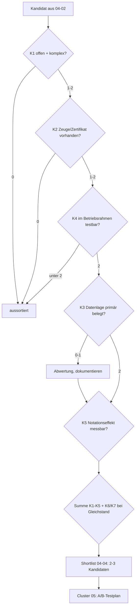

# Wahlkriterien für das Testfeld

Diese Datei legt fest, nach welchen Kriterien der Kandidaten-Katalog (04-02) bewertet und die Empfehlung (04-04) begründet wird. Die Kriterien operationalisieren den Auftrag des Masterplans — „echt offen + komplex; zeugen-/rechenfähige Teilfragmente; Datenlage/Community; auf dieser Maschine testbar; Notationseffekt messbar" [Masterplan (lokale Quelle)](../../PLAN.md, accessed 2026-09-12) — so, dass jede Bewertung nachvollziehbar und wiederholbar ist. Die anschließende A/B-Untersuchung (Cluster 05) soll ihre Aufgaben-Sets auf diesen Kriterien aufbauen können.

## 1. Was das Testfeld leisten muss

Das Testfeld hat zwei Funktionen. Erstens liefert es **Aufgabenmaterial**: Fragmente offener Probleme, an denen sich Notationseffekte überhaupt zeigen können. Zweitens liefert es **Prüfanker**: Verfahren, die eine Modellantwort ohne Menschenurteil als richtig oder falsch klassifizieren. Beides zusammen bildet die Messkette des geplanten A/B-Protokolls, das Trefferquote, Tokens pro Aufgabe und Schritte bis zum Ergebnis vergleicht [Masterplan (lokale Quelle)](../../PLAN.md, accessed 2026-09-12).

*Eigene Analyse:* Der Testfeld-Wert eines Problems steigt nicht mit seiner Berühmtheit, sondern mit der Dichte maschinell prüfbarer Zwischenschritte pro Aufgabe. Ein berühmtes Problem ohne solche Zwischenschritte ist als Testfeld wertlos; ein unscheinbares mit vielen ist wertvoll. Deshalb steht K2 (Zeugen-/Rechenfähigkeit) im Zentrum, und K1 (Offenheit) ist Bedingung, nicht Ziel.

Die Prüfanker selbst folgen der lokalen Prüfer-Doktrin: Verdicts sind `CONFIRMED`, `REFUTED`, `UNVERIFIABLE`, und ein Verdict wird nur vergeben, wenn die Prüfung tatsächlich lief — „nie CONFIRMED ohne gelaufene Prüfung" [checks.py (lokale Quelle)](git:yesloop/bemyself-p7-halt:bemyself/checks.py, accessed 2026-09-12). Die Doktrin unterscheidet dabei Beleg, Beweis und Beweislast: Ein Zeuge stützt eine Behauptung, ersetzt sie aber nicht; ein `REFUTED` ruht auf einem geprüften Basissatz [Falsifizierbarkeit, Beleg und Beweislast (lokale Quelle)](../../../pruefer/wiki/01-theorie/falsifizierbarkeit.md, accessed 2026-09-12).

## 2. Die Kriterien im Einzelnen

### K1 — Echt offen und komplex

**Definition.** Das Problem ist ungelöst (kein begutachteter Beweis), und es ist nicht bloß eine Rechenübung: Es gibt dokumentierte Teilresultate, offene Sub-Strukturen und eine als hart beschriebene Kernfrage.

**Operationalisierung.**
- Die offizielle Projekt- oder Survey-Seite dokumentiert den offenen Status (z. B. offene Problemlisten).
- Es existieren veröffentlichte Schranken oder Teilresultate mit Datum — die Bewertung notiert den jüngsten belegten Stand.
- Mindestens eine Primärquelle beschreibt die Härte strukturell (nicht nur als Anekdote).

**Beispiele und Belege.** Für BB(6) dokumentiert die Community-Wiki-Seite, dass zur Lösung ein Collatz-artiges Problem (der Cryptid Antihydra) gelöst werden muss [BB(6) – BusyBeaverWiki](https://wiki.bbchallenge.org/wiki/BB(6), accessed 2026-09-12). Die Erdős-Datenbank führt 1220 Probleme, von denen 586 (48 %) gelöst sind — die Mischung aus offenen und gelösten Einträgen macht die Restmenge als Testfeld sichtbar [Erdős Problems](https://www.erdosproblems.com/, accessed 2026-09-12). Die Collatz-Vermutung ist offen; „fast alle Orbits erreichen fast beschränkte Werte" ist bewiesen, die Konvergenz aller Zahlen ist es nicht [Almost all orbits of the Collatz map attain almost bounded values](https://arxiv.org/abs/1909.03562, accessed 2026-09-12).

**Grenze.** „Offen" gilt für das Gesamtproblem. Für das Testfeld zählen die *Teilfragmente*; ein gelöstes Teilfragment (z. B. ein Haltebeweis für eine einzelne Maschine) wird als Aufgabe verwendet, nicht als Widerspruch zu K1.

### K2 — Zeugen- und rechenfähige Teilfragmente

**Definition.** Es existieren Zwischenschritte, die maschinell geprüft werden können — entweder als **Zeuge** (endliches Objekt, das eine Existenzaussage belegt: Halte-Trace, Primzahlpartition, Färbung, Lösungstripel, SAT-Belegung) oder als **Zertifikat** (endliches Objekt, das eine Nicht-Existenz- oder Strukturaussage stützt: Decider-Zertifikat, DRAT/LRAT-Beweis, Kernel-Term).

**Operationalisierung.** Für jedes infrage kommende Fragment existiert mindestens einer dieser Prüfpfade, nachgewiesen durch Projekt-Dokumentation oder Repository:
1. **Deterministische Simulation** — dieselbe Ausführung reproduziert das Ergebnis (z. B. Turingmaschinen-Läufe).
2. **Zertifikatsprüfer** — ein unabhängiger Prüfer akzeptiert oder verwirft das Zertifikat (DRAT-trim, cake_lpr).
3. **Kernel-Check** — ein Beweisassistent prüft den vollständigen Beweis (Coq/Rocq, Lean).

**Beispiele und Belege.** bbchallenge definiert Decider als Programme, die automatisch über Halten entscheiden, und verlangt für jeden Decider Korrektheitsbeweis, Tests an Beispielen und Gegenbeispielen [Method – bbchallenge](https://bbchallenge.org/method, accessed 2026-09-12). Das Muster „untrusted Rechner + verifizierter Prüfer" realisiert busycoq: Ein Rust-Decider erzeugt Zertifikate, ein in Coq bewiesener Verifier akzeptiert sie [busycoq](https://github.com/meithecatte/busycoq, accessed 2026-09-12). Für SAT/UNSAT existieren der Referenzprüfer drat-trim [drat-trim](https://github.com/marijnheule/drat-trim, accessed 2026-09-12) und der mit dem verifizierten CakeML-Compiler gebaute LPR-Prüfer cake_lpr [cake_lpr](https://github.com/tanyongkiam/cake_lpr, accessed 2026-09-12). Die lokale Infrastruktur bringt für Turingmaschinen der bbchallenge-Notation bereits einen eigenen Simulator mit: `bemyself/turing.py` parst und läuft Maschinen in-prozess, ohne Netz oder Subprozess [turing.py (lokale Quelle)](git:yesloop/bemyself-p7-halt:bemyself/turing.py, accessed 2026-09-12).

**Asymmetrie (Popper).** Widerlegen ist leichter als bestätigen: Ein `[HALT: M -> n]`-Claim ist in Millisekunden per Simulation prüfbar; ein Nicht-Halte-Claim braucht ein Zertifikat oder einen formalen Beweis [halt.py (lokale Quelle)](git:yesloop/bemyself-p7-halt:bemyself/claimtypes/halt.py, accessed 2026-09-12). Dasselbe Prinzip formuliert die Prüfer-Doktrin: Ein Widerlegungsbefund ruht auf einem Basissatz, ein Bestätigungsbefund ist immer nur Bewährung [Falsifizierbarkeit (lokale Quelle)](../../../pruefer/wiki/01-theorie/falsifizierbarkeit.md, accessed 2026-09-12). Ein Testfeld muss beide Richtungen enthalten, sonst misst der A/B-Test nur die leichte Hälfte.

**Gate.** K2 ≥ 1 ist Pflicht für die Shortlist; ohne Prüfpfad gibt es keine Notations-Messung, nur Meinungen.

### K3 — Datenlage, Community, Tooling

**Definition.** Die für Aufgaben und Referenzwerte nötigen Daten sind öffentlich, abrufbar und belegt; Werkzeuge sind verfügbar; eine aktive Community pflegt und prüft den Stand.

**Operationalisierung.**
- Öffentliche Datensätze oder APIs mit dokumentiertem Format (Seed-Datenbank, Maschinen-API, OEIS b-files, Repositories).
- Primärquellen (Wiki, Paper, Projektseiten) statt nur Sekundärberichte; Aktualisierungsfrequenz dokumentiert.
- Aktive Community 2024–2026 (Forum, Discord, Blog, Review-Prozesse).

**Beispiele und Belege.** bbchallenge stellt die entschiedenen 5-Zustands-Maschinen als Seed-Datenbank (88.664.064 unentschiedene Maschinen, 30 Byte pro Datensatz) und eine JSON-API bereit; die Methodenseite dokumentiert Format und Reproduzierbarkeit [Method – bbchallenge](https://bbchallenge.org/method, accessed 2026-09-12). OEIS liefert zu jeder Folge JSON und b-files mit Tausenden Termen [JSON Format – OEIS](https://oeis.org/wiki/JSON_Format, accessed 2026-09-12). Für die Erdős-Probleme existiert eine gepflegte Datenbank mit Forum und öffentlichem Repository [Erdős Problems](https://www.erdosproblems.com/, accessed 2026-09-12) [teorth/erdosproblems](https://github.com/teorth/erdosproblems, accessed 2026-09-12). Hadwiger–Nelson wird seit 2018 im Polymath16-Projekt mit offenen Blog-Threads und verlinkten Graphdaten betrieben [Polymath16](https://dustingmixon.wordpress.com/2018/04/14/polymath16-first-thread-simplifying-de-greys-graph/, accessed 2026-09-12).

**Risiko-Indikator.** Hohe Aktualisierungsfrequenz ist Chance und Risiko: BB(6)-Zahlen ändern sich laut Community-Wiki im Wochenrhythmus — Zitate brauchen dann Datum *und* Versionsstand [BB(6) – BusyBeaverWiki](https://wiki.bbchallenge.org/wiki/BB(6), accessed 2026-09-12).

### K4 — Testbar auf dieser Maschine

**Definition.** Aufgabe und Prüfung laufen im Betriebsrahmen dieser Instanz: Kontext 1.000.000 Tokens, Output 8.192 Tokens pro Antwort (Flash; für die Pro-Variante 65.536), Proxy-Routing — dokumentiert im Masterplan [Masterplan (lokale Quelle)](../../PLAN.md, accessed 2026-09-12).

**Operationalisierung.**
- **(i) Antwortbudget:** Der prüfbare Kern der Antwort (Zeuge, Kodierung, Verdikt) passt in das Output-Budget. Große Zertifikate scheiden als *Antwort* aus; sie bleiben als Referenzmaterial zulässig.
- **(ii) Kontextbudget:** Aufgabenmaterial und ggf. nötige Reflexionskette passen in 1M Tokens; große Rohdatensätze (Multi-GB) kommen nur gefiltert zum Einsatz.
- **(iii) Prüfbarkeit lokal:** Der Prüfer läuft mit Python-Standardbibliothek oder kleinen Abhängigkeiten ohne GPU/Browser; externe Dienste nur optional.
- **(iv) Determinismus:** Gleiche Antwort → gleiche Bewertung (Simulation, Satzprüfung), keine Ermessensspielräume.

**Konsequenzen.** Die terabytegroßen SAT-Zertifikate prominenter Beweise (200 TB DRAT für die Pythagoreischen Tripel; 2 PB für Schur Fünf) sind als Kontexte *nicht* transportierbar — als Aufgabenform bleibt die Kodierung und das Verdikt [Solving and Verifying the boolean Pythagorean Triples problem](https://arxiv.org/abs/1605.00723, accessed 2026-09-12) [Schur Number Five](https://arxiv.org/abs/1711.08076, accessed 2026-09-12). Umgekehrt passt ein Halte-Trace über Tausende Schritte problemlos, weil die Notation selbst kompakt ist (z. B. `1RB1LC_…` plus Run-Length-Kodierung).

### K5 — Notationseffekt messbar

**Definition.** Es existieren Aufgaben, deren Schwierigkeit so beschaffen ist, dass die *Schreibweise* die Zielgröße beeinflussen kann: Trefferquote, Tokens pro Aufgabe, Schritte bis zum Ergebnis.

**Operationalisierung.**
- Die Aufgabe erzeugt **Symbolstrukturen** (Traces, Regeln, Färbungen, Tripel), nicht nur Ein-Zahl-Antworten; sonst gibt es nichts, worauf Notation wirken könnte.
- Es gibt mindestens **zwei vergleichbare Encodings** derselben Aufgabe — die Bedingung für ein A/B-Design mit Notation als einzigem Faktor.
- Die Metrik ist **automatisch messbar** (Verifier-Verdikt, Token-Zählung, Schritt-Zähler).

**Bezug.** Die Wirkmechanismen (Tokenizer-Effekte auf Arithmetik, Format-Sensitivität, Kontext-Distanz) sind Gegenstand von Cluster 02; K5 verlangt nur, dass das Testfeld diese Mechanismen überhaupt ansprechen kann [Masterplan (lokale Quelle)](../../PLAN.md, accessed 2026-09-12). *Eigene Analyse:* Die stärksten Kandidaten dafür sind Aufgaben, in denen eine **lange deterministische Kette** kompakt notiert und schrittweise verfolgt werden muss — Turingmaschinen-Läufe, Collatz-artige Iterationen, Trajektorien — weil dort jede Notationseinsparung pro Schritt proportional zur Aufgabengröße wirkt.

### K6 — Abstufbarkeit (Ergänzung)

**Definition.** Das Fragment lässt sich in Schwierigkeitsgrade mit monotonem Prüfaufwand zerlegen — von Sekunden-Zeugen bis zu Tagen an Beweissuche.

**Beleg.** Die BB(6)-Jagd liefert genau solche Stufen: alle Maschinen bis 10¹³ Schritte simuliert, Hunderte bei 10¹⁴/10¹⁵ offen, dazu Decider-Einsätze unterschiedlicher Stärke [BB(6) – BusyBeaverWiki](https://wiki.bbchallenge.org/wiki/BB(6), accessed 2026-09-12). Erdős-Probleme mischen einfach prüfbare Fälle und offene Kernfragen [Erdős Problems](https://www.erdosproblems.com/, accessed 2026-09-12). *Eigene Analyse:* Ohne Abstufung entstehen Boden- oder Deckeneffekte im A/B-Test: Zu leichte Aufgaben messen nur Formatierungskosten, zu schwere nur die Grundfähigkeit.

### K7 — Kontaminationsrisiko (Ergänzung, Bonus)

**Definition.** Ein Teil der Aufgabe stammt aus einem Bereich, dessen Antworten nicht im Trainingsmaterial des Modells stehen können — oder die Aufgabe ist lokal randomisiert und damit memorierungsresistent.

**Operationalisierung.** Entstehungsdatum der Fakten (Holdout-Listen mit Stand August 2026, Champion-Maschinen von 2025) gegen den Trainings-Cutoff des Zielmodells (siehe Cluster 01, geplante Datei `01-04-training-faehigkeiten.md`); alternativ lokal generierte Instanzen (z. B. zufällige Maschinen aus der Seed-Datenbank) [BB(6) – BusyBeaverWiki](https://wiki.bbchallenge.org/wiki/BB(6), accessed 2026-09-12) [Method – bbchallenge](https://bbchallenge.org/method, accessed 2026-09-12). *Eigene Analyse:* Dieses Kriterium ist ein Bonus, kein Gate — es schützt die Aussagekraft, ersetzt aber keine Prüfbarkeit.

## 3. Bewertungsschema und Gates

Jedes Kriterium wird mit 0 / 1 / 2 bewertet:

| Wert | Bedeutung |
|---|---|
| 0 | nicht erfüllt / nicht belegt |
| 1 | teilweise erfüllt (z. B. Prüfpfad nur für eine Richtung, Daten nur sekundär belegt) |
| 2 | voll erfüllt, primär belegt, mit Datum dokumentiert |

**Gates (harte Ausschlüsse für die Shortlist):** K2 ≥ 1 (mindestens ein Prüfpfad) und K4 = 2 (im Betriebsrahmen testbar). K1 = 0 schließt ebenfalls aus (kein offenes Problem). Die Punktsumme der Kernkriterien K1–K5 (max. 10) ordnet die Shortlist; K6 und K7 entscheiden bei Gleichstand.

*Abbildung 1: Gate-Fluss der Kandidatenbewertung (eigene Darstellung; Grundlage: Kriterien K1–K7 dieser Datei).*

## 4. Ausschlusskriterien

Ein Kandidat oder Fragment wird ausgeschlossen, wenn eines der Folgenden zutrifft:

1. **Kein maschineller Prüfpfad** — die Antwort ist nur durch menschliches Urteil bewertbar. Ausnahme: Die Aussage ist in einem Beweisassistenten formalisiert; dann existiert der Kernel-Prüfpfad [formal-conjectures](https://github.com/google-deepmind/formal-conjectures, accessed 2026-09-12).
2. **Prüfung nur mit nicht-lokalen Ressourcen** — Pflicht-Prüfschritte, die auf dieser Maschine nicht laufen können (GPU-Cluster, Terabyte-Speicher), es sei denn, der prüfbare Kern ist auch isoliert prüfbar.
3. **Geschlossene Daten** — Antworten oder Referenzwerte hinter Paywall/NDA ohne offene Verifikationskopie.
4. **Budgetbruch** — jede vernünftige Aufgabenbeantwortung überschreitet das Output-Budget, selbst in kompaktester Notation, *und* die Aufgabe lässt sich nicht in budgetkonforme Teilaufgaben zerlegen.

## 5. Anwendung und Übergabe

04-04 wendet dieses Schema auf den Katalog aus 04-02 an, dokumentiert je Kandidat die Punktwerte mit Beleg und wählt 2–3 Kandidaten. Cluster 05 übernimmt diese Shortlist als Testfeld und entwirft auf dieser Basis 05-04 (Harness) und 05-05 (Ablationsprotokoll). Widersprüchliche Quellenstände werden dabei doppelt geführt, nicht geglättet — die Bewertung nennt dann beide Stände und wählt mit Begründung.

## Quellen

**Primärquellen (Web)**
1. The Busy Beaver Challenge — Startseite („0 machines to decide"). https://bbchallenge.org/ (accessed 2026-09-12)
2. Method – bbchallenge (Seed-Datenbank, 30-Byte-Format, API, Decider-Definition). https://bbchallenge.org/method (accessed 2026-09-12)
3. BB(6) – BusyBeaverWiki (Champion, Holdouts, Cryptids). https://wiki.bbchallenge.org/wiki/BB(6) (accessed 2026-09-12)
4. Erdős Problems (Datenbankstand 1220/586). https://www.erdosproblems.com/ (accessed 2026-09-12)
5. teorth/erdosproblems (Repository). https://github.com/teorth/erdosproblems (accessed 2026-09-12)
6. Almost all orbits of the Collatz map attain almost bounded values (arXiv:1909.03562). https://arxiv.org/abs/1909.03562 (accessed 2026-09-12)
7. busycoq (verifizierte Decider-Zertifikate). https://github.com/meithecatte/busycoq (accessed 2026-09-12)
8. drat-trim (DRAT-Prüfer). https://github.com/marijnheule/drat-trim (accessed 2026-09-12)
9. cake_lpr (verifizierter LPR/LRAT-Prüfer). https://github.com/tanyongkiam/cake_lpr (accessed 2026-09-12)
10. Solving and Verifying the boolean Pythagorean Triples problem (arXiv:1605.00723). https://arxiv.org/abs/1605.00723 (accessed 2026-09-12)
11. Schur Number Five (arXiv:1711.08076). https://arxiv.org/abs/1711.08076 (accessed 2026-09-12)
12. JSON Format – OEIS. https://oeis.org/wiki/JSON_Format (accessed 2026-09-12)
13. Polymath16 – first thread (D. Mixon). https://dustingmixon.wordpress.com/2018/04/14/polymath16-first-thread-simplifying-de-greys-graph/ (accessed 2026-09-12)
14. formal-conjectures (Google DeepMind). https://github.com/google-deepmind/formal-conjectures (accessed 2026-09-12)

**Lokale Quellen**
15. Masterplan (deepseek-math-notation, Ausgabe- und Betriebsrahmen). `yesdocs/deepseek-math-notation/PLAN.md` (accessed 2026-09-12)
16. Falsifizierbarkeit, Beleg und Beweislast (Prüfer-Wiki). `yesdocs/pruefer/wiki/01-theorie/falsifizierbarkeit.md` (accessed 2026-09-12)
17. checks.py — Prüfer-Dispatcher. Branch `yesloop/bemyself-p7-halt` (= lokaler `master`, Merge 4fd2b30): `bemyself/checks.py` (accessed 2026-09-12)
18. turing.py — Turingmaschinen-Simulator. Ebd.: `bemyself/turing.py` (accessed 2026-09-12)
19. halt.py — `[HALT]`/`[SCORE]`-Claim-Typ. Ebd.: `bemyself/claimtypes/halt.py` (accessed 2026-09-12)
