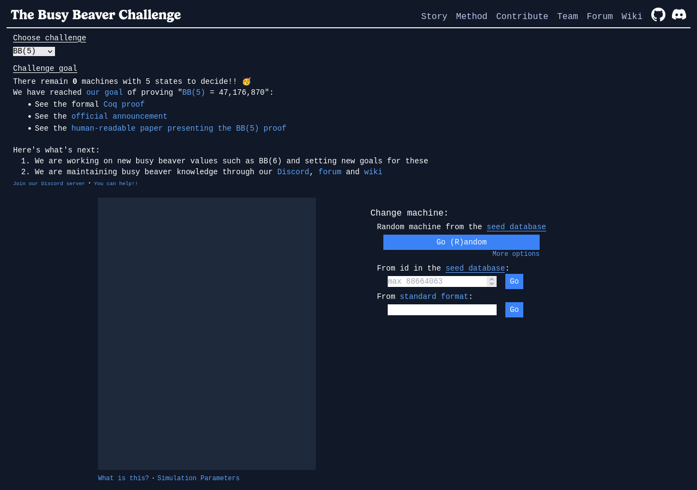
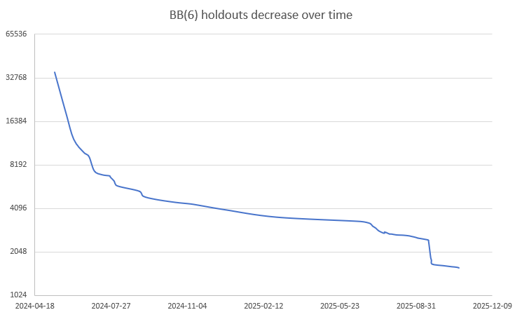
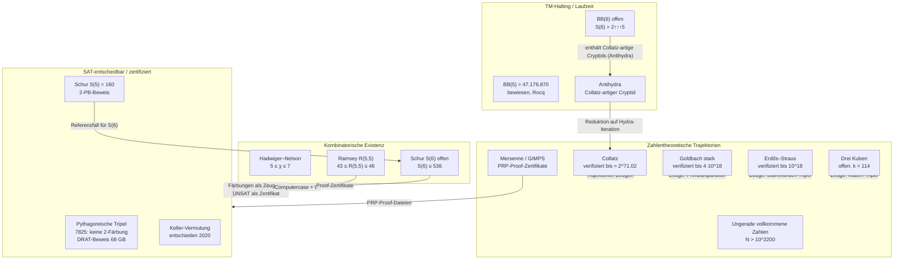

# Kandidaten-Katalog offener mathematischer Probleme

Dieser Katalog sammelt komplexe, offene mathematische Probleme, die als Testfeld für eine modell-nahe Notation dienen können. Auswahlmaßstab sind die Kriterien aus dem Wahlkriterien-Kapitel: Das Problem ist echt offen, es besitzt maschinell prüfbare Teilfragmente (Zeugen, Zertifikate, Verifikationsgrenzen), es gibt eine aktive Community mit veröffentlichten Daten, und der Fortschritt ist innerhalb des Betriebsrahmens dieser Maschine (großer Kontext, 8.192 Output-Tokens pro Antwort) darstellbar. Jeder Eintrag nennt Status, Teilresultate, prüfbare Fragmente und Quellenlage-Risiko. Alle Quellen wurden am 2026-09-12 abgerufen; zentrale Zahlen stammen aus Primärquellen.

## Busy Beaver: BB(5) und BB(6)

**Status.** BB(5) = 47.176.870 ist bewiesen: Nachdem Marxen und Buntrock 1989 eine Maschine mit dieser Laufzeit gefunden hatten, erbrachte die kollaborative bbchallenge 2024 den vollständigen Beweis — die Projektseite meldet null offene BB(5)-Maschinen [The Busy Beaver Challenge](https://bbchallenge.org/, accessed 2026-09-12), die offizielle Ankündigung datiert auf den 2. Juli 2024 [July 2nd 2024: We have proved BB(5) = 47,176,870](https://discuss.bbchallenge.org/t/july-2nd-2024-we-have-proved-bb-5-47-176-870/237, accessed 2026-09-12). Der Beitragende mxdys veröffentlichte den Rocq-verifizierten Beweis [Coq-BB5](https://github.com/ccz181078/Coq-BB5, accessed 2026-09-12); die Zusammenfassung erschien als Paper [BB(5) – BusyBeaverWiki](https://wiki.bbchallenge.org/wiki/BB(5), accessed 2026-09-12) [Determination of the fifth Busy Beaver value](https://arxiv.org/abs/2509.12337, accessed 2026-09-12). BB(6) ist offen: Der aktuelle Champion, am 25. Juni 2025 von mxdys entdeckt, etabliert die untere Schranke S(6) > Σ(6) > 2↑↑↑5 [BB(6) – BusyBeaverWiki](https://wiki.bbchallenge.org/wiki/BB(6), accessed 2026-09-12) [1RB1RA_1RC1RZ_1LD0RF_1RA0LE_0LD1RC_1RA0RE – BusyBeaverWiki](https://wiki.bbchallenge.org/wiki/1RB1RA_1RC1RZ_1LD0RF_1RA0LE_0LD1RC_1RA0RE, accessed 2026-09-12). Der frühere Rekordwert 10↑↑15 (Juni 2022) ist überholt [BB(6, 2) > 10↑↑15 – S. Ligocki](https://www.sligocki.com/2022/06/21/bb-6-2-t15.html, accessed 2026-09-12).

**Teilresultate.** Der BB(5)-Beweis zerlegt rund 100 Millionen Maschinen in Decider-Klassen; 13 sporadische Maschinen erhielten Einzelbeweise [BB(5) – BusyBeaverWiki](https://wiki.bbchallenge.org/wiki/BB(5), accessed 2026-09-12). Für BB(6) sind Stand August 2026 noch 1003 Holdouts bis auf Äquivalenz offen (2190 ohne Äquivalenz); alle Maschinen wurden bis 10¹³ Schritte simuliert [BB(6) – BusyBeaverWiki](https://wiki.bbchallenge.org/wiki/BB(6), accessed 2026-09-12). Der wichtigste Teilfall ist Antihydra (entdeckt 28. Juni 2024): Ihr Halteproblem ist äquivalent zu der Frage, ob die wiederholte Hydra-Funktion irgendwann mehr ungerade als doppelt so viele gerade Werte erzeugt; eine probabilistische Analyse schätzt die Haltewahrscheinlichkeit auf unter 2,9 × 10⁻²⁸⁷²³⁰⁴²⁵⁶⁵ [Antihydra – BusyBeaverWiki](https://wiki.bbchallenge.org/wiki/Antihydra, accessed 2026-09-12) [BB(6) is Hard (Antihydra)](https://www.sligocki.com/2024/07/06/bb-6-2-is-hard.html, accessed 2026-09-12). Solche Collatz-artigen Maschinen heißen in der Community Cryptids [Cryptids – BusyBeaverWiki](https://wiki.bbchallenge.org/wiki/Cryptids, accessed 2026-09-12).

**Prüfbare Fragmente.** Für haltende Maschinen existiert ein trivialer Zeuge: die Schrittfolge bis zum Halt, reproduzierbar durch Simulation. Für nicht haltende Maschinen sind Decider-Protokolle oder formale Beweise (Coq-BB5) der Prüfanker; für Antihydra liegt eine Lean-Formalisierung der Regeln vor [Antihydra – BusyBeaverWiki](https://wiki.bbchallenge.org/wiki/Antihydra, accessed 2026-09-12). Die Iterationsfolgen selbst sind in OEIS gelistet [Hydra function values (A386792), OEIS](https://oeis.org/A386792, accessed 2026-09-12).

**Quellenlage-Risiko.** Zahlreiche Angaben leben in Discord, Spreadsheets und Foren und ändern sich wöchentlich; die Schranke 2↑↑↑5 und die genauere Schätzung Σ ≈ 10↑↑10↑↑10↑↑8.10237 (Oktober 2025) stehen nebeneinander [1RB1RA_1RC1RZ_1LD0RF_1RA0LE_0LD1RC_1RA0RE – BusyBeaverWiki](https://wiki.bbchallenge.org/wiki/1RB1RA_1RC1RZ_1LD0RF_1RA0LE_0LD1RC_1RA0RE, accessed 2026-09-12).

*Abbildung 1: bbchallenge-Dashboard: „There remain 0 machines with 5 states to decide" und Zugang zur Seed-Datenbank (Quelle: [bbchallenge.org](https://bbchallenge.org/, accessed 2026-09-12); Screenshot vom 2026-09-12).*

*Abbildung 2: Rückgang der offenen BB(6)-Maschinen über die Zeit (Quelle: [BB(6) – BusyBeaverWiki](https://wiki.bbchallenge.org/wiki/BB(6), accessed 2026-09-12); Bild von der Wiki-Seite, abgerufen 2026-09-12).*

## Collatz-Vermutung

**Status.** Die Vermutung ist offen; bewiesen ist nur, dass fast alle Orbits fast beschränkte Werte erreichen (fast alle im Sinne logarithmischer Dichte) [Almost all orbits of the Collatz map attain almost bounded values](https://arxiv.org/abs/1909.03562, accessed 2026-09-12). Die exhaustive Verifikation reicht aktuell bis unter 2075 × 2⁶⁰ ≈ 2^71,02; die Projektchronik nennt 2⁶⁸ (2020), 2⁶⁹ (2021), 2⁷⁰ (2023) und 2⁷¹ (15. Januar 2025) [Convergence verification of the Collatz problem – David Barina](https://pcbarina.fit.vutbr.cz/, accessed 2026-09-12).

**Teilresultate.** Die Verifikationen sind publiziert [Convergence verification of the Collatz problem](https://doi.org/10.1007/s11227-020-03368-x, accessed 2026-09-12) [Improved verification limit for the convergence of the Collatz conjecture](https://doi.org/10.1007/s11227-025-07337-0, accessed 2026-09-12); das Projekt arbeitet an der Strecke bis 2⁷⁶ (aktuell rund 17,2 % der Arbeitseinheiten) [Convergence verification of the Collatz problem – David Barina](https://pcbarina.fit.vutbr.cz/, accessed 2026-09-12). Ein Algorithmus von Februar 2026 macht die Verdopplung des Bereichs weniger als doppelt so teuer; als Ziele nennt er 2⁷² (GPU) und 2⁷⁵, eine abgeschlossene Verifikation oberhalb 2⁷¹ ist nicht berichtet [An improved algorithm for checking the Collatz conjecture for all n < 2^N](https://arxiv.org/abs/2602.10466, accessed 2026-09-12).

**Prüfbare Fragmente.** Für jedes einzelne n ist die Konvergenz durch die endliche Trajektorie bis 1 bezeugbar; die Massenverifikation behauptet „alle n < 2^k“, wofür nur Rechenprotokolle (Zähler, Intervalle) existieren. Path-Record-Tabellen sind publiziert [Convergence verification of the Collatz problem – David Barina](https://pcbarina.fit.vutbr.cz/, accessed 2026-09-12).

**Quellenlage-Risiko.** Die Projektseite nennt die neueste Verifikation 2⁷¹, das Paper von 2020 dagegen 2⁶⁸ als damaligen Stand — beide Angaben sind korrekt datiert, dürfen aber nicht vermischt werden. Die „fast alle“-Aussage betrifft logarithmische Dichte und ist kein Beweis der Vermutung.

## Goldbach-Vermutung (stark)

**Status.** Die starke Goldbach-Vermutung (jede gerade Zahl > 2 ist Summe zweier Primzahlen) ist offen. Die weltweite Verifikation reicht bis 4 × 10¹⁸ (erreicht am 4. April 2012); doppelt geprüft sind die Intervalle bis 4 × 10¹⁷ [Goldbach conjecture verification – Oliveira e Silva](http://sweet.ua.pt/tos/goldbach.html, accessed 2026-09-12).

**Teilresultate.** Die Verifikation ist als Mathematik-of-Computation-Arbeit publiziert [Empirical verification of the even Goldbach conjecture and computation of prime gaps up to 4·10¹⁸](https://doi.org/10.1090/S0025-5718-2013-02787-1, accessed 2026-09-12). Die schwache (ternäre) Vermutung ist dagegen bewiesen: Jede ungerade Zahl > 5 ist Summe dreier Primzahlen [The ternary Goldbach problem](https://arxiv.org/abs/1501.05438, accessed 2026-09-12). Chen zeigte 1973, dass jede hinreichend große gerade Zahl Summe einer Primzahl und eines Produkts aus höchstens zwei Primzahlen ist [The ternary Goldbach problem](https://arxiv.org/abs/1501.05438, accessed 2026-09-12).

**Prüfbare Fragmente.** Für eine konkrete gerade Zahl ist eine Partition n = p + q ein in Sekunden prüfbarer Zeuge (beide Primzahlen). Die „Top 50“ der kleinsten je verwendeten Primzahlen und die minimalen Partitionen S(p) sind tabelliert und nachrechenbar [Goldbach conjecture verification – Oliveira e Silva](http://sweet.ua.pt/tos/goldbach.html, accessed 2026-09-12).

**Quellenlage-Risiko.** Die Projektseite wurde seit 2013 kaum aktualisiert; ein neuerer Verifikationsrekord als 4 × 10¹⁸ ließ sich nicht belegen. Einzelne Intervalle waren Stand 2013 nur einfach geprüft; die Unterscheidung geht in Zitaten häufig verloren.

## Erdős-Probleme (erdosproblems.com)

**Status.** Die Datenbank umfasst 1220 Probleme, von denen 586 (48 %) gelöst sind (Stand 2026-09-12) [Erdős Problems](https://erdosproblems.com/, accessed 2026-09-12). Sie wird von Thomas Bloom gepflegt; ein Open-to-Solved-Log verzeichnet Statuswechsel tagesgenau [Erdős Problems](https://erdosproblems.com/, accessed 2026-09-12).

**Teilresultate mit KI-Beteiligung.** Dokumentiert sind mindestens zwei Fälle mit LLM/IA-Beteiligung im Januar 2026: Problem #728 (Fakultäten-Teilerfrage) gilt als „PROVED (LEAN)“; Barreto und ChatGPT-5.2 bewiesen eine Variante (b = n/2, a = n/2 + O(log n), C₁ log n < a + b − n < C₂ log n), wobei AlphaProof triviale Lösungen der Originalformulierung anmerkte [Erdős Problem #728](https://erdosproblems.com/728, accessed 2026-09-12). Problem #871 (Zerlegung additiver Basen) gilt als „DISPROVED (LEAN)“; der Gegenbeweis stammt von Larsen unter Verwendung von Claude Opus 4.5 [Erdős Problem #871](https://erdosproblems.com/871, accessed 2026-09-12). Den Ablauf (inklusive der Problemnummern #481, #43, #333, #729, #401 und #205 sowie des Autoformalisierers Aristotle) beschreibt der Blogbericht „Problem 728 and the use of AI on Erdős problems“ [Problem 728 and the use of AI on Erdős problems](https://erdosproblems.com/forum/thread/blog:2, accessed 2026-09-12). Das Forum verlangt Offenlegung von KI-Hilfe, unabhängige menschliche Prüfung und für KI-Beweise möglichst eine fehlerfreie Lean-Formalisierung [Forum – Erdős Problems](https://erdosproblems.com/forum, accessed 2026-09-12).

**Prüfbare Fragmente.** Zu #728 und #871 existieren formalisierte Aussagen im Repository formal-conjectures [FormalConjectures/ErdosProblems/728.lean](https://github.com/google-deepmind/formal-conjectures/blob/main/FormalConjectures/ErdosProblems/728.lean, accessed 2026-09-12); die Datenbank selbst liegt als öffentliches Repository vor [teorth/erdosproblems](https://github.com/teorth/erdosproblems, accessed 2026-09-12).

**Quellenlage-Risiko.** Die Statusangaben sind kuratiert, nicht begutachtet; der Blogbericht ist Selbstauskunft. Ob die Ergebnisse in Fachzeitschriften erscheinen, ist offen — die Formulierungen sollten „informell/Lean-verifiziert“ heißen, nicht „publiziert“.

## Hadwiger–Nelson-Problem

**Status.** Die chromatische Zahl der Ebene liegt zwischen 5 und 7. Die untere Schranke 5 geht auf de Grey (2018) zurück, der eine Familie endlicher Unit-Distance-Graphen ohne 4-Färbung angab; der kleinste damals gefundene Graph hat 1581 Ecken [The chromatic number of the plane is at least 5](https://arxiv.org/abs/1804.02385, accessed 2026-09-12). Die obere Schranke 7 ist klassisch; Standardübersichten formulieren den Stand als „5, 6 oder 7“ [The chromatic number of the Minkowski plane – the regular polygon case](https://arxiv.org/abs/2108.12861, accessed 2026-09-12). Ein 6-chromatischer Unit-Distance-Graph wurde bis heute nicht veröffentlicht; die jüngsten Arbeiten konstruieren 5-chromatische Graphen, darunter einen Moser-Spindle-freien Graphen mit 2131 Ecken [A Moser-spindle-free 5-chromatic unit distance graph on 2131 vertices in the plane](https://arxiv.org/abs/2608.04542, accessed 2026-09-12).

**Teilresultate.** Neuronale Verfahren (differenzierbares Coloring) fanden 2025 zwei neue Sechs-Färbungen der Ebene für die off-diagonale Variante — laut Autoren die erste Verbesserung seit dreißig Jahren [Neural Discovery in Mathematics: Do Machines Dream of Colored Planes?](https://arxiv.org/abs/2501.18527, accessed 2026-09-12).

**Prüfbare Fragmente.** Ein endlicher Unit-Distance-Graph ist ein kompakter Zeuge: Eckenliste plus Einheitsabstands-Kanten; die Nicht-4-Färbbarkeit ist per SAT (UNSAT-Zertifikat) oder Fallanalyse prüfbar. Der Satz von de Bruijn–Erdős erlaubt die Reduktion der unendlichen Ebene auf endliche Graphen [A New Class of Geometrically Defined Hypergraphs Arising from the Hadwiger Nelson Problem](https://arxiv.org/abs/2411.05931, accessed 2026-09-12).

**Quellenlage-Risiko.** Die Frage „gibt es einen 6-chromatischen Graphen?“ wird in populären Darstellungen mitunter als gelöst kolportiert; die Primärliteratur bis September 2026 zeigt keinen solchen Fund. Die 2026er Arbeiten betreffen 5-chromatische Konstruktionen, nicht 6.

## Ramsey-Zahlen R(5,5) und R(4,6)

**Status.** Für R(5,5) gilt 43 ≤ R(5,5) ≤ 46 [Small Ramsey Numbers (dynamic survey DS1.18)](https://www.combinatorics.org/ojs/index.php/eljc/article/view/DS1, accessed 2026-09-12). Die untere Schranke 43 stammt von Exoo (1989) und wurde 2022/2023 unabhängig nachvollzogen [Study of Exoo's Lower Bound for Ramsey number R(5,5)](https://arxiv.org/abs/2212.12630, accessed 2026-09-12). Die obere Schranke 46 bewiesen Angeltveit und McKay mit Linearer Programmierung plus Computer-Fallprüfung; die Arbeit erschien 2026 im Journal of Graph Theory [R(5,5) ≤ 46](https://arxiv.org/abs/2409.15709, accessed 2026-09-12). Für R(4,6) gilt 36 ≤ R(4,6) ≤ 41; die untere Schranke 36 verbesserte Exoo 2012 von 35 [On the Ramsey Number R(4,6)](https://www.combinatorics.org/ojs/index.php/eljc/article/view/v19i1p66, accessed 2026-09-12), die obere Schranke 41 nennt die Survey [Small Ramsey Numbers (dynamic survey DS1.18)](https://www.combinatorics.org/ojs/index.php/eljc/article/view/DS1, accessed 2026-09-12).

**Teilresultate.** Die Survey dokumentiert weitere Verbesserungen, etwa R(6,6) ≤ 160 (2023) [Small Ramsey Numbers (dynamic survey DS1.18)](https://www.combinatorics.org/ojs/index.php/eljc/article/view/DS1, accessed 2026-09-12).

**Prüfbare Fragmente.** Untere Schranken sind explizite Kantenfärbungen von K₄₂ bzw. K₃₅ (nachprüfbar durch Clique-Zählung); obere Schranken beruhen auf Fallprüfungen, die laut Autoren unabhängig von beiden Autoren implementiert wurden [R(5,5) ≤ 46](https://arxiv.org/abs/2409.15709, accessed 2026-09-12).

**Quellenlage-Risiko.** Die Behauptung „R(5,5) = 43“ ist eine verbreitete Vermutung, kein Ergebnis; Sekundärquellen vermischen Vermutung und Schranken. Die Dynamic Survey wird regelmäßig neu versioniert (Revision #18: April 2026) — Zitate sollten die Versionsnummer nennen.

## Ungerade vollkommene Zahlen

**Status.** Ob eine ungerade vollkommene Zahl existiert, ist offen. Die stärksten dokumentierten Schranken: N > 10¹⁵⁰⁰ (inzwischen bis N > 10²²⁰⁰ vorangetrieben), Ω(N) ≥ 101 (inzwischen ≥ 115), größte Primzahlkomponente > 10⁶², Ω(N) ≥ 2ω(N) + 51, und für die Euler-Form m > 10¹⁰⁰⁰ (unpubliziert) [Odd perfect numbers – Pascal Ochem](https://www.lirmm.fr/~ochem/opn/, accessed 2026-09-12). Rechenbäume und Roadblock-Listen sind öffentlich (Komposit-Dateien: Februar 2025) [Odd perfect numbers – Pascal Ochem](https://www.lirmm.fr/~ochem/opn/, accessed 2026-09-12).

**Teilresultate.** Neuere Arbeiten verschärfen Teilstrukturen: Wenn alle geraden Exponenten der Primfaktorzerlegung bis auf einen gleich 2 sind, dann teilt 3²³⁰⁰⁰⁰⁰⁰⁰⁰⁰ die Zahl [On odd perfect numbers with exactly one even exponent greater than 2](https://arxiv.org/abs/2607.19746, accessed 2026-09-12).

**Prüfbare Fragmente.** Die Faktorisierungsketten (σ(p^q)-Zerlegungen, Roadblocks) sind deterministisch nachrechenbar; die Zertifikate der neuen Branch-Closure-Arbeit sind als überprüfbare Bundles mit Python-Verifier und SHA256-Hashes angelegt [Certified Minimal-Prime Branch Closures for Odd Perfect Numbers](https://arxiv.org/abs/2607.04365, accessed 2026-09-12). Ein einzelner Zeuge (eine ungerade vollkommene Zahl) würde alle Schranken über den Haufen werfen — das prüfbare Fragment ist hier die *Widerlegung von Kandidatenklassen*, nicht die Konstruktion.

**Quellenlage-Risiko.** Die über die Paper hinausgehenden Verbesserungen (10²²⁰⁰, Ω ≥ 115) sind auf der Projektseite als „since then pushed“ ohne Publikationsort geführt; das ist im Katalog als unveröffentlicht zu kennzeichnen. Die 2026er Branch-Closure-Arbeit ist neu und unbegutachtet.

## Erdős–Straus-Vermutung

**Status.** Die Vermutung (4/n ist für jedes n ≥ 2 Summe dreier Stammbrüche) ist offen; verifiziert sind alle n ≤ 10¹⁷ [The Erdős–Straus conjecture: new modular equations and checking up to N = 10¹⁷](https://arxiv.org/abs/1406.6307, accessed 2026-09-12), und eine Arbeit von 2025 verbessert die Schranke auf 10¹⁸ [Further verification and empirical evidence for the Erdős-Straus conjecture](https://arxiv.org/abs/2509.00128, accessed 2026-09-12). Es genügt, Primzahlen p zu behandeln; die Fälle p ≡ 3 mod 4 sind über polynomiale Identitäten erledigt, der offene Kern ist p ≡ 1 mod 4 [Further verification and empirical evidence for the Erdős-Straus conjecture](https://arxiv.org/abs/2509.00128, accessed 2026-09-12).

**Teilresultate.** Elsholtz und Tao zeigten asymptotische Schranken für die Lösungszählfunktion: Σ_{p ≤ N} f(p) liegt zwischen Größenordnung N log²N und N log²N log log N [Counting the number of solutions to the Erdos-Straus equation on unit fractions](https://arxiv.org/abs/1107.1010, accessed 2026-09-12).

**Prüfbare Fragmente.** Für ein konkretes n ist ein Tripel (x, y, z) mit 4/n = 1/x + 1/y + 1/z ein sofort prüfbarer Zeuge; die Verifikationsgrenze ist damit ein sauberes „Witness bis N“-Fragment. Die modularen Gleichungen reduzieren das Problem zusätzlich auf endliche Kongruenzklassen [The Erdős–Straus conjecture: new modular equations and checking up to N = 10¹⁷](https://arxiv.org/abs/1406.6307, accessed 2026-09-12).

**Quellenlage-Risiko.** Die 10¹⁷-Quelle ist ein Preprint von 2014, die 10¹⁸-Angabe ein Preprint von 2025. Für den Katalog zählen nur Verifikationsgrenzen und etablierte Strukturresultate; ein Teil der neueren arXiv-Literatur zu diesem Problem ist von niedriger Qualität.

## Summe dreier Kuben

**Status.** Es ist offen, ob jede Zahl k ≠ ±4 mod 9 als Summe dreier ganzzahliger Kuben darstellbar ist. Alle k ≤ 100 sind gelöst (33 durch Booker 2019 [Cracking the problem with 33](https://arxiv.org/abs/1903.04284, accessed 2026-09-12); 42 durch Booker–Sutherland mit Charity Engine [On a question of Mordell](https://arxiv.org/abs/2007.01209, accessed 2026-09-12)). Nach der Publikation von 2021 verblieben unter den elf ursprünglich offenen k ≤ 1000 (42, 114, 165, 390, 579, 627, 633, 732, 906, 921, 975) nach eigener Aussage noch acht ungelöst („eight k ≤ 1000 that remain unresolved“) [On a question of Mordell](https://arxiv.org/abs/2007.01209, accessed 2026-09-12). Davon abweichend listen Sekundärquellen (etwa die Wikipedia-Orientierungsseite) nur sieben verbleibende Fälle (114, 390, 627, 633, 732, 921, 975); die Abweichung betrifft k = 579 und ließ sich nicht über eine Primärquelle auflösen. Kleinster offener Fall ist in beiden Lesarten k = 114.

**Teilresultate.** Für k = 42 lautet die gefundene Darstellung 42 = (−80.538.738.812.075.974)³ + 80.435.758.145.817.515³ + 12.602.123.297.335.631³; die Suche schloss für die elf Kandidaten Lösungen mit min{|x|, |y|, |z|} ≤ 10¹⁷ aus [On a question of Mordell](https://arxiv.org/abs/2007.01209, accessed 2026-09-12). Wegen möglicher Hardwarefehler im Crowd-Computing machen die Autoren keine „unconditional claims“ zur Vollständigkeit [On a question of Mordell](https://arxiv.org/abs/2007.01209, accessed 2026-09-12).

**Prüfbare Fragmente.** Ein Lösungstripel ist der beste Zeugentyp: Eine Multiplikation bestätigt die Gleichung. Die Nichtexistenz-Aussagen sind dagegen nur über Rechenprotokolle bezeugt. Der Suchcode ist offen [SumsOfThreeCubes (GitHub)](https://github.com/AndrewVSutherland/SumsOfThreeCubes, accessed 2026-09-12).

**Quellenlage-Risiko.** Der Unterschied zwischen „sieben“ und „acht“ offenen Fällen unter 1000 ist selbst ein Beleg für die Notwendigkeit, jede Zahl doppelt darzustellen. Ob k = 114 inzwischen gelöst ist, konnte nicht primärquellenbasiert geklärt werden.

## Mersenne-Primzahlen (GIMPS)

**Status.** Bekannt sind 52 Mersenne-Primzahlen; die größte, 2¹³⁶²⁷⁹⁸⁴¹ − 1 mit 41.024.320 Dezimalstellen, fand Luke Durant am 12. Oktober 2024 mit GPU-Software (Gpuowl, NVIDIA A100/H100); angekündigt wurde sie am 21. Oktober 2024 [2¹³⁶²⁷⁹⁸⁴¹−1 is the New Largest Known Prime Number – GIMPS](https://www.mersenne.org/, accessed 2026-09-12). Die Liste führt sie als „provisional ranking“: Nicht alle Kandidaten darunter sind ausgeschlossen [List of Known Mersenne Prime Numbers – PrimeNet](https://www.mersenne.org/primes/, accessed 2026-09-12). Alle Exponenten unter 83.195.767 sind verifiziert, unter 141.561.103 mindestens einmal getestet; M(82589933) wurde am 4. September 2026 endgültig als 51. Primzahl bestätigt [Great Internet Mersenne Prime Search – PrimeNet](https://www.mersenne.org/, accessed 2026-09-12).

**Teilresultate.** Seit Version 30.3 (2020) liefern die Ersttests PRP-Proof-Dateien, die eine Prüfung mit unter 0,5 % des Aufwands einer Wiederholung erlauben (Pietrzak-Proofs); Lucas-Lehmer-Wiederholungen bestätigen kritische Funde [Great Internet Mersenne Prime Search – PrimeNet](https://www.mersenne.org/, accessed 2026-09-12).

**Prüfbare Fragmente.** Der Primalitätsnachweis ist das Musterbeispiel eines zertifizierten Fragments: deterministische Wiederholung auf anderer Hardware und öffentliche Exponenten-Statusberichte [List of Known Mersenne Prime Numbers – PrimeNet](https://www.mersenne.org/primes/, accessed 2026-09-12).

**Quellenlage-Risiko.** Rangnummern sind vorläufig, bis der Bereich darunter vollständig durchgeprüft ist; Medien nennen die 52. Primzahl oft ohne diesen Vorbehalt.

## SAT-entscheidbare Klassiker: Pythagoreische Tripel, Keller, Schur

**Status.** Drei Beispiele für SAT-Zertifikate als Prüfanker. Das Boolean-Pythagorean-Triples-Problem wurde 2016 gelöst: Es gibt keine 2-Färbung von {1, …, 7825} ohne einfarbige Lösung; der DRAT-Beweis umfasst rund 200 TB, komprimiert 68 GB [Solving and Verifying the boolean Pythagorean Triples problem via Cube-and-Conquer](https://arxiv.org/abs/1605.00723, accessed 2026-09-12). Kellers Vermutung wurde 2020 vollständig entschieden: In Dimension 7 teilen stets zwei Einheitswürfel eine vollständige Seitenfläche (UNSAT für drei Graphen mit 2⁷-Cliquen, gezeigt per Symmetrie-brechendem SAT), Dimension 8 ist durch ein Gegenbeispiel widerlegt [The Resolution of Keller's Conjecture](https://arxiv.org/abs/1910.03740, accessed 2026-09-12). Die Schur-Zahl S(5) = 160 wurde 2018 bewiesen (2-PB-Beweis, formal verifizierter Checker); S(6) ist offen [Schur Number Five](https://arxiv.org/abs/1711.08076, accessed 2026-09-12).

**Teilresultate zum offenen Teil.** Für S(6) gilt die untere Schranke S(6) ≥ 536, für S(9) ≥ 17.803 und S(10) ≥ 60.948 [New lower bounds for Schur and weak Schur numbers](https://arxiv.org/abs/2112.03175, accessed 2026-09-12). Eine Juli-2026-Arbeit verbessert die Rekursion zu S(k+2) ≥ 10·S(k) + 2 und erhält damit S(8) ≥ 5.362 und S(13) ≥ 2.038.282; die Templates wurden nach Angabe der Autoren „in a conversation with ChatGPT 5.5 Pro“ gefunden [Shifted S-templates and improved lower bounds for Schur numbers](https://arxiv.org/abs/2607.15034, accessed 2026-09-12).

**Prüfbare Fragmente.** SAT-Unlösbarkeitsbeweise sind durch DRAT/LRAT-Proofs zertifiziert; untere Schranken sind explizite Färbungen von {1, …, n}. Schur-Zahlen sind damit sowohl in der offenen (Färbe-Zeuge) als auch in der entschiedenen Richtung (Proof-Zertifikat) direkt maschinenprüfbar.

**Quellenlage-Risiko.** Die Zertifikate sind gigantisch (Größenordnung Terabyte); ihre Prüfung ist ein eigener Infrastrukturaufwand. Die KI-Beteiligung bei den Schur-Templates ist Selbstauskunft der Autoren ohne formale Verifikation des Entstehungswegs.

## Einordnung

Der Katalog zerfällt nach Fragment-Typ in vier Familien, die unterschiedlich gut zu dieser Maschine passen. TM-Halting-Probleme (Busy Beaver, Collatz, Antihydra) liefern den härtesten Prüfanker — Schrittfolgen und formale Beweise —, verlangen aber lang laufende externe Verifikation. Zahlentheoretische Trajektorien (Goldbach, Erdős–Straus, drei Kuben, ungerade vollkommene Zahlen, Mersenne) stellen den Zeugentyp bereit, der am billigsten zu prüfen ist: eine Gleichung, eine Primzahlpartition, ein Tripel. Kombinatorische Existenzfragen (Hadwiger–Nelson, Ramsey) verbinden kompakte Zeugen mit NP-schweren Suchläufen, und die SAT-entschiedenen Klassiker (Pythagoreische Tripel, Keller, Schur S(5)/S(6)) zeigen bereits industriell: Behauptung plus Proof-Zertifikat plus unabhängige Prüfung. Für die Notationstest-Phase sind die Erdős-Datenbank (lebende Community mit Lean-Anbindung), die SAT-Klassiker (Zertifikatskultur) und BB(6)/Collatz (Zeuge vs. Nicht-Halte-Beweis) die aussichtsreichsten Kandidaten.

## Quellen

- [BB(5) – BusyBeaverWiki](https://wiki.bbchallenge.org/wiki/BB(5)) (accessed 2026-09-12)
- [BB(6) – BusyBeaverWiki](https://wiki.bbchallenge.org/wiki/BB(6)) (accessed 2026-09-12)
- [Antihydra – BusyBeaverWiki](https://wiki.bbchallenge.org/wiki/Antihydra) (accessed 2026-09-12)
- [Cryptids – BusyBeaverWiki](https://wiki.bbchallenge.org/wiki/Cryptids) (accessed 2026-09-12)
- [1RB1RA_1RC1RZ_1LD0RF_1RA0LE_0LD1RC_1RA0RE – BusyBeaverWiki](https://wiki.bbchallenge.org/wiki/1RB1RA_1RC1RZ_1LD0RF_1RA0LE_0LD1RC_1RA0RE) (accessed 2026-09-12)
- [bbchallenge.org – The Busy Beaver Challenge](https://bbchallenge.org/) (accessed 2026-09-12)
- [Determination of the fifth Busy Beaver value (arXiv:2509.12337)](https://arxiv.org/abs/2509.12337) (accessed 2026-09-12)
- [Coq-BB5 (GitHub)](https://github.com/ccz181078/Coq-BB5) (accessed 2026-09-12)
- [July 2nd 2024: We have proved BB(5) = 47,176,870 (bbchallenge Forum)](https://discuss.bbchallenge.org/t/july-2nd-2024-we-have-proved-bb-5-47-176-870/237) (accessed 2026-09-12)
- [Hydra function values (OEIS A386792)](https://oeis.org/A386792) (accessed 2026-09-12)
- [BB(6) is Hard (Antihydra) – S. Ligocki](https://www.sligocki.com/2024/07/06/bb-6-2-is-hard.html) (accessed 2026-09-12)
- [BB(6, 2) > 10↑↑15 – S. Ligocki (2022)](https://www.sligocki.com/2022/06/21/bb-6-2-t15.html) (accessed 2026-09-12)
- [Convergence verification of the Collatz problem – D. Barina](https://pcbarina.fit.vutbr.cz/) (accessed 2026-09-12)
- [Convergence verification of the Collatz problem (J. Supercomputing 77, 2021)](https://doi.org/10.1007/s11227-020-03368-x) (accessed 2026-09-12)
- [Improved verification limit for the convergence of the Collatz conjecture (J. Supercomputing 81, 2025)](https://doi.org/10.1007/s11227-025-07337-0) (accessed 2026-09-12)
- [Almost all orbits of the Collatz map attain almost bounded values (arXiv:1909.03562)](https://arxiv.org/abs/1909.03562) (accessed 2026-09-12)
- [An improved algorithm for checking the Collatz conjecture for all n < 2^N (arXiv:2602.10466)](https://arxiv.org/abs/2602.10466) (accessed 2026-09-12)
- [Goldbach conjecture verification – T. Oliveira e Silva](http://sweet.ua.pt/tos/goldbach.html) (accessed 2026-09-12)
- [Empirical verification of the even Goldbach conjecture … up to 4·10¹⁸ (Math. Comp. 83, 2014)](https://doi.org/10.1090/S0025-5718-2013-02787-1) (accessed 2026-09-12; Metadaten via Crossref verifiziert, Verlagsseite blockiert automatisierte Abrufe)
- [The ternary Goldbach problem (arXiv:1501.05438)](https://arxiv.org/abs/1501.05438) (accessed 2026-09-12)
- [Erdős Problems (Datenbank, T. Bloom)](https://erdosproblems.com/) (accessed 2026-09-12)
- [Erdős Problem #728](https://erdosproblems.com/728) (accessed 2026-09-12)
- [Erdős Problem #871](https://erdosproblems.com/871) (accessed 2026-09-12)
- [Erdős Problems Forum (inkl. AI-Regeln)](https://erdosproblems.com/forum) (accessed 2026-09-12)
- [Problem 728 and the use of AI on Erdős problems (K. Barreto)](https://erdosproblems.com/forum/thread/blog:2) (accessed 2026-09-12)
- [FormalConjectures/ErdosProblems/728.lean (GitHub)](https://github.com/google-deepmind/formal-conjectures/blob/main/FormalConjectures/ErdosProblems/728.lean) (accessed 2026-09-12)
- [teorth/erdosproblems (GitHub)](https://github.com/teorth/erdosproblems) (accessed 2026-09-12)
- [The chromatic number of the plane is at least 5 (arXiv:1804.02385)](https://arxiv.org/abs/1804.02385) (accessed 2026-09-12)
- [Neural Discovery in Mathematics: Do Machines Dream of Colored Planes? (arXiv:2501.18527)](https://arxiv.org/abs/2501.18527) (accessed 2026-09-12)
- [The chromatic number of the Minkowski plane – the regular polygon case (arXiv:2108.12861)](https://arxiv.org/abs/2108.12861) (accessed 2026-09-12)
- [A Moser-spindle-free 5-chromatic unit distance graph on 2131 vertices (arXiv:2608.04542)](https://arxiv.org/abs/2608.04542) (accessed 2026-09-12)
- [A New Class of Geometrically Defined Hypergraphs … (arXiv:2411.05931)](https://arxiv.org/abs/2411.05931) (accessed 2026-09-12)
- [Small Ramsey Numbers (dynamic survey DS1.18, EJC)](https://www.combinatorics.org/ojs/index.php/eljc/article/view/DS1) (accessed 2026-09-12)
- [On the Ramsey Number R(4,6) – G. Exoo, EJC 19(1) (2012)](https://www.combinatorics.org/ojs/index.php/eljc/article/view/v19i1p66) (accessed 2026-09-12)
- [R(5,5) ≤ 46 (arXiv:2409.15709)](https://arxiv.org/abs/2409.15709) (accessed 2026-09-12)
- [Study of Exoo's Lower Bound for Ramsey number R(5,5) (arXiv:2212.12630)](https://arxiv.org/abs/2212.12630) (accessed 2026-09-12)
- [Odd perfect numbers – P. Ochem](https://www.lirmm.fr/~ochem/opn/) (accessed 2026-09-12)
- [On odd perfect numbers with exactly one even exponent greater than 2 (arXiv:2607.19746)](https://arxiv.org/abs/2607.19746) (accessed 2026-09-12)
- [Certified Minimal-Prime Branch Closures for Odd Perfect Numbers (arXiv:2607.04365)](https://arxiv.org/abs/2607.04365) (accessed 2026-09-12)
- [The Erdős–Straus conjecture … checking up to N = 10¹⁷ (arXiv:1406.6307)](https://arxiv.org/abs/1406.6307) (accessed 2026-09-12)
- [Further verification and empirical evidence for the Erdős-Straus conjecture (arXiv:2509.00128)](https://arxiv.org/abs/2509.00128) (accessed 2026-09-12)
- [Counting the number of solutions to the Erdos-Straus equation on unit fractions (arXiv:1107.1010)](https://arxiv.org/abs/1107.1010) (accessed 2026-09-12)
- [On a question of Mordell (arXiv:2007.01209)](https://arxiv.org/abs/2007.01209) (accessed 2026-09-12)
- [Cracking the problem with 33 (arXiv:1903.04284)](https://arxiv.org/abs/1903.04284) (accessed 2026-09-12)
- [SumsOfThreeCubes (GitHub)](https://github.com/AndrewVSutherland/SumsOfThreeCubes) (accessed 2026-09-12)
- [GIMPS – Great Internet Mersenne Prime Search](https://www.mersenne.org/) (accessed 2026-09-12)
- [List of Known Mersenne Prime Numbers – PrimeNet](https://www.mersenne.org/primes/) (accessed 2026-09-12)
- [Solving and Verifying the boolean Pythagorean Triples problem via Cube-and-Conquer (arXiv:1605.00723)](https://arxiv.org/abs/1605.00723) (accessed 2026-09-12)
- [The Resolution of Keller's Conjecture (arXiv:1910.03740)](https://arxiv.org/abs/1910.03740) (accessed 2026-09-12)
- [Schur Number Five (arXiv:1711.08076)](https://arxiv.org/abs/1711.08076) (accessed 2026-09-12)
- [New lower bounds for Schur and weak Schur numbers (arXiv:2112.03175)](https://arxiv.org/abs/2112.03175) (accessed 2026-09-12)
- [Shifted S-templates and improved lower bounds for Schur numbers (arXiv:2607.15034)](https://arxiv.org/abs/2607.15034) (accessed 2026-09-12)
