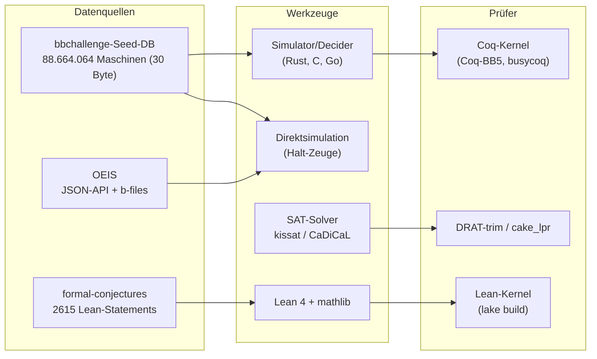
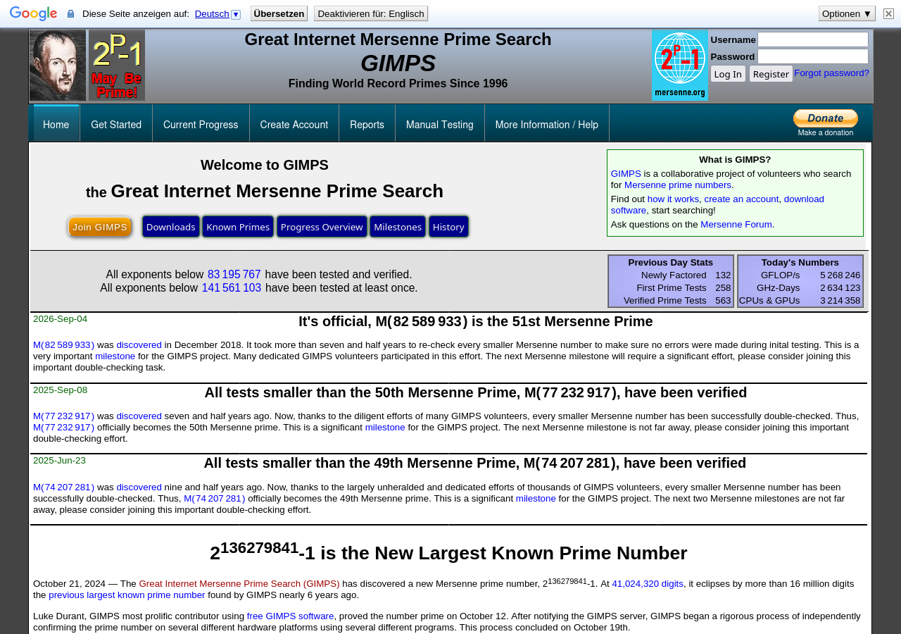
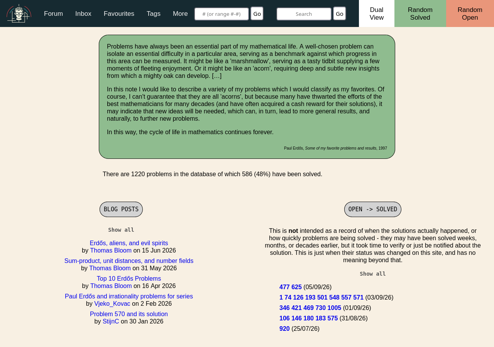

# Rechenfragmente, Datenquellen und Communities

Diese Datei sammelt ausführbare und verifizierbare Teilfragmente, Datenquellen, Werkzeuge und Communities, mit denen sich auf dieser Maschine (DeepSeek V4.1 Flash; 1M Kontext, 8192 Output-Tokens) prüfbare Aufgaben für Notations-A/B-Tests (Notation A gegen Notation B auf identischen Aufgaben; Protokoll: [05-05-ablation-protokoll](../05-entwurf-testplan/05-05-ablation-protokoll.md), geplante Datei) bauen lassen. Ein **Prüfanker** ist hier ein Verfahren, das die Richtigkeit einer Behauptung ohne menschliche Autorität entscheidet — durch Simulation, Zertifikatsprüfung, Kernel-Check oder maschinellen Ziffernvergleich. Dass das allgemeine Halteproblem unentscheidbar ist, berührt diese Fragmente nicht: Sie sind endliche Einzelaussagen, deren Prüfung mit endlichen Mitteln gelingt ([The Church-Turing Thesis – SEP](https://plato.stanford.edu/entries/church-turing/, accessed 2026-09-12)). Drei Einschränkungen bestimmen die Auswahl: (1) Das Output-Budget von 8192 Tokens schließt Antworten aus, deren Zeuge selbst riesig ist (ein 68-GB-SAT-Zertifikat passt nicht in eine Antwort, wohl aber ein 20-stelliger Zähler oder ein kurz prüfbarer Claim); (2) ein Prüfanker muss lokal auf dieser Maschine laufen oder per HTTP abfragbar sein; (3) wo nur Community-Konsens und keine Primärquelle existiert, wird das markiert.

## bbchallenge & Decider

Die **Busy Beaver Challenge** (bbchallenge) ist die Referenz-Kollaboration für maschinell entschiedene Turing-Maschinen. Sie startete 2022 (erste Enumerationsphase bereits im Dezember 2021) mit dem Ziel, alle 5-Zustands-2-Symbol-Maschinen zu entscheiden, und meldete am 2. Juli 2024 den Abschluss: Auf der Startseite stehen heute **0 unentschiedene Maschinen**, das Ziel „BB(5) = 47,176,870" gilt als erreicht ([bbchallenge](https://bbchallenge.org/, accessed 2026-09-12), [Ankündigung vom 2. Juli 2024](https://discuss.bbchallenge.org/t/july-2nd-2024-we-have-proved-bb-5-47-176-870/237, accessed 2026-09-12)). Die Ankündigung nennt die Kette: mxdys schrieb den Beweis in Coq, unabhängige Coq-Experten prüften die Theorem-Aussage, der Beweis kompiliert in rund 10 Stunden auf einem Standard-Laptop und belegt, dass keine 5-Zustands-Maschine nach mehr als 47.176.870 Schritten hält ([ebd.](https://discuss.bbchallenge.org/t/july-2nd-2024-we-have-proved-bb-5-47-176-870/237, accessed 2026-09-12)).

**Infrastruktur.** Die Methodenseite dokumentiert die zwei Phasen: Phase 1 (Dezember 2021) enumerierte 125.479.953 Maschinen in 30 Stunden und markierte 88.664.064 als unentschieden; diese liegen als Seed-Datenbank mit exakt einem 30-Byte-Datensatz pro Maschine vor (2 GB entpackt, ZIP 243 MB, SHA-1-Summen angegeben) ([Method](https://bbchallenge.org/method, accessed 2026-09-12)). Die Metriktabelle derselben Seite nennt allerdings 126.424.532 enumerierte Maschinen — die beiden Zahlen der offiziellen Seiten unterscheiden sich (unterschiedliche Laufvarianten?); ich stelle das doppelt dar, statt es aufzulösen. Dieselbe Doppelung zeigt sich gegenüber dem Paper: Der Beweistext nennt **181.385.789** enumerierte 5-Zustands-Maschinen ([Determination of the fifth Busy Beaver value](https://arxiv.org/abs/2509.12337, accessed 2026-09-12)), also eine dritte Zahl desselben Gegenstands.

**Maschinen-Notation.** Oben drauf steht das Textformat, z. B. `1RB1LC_1RC1RB_1RD0LE_1LA1LD_1RZ0LA` für den 5-Zustands-Champion; `---` markiert eine undefinierte (haltende) Transition ([Story](https://bbchallenge.org/story, accessed 2026-09-12)). Ein Konsens-Thread vom Juni 2022 legte Details fest: Der Unterstrich `_` trennt Zeilen („states") verbindlich, Leerzeichen sind bedeutungslos, Halten wird als `---` oder `1RZ` geschrieben — begründet mit Copy-Paste-, URL- und Kommandozeilen-Tauglichkeit ([Standard TM Text format](https://discuss.bbchallenge.org/t/standard-tm-text-format/60, accessed 2026-09-12)). Zusätzlich existiert die Tape-Notation für Konfigurationen, in der Analysen wie die Antihydra-Regeln formuliert sind (`0^∞ 1^a 0 1^b E> 0^∞`). Direkt rechenbar ist all das über die API: `GET https://api.bbchallenge.org/machine/<id>` liefert `machine_code`, `machine_id`, `status` als JSON, der Pfad `/decider` zusätzlich die Datei des entscheidenden Deciders ([Method](https://bbchallenge.org/method, accessed 2026-09-12); eigene Abfrage von `machine/12345678` am 2026-09-12 verifiziert).

**Decider.** Als „Decider" bezeichnet bbchallenge Programme, die für Familien von Maschinen entscheiden, ob sie halten; im Einsatz sind Cyclers, Translated Cyclers, Backward Reasoning, Halting Segment, Finite Automata Reduction (FAR), Bouncers sowie Coq-BB5 ([bbchallenge](https://bbchallenge.org/, accessed 2026-09-12)). Die Anforderung ist explizit: Jeder Decider soll mit Korrektheitsbeweis, Tests an Beispielen und Gegenbeispielen belegt werden ([Method](https://bbchallenge.org/method, accessed 2026-09-12)). Das Projekt **busycoq** realisiert das Muster „untrusted Rechner + verifizierter Prüfer": Ein in Rust geschriebener Decider erzeugt Zertifikate, ein in Coq bewiesener und nach OCaml extrahierter Verifier akzeptiert oder verwirft sie; ein Coq-Theorem garantiert, dass akzeptierte Zertifikate Nicht-Halten bedeuten. Enthalten sind Cyclers, Translated Cyclers, Backwards Reasoning und Bouncers sowie Handbeweise für harte Einzelmaschinen wie Skelet 1, 10, 34, 35; Lizenz MIT ([busycoq](https://github.com/meithecatte/busycoq, accessed 2026-09-12)).

**Coq-BB5.** Das Repository `ccz181078/Coq-BB5` (Autor mxdys) beweist in Coq v8.20.1 (die Quellen verwenden Coq und Rocq uneinheitlich für dasselbe Beweissystem; wir folgen der jeweiligen Quellenschreibweise) die Original-Resultate `BB(5) = 47,176,870` und `BB(2,4) = 3,932,964` sowie erneut die früher bekannten Werte BB(4)=107, BB(3)=21, BB(2)=6, BB(2,3)=38; es nutzt busycoq für sporadische Maschinen und hat eine Zenodo-Release v1.0.0 (DOI 10.5281/zenodo.17061968) ([Coq-BB5](https://github.com/ccz181078/Coq-BB5, accessed 2026-09-12)). Das zugehörige Paper `arXiv:2509.12337` ist als 48-seitige, CC-BY-4.0-lizenzierte Arbeit der bbchallenge-Kollaboration erschienen (v1: 15.09.2025, v2: 23.03.2026) und bezeichnet das Ergebnis als erste Bestimmung eines neuen Busy-Beaver-Werts seit über 40 Jahren und als ersten je formal verifizierten BB-Wert ([Determination of the fifth Busy Beaver value](https://arxiv.org/abs/2509.12337, accessed 2026-09-12)).

**BB(6) und Antihydra.** Der aktuelle Stand der offenen Jagd: Der Champion `1RB1RA_1RC1RZ_1LD0RF_1RA0LE_0LD1RC_1RA0RE` (mxdys, Juni 2025) zeigt S(6) > Σ(6) > 2↑↑↑5; im August 2026 waren nach informeller Zählung noch ~1000 Holdouts bis auf Äquivalenz offen, alle Maschinen bis 10^13 Schritte simuliert; ein partieller Rocq-Beweis liegt auf dem `BB6`-Branch von busycoq ([BB(6)](https://wiki.bbchallenge.org/wiki/BB%286%29, accessed 2026-09-12)). Der prominenteste Einzelfall ist **Antihydra**, `1RB1RA_0LC1LE_1LD1LC_1LA0LB_1LF1RE_---0RA`: mxdys fand die Maschine am 28. Juni 2024, Racheline leitete ihre Regeln ab; ihr Halteproblem ist äquivalent zur Frage, ob bei Iteration von `f(n) = ⌊3n/2⌋ + 2` (bzw. der Hydra-Funktion H(n)=⌊3n/2⌋) jemals die Zahl der ungeraden Schritte das Doppelte der geraden übersteigt ([Antihydra](https://wiki.bbchallenge.org/wiki/Antihydra, accessed 2026-09-12), [Sligocki: BB(6) is Hard](https://www.sligocki.com/2024/07/06/bb-6-2-is-hard.html, accessed 2026-09-12)). Die Simulation stand im Juli 2024 bei 2^31 Schritten mit b = 1.073.720.884 ([Sligocki](https://www.sligocki.com/2024/07/06/bb-6-2-is-hard.html, accessed 2026-09-12)); die Wiki-Seite dokumentiert inzwischen 2^38 Regel-Schritte mit a > 2^37 und beziffert die Random-Walk-Wahrscheinlichkeit, je zum Halt zu führen, mit weniger als (φ−1)^(2^37) ≈ 2.9 × 10^(−28723042565) ([Antihydra](https://wiki.bbchallenge.org/wiki/Antihydra, accessed 2026-09-12)). Beide Zustandsfolgen sind bei OEIS hinterlegt (A386792, A385902).

**Einschätzung.** bbchallenge ist die derzeit beste „Fragmente-Fabrik" für diese Maschine: Halt-Claims sind durch Direktsimulation in Millisekunden prüfbar, Nicht-Halt-Claims über Decider-Zertifikate und Coq, und die Aufgaben sind beliebig skalierbar. Vorsicht bei den maschinell erzeugten Zahlen: Die Enumerationszähler widersprechen sich zwischen Story-, Method-Seite und Paper.

## SAT & Zertifikate

Das SAT-Ökosystem liefert den härtesten Prüfanker: Für eine als UNSAT behauptete Formel existiert ein Zertifikat, dessen Gültigkeit unabhängig vom Solver geprüft werden kann; für SAT genügt eine Belegung.

- **Solver.** `kissat` (C, MIT-Lizenz, „keep it simple and clean", Portierung von CaDiCaL; Binaries je Release) und `cadical` (CDCL-Solver, MIT; Aufruf `cadical [dimacs [proof]]`, Tool-Paper CaDiCaL 2.0 auf der CAV'24) sind die modernen Standard-Solver von Armin Biere ([kissat](https://github.com/arminbiere/kissat, accessed 2026-09-12), [CaDiCaL](https://github.com/arminbiere/cadical, accessed 2026-09-12)). **Glucose** (Audemard & Simon, Paris) gewann SAT-Wettbewerbe, kann „Certified UNSAT" per DRUP-Trace ausgeben, ist seit 2014 parallel (`glucose-syrup`) und wurde 2021 neu aufgesetzt; letzte offizielle Release 4.2.1 (2018), offizielles Repo `audemard/glucose` ([Glucose](https://www.labri.fr/perso/lsimon/research/glucose, accessed 2026-09-12)).
- **Prüfer.** `drat-trim` validiert für eine DIMACS-Formel ein DRAT-Zertifikat (RAT/AT-Verfahren, Kern-Extraktion, Rückwärts-Prüfung, binäres DRAT; MIT) und wird als Referenzprüfer der SAT-Competition beschrieben ([drat-trim](https://github.com/marijnheule/drat-trim, accessed 2026-09-12)). `cake_lpr` ist ein mit dem verifizierten CakeML-Compiler gebauter LPR/LRAT-Prüfer (vorkompiliert samt SHA-256, Beispielaufruf `./cake_lpr example.cnf example.lpr` → `s VERIFIED UNSAT`); seit März 2024 unterstützt er zusätzlich das binäre Beweisformat, und er kann zweistufige Transformationsbeweise prüfen ([cake_lpr](https://github.com/tanyongkiam/cake_lpr, accessed 2026-09-12)).
- **Prominente Beweise.** Heule, Kullmann und Marek lösten 2016 das boolesche Pythagoreische-Tripel-Problem mit Cube-and-Conquer: Theorem 1.1 lautet, dass {1,…,7824} so in zwei Teile zerlegbar ist, dass kein Teil ein Tripel a²+b²=c² enthält, während das für {1,…,7825} unmöglich ist; das DRAT-Zertifikat war fast 200 TB groß, die daraus extrahierte komprimierte Urkunde 68 GB, gerechnet wurde auf 800 Kernen in etwa zwei Tagen ([arXiv:1605.00723](https://arxiv.org/abs/1605.00723, accessed 2026-09-12)). Die **Keller-Vermutung** (Würfelpflasterungen, Dimension 7) wurde durch SAT-Encoding gelöst: Aus der Nichtexistenz einer 128er-Clique in drei systematisch gebauten Graphen folgt, dass die Vermutung in Dimension 7 gilt und in Dimension 8 falsch ist ([The Resolution of Keller's Conjecture](https://arxiv.org/abs/1910.03740, accessed 2026-09-12)). Die **Schur-Zahl Fünf** wurde 2017/18 auf S(5)=160 bestimmt; der Beweis ist zwei Petabyte groß und wurde mit einem formal verifizierten Prüfer zertifiziert ([Schur Number Five](https://arxiv.org/abs/1711.08076, accessed 2026-09-12)).
- **Einschätzung.** SAT/UNSAT-Fragmente sind die saubersten Prüfanker, aber der Zeuge ist nicht LLM-förmig: Ein Modell dieser Größe kann eine DIMACS-Instanz beschreiben oder eine Belegung (SAT) ausgeben, aber kein terabytegroßes UNSAT-Zertifikat erzeugen. Für A/B-Tests eignen sich daher kleine UNSAT-Kerne, die ein Prüfer in Sekunden akzeptiert, oder die Aufgabe, eine gegebene Instanz korrekt zu kodieren und das erwartete Verdikt zu behaupten.

## OEIS

Die **On-Line Encyclopedia of Integer Sequences** ist die maschinenlesbare Zahlengrundlage für Teilfragmente. Jeder Eintrag ist per JSON abfragbar: `&fmt=json` an eine Such-URL angehängt, `q=id:A001011` für den exakten Eintrag ([JSON Format](https://oeis.org/wiki/JSON_Format, accessed 2026-09-12)). Zu jeder Folge existieren meist b-files mit Tausenden Termen als reine Textdatei — der Test-Abruf von `https://oeis.org/A006577/b006577.txt` am 2026-09-12 lieferte HTTP 200 (`text/plain`). Verifizierte Zuordnungen:

- **Collatz.** A006577: „Number of halving and tripling steps to reach 1" (totale Schrittzahl, Offset 1; die Folgenwerte für n=1..8 sind 0,1,7,2,5,8,16,3) ([A006577](https://oeis.org/A006577, accessed 2026-09-12)). A070165: unregelmäßiges Dreieck der Trajektorien n, T(n), … bis 1 ([A070165](https://oeis.org/A070165, accessed 2026-09-12)).
- **Busy Beaver.** Zwei Nummern, zwei Funktionen: A028444 ist Rados Σ (Anzahl der Einsen auf dem Schlussband; Werte 0,1,4,6,13,4098 — der Wert Σ(5)=4098 wurde 2025 ergänzt) ([A028444](https://oeis.org/A028444, accessed 2026-09-12)); A060843 ist S(n), die maximale Schrittzahl, mit den Termen 1,6,21,107,47176870 ([A060843](https://oeis.org/A060843, accessed 2026-09-12)). Achtung: „BB(n)" ist historisch mehrdeutig zwischen Σ und S; bbchallenge verwendet BB = S ([Ankündigung](https://discuss.bbchallenge.org/t/july-2nd-2024-we-have-proved-bb-5-47-176-870/237, accessed 2026-09-12)) — dieselbe Mehrdeutigkeit, doppelt dargestellt, weil jede A/B-Aufgabe sie explizit auflösen muss.
- **Goldbach.** A045917 zählt die ungeordneten Zerlegungen von 2n in zwei Primzahlen (Haupt-Eintrag mit identischen Werten ist A002375, von A045917 nur beim n=2-Term verschieden) ([A045917](https://oeis.org/A045917, accessed 2026-09-12)). Für Goldbach ist das hier der Zähl-/Prüfanker; den Offenheitsstand und die Verifikationsgrenze führt [04-02](04-02-kandidaten-katalog.md).
- **Antihydra.** A386792 (a-Werte) und A385902 (b-Werte), angelegt am 2. August 2025 von Peter Luschny; A385902 vermerkt ausdrücklich, dass die Divergenz der Iteration vermutlich nötig ist, um eine untere Schranke für BB(6) zu etablieren ([A386792](https://oeis.org/A386792, accessed 2026-09-12), [A385902](https://oeis.org/A385902, accessed 2026-09-12)).
- **Hadwiger–Nelson.** Eine Volltextsuche der OEIS nach „Hadwiger-Nelson" liefert am 2026-09-12 **keinen Treffer** (Kontrolle: „Collatz" → 116 Folgen); eine kanonische OEIS-Folge zur Farbenzahl der Ebene ist damit nicht auffindbar (Negativbefund der Suche am Stichtag — Abwesenheit ist kein Beweis der Nichtexistenz); für diesen Kandidaten fehlt der OEIS-Prüfanker ([OEIS-Suche](https://oeis.org/search?q=Hadwiger-Nelson, accessed 2026-09-12)).
- **OEIS + LLM.** `Sequencelib` formalisiert OEIS-Mathematik in Lean: mehr als 25.000 Sequenzen wurden aus Standard-ML-Implementierungen nach Lean transpiliert, dabei über 1,6 Millionen Theoreme über ihre Werte bewiesen; ein Lean-Server (OEIS-LT) bietet die Werkzeuge als Low-Latency-API an ([Sequencelib](https://arxiv.org/abs/2601.11757, accessed 2026-09-12)).

**Einschätzung.** OEIS-Antworten sind ideal als kurze, zitierbare Ergebnisse (Zahl + A-Nummer + Offset), und b-files erlauben es, Behauptungen des Modells gegen tausende Terme zu prüfen. Vorsicht: Einträge mischen Beweise, Vermutungen und Kommentare ohne einheitliche Kennzeichnung.

## Formale Assistenten & Benchmarks

- **mathlib (Lean 4).** Die Statistikseite nennt 136.932 Definitionen, 288.041 Theoreme und 772 Contributors (Abruf 2026-09-12) ([Mathlib statistics](https://leanprover-community.github.io/mathlib_stats.html, accessed 2026-09-12)). Für maschinelle Prüfung zählen die Taktiken `omega`, `norm_num`, `aesop`, `linarith`, die in der offiziellen Taktikliste geführt werden ([Tactic list](https://leanprover-community.github.io/mathlib4_docs/tactics.html, accessed 2026-09-12)).
- **formal-conjectures (Google DeepMind).** Eine Sammlung formalisierter Vermutungen in Lean 4 mit mathlib; das Paper nennt **2615** Problem-Statements, davon **1029 offene Forschungsvermutungen** („zero-contamination benchmark") und 836 gelöste Probleme zur Autoformalisierung. Software Apache-2.0, Materialien CC-BY; das Repo bezieht ausdrücklich Material von bbchallenge, OEIS, MathOverflow und Wikipedia; AlphaProof soll helfen, Fehlformalisierungen zu finden ([formal-conjectures](https://github.com/google-deepmind/formal-conjectures, accessed 2026-09-12), [arXiv:2605.13171](https://arxiv.org/abs/2605.13171, accessed 2026-09-12)).
- **miniF2F.** 244 Olympiade- und Übungs-Statements, nach Lean, Metamath, Isabelle und HOL Light übersetzt (244 vollständig in Lean/Metamath; v1 eingefroren August 2021), MIT für Metamath, Apache für Lean; das Repository wurde am 29. Mai 2026 archiviert und ist read-only ([miniF2F](https://github.com/openai/miniF2F, accessed 2026-09-12)).
- **PutnamBench.** 1724 manuell erstellte Formalisierungen von Putnam-Aufgaben 1962–2025 in Lean 4 (672), Isabelle (640) und Coq (412); Apache-2.0 bzw. MIT; für Aufgaben mit numerischer Antwort gibt es factoring-freundliche „factored solutions" und eine öffentliche Leaderboard-Seite ([PutnamBench](https://github.com/trishullab/PutnamBench, accessed 2026-09-12)).
- **Metamath.** Die `set.mm`-Datenbank des Metamath Proof Explorer enthält über 26.000 vollständig ausgearbeitete Beweise in den Hauptabschnitten (über 41.000 mit Mathboxen); die Prüfung ist konzeptuell minimal: Substitution plus Distinct-Variable-Bedingungen, alles andere ist mechanisch ([Metamath Proof Explorer](https://us.metamath.org/mpeuni/mmset.html, accessed 2026-09-12)). Der Verifizierer selbst ist damit der einfachste „Kernel" im Vergleich — und miniF2F liefert 244 Metamath-Übersetzungen als Testfutter.
- **LeanDojo.** Werkzeug- und Benchmark-Familie (Caltech) für retrieval-augmentiertes Theorembeweisen in Lean, mit offenen Repos; die zugehörige Arbeit „LeanDojo: Theorem Proving with Retrieval-Augmented Language Models" erschien als NeurIPS-Paper arXiv:2306.15626 ([LeanDojo](https://leandojo.org/, accessed 2026-09-12)).

**Einschätzung.** Lean bietet den stärksten lokalen Anker für freie Mathematik-Antworten (Kernel-Check per `lake build`), aber der Beitrag des Modells muss bis aufs letzte Lemma formal sein; Metamath prüft am billigsten, verlangt aber eine sehr explizite Beweisschritt-Form. In beiden Fällen bleibt die Spezifikationslücke (formalisierter Satz ≠ informelle Behauptung) die Fehlerquelle, die kein Kernel sieht. Mapping zu den Kandidaten: BB(5)/BB(6) → Coq-BB5/busycoq (Coq-Kernel); Erdős-Probleme → formal-conjectures/FrontierMath (Lean-Kernel); für Collatz, Goldbach und Hadwiger–Nelson wurde am 2026-09-12 kein vergleichbarer Projektanker gefunden.

## Verteilte Projekte

- **GIMPS.** Das Mersenne-Prime-Projekt läuft seit 1996; aktuell sind 52 Mersenne-Primzahlen bekannt, die größte ist 2^136279841 − 1 mit 41.024.320 Ziffern (entdeckt Oktober 2024, bestätigt) ([GIMPS](https://www.mersenne.org/, accessed 2026-09-12)). Die Startseite dokumentiert die Double-Check-Meilensteine (M(82589933) wurde am 04.09.2026 offiziell als 51. Mersenne-Primzahl bestätigt) und eine Live-Tagesstatistik (CPU-/GPU- und GFLOP/s-Zahlen ändern sich laufend und sind als Tageswerte nicht reproduzierbar zitierfähig; vgl. Screenshot). Seit 2020 ersetzen PRP-Beweise (Pietrzak-VDF) den vollständigen Zweitlauf ([ebd.](https://www.mersenne.org/, accessed 2026-09-12)).

*Abbildung 1: GIMPS-Statusseite (Auszug): Verifikationsstände („All exponents below 83 195 767 have been tested and verified"), der Meilenstein M(82 589 933) als 51. Mersenne-Primzahl (2026-Sep-04) und die Live-Tagesstatistik (Quelle: [mersenne.org](https://www.mersenne.org/, accessed 2026-09-12); Screenshot vom 2026-09-12).*

- **PrimeGrid.** Das BOINC-Projekt betreibt Teilprojekte zu Primzahlformen; die Startseite nennt 894.103 Hosts, 358.039 Nutzer und 3.750 TeraFLOPS, dazu „fast proof tasks", bei denen kein zweiter Lauf mehr nötig ist ([PrimeGrid](https://www.primegrid.com/, accessed 2026-09-12)). Relevante offene-Problem-Fragmente: Seventeen or Bust und der Prime Sierpinski Problem (Elimination von k-Werten), Sierpinski/Riesel Base 5 (laut Seite verbleiben 27 k's) sowie die Generalized-Fermat-Suche ([ebd.](https://www.primegrid.com/, accessed 2026-09-12)).
- **Collatz-Verifikation.** Die derzeitige Rekordmarke stammt von David Barinas Projekt: Die Konvergenz aller Zahlen unterhalb 2075 × 2^60 (≈ 2^71.02) ist verifiziert; die Verifikation bis 2076 × 2^60 lief zuletzt bei 17,2 % (Arbeitseinheit 2^40 Zahlen, ~5 s pro Einheit auf modernen GPUs, C/CUDA-Quellcode offen). Die Projektchronik verzeichnet 2^68 (07.05.2020), 2^69 (10.12.2021), 2^70 (09.07.2023), 1,5 × 2^70 (03.11.2023) und 2^71 (15.01.2025) ([Convergence verification of the Collatz problem](https://pcbarina.fit.vutbr.cz/, accessed 2026-09-12); Paper: J Supercomput 77, 2681–2688 (2021), DOI 10.1007/s11227-020-03368-x; Nachfolger J Supercomput 81, 810 (2025), DOI 10.1007/s11227-025-07337-0).
- **BOINC und Collatz/Erdős.** In der offiziellen BOINC-Projektliste (Abruf 2026-09-12) findet sich **kein** Collatz- und kein Erdős-Projekt; Mathematik-Projekte sind u. a. PrimeGrid, SRBase, NFS@home, NumberFields@home, LODA, Amicable Numbers und die Ramanujan Machine ([BOINC project list](https://boinc.berkeley.edu/projects.php, accessed 2026-09-12)). Das frühere „Collatz Conjecture"-Projekt unter `boinc.thesonntags.com/collatz` ist heute nicht mehr erreichbar (Transportfehler am 2026-09-12); die Wayback-Kopie vom Januar 2025 liefert ohne JavaScript keine Inhalte ([Wayback-Capture](https://web.archive.org/web/20250120061311/http://boinc.thesonntags.com/collatz/, accessed 2026-09-12)). **yoyo@home** (Rechenkraft.net) betreibt nur ecm, Siever, ecm P2 und PARI/GP — keine Collatz-App ([yoyo@home Applications](https://www.rechenkraft.net/yoyo/apps.php, accessed 2026-09-12)).

**Einschätzung.** Diese Projekte liefern dokumentierten Durchsatz und Rekordstände, taugen als lokale Prüfanker aber nur indirekt: Kleine Bereiche lassen sich selbst nachrechnen (z. B. Collatz-Teilintervalle), doch die Rekorde hängen an der Korrektheit der jeweiligen Projektsoftware. Für A/B-Tests sind die Daten vor allem Quelle für Aufgabenbeschreibungen und Referenzwerte.

## Communities

- **bbchallenge-Ökosystem.** Discord (Einladung von der Startseite), Forum mit Decider-Diskussionen, Wiki unter CC-BY-4.0 ([bbchallenge](https://bbchallenge.org/, accessed 2026-09-12), [BusyBeaverWiki](https://wiki.bbchallenge.org/wiki/Main_Page, accessed 2026-09-12)). Das Forum ist der Ort, an dem Decider-Bewertungen und Validierungsprozesse ausgehandelt werden ([Method](https://bbchallenge.org/method, accessed 2026-09-12)).
- **erdosproblems.com.** Thomas Blooms Sammlung umfasst 1220 Probleme, von denen 586 (48 %) gelöst sind; ein Forum mit Blog-Posts dokumentiert Statusänderungen laufend, einschließlich einer Diskussion über KI-Nutzung bei Erdős-Problemen (Beitrag zu Problem 728 vom 26.01.2026) ([Erdős Problems](https://www.erdosproblems.com/, accessed 2026-09-12)).

*Abbildung 2: erdosproblems.com: Datenbankstand „1220 problems … 586 (48%) have been solved" und das Open→Solved-Log (Quelle: [erdosproblems.com](https://www.erdosproblems.com/, accessed 2026-09-12); Screenshot vom 2026-09-12).*
- **Polymath16.** Das Projekt zur Hadwiger–Nelson-Vermutung startete im April 2018 mit Blog-Threads (Dustin Mixon), einer Wiki-Seite und einer Dropbox als Datenablage; unmittelbar nach de Greys 5-Chromatizitäts-Beweis wurde der Rekord auf 1577 Knoten gedrückt, und Marijn Heule veröffentlichte dort einen 5-chromatischen Graphen mit 874 Knoten samt .vtx/.edge-Dateien (Kantenliste im DIMACS-Format) ([Polymath16](https://dustingmixon.wordpress.com/2018/04/14/polymath16-first-thread-simplifying-de-greys-graph/, accessed 2026-09-12)). Der Ausgangspunkt bleibt relevant: de Grey bewies χ(ℝ²) ≥ 5 über eine Familie endlicher Unit-Distance-Graphen, deren kleinster 1581 Knoten hatte ([The chromatic number of the plane is at least 5](https://arxiv.org/abs/1804.02385, accessed 2026-09-12)).
- **Lean-Zulip.** Der Lean-Community-Chat ist die Anlaufstelle für Rückfragen zu mathlib; formal-conjectures unterhält dort einen eigenen Channel ([Lean Zulip](https://leanprover.zulipchat.com/, accessed 2026-09-12), [formal-conjectures](https://github.com/google-deepmind/formal-conjectures, accessed 2026-09-12)). *[Hinweis: Die Zulip-Seite rendert Inhalte nur mit JavaScript; per webfetch ist die Community nur als Verweis belegbar.]*
- **FrontierMath (Epoch AI).** Das Benchmark-Programm hat drei Teile: die Tiers 1–4 aus mehreren hundert unveröffentlichten Problemen, „Open Problems" als Sammlung signifikanter offener Probleme, deren Lösungen „computationally verifiable" sind, sowie „FrontierMath Erdős" — als „open as of August 2026" beschriebene Erdős-Probleme, die in Lean formalisiert sind und für die KI vollständige Lean-Beweise oder -Widerlegungen schreiben muss ([FrontierMath](https://epoch.ai/frontiermath, accessed 2026-09-12)).

**Einschätzung.** Communities sind die Prüfschicht außerhalb der Kernel: Dort werden Decider-Beweise, Graphdaten und Formalisierungen verhandelt, und dort findet man Gegenbeispiele, die kein automatischer Prüfer kennt. Verlinkbare Daten gibt es reichlich (DIMACS-Kantenlisten, Lean-Repos, Seed-DB); der Diskurs selbst ist nicht maschinell prüfbar.

## Nachtrag 2026-09-13 — Lean-Kernel-Anschluss steht (E1: Erdős–Straus)

Die in [04-05](04-05-bruecke-pruefer.md) als Lücke 7 geführte „fehlende formale Brücke“ und das
entsprechende K4-Gate in [04-04](04-04-empfehlung.md) §1 sind für die Erdős–Straus-Kette nicht
mehr nur Postulat, sondern lokal ausgeführt. Das neue Lean-4-Projekt `lean/erdos-straus/`
(Lean 4.33.1, mathlib-Tag `v4.33.1`, gepinnt in `lake-manifest.json`) enthält (a) die
parametrischen Klassen aus P12 als Theoreme über ℚ für alle `t ≥ 1` — generisches
Skalierungs-Muster plus die sechs Klassen (m = 2, 3, 5, 7, 11, 13), exakt im Gültigkeitsbereich
des IDENT-Checkers; (b) eine finite Brücke für `2 ≤ n ≤ 1000` mit expliziten Zeugen
(Zeugentabelle aus dem P11-Modul, generiert und je Zeile exakt mit `Fraction` nachgerechnet,
sha256 des P11-stdout im Dateikopf); (c) ein Axiom-Audit: nur `propext`,
`Classical.choice`, `Quot.sound`, kein `sorryAx`, kein `native_decide` — die
Tabellenprüfung `witnesses_all_ok` hängt von **keinem** Axiom ab. `lake build` ist grün
(8710 Jobs, ~20 s mit mathlib-Cache).

Was das **nicht** ist: ein Fortschritt an der Vermutung. Die Brücke deckt ein endliches Fenster
und sechs Progressionen; der offene Kern bleibt `p ≡ 1 (mod 4)`;
rechnerischer Weltstand 10^17 (Salez 2014) bzw. 10^18 (Preprint 2025) — rechnerisch, nicht
kernel-geprüft. Gemessene Kernel-Grenze der Elaboration: N = 1000 baut in ~16 s, N = 2000
überschreitet die Default-Heartbeats — größere Fenster brauchen eine andere Kodierung
(`native_decide` mit Compiler-Vertrauen oder String-Tabelle mit geprüftem Parser) oder eine
feinere Aufteilung.

**Kurzrecon formal-conjectures (2026-09-13, ≤ 45 min).** Am Repo-README verifiziert: das
Projekt ist ein Lake-Projekt mit mathlib-Require; der Einstieg ist `lake exe cache get` +
`lake build` — derselbe Ablauf wie beim neuen Projekt dieser Maschine, der lokale Prüfpfad
ist also reproduzierbar. Versionierung folgt den monatlichen mathlib-Tags (`v4.{X}.{Y}`),
Benchmark-Snapshots heißen `bench-v{N}-lean4.{X}.{Y}`; Software Apache-2.0, Materialien
CC-BY. Shortlist für diese Kette (Kriterien: endlich / prüfbar / Identitätsstruktur; **kein**
Angriff in E1):

1. **Erdős–Straus (Referenzfall).** Zeugen sind sofort kernel-prüfbar; die modularen
   Gleichungen reduzieren auf endliche Kongruenzklassen; der offene Kern ist
   `p ≡ 1 (mod 4)`. Feasibility: hoch für *Statement plus Teilresultate* als Beitrag.
   Nächster Schritt: prüfen, ob eine Statement-Datei im ErdősProblems-Verzeichnis existiert,
   sonst Beitrag nach Repo-Vorgaben (category-Attribut, Quellenangabe) — nicht in E1 geprüft.
2. **Modulare Fragmente derselben Familie.** Genau die Form, die `[IDENT]` und das neue
   Skalierungs-Muster formalisieren (Klasse `n = m·t` mit Zeugen, Gültigkeitsbereich
   `t ≥ 1`). Feasibility: mittel — neue Klassen sind Forschung, das Formalisierungs-Muster steht.
3. **Zeugen-Familien anderer Katalogprobleme** (Goldbach-Partitionen, Hadwiger–Nelson-Graphen,
   drei Kuben): kernel-prüfbare Zeugen, aber mit SAT-/Graph-Zertifikaten statt
   Identitätsstruktur — eigene Claim-Typen nötig. Feasibility für diese Kette: niedrig.

Eine belastbare Auswahl aus den 1029 offenen Statements des Korpus braucht einen
Katalog-Scan (Repo klonen, Statement-Köpfe und `@[category]`-Attribute sichten); die
Kriterien dafür liefert [04-01](04-01-wahlkriterien.md), das Prüfmuster jetzt dieses Projekt.
Das ist die nächste Phase, nicht E1. Präzedenz für den Weg „KI-gestützt, Lean-verifiziert,
öffentlich nachvollzogen“ liefern #728 („PROVED (LEAN)“) und #871 („DISPROVED (LEAN)“) mit
den Forum-Regeln (KI-Offenlegung, unabhängige Prüfung, möglichst fehlerfreie
Lean-Formalisierung) ([Erdős Problem #728](https://erdosproblems.com/728, accessed 2026-09-13)).

## Quellen

Alle Abrufe am 2026-09-12.

**bbchallenge & Busy Beaver**
- [bbchallenge](https://bbchallenge.org/) — Startseite: Ziel erreicht, Decider-Liste, News.
- [Story](https://bbchallenge.org/story) — BB(5)-Geschichte, Format, BB-Skala.
- [Method](https://bbchallenge.org/method) — Seed-DB, 30-Byte-Format, API, Decider-Definition, Reproduzierbarkeit.
- [Ankündigung 02.07.2024](https://discuss.bbchallenge.org/t/july-2nd-2024-we-have-proved-bb-5-47-176-870/237) — Beweis, Credits, Historie, Ausblick BB(6).
- [Standard TM Text format](https://discuss.bbchallenge.org/t/standard-tm-text-format/60) — Konsens-Thread zum Textformat.
- [Determination of the fifth Busy Beaver value (arXiv:2509.12337)](https://arxiv.org/abs/2509.12337) — Paper zum Coq-Beweis.
- [Coq-BB5](https://github.com/ccz181078/Coq-BB5) — Repo, Zenodo-DOI, Ergebnisliste.
- [busycoq](https://github.com/meithecatte/busycoq) — verifizierte Decider-Zertifikate.
- [Antihydra (BusyBeaverWiki)](https://wiki.bbchallenge.org/wiki/Antihydra) — Regeln, Simulation, OEIS-Verweise.
- [BB(6) (BusyBeaverWiki)](https://wiki.bbchallenge.org/wiki/BB%286%29) — Champion, Holdouts, Cryptids.
- [Sligocki: BB(6) is Hard (Antihydra)](https://www.sligocki.com/2024/07/06/bb-6-2-is-hard.html) — Analyse und Simulationstiefe.
- [API-Beispiel](https://api.bbchallenge.org/machine/12345678) — Live-Abfrage Maschine + Decider.

**SAT & Zertifikate**
- [kissat](https://github.com/arminbiere/kissat), [CaDiCaL](https://github.com/arminbiere/cadical), [Glucose](https://www.labri.fr/perso/lsimon/research/glucose).
- [drat-trim](https://github.com/marijnheule/drat-trim), [cake_lpr](https://github.com/tanyongkiam/cake_lpr).
- [Pythagoreische Tripel (arXiv:1605.00723)](https://arxiv.org/abs/1605.00723), [Keller (arXiv:1910.03740)](https://arxiv.org/abs/1910.03740), [Schur Five (arXiv:1711.08076)](https://arxiv.org/abs/1711.08076).

**OEIS**
- [JSON Format](https://oeis.org/wiki/JSON_Format); [A006577](https://oeis.org/A006577) (+ [b-file](https://oeis.org/A006577/b006577.txt)), [A070165](https://oeis.org/A070165), [A028444](https://oeis.org/A028444), [A060843](https://oeis.org/A060843), [A045917](https://oeis.org/A045917), [A386792](https://oeis.org/A386792), [A385902](https://oeis.org/A385902); [Suche Hadwiger-Nelson](https://oeis.org/search?q=Hadwiger-Nelson).
- [Sequencelib (arXiv:2601.11757)](https://arxiv.org/abs/2601.11757).

**Formale Mathematik**
- [Mathlib statistics](https://leanprover-community.github.io/mathlib_stats.html), [Tactic list](https://leanprover-community.github.io/mathlib4_docs/tactics.html).
- [formal-conjectures](https://github.com/google-deepmind/formal-conjectures), [Paper (arXiv:2605.13171)](https://arxiv.org/abs/2605.13171).
- [miniF2F](https://github.com/openai/miniF2F), [PutnamBench](https://github.com/trishullab/PutnamBench), [Metamath Proof Explorer](https://us.metamath.org/mpeuni/mmset.html), [LeanDojo](https://leandojo.org/).

**Verteilte Projekte**
- [GIMPS](https://www.mersenne.org/), [PrimeGrid](https://www.primegrid.com/), [BOINC project list](https://boinc.berkeley.edu/projects.php), [yoyo@home](https://www.rechenkraft.net/yoyo/apps.php), [Wayback-Capture BOINC-Collatz](https://web.archive.org/web/20250120061311/http://boinc.thesonntags.com/collatz/).
- [Barina: Collatz-Verifikation](https://pcbarina.fit.vutbr.cz/) (Projektseite; Paper-DOIs [2021](https://doi.org/10.1007/s11227-020-03368-x), [2025](https://doi.org/10.1007/s11227-025-07337-0)).

**Communities**
- [Erdős Problems](https://www.erdosproblems.com/), [Polymath16 (Dustin Mixon)](https://dustingmixon.wordpress.com/2018/04/14/polymath16-first-thread-simplifying-de-greys-graph/), [de Grey (arXiv:1804.02385)](https://arxiv.org/abs/1804.02385), [Lean Zulip](https://leanprover.zulipchat.com/), [FrontierMath](https://epoch.ai/frontiermath).
- [The Church-Turing Thesis – SEP](https://plato.stanford.edu/entries/church-turing/) (Unentscheidbarkeit des Halteproblems/Entscheidungsproblems).

**Nachtrag 2026-09-13 (E1, Erdős–Straus)**
- [formal-conjectures (Repo-README)](https://github.com/google-deepmind/formal-conjectures) — Lake/mathlib-Einstieg (`lake exe cache get`, `lake build`), Versions-Tags `bench-v{N}-lean4.{X}.{Y}`, Apache-2.0 / CC-BY (Abruf 2026-09-13).
- [Weitere Verifikation und empirische Evidenz zur Erdős–Straus-Vermutung (arXiv:2509.00128)](https://arxiv.org/abs/2509.00128) — Stand 10^18, offener Kern `p ≡ 1 (mod 4)`.
- [Neue modulare Gleichungen, Prüfung bis N = 10^17 (arXiv:1406.6307)](https://arxiv.org/abs/1406.6307) — Salez 2014.
- [Erdős Problem #728](https://erdosproblems.com/728) — Forum-Regeln: KI-Offenlegung, unabhängige Prüfung, möglichst fehlerfreie Lean-Formalisierung (Abruf 2026-09-13).
- Lokal: `lean/erdos-straus/` (Lean 4.33.1 + mathlib `v4.33.1`) — Kernel-Beweise der sechs P12-Klassen und der finiten Brücke `2 ≤ n ≤ 1000`.
