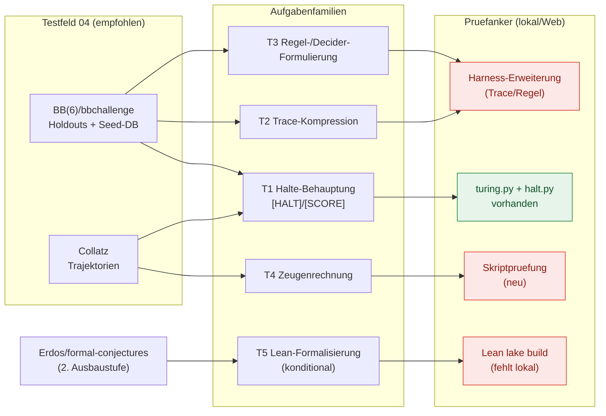

# Empfehlung — Shortlist und Testeignung für die Notations-Hypothese

Diese Datei bewertet die Kandidaten aus [04-02](04-02-kandidaten-katalog.md) gegen die Kriterien aus [04-01](04-01-wahlkriterien.md) und spricht eine begründete Empfehlung aus. Sie endet mit der Frage, die Cluster 05 übernehmen muss: **Welche Aufgabenfamilien des empfohlenen Testfelds lassen einen Notationseffekt überhaupt erwarten — und wie sieht das A/B-Design aus?**

## 1. Bewertungsmatrix

Bewertet wird mit 0/1/2 je Kriterium; Gates: K2 ≥ 1 und K4 = 2 (vgl. [04-01](04-01-wahlkriterien.md)). Die Punktwerte belegen sich aus den jeweiligen Katalogabschnitten in [04-02](04-02-kandidaten-katalog.md) und [04-03](04-03-rechenfragmente-daten.md); Einzelnachweise dort.

| Kandidat | K1 offen | K2 Zeugen | K3 Daten | K4 Maschine | K5 Notation | Summe K1–K5 | K6 Stufen | K7 Kontamination | Gate |
|---|---|---|---|---|---|---|---|---|---|
| **BB(6)/bbchallenge-Fragmente** | 2 | 2 | 2 | 2 | 2 | **10** | 2 | 2 | erfüllt |
| **Collatz-Fragmente** | 2 | 2 | 2 | 2 | 2 | **10** | 2 | 1 | erfüllt |
| **Hadwiger–Nelson** | 2 | 2 | 2 | 2 | 1 | **9** | 1–2 | 2 | erfüllt |
| **Erdős-Probleme / formal-conjectures** | 2 | 2 | 2 | 1 | 2 | **9** | 2 | 2 | K4 verfehlt (Lean-Harness fehlt) |
| **Ungerade vollkommene Zahlen** | 2 | 2 | 2 | 1 | 1 | **8** | 1 | 2 | K4 verfehlt (Faktorisierungsaufwand) |
| **SAT-entschiedene Klassiker** (Pythagoreische Tripel, Keller, Schur) | 0–1 | 2 | 2 | 1 | 1 | **6–7** | 1 | 1 | K1/K4 verfehlt (entschieden bzw. TB-Zertifikate) |

*Tabelle 1: Bewertung gegen die Kriterien aus [04-01](04-01-wahlkriterien.md) (eigene Bewertung; Belege je Zelle in den verlinkten Katalogabschnitten).*

Für uneindeutige Zellwerte (0–1, 1–2) gilt der niedrigere Wert als Standard; eine Aufwertung erfordert einen datierten Primärbeleg. Zwei Kandidaten erreichen die volle Punktzahl der Kernkriterien; die Gates sortieren den Rest aus: Erdős/formal-conjectures scheitert an K4, solange kein Lean-Kernel-Anschluss auf dieser Maschine existiert ([04-05](04-05-bruecke-pruefer.md), Lücke 7); die SAT-Klassiker sind entschieden (K1) und ihre Zertifikate terabytegroß ([04-03](04-03-rechenfragmente-daten.md), Abschnitt „SAT & Zertifikate"). Sie bleiben als *Referenzkultur* wertvoll, nicht als Testfeld.

## 2. Shortlist

### 2.1 Primärempfehlung: BB(6)/bbchallenge-Fragmente

**Warum.** Drei Gründe, die sich gegenseitig verstärken:

1. **Der Prüfpfad existiert bereits lokal.** `[HALT: <machine> -> <steps>]` und `[SCORE: <machine> -> <ones>]` werden in-prozess simuliert und mit den Verdicts `CONFIRMED`/`REFUTED`/`UNVERIFIABLE` bewertet; der BB(5)-Champion mit 47.176.870 Schritten und 4098 Einsen ist als Referenz im Testkorpus verankert ([04-05](04-05-bruecke-pruefer.md); [tests/test_turing.py (lokale Quelle)](git:yesloop/proofboy-p7-halt:tests/test_turing.py, accessed 2026-09-12)).
2. **Die Notation ist selbst der Gegenstand.** Die bbchallenge-Standardnotation (`1RB1LC_1RC1RB_…`) ist eine kompakte formale Mini-Sprache mit Parser und exakter Semantik — ein A/B-Test kann eine modell-nahe Alternativnotation gegen sie laufen lassen und beide Seiten in denselben Verifier übersetzen ([04-05](04-05-bruecke-pruefer.md); [Standard TM Text format](https://discuss.bbchallenge.org/t/standard-tm-text-format/60, accessed 2026-09-12)).
3. **Die Aufgabe ist frisch und der Vorrat unerschöpflich.** Die BB(6)-Jagd ist offen (Stand August 2026: ~1000 Holdouts bis auf Äquivalenz; alle Maschinen bis 10¹³ Schritte simuliert) [BB(6) – BusyBeaverWiki](https://wiki.bbchallenge.org/wiki/BB(6), accessed 2026-09-12); über die Seed-Datenbank (88.664.064 Maschinen, 30 Byte je Datensatz) lassen sich beliebig viele randomisierte Instanzen ziehen [Method – bbchallenge](https://bbchallenge.org/method, accessed 2026-09-12).

**Risiken.** (a) Vertrautheit: BB(5)-Champions und Antihydra sind in der Trainingsliteratur präsent — K7 verlangt, vor allem frische Holdouts (2025/2026) und lokal randomisierte Maschinen zu verwenden (vgl. [04-01](04-01-wahlkriterien.md), K7). (b) Nicht-Halte-Aufgaben sind mit der heutigen Mechanik nicht abbildbar; der Test beschränkt sich auf endliche Horizonte ([halt.py (lokale Quelle)](git:yesloop/proofboy-p7-halt:proofboy/claimtypes/halt.py, accessed 2026-09-12)).

### 2.2 Ergänzung: Collatz-Fragmente

**Warum.** Collatz ist der billigste randomisierbare Kontrollkandidat: Für beliebige n ist die Trajektorie bis 1 ein endlicher, in Sekunden prüfbarer Zeuge; Schrittzahlen sind in OEIS hinterlegt (A006577 „Number of halving and tripling steps"; A070165 Trajektorien) [A006577 – OEIS](https://oeis.org/A006577, accessed 2026-09-12) [A070165 – OEIS](https://oeis.org/A070165, accessed 2026-09-12). Die Verifikationsdimension des Projekts reicht bis ≈ 2⁷¹,02 (Projektstand 15.01.2025) [Barina-Projektseite](https://pcbarina.fit.vutbr.cz/, accessed 2026-09-12); die Härte des Gesamtproblems ist unbestritten („fast alle Orbits erreichen fast beschränkte Werte" — mehr nicht) [Almost all orbits of the Collatz map attain almost bounded values](https://arxiv.org/abs/1909.03562, accessed 2026-09-12).

**Rolle im Design.** Collatz liefert die *leichte* Aufgabenfamilie (Trajektorienlänge, Kompression von Trajektorien) und Kontrollinstanzen, an denen sich Notationseffekte isolieren lassen (identische Aufgabenstruktur, variierte Schreibweise). Als eigenständiges Testfeld ist es schwächer als BB(6), weil die Aufgabenfamilie schmaler ist (Iteration statt Halteproblem, Simulation, Score).

### 2.3 Conditional: Erdős-Probleme mit formal-conjectures

**Warum (perspektivisch).** Die stärkste *Formalisierungs*-Aufgabenfamilie: 2615 Lean-Statements, davon 1029 offene Forschungsvermutungen [formal-conjectures](https://github.com/google-deepmind/formal-conjectures, accessed 2026-09-12); Statusänderungen werden öffentlich protokolliert (u. a. #728 „PROVED (LEAN)", #871 „DISPROVED (LEAN)", Statuswechsel 06.01.2026) [Erdős Problems](https://www.erdosproblems.com/, accessed 2026-09-12). Genau hier maß die Community zuletzt Notationseffekte im weitesten Sinn: Beweise und Autoformalisierung.

**Bedingung.** Derzeit fehlt der lokale Lean-Kernel-Anschluss ([04-05](04-05-bruecke-pruefer.md), Lücke 7). Empfehlung: als **zweite Ausbaustufe** einplanen, sobald der Harness `lake build`-Prüfungen beherrscht; solange nicht Shortlist-bestandteil.

## 3. Testeignung für die Notations-Hypothese (Übergabe an Cluster 05)

Die Hypothese lautet: Eine auf Attention/Tokenizer dieses Modells zugeschnittene Mathematik-Notation macht es besser/schneller und bleibt in formale Mathematik rücküberführbar [Masterplan (lokale Quelle)](../../PLAN.md, accessed 2026-09-12). Aus dem empfohlenen Testfeld ergeben sich fünf Aufgabenfamilien mit unterschiedlicher Aussagekraft:

| | Aufgabenfamilie | Antwortform | Prüfanker heute | Notationsexposition |
|---|---|---|---|---|
| T1 | **Halte-Behauptung**: „Maschine M hält nach n Schritten mit Score s" | 1 Maschinenstring + 2 Zahlen | `[HALT]`/`[SCORE]` — vorhanden | niedrig (kurze Antwort), misst interne Repräsentation |
| T2 | **Trace-Produktion**: Lauf komprimiert notieren (Run-Length, Blockregeln) | kodierter Trace | Expander + Simulator — **neu im Harness** | hoch (Tokenlänge direkt messbar) |
| T3 | **Regel-/Decider-Formulierung**: wiederkehrende Struktur als akzelerierende Regel | Regelmenge | Regelprüfer — **neu** (vgl. Lücke 1) | hoch |
| T4 | **Zeugenrechnung**: Collatz-Länge, Goldbach-Partition, Erdős–Straus-Tripel | Zahlen/Tupel | Skriptprüfung — trivial, aber **claim-type fehlt** | mittel (kurze Antwort, viele Zwischenschritte) |
| T5 | **Formalisierung NL→Lean** | Lean-Term | `lake build` — **fehlt lokal** | hoch |

*Tabelle 2: Aufgabenfamilien des Testfelds und ihre Notationsexposition (eigene Analyse; Prüfanker-Spalte belegt in [04-05](04-05-bruecke-pruefer.md)).*

**Kernargument.** Mit 8.192 Output-Tokens pro Antwort ([04-01](04-01-wahlkriterien.md), K4) sind Aufgaben mit *kompakten Endantworten* (T1, T4) billig, aber sie messen Notation vor allem im verborgenen Reasoning. Aufgaben mit *sichtbarer Struktur* (T2, T3) sind die eigentliche Notationsexposition: Hier ist die Antwort selbst eine Symbolkette, deren Länge, Lesbarkeit und Fehlerrate von der Schreibweise abhängen — und deren Auswertung (Expansion + Simulation) deterministisch ist. T2 ist deshalb die **Kernfamilie des A/B-Tests**: gleiche Maschinen, zwei Notationen, Metriken (Trefferquote des Verdicts, Tokens je Trace, Abweichung der rekonstruierten Schrittfolge).

**Design-Skizze für 05 (nicht Teil dieser Datei, aber Anschluss):**

- **Stimulus:** feste Aufgabenliste aus frischen/randomisierten Maschinen (Seed-DB-Filter nach Simulierbarkeit ≤ Limit; frische Holdout-Familien für K7) [Method – bbchallenge](https://bbchallenge.org/method, accessed 2026-09-12).
- **Faktor:** Notation (Standard-bbchallenge vs. Kandidat, gleiche Aufgabe, gleiches Ziel) [04-05](04-05-bruecke-pruefer.md), Abschnitt 3.
- **Zielgrößen:** Verdict-Trefferquote (Verifier), Tokens/Aufgabe (Tokenizer-Zählung), ggf. Antwortzeit; Kontrollgrößen: Aufgabenschwerestufe, Maschinengröße.
- **Kontrollen:** identische Prompts bis auf die Notation; Wiederholungen pro Zelle (Stichprobengröße wegen Varianz); Vorregistrierung der Erfolgskriterien in 05-06 (geplante Datei).
- **Rücküberführbarkeit:** jede Kandidatnotation wird über einen deterministischen Renderer in die bbchallenge-Notation überführt (Round-Trip-Test, vgl. Cluster 03, geplante Datei `03-05-roundtrip-anforderungen.md`).

*Abbildung 1: Empfohlenes Testfeld, Aufgabenfamilien und Prüfanker; grün = vorhanden, rot = im Harness neu zu bauen (eigene Darstellung).*

## 4. Offene Punkte und Konflikte

- **Antihydra als Sonderfall.** Der wichtigste BB(6)-Teilfall ist ein *Nicht-Halte*-Problem (Haltewahrscheinlichkeit unter ≈ 2,9 × 10⁻²⁸⁷²³⁰⁴²⁵⁶⁵) [Antihydra – BusyBeaverWiki](https://wiki.bbchallenge.org/wiki/Antihydra, accessed 2026-09-12). Als Testfeld taugt er nur mit Decider-Zertifikaten (Lücke 1 in [04-05](04-05-bruecke-pruefer.md)), nicht mit der heutigen `[HALT]`-Mechanik.
- **Konflikt „Komplexität vs. Prüfbarkeit".** Die härtesten Fragmente (Antihydra, Decider) sind am schwersten lokal zu prüfen; die leichtesten (Goldbach-Partition) haben die geringste Notationsexposition. Das A/B-Design sollte deshalb *beide* Enden abdecken (T1/T4 als Boden-, T2/T3 als Hauptmessung).
- **Kontaminationskontrolle.** Berühmte Aufgaben sind im Trainingsmaterial verankert; nur randomisierte/frische Instanzen (Seed-DB, Holdout-Listen mit Stand 2026) sichern K7 [BB(6) – BusyBeaverWiki](https://wiki.bbchallenge.org/wiki/BB(6), accessed 2026-09-12).
- **Statistische Macht.** Ein Notationseffekt wird klein sein; Aufgabenlisten müssen groß genug und die Trials wiederholt werden — die Kosten des A/B sind Teil des Testplans (05-04/05-05, geplante Dateien), nicht dieses Clusters. Kosten-, Stichproben- und Schwellenfragen sind bewusst an die geplanten Dateien 05-04/05-05/05-06 delegiert und dort vorzuregistrieren.

**Empfehlung in einem Satz:** BB(6)/bbchallenge-Fragmente als Primärfeld (Prüfpfad und Notation bereits vorhanden), Collatz als randomisierbares Kontrollfeld, Erdős/formal-conjectures als konditionale zweite Stufe — mit T2 (Trace-Kompression) als Kernfamilie des Notationstests.

## Quellen

**Lokale Quellen** (Zugriff 2026-09-12)
1. [04-01-wahlkriterien.md](04-01-wahlkriterien.md) — Kriterien und Gates.
2. [04-02-kandidaten-katalog.md](04-02-kandidaten-katalog.md) — Kandidatenstatus und Belegdetails.
3. [04-03-rechenfragmente-daten.md](04-03-rechenfragmente-daten.md) — Werkzeuge, Datenquellen, Communities.
4. [04-05-bruecke-pruefer.md](04-05-bruecke-pruefer.md) — Bestand/Lücken der lokalen Prüfkette.
5. `yesdocs/deepseek-math-notation/PLAN.md` — Auftrag und Hypothese.
6. `proofboy/claimtypes/halt.py`, `proofboy/turing.py`, `tests/test_turing.py` — Branch `yesloop/proofboy-p7-halt`.

**Web-Primärquellen** (accessed 2026-09-12)
7. bbchallenge – Method (Seed-Datenbank, 88.664.064 Maschinen). https://bbchallenge.org/method
8. BB(6) – BusyBeaverWiki (Holdouts, Champion, 10¹³-Simulationstiefe). https://wiki.bbchallenge.org/wiki/BB(6)
9. Antihydra – BusyBeaverWiki. https://wiki.bbchallenge.org/wiki/Antihydra
10. Standard TM Text format (Forum). https://discuss.bbchallenge.org/t/standard-tm-text-format/60
11. A006577 – OEIS (Collatz-Schrittzahlen). https://oeis.org/A006577
12. A070165 – OEIS (Collatz-Trajektorien). https://oeis.org/A070165
13. Barina — Convergence verification of the Collatz problem (Projektstand 2⁷¹). https://pcbarina.fit.vutbr.cz/
14. Almost all orbits of the Collatz map attain almost bounded values (arXiv:1909.03562). https://arxiv.org/abs/1909.03562
15. formal-conjectures — Google DeepMind. https://github.com/google-deepmind/formal-conjectures
16. Erdős Problems (Datenbank + Log). https://www.erdosproblems.com/
