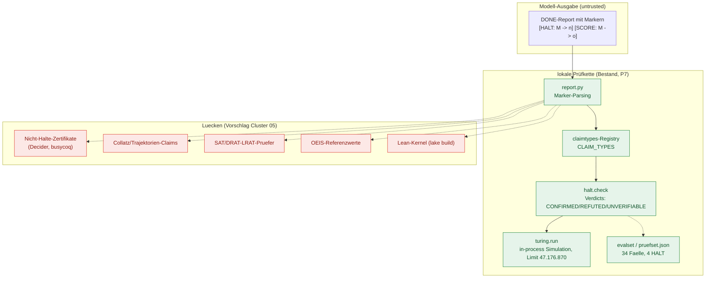

# Brücke zum Prüfer — [HALT]/[SCORE] und die Prüfer-Doktrin

Diese Datei schließt das Testfeld-Kapitel an die **bereits vorhandene lokale Infrastruktur** an: die Prüfer-Doktrin im Wiki `yesdocs/pruefer/wiki/` und die `[HALT]`/`[SCORE]`-Mechanik des Prüfer-Projekts `bemyself` (Branch `yesloop/bemyself-p7-halt`, gemerged in den lokalen `master` als Commit `4fd2b30`). Sie beantwortet drei Fragen: Was steht? Was fehlt für den Testplan (Cluster 05)? Wie verzahnt sich beides mit den Kandidaten aus 04-02/04-04?

Hinweis zur Provenienz: Der yesresearch-Worktree, in dem dieses Wiki entsteht, basiert auf dem P6-Stand (`6d82c4b`); die P7-Dateien sind darin nicht ausgecheckt, aber über den Branch bzw. den lokalen `master` vollständig abrufbar ([git-Referenzen, lokale Quelle](git:yesloop/bemyself-p7-halt, accessed 2026-09-12)). Alle lokalen Belege unten nennen Branch und Pfad.

## 1. Die Prüfer-Doktrin (lokale Quelle)

Die Doktrin unterscheidet drei Ausgänge: `CONFIRMED`, `REFUTED`, `UNVERIFIABLE` — und sie begründet, warum das Werkzeug sie unterscheiden muss: Weil die Asymmetrie zwischen Widerlegen und Beweisen prinzipiell ist, gilt ein `REFUTED` gegen einen geprüften Basissatz, ein `CONFIRMED` ist immer nur Bewährung, und ein fehlender Beleg führt zu `UNVERIFIABLE` [Falsifizierbarkeit, Beleg und Beweislast (lokale Quelle)](../../../pruefer/wiki/01-theorie/falsifizierbarkeit.md, accessed 2026-09-12). Die Beweislast liegt beim Bericht, nicht beim Prüfer; ein Prüfbefund wird pro Behauptung gefällt, nicht pro Bericht [ebd.](../../../pruefer/wiki/01-theorie/falsifizierbarkeit.md, accessed 2026-09-12).

Das Prüfer-Wiki ist selbst vollständig verifiziert (8 Inhaltdateien, 106 Quellen, alle mit Citation-Check und Persona-Review) und dient hier als Doktrin-Referenz [Prüfer-Wiki Index (lokale Quelle)](../../../pruefer/wiki/INDEX.md, accessed 2026-09-12). Für das Testfeld heißt das: Jede A/B-Aufgabe muss als *prüfbare Behauptung* formulierbar sein, und die drei Verdicts sind die einzigen zulässigen Ergebnisse — „grün aussehen" zählt nicht.

Die Durchsetzung ist im Code angelegt: Der Checker-Dispatcher des Prüfer-Projekts hält fest: „a verdict is `CONFIRMED` only when the check actually ran and proved the claim, and a claim that cannot be run is `UNVERIFIABLE` — never `CONFIRMED`" [checks.py (lokale Quelle)](git:yesloop/bemyself-p7-halt:bemyself/checks.py, accessed 2026-09-12).

## 2. Bestand: Die [HALT]/[SCORE]-Mechanik (P7)

### 2.1 Claim-Typ und Verdicts

Ein `[HALT: <machine> -> <steps>]`-Marker behauptet, dass die genannte Maschine der bbchallenge-Standardnotation nach exakt der angegebenen Schrittzahl hält. Ein optionales, in derselben Zeile stehendes `[SCORE: <machine> -> <ones>]` behauptet zusätzlich die Anzahl der Einsen auf dem Band beim Halt. Die Prüfung läuft in-process: „no repository, no subprocess, no network, nothing to sandbox" [halt.py (lokale Quelle)](git:yesloop/bemyself-p7-halt:bemyself/claimtypes/halt.py, accessed 2026-09-12).

Die Verdicts im Detail [ebd.](git:yesloop/bemyself-p7-halt:bemyself/claimtypes/halt.py, accessed 2026-09-12):
- `CONFIRMED` — nur, wenn die Maschine nach exakt der behaupteten Schrittzahl hält (und mit exakt dem behaupteten Score, falls einer angegeben ist).
- `REFUTED` — wenn sie früher hält, **innerhalb** der behaupteten Schritte nicht hält, oder mit anderem Score hält. Der Nicht-Halt-Fall ist ausdrücklich ein *endlicher Zeuge*: „not having halted after n steps proves it cannot halt exactly at step n; it is not a proof that the machine never halts".
- `UNVERIFIABLE` — wenn die Maschine nicht parst, die Schrittangabe keine nicht-negative Ganzzahl ist, die Angabe das ausführbare Limit übersteigt, oder widersprüchliche `[SCORE]`-Marker für dieselbe Maschine vorliegen. Ein `[SCORE]`-Marker ohne zugehörigen `[HALT]`-Marker ist keine Behauptung.

### 2.2 Limit und Kosten

Das Default-Limit beträgt `DEFAULT_HALT_LIMIT = 47_176_870` — die Schrittzahl des BB(5)-Champions; Claims darüber bleiben `UNVERIFIABLE`, per CLI-Flag `--halt-limit` änderbar. Ein Claim am Limit kostet „roughly five seconds of simulation"; das Limit begrenzt jeden Claim, nicht den Bericht [ebd.](git:yesloop/bemyself-p7-halt:bemyself/claimtypes/halt.py, accessed 2026-09-12). Die Muster sind linear geschrieben (ReDoS-Härtung nach Review-Befund, Commit `01f7b54`), weil Berichte als untrusted input gelten [ebd.](git:yesloop/bemyself-p7-halt:bemyself/claimtypes/halt.py, accessed 2026-09-12).

### 2.3 Simulator

`bemyself/turing.py` ist ein eigenständiger Simulator für 2-Symbol-Turingmaschinen der bbchallenge-Notation: Blöcke `<write><move><next>` je Zustand und Symbol, `Z` = Halt, Start in Zustand A auf leerem Band, Kopfposition 0; jede ausgeführte Transition zählt als Schritt (auch die Halt-Transition), der Score zählt die Einsen beim Halt (BB(5)-Konvention: 4098 Einsen). Maximal 25 Zustände (A–Y; Z ist reserviert), Band als zwei wachsende bytearrays, Speicher proportional zu den Schritten [turing.py (lokale Quelle)](git:yesloop/bemyself-p7-halt:bemyself/turing.py, accessed 2026-09-12). Der Simulator ist laut Modul-Docstring „a reimplementation from the notation itself, not a port of any community simulator" — genau das macht ihn als unabhängigen Zeugen brauchbar [ebd.](git:yesloop/bemyself-p7-halt:bemyself/turing.py, accessed 2026-09-12).

### 2.4 Tests und Referenzmaschinen

`tests/test_turing.py` verankert den Simulator doppelt: an handgetracten Kleinstmaschinen (z. B. Halten nach exakt 3 Schritten) und an publizierten Maschinen mit ihren dokumentierten Zahlen — BB(5)-Champion (47.176.870 Schritte, 4098 Einsen), BB(5)-Zweiter (23.554.764 / 4097), Uhing-1984-Halter (2.133.492 / 1915) sowie die BB(6)-Rekordmaschine (hält nicht innerhalb von 1000 Schritten) [tests/test_turing.py (lokale Quelle)](git:yesloop/bemyself-p7-halt:tests/test_turing.py, accessed 2026-09-12). Damit existieren bereits kalibrierte Referenzläufe mit Primärquellen-Verweis im Testkommentar.

Ein Detail mit Diskrepanz-Wert: Der Testkommentar zur BB(6)-Rekordmaschine sagt „S(6) exceeds 2 arrow-up 5", während die BusyBeaverWiki-Seite (Stand 2026-09-12) `S(6) > Σ(6) > 2↑↑↑5` (drei Pfeile) angibt [BB(6) – BusyBeaverWiki](https://wiki.bbchallenge.org/wiki/BB(6), accessed 2026-09-12). Die Kurzform im Testkommentar ist offensichtlich abgekürzt; für den Testplan gilt der Wiki-Stand, und die Diskrepanz wird hier doppelt geführt.

### 2.5 Registrierungs- und Auswertungswege

Neue Claim-Typen sind als Erweiterungspunkt vorgesehen: ein Modul im Paket `bemyself/claimtypes/` plus ein Eintrag in `CLAIM_TYPES`; Report-Parser (`bemyself/report.py`) und Checker-Dispatcher (`bemyself/checks.py`) konsultieren die Registry und brauchen keine Änderung [claimtypes/__init__.py (lokale Quelle)](git:yesloop/bemyself-p7-halt:bemyself/claimtypes/__init__.py, accessed 2026-09-12). Der Standard-Evalsatz (`bemyself/evalset.py`, `tests/data/pruefset.json`) enthält vier HALT-Fälle im ansonsten git-/test-basierten 34-Fall-Set [evalset.py (lokale Quelle)](git:yesloop/bemyself-p7-halt:bemyself/evalset.py, accessed 2026-09-12); die Fixture ist deterministisch gebaut (feste Hashes), der Lauf benötigt kein Netz [ebd.](git:yesloop/bemyself-p7-halt:bemyself/evalset.py, accessed 2026-09-12).

## 3. Was für den Testplan bereits steht

1. **Ein vollständiger Prüfpfad für Halte-Behauptungen**: Marker → Parser → Registry → Simulator → Verdict, in-process, ohne Netz [report.py (lokale Quelle)](git:yesloop/bemyself-p7-halt:bemyself/report.py, accessed 2026-09-12).
2. **Score-Prüfung** in derselben Zeile — deckt die BB-typische Doppelbehauptung (Schritte *und* Einsen) ab [halt.py](git:yesloop/bemyself-p7-halt:bemyself/claimtypes/halt.py, accessed 2026-09-12).
3. **Kalibrierte Referenzwerte** (BB(5)-Champion etc.) als Ground Truth [tests/test_turing.py](git:yesloop/bemyself-p7-halt:tests/test_turing.py, accessed 2026-09-12).
4. **Untrusted-Input-Härtung** (lineare Muster, int-Digit-Cap, Limit) — ein Testfeld kann mit feindlichen/übergroßen Modellantworten umgehen [halt.py](git:yesloop/bemyself-p7-halt:bemyself/claimtypes/halt.py, accessed 2026-09-12).
5. **Drei-Verdict-Disziplin** aus der Doktrin, im Code verankert [checks.py](git:yesloop/bemyself-p7-halt:bemyself/checks.py, accessed 2026-09-12) [falsifizierbarkeit.md (lokale Quelle)](../../../pruefer/wiki/01-theorie/falsifizierbarkeit.md, accessed 2026-09-12).
6. **Der bbchallenge-Notationsstring als formale Schnittstelle**: `1RB1LC_1RC1RB_…` ist selbst eine Mini-Notation mit Parser und exakter Semantik — der perfekte Fixpunkt für Rücküberführbarkeit (Cluster 03): Was auch immer eine Notationsexperiment-Variante erzeugt, muss sich in diesen String plus Behauptung übersetzen lassen [turing.py](git:yesloop/bemyself-p7-halt:bemyself/turing.py, accessed 2026-09-12).

## 4. Was fehlt (Lücken für Cluster 05)

*Eigene Analyse auf Basis der lokalen Quellen — jede Lücke nennt den belegten Mechanismus:*

1. **Nicht-Halte-Behauptungen fehlen als Claim-Typ.** Die `[HALT]`-Mechanik kann nur endliche Horizonte widerlegen; ein „hält nie"-Claim ist nicht ausdrückbar und wird zu Recht nicht als `REFUTED` ausgegeben [halt.py](git:yesloop/bemyself-p7-halt:bemyself/claimtypes/halt.py, accessed 2026-09-12). Für BB(6)-Decider-Aufgaben wäre ein Zertifikats-Claim nötig (z. B. Zykel-/Translated-Cycler-Zeuge, busycoq-artig) [busycoq](https://github.com/meithecatte/busycoq, accessed 2026-09-12).
2. **Collatz-artige Fragmente fehlen.** Kein Claim-Typ für Trajektorien (`[COLLATZ: n -> steps]`, `4/n`-Tripel etc.); eine Erweiterung wäre nach dem Registry-Rezept billig, braucht aber Größen-Limits (die 2⁷¹-Verifikationsdimension sprengt das HALT-Limit-Denken) [Barina-Projektseite](https://pcbarina.fit.vutbr.cz/, accessed 2026-09-12) [claimtypes/__init__.py](git:yesloop/bemyself-p7-halt:bemyself/claimtypes/__init__.py, accessed 2026-09-12).
3. **SAT-/DRAT-Anbindung fehlt.** Für die SAT-entschiedenen Klassiker (Pythagoreische Tripel, Keller, Schur) gibt es weder Marker noch lokalen Prüfer; drat-trim/cake_lpr müssten als Prüfpfad angebunden werden [drat-trim](https://github.com/marijnheule/drat-trim, accessed 2026-09-12) [cake_lpr](https://github.com/tanyongkiam/cake_lpr, accessed 2026-09-12).
4. **Referenzwert-Prüfung (OEIS) fehlt.** Ein Claim wie `[SEQ: A060843 -> a(5)=47176870]` wäre trivial zu prüfen, existiert aber nicht; heute ist der einzige Zahlen-Prüfpfad die Simulation [A060843 – OEIS](https://oeis.org/A060843, accessed 2026-09-12) [claimtypes/__init__.py](git:yesloop/bemyself-p7-halt:bemyself/claimtypes/__init__.py, accessed 2026-09-12).
5. **Score-only-Claims fehlen** — `[SCORE]` ohne `[HALT]` ist ausdrücklich keine Behauptung; Aufgaben, die nur den Score abfragen, sind nicht abbildbar [halt.py](git:yesloop/bemyself-p7-halt:bemyself/claimtypes/halt.py, accessed 2026-09-12).
6. **Report-Budget/Timeouts fehlen.** Das Claim-Limit ist pro Claim; ein Bericht mit vielen langen Claims kann Minuten binden („one claim at the limit means roughly five seconds") [ebd.](git:yesloop/bemyself-p7-halt:bemyself/claimtypes/halt.py, accessed 2026-09-12). Für A/B-Läufe mit hunderten Aufgaben braucht der Harness (05-04) ein Gesamtbudget.
7. **Formale Brücke fehlt.** Für Lean-verifizierte Aufgaben (formal-conjectures, FrontierMath-Erdős) gibt es keinen lokalen Anschluss; `lake build` als Kernel-Check wäre die nächste Ausbaustufe [formal-conjectures](https://github.com/google-deepmind/formal-conjectures, accessed 2026-09-12).
8. **Visualisierung/Logging für A/B.** Weder Token-Zählung noch Trial-Logs sind Teil des Prüfer-Scopes; der Test-Harness muss sie selbst mitbringen (Grenze zieht `evalset.py`, das nur deterministische Fixtures kennt) [evalset.py](git:yesloop/bemyself-p7-halt:bemyself/evalset.py, accessed 2026-09-12).

*Abbildung 1: Bestand und Lücken der lokalen Prüfkette (eigene Darstellung auf Basis der zitierten P7-Dateien; grün = vorhanden, rot = fehlend).*

## 5. Verzahnung: Testfeld-Kandidaten → lokale Prüfpfade

| Kandidaten-Fragment (aus 04-02/04-04) | Lokaler Prüfpfad heute | Lücke bis zum A/B-Test |
|---|---|---|
| Halten einer TM nach n Schritten (BB-Fragmente) | `[HALT]` + `turing.run` — vorhanden | — |
| Score-Behauptungen (Einsen) | `[SCORE]` — vorhanden | Score-only-Fälle fehlen |
| Nicht-Halten (Decider-Fragmente) | nicht abbildbar | Zertifikats-Claim (Lücke 1) |
| Collatz-Trajektorie (Schritte bis 1) | nicht abbildbar | Trajektorien-Claim (Lücke 2) |
| Goldbach-/Erdős–Straus-Zeuge (Partition/Tripel) | nicht abbildbar | arithmetischer Zeugen-Claim (Lücke 2, analog) |
| OEIS-Referenzwerte (z. B. A060843) | nicht abbildbar | Referenz-Claim (Lücke 4) |
| SAT/UNSAT-Verdikt | nicht abbildbar | Prüfer-Anbindung (Lücke 3) |
| Lean-Beweis | nicht abbildbar | Kernel-Anschluss (Lücke 7) |

*Tabelle 1: Abdeckung der Kandidaten-Fragmente durch die vorhandene Prüfkette (eigene Analyse; Quellen wie in Abschnitt 2–4).*

Für die Notation-Hypothese ist Punkt 6 aus Abschnitt 3 der eigentliche Gewinn: Die bbchallenge-Notation ist eine **existierende formale Mini-Sprache**, in die hinein und aus der heraus übersetzt werden kann. Ein A/B-Test kann damit prüfen, ob eine modell-nahe Notation dieselben Halte-Behauptungen zuverlässiger/kompakter erzeugt — der Prüfpfad dafür steht bereits.

## Quellen

**Lokale Quellen** (Branch `yesloop/bemyself-p7-halt`; gemerged in lokalen `master` als `4fd2b30`, Zugriff 2026-09-12)
1. `bemyself/claimtypes/halt.py` — [HALT]/[SCORE]-Claim-Typ, Verdicts, Limit, Härtung.
2. `bemyself/turing.py` — unabhängiger TM-Simulator (parse/run), bbchallenge-Notation, Semantik.
3. `tests/test_turing.py` — Hand-Traces und publizierte Referenzmaschinen (BB(5)-Champion etc.).
4. `bemyself/claimtypes/__init__.py` — Claim-Typ-Registry und Erweiterungsrezept.
5. `bemyself/report.py` — Marker-Parsing, lineare Muster.
6. `bemyself/checks.py` — Checker-Dispatcher, Verdict-Disziplin, Allowlist.
7. `bemyself/evalset.py` + `tests/data/pruefset.json` — deterministische Fixture, 34-Fall-Set.
8. `yesdocs/pruefer/wiki/01-theorie/falsifizierbarkeit.md` — Doktrin: CONFIRMED/REFUTED/UNVERIFIABLE, Beweislast.
9. `yesdocs/pruefer/wiki/INDEX.md` — Verifikationsstand des Prüfer-Wikis (106 Quellen).
10. `yesdocs/deepseek-math-notation/PLAN.md` — Auftrag, Zielmodell, Erfolgsbild.

**Web-Primärquellen** (accessed 2026-09-12)
11. BB(6) – BusyBeaverWiki. https://wiki.bbchallenge.org/wiki/BB(6)
12. busycoq. https://github.com/meithecatte/busycoq
13. drat-trim. https://github.com/marijnheule/drat-trim
14. cake_lpr. https://github.com/tanyongkiam/cake_lpr
15. A060843 – OEIS. https://oeis.org/A060843
16. Convergence verification of the Collatz problem (Barina, Projektseite). https://pcbarina.fit.vutbr.cz/
17. formal-conjectures. https://github.com/google-deepmind/formal-conjectures
