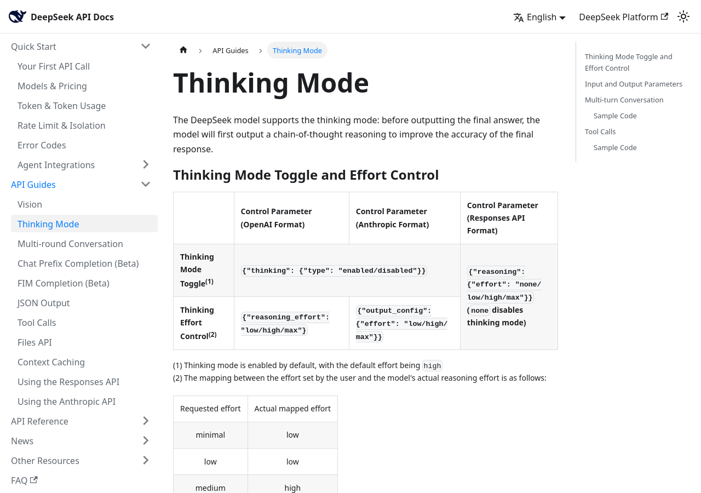

# Designprinzipien einer modell-nativen Mathematik-Notation

Dieses Dokument begründet die acht Designprinzipien, auf denen die Notation V1 (Datei [05-02](05-02-notations-spezifikation.md)) aufbaut. Jedes Prinzip hat die Form: **Setzung** (unsere Entscheidung, keine Quellenpflicht), **Begründung/Beleglage** (mit Inline-Zitaten), **Falsifizierbare Vorhersage** (was ein Test zeigen müsste, um das Prinzip zu stützen oder zu Fall zu bringen), **Risiko/Gegenbeleg**. Die Prinzipien sind bewusst so formuliert, dass [05-05](05-05-ablation-protokoll.md) sie einzeln bestätigen oder widerlegen kann — die Evidenzlage ist an mehreren Stellen ausdrücklich dünn, und das wird markiert statt geglättet.

Zielmodell ist „DeepSeek V4.1 Flash“ bzw. lokal `deepseek/deepseek-flash` (Kontext 1.000.000, Output-Grenze 8.192 laut lokaler Konfiguration, interleaved reasoning; lokale Quelle: `~/.config/opencode/opencode.json`). Die öffentliche DeepSeek-Dokumentation nennt für dasselbe Modell (Modellversion „DeepSeek-V4.1-Flash“; API-Name `deepseek-flash`, Legacy-Namen `deepseek-v4-flash*` werden noch akzeptiert, aber auf V4.1-Flash umgeleitet) eine maximale Output-Länge von 384K [Models & Pricing](https://api-docs.deepseek.com/quick_start/pricing, accessed 2026-09-12); die lokale Grenze von 8.192 Tokens ist also eine Serving-Konfiguration dieser Instanz, keine Modelleigenschaft. Das Notation-Design richtet sich gegen die **engere lokale Grenze** — was bei 8.192 Tokens funktioniert, funktioniert auch bei mehr.

Ebenso dokumentationspflichtig beeinflusst die Denkmodus-Steuerung das Design: Der Thinking-Mode ist standardmäßig aktiv, mit `reasoning_effort` als Steuerparameter [Thinking Mode](https://api-docs.deepseek.com/guides/thinking_mode, accessed 2026-09-12) — siehe Abbildung 1.

*Abbildung 1: Thinking-Mode-Steuerung der DeepSeek-API (Thinking-Toggle, Effort-Mapping). Quelle: [Thinking Mode](https://api-docs.deepseek.com/guides/thinking_mode, accessed 2026-09-12), Screenshot mit Firefox Headless am 2026-09-12.*

## Evidenzlage in Kurzform

Gesichert (mit Messwerten):

- **Ziffern-Tokenisierung beeinflusst Arithmetik messbar.** Bei GPT-3.5 hebt erzwungene rechts-nach-links-Tokenisierung (über Tausender-Kommas) die Few-Shot-Genauigkeit der Addition 7–9-stelliger Zahlen von 75,6 % auf 97,8 %; bei Längen-Mismatch (Antwort länger als Addenden) fällt die links-nach-rechts-Variante auf 8,25 %, und die Restfehler sitzen fast immer an Token-Grenzen (Off-by-one) [Tokenization counts](https://arxiv.org/abs/2402.14903, accessed 2026-09-12). Zweitbeleg: Fragmentierung numerischer Strings (die Studie untersucht Datumsangaben) korreliert mit bis zu 10 Punkten Genauigkeitsverlust, wenn seltene Kalenderdaten im Spiel sind [Date Fragments](https://arxiv.org/abs/2505.16088, accessed 2026-09-12). Die internen Rechen-Schaltkreise (MLP-Subgruppen je Ziffernposition) existieren dagegen **unabhängig** von Modellgröße und Tokenisierungsstrategie [Modular Arithmetic](https://arxiv.org/abs/2508.02513, accessed 2026-09-12).
- **Formatoberfläche ist eine Störgröße in zweistelliger Prozentpunkt-Höhe.** Semantisch äquivalente Prompt-Formate erzeugen bis zu 76 Punkte Accuracy-Spread (LLaMA-2-13B, Median 7,5 Punkte) [FormatSpread](https://arxiv.org/abs/2310.11324, accessed 2026-09-12). Strukturklassen (JSON vs. Markdown vs. Klartext) verschieben MMLU um ~10 Punkte (59,7 vs. 50,0; GPT-3.5-turbo) und HumanEval pass@1 beim stärksten getesteten Modell (GPT-4-32k) um mehr als das Dreifache (76,2 vs. 21,95; bei GPT-3.5 nur Faktor ~1,5) [Does Prompt Formatting](https://arxiv.org/abs/2411.10541, accessed 2026-09-12). In derselben Größenordnung: Prompt-Stil-Wechsel verschieben ARC-Easy um 45 Punkte (72,4 % vs. 26,5 %) [Lessons from the Trenches](https://arxiv.org/abs/2405.14782, accessed 2026-09-12).
- **Explizite Zwischenschritte wirken.** „Let's think step by step“ hebt MultiArith von 17,7 % auf 78,7 % [Zero-Shot Reasoners](https://arxiv.org/abs/2205.11916, accessed 2026-09-12); Scratchpad-Training verbessert Polynom-Evaluation von 8,8 % auf 20,1 % und Python-Tracing von 11 % auf 26,5 % [Scratchpads](https://arxiv.org/abs/2112.00114, accessed 2026-09-12). Theoretisch erklärt das die Seriellitätsschranke: konstant-tiefe Transformer ohne Zwischenschritte sind auf TC⁰ beschränkt, mit T Zwischenschritten lösen sie jedes Problem, das Schaltkreise der Größe T lösen [CoT & Serial](https://arxiv.org/abs/2402.12875, accessed 2026-09-12).
- **Sichtbare Rechnung ist kein Beweis.** Chain-of-Thought rationalisiert Bias-Einflüsse, statt sie zu benennen (Genauigkeit sinkt um bis zu 36 % bei manipulierten Optionen) [Unfaithful Explanations](https://arxiv.org/abs/2305.04388, accessed 2026-09-12); bedeutungslose Filler-Tokens erlauben verstecktes Rechnen [Think Dot by Dot](https://arxiv.org/abs/2404.15758, accessed 2026-09-12); latentes Denken (Coconut) gewinnt Planungs-Tasks (ProsQA 97,0 % vs. 77,5 % bei ~⅓ Tokens), verliert aber GSM8k (34,1 % vs. 42,9 %) und ist per Konstruktion nicht textuell prüfbar [Coconut](https://arxiv.org/abs/2412.06769, accessed 2026-09-12).
- **Symbolische Schreibweise ist dem Modell näher als Prosa.** Bei LaTeX-reichen Mathematikaufgaben bevorzugt das untersuchte Modell die symbolische LaTeX-Ground-Truth gegenüber verbalisierten Umschreibungen und ASR-Transkripten (eine Zwischenordnung „verbal vs. ASR“ ist im Paper nicht belegt) [Spoken-MQA](https://arxiv.org/abs/2505.15000, accessed 2026-09-12); die hochwertigsten offenen Mathe-Korpora bestehen aus text+LaTeX [OpenWebMath](https://arxiv.org/abs/2310.06786, accessed 2026-09-12).
- **Format-Distanz ist nicht überbrückbar per Gewohnheit.** Transfer von vertrauter mathematischer Notation zu maschinen-/erzählnahen Formaten bleibt selbst nach Fine-Tuning schwierig [SATQuest](https://arxiv.org/abs/2509.00930, accessed 2026-09-12).

Offen (nicht belegt — wird als Lücke geführt):

- Für die DeepSeek-Familie ist die **Ziffern-Tokenisierung öffentlich nicht dokumentiert**: Der V3-Report nennt nur Byte-Level-BPE mit 128K Vokabular, keine Zahlen-Chunking-Regel; die Hugging-Face-Modellkarte und die Diskussionen dazu wurden von uns nicht systematisch gesichtet — belastbar ist die Aussage nur für den Technical Report [DeepSeek-V3](https://arxiv.org/abs/2412.19437, accessed 2026-09-12). Lokal empirisch prüfbar (Tokenizer-Probe, siehe [05-04](05-04-test-harness.md)).
- **Keine kontrollierte ASCII-vs-Unicode-vs-LaTeX-Mathe-Studie** auffindbar; die vorhandenen Format-Studien testen generische Klassen (JSON/XML/Markdown), nicht Mathematik-Symbole. Dieser Punkt ist die größte Evidenzlücke des Entwurfs und wird in V1 als **offener Schalter** (Sub-Ablation) behandelt, nicht als Dogma.
- **Interleaved-Reasoning-Formate** (persistiertes `reasoning_content` zwischen Tool-Turns) sind nur über die Herstellerdoku belegt [Thinking Mode](https://api-docs.deepseek.com/guides/thinking_mode, accessed 2026-09-12).

Die Hypothesenform (schwach vs. stark) und die Erfolgskriterien stehen in [05-06](05-06-erfolgskriterien-risiken.md).

## P1 — Kanonische Zahlenschreibung mit ausrichtungsfähigen Spalten

**Setzung:** Zahlen werden als reine Ziffernfolgen mit `.`-Dezimaltrenner geschrieben, ohne Tausender-Trenner in Einzelzahl-Erwähnungen. In arithmetischen Blöcken (`calc`) werden Zahlen in festen, **rechtsbündigen Spalten** mit Leerzeichen ausgerichtet geschrieben; jede Zeile enthält höchstens eine Operation. Komma-gruppierte Schreibweise (`1,048,576`) ist für den Notation-Kern **verboten**, bleibt aber als Sub-Ablations-Arm erhalten.

**Begründung:** Die stärkste gemessene Einzelmaßnahme im Korpus ist die ausrichtungsrichtige, tokenizer-kompatible Zahlendarstellung (75,6 % → 97,8 %; Längen-Mismatch 8,25 %) [Tokenization counts](https://arxiv.org/abs/2402.14903, accessed 2026-09-12); Ergänzungsbelege: Less-Significant-Digit-first-Ausgabe verbessert Arithmetik bei einem Drittel des Trainings-Tokenbudgets [Reverse That Number](https://arxiv.org/abs/2403.05845, accessed 2026-09-12), Fragmentierung numerischer Strings kostet bis zu 10 Punkte [Date Fragments](https://arxiv.org/abs/2505.16088, accessed 2026-09-12). Die zugrundeliegende Rechnung ist ziffernpositional organisiert — Ziffernpositionen explizit zu machen ist damit mechanistisch motiviert [Modular Arithmetic](https://arxiv.org/abs/2508.02513, accessed 2026-09-12). **Einschränkung:** Diese Belege stammen aus Tokenizern mit dokumentiertem Ziffern-Chunking (GPT-Familie); für DeepSeek ist das Chunking unbekannt [DeepSeek-V3](https://arxiv.org/abs/2412.19437, accessed 2026-09-12). Die Regel ist damit eine begründete Setzung unter Unsicherheit, kein bewiesener Transfer.

**Falsifizierbare Vorhersage:** (a) Die Tokenizer-Probe aus [05-04](05-04-test-harness.md) zeigt für typische Zahlen des Test-Sets, ob Chunk-Grenzen an Ziffernblöcken liegen; (b) im Mikro-Benchmark (Addition/Multiplikation mehrstelliger Zahlen) ist die Spalten-Schreibweise der komma-gruppierten und der flachen Schreibweise überlegen (Richtung: ≥ 5 Prozentpunkte, α = 0,05, gepaart). **Wenn kein Unterschied messbar ist, ist P1 für dieses Modell wirkungslos und der Sub-Arm wird fallengelassen.**

**Risiko:** Bei 8.192 Output-Tokens kann Spaltenausrichtung Budget kosten (Leerzeichen je Zeile). Gegenmaßnahme: Ausrichtung nur innerhalb von `calc`-Blöcken, nicht in Prosa-reasoning.

## P2 — Eine Zeile, ein Schritt; explizite Schritt-IDs

**Setzung:** Jede Behauptung, jeder Operationsschritt und jede Fallunterscheidung wird als eigene Zeile mit fortlaufender ID geschrieben (`S1:`, `S2:`, …). Mehrere unabhängige Aussagen in einer Zeile sind unzulässig. Referenzen auf frühere Zeilen erfolgen über die ID (`siehe S4.` in der Denkzone); eine formale Zeilenbezugs-Syntax zwischen Behauptungen ist in V1 bewusst nicht vorgesehen — Verdikte hängen an Claims, nicht an Denkzeilen ([05-02](05-02-notations-spezifikation.md) §3).

**Begründung:** Zwischenschritte verlagern serielle Tiefe in die Sequenz — die theoretische Schranke konstant-tiefer Transformer ohne Zwischenschritte (TC⁰) und die empirischen Scratchpad-Effekte (Polynom 8,8 → 20,1 %, Tracing 11 → 26,5 %) stützen das [CoT & Serial](https://arxiv.org/abs/2402.12875, accessed 2026-09-12), [Scratchpads](https://arxiv.org/abs/2112.00114, accessed 2026-09-12), [Zero-Shot Reasoners](https://arxiv.org/abs/2205.11916, accessed 2026-09-12). Explizite IDs machen Zeilen zudem parsebar — Voraussetzung für Klammerung, Zeugen-Verweise und den HALT-Trace ([05-03](05-03-mapping-formal.md)). Einschränkung: Scratchpad-Formate brauchen Trainings-/Instruktionssignal; im Low-Data-Regime war Direct-Ausführung dem Scratchpad überlegen (MBPP per-task 10,3 % vs. 5,1 %) — die Umgebung muss das Format also sauber instruieren [Scratchpads](https://arxiv.org/abs/2112.00114, accessed 2026-09-12).

**Falsifizierbare Vorhersage:** Arm „Zeile+ID“ ist im Mikro- und Makro-Benchmark dem Vergleichsarm (freie Prosa-Zwischenschritte, gleiches Prompt-Budget) überlegen; mindestens: mehr korrekt geprüfte Endbehauptungen (siehe [05-05](05-05-ablation-protokoll.md) Metriken). Kein Effekt → P2 fallen.

**Risiko:** Erzwungene Zeilenstruktur kann bei Aufgaben, die eher Übersicht als Serialität brauchen (Beweisstrategie wählen), Overhead erzeugen. Deshalb gilt P3 (Zwei-Zonen). vgl. auch: ein Platzhalter-Zeichen pro Denkschritt war in einer Kontrollbedingung ein schwacher CoT [Think Dot by Dot](https://arxiv.org/abs/2404.15758, accessed 2026-09-12) — Zeilen müssen **Inhalt** tragen.

## P3 — Zwei-Zonen-Prinzip: freie Denkzone, strikte Behauptungszone

**Setzung:** Ein Notations-Blatt hat zwei Zonen: (1) die **Denkzone** (Zeilen `S…:` mit lockeren Regeln — Kurzprosa erlaubt, solange jede Zeile eine Aussage/Operation mit ID enthält) und (2) die **Behauptungszone** am Ende (strikt: `CLAIM`- und `WITNESS`-Zeilen in exakter Grammatik; die Verdikte selbst schreibt der Runner, nicht das Blatt). Nur die Behauptungszone wird vom Parser formal verlangt; Denkfehler werden nicht als Formatfehler bestraft.

**Begründung:** Strikte Ausgabe-Grammatiken (JSON/XML) verschlechtern Reasoning messbar, und der Effekt wächst mit der Strenge der Beschränkung [Let Me Speak Freely](https://arxiv.org/abs/2408.02442, accessed 2026-09-12). Gleichzeitig braucht die Verifikation (Zeugen, HALT) ein striktes, maschinenlesbares Ende. Die Zwei-Zonen-Trennung ist der Versuch, diesen Trade-off aufzulösen: Denken frei, Belegung strikt. Das entspricht der dokumentierten Praxis format-trainierter Systeme: DeepSeek-R1 erhält einen Format-Reward gerade auf abgegrenzte Reasoning-Bereiche, außerhalb derer der Output frei bleibt [DeepSeek-R1](https://arxiv.org/abs/2501.12948, accessed 2026-09-12); die DeepSeek-API erklärt `reasoning_content` zum separaten Kanal [Thinking Mode](https://api-docs.deepseek.com/guides/thinking_mode, accessed 2026-09-12).

**Falsifizierbare Vorhersage:** Ein Arm mit striktem Format **durchgängig** (auch in der Denkzone) erzeugt auf schweren Aufgaben mehr Formatabbrüche und/oder weniger korrekte Behauptungen als das Zwei-Zonen-Blatt bei gleichem Aufgabenpool. Kein Nachteil des strikten Arms → P3 vereinfachbar (Notation kann überall streng sein).

**Risiko:** Zwei-Zonen-Formate sind schwerer zu instruieren als ein einheitliches Format; bei kleinen Output-Budgets kostet die Behauptungszone Platz. Mitigation: Behauptungszone auf das Notwendige begrenzt (ein `CLAIM` je Ergebnis, nicht je Zwischenschritt).

## P4 — Zeugenpflicht: jede Behauptung braucht einen maschinenprüfbaren Zeugen

**Setzung:** Jede Behauptung in der Behauptungszone trägt eine `WITNESS`-Zeile, die auf dieser Maschine **ausführbar** ist (Python-stdlib-Ausdruck über eine definierte Bibliothek kleiner Funktionen, später auch Metamath-/SMT-/Lean-Referenzen). Behauptungen ohne Zeugen sind im Format unzulässig; der Verifier markiert sie `UNVERIFIABLE`. Ein Notations-Blatt endet mit einem `[HALT]`-Trace, der pro Claim den Verifikationsstatus nennt.

**Begründung:** Sichtbare Rechnung ist nachweislich kein Beweis: CoT rationalisiert Bias unbemerkt (−36 % auf manipulierten Aufgaben) [Unfaithful Explanations](https://arxiv.org/abs/2305.04388, accessed 2026-09-12), Filler-Tokens verstecken Rechnung [Think Dot by Dot](https://arxiv.org/abs/2404.15758, accessed 2026-09-12), latentes Denken entzieht sich der Textprüfung ganz [Coconut](https://arxiv.org/abs/2412.06769, accessed 2026-09-12). Der Wert liegt in der Trennung: teures Finden (Modell) — billiges Prüfen (Verifier) [Draft, Sketch, and Prove](https://arxiv.org/abs/2210.12283, accessed 2026-09-12), [Metamath-Buch](https://us.metamath.org/downloads/metamath.pdf, accessed 2026-09-12). Auf dieser Maschine existiert bereits eine Verifier-Maschinerie mit Claim-Typen für Git-/Test-Marker und dem Verdikt-Modell `CONFIRMED|REFUTED|UNVERIFIABLE` (lokal: `bemyself/report.py`, `bemyself/model.py`, `bemyself/eval.py`); die Erweiterung um mathematische Claim-Arten (claimtypes-Registry, Branch `yesloop/bemyself-p7-halt`) ist offen — siehe [05-03](05-03-mapping-formal.md) und [04-05](../04-offene-probleme/04-05-bruecke-pruefer.md).

**Falsifizierbare Vorhersage:** Falsch-bestätigte Modellbehauptungen sind im Behandlungsarm selten (gezählt gegen Runner-Verdikte; Metrik K4 in [05-06](05-06-erfolgskriterien-risiken.md)), der S5-Arm vergleicht die Zeugenarten; als Kontrollseite dient die „stille Falschantwort-Rate“ (falsche Endantwort ohne Warnsignal) des Prosa-Arms. Ein eigener Arm „mit vs. ohne Zeugenpflicht“ ist als Erweiterung zurückgestellt — der Hauptkontrollarm hat strukturell keine Claims, die man falsch bestätigen könnte. Zugleich steigt die Parsbarkeit (Anteil Blätter mit formal vollständiger Behauptungszone). Gegenläufig: Wenn die Zeugenpflicht die Bearbeitungsqualität senkt (Tam-Effekt), zeigt sich das als niedrigere Rate korrekter Endantworten trotz Formattreue.

**Risiko:** Der Zeuge selbst kann falsch sein (fehlerhafte Modell-Witness). Das fängt die Verifier-Kette: Der Zeuge wird ausgeführt, nicht geglaubt; ein falscher Zeuge wird `REFUTED` und im Trace sichtbar. Bewusste Grenze: Zeugen zertifizieren **Instanzen/endliche Fälle**, keine universalen Beweise — diese Grenze beschreibt [05-03](05-03-mapping-formal.md).

## P5 — Vollständige Klammerung, explizite Quantoren, keine stillen Konventionen

**Setzung:** In der Kernsprache gibt es keine Operator-Präzedenz: Jeder zusammengesetzte Ausdruck wird vollständig geklammert. Quantoren (`forall x in Z: …`, `exists x in N: …`) sind immer explizit. Es gibt keine impliziten mathematischen Konventionen (kein „üblich ist gemeint“, keine versteckten Multiplikationszeichen).

**Begründung:** Format-Features im Kleinen (Spacing, Item-Wrapper, Nummerierung) haben messbare Spreads (Median 0,13–0,24 normierte Spreads; größte Einzel-Features) [FormatSpread](https://arxiv.org/abs/2310.11324, accessed 2026-09-12). Autoformalisierungs-Fehlertaxonomien zeigen, dass Mehrdeutigkeit/Auslassung genau die Verlustkategorien sind („inconsistent/missing assumption“, „fail to align definitions“) [Autoformalization](https://arxiv.org/abs/2205.12615, accessed 2026-09-12). Volle Klammerung und explizite Quantoren machen jede Zeile zu einer eindeutigen, maschinell übersetzbaren Formel — Voraussetzung für das Mapping in [05-03](05-03-mapping-formal.md). Gegenbeleg-Ehrlichkeit: Präzedenz-Regeln sind in der Trainingsverteilung extrem häufig (jede Mathe-Quelle nutzt sie) [OpenWebMath](https://arxiv.org/abs/2310.06786, accessed 2026-09-12); ob volle Klammerung hilft oder schadet, ist **empirisch offen** — deshalb Sub-Ablation.

**Falsifizierbare Vorhersage:** Blätter mit vollständiger Klammerung produzieren (a) eine höhere Parser-Erfolgsrate (0 Ambiguitäten) und (b) im Formal-Roundtrip (05-03-Testplan) weniger Mapping-Fehler als minimal geklammerte. Kein Nachteil bei (b) → Klammerregel lockern.

**Risiko:** Klammer-Overhead kostet Tokens (Budget!) und kann vom vertrauten Schreibstil abweichen. Mitigation: Klammerregel gilt nur in der Kernsprache der Behauptungszone; die Denkzone darf normale Präzedenz verwenden (P3).

## P6 — Lokalität: kurze Distanzen, Definitionen früh, ID statt Referenz-Wiederholung

**Setzung:** Definitionen und Voraussetzungen stehen am Blattanfang; zwischen Definition und Verwendung liegen möglichst wenige Zeilen; entfernte Referenzen werden als ID + Kurz-Restatement geschrieben, nie als reiner Verweis auf weit entfernten Text.

**Begründung:** Positions-Effekte sind robust belegt: relevante Information in der Mitte langer Kontexte geht verloren (U-Form) [Lost in the Middle](https://arxiv.org/abs/2307.03172, accessed 2026-09-12); Attention konzentriert sich mechanistisch auf frühe Anker-Tokens (Attention Sinks) [StreamingLLM](https://arxiv.org/abs/2309.17453, accessed 2026-09-12). Beide Befunde stammen aus der Kürzere-Kontexte-Ära (2023) und sind auf 1M-Kontexte **nicht direkt übertragbar** — sie dienen hier als Mechanismus-Anker, nicht als Messwert für V4.1 Flash. Ergänzend: Die API-Doku macht klar, dass bei Tool-Nutzung alle vorherigen `reasoning_content`-Blöcke zurückgesendet und in den Kontext aufgenommen werden [Thinking Mode](https://api-docs.deepseek.com/guides/thinking_mode, accessed 2026-09-12) — Notation muss damit rechnen, dass Denkprotokolle über Turns hinweg persistieren und an Distanz gewinnen.

**Falsifizierbare Vorhersage:** Ein Positions-Ablationsexperiment (Definition am Anfang vs. Mitte vs. Ende eines ~50k-Token-Kontexts) zeigt beim Zwei-Zonen-Blatt messbare Unterschiede zugunsten „Anfang“; wenn kein Effekt messbar ist, kann P6 für dieses Modell entspannt werden. **Scope:** Dieser Positions-Arm ist nicht Teil des ersten Laufs — [05-05](05-05-ablation-protokoll.md) reserviert dafür kein Budget; P6 bleibt bis dahin ungetestet statt unbelegt (offene Lücke, kein verstecktes Versprechen).

**Risiko:** Überlokalität (alles vorne) bläht den Anfang und wiederholt sich — Budget-Kosten. Gegenmaßnahme: Restatements nur für die unmittelbar benötigten Größen.

## P7 — Budget-Disziplin und ASCII-Default (Symbolfrage offen)

**Setzung:** Die Notation ist ASCII-first: Operatoren und Schlüsselwörter in ASCII; Unicode-Mathematikzeichen sind im kanonischen Blatt nicht zulässig (dürfen in Sub-Arms getestet werden). Jede Zeile soll ≤ ~12 Tokens (Richtwert, nicht hart) beanspruchen; lange Beweisketten werden über Zeugen externalisiert statt ausgeschrieben. Es gilt das lokale Output-Limit von 8.192 Tokens pro Antwort (lokale Quelle: `~/.config/opencode/opencode.json`; öffentliche Angabe 384K [Models & Pricing](https://api-docs.deepseek.com/quick_start/pricing, accessed 2026-09-12) — Design konservativ gegen 8.192).

**Begründung:** Effizienz von Repräsentationswahl ist belegt: xVal erzeugt 1 Token/Zahl bei OoD-Gewinnen [xVal](https://arxiv.org/abs/2310.02989, accessed 2026-09-12); LSD-first-Arithmetik brauchte ein Drittel des Trainingsbudgets [Reverse That Number](https://arxiv.org/abs/2403.05845, accessed 2026-09-12). **Keine belastbare Quelle** für ASCII vs. Unicode: die größte Lücke. Indirekt: Das Modell bevorzugt symbolische (LaTeX-artige) Formen gegenüber verbalen [Spoken-MQA](https://arxiv.org/abs/2505.15000, accessed 2026-09-12) — das spricht weder klar für ASCII noch für Unicode; ein kontrollierter Symbolvergleich fehlt. Der ASCII-Default ist deshalb Setzung mit Sub-Ablation (Symbol-Substitutionstest), nicht Behauptung.

**Falsifizierbare Vorhersage:** (a) Tokenizer-Probe: Token-Kosten gängiger Symbole (`sum`, `forall`, `<=`, `->`, `{`…) vs. Unicode-Äquivalente; (b) Sub-Ablation „ASCII-Kern vs. Unicode-Kern“ im Mikro-Benchmark. Wenn Unicode messbar günstiger/besser ist, wird der Default gewechselt — die Notation hat dafür einen Schalter.

**Risiko:** ASCII-Klammer-/Schlüsselwortketten sind länger als etablierte mathematische Symbolik; bei 8.192 Tokens kann das Blätter vorzeitig abschneiden. Mitigation: Zeugen externalisieren, Präambel einmal, kurze IDs.

## P8 — Rücküberführbarkeit als Typdisziplin der Notation

**Setzung:** Jede Notation-Zeile liegt in genau einer von zwei Klassen: **(F)** formel-reine Aussage (mappt auf eine Formel in einem definierten Fragment von Lean 4 / Metamath; Fragment-Liste: [05-03](05-03-mapping-formal.md) §2) oder **(P)** prozedurale Aussage (mappt auf einen ausführbaren Zeugen (P4)). Zeilen, die in keine Klasse fallen, sind im kanonischen Blatt unzulässig. Die Notation ist damit prüfungs-durchsichtig: Was das Modell rechnet, bleibt in einem Fragment, das ein Prüfer nicht „glauben“, sondern übersetzen und nachprüfen kann.

**Begründung:** Die Rücküberführbarkeit in formale Mathematik ist die zweite Hälfte der Hypothese (Zeugen statt Glauben, Plan.md): Term/Beweis-Mapping ist der Kern der Curry-Howard-Trennung von Finden und Prüfen [SEP Type Theory](https://plato.stanford.edu/entries/type-theory-intuitionistic/, accessed 2026-09-12) — Beweisterme in Lean [TPIL](https://lean-lang.org/theorem_proving_in_lean4/Propositions-and-Proofs/, accessed 2026-09-12) und Substitutionsschritte in Metamath [Metamath-Buch](https://us.metamath.org/downloads/metamath.pdf, accessed 2026-09-12) sind die zwei Enden des Kontinuums (reiche Taktikwelt vs. minimaler Trusted Kernel). Die Zulässigkeitsregel wird in [05-03](05-03-mapping-formal.md) als Mappingtabelle + Roundtrip-Test operationalisiert.

**Falsifizierbare Vorhersage:** Ein Klassifikator/Übersetzer (Parser-Renderer in 05-03) stuft ≥ 95 % der Zeilen eines Testkorpus eindeutig in F oder P ein, und die F-Klasse lässt sich per Roundtrip (Notation→Formel→Notation) stabil übersetzen. Wenn der Anteil unklassifizierbarer Zeilen hoch bleibt, ist das starke Ziel der Rücküberführbarkeit nicht erreicht — die Hypothese reduziert sich auf den schwachen Teil (Bindung an dieses Modell).

**Risiko:** Volle Universalität ist mit endlichen Zeugen nicht erreichbar (P4-Grenze); die Klassendisziplin bedeutet, dass manche mathematischen Gedanken im kanonischen Blatt **nicht ausdrückbar** sind. Das ist bewusst: prüfbare Teilmenge statt voller Ausdrucksstärke — die Testfeld-Wahl ([04-04](../04-offene-probleme/04-04-empfehlung.md)) muss dazu passen.

## Vorhersagen-Übersicht (Kurz)

| Prinzip | Vorhersage (vs. Kontrollarm) | Messgröße | Arm/Test ([05-05](05-05-ablation-protokoll.md)/[05-03](05-03-mapping-formal.md)) | Priorität | Quelle der Evidenz |
|---|---|---|---|---|---|
| P1 Zahlen/Spalten | Spalten > flach/Komma, ≥5 pp | Mikro-Bench (Addition/Mult.) | S2 + Tokenizer-Probe | 1 | [Singh&Strouse](https://arxiv.org/abs/2402.14903, accessed 2026-09-12) |
| P2 Zeile+ID | mehr korrekte Endclaims | Mikro+Makro | Hauptarm (V1 vs. Prosa) | Hauptlauf | [Nye](https://arxiv.org/abs/2112.00114, accessed 2026-09-12), [Li et al.](https://arxiv.org/abs/2402.12875, accessed 2026-09-12) |
| P3 Zwei Zonen | strikt-überall ≤ Zwei-Zonen | korrekte Endclaims, Formatabbrüche | S3 | 3 | [Tam](https://arxiv.org/abs/2408.02442, accessed 2026-09-12) |
| P4 Zeugenpflicht | niedrige Falschbestätigungsrate; Zeugenarten | Verifier-Verdikte | S5 + K4; Arm „mit/ohne Zeugenpflicht“ zurückgestellt | 4 | [Turpin](https://arxiv.org/abs/2305.04388, accessed 2026-09-12), [Pfau](https://arxiv.org/abs/2404.15758, accessed 2026-09-12) |
| P5 Klammerung | weniger Mapping-Fehler | Parser/Roundtrip | S4 | 5 | [Autoformalization](https://arxiv.org/abs/2205.12615, accessed 2026-09-12) |
| P6 Lokalität | Anfang > Mitte | Positions-Ablation | nicht im ersten Lauf (kein Budget in 05-05) | vertagt | [Liu](https://arxiv.org/abs/2307.03172, accessed 2026-09-12) |
| P7 Budget/ASCII | Symbolkosten messbar; Unicode-Arm offen | Tokens/Zeile, Mikro-Bench | S1 + Tokenizer-Probe | 2 | [xVal](https://arxiv.org/abs/2310.02989, accessed 2026-09-12) |
| P8 Typdisziplin | ≥95 % klassifizierbar | Parser/Roundtrip | Testplan R1–R5 ([05-03](05-03-mapping-formal.md), kein Ablationsarm) | Testplan | [TPIL](https://lean-lang.org/theorem_proving_in_lean4/Propositions-and-Proofs/, accessed 2026-09-12), [Metamath](https://us.metamath.org/downloads/metamath.pdf, accessed 2026-09-12) |

Alle Vorhersagen sind gegen die Format-Rausch-Grundlinie zu lesen: Einzelformate können bis zu ~76 Punkte Spread erzeugen [FormatSpread](https://arxiv.org/abs/2310.11324, accessed 2026-09-12), daher muss [05-05](05-05-ablation-protokoll.md) mehrere Formate je Arm mitteln und Konfidenzintervalle berichten [Error Bars](https://arxiv.org/abs/2411.00640, accessed 2026-09-12).

## Einordnung (was diese Prinzipien nicht behaupten)

Diese Prinzipien behaupten **nicht**, dass eine „modell-private Fundament-Sprache“ existiert oder gebaut werden kann — genau diese starke These ist der Prüfgegenstand von [05-06](05-06-erfolgskriterien-risiken.md). Sie behaupten auch nicht, dass die Effekte auf V4.1 Flash so groß sind wie in den zitierten Studien zu anderen Modellen: Für dieses Modell ist weder die Ziffern-Tokenisierung noch die Formatsensitivität gemessen. Der Entwurf ist deshalb **rückwärts anpassbar** konstruiert ([05-02](05-02-notations-spezifikation.md): Schalter, Sub-Arme, keine Dogmen) und die Messung ist der nächste Schritt ([05-04](05-04-test-harness.md), [05-05](05-05-ablation-protokoll.md)).
