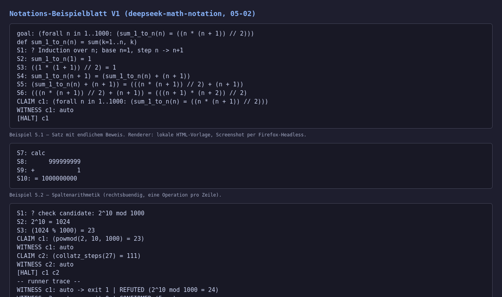

# Notations-Spezifikation V1 (Entwurf)

Diese Datei ist der baubare Entwurf: Lexik, Grammatik, Verifikationssemantik und Beispiele einer Mathematik-Notation für das Zielmodell „DeepSeek V4.1 Flash“ (lokal `deepseek/deepseek-flash`). Sie setzt die acht Prinzipien aus [05-01](05-01-designprinzipien.md) in konkrete Regeln um. Alle Regeln sind **V1-Setzungen**: nicht als Naturgesetze zu lesen, sondern als eingefrorene Startkonfiguration für den A/B-Test ([05-05](05-05-ablation-protokoll.md)); wo die Evidenz dünn ist, trägt die Regel einen benannten **Schalter** (Abschnitt 9), der im Experiment variiert wird.

Drei Begriffe aus dem Auftrag, hier festgelegt:

- **Kanonisch** — es gibt genau eine zulässige Schreibweise je Konstrukt; Synonyme/Varianten sind im kanonischen Blatt verboten (Mehrdeutigkeit ist eine Mapping-Verlustkategorie [Autoformalization](https://arxiv.org/abs/2205.12615, accessed 2026-09-12)).
- **Lokal** — ein Blatt darf eigene Definitionen einführen (`def`), aber nur im Blatt: keine globalen Namensräume, keine impliziten Vorbedingungen.
- **Explizit** — keine Präzedenz, keine impliziten Quantoren, keine stillen Konventionen (P5 in [05-01](05-01-designprinzipien.md)).

## 1. Ableitung: Prinzip → Regel

| Prinzip ([05-01](05-01-designprinzipien.md)) | Umsetzung in V1 |
|---|---|
| P1 Zahlen | reine Ziffernfolgen, `.`-Dezimaltrenner, keine Tausender-Trenner; `calc`-Blöcke rechtsbündig; Komma-Gruppierung nur als Sub-Arm (Schalter S2) |
| P2 Zeile+ID | `S<n>:`-Präfixe; ein Schritt/Statement pro Zeile |
| P3 Zwei Zonen | Denkzone (`S`-Zeilen, Kurzprosa erlaubt) vs. Behauptungszone (`CLAIM`/`WITNESS`, strikt) |
| P4 Zeugenpflicht | jedes `CLAIM` verlangt `WITNESS` (`auto` oder `py:`); Endmarker `[HALT]`; Runner liefert Verdikte |
| P5 Explizitheit | volle Klammerung; `forall`/`exists` immer mit Bereich; keine Präzedenz |
| P6 Lokalität | `goal`/`def` am Blattanfang; kurze Distanzen; `def` nur einmal |
| P7 Budget | Token-Ökonomie (Abschnitt 7); ASCII-Default (Schalter S1: Unicode-Arm) |
| P8 Typdisziplin | Behauptungen sind endlich-auswertbar (`auto`) oder formal-only (unbounded → `UNVERIFIABLE` hier, F-Klasse für [05-03](05-03-mapping-formal.md)) |

Rahmen (lokale Quelle: `~/.config/opencode/opencode.json`, gelesen 2026-09-12): Kontext 1.000.000 Tokens; **Output 8.192 Tokens** für `deepseek-flash`; interleaved reasoning über das Feld `reasoning_content`. Die öffentliche Doku nennt für dasselbe Modell bis zu 384K Output [Models & Pricing](https://api-docs.deepseek.com/quick_start/pricing, accessed 2026-09-12) — die 8.192 sind eine Serving-Konfiguration dieser Instanz. V1 wird gegen die **engere** Grenze entworfen; steigt das Limit später, ändert sich an der Notation nichts, nur der Komfort. Relevant ferner: Im Thinking-Mode (Standard an) ist `temperature` wirkungslos und `top_p` wird auf ≥ 0,95 gehoben [Thinking Mode](https://api-docs.deepseek.com/guides/thinking_mode, accessed 2026-09-12) — für die Notation heißt das: Determinismus kommt nicht aus Sampling-Reglern, sondern aus Format und Verifikation (siehe [05-04](05-04-test-harness.md)).

## 2. Lexik

**Zahlen.** Regulärer Ausdruck: `-?[0-9]+(\.[0-9]+)?([eE][+-]?[0-9]+)?`. Keine Tausender-Trenner, keine Leerzeichen innerhalb einer Zahl, kein führendes `+`. Ausnahme: In `calc`-Blöcken dürfen Zahlen über Zeilen hinweg in **rechtsbündigen Spalten** ausgerichtet werden (Leerzeichen links der Ziffern sind dort Teil des Layouts, kein Trennzeichen). Begründung: Ausrichtungsrichtung und Ziffern-Chunking verschieben Additions-Genauigkeit im zweistelligen Prozentbereich [Tokenization counts](https://arxiv.org/abs/2402.14903, accessed 2026-09-12), Fragmentierung numerischer Strings kostet bis zu 10 Punkte [Date Fragments](https://arxiv.org/abs/2505.16088, accessed 2026-09-12). Da das Ziffern-Chunking dieses Modells unbekannt ist [DeepSeek-V3](https://arxiv.org/abs/2412.19437, accessed 2026-09-12), ist die exakte Form eine Setzung mit empirischem Schalter (S2).

**Bezeichner.** `[a-zA-Z][a-zA-Z0-9_]*`; reservierte Wörter (Abschnitt 3) sind verboten. Konvention (Empfehlung, keine Härte): kurze Namen (`n`, `k`, `a1`), keine Umlaute/Unicode.

**Operatoren (Kern, ASCII, Tabelle):**

| Konstrukt | Schreibweise | Anmerkung |
|---|---|---|
| Arithmetik | `+ - * / // % ^` | `/` exakt (Bruch), `//` Integer-Division, `%` Modulo, `^` Potenz |
| Vergleiche | `= != < <= > >=` | `=` ist Aussage, nicht Zuweisung |
| Logik | `! & \| -> <->` | Negation, Und, Oder, Implikation, Äquivalenz |
| Quantoren | `(forall n in <bereich>: <formel>)`, `(exists n in <bereich>: <formel>)` | Bereich immer explizit |
| Menge/Bereich | `Z`, `N`, `Q`, `a..b` (inklusive beide Enden), `{a, b, c}` | endliche Mengen als Aufzählung |
| Anwendung | `f(a, b)` | Funktionsaufruf, nie implizite Multiplikation |

**Bibliothek (V1, deterministisch, stdlib-implementierbar):** `isprime(n)`, `powmod(a,b,m)`, `gcd(a,b)`, `divisors(n)` (sortiert), `divides(a,b)`, `factorial(n)`, `choose(n,k)`, `fib(n)`, `collatz_steps(n)` (Schritte bis 1, Start ≥ 1), `collatz_max(n)` (Maximum der Orbit-Werte). Dazu für `py:`-Zeugen die Python-Grundbausteine `all`, `any`, `sum`, `prod` (Produkt-Variante), `range`, `len`, `min`, `max`, `abs`. Jede Funktion hat eine dokumentierte Argumentgrenze; Überschreitung führt zu `UNVERIFIABLE` (`guard`), nicht zu stiller Näherung:

| Funktion | Guard |
|---|---|
| `isprime(n)` | n ≤ 10^12 (deterministischer Miller-Rabin, feste Basen — deterministisch für n < 3,3·10^24) |
| `divisors(n)` | n ≤ 10^12 (Trial Division bis sqrt(n), ≤ 10^6 Iterationen) |
| `gcd(a,b)`, `divides(a,b)` | \|a\|, \|b\| ≤ 10^12 |
| `factorial(n)` | n ≤ 10^4 (Ausgabegröße ~35.000 Ziffern) |
| `choose(n,k)` | n ≤ 10^4 |
| `fib(n)` | n ≤ 10^6 (iterativ) |
| `collatz_steps(n)`, `collatz_max(n)` | n ≤ 10^7 |
| `powmod(a,b,m)` | b ≤ 10^12, m ≤ 10^12 | Die Bibliothek ist der **auf dieser Maschine prüfbare Teil** der Mathematik: exakte Ganzzahlen, endliche Suche, Zahlentheorie-Grundfunktionen — ohne CAS (auf dieser Maschine ist kein SymPy/Z3 installiert; lokaler Befund aus [05-03](05-03-mapping-formal.md)).

## 3. Syntax

**Blattstruktur** (eine Antwort = ein Blatt):

```
blatt      = [ziel] {def} {s_zeile} behauptungszone [halt] ;
ziel       = "goal" ":" formel ;
def        = "def" name "(" [name {"," name}] ")" "=" term ;
s_zeile    = "S" ziffern ":" (formel | "calc" | calc_zeile | notiz) ;
calc_zeile = [op_kennung] zahlspalte ;
op_kennung = "+" | "-" | "*" | "/" | "=" ;
notiz      = "?" kurztext ;
behauptungszone = {claim zeuge} ;
claim      = "CLAIM" cid ":" formel ;
zeuge      = "WITNESS" cid ":" ("auto" | "py:" py_ausdruck | "range" name "in" bereich ":" formel) ;
halt       = "[HALT]" {cid} ;
term       = zahl | name | "(" term op term ")" | "(" "-" term ")" | name "(" [term {"," term}] ")" 
           | "sum" "(" name "=" bereich "," term ")" | "prod" "(" name "=" bereich "," term ")"
           | "(" ("forall" | "exists") name "in" (menge | bereich) ":" formel ")" ;
formel     = term | "(" formel op formel ")" | "(" "!" formel ")" | "(" formel op_vgl term ")" ;
```

Präzisierungen zur Grammatik (EBNF-Konvention: `"…"` = Literal, `( )` = metasprachliche Gruppierung, `{ }` = Wiederholung, `[ ]` = optional):

- `bereich` = `(zahl | name) ".." (zahl | name)` (inklusiver Bereich; Endpunkte dürfen Literale oder benannte Größen sein — damit parst das kanonische Beispiel `sum(k=1..n, k)`); `menge` = `Z | N | Q | { term {"," term} }`.
- **`calc`-Blöcke:** Eine `S`-Zeile mit Inhalt `calc` eröffnet einen Zahlenblock; die folgenden `S`-Zeilen der Form `[op_kennung] zahlspalte` gehören dazu (Fortsetzungsregel), die erste andersartige Zeile schließt ihn. Der Block ist Darstellung (Denkzone) — verifiziert wird nur, was als `CLAIM` wiederholt und bezeugt wird.
- **Behauptungszone ist Pflicht:** Fehlt sie, oder enthält sie keinen parsbaren `CLAIM`/`WITNESS`-Block, ist das ein **Parser**-Formatfehler (kein Runner-Urteil). Fehlt `[HALT]`, zählt das Blatt als Formfehler (Abschnitt 6).
- **Leerer Bereich** (`a > b`): Für `sum`/`prod` gelten die Standardwerte (0 bzw. 1, wohldefiniert); für `forall`/`exists` die Standardlogik (vakuös wahr bzw. falsch). Ein `CLAIM`, dessen **Hauptbehauptung** über einen leeren Bereich quantifiziert, wird vom Runner mit `UNVERIFIABLE`/`empty_range` beantwortet — vakuöse Bestätigungen sind als Testergebnis verboten (Disziplinregel, keine Semantikänderung).
- Für `range`-Zeugen gilt: Die Formel darf die gebundene Variable des Bereichs nicht erneut binden.
- Reservierte Wörter (als Bezeichner verboten): `goal`, `def`, `S`, `CLAIM`, `WITNESS`, `HALT`, `calc`, `forall`, `exists`, `sum`, `prod`, `in`, `Z`, `N`, `Q`, `auto`, `py`, `range`. `kurztext` (für `?`-Notizen) ist druckbarer Text bis zum Zeilenende, ohne Zeilenumbruch und ohne `[`-Marker.

Regeln, die den Zwei-Zonen-Gedanken (P3) konkretisieren: `S`-Zeilen sind die **Denkzone** — hier ist `?`-Kurzprosa erlaubt, Parser-Strenge gilt nicht (erkannt werden nur das Zeilen-Präfix `S<n>:` und `calc`-Fortsetzungen; Inhalte der Denkzone werden nicht geprüft); `CLAIM`/`WITNESS` sind die **Behauptungszone** — hier gilt die volle Grammatik, jede Zeile muss parsen. Zahlenspalten (`calc`) sind der einzige erlaubte Layout-Trick. Ein vollständiges Beispiel-Blatt steht in Abschnitt 6.

**Verdikte schreibt nicht das Modell.** Der Runner führt die Zeugen aus und erzeugt die Trace-Zeilen `WITNESS c1: … -> exit 0 | CONFIRMED`; `UNVERIFIABLE` bei Ausnahme/Timeout/Guard, `REFUTED` bei `False`/Exit ≠ 0. Das entspricht dem Verdikt-Modell der lokalen Verifier-Maschinerie `CONFIRMED|REFUTED|UNVERIFIABLE` (lokale Quelle: `bemyself/model.py`, gelesen 2026-09-12). `[HALT] c1 c2` ist die Selbstdeklaration des Modells, fertig zu sein und genau diese Claims als Ergebnis zu setzen; die Bewertung (`[SCORE]`) kommt vom Runner. Der exakte Anschluss an die P7-Infrastruktur (`[HALT]`/`[SCORE]`, claimtypes) ist offen und wird in [04-05](../04-offene-probleme/04-05-bruecke-pruefer.md) konsolidiert; V1 legt nur die Schnittstellenform fest.

**Kanonisch, lokal, explizit — als Regeln:**

1. Genau eine Schreibweise je Konstrukt (Tabellen oben); keine Alternativ-Syntax.
2. `def` nur vor der ersten Verwendung; maximal 8 Definitionen pro Blatt; kein Namensschatten.
3. Volle Klammerung; jeder Operator wendet genau zwei bzw. einen Operanden an (keine Ketten wie `a + b + c` — dafür `((a + b) + c)`).
4. Jedes `CLAIM` referenziert einen endlichen oder expliziten Bereich oder ist eine geschlossene Formel ohne freie Variablen.
5. Kein Text in der Behauptungszone außerhalb der Grammatik.

## 4. Verifikationssemantik (der Kern)

Ein `CLAIM` ist ein Typ, sein `WITNESS` muss ein Entscheider sein (Prüfen statt Glauben [05-01](05-01-designprinzipien.md) P4). V1 kennt drei Zeugenwege:

1. **`auto`** — der Runner **kompiliert die Claim-Formel selbst** in einen Python-Ausdruck über der Bibliothek und wertet sie aus. Das ist der Standardweg für endliche Claims: Das Modell kann sich nicht mit einem zu schwachen Zeugen „durchschummeln“, weil die Prüfung die Behauptung selbst ist. Beispiel: `CLAIM c1: (forall n in 1..1000: (sum_1_to_n(n) = ((n * (n + 1)) // 2)))` wird zu `all(sum(range(1,n+1)) == (n*(n+1))//2 for n in range(1,1001))`.
2. **`py: <ausdruck>`** — expliziter, vom Modell formulierter Ausdruck; nützlich, wenn der direkte Weg spezialisiert/prozedural ist (z. B. Gegenbeispiel-Suche) oder der Compiler die Formel syntaktisch nicht direkt auswerten kann. Auch hier gilt: Der Runner prüft nur den Ausdruck — formuliert das Modell einen Ausdruck, der die Behauptung nicht entscheidet, ist das ein **Zeugenfehler** und wird in der Auswertung als eigener Fehlertyp gezählt.
3. **`range n in a..b: formel`** — explizite endliche Allaussage; äquivalent zu `auto`, aber lesbarer, wenn die Formel über Hilfsfunktionen läuft.

**Verdiktmatrix für `py:`-Zeugen (Setzung):** boolescher Ausdruck → `True` = `CONFIRMED`, `False` = `REFUTED`; nicht-boolescher Rückgabewert → `UNVERIFIABLE` (`witness_not_bool`); Ausnahme im Ausdruck → `UNVERIFIABLE` (`witness_exception`); Guard-/Timeout-/Sandbox-Abbruch → `UNVERIFIABLE` (`guard`/`timeout`/`sandbox`). Die drei Gründe werden getrennt gezählt — ein Zeugenfehler ist ein anderer Fehlertyp als ein Widerlegungsbefund.

**Unendliche Behauptungen** (`forall n in N: …`) sind auf dieser Maschine **nicht ausführbar**: Der Runner vergibt `UNVERIFIABLE` mit Grund `unbounded_claim` — es sei denn, das Blatt liefert für eine formel-reine Teilklasse einen Referenzbeweis (Lean/Metamath; siehe [05-03](05-03-mapping-formal.md), dort auch die Grenze: keine der beiden Toolchains ist auf dieser Maschine installiert — Nachtrag 2026-09-12: Lean ist installiert und für die Zyklus-Zelle ausgeführt ([03-05](../03-formale-bruecke/03-05-roundtrip-anforderungen.md) §6); Metamath weiterhin nicht). Diese Ehrlichkeit ist Teil des Designs: `UNVERIFIABLE` ist ein ehrlicher Zustand, kein Fehler — genau wie im Vorbild `bemyself eval`, das eine `Unpruefbar-Quote` berichtet statt sie zu verstecken (lokale Quelle: `bemyself/eval.py`, gelesen 2026-09-12).

**Ausführungssicherheit:** Zeugen laufen in der Sandbox mit Netzwerk-/Schreibisolation (lokale Infrastruktur: `--sandbox=auto|require|off` mit bwrap, Commit `6d82c4b`; lokal verifiziert, dass bwrap vorhanden ist). Laufzeitlimit pro Zeuge (Vorschlag: 10 s) und Speicherlimit sind Teil des Harness ([05-04](05-04-test-harness.md)).

## 5. Beispiele

### 5.1 Satz (Proposition) mit endlichem Beweis

Ziel: Summenformel für einen endlichen Bereich.

```
goal: (forall n in 1..1000: (sum_1_to_n(n) = ((n * (n + 1)) // 2)))
def sum_1_to_n(n) = sum(k=1..n, k)
S1: ? Induktion über n; Basis n=1, Schritt n -> n+1
S2: sum_1_to_n(1) = 1
S3: ((1 * (1 + 1)) // 2) = 1
S4: sum_1_to_n(n + 1) = (sum_1_to_n(n) + (n + 1))
S5: (sum_1_to_n(n) + (n + 1)) = (((n * (n + 1)) // 2) + (n + 1))
S6: (((n * (n + 1)) // 2) + (n + 1)) = (((n + 1) * (n + 2)) // 2)
CLAIM c1: (forall n in 1..1000: (sum_1_to_n(n) = ((n * (n + 1)) // 2)))
WITNESS c1: auto
[HALT] c1
```

Runner-Trace (Beispiel):

```
WITNESS c1: auto -> exit 0 | CONFIRMED (23 ms, sandbox=require)
[SCORE] confirmed=1 refuted=0 unverifiable=0
```

Wichtig an diesem Beispiel: Die Induktion in `S1`–`S6` ist **Darstellung**; die Gültigkeit trägt der Zeuge. Universalität über ganz `N` wäre hier nicht verifizierbar — der Claim ist deshalb bewusst auf `1..1000` begrenzt (P8-Typdisziplin).

### 5.2 Beweisschritt mit Spaltenarithmetik (`calc`)

```
S7: calc
S8:      999999999
S9: +            1
S10: = 1000000000
```

Rechtsbündige Spalten (P1), eine Operation pro Zeile (P2). Wenn ein `calc`-Block als Claim endet, wird das Ergebnis in der Behauptungszone wiederholt und bezeugt (`CLAIM … = 1000000000`, `WITNESS c: py: 999999999 + 1 == 1000000000`).

### 5.3 HALT-Trace mit Widerlegung (das Modell irrt, der Zeuge fängt es)

```
S1: ? Kandidat prüfen: 2^10 mod 1000
S2: 2^10 = 1024
S3: (1024 % 1000) = 23
CLAIM c1: (powmod(2, 10, 1000) = 23)
WITNESS c1: auto
CLAIM c2: (collatz_steps(27) = 111)
WITNESS c2: auto
[HALT] c1 c2
```

Runner-Trace:

```
WITNESS c1: auto -> exit 1 | REFUTED (2^10 mod 1000 = 24)
WITNESS c2: auto -> exit 0 | CONFIRMED (5 ms)
[SCORE] confirmed=1 refuted=1 unverifiable=0
```

Dies ist der Beweiswert der Notation: Der Denkfehler in `S3` wird nicht wegrationalisiert, sondern vom Zeugen als `REFUTED` markiert — sichtbare Rechnung ist Protokoll, nicht Beweis [Unfaithful Explanations](https://arxiv.org/abs/2305.04388, accessed 2026-09-12).


*Abbildung 1: Die Beispiele 5.1 (Satz), 5.2 (Spaltenarithmetik) und 5.3 (HALT-Trace mit Widerlegung) als gerenderte Blätter. Eigene Darstellung (HTML-Vorlage, Screenshot mit Firefox Headless am 2026-09-12).*

## 6. Output-Budget (lokale Grenze 8.192 Tokens)

| Element | typische Tokens (Schätzung) | Anmerkung |
|---|---|---|
| `goal`-Zeile | 15–40 | einmal pro Blatt |
| `def`-Zeile | 10–30 | ≤ 8 Stück empfohlen |
| `S`-Zeile (Formel) | 8–20 | Richtwert ≤ 12 laut P7; Ausnahmen erlaubt |
| `S`-Zeile (`?`-Notiz) | 5–15 | Kurzprosa |
| `calc`-Zeile | 5–15 | Ziffern + Layout |
| `CLAIM`+`WITNESS` | 20–50 | Paar; der teuerste Pflichtteil |
| `[HALT]` | ≤ 10 | |

Die Tokenzahlen sind **Schätzungen** (kein lokaler Tokenizer-Zugriff verifiziert) und werden in der Ausführungsphase durch die `tokens`-Felder der `opencode run --format json`-Events ersetzt ([05-04](05-04-test-harness.md)). Budget-Regeln: (1) Die Behauptungszone ist Pflicht, die Denkzone wird gekürzt, bevor Claims gekürzt werden. (2) Lange Rechnungen werden **externalisiert**: nicht 200 Zeilen Zwischensummen, sondern eine Zeugenzeile, die die Rechnung ausführt (`py:` oder `auto`) — Rechnen ist Aufgabe der Maschine, nicht des Textes (Zeuge statt Glauben). (3) Ein Blatt = ein Ziel; Folgefragen starten ein neues Blatt mit neuem `goal`, statt das Budget mit Kontext-Auffrischung zu verbrauchen. Bei Budget-Not gilt: kein `[HALT]` auf einem Blatt ohne zeugenfähige Claims (den Verifikationsstatus kennt erst der Runner — das Modell kann ihn nicht vorwegnehmen) — ein Blatt ohne `[HALT]` zählt als Formfehler und ist die ehrlichere Ausgabe (Abschnitt 4).

## 7. Was V1 bewusst nicht abdeckt

- Reelle Analysis, Grenzwerte, unendliche Reihen, Geometrie, Maßtheorie (außerhalb des prüfbaren Fragments).
- Rekursive lokale Definitionen (nur Bibliothek; `def` ist geschlossen).
- Matrizen/Tensoren, Optimierung.
- Freie Notation außerhalb des Blatt- Schemas (die Denkzone ist frei, aber nicht Teil des formalen Artefakts).

Das ist die prüfbare Teilmenge (P8): lieber ein kleines, vollständig bezeugbares Fragment als eine große Notation, die niemand nachrechnen kann. Die Testfeld-Wahl ([04-04](../04-offene-probleme/04-04-empfehlung.md)) muss in dieses Fragment passen; für darüber hinausgehende Mathematik ist die Notation in V1 nicht zuständig.

## 8. Anschluss an die bestehende Verifier-Infrastruktur (lokal)

- **Claim-Modell:** `bemyself/model.py` kennt `Claim(kind, …)` und `Verdict.CONFIRMED|REFUTED|UNVERIFIABLE`; V1 braucht einen neuen Claim-Kind (`math_witness`) im Parser — die vorhandene `bemyself/report.py`-Grammatik deckt nur Git-/Test-Marker (`[COMMIT:]`, `Tests run: … -> exit n`) ab (lokale Quelle, gelesen 2026-09-12). Der Sheet-Parser aus [05-03](05-03-mapping-formal.md) ist die Brücke.
- **Eval-Muster:** `bemyself/eval.py` demonstriert bereits das gewünschte Muster — Set als JSON-Artefakt, deterministisch gebaute Fixture, Raten statt Einzelurteile, Exit-Codes (0/1/2/4), `--json`-Output (lokale Quelle, gelesen 2026-09-12). Der Notations-Harness ([05-04](05-04-test-harness.md)) übernimmt dieses Muster.
- **Sandbox:** bwrap-Flagkette `--sandbox=auto|require|off` existiert (Commit `6d82c4b`); Zeugen sollten mit `require` laufen, damit ein fehlendes bwrap nicht still zu Netz-Exposition führt (lokale Quelle: Repo-Historie, gelesen 2026-09-12).

## 9. Schalter (Sub-Ablations-Parameter für [05-05](05-05-ablation-protokoll.md))

| ID | Schalter | Default V1 | Alternativarm | Evidenzlage |
|---|---|---|---|---|
| S1 | Zeichensatz | ASCII (`forall`, `<=`, `->`) | Unicode (∀, ≤, →) | nicht untersucht — größte Lücke [05-01](05-01-designprinzipien.md) |
| S2 | Zahlengruppierung | keine Trenner + Spalten in `calc` | Komma-Gruppen (`1,048,576`) | [Tokenization counts](https://arxiv.org/abs/2402.14903, accessed 2026-09-12), tokenizer-abhängig |
| S3 | Behauptungszone-Radikalität | Zwei-Zonen (P3) | durchgängig strikt | [Let Me Speak Freely](https://arxiv.org/abs/2408.02442, accessed 2026-09-12) |
| S4 | Klammerung | voll | minimal (Präzedenz) | [FormatSpread](https://arxiv.org/abs/2310.11324, accessed 2026-09-12) + offen |
| S5 | Zeugenweg | `auto` bevorzugt | modellgeschriebene `py:`-Zeugen | Design-Setzung, ungemessen |

## 10. Ein-Satz-Zusammenfassung

V1 ist eine **zweizonige, ASCII-first, voll geklammerte, eine-Zeile-ein-Schritt-Sprache** für endliche Zahlentheorie/Kombinatorik, deren Behauptungen von einem Runner **ausgeführt statt geglaubt** werden (Verdikte `CONFIRMED|REFUTED|UNVERIFIABLE`), mit bewusst offengelassenen Schaltern für genau die Punkte, an denen die Evidenz dünn ist.
