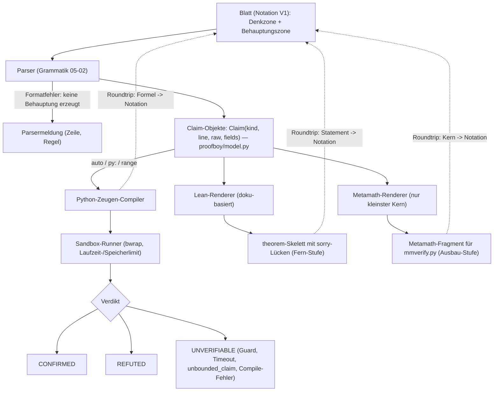
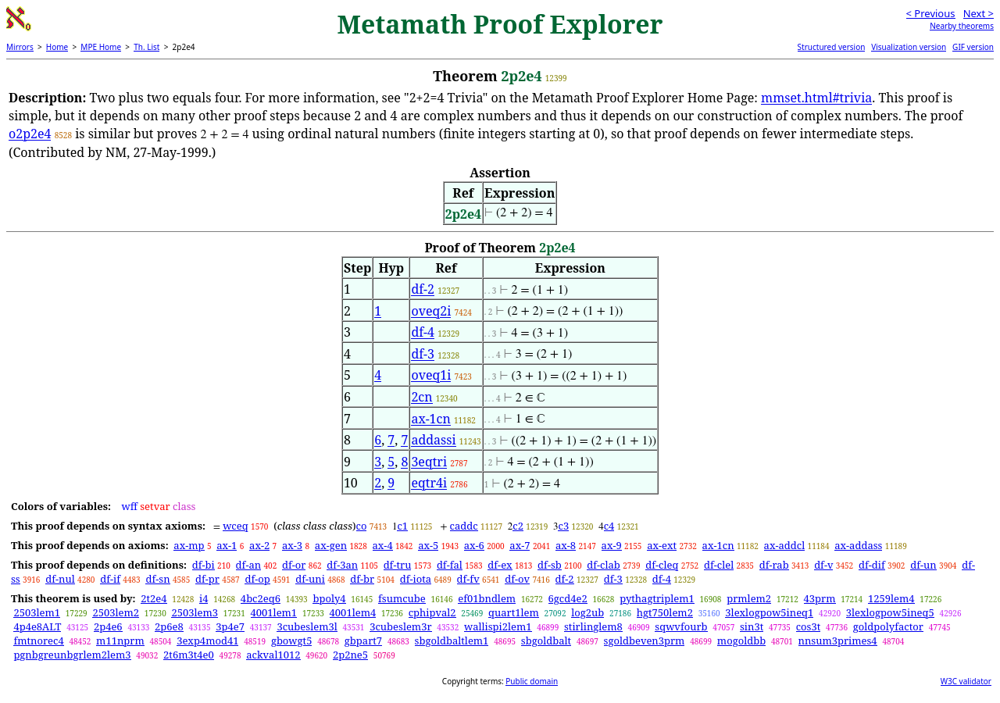

# Mapping: Notation ↔ formale Mathematik

Dieses Kapitel übersetzt die Notation V1 aus [05-02](05-02-notations-spezifikation.md) in ihre drei Zielrepräsentationen und benennt je Konstrukt, was erhalten bleibt: (a) ein Lean-4-Zielfragment, (b) ein Metamath-Zielfragment, (c) die ausführbare Zeugen-Stufe in Python. Dazu kommen Verlust- und Fehlerklassen, die Parser-/Renderer-Skizze, ein Roundtrip-Testplan und die Maschinen-Realität. Leitgedanke ist P8 aus [05-01](05-01-designprinzipien.md): Jede Zeile soll in genau eine prüfbare Klasse fallen — formel-rein (F) oder prozedural (P).

Vorbehalt, der alle Tabellen qualifiziert: Die Lean-Spalte ist **doku-basiert** und wurde hier nicht ausgeführt (kein `lean`/`lake`, Abschnitt 5). Die Metamath-Spalte stützt sich auf Buch, Proof-Explorer-Seiten und Theoremseiten-Stichproben (HTTP-Status, eigene Probe 2026-09-12). Ausgeführt wurde nur der Python-Pfad — er ist dafür vollständig ausführbar.

## 1. Mapping-Tabellen

„Sauber" heißt: verlustfrei im definierten Fragment; „teilweise": nur Statement bzw. Teilsemantik erreichbar; „nicht (V1)": in V1 nicht abbildbar, Grund benannt. Für alle genannten set.mm-Seiten gilt: Stichprobe HTTP 200 (2026-09-12), sofern nicht anders markiert.

| V1-Konstrukt (Beispiel) | (a) Lean 4 (doku-basiert) | (b) Metamath (set.mm) | (c) Zeugen-Stufe (Python) | Klasse & Verlust |
|---|---|---|---|---|
| **Ganzzahlterm** `((n * (n + 1)) // 2)` | Term über `ℕ`/`ℤ`, Operatoren eins-zu-eins | Abschluss-Theoreme `zaddcl`, `zsubcl`, `zmulcl` | `int`, exakt | Lean/Python: sauber. Verlust: keiner; Domänenwahl (ℕ/ℤ) macht der Renderer explizit |
| **Vergleich** `(a <= b)`, `(a != b)` | `≤`, `<`, `=`, `≠` als `Prop`-Operatoren | Ordnung (`clt`), Gleichheit (`wceq`, `eqtr`) | `<=`, `!=`, `==` | Lean/Python: sauber; Metamath: teilweise — Typannahmen („a ∈ ℤ") müssen explizit werden |
| **Logik** `! & \| -> <->` | `¬`, `∧`, `∨`, `→`, `↔`; ASCII-Eingaben `\not`, `/\`, `\/`, `->`, `<->` laut TPIL | `wn`, `wa`, `df-an`, `df-bi`; `ax-1`…`ax-3`, `ax-mp` (auf der 2p2e4-Seite als Abhängigkeiten sichtbar) | `not`, `and`, `or`; `->`/`<->` als Boolesche Ausdrücke kompiliert | Lean/Python: sauber. Metamath: teilweise (jede Ableitung ist ein expliziter Beweis). Setzung: Python-Compiler erzwingt `bool`-Operanden |
| **`forall`/`exists` über `a..b`** | `∀ n, a ≤ n → n ≤ b → P n`; Beweis braucht Taktik/Induktion | endliche Intervalle (`df-fz`), Generalisierung (`ax-gen`) — aber kein fertiges Ziel | `all(P(n) for n in range(a, b+1))`, `any(...)` | Python: sauber — der native `auto`-Weg. Lean: teilweise (Statement ja, Beweis nein). Metamath: nicht (V1). Verlust: Endlichkeit müsste dort bewiesen werden |
| **freie/unbounded Quantoren** `(forall n in N: …)` | `∀ n : ℕ, P n` als Statement; Beweis nicht durch den Runner entscheidbar (`sorry`-Lücke) | statement-mäßig möglich; vollständiger Beweis außerhalb V1 | keine Übersetzung → `UNVERIFIABLE` (`unbounded_claim`); bezeugte Gegeninstanz → `REFUTED` | Nicht (V1) als Beweis; teilweise als Statement. Verlust: Universalität bleibt unbewiesen (P4-Grenze) |
| **`//`, `%`, `^`** | Standardoperatoren; Rundungssemantik auf `ℤ` nicht verifiziert | definiert: `zdiv`, `df-mod`/`modval`, `df-exp`; Zuordnung erfordert Lemma-Ketten | `//`, `%`, `**` exakt; Guards aus 05-02 §2, große Exponenten nur via `powmod` | Python: sauber; Lean/Metamath: teilweise. Verlust: Guard-Grenzen erzeugen ehrliches `UNVERIFIABLE` statt Näherung |
| **`def`-Funktionen (closed form)** | `def`/`theorem` direkt; Elaborator prüft beim Build | Definitional-Axiome mit Disjoint-Bedingungen — heikel | `def` im Zeugenmodul; Rekursion unzulässig (05-02 §7) | Lean/Python: sauber; Metamath: nicht praktikabel. Verlust: Lean-Typannotationen ergänzt der Renderer ausgewiesen |
| **Bibliotheksfunktionen** (`isprime`, `powmod`, `collatz_steps` …) | mathlib-Kandidaten (`Nat.Prime` …); jede Identifikation ist Definitions-Mismatch-anfällig | Teildeckung Primzahlen (`df-prm`, `prmnn`, `1nprm`); `collatz`: 404-Markierung | die V1-Bibliothek selbst (05-02 §2) mit Guards | Python: sauber — Bibliothek ist die Semantik. Lean: teilweise; Prämissenwahl ist der Engpass [LeanDojo](https://arxiv.org/abs/2306.15626, accessed 2026-09-12). Metamath: teilweise. Verlust: außerhalb der Guards `UNVERIFIABLE` |
| **`CLAIM`/`WITNESS`-Block** | Claim → `theorem`-Statement; WITNESS → Beweisterm/`sorry`; V1 liefert nur das Skelett | Claim → `$p`; WITNESS → RPN-Herleitung; V1 liefert sie nicht | nativ: `Claim(kind, line, raw, fields)` + `Result(verdict, …)` aus `proofboy/model.py` | Python: sauber (Identität); Lean: teilweise; Metamath: nicht (V1). Verlust: Skelett ohne Beweis muss als Lücke markiert sein |
| **`calc`-Zahlenspalten** | Layout ohne Semantik; Ziel ist die Endgleichung | ebenso layout-blind; `2p2e4` zeigt die Kette | `py:`-Einzelausdruck (`999999999 + 1 == 1000000000`) | Python: sauber; Lean/Metamath: teilweise. Verlust: Zwischenschritte sind Darstellung, kein formales Objekt |

Das Muster: Die Python-Spalte ist für alle zehn Klassen sauber — kein Zufall, 05-02 definiert die Notation gegen genau diese Stufe. Die nicht abbildbaren Klassen entsprechen fast genau dem, was 05-02 §7 als nicht abgedeckt führt (unbounded Beweise, Pflichtbeweise, Zwischenschritt-Prüfung). P8 erfüllt sich daher nur, wenn die Klassifikation ehrlich bleibt: Eine unbounded-Zeile ist eine offene Behauptung, keine F-Zeile.

## 2. Verluste & Fehlerklassen (NL/Notation → formal)

Wu et al. übersetzen 150 Wettbewerbsaufgaben nach Isabelle/HOL; 38 gelingen perfekt („a success rate of 25.3%"), und „the majority of the failures are due to the misalignment of informal and formal definitions" — etwa „the greatest possible value" ohne `Greatest`/`Max`-Bezug oder `!n` statt `fact n` [Autoformalization](https://arxiv.org/abs/2205.12615, accessed 2026-09-12). Ihre Fallkategorien: „Syntactical/type error", „Inconsistent/missing assumption", „Missing definition in Isabelle" (Tabelle 2, ebd.). Dagegen sind 3.363 von 3.908 autoformalisierten Trainings-Aufgaben syntaktisch korrekt (ebd.) — beide Zahlen messen unterschiedliche Kriterien und stehen deshalb doppelt: Syntax-Korrektheit ist billig, semantische Perfektion selten.

Draft, Sketch, and Prove hebt mit formalen Skizzen die Erfolgsrate „from 20.9% to 39.3% on a collection of mathematical competition problems" (mit modellgenerierten informellen Beweisen: bis 38,9 %) [Draft, Sketch, and Prove](https://arxiv.org/abs/2210.12283, accessed 2026-09-12). Das ist die Vorlage für V1: Der Claim ist die Skizze, der Runner entscheidet den Rest. Die Zahlen stammen aus Isabelle-Setups, nicht von diesem Modell — Größenordnung, nicht Erwartung.

Auf die V1-Kette abgebildet, vier Verlustklassen:

- **(L1) Syntaktische/Type-Fehler** — billigster Fall, eigener Fehlertyp statt `REFUTED`.
- **(L2) Fehlende Annahmen/Inkonsistenz** — im Kern strukturell reduziert (geschlossene Blätter, explizite Bereiche). Leere Bereiche (`10..1`) sind in [05-02](05-02-notations-spezifikation.md) §3 inzwischen geregelt: Claim über leeren Bereich ⇒ `UNVERIFIABLE` (`empty_range`), vakuöse Bestätigungen sind verboten.
- **(L3) Definitions-Mismatch** — teuerste Klasse [Autoformalization](https://arxiv.org/abs/2205.12615, accessed 2026-09-12). V1 mildert sie, weil die V1-Bibliothek die Semantik selbst ist; der Rest-Mismatch liegt auf NL → Notation, den kein Verifier prüft: V1 zertifiziert den Claim, nicht die Aufgaben-Treue.
- **(L4) Zeugenfehler** — ein `py:`-Ausdruck, der die Behauptung nicht entscheidet. Gegenmittel: `auto` als Standard (Runner kompiliert die Claim-Formel selbst), eigener Fehlertyp (Schalter S5).

## 3. Parser/Renderer-Skizze

*Eigene Darstellung auf Basis der zitierten Quellen und des lokalen Verdikt-Modells `proofboy/model.py`: die Renderer-Kette von V1. Ausführbar ist heute allein der Python-Zweig (Sofort-Stufe).*

Nur die Behauptungszone erreicht den Parser als strikte Grammatik. Aus ihm treten Claim-Objekte aus — `Claim(kind, line, raw, fields)` und `Verdict.CONFIRMED|REFUTED|UNVERIFIABLE` sind die Anschlussnaht (lokale Quelle: `proofboy/model.py`, gelesen 2026-09-12); V1 braucht dort einen neuen Claim-Kind (`math_witness`, 05-02 §8). **Schnittstellen-Setzung:** Die vollständige Compiler-Regelmatrix (Notation → Python) und das Feldschema von `math_witness` (cid, Zeilenbezug, Verdikt, Trace-Pfad, Gründe) werden bewusst erst bei der Implementierung festgelegt — dieses Kapitel fixiert nur die Anschlussform an `proofboy/model.py`; die Spezifikation bleibt damit ehrlich über ihren Reifegrad. Drei Renderer hängen an derselben Claim-Menge: (a) der Python-Compiler (`auto` übersetzt selbst; `py:`/`range` prüft die Modellangabe) plus Sandbox-Runner; (b) der Lean-Renderer erzeugt `theorem`-Skelette, wo kein Beweis existiert bleibt `sorry` — von Lean als Warnung geführt ([TPIL, Interacting with Lean](https://lean-lang.org/theorem_proving_in_lean4/Interacting-with-Lean/, accessed 2026-09-12)); (c) Metamath nur für den kleinsten Kern (Abschnitt 6). Die gestrichelten Pfeile sind der Roundtrip-Pfad: ein inverser Renderer (Formel → Notation) erzeugt die kanonische Normalform zurück.

## 4. Roundtrip-Testplan

**Schnittstelle:** `../03-formale-bruecke/03-05-roundtrip-anforderungen.md` ist das Parallelkapitel zu Konservativitäts-Anforderungen (liegt vor, Stand 2026-09-12). Dieser Abschnitt liefert die V1-Operationalisierung; bei Abweichungen hat das Parallelkapitel Vorrang.

**Definition.** Roundtrip = `N → render → T → invert → N'`; stabil, wenn `N'` der kanonischen Normalform von `N` entspricht (voll geklammerte ASCII-Form, 05-02). Ziele: Python-Ausdruck (ausführbar), Lean-Skelett (Text), Metamath-Fragment (Text, kleinster Kern). 03-05 definiert Rücküberführbarkeit zweistellig (Notation; Lean 4 + Python-Zeugenstufe); die **Metamath-Säule ist hier eine ausgewiesene Erweiterung** (Ausbau-Stufe) — sie senkt keine dortige Anforderung ab.

**Übersetzungsschutz (Setzung).** (i) Semantik-Treue auf der ausführbaren Stufe: Runner-Verdikte deckungsgleich mit einem unabhängigen Orakel; (ii) keine stillen Ergänzungen: Renderer-Zusätze (Typen, Bereichsnormalisierung) sind ausgewiesen und umkehrbar; (iii) Nichtabbildbarkeit wird als Parser-/Renderfehler gemeldet, nie approximiert. (Der Term „Konservativität“ im proof-theoretischen Sinn — keine neuen Theoreme über die Ausgangssprache — gehört zu 03-05 §1.1/§2 und wird hier bewusst nicht doppelt besetzt.)

**Mini-Korpus (Setzung).** 100 generierte Claims in fünf Klassen à 20: endliche Identitäten, Teilbarkeit/Primzahl, `powmod`-Kongruenzen, `collatz_steps`-Instanzen, unbounded Claims inkl. Kontrollinstanzen; je zur Hälfte wahr/falsch (Generator kennt die Wahrheit), plus zehn Ambiguitäts-Negativfälle (fehlende Klammern, Unicode-Mix, ungültige Bereiche). Die Größe orientiert sich an [miniF2F](https://arxiv.org/abs/2109.00110, accessed 2026-09-12) (488 Aufgaben, cross-system), ist aber bewusst kleiner und generatorbasiert — das V1-Fragment ist endlich-arithmetisch, nicht olympiad-nah.

**Erwartung aus P8 [05-01].** ≥ 95 % der Zeilen eindeutig F/P-klassifizierbar; Verlustmatrix vollständig (jede Zeile mit Klasse und Verlust). Zusatz-Setzung: Roundtrip-Defektquote ≤ 5 % auf der Python-Stufe.

**Definiertes F-Fragment (Setzung, Grundlage des F/P-Klassifikators).** Formel-rein (F) ist eine Zeile genau dann, wenn sie nur enthält:

- Terme: `+ - * / // % ^`, ganzzahlige Literale, Bezeichner, `def`-Aufrufe (nicht rekursiv), `sum`/`prod` über explizite endliche Bereiche;
- Vergleiche `= != < <= > >=`, Logik `! & | -> <->`, Quantoren `forall`/`exists` über explizite Bereiche (`a..b`, `Z`, `N`, `Q`;
- Bibliotheksfunktionen aus [05-02](05-02-notations-spezifikation.md) §2 innerhalb ihrer Guards.

Alles außerhalb (Rekursion, freie Mengen, unbounded Beweise, unbekannte Funktionen) ist P-Klasse oder unzulässig — nie stillschweigend F.

**Testfälle (R-Klassen dieses Kapitels).** Das Parallelkapitel [03-05](../03-formale-bruecke/03-05-roundtrip-anforderungen.md) §4 definiert die normative Klassenfamilie T1–T7; dieser Testplan führt eigene IDs R1–R5 und delegiert explizit, damit dieselben Buchstaben nicht zwei verschiedene Dinge bedeuten:

- **(R1) Parse-Roundtrip-Identität** für alle 100 Claims (AST-Gleichheit nach Normalisierung) → deckt 03-05 **T1**.
- **(R2) Semantik-Roundtrip gegen unabhängiges Orakel** (zweite, handgeschriebene Implementierung; kein Compiler-Reuse) → deckt 03-05 **T3** (Python-Zweig).
- **(R3) Ziel-Syntax-Roundtrip Lean/Metamath** — auf dieser Maschine nur strukturell (Klammerbilanz, Token-Gültigkeit); Kernel-/mmverify-Läufe erst Ausbau-/Fern-Stufe → 03-05 **T2/T3**; die **F→N→F-Richtung (03-05 T2b)** läuft statement-only auf demselben Korpus mit.
- **(R4) Negativfälle** müssen fehlschlagen, nie still übersetzt werden → 03-05 **T5**.
- **(R5) Guard-Fälle** → `UNVERIFIABLE` mit Grund; Timeout nie als `REFUTED` → 03-05 **T7**.

**Delegationsregel:** Wo 03-05 strengere Abnahmekriterien nennt (Kernel-Akzeptanz ohne Neubeweis, Verdict-Identität 100 %, 0 Zusatzaxiome), gilt die strengere Anforderung — die R-Klassen sind die hiesige Operationalisierung, die T-Klassen aus 03-05 sind normativ.

## 5. Maschinen-Realität

Eigene Probe 2026-09-12 (`command -v`, Modul-Importe, `curl -I`, `git clone` + `make`):

| Werkzeug | Status | Konsequenz |
|---|---|---|
| `lean`, `lake` | nicht vorhanden | Lean-Ziele sind Text-Skelette; alle Lean-Aussagen doku-basiert |
| `z3`, `cvc5`, `veriT`, `vampire` | nicht vorhanden | SMT-Zeugen hier keine Option (in V1 ohnehin nicht vorgesehen) |
| `sympy`, `z3` (Python) | `ModuleNotFoundError` | kein CAS; Zeugen nur stdlib mit exakten Ganzzahlen |
| `python3` 3.12.3 | vorhanden | Sofort-Stufe voll lauffähig |
| `gcc` 13.3.0, `make` 4.3 | vorhanden | Bau-Werkzeuge |
| [drat-trim](https://github.com/marijnheule/drat-trim, accessed 2026-09-12) | Klon + `make` baut sauber | SAT-Zertifikate möglich (Reserve, nicht V1-Kern) |
| [mmverify.py](https://github.com/david-a-wheeler/mmverify.py, accessed 2026-09-12) | erreichbar (HTTP 200), nicht ausgeführt | Ausbau-Stufe: Metamath klein |
| [set.mm](https://github.com/metamath/set.mm, accessed 2026-09-12) | erreichbar (HTTP 200), nicht geladen | Datenbank für mmverify |

**Nachtrag (2026-09-12):** Lean 4.33.1 ist auf dieser Maschine inzwischen installiert; der Kernel-Beweis der Zyklus-Zelle (`0LA0LA`, Zertifikat `(0,1,-1)`) ist ausgeführt und in [03-05](../03-formale-bruecke/03-05-roundtrip-anforderungen.md) §6 dokumentiert. Die Tabelle beschreibt den Stand vor der Installation; Metamath bleibt unverändert.

Stufenfolge: **Sofort** = Python-stdlib-Zeugen (gesamter V1-Kern, heute lauffähig); **Ausbau** = Metamath klein (`mmverify.py` + `set.mm`, nur Downloads); **Fern** = Lean/mathlib (schwerste Installation, ohne sie bleiben die Lean-Aussagen hier unverifiziert).

Bestehende Infrastruktur: `yesdocs/pruefer/wiki/` trägt bereits Kapitel zu Falsifizierbarkeit/Beleg/Beweislast, Provenienz und Fact-Checking (lokale Quelle: `yesdocs/pruefer/wiki/INDEX.md`, gelesen 2026-09-12), samt Verdikt-Doktrin „CONFIRMED nur nach ausgeführtem Check". Der exakte Anschluss der P7-Schnittstelle (`[HALT]`/`[SCORE]`, claimtypes) ist offen → `../04-offene-probleme/04-05-bruecke-pruefer.md` (liegt vor, Stand 2026-09-12).

## 6. Warum die Trennung Finden/Prüfen funktioniert

Metamath kennt nur eine Schlussregel, die Substitution; die MPE-Seite beschreibt Beweise als reine Substitutionsketten, deren Herkunft je Zeile angegeben wird ([MPE](https://us.metamath.org/mpeuni/mmset.html, accessed 2026-09-12)); das Buch: „Metamath's 'knowledge' is limited to the ability to substitute variables for expressions" [Metamath-Buch](https://us.metamath.org/downloads/metamath.pdf, accessed 2026-09-12). Für Logik plus ZFC genügen nach Projektangabe 20 Axiome und 2 Regeln ([MPE](https://us.metamath.org/mpeuni/mmset.html, accessed 2026-09-12)); die Hauptsektionen von set.mm tragen über 26.000 ausgearbeitete Beweise (abweichende Angaben je Zählweise — Beweise/Theoreme, Hauptsektionen/Mathboxes; ebd.). Zweck der Schmalheit: Redundanz — die Datenbank würde „be fully verified by multiple independently-implemented verifiers, to provide extremely high confidence that the proofs are completely correct" [Metamath-Buch](https://us.metamath.org/downloads/metamath.pdf, accessed 2026-09-12). Prüfen ist damit klein, billig, reproduzierbar; „teures Finden / billiges Prüfen" ist Architektur, keine Heuristik.

*Metamath Proof Explorer, Theorem `2p2e4` (Screenshot vom 2026-09-12; [us.metamath.org/mpeuni/2p2e4.html](https://us.metamath.org/mpeuni/2p2e4.html, accessed 2026-09-12)): Jede Zeile ist ein Substitutionsschritt mit Herkunft; die Abhängigkeitsliste darunter zeigt, wie viel Konstruktionsarbeit in „2+2=4" steckt — die Seite nennt den Grund selbst (Abhängigkeit von der Konstruktion der komplexen Zahlen). Deshalb bleibt die Metamath-Spalte in V1 auf den kleinsten Kern beschränkt.*

Lean verankert dieselbe Trennung im Typ-Kernel: „To prove that assertion, we need to exhibit a term `t : p`. Lean's task … is to help us to construct such a term, `t`, and to verify that it is well-formed and has the correct type" ([TPIL, Propositions and Proofs](https://lean-lang.org/theorem_proving_in_lean4/Propositions-and-Proofs/, accessed 2026-09-12)). Axiome sind ausweisbar: „If a theorem or definition makes use of `Quot.sound`, it will show up in the `#print axioms` command" ([TPIL, Axioms and Computation](https://lean-lang.org/theorem_proving_in_lean4/Axioms-and-Computation/, accessed 2026-09-12)); Lücken bleiben sichtbar als `sorry`-Warnung ([TPIL, Interacting with Lean](https://lean-lang.org/theorem_proving_in_lean4/Interacting-with-Lean/, accessed 2026-09-12)). Dahinter steht die Curry-Howard-Entsprechung (Propositions as Types; [SEP](https://plato.stanford.edu/entries/type-theory-intuitionistic/, accessed 2026-09-12)). Alle Lean-Syntaxbehauptungen hier sind doku-basiert, nicht ausgeführt.

Zwei quantifizierte Einschränkungen des Transfers: (1) Engpass ist nicht die Grammatik, sondern Übersetzung und Prämissenwahl — 25,3 % perfekte Übersetzungen [Autoformalization](https://arxiv.org/abs/2205.12615, accessed 2026-09-12); für Lean: Prämissenwahl als „a key bottleneck in theorem proving" [LeanDojo](https://arxiv.org/abs/2306.15626, accessed 2026-09-12). (2) Cross-System-Korpora existieren ([miniF2F](https://arxiv.org/abs/2109.00110, accessed 2026-09-12): 488 Aufgaben über Metamath, Lean, Isabelle/HOL Light), aber auf Olympiaden-Niveau; für V1 muss der Korpus generiert werden (Abschnitt 4).

## 7. Grenzen

- **Unbounded Claims** sind auf dieser Maschine nur `UNVERIFIABLE` (05-02 §4); Auswege: bezeugte Gegeninstanz oder Fern-Stufe.
- **Zeugen zertifizieren Instanzen, keine universalen Sätze** (05-01 P4, [03-04](../03-formale-bruecke/03-04-zeugen-zertifikate.md)).
- **Lean/Metamath nicht ausgeführt** — „das Mapping funktioniert" ist erst nach einem realen Lauf behauptbar. (Nachtrag 2026-09-12: für die Zyklus-Zelle ausgeführt — [03-05](../03-formale-bruecke/03-05-roundtrip-anforderungen.md) §6; Metamath weiterhin nicht ausgeführt.)
- **P7-Schnittstelle offen** (`[HALT]`/`[SCORE]`, claimtypes) → `../04-offene-probleme/04-05-bruecke-pruefer.md` (liegt vor); ebenso `../03-formale-bruecke/03-05-roundtrip-anforderungen.md` (liegt vor).
- **Roundtrip in Lean/Metamath ist Design, kein Code**; ausführbar ist heute nur der Python-Roundtrip.
- Was die Notation nicht ausdrückt, kann ihr Mapping nicht übersetzen (05-02 §7).

## Quellen

1. Y. Wu, A. Q. Jiang, W. Li, M. Rabe, C. Staats, M. Jamnik, C. Szegedy, *Autoformalization with Large Language Models*, arXiv:2205.12615. https://arxiv.org/abs/2205.12615 (accessed 2026-09-12)
2. A. Q. Jiang, S. Welleck, J. P. Zhou, W. Li, J. Liu, M. Jamnik, T. Lacroix, Y. Wu, G. Lample, *Draft, Sketch, and Prove: Guiding Formal Theorem Provers with Informal Proofs*, arXiv:2210.12283. https://arxiv.org/abs/2210.12283 (accessed 2026-09-12)
3. N. Megill, D. A. Wheeler, *Metamath: A Computer Language for Mathematical Proofs*. https://us.metamath.org/downloads/metamath.pdf (accessed 2026-09-12)
4. *Metamath Proof Explorer Home Page* (mmset.html). https://us.metamath.org/mpeuni/mmset.html (accessed 2026-09-12)
5. *Metamath Proof Explorer: Theorem 2p2e4*. https://us.metamath.org/mpeuni/2p2e4.html (accessed 2026-09-12)
6. *Metamath Home Page* (Verifier-Liste inkl. mmverify.py). https://us.metamath.org/ (accessed 2026-09-12)
7. *Theorem Proving in Lean 4: Propositions and Proofs*. https://lean-lang.org/theorem_proving_in_lean4/Propositions-and-Proofs/ (accessed 2026-09-12)
8. *Theorem Proving in Lean 4: Axioms and Computation*. https://lean-lang.org/theorem_proving_in_lean4/Axioms-and-Computation/ (accessed 2026-09-12)
9. *Theorem Proving in Lean 4: Interacting with Lean*. https://lean-lang.org/theorem_proving_in_lean4/Interacting-with-Lean/ (accessed 2026-09-12)
10. *Intuitionistic Type Theory*, Stanford Encyclopedia of Philosophy. https://plato.stanford.edu/entries/type-theory-intuitionistic/ (accessed 2026-09-12)
11. K. Zheng, J. M. Han, S. Polu, *miniF2F: a cross-system benchmark for formal Olympiad-level mathematics*, arXiv:2109.00110. https://arxiv.org/abs/2109.00110 (accessed 2026-09-12)
12. K. Yang et al., *LeanDojo: Theorem Proving with Retrieval-Augmented Language Models*, arXiv:2306.15626. https://arxiv.org/abs/2306.15626 (accessed 2026-09-12)
13. *drat-trim* (M. Heule). https://github.com/marijnheule/drat-trim (accessed 2026-09-12)
14. *mmverify.py* (D. A. Wheeler). https://github.com/david-a-wheeler/mmverify.py (accessed 2026-09-12)
15. *set.mm* (Metamath-Datenbank). https://github.com/metamath/set.mm (accessed 2026-09-12)
16. Stichproben von set.mm-Theoremseiten (Metamath Proof Explorer): `zaddcl`, `zsubcl`, `zmulcl`, `zdiv`, `df-mod`, `modval`, `df-exp`, `df-prm`, `prmnn`, `1nprm`, `df-fz`, `clt`, `divval`, `wa`, `wn`, `df-an`, `df-bi`, `ax-gen`, `wceq`, `eqtr` — HTTP-Status einzeln geprüft 2026-09-12, nicht ausgeführt. Übersicht: https://us.metamath.org/mpeuni/mmset.html (accessed 2026-09-12); Hinweis: der Verzeichnis-Index `us.metamath.org/mpeuni/` liefert selbst HTTP 403 und ist als Quellenlink ungeeignet.

## Lokale Quellen

1. `proofboy/model.py` — `Claim(kind, line, raw, fields)`, `Verdict.CONFIRMED|REFUTED|UNVERIFIABLE`, `Result(verdict, command, output, reason, sandboxed)` (lokale Quelle, gelesen 2026-09-12)
2. `yesdocs/pruefer/wiki/INDEX.md` (referenziert u. a. `01-theorie/falsifizierbarkeit.md`, `02-systeme/fact-checking-pipelines.md`) — bestehende Verifikations-Infrastruktur (lokale Quelle, gelesen 2026-09-12)
3. `05-02-notations-spezifikation.md` — Grammatik, Bibliothek, Guards, Verdikt-Semantik (lokale Quelle, gelesen 2026-09-12)
4. `05-01-designprinzipien.md` — P4/P8, Falsifizierbarkeits-Vorhersagen (lokale Quelle, gelesen 2026-09-12)
5. Eigene Maschinenprobe 2026-09-12: `command -v lean lake z3 cvc5 veriT vampire` (alle nicht gefunden); `python3 --version` (3.12.3); `python3 -c "import sympy"`/`"import z3"` (`ModuleNotFoundError`); `gcc --version` (13.3.0); `make --version` (4.3); `git clone` + `make` für drat-trim (Binary gebaut); `curl -I` für mmverify.py und set.mm (HTTP 200) — Befunde in Abschnitt 5
