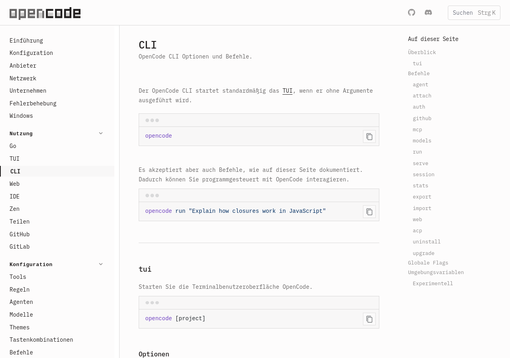
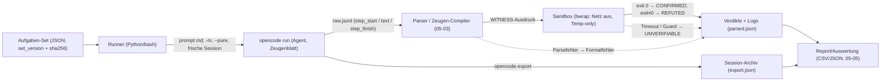

# Test-Harness für diese Maschine

Diese Datei legt fest, **wie** die Notations-Experimente (Prinzipien in [05-01](05-01-designprinzipien.md), Sprache in [05-02](05-02-notations-spezifikation.md), Mapping in [05-03](05-03-mapping-formal.md)) auf dieser Maschine ausgeführt, protokolliert und ausgewertet werden. Sie beschreibt drei Ausführungswege mit ehrlichem Status, das Format der Aufgaben-Sets, die Sandbox für die Zeugen-Ausführung, das Logging, die Determinismus-Ersatzstrategie und die wörtlichen Nachweis-Kommandos. Alles, was hier als „verifiziert“ steht, wurde am 2026-09-12 auf dieser Maschine tatsächlich ausgeführt; alles andere ist als Setzung oder Skizze markiert.

## 1. Ausführungswege

### 1.1 `opencode run` — primär (lokal verifiziert, 2026-09-12)

Primärweg ist der nicht-interaktive Modus des lokalen Binaries `~/.opencode/bin/opencode` in Version `1.18.27-patched.170` (lokal verifiziert: `opencode --version`, 2026-09-12). Die offizielle Doku beschreibt das als „Run opencode in non-interactive mode by passing a prompt directly“ und das Flag `--format` als „default (formatted) or json (raw JSON events)“ ([CLI](https://opencode.ai/docs/cli/, accessed 2026-09-12)). Der verifizierte Smoke-Test (exit = 0) lautet wörtlich:

```bash
~/.opencode/bin/opencode run -m deepseek/deepseek-flash --pure --format json "Antworte mit exakt einem Wort: OK"
```

Beobachtet wurden genau drei Event-Typen: `step_start`, `text` (`part.text = "OK"`) und `step_finish`; jede Zeile trägt `sessionID` und `timestamp`. Die Token-Metrik steht in `step_finish.part.tokens`, daneben `cost`. Zwei Läufe desselben Mini-Prompts (Erstmessung aus der Vorbereitung, Reproduktion für diese Datei):

| Messung | input | output | reasoning | cache.read | cost | exit |
|---|---|---|---|---|---|---|
| Erstmessung (Vorbereitung, 2026-09-12) | 28068 | 2 | 770 | 5120 | — | 0 |
| Reproduktion (dieser Lauf, 10:58) | 21462 | 2 | 90 | 11904 | 0.003310212 | 0 |

Die Felder variieren zwischen Läufen (Cache-Wärme, Reasoning-Länge); stabil ist `output = 2` für den Ein-Wort-Prompt. Zwei Konsequenzen sind für den Harness zentral: (1) Der **fixe Input-Overhead pro Run liegt bei ~21–28k Tokens** (Systemprompt und Werkzeugdefinitionen von opencode) — für einen Prompt von sechs Wörtern. Kosten und Latenz eines Runs werden von diesem Sockel dominiert, nicht vom Aufgaben-Prompt. (2) Als Token-Metrik des Modells zählt der generierte Anteil `output + reasoning`; `input` und `cache.read` sind Umgebung, keine Antwort (`total` ist die Summe der vier Felder, verifiziert am Reproduktionslauf: 21462 + 2 + 90 + 11904 = 33458).

Relevante Flags (lokal verifiziert gegen `opencode run --help`, 2026-09-12): `-m/--model`, `--format json|default`, `--agent`, `--dir`, `-s/--session`, `-c/--continue`, `--fork`, `--variant` („model variant (provider-specific reasoning effort …)“), `--thinking`, `--pure` („run without external plugins“) und `--auto`. Für den Harness sind `-m` und `--pure` Pflicht: explizite Modellwahl (siehe unten) und keine Plugin-Seiteneffekte.

Modellwahl braucht Disziplin: Die opencode-Ladepriorität ist (1) das `--model`-Flag, (2) die Modellliste der Konfiguration, (3) **„The last used model“**, (4) eine interne Priorität ([Models](https://opencode.ai/docs/models/, accessed 2026-09-12)) — Punkt (3) wäre eine stille Zustandsabhängigkeit zwischen Läufen. Der Runner setzt deshalb in jedem Aufruf `-m deepseek/deepseek-flash`.

Zwei ehrliche Lücken: Das **Event-Schema von `--format json` ist undokumentiert** — die Doku sagt nur „raw JSON events“, die Feldnamen hier stammen aus lokaler Beobachtung, nicht aus einer Spezifikation. Und Sessions akkumulieren: `-s/--session` (plus `--fork`) machen Folge-Läufe kontextreich, was für Vergleiche unerwünscht ist; der Standard im Harness ist eine frische Session pro Aufgabe, die `sessionID` wird im Log mitgeführt.

Session-Archivierung: `opencode export <sessionID>` — „Export session data as JSON“ ([CLI](https://opencode.ai/docs/cli/, accessed 2026-09-12)); lokal verifiziert mit der Smoke-Session (`ses_f6b2978f9ffeMBSkoDnb86lwXX` → exit 0, 4,8 KB JSON mit den Schlüsseln `info` und `messages`, 2026-09-12).



*Abbildung 1: Die dokumentierten Flags von `opencode run` und der Befehl `opencode export` (Screenshot der Quelle [CLI](https://opencode.ai/docs/cli/, accessed 2026-09-12), aufgenommen 2026-09-12 mit Headless-Firefox; Datei 105 KB).*

### 1.2 Direkter HTTP-Pfad über den lokalen Proxy (alternativ, ungeklärt)

Neben opencode existiert ein direkter HTTP-Pfad zum Modell: Die lokale Konfiguration setzt `baseURL: http://localhost:9099/v1` (lokale Quelle: `~/.config/opencode/opencode.json`, gelesen 2026-09-12). Auf Port 9099 lauscht der yesmem-Proxy (lokale Messung, 2026-09-12: `ss -ltnp` zeigt `127.0.0.1:9099`, Prozess `yesmem`, PID 342443). Beide relevanten Endpunkte verlangen einen `x-api-key`: Ohne Schlüssel antworten `GET /v1/models` und `POST /v1/chat/completions` mit HTTP 401 (lokale Messung, 2026-09-12). Die **Schlüsselherkunft ist in dieser Umgebung nicht verifiziert**: Weder die Schlüssel aus `auth.json` noch das Passwort aus `service-v2.json` wurden akzeptiert (HTTP 401; Vorbereitungsbefund vom 2026-09-12, in diesem Entwurfslauf nicht wiederholt). Dieser Weg ist damit **offen** und wird hier nicht als funktionierend dargestellt. Er wäre attraktiv, weil er den ~25k-Token-Overhead von opencode vermeidet und `prompt_cache_hit_tokens` sowie `completion_tokens_details.reasoning_tokens` direkt liefert ([Chat Completions API](https://api-docs.deepseek.com/api/create-chat-completion, accessed 2026-09-12)) — bis zur Klärung der Authentifizierung bleibt der Harness bei `opencode run`.

**Nachtrag 2026-09-12 (verifiziert):** Der Vorbehalt ist ausgeräumt. `POST http://localhost:9099/v1/chat/completions` mit `model: deepseek-flash` und dem DeepSeek-Schlüssel aus `~/.local/share/opencode/auth.json` liefert HTTP 200 — sowohl mit `Authorization: Bearer <key>` als auch mit `x-api-key: <key>`; die Antwort trägt `message.reasoning_content` und `usage.completion_tokens_details.reasoning_tokens`. Der Pilotlauf nutzte diesen Pfad (kein opencode-Systemprompt-Sockel, keine Werkzeuge); Details und Abweichung siehe [05-08](05-08-pilotbericht-v1.1.md) §6.1.

### 1.3 bemyself-Tooling als Muster (lokal)

Der Harness übernimmt Konventionen aus dem lokalen `bemyself`-Repo (alle Quellen gelesen 2026-09-12):

- **Set als öffentliches Artefakt.** `bemyself/eval.py` liest ein JSON-Set, baut eine deterministische Fixture, berichtet Raten und Thresholds statt Einzelurteile und nutzt die Exit-Codes `0` (OK), `1` (failed), `2` (error), `4` (strict); die Unterbefehle `check`/`eval` und `--json` für maschinenlesbare Ausgabe stehen in `bemyself/cli.py` (lokale Quellen, gelesen 2026-09-12).
- **Determinismus als Anker.** `bemyself/evalset.py`: „The fixture is a local git repository built from fixed content, a fixed identity and fixed commit dates, so rebuilding it reproduces the same commit hashes“ (lokale Quelle, Original-Zitat) — das Set bettet Commit-Hashes ein. Der Notations-Harness ersetzt Commit-Hashes durch Set-Hash plus Aufgaben-IDs (Abschnitt 2).
- **Claim-/Verdikt-Modell.** `bemyself/model.py` definiert `Claim` und `Verdict = CONFIRMED | REFUTED | UNVERIFIABLE` (lokale Quelle) — dieselben drei Verdikte nutzt die Notation ([05-02](05-02-notations-spezifikation.md)).
- **Read-only-Disziplin.** `bemyself/scratchpad.py` öffnet die Datenbank explizit mit `mode=ro` („the verifier reads the section text and must never modify the database“, lokale Quelle) — Muster für den Auswertungsteil des Harness: Er liest Läufe, er schreibt kein Modell.
- **Sandbox als harte Kette.** `bemyself/checks.py` (Commit `6d82c4b`, „P6 test-command sandbox via bwrap“): „require is a hard gate: when no bwrap is on PATH the command is never run, not even unsandboxed -- a fallback would be silent by construction“ (lokale Quelle).

## 2. Aufgaben-Sets

**Tier A — Mikro-Bench.** Kleine Aufgaben aus ganzzahliger Arithmetik, Modulararithmetik und endlichen Aussagen, deren Antwort automatisch mit V1-Zeugen prüfbar ist (Zeugenwege `auto`, `py:`, `range` aus [05-02](05-02-notations-spezifikation.md) Abschnitt 4). Ziel ist eine Aufgabenmenge, die für gepaarte Statistik groß genug ist — Stichprobengröße und Auswertungsverfahren legt [05-05](05-05-ablation-protokoll.md) fest.

**Tier B — Testfeld-Fragmente.** Aufgaben aus dem offenen Testfeld, in drei Familien entlang der Empfehlung [04-04](../04-offene-probleme/04-04-empfehlung.md) (Datei liegt vor, Stand 2026-09-12; Primärempfehlung BB(6)/bbchallenge-Fragmente; Datenanker in [04-03](../04-offene-probleme/04-03-rechenfragmente-daten.md), gelesen 2026-09-12):

- **(i) Halte-Claims** (BB(6)-Kandidaten): Claim „hält" bzw. „hält innerhalb k Schritte"; Zeuge ist der Expander-/Simulator-Lauf, Verdikt per Referenz-Simulation.
- **(ii) Endliche Nicht-Halt-Claims:** „hält nicht innerhalb k Schritte" mit Schritt-Schranke als Zeuge. Echte Nicht-Halt-Claims sind mit der heutigen Mechanik nicht abbildbar — 04-04 sagt das ausdrücklich (endliche Horizonte); dokumentierte Nicht-Halt-Fälle aus 04-03 laufen nur, soweit ein Decider-Zertifikat einen endlichen Horizont belegt.
- **(iii) T2-Trace-Aufgaben (Kernfamilie aus 04-04):** „Expander + Simulator" — das Modell expandiert eine kompakte Maschinenbeschreibung und produziert die Schrittfolge; geprüft wird durch Rekonstruktion (Verdict-Trefferquote, Tokens je Trace, Abweichung der rekonstruierten Schrittfolge — Metriken (a)/(b)/(g) in [05-05](05-05-ablation-protokoll.md) Abschnitt 4).

Tier B ist erkennbar riskanter als Tier A: Zeugen sind teurer, Kontexte länger, Ausfallraten höher — die Tier-Trennung hält den Mikro-Bench davon unabhängig.

**Keine erfundenen Benchmarks.** Diese Datei legt nur das Format fest; die Aufgaben selbst entstehen in der Umsetzungsphase (generierte Tier-A-Aufgaben, ausgewählte Tier-B-Fragmente). Herkunft und Lizenz sind Pflichtfelder je Aufgabe.

```json
{
  "set_version": "0.1",
  "created": "2026-09-12",
  "tasks": [
    {
      "id": "A-0001",
      "tier": "A",
      "prompt": "Wende die V1-Notation an: Berechne 47 * 89 und belege das Ergebnis mit CLAIM/WITNESS/[HALT].",
      "notation": "v1",
      "expected": "4183",
      "witness": "py: 47 * 89 == 4183",
      "source": "generiert (Generator g1, seed=1)",
      "license": "CC0-1.0 (selbst erzeugt)"
    }
  ]
}
```

Feld-Semantik (Setzung): `expected` ist die Referenzantwort; der Runner führt den `witness`-Ausdruck (V1-Grammatik) aus und protokolliert Verdikt **und** Konsistenz witness↔`expected` getrennt — der witness trägt das Verdikt, `expected` dient dem Abgleich, nicht als Ersatz-Verdikt. Tier-B-Aufgaben tragen zusätzlich `tier_b_kind` (`hold` | `bounded_nonhalt` | `trace`); bei `trace` außerdem `machine` (kompakte Übergangsbeschreibung), `horizon` (Schritt-Schranke) und `trace_expected` (Referenz-Schrittfolge als Datei-Hashverweis). `source` und `license` dokumentieren die Herkunft. **Satz-Versionierung:** Sets sind unveränderlich; jede Änderung erzeugt eine neue `set_version`, und jeder Lauf protokolliert `set_version` + `set_sha256` — damit ist ein Ergebnisbericht an genau einen Aufgabenstand gebunden.

## 3. Sandbox: Zeugen-Ausführung unter bwrap

Modell-Zeugen (`py:`-Ausdrücke) und die Runner-Kompilate der `auto`/`range`-Wege werden sandboxed ausgeführt. Vorhandene Infrastruktur: `--sandbox=auto|require|off` mit bwrap (lokal: Commit `6d82c4b`, gelesen 2026-09-12); `bwrap` ist installiert (lokal verifiziert: `command -v bwrap` → `/usr/bin/bwrap`, 2026-09-12). Der Harness nutzt `require`: Fehlt bwrap, wird der Zeuge **nicht** ausgeführt — kein stiller unsandboxed-Fallback (Muster aus `bemyself/checks.py`, lokale Quelle). Innerhalb der Sandbox gilt: kein Netzwerk, Schreibzugriff nur auf ein Temp-Verzeichnis. Limits (Setzung, [05-02](05-02-notations-spezifikation.md) Abschnitt 4): 10 s Laufzeit pro Zeuge; Speicherbegrenzung über `ulimit -v` in der Sandbox-Kette (Skizze, auf dieser Maschine noch nicht als Harness-Teil getestet). **Überschreitung ⇒ `UNVERIFIABLE`**, nie ein stiller Abbruch oder eine Näherung — dieselbe Ehrlichkeit wie im Vorbild, das eine Unpruefbar-Quote berichtet statt sie zu verstecken (lokale Quelle: `bemyself/eval.py`).

## 4. Logging und Archivierung

Pro Lauf entsteht genau ein Verzeichnis im Worktree:

```
.yesmem/tmp/runs/<YYYYMMDD-HHMM>/<task-id>/
  prompt.md      # der exakt gesendete Prompt
  raw.jsonl      # unveränderte Event-Zeilen aus --format json
  parsed.json    # Claims, Verdikte, Tokens (output+reasoning), wallclock, sessionID
  runner.log     # stderr des Runs, Exit-Code, Zeitstempel (im Smoke-Lauf noch leer, s. u.)
  export.json    # optional: opencode export <sessionID> als Session-Archiv
```

Die Aggregation (geplant; ein `aggregate.py` im Wiki-Tooling, nicht Teil dieser Datei) liest alle `parsed.json` eines Lauf-Baums und schreibt CSV/JSON für [05-05](05-05-ablation-protokoll.md). Der Smoke-Lauf dieser Datei liegt real unter `.yesmem/tmp/runs/20260912-1100/smoke/` mit `raw.jsonl`, `export.json` und noch leerem `runner.log` (0 B — ehrliche Lücke: die vollständige Kette (c) schreibt ihn erst nach Parser-/Runner-Existenz; der Smoke nutzte `raw.jsonl` + `export.json`). **Regel: kein Log außerhalb des Worktrees.** `.yesmem/tmp/` ist dafür bereits ignoriert (lokal verifiziert: `.gitignore` Zeile 2, 2026-09-12), sodass Lauf-Daten die Repo-Historie nicht berühren. `export.json` kommt von `opencode export` (Abschnitt 1.1) und archiviert die komplette Session — Beweislast für A/B-Vergleiche, unabhängig von selbstgeschriebenen Parsern.

## 5. Determinismus: Wiederholungen statt Seeds

Nüchterne Befundlage — **kein Determinismus-Schalter existiert auf diesem Pfad**:

- Kein `seed`-Parameter: Das Request-Schema der Chat-Completions-API dieses Modells kennt ihn nicht ([Chat Completions API](https://api-docs.deepseek.com/api/create-chat-completion, accessed 2026-09-12)).
- `temperature` ist im Thinking-Mode (Standard an) **wirkungslos** ([Chat Completions API](https://api-docs.deepseek.com/api/create-chat-completion, accessed 2026-09-12)); die `top_p`-Untergrenzen (≥ 0,95 im Thinking-Mode, 1,0 fixiert im Non-Thinking-Mode) dokumentiert der Thinking-Mode-Leitfaden ([Thinking Mode](https://api-docs.deepseek.com/guides/thinking_mode, accessed 2026-09-12)).
- opencode setzt Sampling-Parameter über die Agent-Konfiguration; ohne Angabe gelten modellspezifische Defaults, „typically 0 for most models“ ([Agents](https://opencode.ai/docs/agents/, accessed 2026-09-12)) — für dieses Modell sind die Sampling-Regler als Varianzhebel damit weitgehend ausgeschaltet.
- Seeds sind auch dort, wo sie existieren, „best effort“: „make a best effort to sample deterministically … Determinism is not guaranteed“ ([OpenAI Cookbook](https://cookbook.openai.com/examples/reproducible_outputs_with_the_seed_parameter, accessed 2026-09-12)).
- Temperatur-Absenkung als Varianzreduktion ist umstritten: „It may be tempting to reduce the ‘sampling temperature’ of the model in order to reduce (or eliminate) the conditional variance. However, we advise against this practice, unless the purpose is to study the model at the new temperature“ ([Adding Error Bars](https://arxiv.org/abs/2411.00640, accessed 2026-09-12), Abschnitt 3.3).

**Konsequenz (Setzung):** Determinismus wird nicht simuliert, sondern durch **Wiederholungen R ≥ 3 pro Aufgabe** ersetzt — plus feste Prompts, `--pure`, explizite Modellangabe (`-m`) und frische Sessions. Berichtet werden Raten mit Unsicherheitsmaß; die Statistik-Pflichten (Stichprobengröße, Konfidenzintervalle, gepaarte Vergleiche) stehen in [05-05](05-05-ablation-protokoll.md). Ein einzelner Lauf ist Beobachtung, kein Ergebnis.

## 6. Harness-Architektur



*Abbildung 2: Aufgaben-Set → Runner → opencode → Parser → Sandbox → Verdikte/Logs → Report. Fehlerpfade gestrichelt: Parsefehler werden als Formatfehler, Timeout/Guard-Überschreitung als `UNVERIFIABLE` geführt. Der Zeugen-Compiler gehört zu [05-03](05-03-mapping-formal.md).*

## 7. Reproduzierbare Kommandos

**(a) Smoke-Test** (wörtlich, verifiziert 2026-09-12, exit = 0):

```bash
~/.opencode/bin/opencode run -m deepseek/deepseek-flash --pure --format json "Antworte mit exakt einem Wort: OK"
```

**(b) Events ohne jq parsen** (verifiziert 2026-09-12 am Smoke-Lauf):

```bash
python3 -c "
import json, sys
for line in sys.stdin:
    e = json.loads(line)
    if e.get('type') == 'step_finish':
        t = e['part'].get('tokens', {})
        print(e['sessionID'], 'output=%s reasoning=%s cost=%s' % (t.get('output'), t.get('reasoning'), e['part'].get('cost')))
" < raw.jsonl
```

Ausgabe am Smoke-Lauf: `ses_f6b2978f9ffeMBSkoDnb86lwXX output=2 reasoning=90 cost=0.003310212`.

**(c) Runner-Aufruf pro Aufgabe** (Skizze, nicht als Ganzes getestet — Parser und Zeugen-Compiler existieren noch nicht, siehe [05-03](05-03-mapping-formal.md)):

```bash
# Skizze 2026-09-12; $set und $task_id kommen vom Aufrufer
run_dir=".yesmem/tmp/runs/$(date +%Y%m%d-%H%M)/$task_id"; mkdir -p "$run_dir"
python3 tooling/select_task.py --set "$set" --id "$task_id" > "$run_dir/prompt.md"
timeout 120 ~/.opencode/bin/opencode run -m deepseek/deepseek-flash --pure --format json \
  "$(cat "$run_dir/prompt.md")" > "$run_dir/raw.jsonl" 2> "$run_dir/runner.log"
echo "exit=$?" >> "$run_dir/runner.log"
python3 tooling/parse_sheet.py "$run_dir" && python3 tooling/run_witnesses.py --sandbox=require "$run_dir"
```

**(d) Nachweis-Kommandos** (verifiziert 2026-09-12):

```bash
python3 --version                     # Python 3.12.3
command -v bwrap firefox pdftotext    # /usr/bin/bwrap, /usr/bin/firefox, /usr/bin/pdftotext
~/.opencode/bin/opencode --version    # 1.18.27-patched.170
```
