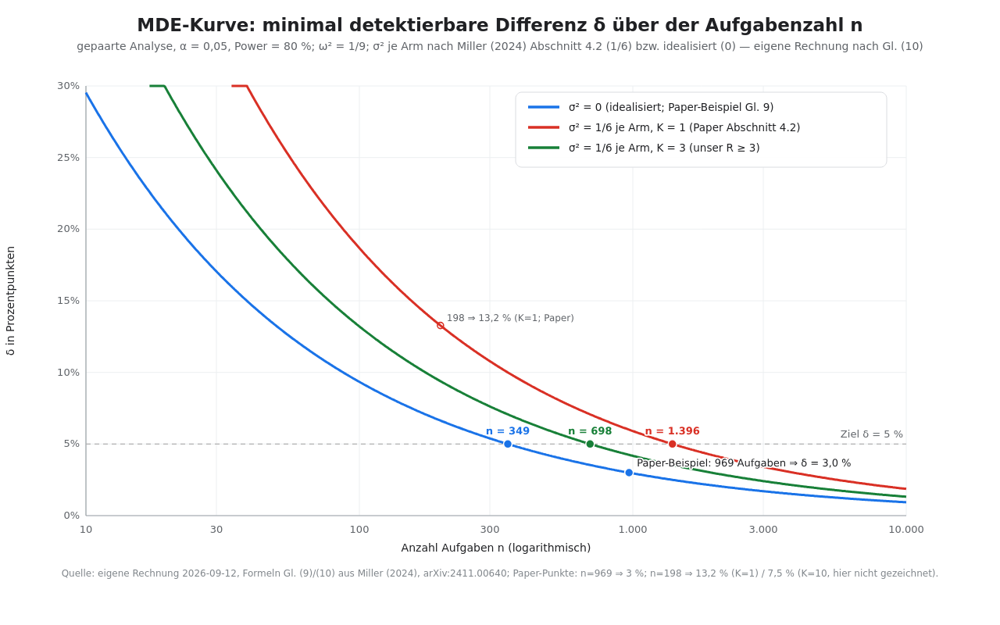

# Ablations- und A/B-Protokoll

Dieses Dokument legt fest, wie die Notations-Hypothese gemessen wird: welcher Arm gegen welchen antritt, welche Kontrollen die bekannte Formatsensitivität von Sprachmodellen abfangen, wie oft wiederholt wird, welche Metriken zählen, wie groß die Stichprobe werden muss und unter welchen Regeln ausgewertet und berichtet wird. Es ist das statistische Gegenstück zu [05-04](05-04-test-harness.md) (Ausführung, Logging) und die Messanordnung zu [05-02](05-02-notations-spezifikation.md) (Sprache V1); die Erfolgsschwellen liefert [05-06](05-06-erfolgskriterien-risiken.md). Jede Tatsachenbehauptung trägt eine Quelle, ist als lokale Beobachtung (2026-09-12) markiert oder ausdrücklich als Setzung gekennzeichnet.

## 1. Frage und Arme

**Frage.** Bringt die Notation V1 (Abschnitt 9 der [05-02](05-02-notations-spezifikation.md)) bei identischen Aufgaben, identischem Modell (`deepseek/deepseek-flash`) und identischem Harness ([05-04](05-04-test-harness.md)) eine höhere verifizierte Trefferquote als die übliche mathematische Schreibweise mit Prosa-Zwischenschritten — und zu welchen Kosten (generierte Tokens, Schritte, Formatfehler)? Sekundärfrage: sinkt die Rate falsch-bestätigter Behauptungen (Definition in Abschnitt 4e)?

**Arme.**

- **Behandlung — V1-Blatt:** zweizonige Notation, Zeugenpflicht (`CLAIM`/`WITNESS`), `[HALT]`-Trace; die Verdikte kommen vom Zeugen-Runner, nicht vom Modell ([05-02](05-02-notations-spezifikation.md) Abschnitte 3–4).
- **Kontrolle — Standard-Schreibweise:** übliche Mathe-Schreibweise mit Prosa-CoT und explizit verlangter Endantwort. Fairness-Regel (Setzung): Die Präambeln beider Arme sind strukturgleich; der Kontrollarm erhält eine eigene kanonische Endantwort-Konvention („Endantwort: …"), damit die automatische Auswertung beide Arme gleich stark instruiert prüft — sonst misst man Extraktions-, nicht Notationseffekte. Referenzprüfung in beiden Armen: die `witness`-Zeile des Aufgaben-Sets ([05-04](05-04-test-harness.md) Abschnitt 2).
- **Paarung:** jede Aufgabe läuft in beiden Armen (gleiche `id`, gleiche `set_version` + `set_sha256`).

**Sub-Ablationen (Schalter S1–S5 aus [05-02](05-02-notations-spezifikation.md) Abschnitt 9).** Nur mit Restbudget, gestaffelt nach erwartetem Erkenntniswert:

| Rang | Schalter | Design | Begründung der Priorität |
|---|---|---|---|
| 1 | S2 Zahlengruppierung | 2×2-Mini-Faktordesign in Tier A (flach vs. Spalten × ohne/mit Komma-Gruppen) | stärkste externe Messlage (Ausrichtung und Gruppierung verschieben Additionsgenauigkeit um zweistellige Prozentbeträge bei GPT-artigen Tokenizern) [Tokenization counts](https://arxiv.org/abs/2402.14903, accessed 2026-09-12); für dieses Modell ungemessen |
| 2 | S1 Zeichensatz | 2-armig: ASCII vs. Unicode | größte Evidenzlücke des Entwurfs ([05-01](05-01-designprinzipien.md)); billig zu variieren |
| 3 | S3 Zonen-Radikalität | 2-armig: Zwei-Zonen vs. durchgängig strikt | prüft die zentrale Designentscheidung P3; Referenzevidenz: strikte Ausgabe-Grammatiken schaden Reasoning [Let Me Speak Freely](https://arxiv.org/abs/2408.02442, accessed 2026-09-12) |
| 4 | S5 Zeugenweg | 2-armig: `auto` vs. modellgeschriebene `py:`-Zeugen | ungemessene Design-Setzung; wirkt direkt auf die Falschbestätigungsrate |
| 5 | S4 Klammerung | 2-armig: voll vs. minimal | niedrigste Priorität: Klammer-/Whitespace-Varianten zeigten als Einzelmerkmal in der einzigen auffindbaren Referenzmessung (Prompt-Formatierung) keine messbare Wirkung [FormatSpread](https://arxiv.org/abs/2310.11324, accessed 2026-09-12); teuer im Parser |

Budget-Regel (Setzung): Das Haupt-A/B (V1 vs. Standard) hat Vorrang; Sub-Arme starten erst nach dem Hauptlauf mit festem n. Faktorielle Mini-Designs sind Einzelarmen vorzuziehen, weil Einzelmerkmale schwach und Interaktionen plausibel sind [FormatSpread](https://arxiv.org/abs/2310.11324, accessed 2026-09-12). **Fallzahlen je Sub-Arm:** nach dem Kalibrierlauf und **vor** Einschluss registriert (Platzhalter bis dahin); jede Zelle erhält dieselbe Aufgabenzahl, die 2×2-Zellen von S2 werden balanciert über die Tier-A-Aufgaben verteilt. Ohne registrierte Fallzahl startet kein Sub-Arm.

## 2. Kontrollen

Format-Sensitivität ist die dominante Störgröße: bedeutungserhaltende Formatänderungen erzeugen bis zu 76 Punkte Spread in der Genauigkeit (LLaMA-2-13B), im Median 7,5 Punkte bei 10 zufälligen Formaten, und 24 % aller atomaren Formatänderungen verschieben die Genauigkeit um mindestens 5 Punkte [FormatSpread](https://arxiv.org/abs/2310.11324, accessed 2026-09-12). Ein Design, das ein Behandlungsformat gegen genau ein Kontrollformat stellt, würde deshalb womöglich Formatrauschen messen. Die Regeln:

1. **Format-Spread-Kontrolle (Setzung).** Je Arm werden ≥ 3 neutrale Alternativformate gebaut (Oberflächenvarianten der Präambel: Wortlaut, Satzstellung, Absatzstruktur — ohne Eingriff in die Notationsgrammatik), zufällig über Aufgaben rotiert und gegeneinander gemittelt. Standard ist die Rotation: jede Aufgabe×Arm erhält genau eine Variante, balanciert über die Aufgaben; ausgewertet wird über Aufgaben, sodass beide Arme über dasselbe Formate-Set gemittelt sind — Formatvarianz fließt so in ω², nicht in den Armeffekt. Formate als zusätzlicher Within-Faktor über alle Zellen vervielfachen die Läufe und bleiben optional. Berichtet wird neben dem Arm-Mittel der Spread je Arm; der Notationseffekt wird erst interpretiert, wenn er den Formate-Spread übersteigt.
2. **Stil-/Varianz-Grundrauschen (Setzung).** Ein Null-Kontrollarm (identische Notation, nur Stil variiert) quantifiziert das Grundrauschen; Referenzstudien zeigen Prompt-Stil-Effekte bis 45 Punkte (ARC-Easy 72,4 % vs. 26,5 %) [Lessons from the Trenches](https://arxiv.org/abs/2405.14782, accessed 2026-09-12). Die Schwelle „Effekt größer als Grundrauschen" wird in [05-06](05-06-erfolgskriterien-risiken.md) registriert.
3. **Aufgabenreihenfolge randomisieren (Setzung).** Permutationssensitivität ist belegt — die Reihenfolge von Beispielen kippt Ergebnisse (88,7 % vs. 51,6 % nach Modellwechsel; Rangkorrelation zwischen Modellen 0,05) [Fantastically Ordered Prompts](https://arxiv.org/abs/2104.08786, accessed 2026-09-12). Pro Block wird die Aufgabenreihenfolge per festem Losentscheid gemischt und im Log dokumentiert; die Arm-Reihenfolge innerhalb einer Aufgabe wird ebenfalls randomisiert (Regel 5).
4. **Frische Sessions.** Jede Aufgabe×Arm startet eine neue Session ([05-04](05-04-test-harness.md); Session-ID wird geloggt); kein `--continue`, kein `-s`.
5. **Identische Aufwärm-Bedingungen (Kontext-Größe).** Der fixe Input-Sockel von opencode liegt je nach Cache-Zustand bei 21–28k Tokens (lokale Beobachtungen; [05-04](05-04-test-harness.md)) und dominiert Latenz und Kosten eines Laufs. Deshalb: ein nicht gewerteter Warmup-Call pro Block, feste Flags (`-m`, `--pure`, `--format json`), Randomisierung der Arm-Reihenfolge je Aufgabe und Protokollierung von `input`/`cache.read` pro Lauf — ein systematischer Cache-Vorteil eines Arms wird so sichtbar statt sich im Ergebnis zu verstecken.

## 3. Wiederholungen

Es gibt keinen Seed: Das Request-Schema des Modells dokumentiert keinen `seed`-Parameter, und im Thinking-Mode (Standard) ist `temperature` wirkungslos; `top_p` wird auf ≥ 0,95 gehoben ([Chat Completions API](https://api-docs.deepseek.com/api/create-chat-completion, accessed 2026-09-12); [Thinking Mode](https://api-docs.deepseek.com/guides/thinking_mode, accessed 2026-09-12)). Determinismus wird deshalb nicht simuliert, sondern durch Wiederholungen ersetzt ([05-04](05-04-test-harness.md)): **R ≥ 3 Läufe pro Aufgabe×Arm** (Setzung). R entspricht dem K der Stichprobenformel (Abschnitt 5).

**Auswertung auf Aufgaben-Ebene (Entscheidung).** Primär gilt das **Mehrheits-Verdikt** (≥ 2 von 3 Läufen bestehen). Begründung: Läufe sind stochastisch; das strengere „alle R müssen bestehen" zählt Sampling-Ausfälle als Aufgaben-Fehler (bei Einzeltrefferquote p = 0,9 sinkt die Aufgaben-Trefferquote auf 0,9³ ≈ 73 %, die Mehrheitsregel bleibt bei ≈ 97 % — eigene Rechnung). Das All-R-Kriterium wird als Sensitivitätsanalyse mitberichtet, ebenso die mittlere Aufgaben-Trefferrate s̄ᵢ über R; sie ist die Größe, die als σ²/K in die Power-Rechnung eingeht. Tier B (knapper Aufgabenpool) darf auf R = 5 aufstocken, wenn Budget vorhanden und vorab registriert ist; für R = 5 gilt dieselbe Mehrheitsregel mit ≥ 3 von 5 Stimmen.

## 4. Metriken

| # | Metrik | Definition | Quelle der Wahrheit |
|---|---|---|---|
| a | Trefferquote | Aufgabe gelöst = alle `[HALT]`-Claims `CONFIRMED` und erwarteter Wert enthalten; `REFUTED`/`UNVERIFIABLE`/Formatfehler = nicht gelöst | Zeugen-Runner-Verdikte ([05-04](05-04-test-harness.md)) |
| b | Tokens/Aufgabe | generierte Tokens = `output + reasoning` aus `step_finish.part.tokens`; fixer Input-Overhead (~28k) wird getrennt ausgewiesen | `raw.jsonl` (lokale Beobachtungen: 28.068 / 21.462 Input; 770 / 90 Reasoning) |
| c | Schritte bis Ergebnis | Turns = Anzahl `step_start`-Events je Aufgabe (arm-vergleichbar); im Behandlungsarm zusätzlich die Zahl der `S…:`-Zeilen | `raw.jsonl`, Parser |
| d | Formatfehlerquote | Anteil Blätter mit Parsefehlern, unvollständiger Behauptungszone oder fehlendem `[HALT]` | Parser ([05-03](05-03-mapping-formal.md)) |
| e | Falschbestätigungsrate | Anteil Claims, die das Blatt als belegt führt, die der Runner aber `REFUTED` liefert (bemyself-Sinn; Verdikt-Modell `CONFIRMED|REFUTED|UNVERIFIABLE`) | Runner-Trace |
| f | Wanduhrzeit | Differenz `step_start`→`step_finish` je Lauf plus Gesamtzeit aus `runner.log` | `raw.jsonl`/Log (lokale Beobachtung: 4,18 s / 1,30 s Mini-Prompt) |
| g | Trace-Fidelity (nur Tier B, T2) | Erste abweichende Position der rekonstruierten Schrittfolge (0 = identisch) und Tokens je Trace | Referenz-Simulation ([05-04](05-04-test-harness.md) Abschnitt 2, `trace_expected`) |

Zu (b): Der Input-Sockel gehört zur Umgebung, nicht zur Antwort — er wird nie in den Notationseffekt gerechnet, sondern separat als Kosten- und Latenztreiber berichtet (lokale Beobachtungen vom 2026-09-12; Werte oben aus `.yesmem/tmp/harness-probe/out.jsonl` und dem Smoke-Lauf, vgl. [05-04](05-04-test-harness.md) Abschnitt 1.1). Zu (e): Der Kontrollarm praktiziert zwangsläufig „stille Fehler" (falsche Endantwort ohne Warnsignal); die Metrik ist im Behandlungsarm die Härteprobe — genau der Fall aus dem Widerlegungs-Beispiel in [05-02](05-02-notations-spezifikation.md) Abschnitt 5.3.

## 5. Statistik (mit Rechnung)

**Design.** Gepaart: dieselben n Aufgaben in beiden Armen; je Aufgabe und Arm R Wiederholungen; Aufgaben-Level-Score (Mehrheits-Verdikt bzw. mittlere Trefferrate). Berichtet werden: die gepaarte mittlere Differenz Δ̂ = Mittel der Aufgaben-Differenzen mit t-basiertem Konfidenzintervall (Setzung; Bootstrap als Sensitivitätscheck), per-Arm-Raten mit Wilson-Intervallen, McNemar-Mid-p als robuster gepaarter Test sowie Effektgrößen (Differenz in Prozentpunkten, Odds-Ratio b/c).

**Stichprobengröße.** Aus [Adding Error Bars to Evals](https://arxiv.org/abs/2411.00640, accessed 2026-09-12), Gl. (9), für die gepaarte Analyse:

`n = (z_{α/2} + z_β)² · (ω² + σ_A²/K_A + σ_B²/K_B) / δ²`

Dabei ist ω² die Varianz der Aufgaben-Differenz in der Superpopulation, σ_A²/σ_B² die Within-Aufgaben-Samplingvarianz je Arm und K_A = K_B = K die Wiederholungen je Aufgabe und Arm (= unser R); n ist die Zahl der **Aufgaben**, nicht der Läufe. Das Papier-Beispiel (σ_A² = σ_B² = 0, ω² = 1/9, δ = 0,03, α = 0,05, β = 0,20) ergibt n ≈ 969 [ebd., Abschnitt 5] — nachgerechnet mit python3 3.12.3:

```bash
python3 - <<'PY'
from math import asin, sqrt
from statistics import NormalDist
z = NormalDist().inv_cdf
ZA, ZB = z(1-0.025), z(1-0.20)
for d in (0.15, 0.10, 0.05, 0.03):
    a = (ZA+ZB)**2 * (1/9) / d**2
    b = (ZA+ZB)**2 * (1/9 + 2*(1/6)/1) / d**2
    c = (ZA+ZB)**2 * (1/9 + 2*(1/6)/3) / d**2
    print(f"delta={d:.2f}: a={a:.1f} b={b:.1f} c={c:.1f}")
print("Paper-Beispiel: %.1f" % ((ZA+ZB)**2*(1/9)/0.03**2))
mde = lambda K: (ZA+ZB)*sqrt((1/9 + 2*(1/6)/K)/198)
print("Paper-Check n=198: K=1 %.4f  K=10 %.4f" % (mde(1), mde(10)))
h = 2*(asin(sqrt(0.6))-asin(sqrt(0.5)))
print("pwr-Welt (ungepaart): n/Gruppe = %.1f" % (2*(ZA+ZB)**2/h**2))
PY
```

Ausgabe (2026-09-12):

```
delta=0.15: a=38.8 b=155.0 c=77.5
delta=0.10: a=87.2 b=348.8 c=174.4
delta=0.05: a=348.8 b=1395.4 c=697.7
delta=0.03: a=969.0 b=3876.0 c=1938.0
Paper-Beispiel: 969.0
Paper-Check n=198: K=1 0.1327  K=10 0.0757
pwr-Welt (ungepaart): n/Gruppe = 387.2
```

Daraus die Platzhalter-Tabelle n(δ), aufgerundet (Werte werden nach dem Kalibrierlauf durch gemessene Varianzen ersetzt):

| δ | (a) σ² = 0, K beliebig (Paper-Beispiel-Basis) | (b) σ² = 1/6 je Arm, K = 1 | (c) σ² = 1/6 je Arm, K = 3 |
|---|---|---|---|
| 0,15 | 39 | 156 | 78 |
| 0,10 | 88 | 349 | 175 |
| 0,05 | 349 | 1.396 | 698 |
| 0,03 | 969 | 3.876 | 1.938 |

Lesart: Spalte (a) ist die Spielwiese des Papier-Beispiels — dort ist K wirkungslos, weil ohne Within-Aufgaben-Varianz nichts zu mitteln ist. Die Spalten (b)/(c) nutzen die konservativeren Papier-eigenen Annahmen aus Abschnitt 4.2 (σ_A² = σ_B² = 1/6, ω² = 1/9); K = 3 ist unser R. Validierung am Papier: Für n = 198 ergibt Gl. (10) mit K = 1 → 13,3 % und K = 10 → 7,6 % (Papier berichtet 13,2 % und 7,5 %; die kleine Abweichung zu unserer Rechnung 13,27/7,57 deutet auf eine feinere z-/Formel-Konvention im Papier — unsere Werte sind mit Standard-z gerechnet). Die Zellen sind Platzhalter, keine Ergebnisse.

**Robustheits-Check McNemar (Mid-p).** Für gepaarte binäre Aufgaben-Verdikte (Behandlung vs. Kontrolle) sei b = „Behandlung trifft, Kontrolle nicht", c = umgekehrt. Der exakte konditionale McNemar-Test und die asymptotische Variante mit Kontinuitätskorrektur sind stark konservativ (mittlere Typ-I-Raten ≈ 2 % statt 5 % über 9.595 enumerierte Szenarien), während die **Mid-p-Variante** empfohlen wird: Sie ist fast so mächtig wie der asymptotische Test ohne Korrektur und verletzte das Nominalniveau in keiner der 9.595 untersuchten Szenarien ([Fagerland et al. 2013](https://www.ncbi.nlm.nih.gov/pmc/articles/PMC3716987, accessed 2026-09-12); Formel: mid-p = exakter zweiseitiger p-Wert − Punktwahrscheinlichkeit des beobachteten Diskordanzwerts). Wichtig: Die **Macht hängt an der Diskordanzrate b + c, nicht an n allein** — ein McNemar-Test mit wenigen Diskordanzen bleibt schwach, egal wie viele Aufgaben gemessen wurden ([McNemar's test](https://en.wikipedia.org/wiki/McNemar%27s_test, accessed 2026-09-12); exakte/asymptotische Implementierung in [statsmodels](https://www.statsmodels.org/stable/generated/statsmodels.stats.contingency_tables.mcnemar.html, accessed 2026-09-12)). Der Kalibrierlauf schätzt b + c und p vorab.

**Wilson-Intervalle.** Für Einzelanteile (Trefferquote, Formatfehlerquote je Arm) werden Wilson-Intervalle berichtet, nicht Wald-Intervalle; sie sind asymmetrisch und bleiben bei p̂ nahe 0 oder 1 robust ([Binomial proportion confidence interval](https://en.wikipedia.org/wiki/Binomial_proportion_confidence_interval, accessed 2026-09-12)): `CI = ( p̂ + z²/(2n) ± z·sqrt( p̂(1−p̂)/n + z²/(4n²) ) ) / (1 + z²/n)`.

**Multiplizität und Analyseplan (Setzung).** Primärer, konfirmatorischer Test ist **K1** (verifizierte Trefferquote, α = 0,05, einseitig in Richtung Notation bei zweiseitigem CI). K2–K5 ([05-06](05-06-erfolgskriterien-risiken.md)) und alle Sub-Ablationen sind sekundär/explorativ: sie werden mit Effektgrößen und Intervallen berichtet, aber ihre Signifikanz zählt nicht als Bestätigung der Hauptthese und wird nicht als „bestätigt“ etikettiert. Damit ist die Zahl der Kriterien kein Multiplizitätsproblem für K1.

**Kalibrierlauf vor der n-Festlegung (Setzung).** 30–50 Aufgaben × beide Arme × R schätzen: Baseline-Rate p̂, Diskordanz b + c, Within-Varianz σ̂² (Streuung der Läufe einer Aufgabe) und Differenzvarianz ω̂². Erst danach wird n über Gl. (9) festgelegt; bei festem Budget wird stattdessen das MDE über Gl. (10) berichtet. Der Kalibrierlauf dient ausschließlich der Varianzschätzung; sein Haupteffekt wird nicht ausgewertet (keine verdeckte Zwischenauswertung).



*Abbildung 1: Minimal detektierbare Differenz δ (in Prozentpunkten) als Funktion der Aufgabenzahl n nach Gl. (10) aus [Adding Error Bars to Evals](https://arxiv.org/abs/2411.00640, accessed 2026-09-12); gepaarte Analyse, α = 0,05, Power 80 %. Blau: idealisiert σ² = 0 (Papier-Beispiel, n = 969 ⇒ δ = 3,0 %). Rot/grün: σ² = 1/6 je Arm mit K = 1 bzw. K = 3 (Papier-Abschnitt 4.2; K = 3 entspricht unserem R). Zusätzlich markiert: Papier-Punkt n = 198 ⇒ 13,2 % (K = 1) sowie der Aufgabenbedarf bei Ziel δ = 5 % (349 / 698 / 1.396). Eigene Rechnung, 2026-09-12.*

## 6. Ablaufplan

1. **Pre-Registrierung.** Arm-Definitionen, Prompt-Vorlagen, Metrik-Definitionen, Erfolgsschwellen ([05-06](05-06-erfolgskriterien-risiken.md)), Stoppregeln und die Auswertungsskripte werden vor dem ersten Hauptlauf eingefroren; das Aufgaben-Set trägt `set_version` + `set_sha256` ([05-04](05-04-test-harness.md)).
2. **Kalibrierung** (Abschnitt 5): p̂, b + c, σ̂², ω̂².
3. **n-Festlegung** über Gl. (9), dokumentiert vor der Durchführung.
4. **Durchführung** nach den Kommandos aus [05-04](05-04-test-harness.md) Abschnitt 7; Randomisierung nach Abschnitt 2; feste n; frische Sessions.
5. **Auswertung:** Wilson-CI je Arm; gepaarte Differenz + CI; McNemar-Mid-p; Effektgrößen; getrennt nach Tier A/B.
6. **Bericht-Template:** Rohdaten-Link (`.yesmem/tmp/runs/<Zeitstempel>/`), Session-Archive (`export.json`), Arm- und Formate-Spreads, Abweichungen vom Plan und Konflikte explizit.

**Stoppregel (Setzung).** Keine Zwischenauswertung des Haupteffekts; die Stichprobe steht vor der Durchführung fest. Ausreißer werden nur nach vorab definierter Regel behandelt: Timeout oder Guard-Überschreitung führt zu `UNVERIFIABLE` und zählt als Nichttreffer — kein Ausschluss. Nur ein technischer Abbruch ohne Modell-Output (Exit ≠ 0, kein parsebarer Output) wird einmalig wiederholt; alles mit Output zählt.

## 7. Kosten und Realismus

Grundlage sind zwei Mini-Prompt-Beobachtungen vom 2026-09-12 („Antworte mit exakt einem Wort: OK"): 4,18 s und $0,00468876 im ersten Lauf (770 Reasoning-Tokens), 1,30 s und $0,003310212 im Reproduktionslauf (90 Reasoning-Tokens); Latenz und Kosten sind vom fixen Input-Sockel (~21–28k Tokens) dominiert, nicht vom Aufgaben-Prompt (lokale Beobachtungen; [05-04](05-04-test-harness.md)). Reale Aufgaben sind länger — die folgende Hochrechnung ist ausdrücklich eine **Extrapolation, keine Messung**:

| Szenario (Ziel δ = 5 %) | n Aufgaben | Gesamtläufe 2·R·n | Zeit bei 4,18 s/Lauf | Kosten bei $0,0047/Lauf |
|---|---|---|---|---|
| idealisiert σ² = 0 | 349 | 698 | ≈ 0,8 h | ≈ $3,27 |
| σ² = 1/6 je Arm, R = 1 | 1.396 | 2.792 | ≈ 3,2 h | ≈ $13,09 |
| σ² = 1/6 je Arm, R = 3 | 698 | 4.188 | ≈ 4,9 h | ≈ $19,64 |

Lesart: Die Erhöhung von R = 1 auf R = 3 halbiert die nötige Aufgabenzahl, kostet aber ~50 % mehr Gesamtläufe (2·3·698 = 4.188 gegen 2·1·1.396 = 2.792) — sie kauft stabilere Aufgaben-Verdikte, nicht billigere Messung. Bei festem Aufgabenpool (Tier B) ist K der eigentliche Hebel: Mit n = 198 sinkt das MDE von 13,3 % (K = 1) auf 9,4 % (K = 3) bzw. 7,6 % (K = 10) — nachgerechnet, Papier-§4.2-Annahmen. Die Kostenzahlen sind Extrapolationen aus dem Mini-Prompt-Fall; echte Aufgaben liegen darüber. Die Kalibrierphase liefert die erste reale Zahl und wird als Kostenprobe mitgebucht. Parallelisierung ist nicht vorgesehen (Setzung): Sie würde einen zusätzlichen Lastfaktor einführen, der in beiden Armen kontrolliert werden müsste.

## 8. Anschluss ans Testfeld

Tier A (Mikro-Bench, [05-04](05-04-test-harness.md) Abschnitt 2) ist problemunabhängig: generierte Aufgaben aus endlicher Zahlentheorie/Kombinatorik, die die V1-Zeugenwege direkt prüfen — es trägt Haupt-A/B und Sub-Ablationen. Tier B übernimmt die Aufgabenauswahl aus der Empfehlung [04-04](../04-offene-probleme/04-04-empfehlung.md) (Schnittstelle; im Entwurfsstand vom 2026-09-12: Primärempfehlung BB(6)/bbchallenge-Fragmente, Kernfamilie T2 „Trace-Produktion", Aufgabenfamilien T1–T5). Dieses Protokoll fixiert nur Design und Statistik; Tier-B-Ergebnisse werden getrennt berichtet und ohne Homogenitätstest nicht mit Tier A gepoolt.

## 9. Zwei Konflikte, doppelt dargestellt

**(i) Temperatur senken.** Position A: Temperatur senken reduziert die Sampling-Varianz und damit die nötige Stichprobe. Position B: Miller warnt ausdrücklich — „We advise against this practice, unless the purpose is to study the model at the new temperature"; die Absenkung ändert das Untersuchungsobjekt, statt nur Rauschen zu entfernen ([Adding Error Bars](https://arxiv.org/abs/2411.00640, accessed 2026-09-12), Abschnitt 3.3). Für diesen Pfad löst sich der Konflikt lokal auf: Im Thinking-Mode ist `temperature` wirkungslos und `top_p` wird auf ≥ 0,95 gehoben ([Chat Completions API](https://api-docs.deepseek.com/api/create-chat-completion, accessed 2026-09-12); [Thinking Mode](https://api-docs.deepseek.com/guides/thinking_mode, accessed 2026-09-12)). Der Thermostat lässt sich hier gar nicht drehen — die Varianz wird über R und Paarung behandelt, nicht über Sampling-Regler; das restliche Serving-Risiko fängt R ≥ 3 auf.

**(ii) Ungepaarte vs. gepaarte n-Welten.** Die ungepaarte Welt (zwei unabhängige Gruppen) verlangt bei Δ = 0,10 und p₀ ≈ 0,5 rund 388 pro Gruppe (pwr/Cohen-Näherung; eigene Nachrechnung 387,2) ([pwr.2p.test](https://rdrr.io/cran/pwr/man/pwr.2p.test.html, accessed 2026-09-12)). Die gepaarte Miller-Formel verlangt bei δ = 0,10 je nach Varianzannahme 88–349 Aufgaben (Tabelle 1) — andere Annahmen, anderes Design (gleiche Aufgaben in beiden Armen statt unabhängiger Stichproben; ω² trägt die Aufgabenvarianz). Die Zahlen dürfen nicht vermischt oder ineinander umgerechnet werden (Setzung). Unser Design ist gepaart; die 388 dienen nur als Referenzordnung der Lehrbuchwelt.

## Quellen

1. Sclar, M., Choi, Y., Tsvetkov, Y. und Suhr, A. (2024): Quantifying Language Models' Sensitivity to Spurious Features in Prompt Design or: How I learned to start worrying about prompt formatting. ICLR 2024, arXiv:2310.11324. https://arxiv.org/abs/2310.11324 (accessed 2026-09-12)
2. Biderman, S. et al. (2024): Lessons from the Trenches on Reproducible Evaluation of Language Models. arXiv:2405.14782. https://arxiv.org/abs/2405.14782 (accessed 2026-09-12)
3. Miller, E. (2024): Adding Error Bars to Evals: A Statistical Approach to Language Model Evaluations. arXiv:2411.00640. https://arxiv.org/abs/2411.00640 (accessed 2026-09-12)
4. DeepSeek: Create Chat Completion (API-Referenz). https://api-docs.deepseek.com/api/create-chat-completion (accessed 2026-09-12)
5. DeepSeek: Thinking Mode (Leitfaden). https://api-docs.deepseek.com/guides/thinking_mode (accessed 2026-09-12)
6. Fagerland, M. W., Lydersen, S. und Laake, P. (2013): The McNemar test for binary matched-pairs data: mid-p and asymptotic are better than exact conditional. BMC Medical Research Methodology 13:91. https://www.ncbi.nlm.nih.gov/pmc/articles/PMC3716987 (accessed 2026-09-12)
7. McNemar's test (Wikipedia). https://en.wikipedia.org/wiki/McNemar%27s_test (accessed 2026-09-12)
8. statsmodels: mcnemar (Contingency-Tables-Implementierung). https://www.statsmodels.org/stable/generated/statsmodels.stats.contingency_tables.mcnemar.html (accessed 2026-09-12)
9. Binomial proportion confidence interval (Wikipedia). https://en.wikipedia.org/wiki/Binomial_proportion_confidence_interval (accessed 2026-09-12)
10. pwr.2p.test: Basic Functions for Power Analysis (pwr-Dokumentation). https://rdrr.io/cran/pwr/man/pwr.2p.test.html (accessed 2026-09-12)
11. Lu, Y., Bartolo, M., Moore, A., Riedel, S. und Stenetorp, P. (2022): Fantastically Ordered Prompts and Where to Find Them. ACL 2022, arXiv:2104.08786. https://arxiv.org/abs/2104.08786 (accessed 2026-09-12)
12. Singh, A. und Strouse, J. (2024): Tokenization counts: the impact of tokenization on arithmetic in frontier and specialist large language models. arXiv:2402.14903. https://arxiv.org/abs/2402.14903 (accessed 2026-09-12)
13. Tam, Z. R. et al. (2024): Let Me Speak Freely? A Study on the Impact of Format Restrictions on Performance of Large Language Models. arXiv:2408.02442. https://arxiv.org/abs/2408.02442 (accessed 2026-09-12)
14. Lokale Messartefakte (2026-09-12): `.yesmem/tmp/harness-probe/out.jsonl`, `.yesmem/tmp/runs/20260912-1100/smoke/raw.jsonl`; Harness-Details in [05-04](05-04-test-harness.md).
