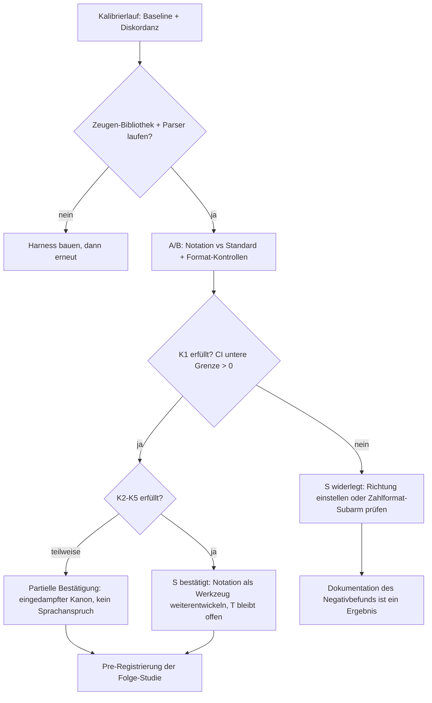

# Erfolgskriterien, Risiken und die Grenze der Hypothese

Diese Datei macht die Hypothese **entscheidbar**. Sie definiert vorab (Pre-Registrierung), was als Bestätigung und was als Widerlegung gilt, und trennt dabei die zwei Hypothesenformen, die im Auftrag angelegt sind: die **schwache Form** (Oberflächen-Encodings verändern messbar, wie gut ein Modell mit Mathematik umgeht) und die **starke Form** (eine modell-private Fundament-Sprache ersetzt Mathematik-Notation strukturell). Das Ergebnis der Prüfung darf „teilweise bestätigt“ lauten — aber nicht „unklar“.

## 1. Die zwei Formen der Hypothese

**Schwache Form (S):** Eine auf Tokenizierung/Attention dieses Modells zugeschnittene Schreibweise — Zahlformat, Schrittstruktur, explizite Zeugen, ASCII-Lexik ([05-01](05-01-designprinzipien.md), [05-02](05-02-notations-spezifikation.md)) — macht das Modell bei Mathematik **besser und/oder schneller**, ohne die Mathematik selbst zu ändern.

**Starke Form (T):** Es existiert eine modell-eigene „Fundament-Sprache“, die mathematisches Denken repräsentiert, nicht nur formatiert — und die sich in formale Mathematik **rücküberführen** lässt (Zeugen statt Glauben, [Plan](../../PLAN.md)).

Evidenzlage verschärfend: Für S spricht die messbare Größe von Format-/Tokenisierungseffekten (bis zu 76 Punkte Spread [FormatSpread](https://arxiv.org/abs/2310.11324, accessed 2026-09-12); 75,6 % → 97,8 % durch Ausrichtungsrichtung [Tokenization counts](https://arxiv.org/abs/2402.14903, accessed 2026-09-12)) und die Existenz eines format-**agnostischen** Reasoning-Subspaces (Oberflächenform wird ab einer Schicht zur Störgröße, nicht zum Inhalt [FARS](https://arxiv.org/abs/2605.09496, accessed 2026-09-12)). Gegen T spricht: Sichtbare Rechnung ist kein Beweis ([Unfaithful Explanations](https://arxiv.org/abs/2305.04388, accessed 2026-09-12)), latente Repräsentationen entziehen sich der Prüfung ([Coconut](https://arxiv.org/abs/2412.06769, accessed 2026-09-12)), und Format-Robustheit über Notationen hinweg ist auch nach Training schwach ausgeprägt ([SATQuest](https://arxiv.org/abs/2509.00930, accessed 2026-09-12)).

## 2. Erfolgskriterien der schwachen Form (S) — scharf, gepaart, vorab

Alle Kriterien werden gegen die Kontrollarme aus [05-05](05-05-ablation-protokoll.md) geprüft (Standard-Schreibweise plus Format-Spread-Kontrollen); „bestätigt“ heißt: das 95 %-Intervall der **gepaarten** Differenz schließt 0 aus und die Effektrichtung stimmt. **Multiplizität (Setzung):** K1 ist das primäre, konfirmatorische Kriterium (α = 0,05); K2–K5 sind sekundär und werden explorativ berichtet — ihre Signifikanz zählt nicht als Bestätigung der Hauptthese (Analyseplan in [05-05](05-05-ablation-protokoll.md) §5).

| Nr. | Kriterium | Schwelle (Vorschlag — in Pre-Registrierung einzufrieren) | Messquelle |
|---|---|---|---|
| K1 | Trefferquote (verifizierte Korrektheit) Notation > Standard | Δ ≥ +5 Prozentpunkte, unteres CI > 0 | Zeugen-Verdikte ([05-04](05-04-test-harness.md)) |
| K2 | Effizienz bei nicht-schlechterer Quote | Tokens/Aufgabe (output+reasoning) ≤ 0,9 × Kontrolle **oder** Schritte bis Ergebnis ≤ 0,9 × | `step_finish`-Tokens |
| K3 | Formale Brücke steht | ≥ 95 % der Claims eindeutig F/P-klassifizierbar; Roundtrip-Tests bestanden | [05-03](05-03-mapping-formal.md) Testplan |
| K4 | Zeugen-Disziplin | Behandlungsarm: Falschbestätigungsrate (präsentierte Bestätigung, die der Runner `REFUTED` liefert) ≤ 5 %; Kontrollseite: „stille Falschantwort-Rate“ (falsche Endantwort ohne Warnsignal) wird berichtet — der Prosa-Arm hat designbedingt keine Claims | Verifier-Report |
| K5 | Nicht nur Mikro-Effekt | Richtungsgleicher K1-Effekt auf Tier-B-Fragmenten (Vorzeichen der gepaarten Differenz; **kein** Signifikanznachweis gefordert — bei n ≈ 198 liegt das MDE bei ~9–13 pp, vgl. [05-05](05-05-ablation-protokoll.md) §5) | Tier B ([04-04](../04-offene-probleme/04-04-empfehlung.md)) |

**Widerlegung von S (scharf):** Wenn kein Notationsarm den Standardarm (nach Kontrolle des Format-Spreads) über die Schwelle hebt — d. h. der Effekt innerhalb der Bandbreite neutraler Formatvarianten liegt [FormatSpread](https://arxiv.org/abs/2310.11324, accessed 2026-09-12) —, gilt S für dieses Modell als **widerlegt**. Ein Effekt, der nur in einem einzigen handgewählten Format auftritt, zählt nicht (genau dieses Fehlbild adressiert FormatSpread). Teilergebnisse sind zulässig und nützlich: Wirkt nur die Zahl-Schreibweise (P1), aber nicht die Struktur (P2/P3), dann ist S **partiell bestätigt** und die Konsequenz ist ein eingedampfter „Zahlformat-Kanon“, keine Sprache.

## 3. Erfolgskriterien der starken Form (T) — und warum sie strukturell blockiert ist

T wäre bestätigt, wenn: (i) ein Notationssystem existiert, das über die Oberflächenarme hinaus systematisch **bessere Mathematik** erzeugt (K1 auch gegen eine kompetente Standard-Notation mit gleichem Prompt-Budget), (ii) und dieses System gleichzeitig über eine **definierte Übersetzung** (nicht über nachträgliche Interpretation) in formale Mathematik überführbar bleibt (K3 verschärft: 100 % Klassifizierbarkeit, Roundtrip ohne Bedeutungsverlust), (iii) und der Effekt nicht an ein einzelnes Beispiel-Set gebunden ist (Holdout bestanden).

Warum T mit hoher Wahrscheinlichkeit **nicht erreichbar** ist — die drei strukturellen Blocker:

1. **Prüfbarkeitsgrenze.** Je „privater“ die Sprache (desto stärker T), desto weniger ist sie textuell prüfbar. Latentes Denken ist der Extremfall: per Konstruktion nicht-textuell, nur über Behelfs-Proben angenähert [Coconut](https://arxiv.org/abs/2412.06769, accessed 2026-09-12); sichtbare Zwischenschritte können unfaithful oder Filler sein [Unfaithful Explanations](https://arxiv.org/abs/2305.04388, accessed 2026-09-12), [Think Dot by Dot](https://arxiv.org/abs/2404.15758, accessed 2026-09-12). „Zeugen statt Glauben“ und „private Fundament-Sprache“ sind gegensätzliche Anforderungen: Was nicht textuell herauskommt, kann kein Verifier prüfen; was textuell herauskommt, ist eine Notation, keine Privatsprache.
2. **Modellbindung.** Jede tokenizer-/embedding-spezifische Optimierung ist an einen Checkpoint gebunden. Die Ziffern-Tokenisierung ist für die DeepSeek-Familie nicht einmal öffentlich dokumentiert [DeepSeek-V3](https://arxiv.org/abs/2412.19437, accessed 2026-09-12); bei jedem Modellwechsel müsste die Sprache neu empirisch gebaut werden — dass solche Wechsel reale Änderungen mitbringen, ist an den Serving-Grenzen belegt (lokale Konfiguration 8.192 Output-Tokens vs. öffentliche 384K, [Models & Pricing](https://api-docs.deepseek.com/quick_start/pricing, accessed 2026-09-12)); ob sich der Tokenizer zwischen V3 und V4.1 geändert hat, ist **nicht dokumentiert — Annahme, nicht Fakt**. Eine „Fundament-Sprache“ mit Halbwertszeit von einem Model-Release ist keine Fundament-Sprache.
3. **Kategoriale Verwechslung.** Am Interface ist alles Text. Ein intern besser repräsentierbares mathematisches Objekt wird erst dadurch wirksam, dass es **als Text** ins Modell hinein- und **als Text** herauskommt; die Wirkung läuft über Tokenfolgen, Attention-Muster und Trainingsverteilung — nicht über eine ontologische Sprachebene. Der Format-agnostische Subspace-Befund stützt genau das: intern existiert eine form-unabhängige Konzeptrepräsentation [FARS](https://arxiv.org/abs/2605.09496, accessed 2026-09-12); die Frage ist Zugänglichkeit, nicht „fehlende Sprache“.

Konsequenz für das Wiki: **T wird nicht als offenes Testziel geführt.** [05-05](05-05-ablation-protokoll.md) testet S. T bleibt als theoretische Randbedingung dokumentiert — mit der klaren Aussage, dass jede Bestätigung von S **kein** Beleg für T ist.

## 4. Risiken (mit Mitigation)

**R1 Spezifikationsproblem (Zeuge ≠ gemeinte Aussage).** Der `auto`-Zeuge prüft die kompilierte Formel; eine unpräzise formulierte (aber formal korrekt übersetzte) Aussage wird „CONFIRMED“ und ist trotzdem nicht das Gemeinte. NL→formal verliert systematisch (25,3 % perfekte Übersetzungen; Kategorien wie „missing assumption“ [Autoformalization](https://arxiv.org/abs/2205.12615, accessed 2026-09-12)). Mitigation: Claims müssen endlich und syntaktisch entscheidbar formuliert sein ([05-02](05-02-notations-spezifikation.md) §4); Tier-B-Aufgaben kommen mit vorab geprüfter Solllösung; Stichprobe der Claims wird manuell nachgeprüft („Zeuge entscheidet die gemeinte Aussage?“).

**R2 Modellbindung.** Effekte können tokenizer-spezifisch sein und bei jedem Modellwechsel verpuffen (siehe T-Blocker 2 — inklusive der dort markierten Annahme). Mitigation: Effekte **immer** gegen Kontrollarme im selben Modell messen; Notation so bauen, dass die Struktur-Regeln (Zonen, Zeugen) modellunabhängig begründet sind und nur die Oberflächen-Regeln (Zahlen, Symbole) als modellabhängig markiert werden; Replikation auf mindestens zwei Modellen (z. B. `deepseek-flash` und ein Kontrastmodell) als Ausbau.

**R3 Nichtübertragbarkeit Mikro → Makro.** Mikro-Bench-Effekte (Arithmetik) sagen wenig über offene Problemfragmente; Format-Robustheit über Notationen ist notorisch schwach [SATQuest](https://arxiv.org/abs/2509.00930, accessed 2026-09-12). Mitigation: K5 als eigenes Kriterium; Tier A und Tier B getrennt berichten; keine Extrapolation von Mikro auf Makro im Abschlussbericht.

**R4 Overfitting auf Beispiele.** Eine Notation kann auf die Testaufgaben kalibriert wirken (Prompt-Leakage, bekannte Benchmark-Aufgaben im Pretraining). Mitigation: Pre-Registrierung ([05-05](05-05-ablation-protokoll.md)), Holdout-Aufgaben, zur Auswertzeit generierte Aufgaben (parametrische Zahlentheorie-Fragmente statt kanonischer Beispiele), Blind-Kodierung der Arme in der Auswertung.

**R5 Verifikationslücke (Instanz ≠ Theorem).** Zeugen bestätigen endliche Fälle/Instanzen; universelle Sätze bleiben `UNVERIFIABLE`, bis eine formale Toolchain läuft (auf dieser Maschine nicht installiert — [05-03](05-03-mapping-formal.md)). Nachtrag 2026-09-12: Lean ist inzwischen installiert und für die Zyklus-Zelle ausgeführt ([03-05](../03-formale-bruecke/03-05-roundtrip-anforderungen.md) §6); für universelle Sätze bleibt die Lücke, solange ihr Kern nicht formalisiert ist. Mitigation: K3 misst die Brücke separat; im Bericht wird „verifiziert“ nie ohne Angabe der geprüften Menge verwendet.

**R6 Messbarkeit.** Kein `seed`, `temperature` im Thinking-Mode wirkungslos [DeepSeek Chat API](https://api-docs.deepseek.com/api/create-chat-completion, accessed 2026-09-12); Varianz in LLM-Evals ist groß genug, dass kleine Effekte bei kleinen Stichproben unsichtbar bleiben [Lessons from the Trenches](https://arxiv.org/abs/2405.14782, accessed 2026-09-12); die n-Tabelle in [05-05](05-05-ablation-protokoll.md) zeigt: δ = 5 pp braucht bei üblicher Varianz hunderte Aufgaben. Mitigation: Kalibrierlauf vor n-Festlegung; Ergebnisse mit CIs berichten (Wilson bzw. gepaarte CIs) [Error Bars](https://arxiv.org/abs/2411.00640, accessed 2026-09-12); kein „Gewinner“-Satz ohne Intervall.

**R7 Aufwand/Kosten.** Harness-Bau, Zeugen-Bibliothek, Testläufe sind erheblich; der erwartete Gewinn der schwachen Form ist einstellige bis mittlere zweistellige Prozentpunkte auf Teilgebieten — kein Sprung. Mitigation: Stufenplan (erst Zahlen-Sub-Ablation S1/S2 billig, dann Vollnotation), Abbruchkriterium nach Kalibrierlauf, falls der messbare Effekt schon dort unter der Nachweisgrenze liegt.

**Rangfolge und Trigger (Setzung).** Nicht alle Risiken sind gleich: **R6 (Messbarkeit)** ist das ausschlaggebende Go/No-Go-Risiko, **R7 (Aufwand)** sein Kosten-Zwilling; R2 begrenzt die Halbwertszeit jedes positiven Befunds; R1/R3/R4/R5 sind eingebaute Grenzen und werden berichtet, statt die Studie zu stoppen.

| Trigger | Bedingung (vorab registriert) | Konsequenz |
|---|---|---|
| T1 | Kalibrierlauf: erwarteter K1-Effekt unter der Format-Spread-Streuung bzw. MDE > Effekt bei Budget | Stopp vor dem Hauptlauf; Negativbericht (R6/R7) |
| T2 | Formatfehlerquote im Behandlungsarm > 20 % nach einem Nachbesserungslauf | Notation vereinfachen (Radikalität zurück, S3/S4-Arme), keine Hauptauswertung |
| T3 | K1 nur auf Tier A bestätigt | partielle Bestätigung; Kontrastmodell-Replikation wird Pflicht vor Verallgemeinerung (R2) |
| T4 | witness↔`expected`-Konsistenz < 95 % | Harness-/Compiler-Bug vermutet — fixen vor jeder Auswertung (R1) |

## 5. Entscheidungsregel (was passiert je Ausgang)

**Die eine Regel:** Kein Ausgang führt zu „T bewiesen“. T ist und bleibt die Randbedingung, an der die Prüfbarkeit endet — das ist keine Schwäche des Wikis, sondern sein Ergebnis, falls sich die Analyse in der Prüfung hält.

## 6. Was dieses Wiki dem Leser schuldet (Bezug zum Erfolgsbild)

- V1 der Notation bauen: [05-02](05-02-notations-spezifikation.md) (Grammatik, Beispiele, Budget).
- A/B starten: [05-05](05-05-ablation-protokoll.md) (Arme, Metriken, n-Rechnung) + [05-04](05-04-test-harness.md) (Kommandos).
- Formale Brücke prüfen: [05-03](05-03-mapping-formal.md) (Tabellen, Parser/Renderer, Roundtrip).
- Problemwahl verstehen: [04-04](../04-offene-probleme/04-04-empfehlung.md) (liegt vor, Stand 2026-09-12: Primärempfehlung BB(6)/bbchallenge-Fragmente).
- Belege trennen von Setzungen: [05-01](05-01-designprinzipien.md) (jede Regel mit Evidenzmarke und Schalter).

*Visuals: dokumentierter Skip — die Quellen dieses Kapitels sind Textquellen (Papers, API-Doku) ohne zentrale Abbildung; die Entscheidungslogik ist als Mermaid-Diagramm in Abschnitt 5 abgebildet.*
