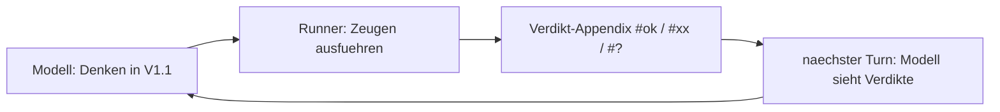

# Denk-Sprache V1.1 (Entwurf)

Diese Datei erweitert die Notations-Spezifikation [05-02](05-02-notations-spezifikation.md) um die **Denk-Grammatik**: Regeln für das, was in V1 bewusst frei blieb — die Denkzone der Blätter und (als Empfehlung, nicht Erzwingung) den `reasoning_content`-Kanal. Anlass (Auftrag Carsten, 2026-09-12): Bei schweren Aufgaben dominieren die Denk-Tokens das Output-Budget; wenn die Notation wirkt, wirkt sie dort. Status: **Entwurf** — jede Regel ist eine Setzung mit benanntem Schalter; entschieden wird sie vom A/B-Leiter in [05-05](05-05-ablation-protokoll.md), nicht durch Beschluss.

Unverändert gilt: Die **Behauptungszone** (`CLAIM`/`WITNESS`, `[HALT]`, Guard-Bibliothek) bleibt wörtlich V1; die Verdikte schreibt der Runner (`CONFIRMED|REFUTED|UNVERIFIABLE`, lokale Quelle: `bemyself/model.py`, gelesen 2026-09-12; Anschluss [04-05](../04-offene-probleme/04-05-bruecke-pruefer.md)).

## 1. Designlogik: drei Setzungen

**D1 — Register statt Erfindung.** Die Sprache erfindet keine neuen Zeichen; sie kombiniert kanonisch zwei Register, in denen das Zielmodell nachweislich stark trainiert ist: symbolische Mathematik und Code (Zustand, Schleifen, Tabellen). Begründung: Das Modell bevorzugt symbolische Schreibweise gegenüber Prosa-Umschreibungen [Spoken-MQA](https://arxiv.org/abs/2505.15000, accessed 2026-09-12); und ein Glyph, das nicht im Vokabular gemerged ist, wird nach Byte-Level-BPE zerlegt — gemessen kosten `∃`, `∨`, `⊂`, `⊆`, `ℕ`, `ℤ` je **zwei** Tokens, während `∀`, `∈`, `≤`, `∑`, `∧` je **ein** Token kosten (Lokale Messung 2026-09-12, [01-03](../01-modellprofil/01-03-tokenizer-zahlen.md)). „Neue" Zeichen sind also teuer; unbekannte noch teurer. Neue Lexeme nur per Sonde (D3).

**D2 — Zwei Härtegrade und epistemische Ehrlichkeit.** Denk-Sprache ist billig und abbrechbar; Beleg-Sprache ist streng und zertifiziert. Strikte Grammatiken können Reasoning messbar verschlechtern [Let Me Speak Freely](https://arxiv.org/abs/2408.02442, accessed 2026-09-12); gleichzeitig ist sichtbare Rechnung kein Beweis (CoT rationalisiert Bias statt ihn zu benennen, [Unfaithful Explanations](https://arxiv.org/abs/2305.04388, accessed 2026-09-12); bedeutungslose Füller erlauben verstecktes Rechnen, [Think Dot by Dot](https://arxiv.org/abs/2404.15758, accessed 2026-09-12)). Die Denk-Sprache braucht deshalb Marker für Unfertiges (Hypothese, Sackgasse, offen) — sie darf keine Gewissheit erzwingen.

**D3 — Sonden-pflichtige Lexik.** Jedes Lexem ist ein Kandidat, der gegen den gemessenen Tokenizer des Modells geprüft wird (Methode und Skript: [01-03](../01-modellprofil/01-03-tokenizer-zahlen.md), `assets/01-03-messskript.py`; wird um die V1.1-Lexeme erweitert — Bau-Schritt 0). Gemessene Leitplanken (lokal, 2026-09-12) und ihre Konsequenzen:

| Messung ([01-03](../01-modellprofil/01-03-tokenizer-zahlen.md)) | Konsequenz für V1.1 |
|---|---|
| Ziffernläufe werden bei 3 Stellen geschnitten: `123`=1, `1234`=`123`+`4` (2 Tokens), lange Zahlen ≈ 1 Token/3 Ziffern | Traces/Beispiele: reine Ziffernläufe, keine Trenner; 3er-Blöcke als natürliche Gruppierung |
| Leerzeichen kosten Tokens (dieselbe Gleichung 10 vs. 13 Tokens) | Kompakt-Stil (S9): keine Leerzeichen um ASCII-Operatoren in Formeln |
| `**` ist ein Token (wie `^`); `2**127-1` = 5 Tokens | `**` als Potenzform im Code-nahen Denken erlaubt |
| `∀`,`≤`,`≥`,`∈`,`∫`,`√`,`∑` = 1 Token; `∃`,`∨`,`⊂`,`⊆`,`∅`,`ℕ`,`ℤ` = 2 Tokens | Symbol-Kandidatentabelle (Abschnitt 5); Sonde entscheidet endgültig |
| LaTeX ist teuer: `\frac{1}{2}` = 6 Tokens, `\sum_{i=1}^{n}` = 8 | LaTeX in Denk-Formeln unerwünscht; kompakte ASCII/Unicode-Form bevorzugt |
| Lokales Output-Budget: 8.192 Tokens (Instanz-Konfiguration, [01-06](../01-modellprofil/01-06-betrieb-umgebung.md)) | Budget-Regel: Denkzeilen so kurz wie möglich; Verdikte als Appendix, nicht inline |

## 2. Zeilen-Opcodes

Eine Denkzeile hat die Form **`<tag><n>: <inhalt>`** — der Tag wählt die Zugart, `n` ist der laufende Zähler **je Tag** (`h1`, `h2`, `c3`, `v1`, …). Ein Zug pro Zeile. In V1.1-Armen **ersetzt** dieses Tag-ID-Schema die V1-Zählung `S1: S2: …` der Denkzone (Metrik-c-Anpassung im [05-05](05-05-ablation-protokoll.md)-Nachtrag); die Behauptungszone bleibt unverändert.

| Tag | Zugart | Beispiel |
|---|---|---|
| `g:` | Ziel / Frage des Blattes | `g: st(27)?` und `g: haltet M?` |
| `d:` | Definition / eingeführter Name | `d: st(n) = Schritte bis 1 (V1-Bibliothek)` |
| `a:` | Annahme / Setzung / Faktenabruf | `a: n=27` |
| `c:` | Rechen- oder Umformungsschritt; `c:` allein eröffnet einen Zahlenkolonnen-Block (V1-`calc`-Regeln) | `c: (n*(n+1))//2 + (n+1) -> ((n+1)*(n+2))//2` |
| `h:` | Hypothese (prüfbar formuliert!) | `h1: st(27)=111` |
| `v:` | Verifikation: Ziel-ID + Zeuge (Abschnitt 4) | `v h1: auto` |
| `q:` | offene Frage / Untersuchungspunkt | `q1: bouncer-Struktur?` |
| `=:` | Ergebnis / Konsequenz (Vorstufe zum CLAIM) | `=: st(27)=111 (h1+)` |

**Härtegrad (D2): Kopf strikt, Rumpf frei.** Der Parser erzwingt in der Denkzone nur den Zeilenkopf (`<tag><n>:` mit gültigem Tag) und die Strukturpflichten der `v`-, `h`- und `c`-Zeilen; der Rumpf darf Kurzformeln, Symbolik oder kurzer Klartext sein. Denkfehler sind keine Formatfehler.

## 3. Epistemische Status-Suffixe

Status wird **append-only** als eigene Mini-Zeile notiert; alte Zeilen werden nie umgeschrieben (die Kette bleibt auditierbar):

| Suffix | Bedeutung |
|---|---|
| `+` | bestätigt (Zeuge `ok`) |
| `-` | verworfen / Sackgasse |
| `?` | offen (Default; muss nicht geschrieben werden) |
| `!` | Widerspruch entdeckt — verlangt Nachfassen im nächsten Schritt |

Schreibweise: `h2-` (vier Zeichen für eine verworfene Hypothese). Vorhersage: Die Marker verhindern stille Rationalisierung verworfener Pfade ([Unfaithful Explanations](https://arxiv.org/abs/2305.04388, accessed 2026-09-12)) und machen Exploration messbar (Metrik k, [05-05](05-05-ablation-protokoll.md)).

## 4. Verdikt-Rückkanal

**Zeugenformen** in `v`-Zeilen: `auto` und `py: <ausdruck>` und `range n in a..b: <formel>` (unverändert aus [05-02](05-02-notations-spezifikation.md)), plus neu:

- `ref <id>` — verweist auf eine bereits bestätigte (`+`) Zeile oder einen Claim (Auditkette; Validierungsregeln siehe Abschnitt 7),
- `sim(a..b)` — Simulationssegment ausführen (Anschluss `[COMPUTE]`, P9),
- `cyc(t1,t2,d)` — Translationszyklus-Zeuge (Anschluss `[CYCLE]`, P10).

**Verdikte schreibt ausschließlich der Runner** — nicht als Inline-Text, sondern als kompakter **Appendix** am Blattende:

```
#ok: v1 v3
#xx: v2
#?: v4
```

(`ok`/`xx`/`?` = `CONFIRMED`/`REFUTED`/`UNVERIFIABLE`, Mapping fix.) Begründung: Das Denken bleibt beim Generieren sauber; das Feedback kommt im nächsten Turn über den interleaved-Kanal ([Thinking Mode](https://api-docs.deepseek.com/guides/thinking_mode, accessed 2026-09-12)).


*Eigene Darstellung: der Verdikt-Kreislauf der Denk-Sprache (Setzung, Abschnitt 4).*

**Hygiene-Regel (Setzung, keine Parser-Härte):** Jede `=:`-Konsequenz sollte ein `v` hinter sich tragen; Härte beginnt erst bei `CLAIM`.

## 5. Kürzel-Tabelle (Kandidaten; sonde-pflichtig)

Fortsetzung der V1-Bibliothek mit 2-Zeichen-Aliasen (alle ASCII, Einzeltoken-Erwartung; Sonde bestätigt):

| Kürzel | Langform | | Kürzel | Langform |
|---|---|---|---|---|
| `ip` | isprime | | `dv` | divisors |
| `st` | collatz_steps | | `di` | divides |
| `mx` | collatz_max | | `fc` | factorial |
| `pm` | powmod | | `ch` | choose |
| `gc` | gcd | | `fb` | fib |

**Konstanten:** `Z N Q R` als Einzeltoken-Kürzel statt `ℤ ℕ ℚ ℝ` (2 Tokens je Zeichen, gemessen); reservierte Wörter wie in V1. **Große Zahlen:** `**` (gemessen 1 Token). **Ungemessene Kandidaten** (Sonde): Knuth-Pfeile als `^^`/`^^^`; `ex` statt `∃` (2 Tokens); `#(...)` als Zählung endlicher Mengen.

## 6. Trace-Formen (für T2 / BB-Aufgaben)

| Form | Bedeutung | Beispiel |
|---|---|---|
| `x^k` | Wiederholung / RLE (k Kopien von x) | `a^5 b^12 c` |
| `cp t: (q,p,T)` | Checkpoint bei Schritt t | `cp 0: (A,0,1101)` |
| `seg t0..t1` | Simulationssegment als Objekt | `seg 0..100` |
| `sim(a..b)` | Segment ausführen (Runner; `[COMPUTE]`-Pfad) | `v h2: sim(0..2**40)` |
| `cyc(t1,t2,d)` | Translationszyklus-Zeuge (`[CYCLE]`-Pfad) | `v h1: cyc(6,16,2)` |

Alle Formen sind ASCII; `^` ist gemessen ein Token ([01-03](../01-modellprofil/01-03-tokenizer-zahlen.md)). Ein `cyc`/`sim`-Verdikt `ok` macht die Denkzeile `+`-fähig und per `ref` zum CLAIM-Zeugen.

## 7. Promotion (Denken → Beleg)

Eine `=:`-Zeile (oder `h`-Zeile) mit `v … -> ok` kann wörtlich zitiert werden:

```
CLAIM c1: (st(27)=111)
WITNESS c1: ref h1
```

`ref h1` gilt nur, wenn `h1` zuletzt `+` trägt **und** das zugehörige `v`-Verdikt `ok` ist; sonst liefert der Runner `UNVERIFIABLE` (neuer UNVERIFIABLE-Grund `ref_unconfirmed` — Implementierungsdetail, im Anschluss [04-05](../04-offene-probleme/04-05-bruecke-pruefer.md) konsolidiert). Die Auditkette ist damit geschlossen: `CLAIM → ref → v → (auto|py|sim|cyc) → ausgeführter Zeuge`.

## 8. Der reasoning_content-Kanal

**Regel (Setzung, weiche Härte):** Der System-Prompt fordert die Denk-Grammatik **verbindlich für die sichtbare Denkzone** und **empfiehlt** sie für `reasoning_content` („denke in V1.1-Form, wo mathematisch"). Treue wird gemessen (Metrik h), nicht erzwungen. Begründung: `reasoning_content` ist ein eigener, template-geprägter Kanal (`<think>`/`</think>` als Special-Tokens, [01-03](../01-modellprofil/01-03-tokenizer-zahlen.md)); ein dort erzwungenes neues Grammatik-Regime wäre Off-Distribution, solange kein Trainingssignal existiert — DeepSeek-R1 zeigt, dass Format-Rewards gerade auf abgegrenzte Reasoning-Bereiche wirken [DeepSeek-R1](https://arxiv.org/abs/2501.12948, accessed 2026-09-12), hier steht aber nur Prompting zur Verfügung. Ein RC-Enforcement-Arm bleibt als spätere Frage (S10, nicht Teil der Leiter).

## 9. Beispiele

**Beispiel-Blatt (V1.1-Stil, illustrativ — Zahlen aus einem realen [CYCLE]-Artefakt übernommen):**

```
g: M haltet?; st(27)?
d: st(n) = Schritte bis 1 (V1-Bibliothek)
a: M = 44394115
h1: M zyklisch (Translation)
v h1: cyc(6,16,2)
h1+
=: M kein Holdout (h1+)
a: n=27
h2: st(27)=111
v h2: auto
h2+
=: st(27)=111 (h2+)
#ok: v1 v2        <- vom Runner (Appendix)
```

```
CLAIM c1: cyc(M=44394115, t1=6, t2=16, d=2)
WITNESS c1: ref h1
CLAIM c2: (st(27)=111)
WITNESS c2: ref h2
[HALT] c1 c2
```

**Kontrast (was V1.1 vermeidet):** Prosa-Zwischenschritte („Ich schaue mir die Maschine an und vermute, dass …"), unbelegte Konsequenzen ohne `v`-Hygiene, Umschreiben verworfener Pfade, LaTeX-Klammerwälder (6–8 Tokens je Formel, [01-03](../01-modellprofil/01-03-tokenizer-zahlen.md)).

## 10. Schalter und Vorhersagen

| Schalter | Variation | Falsifizierbare Vorhersage | Prio |
|---|---|---|---|
| S6 Epistemik | Status-Marker an/aus | Exploration bleibt sichtbar (weniger stille Pfadwechsel); Kosten ≤ 2 % Tokens | 2 |
| S7 Kürzel | Aliase an/aus | Reasoning-Tokens ↓ (Ziel: ≥ 10 % bei kürzel-dichten Aufgaben) | 1 |
| S8 Trace-Formen | an/aus | Tier B (T2): Trefferquote ↑ und Tokens/Schritt ↓ | 1 |
| S9 Kompaktstil | no-space + Einzeltoken-Symbolwahl | Output-Tokens ↓ 15–30 % bei gleicher Trefferquote; Risiko: Lesbarkeits-/Formatfehler | 2 |

Priorisierung im Verhältnis zu S1–S5 ([05-05](05-05-ablation-protokoll.md)): S8 und S7 zuerst für Tier B, S6/S9 für Tier A. Budget-Regel des Hauptprotokolls gilt (Sub-Arme erst nach dem Hauptlauf mit registrierten Fallzahlen).

## 11. Risiken und Grenzen

- **Erlernbarkeit:** Legende + zwei Beispiele im System-Prompt (Budget dort beachten, [05-04](05-04-test-harness.md)). Bleibt die Marker-Treue (Metrik h) unter der Registrierungsschwelle, ist die Sprache für dieses Modell nicht promptbar — das ist ein Ergebnis, kein Schaden.
- **Neue Fehlerklasse „Denk-Formfehler":** durch „Kopf strikt, Rumpf frei" (Abschnitt 2) abgefedert; wird als eigene Rate berichtet.
- **Off-Distribution:** gilt für den RC-Kanal (Abschnitt 8) und für ungemessene Kürzel; die Sonde (D3) ist die Gegenmaßnahme.
- **Erfolgskriterium (Setzung):** C oder D schlagen B nur, wenn (a) Trefferquote höher, oder (b) Tokens/Treffer ≤ 0,9·B bei gleicher Quote, oder (c) Falschbestätigungsrate sinkt. Sonst bleibt der Zwei-Zonen-Default (V1) bestehen — auch das ist ein valides Ergebnis.

## 12. Offene Punkte (bewusst vertagt)

- `ref`-Validierung + UNVERIFIABLE-Grund `ref_unconfirmed` (Implementierung/[04-05](../04-offene-probleme/04-05-bruecke-pruefer.md)).
- `^^`/`^^^`, `ex`, `#(...)`: ungemessen — Sonde vor Aufnahme in die Lexik.
- Ordnung/Wiederholung im Trace („Frontloading": Zustand zuletzt vs. zuerst) — eigenes Experiment, nicht Teil von V1.1.
- RC-Enforcement (S10) — Zukunft, setzt internes Format-Signal voraus.
- Parser-Anpassungen: Tag-IDs statt `S<n>` in V1.1-Armen; Legenden-Injektion ist Harness-Aufgabe ([05-04](05-04-test-harness.md)).

## Quellen

1. Singh, A. und Strouse, J. (2024): Tokenization counts: the impact of tokenization on arithmetic in frontier and specialist large language models. arXiv:2402.14903. https://arxiv.org/abs/2402.14903 (accessed 2026-09-12)
2. Tam, Z. R. et al. (2024): Let Me Speak Freely? A Study on the Impact of Format Restrictions on Performance of Large Language Models. arXiv:2408.02442. https://arxiv.org/abs/2408.02442 (accessed 2026-09-12)
3. Turpin, M. et al. (2023): Language Models Don't Always Say What They Think: Unfaithful Explanations in Chain-of-Thought Prompting. arXiv:2305.04388. https://arxiv.org/abs/2305.04388 (accessed 2026-09-12)
4. Pfau, J. et al. (2024): Let's Think Dot by Dot: Hidden Computation in Transformer Language Models. arXiv:2404.15758. https://arxiv.org/abs/2404.15758 (accessed 2026-09-12)
5. Hao, S. et al. (2024): Training Large Language Models to Reason in a Continuous Latent Space. arXiv:2412.06769. https://arxiv.org/abs/2412.06769 (accessed 2026-09-12)
6. Merrill, W. und Sabharwal, A. (2024): The Expressive Power of Transformers with Chain of Thought. arXiv:2402.12875. https://arxiv.org/abs/2402.12875 (accessed 2026-09-12)
7. Nye, M. et al. (2021): Show Your Work: Scratchpads for Intermediate Computation with Language Models. arXiv:2112.00114. https://arxiv.org/abs/2112.00114 (accessed 2026-09-12)
8. Kojima, T. et al. (2022): Large Language Models are Zero-Shot Reasoners. arXiv:2205.11916. https://arxiv.org/abs/2205.11916 (accessed 2026-09-12)
9. Sclar, M. et al. (2024): Quantifying Language Models' Sensitivity to Spurious Features in Prompt Design. ICLR 2024, arXiv:2310.11324. https://arxiv.org/abs/2310.11324 (accessed 2026-09-12)
10. DeepSeek-AI (2025): DeepSeek-R1. arXiv:2501.12948. https://arxiv.org/abs/2501.12948 (accessed 2026-09-12)
11. Lokale Quelle (2026-09-12): [01-03-tokenizer-zahlen.md](../01-modellprofil/01-03-tokenizer-zahlen.md) samt Artefakten `assets/01-03-messskript.py`, `assets/01-03-rohdaten-symbole.txt`, `assets/01-03-rohdaten-bausteine.txt` — Tokenizer-Messreihe, aus der die Leitplanken in Abschnitt 1 stammen.
12. Lokale Quelle (2026-09-12): [05-02-notations-spezifikation.md](05-02-notations-spezifikation.md) — V1 (Lexik, Grammatik, Zeugen, Behauptungszone), auf die V1.1 aufsetzt.
13. Lokale Quelle (2026-09-12): `bemyself/model.py` und claimtypes `[HALT]`/`[COMPUTE]`/`[CYCLE]` (P7/P9/P10) — Verdikt-Modell und Zeugen-Anschlüsse.
14. Lokale Quelle (2026-09-12): [05-05-ablation-protokoll.md](05-05-ablation-protokoll.md) — Messanordnung, in deren Leiter V1.1 geprüft wird (Nachtrag V1.1).
15. Lokale Quelle (2026-09-12): [05-04-test-harness.md](05-04-test-harness.md) — Harness-Anbindung (Legenden-Injektion, `opencode run --format json`, Logging).
