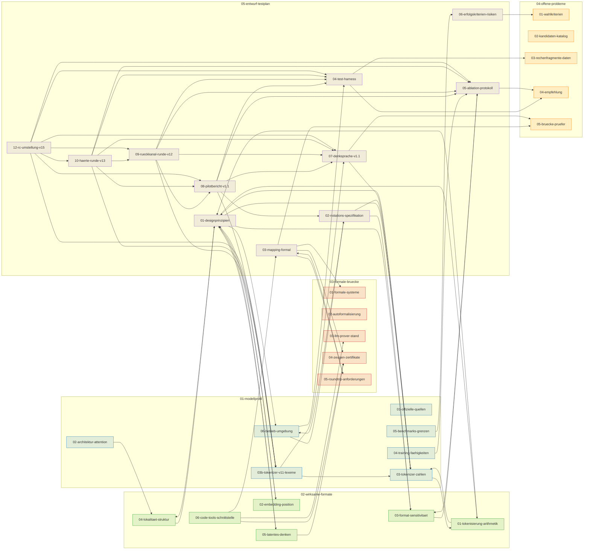

# Modell-native Mathematik-Notation für DeepSeek V4.1 Flash — Research-Wiki

**Auftrag** (Carsten, 2026-09-12): Vier Fragen beantworten — (1) Was ist über das Zielmodell
öffentlich bekannt? (2) Was macht Repräsentationen wirksam (Forschungsliteratur)? (3) Welches
komplexe **offene** mathematische Problem eignet sich als Testfeld? (4) Notations-Entwurf +
formale Brücke + ausführbarer Testplan. Hypothese: Eine auf Attention-/Tokenizer-Apparat *dieses*
Modells zugeschnittene Notation macht es bei Mathematik besser/schneller und bleibt in formale,
prüfbare Mathematik rücküberführbar (Zeugen, nicht Glauben).

Instanz unter Test: `deepseek/deepseek-flash` (Provider `deepseek`; Kontext 1.000.000, Output 8.192 Tokens;
interleaved `reasoning_content` — lokale Quelle: `~/.config/opencode/opencode.json`). Stand 2026-09-13:
Entwurf (05-07), Werkzeugbau (bemyself/msheet, tooling/), erster Pilotlauf (05-08), die
Rückkanal-Runde mit Reparatur-Loop (05-09, Arme K/B/C/D), die Härte-Runde (05-10: Sets v0.3,
Zahlen-Regime, tiefe Läufe, Zyklus-Suche) und die RC-Umstellung (05-12: RC-Fidelity-Metrik,
Instruction-only-Arme C0/C1/C2, Prefill-Grenze) sind erfolgt; die nächsten Runden
sind in 05-12 §7 skizziert. Seit 2026-09-13 ist zusätzlich der **Trainings-Pfad
vorbereitet**: Korpus v0 aus den abgeschlossenen Läufen plus QLoRA-SFT/DPO/RLVR-Skripte
und Leck-Guard in [`training/`](../../../training/README.md), eingeordnet in
[05-07 §13](05-entwurf-testplan/05-07-denksprache-v1.1.md).

**Umfang:** 35 Dateien in 5 Clustern · 79992 Wörter ·
732 Quellenangaben (Datei-Summen) · 1098 Inline-Zitate · Visuals in `assets/` je Cluster.

## Cluster-Karte

*Eigene Darstellung: Kanten abgeleitet aus den `related:`-Feldern der Datei-Frontmatter (44 clustergrenzenüberschreitende Verweise).*

---

## 01 — Modellprofil (Was ist über das Modell bekannt?)

| Datei | Titel | Status | Quellen | Zitate | Visuals |
|---|---|---|---|---|---|
| [01-01-offizielle-quellen.md](01-modellprofil/01-01-offizielle-quellen.md) | DeepSeek-V4.1-Flash: Offizielle Quellen, kanonischer Name und API-Eckdaten | Verifiziert | 10 | 34 | 2 Img / 1 Diagr |
| [01-02-architektur-attention.md](01-modellprofil/01-02-architektur-attention.md) | DeepSeek-V4.1-Flash: Architektur und Attention-Mechanik | Verifiziert | 5 | 52 | 3 Img / 0 Diagr |
| [01-03-tokenizer-zahlen.md](01-modellprofil/01-03-tokenizer-zahlen.md) | DeepSeek-V4.1-Flash: Tokenizer, Zahlen-Tokenisierung und Mathe-Symbole | Verifiziert | 5 | 12 | 1 Img / 0 Diagr |
| [01-03b-tokenizer-v11-lexeme.md](01-modellprofil/01-03b-tokenizer-v11-lexeme.md) | Tokenizer-Sonde V1.1: Messung der Denk-Sprache-Lexeme | Verifiziert | 4 | 4 | 0 Img / 0 Diagr |
| [01-04-training-faehigkeiten.md](01-modellprofil/01-04-training-faehigkeiten.md) | DeepSeek-V4.1-Flash: Training, Reasoning-Modi und Fähigkeiten | Verifiziert | 4 | 47 | 1 Img / 0 Diagr |
| [01-05-benchmarks-grenzen.md](01-modellprofil/01-05-benchmarks-grenzen.md) | DeepSeek-V4.1-Flash: Benchmarks, Stärken und Grenzen | Verifiziert | 11 | 51 | 2 Img / 0 Diagr |
| [01-06-betrieb-umgebung.md](01-modellprofil/01-06-betrieb-umgebung.md) | Betriebsgrenzen dieser Instanz: lokale Konfiguration vs. offizielle API | Verifiziert | 4 | 11 | 1 Img / 0 Diagr |

Querverweise: [02-wirksame-formate/02-01-tokenisierung-arithmetik.md](02-wirksame-formate/02-01-tokenisierung-arithmetik.md), [02-wirksame-formate/02-04-lokalitaet-struktur.md](02-wirksame-formate/02-04-lokalitaet-struktur.md), [05-entwurf-testplan/05-01-designprinzipien.md](05-entwurf-testplan/05-01-designprinzipien.md), [05-entwurf-testplan/05-02-notations-spezifikation.md](05-entwurf-testplan/05-02-notations-spezifikation.md), [05-entwurf-testplan/05-04-test-harness.md](05-entwurf-testplan/05-04-test-harness.md), [05-entwurf-testplan/05-05-ablation-protokoll.md](05-entwurf-testplan/05-05-ablation-protokoll.md), [05-entwurf-testplan/05-06-erfolgskriterien-risiken.md](05-entwurf-testplan/05-06-erfolgskriterien-risiken.md)

## 02 — Wirksame Formate (Repräsentations-Forschung)

| Datei | Titel | Status | Quellen | Zitate | Visuals |
|---|---|---|---|---|---|
| [02-01-tokenisierung-arithmetik.md](02-wirksame-formate/02-01-tokenisierung-arithmetik.md) | Tokenisierung und Arithmetik: Wie Ziffern-Encodings die Rechengenauigkeit bestimmen | Verifiziert | 5 | 42 | 1 Img / 0 Diagr |
| [02-02-embedding-position.md](02-wirksame-formate/02-02-embedding-position.md) | Embeddings und Positionen: Eingriffe in die Zahlenrepräsentation von Transformer-Modellen | Verifiziert | 4 | 52 | 1 Img / 0 Diagr |
| [02-03-format-sensitivitaet.md](02-wirksame-formate/02-03-format-sensitivitaet.md) | Format-Sensitivitaet: Wie Praesentation die Rechengenauigkeit verschiebt | Verifiziert | 6 | 42 | 1 Img / 0 Diagr |
| [02-04-lokalitaet-struktur.md](02-wirksame-formate/02-04-lokalitaet-struktur.md) | Lokalitaet und Struktur: Attention, Schrittformate und Kontextdistanz | Verifiziert | 6 | 45 | 1 Img / 0 Diagr |
| [02-05-latentes-denken.md](02-wirksame-formate/02-05-latentes-denken.md) | Latentes Denken: Continuous Reasoning und der Verlust der Pruefbarkeit | Verifiziert | 6 | 49 | 1 Img / 0 Diagr |
| [02-06-code-tools-schnittstelle.md](02-wirksame-formate/02-06-code-tools-schnittstelle.md) | Code und Tools als Schnittstelle: Ausfuehrung als Pruefanker | Verifiziert | 10 | 46 | 1 Img / 1 Diagr |

Querverweise: [01-modellprofil/01-03-tokenizer-zahlen.md](01-modellprofil/01-03-tokenizer-zahlen.md), [03-formale-bruecke/03-03-llm-prover-stand.md](03-formale-bruecke/03-03-llm-prover-stand.md), [03-formale-bruecke/03-04-zeugen-zertifikate.md](03-formale-bruecke/03-04-zeugen-zertifikate.md), [05-entwurf-testplan/05-01-designprinzipien.md](05-entwurf-testplan/05-01-designprinzipien.md), [05-entwurf-testplan/05-03-mapping-formal.md](05-entwurf-testplan/05-03-mapping-formal.md), [05-entwurf-testplan/05-05-ablation-protokoll.md](05-entwurf-testplan/05-05-ablation-protokoll.md)

## 03 — Formale Brücke (Rücküberführbarkeit)

| Datei | Titel | Status | Quellen | Zitate | Visuals |
|---|---|---|---|---|---|
| [03-01-formale-systeme.md](03-formale-bruecke/03-01-formale-systeme.md) | Formale Systeme im Vergleich: Lean 4/mathlib, Metamath, Coq, Isabelle, SMT-LIB | Verifiziert | 24 | 75 | 1 Img / 1 Diagr |
| [03-02-autoformalisierung.md](03-formale-bruecke/03-02-autoformalisierung.md) | Autoformalisierung: Verfahren, Benchmarks, Fehlertaxonomie und das Spezifikationsproblem | Verifiziert | 21 | 61 | 2 Img / 1 Diagr |
| [03-03-llm-prover-stand.md](03-formale-bruecke/03-03-llm-prover-stand.md) | LLM-Theorembeweiser: AlphaProof, DeepSeek-Prover, Gödel-Prover, Hilbert und das RL-Signal aus dem Verifier | Verifiziert | 19 | 44 | 1 Img / 1 Diagr |
| [03-04-zeugen-zertifikate.md](03-formale-bruecke/03-04-zeugen-zertifikate.md) | Was 'prüfbar' konkret heißt: Beweisterme, Zertifikate, SAT/UNSAT-Kerne, HALT-Zeugen | Verifiziert | 18 | 22 | 1 Img / 1 Diagr |
| [03-05-roundtrip-anforderungen.md](03-formale-bruecke/03-05-roundtrip-anforderungen.md) | Rücküberführbarkeit: Definition, Konservativität, Compiler-Skizze und Round-Trip-Tests | Verifiziert | 22 | 18 | 1 Img / 2 Diagr |

Querverweise: [05-entwurf-testplan/05-03-mapping-formal.md](05-entwurf-testplan/05-03-mapping-formal.md), [lean/cycle-bridge/README.md](../../../lean/cycle-bridge/README.md) — erster Kernel-Beweis der Zyklus-Zelle (03-05 §6, 2026-09-12)

## 04 — Offene Probleme (Testfeld-Auswahl)

| Datei | Titel | Status | Quellen | Zitate | Visuals |
|---|---|---|---|---|---|
| [04-01-wahlkriterien.md](04-offene-probleme/04-01-wahlkriterien.md) | Wahlkriterien für das Testfeld | Verifiziert | 16 | 16 | 0 Img / 1 Diagr |
| [04-02-kandidaten-katalog.md](04-offene-probleme/04-02-kandidaten-katalog.md) | Kandidaten-Katalog offener mathematischer Probleme | Verifiziert | 56 | 75 | 2 Img / 1 Diagr |
| [04-03-rechenfragmente-daten.md](04-offene-probleme/04-03-rechenfragmente-daten.md) | Rechenfragmente, Datenquellen und Communities | Verifiziert | 58 | 69 | 2 Img / 1 Diagr |
| [04-04-empfehlung.md](04-offene-probleme/04-04-empfehlung.md) | Empfehlung — Shortlist und Testeignung für die Notations-Hypothese | Verifiziert | 12 | 10 | 0 Img / 1 Diagr |
| [04-05-bruecke-pruefer.md](04-offene-probleme/04-05-bruecke-pruefer.md) | Brücke zum Prüfer — [HALT]/[SCORE] und die Prüfer-Doktrin | Verifiziert | 15 | 6 | 0 Img / 1 Diagr |

Querverweise: [lean/erdos-straus/README.md](../../../lean/erdos-straus/README.md) — Lean-4-Kernel-Beweise der sechs P12-Klassen und der finiten Brücke 2 ≤ n ≤ 1000 (04-03, Nachtrag 2026-09-13)

## 05 — Entwurf & Testplan (Notation + Protokoll)

| Datei | Titel | Status | Quellen | Zitate | Visuals |
|---|---|---|---|---|---|
| [05-01-designprinzipien.md](05-entwurf-testplan/05-01-designprinzipien.md) | Designprinzipien einer modell-nativen Mathematik-Notation | Verifiziert | 30 | 64 | 1 Img / 0 Diagr |
| [05-02-notations-spezifikation.md](05-entwurf-testplan/05-02-notations-spezifikation.md) | Notations-Spezifikation V1 (Entwurf) | Verifiziert | 9 | 10 | 1 Img / 0 Diagr |
| [05-03-mapping-formal.md](05-entwurf-testplan/05-03-mapping-formal.md) | Mapping: Notation ↔ formale Mathematik | Verifiziert ⚠1 offener Punkt (deklariert) | 15 | 21 | 1 Img / 1 Diagr |
| [05-04-test-harness.md](05-entwurf-testplan/05-04-test-harness.md) | Test-Harness für diese Maschine | Verifiziert ⚠1 offener Punkt (deklariert) | 8 | 11 | 1 Img / 1 Diagr |
| [05-05-ablation-protokoll.md](05-entwurf-testplan/05-05-ablation-protokoll.md) | Ablations- und A/B-Protokoll | Verifiziert | 13 | 19 | 1 Img / 0 Diagr |
| [05-06-erfolgskriterien-risiken.md](05-entwurf-testplan/05-06-erfolgskriterien-risiken.md) | Erfolgskriterien, Risiken und die Grenze der Hypothese | Verifiziert | 13 | 18 | 0 Img / 1 Diagr |
| [05-07-denksprache-v1.1.md](05-entwurf-testplan/05-07-denksprache-v1.1.md) | Denk-Sprache V1.1 (Entwurf) — Tags, epistemische Status, Kürzel, Trace-Formen | Entwurf (V1.1) | 15 | 43 | 0 Img / 1 Diagr |
| [05-08-pilotbericht-v1.1.md](05-entwurf-testplan/05-08-pilotbericht-v1.1.md) | Pilotlauf V1.1: Werkzeuge, Arme K/B/C, erste Messung der Denk-Sprache | Verifiziert | 6 | 6 | 0 Img / 0 Diagr |
| [05-09-rueckkanal-runde-v12.md](05-entwurf-testplan/05-09-rueckkanal-runde-v12.md) | Rückkanal-Runde V12: Reparatur-Loop, Arme K/B/C/D und die Messung des Rückkanals | Verifiziert | 7 | 7 | 0 Img / 0 Diagr |
| [05-10-haerte-runde-v13.md](05-entwurf-testplan/05-10-haerte-runde-v13.md) | Härte-Runde V13: Zahlen-Regime, lange Läufe und die Zyklus-Suche — Sets v0.3 und die Protokoll-Fixes | Verifiziert | 8 | 8 | 0 Img / 0 Diagr |
| [05-12-rc-umstellung-v15.md](05-entwurf-testplan/05-12-rc-umstellung-v15.md) | RC-Umstellung V15: Die Denkspur in V1.1 — Fidelity-Metrik, Instruction-only-Arme C0/C1/C2 und die Prefill-Grenze | Verifiziert | 12 | 12 | 0 Img / 0 Diagr |
| [05-13-sauberkeit-v16.md](05-entwurf-testplan/05-13-sauberkeit-v16.md) | Sauberkeits-Runde V16: Direkt-Transport, Proxy-Kontamination und der Zwangsprompt-Arm H | Verifiziert | 6 | 6 | 0 Img / 0 Diagr |

Querverweise: [01-modellprofil/01-03-tokenizer-zahlen.md](01-modellprofil/01-03-tokenizer-zahlen.md), [01-modellprofil/01-06-betrieb-umgebung.md](01-modellprofil/01-06-betrieb-umgebung.md), [02-wirksame-formate/02-01-tokenisierung-arithmetik.md](02-wirksame-formate/02-01-tokenisierung-arithmetik.md), [02-wirksame-formate/02-02-embedding-position.md](02-wirksame-formate/02-02-embedding-position.md), [02-wirksame-formate/02-03-format-sensitivitaet.md](02-wirksame-formate/02-03-format-sensitivitaet.md), [02-wirksame-formate/02-04-lokalitaet-struktur.md](02-wirksame-formate/02-04-lokalitaet-struktur.md), [02-wirksame-formate/02-05-latentes-denken.md](02-wirksame-formate/02-05-latentes-denken.md), [03-formale-bruecke/03-01-formale-systeme.md](03-formale-bruecke/03-01-formale-systeme.md), [03-formale-bruecke/03-04-zeugen-zertifikate.md](03-formale-bruecke/03-04-zeugen-zertifikate.md), [03-formale-bruecke/03-05-roundtrip-anforderungen.md](03-formale-bruecke/03-05-roundtrip-anforderungen.md), [04-offene-probleme/04-01-wahlkriterien.md](04-offene-probleme/04-01-wahlkriterien.md), [04-offene-probleme/04-03-rechenfragmente-daten.md](04-offene-probleme/04-03-rechenfragmente-daten.md), [04-offene-probleme/04-04-empfehlung.md](04-offene-probleme/04-04-empfehlung.md), [04-offene-probleme/04-05-bruecke-pruefer.md](04-offene-probleme/04-05-bruecke-pruefer.md), [01-modellprofil/01-03b-tokenizer-v11-lexeme.md](01-modellprofil/01-03b-tokenizer-v11-lexeme.md)

---

## Qualitäts-Gate (Orchestrator, INTEGRATE)

- Struktur-Gate: alle 28 Dateien mit vollständiger Frontmatter (topic, cluster, status, last_updated,
  sources_count, language + Titel/Counts/related/tags/persona_review) — **bestanden** (skriptbasiert geprüft).
- Quellen-Gate: jede Datei ≥ 2 Quellen, jede Tatsachenbehauptung mit Inline-Zitat `[Titel](URL, accessed Datum)`;
  zentrale Zahlen aus Primärquellen. Citation-Check und Persona-Review liefen je Cluster als eigener
  Verifikations-Durchgang (Details in den Bereichs-Scratchpads; Audit-Ergebnisse in den Datei-Frontmatters unter `persona_review`).
- **Deklarierte offene Punkte** (kein unbelegter Claim, sondern bewusst vertagte Implementierungs-Details):
  - [05-03-mapping-formal.md](05-entwurf-testplan/05-03-mapping-formal.md): Compiler-Regelmatrix + `math_witness`-Feldschema erst bei Implementierung.
  - [05-04-test-harness.md](05-entwurf-testplan/05-04-test-harness.md): `runner.log`-Füllung erst mit vollständiger Runner-Kette (Smoke-Lauf dokumentiert den Ist-Zustand).
- Bekannte Operatoren-Notizen: Git-Mutex-Stale-Locks (von Bereichs-Agenten dokumentiert und bereinigt);
  ein ungenutztes Dubletten-Bild (`01-modellprofil/assets/v4.1_260910_kvcache.png`) bewusst nicht committet.
- Sprache aller Dateien: Deutsch (Fachbegriffe EN). Zielkonflikte zwischen Quellen sind in den Dateien doppelt dargestellt.

## Quellenverzeichnis

Vollständige, nach Clustern gruppierte URL-Bibliografie: [99-sources/bibliography.md](99-sources/bibliography.md) — 1018 Zitat-Vorkommen.

Die Bereichs-Scratchpads mit den vollständigen 6-Phasen-Nachweisen liegen im YesMem-Projekt-Scratchpad
(`yesresearch-deepseek-math-notation-0{1..5}-*`).

