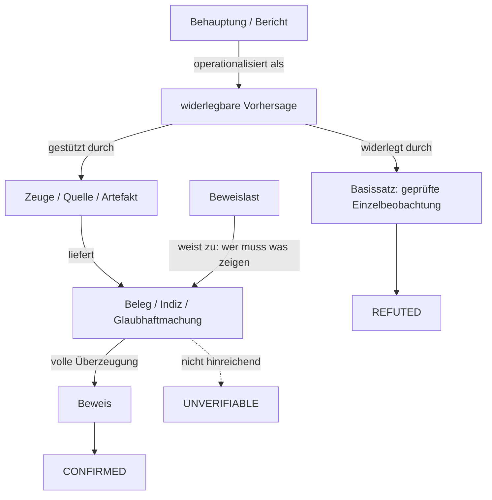

# Falsifizierbarkeit, Beleg und Beweislast

## Worum es geht

Englischsprachige Zitate sind, wo nicht anders gekennzeichnet, Übersetzungen des Verfassers; die Quellenangabe verweist auf das Original.

Der Pruefer prüft den Bericht eines Agenten gegen die Realität, statt ihm zu glauben. Das setzt voraus, dass eine Behauptung überhaupt prüfbar sein kann. Die Frage, was eine Aussage prüfbar macht, ist keine Ingenieursfrage, sondern eine erkenntnis- und rechtstheoretische. Zwei Traditionslinien geben darauf eine Antwort: die Wissenschaftstheorie nach Popper und die deutsche Beweisrechtsdogmatik. Beide kreisen um dieselbe Asymmetrie — widerlegen ist leichter als beweisen —, ziehen daraus aber unterschiedliche Konsequenzen.

## Poppers Falsifizierbarkeit

Karl Popper stellt in der *Logik der Forschung* das Abgrenzungsproblem (demarcation): Worin unterscheiden sich wissenschaftliche von nicht-wissenschaftlichen Sätzen? Sein Kriterium ist die Falsifizierbarkeit. Danach gilt eine Theorie als wissenschaftlich, wenn sie mit möglichen empirischen Beobachtungen unvereinbar ist; eine Theorie dagegen, die mit allen möglichen Beobachtungen vereinbar bleibt, ist unwissenschaftlich ([Karl Popper](https://plato.stanford.edu/entries/popper/, accessed 2026-09-12)).

Das Werk erschien „Impressum 1935, tatsächlich 1934" ([Logik der Forschung](https://de.wikipedia.org/wiki/Logik_der_Forschung, accessed 2026-09-12)); die Stanford Encyclopedia führt es bibliographisch als *Logik der Forschung*, Wien: Julius Springer Verlag, 1935 ([Karl Popper](https://plato.stanford.edu/entries/popper/, accessed 2026-09-12)). Diese Doppeldatierung erklärt, warum die Literatur sowohl 1934 als auch 1935 zitiert.

Der Kern ist eine logische Asymmetrie: Es ist unmöglich, ein universelles Gesetz durch Erfahrung zu verifizieren, aber ein einziges Gegenbeispiel falsifiziert es. „In a word, an exception, far from ‚proving' a rule, conclusively refutes it" ([Karl Popper](https://plato.stanford.edu/entries/popper/, accessed 2026-09-12)). Prüfung heißt deshalb nicht Bestätigung sammeln, sondern versuchen, die Theorie zu Fall zu bringen. Bestätigung (*corroboration*, im Deutschen „Bewährung") gewinnt eine Theorie nur aus Beobachtungen, die als Tests angelegt wurden; dazu müssen die Widerlegungskriterien vorab festgelegt sein ([Karl Popper](https://plato.stanford.edu/entries/popper/, accessed 2026-09-12)).

Daraus folgt Poppers Begriff des Basissatzes: eine singuläre Existenzaussage der Form „Es gibt ein X an der Stelle Y", die intersubjektiv prüfbar ist und eine universelle Theorie förmlich widerlegen kann. Wo die Prüfung endet, endet sie durch eine konventionelle Entscheidung der Forschergemeinschaft, nicht durch einen Fundamentalgrund ([Karl Popper](https://plato.stanford.edu/entries/popper/, accessed 2026-09-12)). Popper vergleicht diese Entscheidung mit einem Geschworenenurteil: die Jury akzeptiert durch ihre Entscheidung einvernehmlich eine Aussage über ein faktisches Geschehen — gleichsam einen Basissatz ([Karl Popper](https://plato.stanford.edu/entries/popper/, accessed 2026-09-12)). Und wie ein Urteil überprüfbar bleibt, bleibt auch der Basissatz überprüfbar.

Popper benennt auch die Gefahr, die den Pruefer motiviert: eine Theorie, die nicht scheitern kann, ist immun. Der Marxismus, so Popper, war zunächst prognostisch; als seine Vorhersagen ausblieben, wurde er durch *ad-hoc*-Hypothesen vor der Falsifikation gerettet und degenerierte zu „reinforced dogmatism" ([Karl Popper](https://plato.stanford.edu/entries/popper/, accessed 2026-09-12)). Psychoanalytische Theorien waren für ihn demgegenüber so formuliert, dass sie nur Bestätigung zuließen ([Karl Popper](https://plato.stanford.edu/entries/popper/, accessed 2026-09-12)). Eine Aussage, die mit allem vereinbar ist, sagt nichts. Die Stanford Encyclopedia vermerkt allerdings, dass Popper seine Haltung zur *ad-hoc*-Modifikation später abschwächte und sie als integralen Bestandteil wissenschaftlicher Praxis anerkannte — die Bewertung, ob eine Modifikation wissenschaftlich oder bloß *ad hoc* ist, verschob sich damit zu einer graduellen Frage ([Karl Popper](https://plato.stanford.edu/entries/popper/, accessed 2026-09-12)).

## Grenzen und Gegenpositionen

Poppers Kriterium ist nicht unangefochten. Die drei wichtigsten Einwände sollen als Positionen stehen bleiben, nicht aufgelöst werden.

Die Duhem-Quine-These besagt, dass eine einzelne Hypothese nie isoliert geprüft werden kann: Physikalische Vorhersagen folgen erst aus einem Bündel von Theorie plus Hilfshypothesen (Holismus). Duhem formuliert: Wenn das vorhergesagte Phänomen ausbleibe, gerate „nicht nur der fragliche Satz, sondern das ganze theoretische Gerüst" in Zweifel; welcher Teil falsch sei, sage das Experiment gerade nicht ([Pierre Duhem](https://plato.stanford.edu/entries/duhem/, accessed 2026-09-12)). Aus der Nichtseparierbarkeit folgt Duhems Nicht-Falsifizierbarkeitsthese. Quine radikalisierte sie — „jede Aussage kann, wenn wir anderswo drastisch genug eingreifen, um jeden Preis festgehalten werden" —, während Duhem diese Ausweitung ausdrücklich ablehnte und auf die Physik begrenzte ([Pierre Duhem](https://plato.stanford.edu/entries/duhem/, accessed 2026-09-12)).

Thomas Kuhn bezweifelt, dass Wissenschaft sich über Regeln der Widerlegung vollzieht. In normalen Phasen löse die Wissenschaft Rätsel innerhalb eines Paradigmas; Anomalien würden ignoriert oder wegerklärt, nicht als Falsifikation gewertet. Erst die Anhäufung gravierender Anomalien führe zur Krise und zur Revolution, in der ein Paradigma durch ein anderes ersetzt wird. Kuhn zufolge gibt es „keine Regeln, um die Bedeutung eines Rätsels zu bestimmen und Rätsel gegen ihre Lösungen abzuwägen" — die Entscheidung für ein neues Paradigma sei rational nicht erzwungen ([Thomas Kuhn](https://plato.stanford.edu/entries/thomas-kuhn/, accessed 2026-09-12)). Verschiedene Paradigmen seien inkommensurabel, also ohne gemeinsames Maß vergleichbar; ein Revolutionsgewinn kann frühere Erklärungen verlieren („Kuhn-loss"). Kuhn verwarf zudem die Unterscheidung zwischen Entdeckungs- und Rechtfertigungskontext ([Thomas Kuhn](https://plato.stanford.edu/entries/thomas-kuhn/, accessed 2026-09-12)).

Imre Lakatos vermittelt zwischen beiden. Nicht eine einzelne Theorie, sondern eine Abfolge von Theorien mit einem gemeinsamen harten Kern werde bewertet. Der Kern gilt „durch methodisches Dekret als unwiderlegbar — oder doch als widerlegungsresistent"; er wird von einem „Schutzgürtel" aus Hilfshypothesen umgeben. Trifft ein *modus tollens* die Anlage, wird der Pfeil auf den Schutzgürtel umgelenkt, nicht auf den Kern ([Imre Lakatos](https://plato.stanford.edu/entries/lakatos/, accessed 2026-09-12)). Lakatos' Pointe: „Alle Theorien sind in diesem Sinne widerlegt geboren und sterben widerlegt" ([Imre Lakatos](https://plato.stanford.edu/entries/lakatos/, accessed 2026-09-12)). Ob dieses Persistieren rational ist, entscheidet sich daran, ob das Forschungsprogramm progressiv oder degenerierend ist — ein Urteil, das Lakatos selbst nicht rein logisch fällt.

Der Streit ist für den Pruefer nicht akademisch. Er markiert die Grenze der eigenen Reichweite: Ein Befund „widerlegt" trifft, wenn er gegen Basissätze stößt; ein Befund „bestätigt" ist immer nur Bewährung innerhalb eines Annahmenbündels.

## Beleg, Beweis, Beweislast

Die deutsche Zivilprozessordnung trennt zwei Standards. § 286 ZPO verlangt für die volle Überzeugung, dass das Gericht „nach freier Überzeugung" entscheide, „ob eine tatsächliche Behauptung für wahr oder für nicht wahr zu erachten sei", und die leitenden Gründe im Urteil angebe; an gesetzliche Beweisregeln ist es nur in den gesetzlich bezeichneten Fällen gebunden ([§ 286 ZPO](https://www.gesetze-im-internet.de/zpo/__286.html, accessed 2026-09-12)). § 294 ZPO regelt demgegenüber die Glaubhaftmachung: Wer eine tatsächliche Behauptung glaubhaft zu machen hat, „kann sich aller Beweismittel bedienen, auch zur Versicherung an Eides statt zugelassen werden" ([§ 294 ZPO](https://www.gesetze-im-internet.de/zpo/__294.html, accessed 2026-09-12)). Daraus ergibt sich die für den Pruefer zentrale Trennung: Ein *Beleg* (Indiz, Glaubhaftmachung) senkt die Schwelle, ein *Beweis* verlangt die volle Überzeugung. Der Anscheinsbeweis und die tatsächliche Vermutung sind keine Beweislastumkehr; sie erschüttern eine Vermutung, verschieben die Last aber nicht ([Beweislast](https://de.wikipedia.org/wiki/Beweislast, accessed 2026-09-12)).

Die *Beweislast* regelt, wer „das Risiko der Nichterweislichkeit einer Tatsache (non liquet)" trägt ([Beweislast](https://de.wikipedia.org/wiki/Beweislast, accessed 2026-09-12)). Die Rechtswissenschaft unterscheidet formelle/subjektive Beweislast — wer im Verfahren Beweis anbieten muss — von materieller/objektiver Beweislast — zu wessen Lasten die Nichterweislichkeit geht ([Beweislast](https://de.wikipedia.org/wiki/Beweislast, accessed 2026-09-12)). Das deutsche Recht enthält keine ausdrückliche allgemeine Verteilungsregel; anerkannt ist der Grundsatz, dass jede Partei die Tatsachen beweisen muss, die zu den Anwendungsvoraussetzungen einer für sie günstigen Norm gehören ([Beweislast](https://de.wikipedia.org/wiki/Beweislast, accessed 2026-09-12)). Eine Norm kann die Last umkehren — Formulierungen wie „es sei denn" verlagern den Beweis auf die Gegenseite ([Beweislast](https://de.wikipedia.org/wiki/Beweislast, accessed 2026-09-12)).

Ergänzend verpflichtet § 138 ZPO die Parteien, ihre Erklärungen über tatsächliche Umstände „vollständig und der Wahrheit gemäß" abzugeben; nicht ausdrücklich bestrittene Tatsachen gelten als zugestanden ([§ 138 ZPO](https://www.gesetze-im-internet.de/zpo/__138.html, accessed 2026-09-12)). Ein „Nichtwissen" ist nur über Tatsachen zulässig, die weder eigene Handlungen noch Gegenstand eigener Wahrnehmung waren ([§ 138 ZPO](https://www.gesetze-im-internet.de/zpo/__138.html, accessed 2026-09-12)). Das ist der Zugang, auf den sich ein Zeuge berufen kann — und nur er.

## Was ein Zeuge ist und was ein Beweis

Der Zeugenbeweis wird nach § 373 ZPO „durch die Benennung der Zeugen und die Bezeichnung der Tatsachen" angetreten, über die vernommen werden soll ([§ 373 ZPO](https://www.gesetze-im-internet.de/zpo/__373.html, accessed 2026-09-12)). Der Zeuge soll „dasjenige, was ihm von dem Gegenstand seiner Vernehmung bekannt ist, im Zusammenhang" angeben; das Gericht hat nötigenfalls Fragen „zur Erforschung des Grundes, auf dem die Wissenschaft des Zeugen beruht" zu stellen ([§ 396 ZPO](https://www.gesetze-im-internet.de/zpo/__396.html, accessed 2026-09-12)). Zur Sicherung der Wahrheit kann ein Zeuge beeidigt werden ([§ 391 ZPO](https://www.gesetze-im-internet.de/zpo/__391.html, accessed 2026-09-12)). Der Zeuge ist damit kein Beweis, sondern eine Quelle: Er stützt eine Behauptung, ersetzt sie aber nicht.

Die Erkenntnistheorie ordnet dasselbe Problem als *testimony* ein. Der Streit verläuft zwischen Reduktionismus — wer einer Aussage glauben will, braucht positive Gründe für die Verlässlichkeit des Sprechers, sonst wird er leichtgläubig — und Non-Reduktionismus, wonach ein widerlegbares, aber vermutetes Recht besteht, dem Sprecher zu glauben, solange keine entkräftenden Gründe vorliegen ([Epistemological Problems of Testimony](https://plato.stanford.edu/entries/testimony-episprob/, accessed 2026-09-12)). Die Debatte zeigt: Ein Zeuge ist nur soviel wert wie die Möglichkeit, seine Zuverlässigkeit unabhängig zu prüfen.

Für den Pruefer lassen sich daraus vier Kriterien ableiten — teils aus der Rechtsdogmatik, teils aus der Erkenntnistheorie, teils als Konstruktionsentscheidung des Werkzeugs:

- **Zugang**: Der Zeuge muss über eigene Wahrnehmung verfügen; § 138 ZPO begrenzt das Nichtwissen auf fremde Handlungen ([§ 138 ZPO](https://www.gesetze-im-internet.de/zpo/__138.html, accessed 2026-09-12)).
- **Nachprüfbarkeit**: Der Basissatz muss intersubjektiv prüfbar sein ([Karl Popper](https://plato.stanford.edu/entries/popper/, accessed 2026-09-12)).
- **Widerspruchsfreiheit**: Nicht bestrittene Tatsachen gelten als zugestanden ([§ 138 ZPO](https://www.gesetze-im-internet.de/zpo/__138.html, accessed 2026-09-12)); die formale Konsistenz ist Poppers erster Prüfschritt ([Karl Popper](https://plato.stanford.edu/entries/popper/, accessed 2026-09-12)).
- **Unabhängigkeit**: Dieses Kriterium ist nicht positives Recht, sondern eine Designanforderung — ein Zeuge, der mit dem Behauptenden identisch ist, belegt nichts über die Welt.

## Prüfbar wird eine Behauptung erst durch die widerlegbare Form

Eine Behauptung wird nicht dadurch prüfbar, dass sie wahr klingt, sondern dadurch, dass sie eine widerlegbare Form annimmt. Drei Schritte gehören dazu. Erstens die Operationalisierung: Der Begriff muss so gefasst werden, dass er in beobachtbare Größen übersetzt wird. Zweitens die Vorhersage: Aus der Behauptung muss eine Konsequenz folgen, die, falls sie ausbleibt, die Behauptung träfe. Drittens die Testbarkeit: Es müssen vorab die Bedingungen festgelegt sein, unter denen die Behauptung als widerlegt gilt ([Karl Popper](https://plato.stanford.edu/entries/popper/, accessed 2026-09-12)). Poppers diagnostischer Kern bleibt gültig: Bewährung setzt voraus, dass vorab festgelegt wurde, welche Beobachtungssituation eine Theorie widerlegt ([Karl Popper](https://plato.stanford.edu/entries/popper/, accessed 2026-09-12)).

Ohne diese Form bleibt eine Aussage zirkulär: Sie wird durch dieselbe Instanz belegt, die sie aufstellt. Genau das ist die Gefahr, die der Pruefer adressiert. Weil die Asymmetrie zwischen Widerlegen und Beweisen prinzipiell ist, muss das Werkzeug drei Ausgänge unterscheiden: `CONFIRMED`, `REFUTED` und `UNVERIFIABLE`. Das ist zugleich die Anerkennung der Gegenpositionen — ein `REFUTED` trifft einen Basissatz, nicht die ganze Theorie (Duhem), und ein `CONFIRMED` ist Bewährung, keine Verifikation (Popper), die überdies innerhalb eines Annahmenbündels stattfindet (Lakatos).

### Wer trägt die Beweislast im Pruefer

Die Beweislastregel aus § 286 ZPO lässt sich auf das Werkzeug übertragen: Die Last trifft den Bericht, nicht den Prüfer. Behauptet der Agent eine Tatsache, so muss der Bericht sie belegen; gelingt der Beleg nicht, lautet das Ergebnis `UNVERIFIABLE` und nicht `CONFIRMED`. Auch ein `REFUTED` trägt eine Beweislast: Es muss auf einem geprüften Basissatz ruhen, nicht auf einer bloßen Vermutung. Weil Basissätze selbst irren können und zwei gültige Basissätze einander widersprechen können, prüft der Pruefer den Widerlegungsbefund gegen — ein `REFUTED` ohne nachvollziehbaren Basissatz bleibt `UNVERIFIABLE`. Und geprüft wird pro Behauptung, nicht pro Bericht: Ein Bericht ist ein Bündel von Sätzen, und ein einzelner falscher Satz macht ihn nicht in Gänze falsch (Duhem).

Daraus folgt die Leitfrage des Pruefer-Designs: Nicht „Glaubt der Bericht sich selbst?", sondern „Welche widerlegbare Konsequenz müsste falsch sein, damit der Bericht falsch ist — und ist sie prüfbar?"

## Quellen

1. Karl Popper — Stanford Encyclopedia of Philosophy. https://plato.stanford.edu/entries/popper/ (accessed 2026-09-12)
2. Logik der Forschung — Wikipedia. https://de.wikipedia.org/wiki/Logik_der_Forschung (accessed 2026-09-12)
3. Pierre Duhem — Stanford Encyclopedia of Philosophy. https://plato.stanford.edu/entries/duhem/ (accessed 2026-09-12)
4. Thomas Kuhn — Stanford Encyclopedia of Philosophy. https://plato.stanford.edu/entries/thomas-kuhn/ (accessed 2026-09-12)
5. Imre Lakatos — Stanford Encyclopedia of Philosophy. https://plato.stanford.edu/entries/lakatos/ (accessed 2026-09-12)
6. § 286 ZPO — Freie Beweiswürdigung. https://www.gesetze-im-internet.de/zpo/__286.html (accessed 2026-09-12)
7. § 294 ZPO — Glaubhaftmachung. https://www.gesetze-im-internet.de/zpo/__294.html (accessed 2026-09-12)
8. § 138 ZPO — Erklärungspflicht über Tatsachen; Wahrheitspflicht. https://www.gesetze-im-internet.de/zpo/__138.html (accessed 2026-09-12)
9. § 373 ZPO — Beweisantritt. https://www.gesetze-im-internet.de/zpo/__373.html (accessed 2026-09-12)
10. § 391 ZPO — Zeugenbeeidigung. https://www.gesetze-im-internet.de/zpo/__391.html (accessed 2026-09-12)
11. § 396 ZPO — Vernehmung zur Sache. https://www.gesetze-im-internet.de/zpo/__396.html (accessed 2026-09-12)
12. Beweislast — Wikipedia. https://de.wikipedia.org/wiki/Beweislast (accessed 2026-09-12)
13. Epistemological Problems of Testimony — Stanford Encyclopedia of Philosophy. https://plato.stanford.edu/entries/testimony-episprob/ (accessed 2026-09-12)
