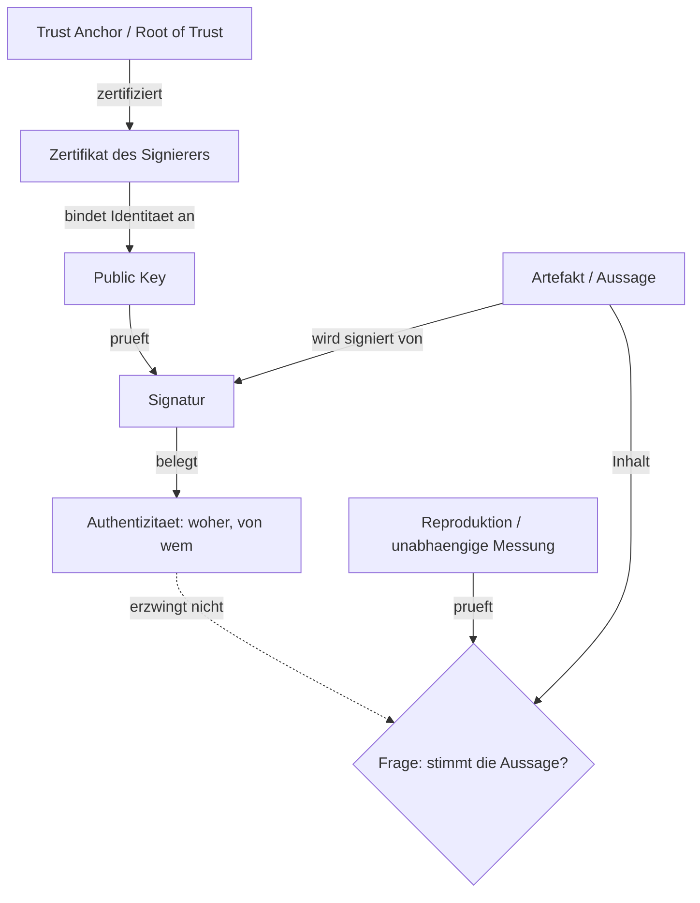

# Herkunftsnachweise, Signatur, Vertrauenskette — warum Herkunft nicht Wahrheit ist

Ein Herkunftsnachweis (Provenienz) beantwortet die Frage, woher eine Aussage, eine Datei oder ein Artefakt stammt und wie es entstanden ist. Er beantwortet nicht die Frage, ob die Aussage stimmt. Diese Unterscheidung ist der Kern des vorliegenden Textes: Signaturen und Vertrauensketten leisten Authentizität — sie binden ein Objekt an einen Absender —, aber sie leisten keine Korrektheit. Für ein Werkzeug wie den Pruefer, der den Bericht eines Agenten gegen die Realität prüft, folgt daraus eine klare Arbeitsteilung: Herkunft ist eine notwendige, aber keine hinreichende Bedingung.

## 1. Provenienz vs. Wahrheit

Provenienz ist laut dem W3C-Datenmodell ein „record that describes the people, institutions, entities, and activities involved in producing, influencing, or delivering a piece of data or a thing“ — sie beschreibt also Entstehung und Beteiligte, nicht den Wahrheitsgehalt des Erzeugnisses ([PROV-DM](https://www.w3.org/TR/prov-dm/, accessed 2026-09-12)). Schon die Abstrakt-Formulierung macht den Verwendungszweck deutlich: Provenienz „can be used to form assessments about its quality, reliability or trustworthiness“ — sie ist Material für ein Urteil, nicht das Urteil selbst ([PROV-DM](https://www.w3.org/TR/prov-dm/, accessed 2026-09-12)).

Dasselbe gilt für die signierte Variante. Eine Signatur über eine Aussage bindet die Aussage an einen Schlüssel, nicht an die Wirklichkeit. Wer eine falsche Aussage signiert, erzeugt eine gültige Signatur über eine falsche Aussage. Man kann das als *garbage in, signed garbage out* zusammenfassen — eine eigene Verdichtung des Prinzips, kein Zitat: Der Signaturvorgang ist blind gegenüber dem Inhalt. Der C2PA-Standard für Medienherkunft formuliert dieses Prinzip ungewöhnlich explizit: Seine Spezifikationen „SHOULD NOT provide value judgments about whether a given set of provenance data is ‚good‘ or ‚bad,‘ merely whether the assertions included within can be validated as associated with the underlying asset, correctly formed, and free from tampering“ ([C2PA Specification 2.1](https://spec.c2pa.org/specifications/specifications/2.1/specs/C2PA_Specification.html, accessed 2026-09-12)). Validiert wird also Assoziation, Form und Unversehrtheit — nicht Wahrheit.

## 2. Digitale Signaturen und Vertrauensketten

### X.509, Trust Anchors und RFC 5280

Die klassische Public-Key-Infrastruktur bindet einen öffentlichen Schlüssel an eine Identität über ein Zertifikat, das von einer Certificate Authority (CA) ausgestellt und ihrerseits signiert ist. RFC 5280 definiert dafür die Zertifikatsketten-Validierung: „Valid paths begin with certificates issued by a trust anchor“ ([RFC 5280](https://www.rfc-editor.org/rfc/rfc5280, accessed 2026-09-12)). Bemerkenswert ist, was der RFC über diesen Anker sagt: „The selection of a trust anchor is a matter of policy“ — er kann die oberste CA einer Hierarchie sein, die CA, die das eigene Zertifikat des Prüfers ausgestellt hat, oder irgendeine andere CA in einem Netz ([RFC 5280](https://www.rfc-editor.org/rfc/rfc5280, accessed 2026-09-12)). Die Wurzel des Vertrauens ist damit eine Setzung, keine Ableitung. Eine gültige Kette garantiert die Bindung Schlüssel↔Identität entlang der Kette; sie garantiert nicht, dass der so identifizierte Absender die Wahrheit sagt.

### Web of Trust (PGP)

OpenPGP verfolgt einen dezentralen Ansatz. RFC 4880 kennt „trust signatures“, mit denen ein Schlüsselinhaber einen anderen Schlüssel als vertrauenswürdigen „introducer“ ausweist; eine Stufe-2-Signatur markiert einen „meta introducer“, der seinerseits Stufe-1-Signaturen ausstellen darf ([RFC 4880](https://www.rfc-editor.org/rfc/rfc4880, accessed 2026-09-12)). Das Vertrauen wird hier nicht von einer zentralen Wurzel vergeben, sondern durch ein Netz gegenseitiger Beglaubigungen aufgebaut. Beide Modelle — hierarchische PKI und Web of Trust — beantworten dieselbe Frage (Wem gehört der Schlüssel?), nicht die Frage nach der Richtigkeit des Signierten. Sie unterscheiden sich im Vertrauensmodell, nicht in der Aussagekraft über den Inhalt.

### Certificate Transparency

Fehlausstellungen (*misissue*) durch CAs sind der Angriffspunkt, den Certificate Transparency adressiert. RFC 6962 beschreibt „publicly auditable, append-only, untrusted logs of all issued certificates“, mit denen sich CA-Aktivität öffentlich überprüfen und die Ausstellung verdächtiger Zertifikate bemerken lässt ([RFC 6962](https://www.rfc-editor.org/rfc/rfc6962, accessed 2026-09-12)). Die Logs „do not themselves prevent misissue“; sie machen Fehlausstellungen sichtbar. Das ist der entscheidende Punkt für das Thema: Transparenz verschiebt das Problem von „Vertrauen auf blindem Weg“ zu „Vertrauen plus Nachprüfbarkeit“, aber sie prüft weiterhin die Ausstellung eines Zertifikats, nicht die Wahrheit einer damit signierten Aussage.

Zeitliche Bindung leistet der Zeitstempeldienst: Eine Time Stamping Authority „supports assertions of proof that a datum existed before a particular time“ ([RFC 3161](https://www.rfc-editor.org/rfc/rfc3161, accessed 2026-09-12)). Auch hier gilt: Der Zeitstempel beweist, dass ein Datum zu einem Zeitpunkt existierte, nicht die inhaltliche Richtigkeit des bezeugten Datums.

## 3. Standards für Daten- und Artefakt-Provenienz

Das W3C-Referenzmodell PROV-DM beschreibt Provenienz in Entitäten, Aktivitäten und Agenten mit den Kernrelationen wie `wasGeneratedBy`, `used`, `wasDerivedFrom`, `wasAttributedTo`; ein „bundle“ erlaubt sogar „provenance of provenance“ ([PROV-DM](https://www.w3.org/TR/prov-dm/, accessed 2026-09-12)). Die Ontologie PROV-O übersetzt dieses Modell nach RDF ([PROV-O](https://www.w3.org/TR/prov-o/, accessed 2026-09-12)). PROV-DM ist bewusst domänenneutral; es legt fest, wie man Herkunft beschreibt, nicht was als wahr zu gelten hat.

Die technische Umsetzung für Software-Lieferketten liefern SLSA und in-toto. Eine in-toto-Attestation ist „authenticated metadata about one or more software artifacts“, gegliedert in Predicate (Inhalt), Statement (Bindung an ein Subjekt), Envelope (Authentifizierung) und Bundle ([in-toto Attestation Framework](https://github.com/in-toto/attestation/blob/main/spec/README.md, accessed 2026-09-12)). SLSA definiert darauf aufbauend einen Provenance-Prädikattyp, der „verifiable information about software artifacts describing where, when and how something was produced“ liefert ([SLSA Provenance v1.0](https://slsa.dev/spec/v1.0/provenance, accessed 2026-09-12)). Entscheidend ist eine Zweiteilung im SLSA-Modell: `externalParameters` gelten als „untrusted“ und „MUST be verified downstream“, während `builder.id` für die „transitive closure of all the entities that are, by necessity, trusted to faithfully run the build and record the provenance“ steht ([SLSA Provenance v1.0](https://slsa.dev/spec/v1.0/provenance, accessed 2026-09-12)). Die Attestation ist also nur so vertrauenswürdig wie die Build-Plattform, die sie ausstellt. (Die Details der Lieferkette — SLSA-Stufen, in-toto-Layouts — behandelt die Seite `supply-chain-provenienz.md` im Cluster 02-systeme.)

C2PA steht exemplarisch für Medienherkunft: Das Manifest bündelt Assertions — Aussagen über Erstellung und Bearbeitung eines Assets. Die Spezifikation beschreibt das Problem, das sie löst, als eines der Lücke: Wer Metadaten über seine Arbeit mitführen will, kann das derzeit nicht „in a secure, tamper-evident and standardized way across platforms“ tun ([C2PA Specification 2.1](https://spec.c2pa.org/specifications/specifications/2.1/specs/C2PA_Specification.html, accessed 2026-09-12)). Wie oben zitiert, ist die Prüfung ausdrücklich auf Assoziation, Form und Unversehrtheit beschränkt.

## 4. Chain of Custody (Beweiskette)

In der Forensik bezeichnet die Beweiskette die lückenlose Dokumentation, wie ein Beweisstück gefunden, behandelt und weitergereicht wurde. RFC 3227 fordert, dass die Kette „clearly documented“ ist, und nennt die Mindestangaben: wo, wann und von wem der Beweis entdeckt und gesichert wurde; wo, wann und von wem er behandelt oder untersucht wurde; wer zu welchem Zeitpunkt Gewahrsam hatte und wie er gelagert wurde; wann der Gewahrsam wechselte und wie der Transfer geschah ([RFC 3227](https://www.rfc-editor.org/rfc/rfc3227, accessed 2026-09-12)). Der RFC begründet den Aufwand mit der Verwertbarkeit: Korrekte Beweissicherung sei „much more useful in apprehending the attacker, and stands a much greater chance of being admissible in the event of a prosecution“ ([RFC 3227](https://www.rfc-editor.org/rfc/rfc3227, accessed 2026-09-12)). NIST SP 800-101 rahmt dasselbe als Beweissicherung „under forensically sound conditions using accepted methods“ und deckt Validierung, Erhaltung, Akquisition, Untersuchung, Analyse und Bericht ab ([NIST SP 800-101 Rev. 1](https://csrc.nist.gov/pubs/sp/800/101/r1/final, accessed 2026-09-12)).

Die Beweiskette ist ein Provenienznachweis über den Umgang mit einem Beweisstück — eine dokumentierte Herkunft der Behandlung. Eine Lücke entwertet sie, weil dann ungeklärt bleibt, wer das Stück in der Zwischenzeit verändert haben könnte. Auch eine lückenlose Kette belegt aber nur, dass das Stück unverändert durch die Hände ging; ob sein Inhalt die Tat beweist, ist eine getrennte Frage.

## 5. Warum signierte Herkunft nur Authentizität garantiert

Aus den vorigen Abschnitten lassen sich die Grenzfälle direkt benennen:

- **Signierter, aber falscher Messwert.** Der Signierer kann korrekt handeln und dennoch einen falschen Wert erfassen oder weitergeben. Die Signatur bestätigt Urheberschaft, nicht den Wert (vgl. die Beschränkung auf „correctly formed, and free from tampering“ in [C2PA Specification 2.1](https://spec.c2pa.org/specifications/specifications/2.1/specs/C2PA_Specification.html, accessed 2026-09-12)).
- **Kompromittierter Build-Server / Signierer.** SLSA macht die Vertrauenswürdigkeit an `builder.id` fest — an die Plattform, die „trusted to faithfully run the build and record the provenance“ ist ([SLSA Provenance v1.0](https://slsa.dev/spec/v1.0/provenance, accessed 2026-09-12)). Ist diese Plattform kompromittiert, ist die Attestation formal gültig und dennoch inhaltlich wertlos. NIST SP 800-57 behandelt Schlüsselkompromittierung als eigenständiges Problem der Schlüsselverwaltung und liefert dafür Richtlinien zu Schutz, Widerruf und Erholung; die Garantie einer Signatur hängt damit am gesamten Schlüssel-Lebenszyklus, nicht an der Signatur allein ([NIST SP 800-57 Part 1 Rev. 5](https://csrc.nist.gov/pubs/sp/800/57/pt1/r5/final, accessed 2026-09-12)).
- **Korrekt signierte, aber irreführende Aussage.** Eine wahre Teilaussage in einen irreführenden Kontext gestellt bleibt signierbar. Wie die C2PA-Grundsätze betonen, ist die Signatur keine Wertung über „good‘ or ‚bad‘“ ([C2PA Specification 2.1](https://spec.c2pa.org/specifications/specifications/2.1/specs/C2PA_Specification.html, accessed 2026-09-12)).

Eine weitere Grenze ist die nachträgliche Entwertung. Eine Signatur ist nur so lange gültig, wie ihr Schlüssel gültig ist: NIST SP 800-57 behandelt Widerruf (revocation) und Ersetzung als eigene Funktionen der Schlüsselverwaltung ([NIST SP 800-57 Part 1 Rev. 5](https://csrc.nist.gov/pubs/sp/800/57/pt1/r5/final, accessed 2026-09-12)). Für Agentenberichte ist das zentral, weil dort die Bezugsgröße selbst veränderlich ist: Ein force-gepushter Commit kann eine zuvor gültige Herkunft nachträglich entwerten. Provenienz ist damit kein Zustand, sondern eine Aussage mit Verfallsdatum, die gegen den aktuellen Zustand der Welt neu geprüft werden muss.

Die Abgrenzung zur inhaltlichen Verifikation ist damit scharf. Reproduzierbare Builds zeigen, wie eine Inhaltsprüfung aussieht: Ein Build ist reproduzierbar, „if given the same source code, build environment and build instructions, any party can recreate bit-by-bit identical copies of all specified artifacts“, verifiziert durch bitweisen Vergleich mit kryptographischen Hashfunktionen ([reproducible-builds.org](https://reproducible-builds.org/docs/definition/, accessed 2026-09-12)). Hier wird nicht die Herkunft geprüft, sondern das Ergebnis selbst nachgerechnet. SLSA verknüpft beide Ideen: Konsumenten können „verify that the artifact was built according to expectations“ und „rebuild the artifact“ ([SLSA Provenance v1.0](https://slsa.dev/spec/v1.0/provenance, accessed 2026-09-12)). Provenienz und Reproduktion sind komplementär, nicht ersetzbar.

## 6. Übertrag auf den Pruefer

Für den Pruefer heißt das: Ein Herkunftsnachweis ist eine notwendige, aber keine hinreichende Bedingung. Notwendig, weil ohne verlässliche Zuordnung von Aussage zu Quelle die Prüfung an der falschen Stelle ansetzt: Eine Behauptung lässt sich zwar unabhängig messen, aber ohne Zuordnung nicht dem zurechnen, der sie aufgestellt hat. Nicht hinreichend, weil gültige Ketten, gültige Signaturen und lückenlose Beweisketten allesamt nur Authentizität verbürgen, während die Frage des Pruefers die Korrektheit betrifft. Eine Signatur ist der Ausweis, nicht der Beweis.

Dabei ist die behauptete von der belegten Provenienz zu trennen. Ein Bericht kann Hashes, Log-Zeilen oder Pfade als Text mitführen; das sind Behauptungen *über* die Herkunft, nicht die Herkunft selbst. Belegt ist Provenienz erst, wenn der Prüfer sie gegen etwas außerhalb des Berichts nachvollzieht — gegen ein Repository, einen Remote-Branch oder eine unabhängige Messung. Was im Trust-Chain-Modell der Anker ist, ist für den Pruefer die Umgebung, gegen die er prüft (Repository, Laufzeit, Messinstrument); ohne eine solche Instanz bleibt die Herkunft unbelegt. Scheitert die Provenienzprüfung, ist das Ergebnis nicht `CONFIRMED`, sondern `UNVERIFIABLE` — fehlende Herkunft ist ein Prüfausgang, kein stiller Durchlauf.

Daraus folgt die Arbeitsteilung des Werkzeugs: Der Pruefer sollte den Herkunftsnachweis als die eine Hälfte behandeln — er etabliert Kette und Absender und schließt Verwechslung aus — und die inhaltliche Verifikation als die andere. Letztere muss gegen die Realität prüfen: einen Commit im Repository, den Remote-Branch, den Diff-Scope, den Testlauf auf sauberem Checkout. Nur wo der Inhalt unabhängig nachvollzogen wird, wird aus der Herkunft eine begründete Aussage über den Zustand der Welt. Wo nur die Herkunft geprüft wird, bleibt der Pruefer bei der Authentizität stehen — und das ist genau der Fehler, den er vermeiden soll: einer Aussage glauben, weil sie sauber beglaubigt ist.

## Quellen

1. RFC 5280, *Internet X.509 Public Key Infrastructure Certificate and CRL Profile*, Cooper et al., Mai 2008. https://www.rfc-editor.org/rfc/rfc5280 (accessed 2026-09-12)
2. RFC 6962, *Certificate Transparency*, Laurie, Ben; Langley, Adam; Kasper, Emilia, Juni 2013 (Experimental). https://www.rfc-editor.org/rfc/rfc6962 (accessed 2026-09-12)
3. RFC 4880, *OpenPGP Message Format*, Callas, J. et al., November 2007. https://www.rfc-editor.org/rfc/rfc4880 (accessed 2026-09-12)
4. RFC 3161, *Internet X.509 Public Key Infrastructure Time-Stamp Protocol (TSP)*, Adams, C. et al., August 2001. https://www.rfc-editor.org/rfc/rfc3161 (accessed 2026-09-12)
5. RFC 3227, *Guidelines for Evidence Collection and Archiving*, Brezinski, D.; Killalea, T., Februar 2002 (BCP 55). https://www.rfc-editor.org/rfc/rfc3227 (accessed 2026-09-12)
6. W3C, *PROV-DM: The PROV Data Model*, W3C Recommendation, 30. April 2013. https://www.w3.org/TR/prov-dm/ (accessed 2026-09-12)
7. W3C, *PROV-O: The PROV Ontology*, W3C Recommendation, 30. April 2013. https://www.w3.org/TR/prov-o/ (accessed 2026-09-12)
8. SLSA, *SLSA Provenance v1.0*, OpenSSF/Linux Foundation. https://slsa.dev/spec/v1.0/provenance (accessed 2026-09-12)
9. in-toto, *in-toto Attestation Framework Spec*, GitHub. https://github.com/in-toto/attestation/blob/main/spec/README.md (accessed 2026-09-12)
10. C2PA, *C2PA Technical Specification 2.1 (Content Credentials)*. https://spec.c2pa.org/specifications/specifications/2.1/specs/C2PA_Specification.html (accessed 2026-09-12)
11. NIST, *SP 800-57 Part 1 Rev. 5, Recommendation for Key Management: Part 1 – General*, Barker, E., Mai 2020. https://csrc.nist.gov/pubs/sp/800/57/pt1/r5/final (accessed 2026-09-12)
12. NIST, *SP 800-101 Rev. 1, Guidelines on Mobile Device Forensics*, Ayers, R.; Brothers, S.; Jansen, W., Mai 2014. https://csrc.nist.gov/pubs/sp/800/101/r1/final (accessed 2026-09-12)
13. reproducible-builds.org, *Definitions*. https://reproducible-builds.org/docs/definition/ (accessed 2026-09-12)
