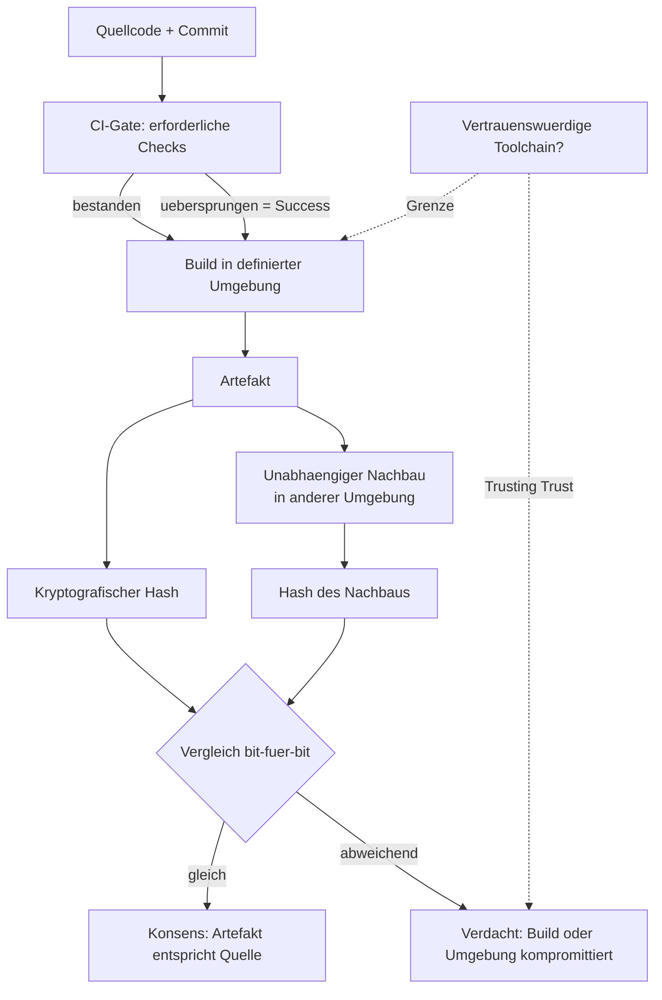

# CI und reproduzierbare Builds

Die Leitfrage dieses Wikis lautet, wie man eine Behauptung über den Zustand der Welt unabhängig prüft, statt sie zu glauben. Continuous Integration und reproduzierbare Builds sind zwei etablierte Antworten darauf: Beide ersetzen die Glaubwürdigkeit einer Aussage ("der Code ist gut", "das Artefakt stammt aus diesem Quellcode") durch eine nachvollziehbare Prozedur, deren Ergebnis sich messen lässt. Beide Verfahren verlagern Vertrauen, statt es zu erzeugen — und beide haben eine scharfe Grenze, an der die Prüfung selbst zum Gegenstand der Prüfung wird [Definitions](https://reproducible-builds.org/docs/definition/, accessed 2026-09-12) [Which problems do Reproducible Builds Solve?](https://reproducible-builds.org/docs/which-problems-do-reproducible-builds-solve/, accessed 2026-09-12).

## CI als Verifikations-Gate — was ein grüner Build beweist und was nicht

CI-Gates sind Pull-Request-Prüfungen, die ein Merge blockieren, solange sie nicht bestanden sind. Auf GitHub sind Statuschecks formal an einen Commit gebunden; wenn Statuschecks für einen geschützten Branch erforderlich sind, müssen sie bestehen, bevor der Pull Request gemerged werden darf [Status checks](https://docs.github.com/en/pull-requests/collaborating-with-pull-requests/collaborating-on-repositories-with-code-quality-features/about-status-checks, accessed 2026-09-12). GitLab-konfigurierte externe Statuschecks erzwingen dieselbe Commit-Bindung technisch: Antworten, die sich nicht auf den aktuellen `HEAD` des Quellbranches beziehen, werden mit `409 Conflict` zurückgewiesen, sodass ein veraltetes Prüfergebnis den aktuellen Merge nicht freischalten kann [External status checks](https://docs.gitlab.com/ee/user/project/merge_requests/status_checks.html, accessed 2026-09-12).

Ein grüner Build beweist damit eine eng umrissene Tatsache: dass die konfigurierten Prüfungen für genau diesen Commit in genau dieser Umgebung ausgeführt wurden und Erfolg meldeten. Er beweist nicht die Korrektheit des Codes und erst recht nicht die Sinnhaftigkeit der Tests — ein Test, der nichts prüft, meldet ebenfalls Grün. Besonders aufschlussreich ist, dass ein übersprungener Job seinen Status als "Success" meldet und einen Pull Request nicht blockiert, selbst wenn er als erforderlicher Check konfiguriert ist; auch die Konklusionen `skipped` und `neutral` werden für abhängige Checks als Erfolg behandelt [Status checks](https://docs.github.com/en/pull-requests/collaborating-with-pull-requests/collaborating-on-repositories-with-code-quality-features/about-status-checks, accessed 2026-09-12). Ein "grüner" Pipeline-Lauf kann also Jobs enthalten, die gar nicht liefen. Und selbst wenn alle Tests wirklich liefen, sagt das Gate nichts darüber aus, ob das deployte Artefakt bit-identisch zum getesteten ist.

## Determinismus und reproduzierbare Builds

Ein Build heißt reproduzierbar, wenn bei gleichem Quellcode, gleicher Build-Umgebung und gleichen Build-Anweisungen jede Partei bit-für-bit identische Kopien aller spezifizierten Artefakte erzeugen kann; die Reproduzierbarkeit von Artefakten wird durch bit-für-bit-Vergleich verifiziert, üblicherweise mittels kryptografisch sicherer Hashfunktionen [Definitions](https://reproducible-builds.org/docs/definition/, accessed 2026-09-12). Das Motiv dahinter ist Verifikation unter Misstrauen: Da die meisten Programme vorkompiliert verteilt werden, ohne dass man ihre Übereinstimmung mit dem Quellcode bestätigen kann, sollen identische Ergebnisse aus gegebenem Quellcode es mehreren unabhängigen Dritten erlauben, sich auf ein "korrektes" Resultat zu einigen und jede Abweichung als verdächtig hervorzuheben [Which problems do Reproducible Builds Solve?](https://reproducible-builds.org/docs/which-problems-do-reproducible-builds-solve/, accessed 2026-09-12).

In der Praxis ist Nichtdeterminismus die Regel, nicht die Ausnahme. Zeitstempel gelten als größte Einzelquelle von Reproduzierbarkeitsproblemen: Viele Build-Werkzeuge schreiben das aktuelle Datum, das Dateisystem und die meisten Archivformate speichern Modifikationszeiten [Timestamps](https://reproducible-builds.org/docs/timestamps/, accessed 2026-09-12). Die Projekt-Dokumentation identifiziert sechzehn Varianten der Build-Umgebung, die zu nicht reproduzierbaren Builds führen können, darunter Archiv-Metadaten, Architekturinformationen, Build-Pfad, Locale, Dateireihenfolge, Dateiberechtigungen, Randomness und Benutzerinformationen [Variations in the build environment](https://reproducible-builds.org/docs/env-variations/, accessed 2026-09-12). So sortiert etwa die Locale `fr_FR` Zeichen unabhängig von Groß-/Kleinschreibung, während die immer verfügbare `C`-Locale nach Bytewerten sortiert — dasselbe `sort` liefert je nach Umgebung eine andere Reihenfolge [Locales](https://reproducible-builds.org/docs/locales/, accessed 2026-09-12). Zufallsdaten müssen ganz vermieden oder durch einen fest vorgegebenen Seed eines Pseudozufallszahlengenerators ersetzt werden [Randomness](https://reproducible-builds.org/docs/randomness/, accessed 2026-09-12).

Als Gegenmaßnahmen haben sich Standardmechanismen etabliert. Die Umgebungsvariable `SOURCE_DATE_EPOCH` ersetzt die aktuelle Zeit durch einen festen, aus dem Quellcode abgeleiteten Zeitstempel (Sekunden seit dem 1. Januar 1970, 00:00 UTC); wo das nicht möglich ist, kann der Output nachbearbeitet werden, etwa mit `strip-nondeterminism` oder `libfaketime` [Timestamps](https://reproducible-builds.org/docs/timestamps/, accessed 2026-09-12). Für eingebettete Build-Pfade, die vor allem in Debug-Informationen landen, existieren Compiler-Flags wie `-fdebug-prefix-map`, `-fmacro-prefix-map` und `-ffile-prefix-map`, die Verzeichnispräfixe aus der Ausgabe entfernen [Build path](https://reproducible-builds.org/docs/build-path/, accessed 2026-09-12). Die Debian-Historie zeigt, wie mühsam das war: Zwei frühe Massen-Rebuilds 2013 und 2014 kamen von 24 % auf 67 % reproduzierbare Pakete, und der Umgang mit dem Build-Pfad erwies sich als so schwierig, dass man das Problem zeitweise aufgab und stattdessen einen kanonischen Build-Pfad festschrieb [History](https://reproducible-builds.org/docs/history/, accessed 2026-09-12).

## Artefakt-Hashes als Zeugen

Sind zwei Builds byteweise identisch, lassen sich statt der vollen Bauprodukte kompakte kryptografische Checksummen austauschen. Weil solche Checksummen winzig sind, funktionieren sie auch in Umgebungen mit sehr geringer Bandbreite: Ein Release kann auf einem gut angebundenen, aber schwer vertrauenswürdigen Server gebaut und die digitale Signatur lokal auf einem Laptop hinter einer schlechten Mobilverbindung erzeugt werden; da die Bauprodukte identisch sind, ist die Signatur für die auf dem Server erzeugten Dateien gültig [Cryptographic checksums](https://reproducible-builds.org/docs/checksums/, accessed 2026-09-12). Der Hash wird damit zum Zeugen: Er belegt nicht, dass der Build vertrauenswürdig ist, aber er erlaubt einer unabhängigen Instanz, zwei Bauprodukte zu vergleichen, ohne sie beide vollständig übertragen zu müssen.

Eingebettete Signaturen stellen dafür ein eigenes Problem dar, weil ein Reproduzent die Signatur per Definition nicht erneut erzeugen kann. Die dokumentierten Auswege sind, die Signatur als (optionalen) Build-Input zu behandeln und an der richtigen Stelle einzukopieren, die Signatur beim Vergleich gezielt zu ignorieren (mit einem Werkzeug, das "sehr" leicht zu auditieren sein muss, damit man ihm das Überspringen von Bytes zutrauen kann) oder die Signaturen vor dem Vergleich abzustreifen [Embedded signatures](https://reproducible-builds.org/docs/embedded-signatures/, accessed 2026-09-12). Jede dieser Varianten verschiebt die Vertrauensfrage nur: Man muss dem Vergleichswerkzeug oder der Signaturkopie vertrauen, was genau die Prüfung wieder relativiert, die der Hash leisten sollte.

## Die "Trusting Trust"-Frage als Grenze

Die schärfste Grenze der Hash-Verifikation beschrieb Ken Thompson 1984 in seiner Turing-Award-Vorlesung. Der zitierte Abstract fasst das Problem so zusammen: "To what extent should one trust a statement that a program is free of Trojan horses? Perhaps it is more important to trust the people who wrote the software." [Reflections on trusting trust](https://dl.acm.org/doi/10.1145/358198.358210, accessed 2026-09-12). Die Vorlesung führt in drei Schritten vor, wie ein Compiler so manipuliert werden kann, dass er in ein zu übersetzendes Programm (etwa einen Login) eine Hintertür einfügt und zugleich in sich selbst den Code, der diese Einfügung bewirkt — woraufhin der ursprüngliche kompromittierende Quelltext wieder entfernt werden kann und die Hintertür dennoch in jedem künftigen Build des Compilers überlebt; das Fazit der Rezension lautet entsprechend: "If you didn't write it, you can't trust it." [Reflections on trusting trust](https://dl.acm.org/doi/10.1145/358198.358210, accessed 2026-09-12).

Für die Hash-Prüfung heißt das: Ein Hash des Quellcodes ist wertlos, wenn der Compiler kompromittiert ist, denn der Hash bezieht sich auf den Quelltext, nicht auf das tatsächlich erzeugte Verhalten [Reflections on trusting trust](https://dl.acm.org/doi/10.1145/358198.358210, accessed 2026-09-12). Reproduzierbare Builds entschärfen das Problem, aber lösen es nicht auf: Sie machen eine Kompromittierung der Build-Infrastruktur sichtbar, weil mehrere unabhängige Parteien aus demselben Quellcode dasselbe Ergebnis erzeugen müssen und jede Abweichung auffällt [Which problems do Reproducible Builds Solve?](https://reproducible-builds.org/docs/which-problems-do-reproducible-builds-solve/, accessed 2026-09-12). Das setzt jedoch voraus, dass mindestens eine der beteiligten Parteien eine vertrauenswürdige Toolchain besitzt — sonst reproduzieren alle denselben kompromittierten Compiler. Der Bootstrap dieses Vertrauens bleibt der blinde Fleck, den kein Hash schließen kann.

*Eigene Darstellung basierend auf sechs Quellen: reproducible-builds.org (Definitions, Which problems do Reproducible Builds Solve?, History), GitHub „Status checks", GitLab „External status checks" und Thompson, „Reflections on Trusting Trust".*

## Übertragbarkeit auf den Prüfer

*Eigene Analyse des Verfassers, abgeleitet aus den oben zitierten Quellen; sie führt keine zusätzliche Quelle ein.*

Der Prüfer eines LLM-DONE-Berichts steht vor derselben Struktur: Ein "grüner" Selbstbericht ist wie ein grüner Build — er belegt, dass eine Prozedur in einer Umgebung ein Ergebnis meldete, nicht, dass das Ergebnis korrekt ist. Übertragbar sind drei Mechanismen: die Bindung der Behauptung an einen konkreten, nicht wiederverwendbaren Zustand (Commit-SHA ↔ exakter Kontext), ein unabhängiger Nachbau mit anschließendem Abgleich statt Vertrauen in den Bericht, und ein Hash/Beweis am Artefakt statt an der Beschreibung des Artefakts. Die Thompson-Grenze überträgt sich als Warnung, dass der prüfende Agent selbst Teil der zu prüfenden Toolchain wird: Wenn er dieselbe "kompromittierte" Grundlage (dieselben Annahmen, dasselbe Modell) verwendet, kann er eine Manipulation nicht erkennen, sondern nur reproduzieren.

Anders als CI und reproduzierbare Builds kennt der Prüfer einen dritten Ausgang: *unprüfbar*. Ein Gate kennt nur bestanden oder nicht bestanden; ein Prüfer muss die Nicht-Entscheidung als gleichrangiges Ergebnis zulassen, sonst erzwingt er aus fehlender Evidenz ein Urteil und erzeugt genau die falsche Bestätigung, die er verhindern soll.

## Quellen

- Definitions — reproducible-builds.org: https://reproducible-builds.org/docs/definition/
- Which problems do Reproducible Builds Solve? — reproducible-builds.org: https://reproducible-builds.org/docs/which-problems-do-reproducible-builds-solve/
- Cryptographic checksums — reproducible-builds.org: https://reproducible-builds.org/docs/checksums/
- Timestamps — reproducible-builds.org: https://reproducible-builds.org/docs/timestamps/
- Variations in the build environment — reproducible-builds.org: https://reproducible-builds.org/docs/env-variations/
- Locales — reproducible-builds.org: https://reproducible-builds.org/docs/locales/
- Randomness — reproducible-builds.org: https://reproducible-builds.org/docs/randomness/
- Build path — reproducible-builds.org: https://reproducible-builds.org/docs/build-path/
- Embedded signatures — reproducible-builds.org: https://reproducible-builds.org/docs/embedded-signatures/
- History — reproducible-builds.org: https://reproducible-builds.org/docs/history/
- Status checks — GitHub Docs: https://docs.github.com/en/pull-requests/collaborating-with-pull-requests/collaborating-on-repositories-with-code-quality-features/about-status-checks
- External status checks — GitLab Docs: https://docs.gitlab.com/ee/user/project/merge_requests/status_checks.html
- Reflections on Trusting Trust — Ken Thompson (1984): https://dl.acm.org/doi/10.1145/358198.358210
