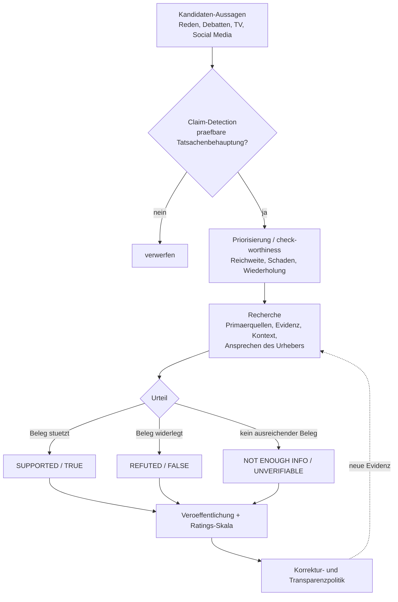

# Fact-Checking-Pipelines

Die Leitfrage dieses Wikis lautet: Wie prüft man eine Behauptung über den Zustand der Welt unabhängig, ohne sie zu glauben? Redaktionelle Fact-Checking-Betriebe haben genau diese Frage institutionalisiert — sie besitzen Verfahren, mit denen sie Behauptungen auswählen, recherchieren, bewerten und veröffentlichen, und sie besitzen Skalen, auf denen sie den Grad von Bestätigung oder Widerlegung ausdrücken [Who we are – Full Fact](https://fullfact.org/about/, accessed 2026-09-12). Parallel dazu hat sich ein maschinelles Feld entwickelt, das einzelne Schritte dieser Pipeline automatisiert: Claim-Detection, Evidenzsuche und Verifikation [Automated Fact-Checking for Assisting Human Fact-Checkers](https://arxiv.org/abs/2103.07769, accessed 2026-09-12). Dieser Artikel beschreibt beide Linien und arbeitet heraus, was Redaktionen anders machen als Maschinen.

## Redaktionelle Praxis

**Auswahl.** Full Fact priorisiert Behauptungen mit dem größten Potenzial, Menschen zu schaden — etwa weit verbreitete Online-Inhalte, prominent in Presse oder Rundfunk platzierte Aussagen oder mehrfach wiederholte Behauptungen [How we fact check – Full Fact](https://fullfact.org/how-we-fact-check/, accessed 2026-09-12). FactCheck.org achtet beim Auswählen darauf, Republikanern und Demokraten gleich viel Zeit zu widmen, und bezieht sein Material aus Sonntagstalkshows, TV-Werbespots, C-SPAN, Präsidentenäußerungen, Transkripten sowie Leserfragen [Our Process – FactCheck.org](https://www.factcheck.org/our-process/, accessed 2026-09-12). PolitiFact prüft eine Aussage unter anderem danach, ob sie in einer überprüfbaren Tatsache wurzelt, ob sie irreführend wirkt, ob sie bedeutsam ist, ob sie wahrscheinlich weiterverbreitet wird und ob sich ein typischer Mensch fragen würde, ob sie wahr sei [The Principles of the Truth-O-Meter](https://www.politifact.com/article/2018/feb/12/principles-truth-o-meter-politifacts-methodology-i/, accessed 2026-09-12).

**Recherche.** Full Fact kontaktiert den Urheber einer Behauptung, sammelt ein breites Spektrum an Belegen und strebt mindestens zwei Quellen zur Verifikation der zentralen Aussage an, sofern es nicht nur eine relevante Quelle gibt; für alle faktischen Aussagen werden Links zu Primärquellen angegeben [How we fact check – Full Fact](https://fullfact.org/how-we-fact-check/, accessed 2026-09-12). FactCheck.org legt die Beweislast ausdrücklich auf die Person oder Organisation, die die Behauptung aufstellt, und stützt sich auf Primärquellen wie die Library of Congress, das Bureau of Labor Statistics, die SEC und den IRS [Our Process – FactCheck.org](https://www.factcheck.org/our-process/, accessed 2026-09-12). PolitiFact betont Interviews auf Zitierbasis („on-the-record“), veröffentlicht zu jedem Fact-Check eine Quellenliste und kontaktiert grundsätzlich die Person, die die Aussage gemacht hat [The Principles of the Truth-O-Meter](https://www.politifact.com/article/2018/feb/12/principles-truth-o-meter-politifacts-methodology-i/, accessed 2026-09-12).

**Bewertung.** PolitiFact benutzt eine sechsstufige Skala in abnehmender Wahrheit: TRUE, MOSTLY TRUE, HALF TRUE, MOSTLY FALSE, FALSE und PANTS ON FIRE; die Beweislast liegt bei der sprechenden Person, und die Bewertung wird von drei Redakteuren abgestimmt, wobei zwei Stimmen entscheiden [The Principles of the Truth-O-Meter](https://www.politifact.com/article/2018/feb/12/principles-truth-o-meter-politifacts-methodology-i/, accessed 2026-09-12). Der maschinenlesbare Gegenentwurf ist das Schema `ClaimReview`, das eine numerische 1–5-Skala mit einem textlichen `alternateName` kombiniert (1 = „False“ bis 5 = „True“) und ausdrücklich verlangt, dass die Bedeutung der numerischen Werte dokumentiert wird, weil die Rating-Schemata der Projekte voneinander abweichen können [Fact check (ClaimReview) structured data](https://developers.google.com/search/docs/appearance/structured-data/factcheck, accessed 2026-09-12). Damit stehen sich zwei Darstellungen gegenüber: ein redaktionelles Sechs-Stufen-Urteil und eine normierte Fünf-Stufen-Markierung — beide sind Konventionen, keine Wahrheit an sich.

**Veröffentlichung und Korrektur.** FactCheck.org gibt an, jede Geschichte durchlaufe vor Veröffentlichung mehrere Prüfstufen (Line-Editing, Copy-Editing, ein Fact-Checker, der Zeile für Zeile und Wort für Wort prüft, sowie die Direktorin des Annenberg Public Policy Center), und bei materiellen Änderungen werde eine Notiz veröffentlicht, die Änderung, Grund und Datum erklärt [Our Process – FactCheck.org](https://www.factcheck.org/our-process/, accessed 2026-09-12). PolitiFact unterscheidet „major errors“ (Korrekturmarkierung am Anfang, archivierte Fassung verlinkt) von „errors of fact“ (Markierung am Ende) und korrigiert Tippfehler ohne Markierung; alle korrigierten Fact-Checks erhalten ein Tag „Corrections and updates“ [The Principles of the Truth-O-Meter](https://www.politifact.com/article/2018/feb/12/principles-truth-o-meter-politifacts-methodology-i/, accessed 2026-09-12). Der IFCN Code of Principles verlangt eine öffentlich sichtbare Korrektur- und Beschwerdepolitik sowie Transparenz über Quellen, Finanzierung, Organisation und Methodik; die Einhaltung von 31 Kriterien wird von unabhängigen Assessoren bewertet [The commitments of the Code of Principles](https://ifcncodeofprinciples.poynter.org/the-commitments, accessed 2026-09-12).

## ClaimBuster

Hassan et al. (2017) führen mit ClaimBuster eine Fact-Checking-Plattform ein, die natürliche Sprachverarbeitung und überwachtes Lernen nutzt, um wichtige Tatsachenbehauptungen im politischen Diskurs zu erkennen; das Claim-Spotting-Modell wird auf einem human-gelabelten Datensatz prüfwürdiger Behauptungen aus Transkripten von US-Präsidentschaftsdebatten aufgebaut, und eine Live-Fallstudie deckt die Präsidentschaftsdebatten 2016 ab, überwacht soziale Medien und das australische Hansard [Toward Automated Fact-Checking: Detecting Check-worthy Factual Claims by ClaimBuster](https://doi.org/10.1145/3097983.3098131, accessed 2026-09-12). Der zugehörige ClaimBuster-Datensatz umfasst 23.533 Aussagen aus allen allgemeinen US-Präsidentschaftswahl-Debatten, annotiert von menschlichen Codern [A Benchmark Dataset of Check-worthy Factual Claims](https://arxiv.org/abs/2004.14425, accessed 2026-09-12). Die archivierte ClaimBuster-Website beschreibt sich selbst als „Automated Live Fact-checking“ und nennt eine Demo, die Debatten von 2016, das Hansard, eine API, einen Slackbot und ein End-to-End-Fact-Checking (beta) [ClaimBuster: Automated Live Fact-checking (archiviert)](https://web.archive.org/web/20180711064114/http://idir-server2.uta.edu/claimbuster/, accessed 2026-09-12). Der zentrale Begriff ist die *check-worthiness* — die Frage, ob eine Aussage eine prüfbare Tatsachenbehauptung ist und ob sie es wert ist, geprüft zu werden; Full Fact und akademische Partner entwickelten dafür ein eigenes Annotationsschema und einen Benchmark, erzielten einen F1-Wert von 0,83 und damit über 5 % relativen Vorsprung gegenüber dem Stand der Technik (ClaimBuster und ClaimRank) und setzten das System produktiv ein [Towards Automated Factchecking: Developing an Annotation Schema and Benchmark for Consistent Automated Claim Detection](https://arxiv.org/abs/1809.08193, accessed 2026-09-12).

## FEVER

Thorne et al. (2018) führen mit FEVER (Fact Extraction and VERification) einen öffentlichen Datensatz zur Verifikation gegen textuelle Quellen ein: 185.445 Behauptungen, die durch Verändern von Sätzen aus Wikipedia erzeugt und anschließend ohne Kenntnis des Ausgangssatzes verifiziert wurden; die Behauptungen werden als Supported, Refuted oder NotEnoughInfo klassifiziert, wobei die Annotatoren eine Fleiss-Kappa von 0,6841 erreichten, und für die ersten beiden Klassen wurde der belegende Satz festgehalten [FEVER: a large-scale dataset for Fact Extraction and VERification](https://arxiv.org/abs/1803.05355, accessed 2026-09-12). Die beste Pipeline, die die Arbeit entwickelt, erreicht bei einer Behauptung samt korrektem Beleg 31,87 % Genauigkeit, ohne Beleg 50,91 % [FEVER: a large-scale dataset for Fact Extraction and VERification](https://arxiv.org/abs/1803.05355, accessed 2026-09-12). Die Dataset-Seite spezifiziert dasselbe Format in JSONL und benennt die drei Labels `SUPPORTS`, `REFUTES` und `NOT ENOUGH INFO` [FEVER Dataset](https://fever.ai/dataset/fever.html, accessed 2026-09-12). Bemerkenswert ist die dritte Klasse: „NotEnoughInfo“ ist keine Fehlerkategorie, sondern eine ausdrücklich vorgesehene, ehrliche Ausgabe, wenn die Quellenlage kein Urteil trägt [FEVER: a large-scale dataset for Fact Extraction and VERification](https://arxiv.org/abs/1803.05355, accessed 2026-09-12).

## Automatisierte Ansätze

Nakov et al. (2021) ordnen die maschinellen Werkzeuge entlang der Arbeit professioneller Fact-Checker: das Erkennen prüfwürdiger Behauptungen, das Auffinden bereits geprüfter Behauptungen, das Abrufen relevanter Evidenz und die eigentliche Verifikation einer Behauptung [Automated Fact-Checking for Assisting Human Fact-Checkers](https://arxiv.org/abs/2103.07769, accessed 2026-09-12). Auf der Veröffentlichungsseite standardisiert Googles Fact Check Tools API den Zugriff auf Fact-Checks: Die Claim-Search-API erlaubt dieselben Abfragen wie das Fact-Check-Explorer-Werkzeug, und die ClaimReview-Read/Write-API erlaubt das Anlegen, Bearbeiten und Löschen von ClaimReview-Markup durch autorisierte Nutzer [Fact Check Tools API](https://developers.google.com/fact-check/tools/api, accessed 2026-09-12). Das ClaimReview-Markup wird zwar aus der Google-Suche auslaufen, bleibt aber im Fact-Check-Explorer-Werkzeug unterstützt; für die Aufnahme verlangt Google unter anderem eine Korrekturpolitik, die klare Zuschreibung der Behauptung zu einem vom prüfenden Medium getrennten Ursprung und nachvollziehbare Quellen [Fact check (ClaimReview) structured data](https://developers.google.com/search/docs/appearance/structured-data/factcheck, accessed 2026-09-12). Das Duke Reporters' Lab pflegt eine Datenbank der weltweiten Fact-Checking-Seiten und veröffentlicht einen jährlichen Census [Fact-Checking Sites Around the World](https://reporterslab.org/fact-checking/, accessed 2026-09-12). Eine Literaturübersicht zum Fact-Checking weist darauf hin, dass die Befundlage zur Wirksamkeit gemischt ist — manche Studien finden einen Rückgang von Fehlvorstellungen, andere nicht — und dass auch umstritten ist, ob Fact-Checker zu konsistenten Schlüssen und Methoden gelangen [Fighting Misperceptions and Doubting Journalists' Objectivity: A Review of Fact-checking Literature](https://doi.org/10.1177/1478929918786852, accessed 2026-09-12).

*Eigene Darstellung basierend auf sechs Quellen*: Hassan et al. 2017, Thorne et al. 2018, Nakov et al. 2021, Full Fact, PolitiFact, Google ClaimReview [Toward Automated Fact-Checking: Detecting Check-worthy Factual Claims by ClaimBuster](https://doi.org/10.1145/3097983.3098131, accessed 2026-09-12) [FEVER: a large-scale dataset for Fact Extraction and VERification](https://arxiv.org/abs/1803.05355, accessed 2026-09-12) [Automated Fact-Checking for Assisting Human Fact-Checkers](https://arxiv.org/abs/2103.07769, accessed 2026-09-12) [How we fact check – Full Fact](https://fullfact.org/how-we-fact-check/, accessed 2026-09-12) [The Principles of the Truth-O-Meter](https://www.politifact.com/article/2018/feb/12/principles-truth-o-meter-politifacts-methodology-i/, accessed 2026-09-12) [Fact check (ClaimReview) structured data](https://developers.google.com/search/docs/appearance/structured-data/factcheck, accessed 2026-09-12).

## Was Menschen anders machen als Maschinen

**Kontext statt Satzwahrheit.** PolitiFact prüft, ob eine Aussage wörtlich wahr ist und ob es eine andere Lesart gibt; Full Fact betont, dass faktisch korrekte Informationen dazu benutzt werden können, einen irreführenden oder falschen Punkt zu machen, weshalb auch die zugrunde liegende Annahme geprüft wird, nicht nur der verwendete Beleg [The Principles of the Truth-O-Meter](https://www.politifact.com/article/2018/feb/12/principles-truth-o-meter-politifacts-methodology-i/, accessed 2026-09-12) [How we fact check – Full Fact](https://fullfact.org/how-we-fact-check/, accessed 2026-09-12). *Eigene Analyse:* Ein Modell, das nur Satz-zu-Satz-Entailment prüft, verfehlt diese Kontextebene — FEVERs eigener Befund, dass die Genauigkeit mit Beleg nur 31,87 % beträgt, illustriert das [FEVER: a large-scale dataset for Fact Extraction and VERification](https://arxiv.org/abs/1803.05355, accessed 2026-09-12).

**Absicht und Glaubwürdigkeit der Quelle.** Der IFCN Code of Principles verlangt, dass Fact-Checker die relevanten Interessen der zitierten Quellen offenlegen, wenn Leser daraus vernünftigerweise auf einen Einfluss auf die Genauigkeit schließen könnten, und dass sie die wichtigsten Elemente einer Behauptung gegen mehr als eine benannte Quelle prüfen [The commitments of the Code of Principles](https://ifcncodeofprinciples.poynter.org/the-commitments, accessed 2026-09-12).

**Rechenschaft.** Redaktionen halten die Sprecher zur Rechenschaft: Full Fact fordert Belege nach und verlangt Korrekturen, wenn Politiker oder Journalisten ihre Behauptung nicht belegen können [Who we are – Full Fact](https://fullfact.org/about/, accessed 2026-09-12). FactCheck.org legt die Beweislast auf die Behauptenden und lässt die Behauptung fallen, wenn das Belegmaterial sie trägt — man sucht gezielt nach falschen oder irreführenden Aussagen, nicht nach Bestätigung [Our Process – FactCheck.org](https://www.factcheck.org/our-process/, accessed 2026-09-12).

**Transparenz des Verfahrens.** Redaktionen veröffentlichen ihre Auswahl-, Recherche-, Schreib-, Editier- und Korrekturmethodik; der IFCN verlangt genau diese Methodentransparenz als eigene Prinzipiensäule [The commitments of the Code of Principles](https://ifcncodeofprinciples.poynter.org/the-commitments, accessed 2026-09-12). PolitiFact legt zudem offen, wie die Redakteursabstimmung über Ratings abläuft und wie mit Korrekturen umgegangen wird [The Principles of the Truth-O-Meter](https://www.politifact.com/article/2018/feb/12/principles-truth-o-meter-politifacts-methodology-i/, accessed 2026-09-12).

**„NOT ENOUGH INFO“ als ehrliche Ausgabe.** FEVER macht die Nicht-Entscheidung zu einer gleichrangigen dritten Klasse neben Supported und Refuted [FEVER: a large-scale dataset for Fact Extraction and VERification](https://arxiv.org/abs/1803.05355, accessed 2026-09-12). Der Survey von Nakov et al. betont die Schwierigkeit der Evidenzsuche und -verifikation gerade dort, wo Quellen fehlen oder widersprüchlich sind [Automated Fact-Checking for Assisting Human Fact-Checkers](https://arxiv.org/abs/2103.07769, accessed 2026-09-12). Die Bereitschaft, „ich weiß es nicht“ zu sagen, ist damit kein Versagen der Pipeline, sondern ihr Sicherheitsventil.

## Übertragbarkeit auf den Prüfer

*Eigene Analyse des Verfassers, abgeleitet aus den oben zitierten Quellen.*

Der Prüfer kann von den Redaktionspipelines lernen, dass ein Urteil drei Ausgänge braucht — bestätigt, widerlegt, nicht entscheidbar — und dass die Nicht-Entscheidung der ehrlichste Ausgang ist, wenn der Beleg fehlt; genau das entspricht der harten Regel „im Zweifel UNVERIFIABLE, nie CONFIRMED“ [FEVER: a large-scale dataset for Fact Extraction and VERification](https://arxiv.org/abs/1803.05355, accessed 2026-09-12). Übertragbar ist auch die Trennung von Detektion und Verifikation: Zuerst muss eine Meldung in prüfbare Einzelbehauptungen zerlegt werden (Claim-Detection), erst dann wird jede gegen die Realität geprüft [Toward Automated Fact-Checking: Detecting Check-worthy Factual Claims by ClaimBuster](https://doi.org/10.1145/3097983.3098131, accessed 2026-09-12). Und wie eine Redaktion eine unabhängige Quellenliste samt Rohbelegen veröffentlicht, so muss der Prüfer zu jedem Urteil das ausgeführte Kommando und dessen rohe Ausgabe zeigen, damit der Leser die Schlussfolgerung selbst nachvollziehen kann [The Principles of the Truth-O-Meter](https://www.politifact.com/article/2018/feb/12/principles-truth-o-meter-politifacts-methodology-i/, accessed 2026-09-12). Was sich nicht mechanisieren lässt, ist die Kontext- und Absichtsfrage — sie bleibt der Grund, warum ein rein satzbasiertes Urteil unterhalb des menschlichen Niveaus liegt [FEVER: a large-scale dataset for Fact Extraction and VERification](https://arxiv.org/abs/1803.05355, accessed 2026-09-12).

## Quellen

- FEVER: a large-scale dataset for Fact Extraction and VERification — Thorne et al. (2018): https://arxiv.org/abs/1803.05355
- FEVER Dataset: https://fever.ai/dataset/fever.html
- Toward Automated Fact-Checking: Detecting Check-worthy Factual Claims by ClaimBuster — Hassan et al. (KDD 2017): https://doi.org/10.1145/3097983.3098131
- A Benchmark Dataset of Check-worthy Factual Claims — Arslan et al. (2020): https://arxiv.org/abs/2004.14425
- ClaimBuster: Automated Live Fact-checking (archivierter Stand 2018): https://web.archive.org/web/20180711064114/http://idir-server2.uta.edu/claimbuster/
- Towards Automated Factchecking: Developing an Annotation Schema and Benchmark for Consistent Automated Claim Detection — Full Fact/arXiv (2018): https://arxiv.org/abs/1809.08193
- How we fact check — Full Fact: https://fullfact.org/how-we-fact-check/
- Who we are — Full Fact: https://fullfact.org/about/
- Our Process — FactCheck.org: https://www.factcheck.org/our-process/
- The Principles of the Truth-O-Meter — PolitiFact: https://www.politifact.com/article/2018/feb/12/principles-truth-o-meter-politifacts-methodology-i/
- The commitments of the Code of Principles — IFCN/Poynter: https://ifcncodeofprinciples.poynter.org/the-commitments
- Fact Check Tools API — Google: https://developers.google.com/fact-check/tools/api
- Fact check (ClaimReview) structured data — Google Search Central: https://developers.google.com/search/docs/appearance/structured-data/factcheck
- Automated Fact-Checking for Assisting Human Fact-Checkers — Nakov et al. (2021): https://arxiv.org/abs/2103.07769
- Fact-Checking Sites Around the World — Duke Reporters' Lab: https://reporterslab.org/fact-checking/
- Fighting Misperceptions and Doubting Journalists' Objectivity: A Review of Fact-checking Literature — Nieminen & Rapeli (2018): https://doi.org/10.1177/1478929918786852
