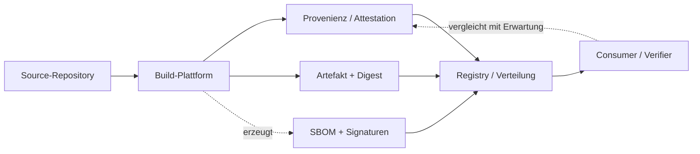

# Supply-Chain-Provenienz

Diese Seite untersucht, was signaturbasierte Lieferketten-Systeme über ein Artefakt tatsächlich beweisen. Sie ist für die Leitfrage des Wikis zentral, weil diese Systeme genau an der Stelle ansetzen, die auch ein Prüfer eines LLM-DONE-Bericht braucht: Wie bindet man eine Behauptung an eine überprüfbare, unabhängig nachvollziehbare Evidenzkette statt an Vertrauen? SLSA, in-toto, Sigstore und SBOM-Formate sind die industriellen Antworten auf diese Frage — und sie zeigen zugleich präzise, wo die Grenze zwischen „nachweisbar hergestellt" und „inhaltlich korrekt" verläuft.

*Hinweis zur Methode: Sätze, die mit „Eigene Analyse" eingeleitet sind, geben die Interpretation des Verfassers wieder, nicht eine Aussage der zitierten Quellen. Wörtliche Zitate stehen in Anführungszeichen und sind mit der jeweiligen Quelle belegt.*

## SLSA: Level-Struktur

SLSA (Supply-chain Levels for Software Artifacts) organisiert Garantien in *Tracks* mit aufsteigenden Leveln; ein Track misst jeweils einen Aspekt der Lieferkettensicherheit, damit Fortschritt in einem Bereich nicht durch einen unabhängigen anderen blockiert wird [Security levels — SLSA v1.0](https://slsa.dev/spec/v1.0/levels, accessed 2026-09-12). In der Fassung v1.0 gibt es den *Build track* mit den Leveln L0 bis L3 [Security levels — SLSA v1.0](https://slsa.dev/spec/v1.0/levels, accessed 2026-09-12).

- **Build L0** stellt keine Anforderungen und repräsentiert schlicht „kein SLSA" [Security levels — SLSA v1.0](https://slsa.dev/spec/v1.0/levels, accessed 2026-09-12).
- **Build L1** verlangt, dass Provenienz existiert, die beschreibt, wie das Artefakt gebaut wurde; sie ist laut Spezifikation „trivial to bypass or forge" und dient vor allem dem Ausschluss von Fehlern [Security levels — SLSA v1.0](https://slsa.dev/spec/v1.0/levels, accessed 2026-09-12).
- **Build L2** verlangt eine gehostete Build-Plattform, die die Provenienz signiert; dies schützt gegen Manipulation *nach* dem Build [Security levels — SLSA v1.0](https://slsa.dev/spec/v1.0/levels, accessed 2026-09-12).
- **Build L3** verlangt eine gehärtete Build-Plattform mit starker Isolation der Builds voneinander und ohne Zugriff der nutzerdefinierten Build-Schritte auf das Signaturmaterial; dies schützt gegen Manipulation *während* des Builds [Security levels — SLSA v1.0](https://slsa.dev/spec/v1.0/levels, accessed 2026-09-12).

Die Level-Zählung ist zwischen den Versionen inkompatibel: Die vorige Spezifikation v0.1 nutzte einen einzelnen, unbenannten Track mit den Stufen SLSA 1–4, und in v1.0 wurden die Source-Aspekte entfernt, um sich auf den Build-Track zu konzentrieren [Security levels — SLSA v1.0](https://slsa.dev/spec/v1.0/levels, accessed 2026-09-12). In v0.1 las sich das so: Level 1 = Dokumentation des Build-Prozesses (unsignierte Provenienz); Level 2 = Manipulationsresistenz des Build-Dienstes (gehostete Quelle/Build, signierte Provenienz); Level 3 = zusätzliche Resistenz gegen bestimmte Angriffe (nicht-fälschbare Provenienz); Level 4 = höchstes Vertrauen (Zwei-Personen-Review plus hermetische Builds) [Security levels — SLSA v0.1](https://slsa.dev/spec/v0.1/levels, accessed 2026-09-12). Wer heute „SLSA 3" liest, muss daher prüfen, ob die alte 1–4-Zählung oder der neue Build-Track L0–L3 gemeint ist — beide werden parallel verwendet und sind nicht deckungsgleich [Security levels — SLSA v1.0](https://slsa.dev/spec/v1.0/levels, accessed 2026-09-12).

## SLSA-Provenienz: was im Attestation-Objekt steht

Provenienz ist in SLSA definiert als Attestation, dass eine bestimmte Build-Plattform eine Menge von Artefakten durch Ausführung einer `buildDefinition` erzeugt hat [Provenance — SLSA v1.0](https://slsa.dev/spec/v1.0/provenance, accessed 2026-09-12). Die Struktur folgt dem in-toto-Attestation-Framework und verwendet den Predicate-Typ `https://slsa.dev/provenance/v1` [Provenance — SLSA v1.0](https://slsa.dev/spec/v1.0/provenance, accessed 2026-09-12). Zentrale Felder sind die `buildDefinition` mit `buildType`, `externalParameters`, `internalParameters` und `resolvedDependencies` sowie die `runDetails` mit `builder`, `metadata` und `byproducts` [Provenance — SLSA v1.0](https://slsa.dev/spec/v1.0/provenance, accessed 2026-09-12). Entscheidend für die Aussagekraft: `externalParameters` gelten als *untrusted* und müssen downstream verifiziert werden, während `internalParameters` als *trusted* gelten, weil die Plattform selbst als vertrauenswürdig angenommen wird [Provenance — SLSA v1.0](https://slsa.dev/spec/v1.0/provenance, accessed 2026-09-12). Die Vollständigkeit von `resolvedDependencies` ist ausdrücklich „best effort" — auch auf Build L3 [Provenance — SLSA v1.0](https://slsa.dev/spec/v1.0/provenance, accessed 2026-09-12). Die `builder.id`-URI soll die „transitive closure of the trusted build platform" benennen und den SLSA-Level allein bestimmen; sie kann auf Dokumentation verweisen, die Geltungsbereich und garantierten Level erklärt [Provenance — SLSA v1.0](https://slsa.dev/spec/v1.0/provenance, accessed 2026-09-12).

Laut SLSA-FAQ ist in-toto die „unopinionated layer", um Informationen über eine Lieferkette auszudrücken, während SLSA die „opinionated layer" ist, die festlegt, welche Information in in-toto-Metadaten enthalten sein muss [FAQ — SLSA v1.0](https://slsa.dev/spec/v1.0/faq, accessed 2026-09-12).

## in-toto: Layout, Steps, Functionaries und Link-Metadaten

in-toto ist ein Rahmenwerk, um die Integrität eines Softwareprodukts von der Entstehung bis zur Installation beim Endnutzer sicherzustellen; es macht transparent, welche Schritte durch wen und in welcher Reihenfolge ausgeführt wurden [What is in-toto?](https://in-toto.io/docs/what-is-in-toto/, accessed 2026-09-12). Das Projekt ist ein graduiertes Projekt der CNCF [in-toto Startseite](https://in-toto.io/, accessed 2026-09-12).

Das Modell funktioniert über drei Bausteine: Der *project owner* erstellt ein *layout*, das die Reihenfolge der *steps* der Lieferkette und die zu deren Ausführung autorisierten *functionaries* auflistet [in-toto — README](https://github.com/in-toto/in-toto, accessed 2026-09-12). Führt ein Functionary einen Schritt aus, sammelt in-toto Informationen über den verwendeten Befehl und die betroffenen Dateien und speichert sie in einer *link*-Metadatendatei; die Link-Dateien liefern damit die Evidenz für eine durchgehende Kette, die gegen die im Layout definierten Schritte validiert wird [in-toto — README](https://github.com/in-toto/in-toto, accessed 2026-09-12). Layout und Links werden gemeinsam mit dem Endprodukt ausgeliefert: das Layout signiert vom Projektowner, die Links signiert von den designierten Functionaries [in-toto — README](https://github.com/in-toto/in-toto, accessed 2026-09-12). Ein Layout enthält Ablaufdatum, Readme, Functionary-Keys, Signaturen, die Steps sowie *inspections* [in-toto — README](https://github.com/in-toto/in-toto, accessed 2026-09-12).

Die Verkettung der Schritte geschieht über eine einfache Regelsprache für Artefakte (Materialien und Produkte): `CREATE`, `DELETE`, `MODIFY`, `ALLOW`, `DISALLOW`, `REQUIRE` und insbesondere `MATCH <pattern> ... FROM <step>`, das den Output eines Schritts an den Input eines anderen bindet [in-toto — README](https://github.com/in-toto/in-toto, accessed 2026-09-12). Damit garantiert das Layout pro Schritt, dass nur autorisierte Artefakte erzeugt, geändert oder gelöscht werden und dass Änderungen auf den definierten Geltungsbereich beschränkt bleiben, was nachfolgende Schritte und Inspections miteinander verkettet [in-toto — README](https://github.com/in-toto/in-toto, accessed 2026-09-12). Die Verifikation prüft, dass das Layout mit dem Owner-Schlüssel signiert und nicht abgelaufen ist, dass jeder Schritt vom autorisierten Functionary ausgeführt und signiert wurde, dass die vorgesehenen Befehle verwendet wurden und dass Materialien und Produkte den Regeln entsprechen [in-toto — README](https://github.com/in-toto/in-toto, accessed 2026-09-12). Das *in-toto Attestation Framework* verallgemeinert dies zu einer Spezifikation für „verifiable claims about any aspect of how a piece of software is produced" [in-toto Attestation Framework](https://github.com/in-toto/attestation, accessed 2026-09-12); es wird unabhängig von der in-toto-Kernspezifikation entwickelt und soll künftig in diese einfließen [Specifications — in-toto](https://in-toto.io/docs/specs/, accessed 2026-09-12).

## Sigstore, cosign, Fulcio, Rekor: keyless Signing und Transparenz-Log

Sigstore ist ein Open-Source-Projekt zur Verbesserung der Software-Lieferkettensicherheit; es erzeugt Signaturen mit kurzlebigen („ephemeral") Schlüsseln, sodass keine langfristige Schlüsselverwaltung nötig ist, und protokolliert Signaturereignisse in einem manipulationsresistenten öffentlichen Log [Overview — Sigstore](https://docs.sigstore.dev/about/overview/, accessed 2026-09-12). Das Projekt steht unter der Open Source Security Foundation (OpenSSF) [Overview — Sigstore](https://docs.sigstore.dev/about/overview/, accessed 2026-09-12).

Die drei Hauptdienste sind funktional getrennt: **Cosign** ist das Werkzeug zum Signieren und Verifizieren von Containern und anderen Artefakten mit Ablage in einer OCI-Registry; **Fulcio** ist eine kostenlose Root-Zertifizierungsstelle, die temporäre Zertifikate an eine autorisierte Identität ausstellt und sie im Rekor-Log veröffentlicht; **Rekor** ist ein Transparenz- und Zeitstempeldienst, der signierte Metadaten in ein durchsuchbares, aber nicht manipulierbares Ledger schreibt [Tooling — Sigstore](https://docs.sigstore.dev/about/tooling/, accessed 2026-09-12) [Rekor — Sigstore](https://docs.sigstore.dev/logging/overview/, accessed 2026-09-12). Der Signaturvorgang bindet eine über OpenID Connect (OIDC) nachgewiesene Identität an ein kurzlebiges Zertifikat: Ein Cosign-Client erzeugt ein Schlüsselpaar, stellt eine Zertifikatsanfrage an Fulcio zusammen mit einem OIDC-Token, und Fulcio verifiziert das Token und stellt ein kurzlebiges, an Identität und öffentlichen Schlüssel gebundenes Zertifikat aus; der private Schlüssel wird nach einer einzigen Signatur verworfen [Overview — Sigstore](https://docs.sigstore.dev/about/overview/, accessed 2026-09-12). Um ephemeral zu signieren, erzeugt Cosign ein Schlüsselpaar im Speicher, bindet den öffentlichen Schlüssel an ein Fulcio-Zertifikat, signiert das Artefakt, solange das Zertifikat gültig ist, und speichert Signatur und Zertifikat in Rekor [Security Model — Sigstore](https://docs.sigstore.dev/about/security/, accessed 2026-09-12).

Rekor ist append-only: Einträge können nach dem Hinzufügen nicht mehr geändert werden, und ein gültiges Log ist von jedem Dritten kryptografisch verifizierbar; Rekor signiert periodisch den gesamten Merkle-Baum samt Zeitstempel [Security Model — Sigstore](https://docs.sigstore.dev/about/security/, accessed 2026-09-12). Ein Rekor-Eintrag ist eine einseitige Attestation, dass ein Datum vor einem bestimmten Zeitpunkt existierte [Security Model — Sigstore](https://docs.sigstore.dev/about/security/, accessed 2026-09-12). Die Grenze dieser Zeitgarantie ist explizit benannt: Transparenz-Logs machen Zeitstempel langfristig schwer fälschbar, in kurzen Zeitfenstern könnte der Rekor-Betreiber Zeitstempel jedoch leichter fälschen, weshalb Rekor Zeitstempel und Baumkopf mit einem nicht-abstreitbaren Signed Tree Head (STH) signiert [Security Model — Sigstore](https://docs.sigstore.dev/about/security/, accessed 2026-09-12). Das Ergebnis der Verifikation ist nach Sigstore-Darstellung: das Artefakt stammt aus seiner erwarteten Quelle und wurde nach der Erstellung nicht verändert [Overview — Sigstore](https://docs.sigstore.dev/about/overview/, accessed 2026-09-12). Sigstore kann laut eigener Beschreibung SBOMs als signierbare Artefakte behandeln und damit die Herkunft eines SBOM belegen [Overview — Sigstore](https://docs.sigstore.dev/about/overview/, accessed 2026-09-12).

## SBOM: NTIA-Mindestelemente, SPDX, CycloneDX

Ein SBOM (Software Bill of Materials) ist eine verschachtelte Inventarliste der Bestandteile, aus denen Softwarekomponenten zusammengesetzt sind [Software Bill of Materials (SBOM) — CISA](https://www.cisa.gov/sbom, accessed 2026-09-12). Die „minimum elements" wurden 2021 von der NTIA als Reaktion auf die Executive Order 14028 veröffentlicht; der Bericht definiert den Geltungsbereich der Mindestelemente, beschreibt SBOM-Anwendungsfälle und skizziert Optionen für die weitere Entwicklung [The Minimum Elements For a Software Bill of Materials (SBOM) — NTIA](https://www.ntia.gov/report/2021/minimum-elements-software-bill-materials-sbom, accessed 2026-09-12). Der NTIA-Bericht gliedert die Mindestelemente in drei Kategorien — Datenfelder, Automatisierungsunterstützung sowie Praktiken und Prozesse *[unkenntlich — die konkrete Liste der einzelnen Datenfelder konnte nicht aus einer abgerufenen Primärquelle verifiziert werden]*. Im Juli 2026 veröffentlichten CISA, NSA, FBI und internationale Partner eine gemeinsame Aktualisierung, die die NTIA-Mindestelemente von 2021 ersetzt und aktualisiert; die Neufassung übernimmt Stakeholder-Feedback aus einem öffentlichen Kommentarverfahren 2025 und bewahrt die Kernprinzipien des NTIA-Dokuments [2026 Minimum Elements for a Software Bill of Materials (SBOM) — CISA](https://www.cisa.gov/resources-tools/resources/2026-minimum-elements-software-bill-materials-sbom, accessed 2026-09-12). Ein SBOM ist damit ein Transparenz-, kein Integritätsnachweis: Er listet Bestandteile, belegt aber nicht, dass sie sicher sind [Software Bill of Materials (SBOM) — CISA](https://www.cisa.gov/sbom, accessed 2026-09-12).

Die zwei dominierenden Austauschformate sind **SPDX** und **CycloneDX**. SPDX bezeichnet sich als offener Standard zur Repräsentation von Systemen mit Softwarekomponenten als SBOMs und weiteren Referenzen und ist als ISO/IEC 5962:2021 standardisiert [The System Package Data Exchange (SPDX)](https://spdx.dev/, accessed 2026-09-12). CycloneDX wird von der OWASP Foundation und dem Ecma Technical Committee TC54 getragen, ist als ECMA-424 standardisiert und deckt neben SBOM auch SaaSBOM, CBOM (Cryptography BOM), VEX, HBOM und AI/ML-BOM ab [CycloneDX](https://cyclonedx.org/, accessed 2026-09-12). SLSA grenzt sein eigenes Provenienz-Objekt ausdrücklich gegen SBOM ab: Ein SBOM beschreibt feingranular die in einem Artefakt *enthaltenen* Komponenten, während SLSA-Provenienz gröber die *externen Parameter eines Builds* beschreibt; die Granularität sei so unterschiedlich, dass aktuelle SBOM-Formate als nicht geeignet für die Anforderungen des Build-Tracks galten [FAQ — SLSA v1.0](https://slsa.dev/spec/v1.0/faq, accessed 2026-09-12). SLSA-Provenienz könne aber umgekehrt die Vertrauenswürdigkeit eines SBOM erhöhen, indem sie beschreibt, wie das SBOM erstellt wurde [FAQ — SLSA v1.0](https://slsa.dev/spec/v1.0/faq, accessed 2026-09-12).

Die folgende Darstellung ordnet die beteiligten Entitäten und ihre Abhängigkeiten; sie ist eine eigene Zusammenfassung, keine Original-Grafik.

*Eigene Darstellung basierend auf 6 Quellen (SLSA v1.0 levels/provenance, in-toto, Sigstore overview/tooling, CISA SBOM).*

## Was Provenienz garantiert — und was nicht

**Was garantiert wird.** Innerhalb ihres jeweiligen Vertrauensmodells garantieren diese Systeme drei Dinge: (1) *Herkunft* — dass ein Artefakt aus einer bestimmten Quelle und durch einen bestimmten Prozess entstand [Overview — Sigstore](https://docs.sigstore.dev/about/overview/, accessed 2026-09-12); (2) *Integrität* — dass es nach der Signatur nicht mehr verändert wurde, belegt durch Abgleich des Artefakt-Hashes mit dem `subject` der Provenienz [SLSA Threats & mitigations v1.0](https://slsa.dev/spec/v1.0/threats, accessed 2026-09-12); (3) *Nachvollziehbarkeit der Schritte* — welche Schritte durch wen in welcher Reihenfolge ausgeführt wurden [What is in-toto?](https://in-toto.io/docs/what-is-in-toto/, accessed 2026-09-12). SLSA präzisiert das Ziel der Verifikation: Der Consumer kennt die *erwartete* Provenienz und vergleicht jede tatsächliche Provenienz damit, um mehrere Angriffsklassen auszuschließen [Security levels — SLSA v1.0](https://slsa.dev/spec/v1.0/levels, accessed 2026-09-12).

**Was nicht garantiert wird.** Die schärfste Formulierung dieser Grenze stammt aus der SLSA-Spezifikation selbst: „Provenance is only a claim that a particular artifact was *built*, not that it was *published* to a particular registry" [SLSA Threats & mitigations v1.0](https://slsa.dev/spec/v1.0/threats, accessed 2026-09-12). Daraus folgen mehrere explizite Nicht-Garantien.

Erstens beweist Provenienz *nicht die Absicht*: SLSA v1.0 adressiert Source-Bedrohungen ausdrücklich nicht — weder eine unbefugte Änderung durch einen Insider („Submit unauthorized change") noch die Kompromittierung des Quell-Repositories werden von v1.0 behandelt [SLSA Threats & mitigations v1.0](https://slsa.dev/spec/v1.0/threats, accessed 2026-09-12). Ein Artefakt, das aus bösartigem Quellcode korrekt und sauber gebaut wird, erhält eine völlig gültige Provenienz — die Kette Herkunft → Build → Signatur bleibt intakt, weil sie nichts über die Wünschbarkeit des Quellcodes aussagt [SLSA Threats & mitigations v1.0](https://slsa.dev/spec/v1.0/threats, accessed 2026-09-12).

Zweitens ist selbst der Output-Digest keine Aussage über Nützlichkeit: SLSA hält fest, dass der Tenant-Build-Prozess den Output-Digest setzen könnte, ohne dass die Plattform dessen tatsächliche Erzeugung verifiziert — und bewertet das als „not a problem", weil jeder Build, der ein Artefakt beansprucht, es auch einfach unverändert von Input nach Output kopiert haben könnte [SLSA Threats & mitigations v1.0](https://slsa.dev/spec/v1.0/threats, accessed 2026-09-12).

Drittens bleiben ganze Bedrohungskategorien außerhalb des Geltungsbereichs: kompromittierte Build-Abhängigkeiten und Laufzeit-Abhängigkeiten (Threat D) sind „out of scope of SLSA v1.0" [SLSA Threats & mitigations v1.0](https://slsa.dev/spec/v1.0/threats, accessed 2026-09-12); die Manipulation einer Registry, einschließlich De-Listing von Artefakt oder Provenienz, wird von v1.0 nicht adressiert (Threat G) [SLSA Threats & mitigations v1.0](https://slsa.dev/spec/v1.0/threats, accessed 2026-09-12); Typosquatting (Threat H) liegt „mostly outside the scope of SLSA" [SLSA Threats & mitigations v1.0](https://slsa.dev/spec/v1.0/threats, accessed 2026-09-12). Auch Verfügbarkeits-Bedrohungen behandelt v1.0 nicht [SLSA Threats & mitigations v1.0](https://slsa.dev/spec/v1.0/threats, accessed 2026-09-12).

Viertens ist der SLSA-Level *nicht transitiv*: Ein Artefakt auf hohem Level kann aus Abhängigkeiten auf niedrigem Level gebaut sein — „it is possible for a SLSA 4 artifact to be built from SLSA 0 dependencies" [Security levels — SLSA v0.1](https://slsa.dev/spec/v0.1/levels, accessed 2026-09-12). Die FAQ begründet dies als bewusste Entscheidung, um das Problem handhabbar zu machen [FAQ — SLSA v1.0](https://slsa.dev/spec/v1.0/faq, accessed 2026-09-12).

Und fünftens benennt auch Sigstors eigenes Sicherheitsmodell seine Grenzen: Bei kompromittierter OIDC-Identität oder kompromittiertem OIDC-Provider *kann* Fulcio unbefugte Zertifikate ausstellen; bei kompromittierter Fulcio ebenso; und wenn keine Dritten die Logs überwachen, „might any misbehavior by Rekor and Fulcio go undetected" [Security Model — Sigstore](https://docs.sigstore.dev/about/security/, accessed 2026-09-12). Fulcio selbst überwacht das Zertifikatstransparenz-Log nicht — die Nutzer sind für die Überwachung ihrer Identitäten verantwortlich [Security Model — Sigstore](https://docs.sigstore.dev/about/security/, accessed 2026-09-12).

Die zentrale Grenze bleibt also: Eine gültige Signatur und eine gültige Provenienz belegen *Herkunft und Unversehrtheit relativ zu einem Vertrauensanker*, nicht die *Richtigkeit oder Sicherheit* des Inhalts. *Eigene Analyse:* Signaturbasierte Lieferketten sind damit eher eine Kette von unabhängig überprüfbaren *Behauptungen* als ein Beweis über den Zustand der Welt — und sie machen den einen Punkt explizit, der auch für einen LLM-Prüfer entscheidend ist: Wer eine Behauptung akzeptiert, muss *wissen, wogegen* er sie prüft (die „expectations"), sonst prüft er nur Konsistenz, nicht Wahrheit [Security levels — SLSA v1.0](https://slsa.dev/spec/v1.0/levels, accessed 2026-09-12).

*Eigene Analyse:* Anders als Provenienz-Systeme, die nur gültig oder ungültig kennen, braucht der Prüfer einen dritten Ausgang — *unprüfbar*. Fehlt die Erwartung oder der Vertrauensanker, ist die ehrliche Ausgabe nicht „gültig", sondern „nicht entscheidbar"; das entspricht der Regel, im Zweifel `UNVERIFIABLE` statt `CONFIRMED` zu melden.

## Übertragbarkeit auf den Prüfer

*Eigene Analyse des Verfassers, abgeleitet aus den oben zitierten Quellen.*

Der übertragbare Kern liegt in der Trennung, die diese Systeme erzwingen: *Behauptung* („dieses Artefakt wurde so-und-so gebaut") wird erst durch Abgleich mit einer unabhängig fixierten *Erwartung* überprüfbar [Security levels — SLSA v1.0](https://slsa.dev/spec/v1.0/levels, accessed 2026-09-12). Ein Prüfer eines LLM-DONE-Berichts kann analog verfahren, indem er die Behauptung gegen extern beobachtbaren Zustand (Dateien, Tests, Git-Historie, Artefakt-Hashes) statt gegen den Bericht selbst hält. Die zweite übertragbare Lektion ist die Bedeutung des Vertrauensankers: SLSA wie Sigstore sind nur so gut wie die Vertrauensannahme in Builder bzw. Fulcio/Rekor, und sie sagen offen, was außerhalb des Ankers liegt [Security Model — Sigstore](https://docs.sigstore.dev/about/security/, accessed 2026-09-12). Ein Prüfer sollte daher ebenso explizit benennen, *worauf* er sich verlässt — und was er gerade nicht geprüft hat [SLSA Threats & mitigations v1.0](https://slsa.dev/spec/v1.0/threats, accessed 2026-09-12).

## Quellen

- Security levels — SLSA v1.0: https://slsa.dev/spec/v1.0/levels
- Security levels — SLSA v0.1: https://slsa.dev/spec/v0.1/levels
- Provenance — SLSA v1.0: https://slsa.dev/spec/v1.0/provenance
- Threats & mitigations — SLSA v1.0: https://slsa.dev/spec/v1.0/threats
- FAQ — SLSA v1.0: https://slsa.dev/spec/v1.0/faq
- What is in-toto?: https://in-toto.io/docs/what-is-in-toto/
- in-toto Homepage: https://in-toto.io/
- in-toto README: https://github.com/in-toto/in-toto
- in-toto Attestation Framework: https://github.com/in-toto/attestation
- Specifications — in-toto: https://in-toto.io/docs/specs/
- Overview — Sigstore: https://docs.sigstore.dev/about/overview/
- Security Model — Sigstore: https://docs.sigstore.dev/about/security/
- Tooling — Sigstore: https://docs.sigstore.dev/about/tooling/
- Rekor — Sigstore: https://docs.sigstore.dev/logging/overview/
- The Minimum Elements For a Software Bill of Materials (SBOM) — NTIA: https://www.ntia.gov/report/2021/minimum-elements-software-bill-materials-sbom
- Software Bill of Materials (SBOM) — CISA: https://www.cisa.gov/sbom
- 2026 Minimum Elements for a Software Bill of Materials (SBOM) — CISA: https://www.cisa.gov/resources-tools/resources/2026-minimum-elements-software-bill-materials-sbom
- SPDX: https://spdx.dev/
- CycloneDX: https://cyclonedx.org/
