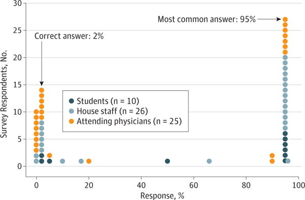
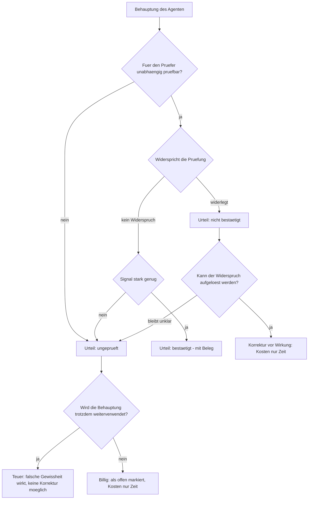

# Falsche Bestätigung — Fehlerkosten und Asymmetrie

## 1. Einleitung: die Leitfrage nach dem teuren Fehler

Ein Prüfer prüft eine Behauptung über den Zustand der Welt, statt sie zu glauben. Pro
Behauptung fällt er genau ein Urteil: bestätigt oder nicht bestätigt. Beide Urteile
können falsch sein — aber sie sind nicht gleich teuer. Die Leitfrage dieser Seite ist
deshalb nicht "Wie prüft man?", sondern "Welcher Prüffehler kostet mehr?".

Die zentrale These lautet: Ein falsches "verifiziert" — eine **falsche Bestätigung** —
wiegt schwerer als der **falsche Alarm**, die andere Fehlermöglichkeit des Prüfers. Ein
falsches "verifiziert" erzeugt eine falsche Gewissheit, auf der weitere Entscheidungen
aufbauen und die sich dadurch verselbständigt. Ein Fehler, der bloß verpasst wird und
keine Bestätigung trägt, bleibt dagegen korrigierbar. Diese Asymmetrie ist die
Kostenbegründung für ein bewusst asymmetrisches Prüfer-Design: im Zweifel nicht
bestätigen, sondern eskalieren.

Die Begründung ist nicht anekdotisch. Statistik, klinische Diagnostik, IT-Sicherheit und
Softwaretest beschreiben denselben Effekt unter verschiedenen Namen: Die entscheidende
Größe ist nicht die Treffsicherheit des Prüfers, sondern die **Häufigkeit des geprüften
Ereignisses** — und bei seltenen Ereignissen dominieren die Fehlurteile.

## 2. Begriffsklärung: welche zwei Fehler zur Wahl stehen

Der Prüfer trifft auf eine Behauptung, die wahr oder falsch sein kann, und gibt ein Urteil
ab, das bestätigt oder ablehnt. Daraus ergeben sich vier Fälle:

| | Behauptung ist wahr | Behauptung ist falsch |
|---|---|---|
| **Urteil: bestätigt** | korrekte Bestätigung | **falsche Bestätigung** (teuer) |
| **Urteil: nicht bestätigt** | **falscher Alarm** (billig) | korrekte Ablehnung |

Die beiden Fehlerzellen sind die klassischen zwei Fehlerarten der statistischen
Entscheidung, die Neyman und Pearson 1933 formalisiert haben: das Verwerfen einer
zutreffenden Hypothese und das Nicht-Verwerfen einer falschen
[IX. On the problem of the most efficient tests of statistical hypotheses](https://doi.org/10.1098/rsta.1933.0009,
accessed 2026-09-12). Welcher Fehler "Typ I" und welcher "Typ II" heißt, hängt davon ab,
was man als Nullhypothese setzt — und genau diese Wahl entscheidet auch über die
Benennung.

**Begriffliche Klarstellung.** Ein falsches "verifiziert" heißt in der
Bestätigungs-Perspektive *false positive*: Ein positives Urteil wird ohne zutreffenden
Sachverhalt ausgesprochen. In der Erkennungs-Perspektive (Betrugs- und Fehlererkennung)
heißt derselbe Vorgang *false negative*: Ein realer Fehler wurde nicht erkannt. Beide
Namen meinen dieselbe Zelle — die **falsche Bestätigung** ist das Etikett, das den Fehler
passieren lässt. Wird "durchgelassen" dagegen ohne Bestätigung gebraucht (etwa bei
Schwellenwerten in §5), ist die bloß verpasste Erkennung gemeint — teuer wird sie erst,
wenn eine Bestätigung sie deckt. Der kostengünstige Gegenpol ist
der **falsche Alarm**: eine Ablehnung ohne echten Fehler. Die inhaltlich scharfe
Gegenüberstellung lautet also nicht "Bestätigung gegen Erkennung", sondern **falsche
Bestätigung gegen falschen Alarm**.

*Eigene Analyse:* Die Kostenschere erklärt sich aus der Wirkung, nicht aus der Häufigkeit. Eine falsche
Bestätigung ist **irreversibel** (das Ereignis ist bereits eingetreten, als das Urteil
fällt), sie **erodiert Vertrauen** (eine widerlegte Zusicherung beschädigt die
Glaubwürdigkeit aller künftigen Zusicherungen) und sie **kaskadiert** (weitere
Entscheidungen bauen auf der falschen Gewissheit auf). Ein falscher Alarm kostet dagegen
zunächst nur Zeit: eine weitere Prüfung, eine manuelle Nachschau, ein zweiter Blick. Erst
wenn falsche Alarme massenhaft auftreten, kippt die Bilanz — dazu unten die
Gegenbeispiele aus der Überwachungstechnik.

## 3. Base-Rate-Fallacy: warum seltene Ereignisse die Aussage dominieren

Tversky und Kahneman zeigten 1974, dass Menschen bei Wahrscheinlichkeitsurteilen die
Repräsentativität einer Information gegen die **Grundhäufigkeit (base rate)** abwägen und
dabei systematisch die Grundhäufigkeit vernachlässigen; sie beschreiben dies als einen der
"systematischen und vorhersagbaren Fehler", zu denen die Heuristiken des Urteilens führen
[Judgment under Uncertainty: Heuristics and Biases](https://doi.org/10.1126/science.185.4157.1124,
accessed 2026-09-12). Für die Verifikation bedeutet das: Wenn das gesuchte Ereignis selten
ist, wird ein positiver Befund fast vollständig von den Fehlalarmen des Prüfverfahrens
bestimmt — unabhängig davon, wie "genau" das Verfahren auf dem Papier wirkt.

Denselben Mechanismus beschreibt Ioannidis 2005 für die Forschung insgesamt: Die
Wahrscheinlichkeit, dass ein Befund wahr ist, hängt unter anderem vom Verhältnis der
wahren zu den falschen Beziehungen ab, die in einem Feld überhaupt geprüft werden; sie
sinkt, wenn viele Zusammenhänge ohne Vorauswahl getestet werden
[Why Most Published Research Findings Are False](https://doi.org/10.1371/journal.pmed.0020124,
accessed 2026-09-12). Aus Sicht des Prüfers ist das die formale Fassung derselben Regel:
Je unwahrscheinlicher ein Fehler *a priori* ist, desto stärker muss ein Nachweis sein,
bevor ein "verifiziert" Bestand hat.

## 4. Medizin als Analogie: Screening und der positive Vorhersagewert

Die klinische Diagnostik liefert das saubere Rechenbeispiel. Ein Test wird durch zwei
Kennzahlen beschrieben: die **Sensitivität** (Anteil der Kranken, die der Test erkennt)
und die **Spezifität** (Anteil der Gesunden, die der Test als gesund einstuft). Was den
Behandler aber allein interessiert, ist der **positive Vorhersagewert (positive predictive
value, PPV)**: die Wahrscheinlichkeit, dass eine Person mit positivem Testergebnis
tatsächlich krank ist. Der PPV hängt entscheidend von der Prävalenz ab und ist keine
Eigenschaft des Tests allein; die evidenzbasierte Medizin behandelt diese
Interpretationsfrage ausführlich
[Users' guides to the medical literature. III. How to use an article about a diagnostic test. A. Are the results of the study valid?](https://doi.org/10.1001/jama.1994.03510290071040,
accessed 2026-09-12).

Casscells, Schoenberger und Graboys legten 1978 Ärzten, Assistenzärzten und Studenten eine
Aufgabe vor: Ein Test auf eine Krankheit mit einer Häufigkeit von 1/1000 liefert bei 5 %
der Gesunden ein falsches positives Ergebnis. Wie hoch ist die Wahrscheinlichkeit, dass
eine positiv getestete Person die Krankheit wirklich hat? Die korrekte Antwort beträgt
rund 2 %. Die Mehrheit der Befragten überschätzte den PPV dramatisch; die häufigste
Antwort war 95 %
[Interpretation by Physicians of Clinical Laboratory Results](https://doi.org/10.1056/NEJM197811022991808,
accessed 2026-09-12). Manrai und Kollegen wiederholten die Studie 2013 und fanden
dasselbe Ergebnis: Von 61 Befragten antworteten 14 korrekt (23 %), die häufigste Antwort
war erneut 95 % (27 von 61), und der Median der Antworten lag bei 66 % — das Dreiund-
dreißigfache des wahren Werts. Einige Begründungen offenbarten den Denkfehler direkt, etwa
die Aussage eines Kardiologen, der PPV hänge nicht von der Prävalenz ab
[Medicine's Uncomfortable Relationship With Math: Calculating Positive Predictive Value](https://doi.org/10.1001/jamainternmed.2014.1059,
accessed 2026-09-12).

*Abbildung 1: PPV-Schätzungen in der Manrai-Replikation (2014): Studierende (n=10), Klinikpersonal (n=26) und Fachärzte (n=25); die häufigste Antwort war 95 %, die korrekte Antwort rund 2 % (Quelle: [Medicine's Uncomfortable Relationship With Math: Calculating Positive Predictive Value](https://doi.org/10.1001/jamainternmed.2014.1059, accessed 2026-09-12))*

Die Rechnung hinter dem Ergebnis ist bei perfekter Sensitivität einfach. Von 100 000
Personen sind 100 krank (Prävalenz 1/1000); alle 100 werden positiv getestet. Von den
99 900 Gesunden liefern 5 %, also 4995, ein falsch-positives Ergebnis. Unter allen 5095
positiven Testergebnissen sind nur 100 tatsächlich krank — das sind 1,96 %, gerundet 2 %.
Der Grund ist strukturell: Bei seltener Krankheit übersteigt die schiere Zahl der Gesunden
die Zahl der Kranken so weit, dass selbst eine kleine Falsch-positiv-Rate die Zahl der
echten Treffer dominiert. Ein positiver Test ist bei niedriger Prävalenz also **meist
falsch** — nicht weil der Test schlecht wäre, sondern weil die Grundhäufigkeit ihn
überstimmt. Für den Prüfer heißt das: Ein einzelner "verifizierender" Befund ist bei
seltenen Fehlern kaum aussagekräftig.

## 5. Security als Analogie: IDS und Alarmmüdigkeit

Axelsson übertrug 2000 dieselbe Rechnung auf Intrusion-Detection-Systeme. Er zeigt formal,
dass für ein realistisches Annahmebündel die **Falschalarmrate der begrenzende Faktor** für
die Leistungsfähigkeit eines IDS ist: Um eine nennenswerte *Bayesian detection rate*
P(Intrusion | Alarm) zu erreichen, muss die Falschalarmrate unerreichbar niedrig liegen;
die Durchsicht vorliegender Leistungsberichte legt nahe, dass zumindest manche IDS-Typen
weit von solchen Werten entfernt sind
[The base-rate fallacy and the difficulty of intrusion detection](https://doi.org/10.1145/357830.357849,
accessed 2026-09-12). Bei seltenen Angriffen produziert ein IDS also fast nur Fehlalarme —
dieselbe Grundhäufigkeits-Logik wie beim medizinischen Screening.

Die Folge ist ein Betriebsproblem, kein Rechenproblem. Cvach beschreibt in einer
integrativen Übersicht die **Alarmmüdigkeit (alarm fatigue)**: Sie sei ein nationales
Problem und 2012 die häufigste Gefahrenquelle unter den Medizingerätetechnologien
gewesen; die Desensibilisierung gegenüber Alarmen sei vielschichtig und hänge mit einer
hohen Falschalarmrate, einem schlechten positiven Vorhersagewert und der Menge
alarmierender Geräte zusammen
[Monitor Alarm Fatigue: An Integrative Review](https://doi.org/10.2345/0899-8205-46.4.268,
accessed 2026-09-12). Hier zeigt sich die Gegenseite der Asymmetrie: Wenn Fehlalarme
massenhaft auftreten, werden **echte** Alarme nicht mehr beachtet — der falsche Alarm wird
teuer, weil er die Aufmerksamkeit für den echten raubt. Axelsson und Cvach beschreiben
damit denselben Zielkonflikt, auf den der Prüfer bei der Schwellenwahl stößt: Ein niedriger
Schwellenwert senkt die Zahl durchgelassener Fehler, erzeugt aber Fehlalarme; ein hoher
Schwellenwert senkt die Fehlalarme, lässt aber Fehler durch.

## 6. Softwaretest als Analogie: der grüne Build als falsche Sicherheit

Ein bestandener Test beweist **nur, was der Test prüft** — er belegt die Abwesenheit genau
der Fehler, die er abdeckt, und schweigt zu allem anderen. Ein grüner Build ist deshalb
kein Nachweis von Korrektheit, sondern nur ein bestandener Nachweis über einen Ausschnitt.
Wie schwach der Bezug zwischen Testabdeckung und Testwirksamkeit ist, quantifizierten
Inozemtseva und Holmes: In ihrer Studie korreliert die Abdeckung nicht stark mit der
Wirksamkeit einer Testsuite; ein hoher Abdeckungsgrad allein sagt wenig darüber aus, wie
viele Fehler die Tests tatsächlich entdecken
[Coverage is not strongly correlated with test suite effectiveness](https://doi.org/10.1145/2568225.2568271,
accessed 2026-09-12). Ein "verifiziert" durch einen grünen Build ist damit strukturell
eine falsche Bestätigung: Es bestätigt einen kleinen Ausschnitt und wird als Bestätigung
des Ganzen gelesen.

Hinzu kommt der Preis der Gegenfehler in der Praxis der Continuous Integration. Falsch
alarmierende ("flaky") Tests erzeugen rote Builds ohne echten Fehler und binden Zeit und
Vertrauen; eine industrielle Fallstudie beziffert die Kosten solcher Fehlsignale in der CI
[Cost of Flaky Tests in Continuous Integration: An Industrial Case Study](https://doi.org/10.1109/icst60714.2024.00037,
accessed 2026-09-12). Ein Testsystem leidet damit an derselben Doppelbelastung wie IDS
und Patientenmonitor: zu viele falsche Alarme entwerten die Verdikte, zu wenige Prüfungen
lassen Fehler durch einen grünen Build passieren.

## 7. Das Asymmetrie-Argument

Warum sind die beiden Fehler in Verifikationssystemen *nicht* symmetrisch? Drei Gründe:

1. **Irreversibilität.** Eine falsche Bestätigung wird typischerweise *nach* dem Eintritt
   des Ereignisses abgegeben (der Build ist schon grün, die Zahlung schon frei, der Bericht
   schon veröffentlicht). Die falsche Gewissheit beschreibt einen Zustand, der bereits
   wirkt und nicht mehr ungeschehen gemacht werden kann. Ein falscher Alarm dagegen wird
   *vor* der Wirkung abgegeben und kann ohne Schaden aufgelöst werden.
2. **Vertrauensverlust.** Eine widerlegte Zusicherung beschädigt die Glaubwürdigkeit des
   gesamten Prüfsystems, nicht nur des einzelnen Urteils. Der Prüfer existiert, um
   Vertrauen herzustellen; eine falsche Bestätigung zerstört genau das, wofür er gebaut
   wurde.
3. **Kaskade.** Weitere Entscheidungen bauen auf der Bestätigung auf. Je später der Irrtum
   auffällt, desto mehr abhängige Entscheidungen müssen revidiert werden. Die
   Fehlerkosten wachsen mit dem Abstand zwischen Bestätigung und Entdeckung.

Der Gegenpol ist ebenso wichtig, und die Literatur liefert ihn mit: In der
Überwachungstechnik ist gerade der **falsche Alarm** der teure Fehler, weil er die
Aufmerksamkeit für echte Signale zerstört (Alarmmüdigkeit) und die Akzeptanz des Systems
untergräbt — Axelsson nennt die Falschalarmrate den begrenzenden Faktor, und Cvach nennt
den schlechten PPV als Kern der Desensibilisierung
[The base-rate fallacy and the difficulty of intrusion detection](https://doi.org/10.1145/357830.357849,
accessed 2026-09-12) [Monitor Alarm Fatigue: An Integrative Review](https://doi.org/10.2345/0899-8205-46.4.268,
accessed 2026-09-12). Dasselbe gilt für Werkzeuge: Sadowski und Kollegen leiten aus dem
Betrieb statischer Analysen bei Google ab, dass ein Analyseprojekt nur erfolgreich sein
kann, wenn die Entwickler den Nutzen spüren und das Werkzeug gern benutzen — was praktisch
heißt, dass ein Werkzeug mit vielen Fehlalarmen nicht angenommen wird
[Lessons from building static analysis tools at Google](https://doi.org/10.1145/3188720,
accessed 2026-09-12). Die Asymmetrie ist also **domänenabhängig**, nicht universal:

- Die **falsche Bestätigung** kostet dann am meisten, wenn das Ereignis irreversibel,
  vertrauensbildend oder kaskadierend ist — also bei Zusicherungen, Zertifikaten und
  Freigaben.
- Der **falsche Alarm** kostet dann am meisten, wenn er massenhaft auftritt und die
  Aufmerksamkeit für echte Signale verbraucht — also bei Dauerüberwachung.
- Der **falsche Alarm ist billig**, solange er selten ist und seine Auflösung nur Zeit
  kostet. Genau dann ist "im Zweifel weitere Prüfung" die richtige Regel, und genau deshalb
  kann der Prüfer seine Schwelle bewusst niedrig ansetzen, ohne die Akzeptanz zu zerstören.

## 8. Implikationen für das Verifikations-Design

Aus der Asymmetrie folgen fünf Designregeln für den Prüfer.

- **Asymmetrische Schwellen.** Bestätigung verlangt ein starkes Signal, Ablehnung nur ein
  schwaches. Das ist die Umkehrung der "unschuldig bis zum Beweis der Schuld"-Regel: Der
  Beweislast liegt beim Bestätigen. Formal ist das die Neyman-Pearson-Logik, bei der die
  beiden Fehlerarten bewusst unterschiedlich streng behandelt werden
  [IX. On the problem of the most efficient tests of statistical hypotheses](https://doi.org/10.1098/rsta.1933.0009,
  accessed 2026-09-12).
- **Kosten-Matrix statt Genauigkeit.** Nicht die Trefferquote, sondern die erwarteten
  Kosten beider Fehlerarten entscheiden über die Schwelle. Bei seltener Grundhäufigkeit
  muss die Schwelle so liegen, dass sich der PPV der Bestätigung überhaupt trägt; sonst
  ist das "verifiziert" fast immer falsch
  [The base-rate fallacy and the difficulty of intrusion detection](https://doi.org/10.1145/357830.357849,
  accessed 2026-09-12).
- **Im Zweifel eskalieren statt bestätigen.** Weil die falsche Bestätigung irreversibel
  wirkt, muss der unsichere Fall in den offenen Zustand übergehen, nicht in den
  bestätigten. "Ungeprüft" ist ein eigenes, ehrliches Urteil — nicht dasselbe wie
  "verifiziert".
- **Unabhängigkeit der Prüfung.** Eine Bestätigung durch dieselbe Quelle, die die
  Behauptung erzeugt hat, trägt keinen unabhängigen Informationsgehalt. Die Prüfung muss
  gegen die Wirklichkeit laufen, nicht gegen die Beschreibung der Wirklichkeit durch den
  Behauptenden.
- **Nachvollziehbarkeit der Bestätigung.** Weil eine falsche Bestätigung nur entdeckt
  werden kann, wenn nachvollziehbar ist, *worauf* sie sich stützte, muss jede Bestätigung
  auf einen prüfbaren Beleg verweisen. Ohne Belegbindung ist eine Bestätigung nicht
  entkräftbar und damit nicht korrigierbar.

Die Werkzeug-Erfahrung ergänzt diese Regeln um eine Akzeptanzbedingung: Ein Prüfer, der
zwar selten falsch bestätigt, aber häufig falsch alarmiert, wird nicht benutzt — und ein
nicht benutzter Prüfer bestätigt gar nichts
[Lessons from building static analysis tools at Google](https://doi.org/10.1145/3188720,
accessed 2026-09-12).

## 9. Entscheidungsbaum

Die folgende Grafik fasst den Kern des Entwurfs zusammen: Die teure Verzweigung ist nicht
"bestätigen", sondern "unabhängig prüfen". Wo nicht unabhängig geprüft werden kann, darf
das Ergebnis nicht "verifiziert" heißen.

## 10. Quellen

1. Tversky, A.; Kahneman, D. (1974). Judgment under Uncertainty: Heuristics and Biases.
   *Science* 185, 1124–1131. DOI [10.1126/science.185.4157.1124](https://doi.org/10.1126/science.185.4157.1124,
   accessed 2026-09-12).
2. Casscells, W.; Schoenberger, A.; Graboys, T. B. (1978). Interpretation by Physicians of
   Clinical Laboratory Results. *New England Journal of Medicine* 299(18), 999–1001. DOI
   [10.1056/NEJM197811022991808](https://doi.org/10.1056/NEJM197811022991808,
   accessed 2026-09-12).
3. Manrai, A. K.; Bhatia, G.; Strymish, J.; Kohane, I. S.; Jain, S. H. (2014). Medicine's
   Uncomfortable Relationship With Math: Calculating Positive Predictive Value. *JAMA
   Internal Medicine* 174(6), 991–993. DOI
   [10.1001/jamainternmed.2014.1059](https://doi.org/10.1001/jamainternmed.2014.1059,
   accessed 2026-09-12).
4. Jaeschke, R.; Guyatt, G.; Sackett, D. L. (1994). Users' guides to the medical
   literature. III. How to use an article about a diagnostic test. A. Are the results of
   the study valid? *JAMA* 271(5), 389–391. DOI
   [10.1001/jama.1994.03510290071040](https://doi.org/10.1001/jama.1994.03510290071040,
   accessed 2026-09-12).
5. Neyman, J.; Pearson, E. S. (1933). IX. On the problem of the most efficient tests of
   statistical hypotheses. *Philosophical Transactions of the Royal Society of London.
   Series A* 231, 289–337. DOI
   [10.1098/rsta.1933.0009](https://doi.org/10.1098/rsta.1933.0009, accessed 2026-09-12).
6. Axelsson, S. (2000). The base-rate fallacy and the difficulty of intrusion detection.
   *ACM Transactions on Information and System Security* 3(3), 186–205. DOI
   [10.1145/357830.357849](https://doi.org/10.1145/357830.357849, accessed 2026-09-12).
7. Cvach, M. (2012). Monitor Alarm Fatigue: An Integrative Review. *Biomedical
   Instrumentation & Technology* 46(4), 268–277. DOI
   [10.2345/0899-8205-46.4.268](https://doi.org/10.2345/0899-8205-46.4.268,
   accessed 2026-09-12).
8. Inozemtseva, L.; Holmes, R. (2014). Coverage is not strongly correlated with test suite
   effectiveness. *Proceedings of the 36th International Conference on Software
   Engineering (ICSE)*, 435–445. DOI
   [10.1145/2568225.2568271](https://doi.org/10.1145/2568225.2568271, accessed 2026-09-12).
9. Leinen, F. et al. (2024). Cost of Flaky Tests in Continuous Integration: An Industrial
   Case Study. *2024
   IEEE Conference on Software Testing, Verification and Validation (ICST)*. DOI
   [10.1109/icst60714.2024.00037](https://doi.org/10.1109/icst60714.2024.00037,
   accessed 2026-09-12).
10. Sadowski, C.; Aftandilian, E.; Eagle, A.; Miller-Cushon, L.; Jaspan, C. (2018).
    Lessons from building static analysis tools at Google. *Communications of the ACM*
    61(4), 58–66. DOI [10.1145/3188720](https://doi.org/10.1145/3188720,
    accessed 2026-09-12).
11. Ioannidis, J. P. A. (2005). Why Most Published Research Findings Are False. *PLoS
    Medicine* 2(8), e124. DOI
    [10.1371/journal.pmed.0020124](https://doi.org/10.1371/journal.pmed.0020124,
    accessed 2026-09-12).
