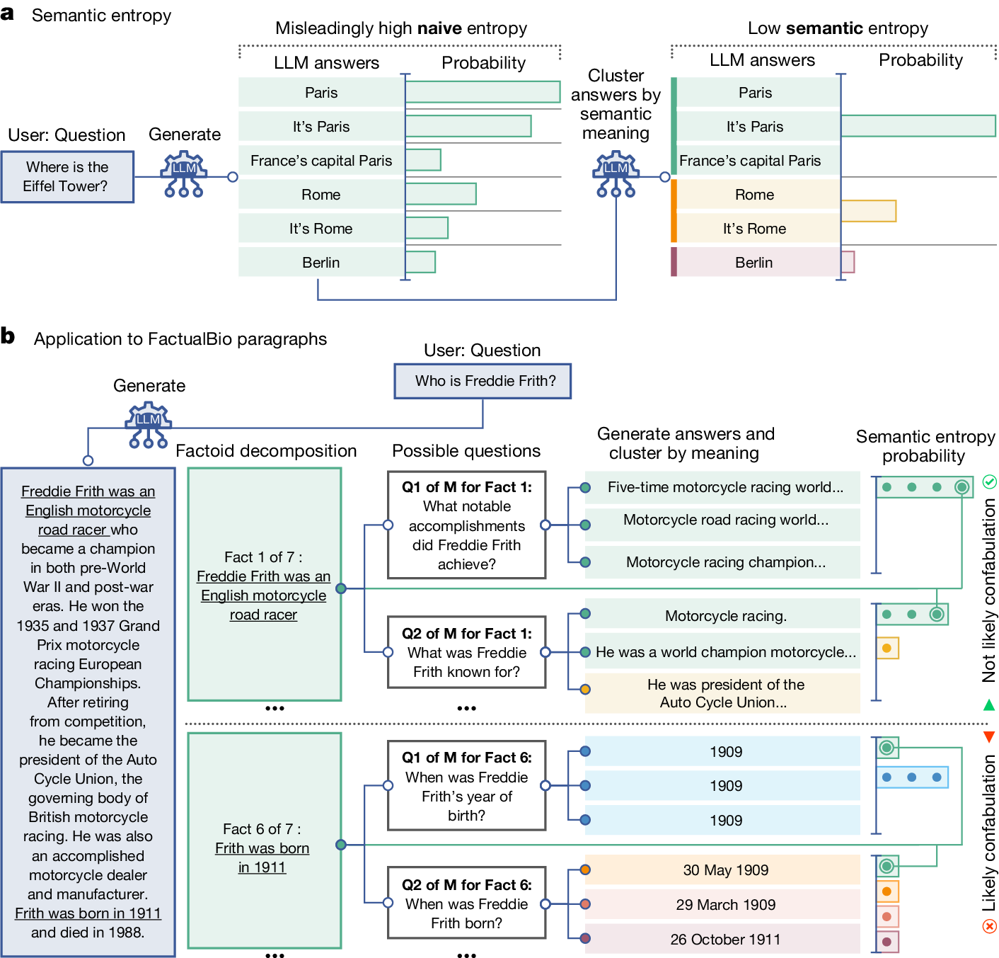
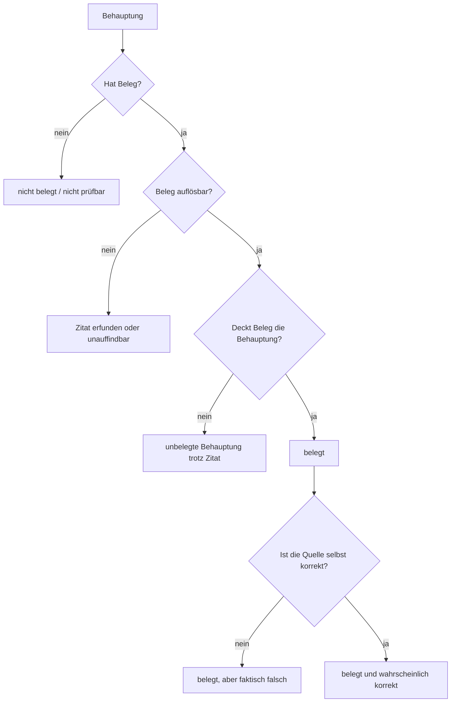

# Halluzination und Belegbindung

## 1. Einleitung

Ein Agent, der einen Bericht erzeugt, produziert Text, der flüssig ist, plausibel klingt und oft Belege anführt. Genau diese drei Eigenschaften sind voneinander unabhängig. Flüssigkeit sagt nichts über Korrektheit, Plausibilität sagt nichts über Belegtheit, und ein Beleg sagt nichts über die Wahrheit der Aussage, die er stützt. Halluzination — die Erzeugung von Inhalten, die nicht durch die Quelle oder die Fakten gedeckt sind — ist deshalb das zentrale Problem, an dem sich der Nutzen eines Agenten entscheidet ([Survey of Hallucination in Natural Language Generation](https://arxiv.org/abs/2202.03629, accessed 2026-09-12)).

Die Leitfrage des Prüfers lautet: Beleg prüfen, nicht glauben. Dieses Kapitel klärt die begrifflichen Werkzeuge, mit denen diese Frage überhaupt operationalisierbar wird — Halluzinationstypen, Faithfulness, Attribution und Zitationsverifikation — und zeigt, warum „belegt" nicht „wahr" bedeutet.

## 2. Halluzinations-Taxonomie

Die Übersichtsarbeit von Ji et al. definiert Halluzination als generierten Text, der sinnlos oder untreu gegenüber dem bereitgestellten Quellinhalt ist, und gliedert das Feld nach Metriken, Mitigationsmethoden und aufgabenspezifischen Befunden in Zusammenfassung, Dialog, generativem Frage-Antworten, Data-to-Text, maschineller Übersetzung und visuell-sprachlicher Generierung ([Survey of Hallucination in Natural Language Generation](https://arxiv.org/abs/2202.03629, accessed 2026-09-12)).

Huang et al. erweitern dies für große Sprachmodelle und führen eine Taxonomie ein, die Halluzination als plausiblen, aber nicht-faktischen Inhalt fasst und Faktoren, Erkennungsmethoden, Benchmarks sowie Mitigationsstrategien systematisiert ([A Survey on Hallucination in Large Language Models](https://arxiv.org/abs/2311.05232, accessed 2026-09-12)). Zwei Unterscheidungen sind für den Prüfer zentral:

- **Factuality vs. Faithfulness.** *Factuality* betrifft das Verhältnis des Textes zur Welt (ist die Aussage wahr?). *Faithfulness* betrifft das Verhältnis des Textes zu einer gegebenen Quelle (ist die Aussage durch die Quelle gestützt?). Beide Surveys etablieren diese Trennung als grundlegend für jede Bewertung ([A Survey on Hallucination in Large Language Models](https://arxiv.org/abs/2311.05232, accessed 2026-09-12), [Survey of Hallucination in Natural Language Generation](https://arxiv.org/abs/2202.03629, accessed 2026-09-12)).
- **Intrinsische vs. extrinsische Halluzination.** *Intrinsisch*: der generierte Inhalt widerspricht oder verfälscht die Quelle. *Extrinsisch*: der generierte Inhalt fügt Informationen hinzu, die in der Quelle nicht enthalten sind — und damit weder durch sie gedeckt noch durch sie widerlegt werden ([On Faithfulness and Factuality in Abstractive Summarization](https://arxiv.org/abs/2005.00661, accessed 2026-09-12)).

## 3. Faithfulness und Groundedness

Maynez et al. zeigen in einer groß angelegten menschlichen Evaluation neuronaler Summarisierungsmodelle, dass diese stark dazu neigen, Inhalte zu erzeugen, die gegenüber dem Eingabedokument untreu sind ([On Faithfulness and Factuality in Abstractive Summarization](https://arxiv.org/abs/2005.00661, accessed 2026-09-12)). Entscheidend für den Prüfer ist ein Nebenbefund: Textuelle Inferenz (textual entailment) korreliert besser mit menschlich beurteilter Faithfulness als klassische Oberflächenmetriken wie ROUGE ([On Faithfulness and Factuality in Abstractive Summarization](https://arxiv.org/abs/2005.00661, accessed 2026-09-12)). Das ist die methodische Grundlage der folgenden automatischen Prüfverfahren: Stützung wird als Inferenzbeziehung modelliert, nicht als Textähnlichkeit.

Warum ein Text flüssig und „belegt" klingen und trotzdem nicht durch die Quelle gedeckt sein kann, hat zwei Gründe. Erstens sagen Sprachmodelle mit hoher Wahrscheinlichkeit plausible Fortsetzungen vorher; Plausibilität ist kein Wahrheitsindikator ([A Survey on Hallucination in Large Language Models](https://arxiv.org/abs/2311.05232, accessed 2026-09-12)). Zweitens kann ein Satz mehrere Propositionen enthalten, von denen nur eine gedeckt ist — Faithfulness muss auf der Ebene einzelner Behauptungen geprüft werden, nicht auf der Ebene des Absatzes ([Detecting hallucinations in large language models using semantic entropy](https://www.nature.com/articles/s41586-024-07421-0, accessed 2026-09-12)).

## 4. Belegbindung (Attribution) als separates Problem

Attribution — die Rückführbarkeit einer Aussage auf identifizierbare Quellen — ist ein eigenes Messproblem, nicht bloß ein Anwendungsfall von Faithfulness. Rashkin et al. schlagen dafür den Rahmen *Attributable to Identified Sources* (AIS) vor und definieren eine zweistufige Annotationspipeline, mit der Bewerter prüfen, ob eine modellgenerierte Aussage durch die zugrunde liegenden Quellen gestützt ist ([Measuring Attribution in Natural Language Generation Models](https://arxiv.org/abs/2112.12870, accessed 2026-09-12)). Die Autoren validieren AIS über drei Aufgabentypen — konversationelles Frage-Antworten, Zusammenfassung und Tabellen-zu-Text — und schlagen es als gemeinsamen Rahmen vor, um zu messen, ob generierte Aussagen durch Quellen gedeckt sind ([Measuring Attribution in Natural Language Generation Models](https://arxiv.org/abs/2112.12870, accessed 2026-09-12)).

*Eigene Analyse:* Faithfulness setzt eine gegebene Quelle voraus und bewertet nur die Stützung; Attribution umfasst zusätzlich die Frage, ob überhaupt eine identifizierbare Quelle vorliegt und aufgelöst werden kann (vgl. §8, Schritt 1).

Der wichtige Punkt: Attribution fragt nicht „ist das wahr?", sondern „lässt sich das auf eine Quelle zurückführen — und stützt diese Quelle es?". Ein Text kann attribuiert sein (jede Aussage hat eine Quelle) und dennoch unwahr sein, wenn die Quelle selbst falsch ist.

## 5. Zitationsverifikation für LLM-Output

Gao et al. führen mit ALCE den ersten Benchmark zur automatischen Bewertung von LLM-Zitationen ein: Systeme müssen Belege abrufen und Antworten mit Zitaten erzeugen; bewertet wird entlang dreier Dimensionen — Fluency, Correctness und Citation Quality — und die Metriken korrelieren stark mit menschlichen Urteilen ([Enabling Large Language Models to Generate Text with Citations](https://arxiv.org/abs/2305.14627, accessed 2026-09-12)). Der Befund ist ernüchternd: Auf dem ELI5-Datensatz fehlt selbst den besten Modellen in 50% der Fälle vollständige Zitationsunterstützung ([Enabling Large Language Models to Generate Text with Citations](https://arxiv.org/abs/2305.14627, accessed 2026-09-12)).

Wie Zitat-Treue konkret gemessen wird, zeigen zwei komplementäre Linien. Liu et al. operationalisieren Verifizierbarkeit über zwei Maße: *citation recall* (sind alle Aussagen durch Zitate vollständig gestützt?) und *citation precision* (stützt jedes Zitat seine zugehörige Aussage?) ([Evaluating Verifiability in Generative Search Engines](https://arxiv.org/abs/2304.09848, accessed 2026-09-12)). In einer menschlichen Auditierung von vier generativen Suchmaschinen fanden sie, dass im Durchschnitt nur 51,5% der generierten Sätze vollständig durch Zitate gestützt sind und nur 74,5% der Zitate ihren Satz tatsächlich stützen ([Evaluating Verifiability in Generative Search Engines](https://arxiv.org/abs/2304.09848, accessed 2026-09-12)). Yue et al. definieren für die automatische Bewertung von Attribution unterschiedliche Fehlertypen und vergleichen zwei Ansätze: das Prompting von LLMs und das Fine-Tuning kleinerer Modelle auf umgenutzten Daten aus Frage-Antworten, Faktenprüfung, *natural language inference* (NLI) und Zusammenfassung ([Automatic Evaluation of Attribution by Large Language Models](https://arxiv.org/abs/2305.06311, accessed 2026-09-12)). Beide Linien reduzieren die Frage „stützt dieses Zitat diese Behauptung?" auf eine Inferenzentscheidung — genau die NLI-Operation, die Maynez et al. als faithfulness-korreliert identifiziert hatten ([On Faithfulness and Factuality in Abstractive Summarization](https://arxiv.org/abs/2005.00661, accessed 2026-09-12)).

## 6. Erkennungsmethoden

Neben quellengestützten Verfahren existieren quellenfreie Detektoren. SelfCheckGPT nutzt die Beobachtung, dass stochastisch gezogene Antworten eines Modells konsistent bleiben, wenn es über ein Konzept „weiß", aber divergieren und sich widersprechen, wenn es halluziniert; das Verfahren arbeitet ohne externe Datenbank und ohne Zugriff auf die Ausgabeverteilung (Black-Box, Zero-Resource) und erreicht höhere AUC-PR-Werte als Grey-Box-Baselines ([SelfCheckGPT: Zero-Resource Black-Box Hallucination Detection](https://arxiv.org/abs/2303.08896, accessed 2026-09-12)).

Farquhar et al. formalisieren diese Idee mit *semantic entropy*: Statt Wahrscheinlichkeiten über Token zu messen, werden Antworten per bidirektionaler Inferenz zu Bedeutungsklassen geclustert und die Entropie über Bedeutungen berechnet ([Detecting hallucinations in large language models using semantic entropy](https://www.nature.com/articles/s41586-024-07421-0, accessed 2026-09-12)). Über 30 Aufgaben-Modell-Kombinationen erreicht semantic entropy einen durchschnittlichen AUROC von 0,790 und übertrifft naive Token-Entropie (0,691), P(True) (0,698) und Embedding-Regression (0,687) ([Detecting hallucinations in large language models using semantic entropy](https://www.nature.com/articles/s41586-024-07421-0, accessed 2026-09-12)). Die Autoren grenzen den Zielbereich scharf ab: Das Verfahren erkennt *Konfabulationen* — arbiträr falsche, zwischen Läufen schwankende Antworten — und garantiert ausdrücklich keine Factuality, weil systematische Fehler nicht erfasst werden ([Detecting hallucinations in large language models using semantic entropy](https://www.nature.com/articles/s41586-024-07421-0, accessed 2026-09-12)).

*Abbildung 1: Semantic Entropy: Die Antworten desselben Modells werden zu Bedeutungsklassen geclustert; niedrige semantische Entropie (grün) markiert "wahrscheinlich keine Konfabulation", hohe (rot) markiert Konfabulationsrisiko (Quelle: [Detecting hallucinations in large language models using semantic entropy](https://www.nature.com/articles/s41586-024-07421-0, accessed 2026-09-12))*

Daneben existiert eine dritte Klasse LLM-basierter Detektoren, die Halluzination direkt klassifizieren; Huang et al. geben einen Überblick über diese Erkennungsmethoden und die zugehörigen Benchmarks ([A Survey on Hallucination in Large Language Models](https://arxiv.org/abs/2311.05232, accessed 2026-09-12)).

Eine Begriffsspannung ist hier offenzulegen: Farquhar et al. argumentieren, verschiedene Mechanismen (Konfabulation, systematischer Irrtum, erlernte Fehlinformation) unter dem Sammelbegriff „Halluzination" zu vereinen, sei *unhelpful*, weshalb sie nur Konfabulationen adressieren ([Detecting hallucinations in large language models using semantic entropy](https://www.nature.com/articles/s41586-024-07421-0, accessed 2026-09-12)); Ji et al. und Huang et al. verwenden den Begriff demgegenüber als breite Sammelkategorie ([Survey of Hallucination in Natural Language Generation](https://arxiv.org/abs/2202.03629, accessed 2026-09-12), [A Survey on Hallucination in Large Language Models](https://arxiv.org/abs/2311.05232, accessed 2026-09-12)). Beide Positionen bleiben hier unaufgelöst; für den Prüfer ist relevant, dass ein Detektor nur den Teil des Problems abdeckt, den seine Definition umfasst.

## 7. Warum Belegbindung nicht Faithfulness garantiert

Drei Fehlerquellen liegen zwischen „hat einen Beleg" und „ist gedeckt":

1. **Das Zitat ist erfunden.** Eine formal korrekt aussehende Referenz kann auf eine nicht existierende Quelle verweisen. Automatische Maße, die nur die Übereinstimmung von Zitat und Aussage prüfen, erkennen dies nicht, wenn das Zitat nicht gegen eine reale Quelle aufgelöst wird ([Evaluating Verifiability in Generative Search Engines](https://arxiv.org/abs/2304.09848, accessed 2026-09-12)).
2. **Das Zitat existiert, stützt die Aussage aber nicht.** Die Aussage wird korrekt zitiert, aber die Schlussfolgerung überdehnt die Quelle. Citation precision misst genau diese Lücke ([Evaluating Verifiability in Generative Search Engines](https://arxiv.org/abs/2304.09848, accessed 2026-09-12)).
3. **Die Quelle ist selbst falsch.** Attribution ist erfüllt, Factuality nicht — der Beleg ist echt, die dahinterliegende Aussage trotzdem unwahr ([Measuring Attribution in Natural Language Generation Models](https://arxiv.org/abs/2112.12870, accessed 2026-09-12)).

Die empirischen Zahlen unterstreichen, dass dies kein Randfall ist: Selbst in Benchmark-Systemen fehlt in der Hälfte der Fälle vollständige Zitationsunterstützung, und generative Suchmaschinen liegen bei citation recall und precision deutlich unter den Ansprüchen eines verlässlichen Werkzeugs ([Enabling Large Language Models to Generate Text with Citations](https://arxiv.org/abs/2305.14627, accessed 2026-09-12), [Evaluating Verifiability in Generative Search Engines](https://arxiv.org/abs/2304.09848, accessed 2026-09-12)).

## 8. Zitationsverifikation als Prüf-Werkzeug

*Eigene Analyse:* Zitationsverifikation ist der Teil des Problems, der sich am ehesten automatisieren lässt — sie zerfällt in drei getrennte Prüfschritte:

- **Beleg auflösbar?** Existiert die zitierte Quelle tatsächlich und ist sie auffindbar? Dies ist ein Retrieval-Problem und in der Regel maschinell entscheidbar.
- **Beleg deckt Behauptung?** Stützt die Quelle die Aussage? Dies wird als Inferenzentscheidung modelliert (NLI-basiert) und ist der Kern von ALCE, AttrScore und den citation-recall/precision-Maßen ([Enabling Large Language Models to Generate Text with Citations](https://arxiv.org/abs/2305.14627, accessed 2026-09-12), [Automatic Evaluation of Attribution by Large Language Models](https://arxiv.org/abs/2305.06311, accessed 2026-09-12), [Evaluating Verifiability in Generative Search Engines](https://arxiv.org/abs/2304.09848, accessed 2026-09-12)).
- **Beleg wahr?** Ist die Quelle selbst korrekt? Dies ist *nicht* automatisch entscheidbar, denn es verlangt Weltwissen, das die Quelle nicht selbst liefert. Hier endet die Automatisierung, und der Prüfer kann nur markieren, nicht entscheiden ([Measuring Attribution in Natural Language Generation Models](https://arxiv.org/abs/2112.12870, accessed 2026-09-12)).

Was automatisch prüfbar ist, umfasst damit die Belegauflösung und die Inferenz zwischen Beleg und Behauptung — mit den bekannten Grenzen der NLI-Modelle. Was nicht automatisch prüfbar ist, ist die Wahrheit der Quelle und die Korrektheit mehrstufiger Schlussfolgerungen, die mehrere Belege verknüpfen ([A Survey on Hallucination in Large Language Models](https://arxiv.org/abs/2311.05232, accessed 2026-09-12)).

## 9. Prüfbaum

Der Prüfbaum macht die These des Kapitels explizit: Der Pfad von „belegt" (Knoten H) zu „wahr" (Knoten K) führt über einen Schritt, der nicht aus dem Zitat allein folgt. Der Belegzustand eines Textes ist eine notwendige, aber keine hinreichende Bedingung für seine Korrektheit.

## 10. Konsequenz für den Prüfer

Ein Prüfer, der einen Agentenbericht bewertet, darf „belegt" nicht mit „wahr" gleichsetzen. Er muss zwei Fragen getrennt stellen: Ist jede Behauptung an eine auflösbare Quelle gebunden? Und deckt diese Quelle die Behauptung? Die erste Frage ist maschinell entscheidbar, die zweite ist als Inferenzentscheidung approximierbar, die dritte — die Wahrheit der Quelle und zusammengesetzter Schlussfolgerungen — bleibt dem Urteil überlassen. Wer diese Ebenen vermischt, produziert ein Werkzeug, das Zitate prüft und Qualität vortäuscht.

## 11. Quellen

1. Ji et al.: Survey of Hallucination in Natural Language Generation — arXiv. https://arxiv.org/abs/2202.03629 (accessed 2026-09-12)
2. Huang et al.: A Survey on Hallucination in Large Language Models — arXiv. https://arxiv.org/abs/2311.05232 (accessed 2026-09-12)
3. Maynez et al.: On Faithfulness and Factuality in Abstractive Summarization — arXiv. https://arxiv.org/abs/2005.00661 (accessed 2026-09-12)
4. Rashkin et al.: Measuring Attribution in Natural Language Generation Models — arXiv. https://arxiv.org/abs/2112.12870 (accessed 2026-09-12)
5. Gao et al.: Enabling Large Language Models to Generate Text with Citations (ALCE) — arXiv. https://arxiv.org/abs/2305.14627 (accessed 2026-09-12)
6. Liu et al.: Evaluating Verifiability in Generative Search Engines — arXiv. https://arxiv.org/abs/2304.09848 (accessed 2026-09-12)
7. Yue et al.: Automatic Evaluation of Attribution by Large Language Models — arXiv. https://arxiv.org/abs/2305.06311 (accessed 2026-09-12)
8. SelfCheckGPT: Zero-Resource Black-Box Hallucination Detection — arXiv. https://arxiv.org/abs/2303.08896 (accessed 2026-09-12)
9. Farquhar et al.: Detecting hallucinations in large language models using semantic entropy — Nature. https://www.nature.com/articles/s41586-024-07421-0 (accessed 2026-09-12)
