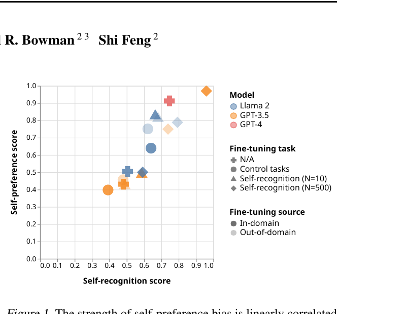
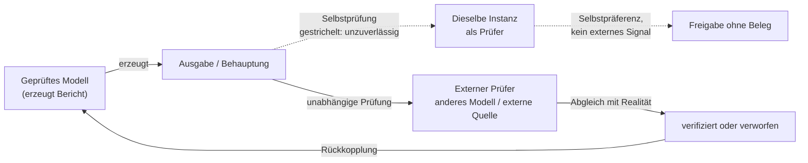

# Selbstprüfung und ihre Grenzen

## Einleitung: warum Selbstprüfung naheliegt und trotzdem trügt

Ein Agent, der einen Bericht über seine eigene Arbeit abliefert, kann naheliegenderweise
auch selbst prüfen, ob dieser Bericht stimmt. Derselbe Modellaufruf, der eine Behauptung
erzeugt hat, wird ein zweites Mal aufgerufen und gefragt, ob die Behauptung zutrifft. Dieser
Entwurf ist attraktiv, weil er keine zweite Infrastruktur, kein zweites Modell und keine
externe Datenquelle benötigt. Er ist zugleich die Schwachstelle jedes Prüfsystems, das sich
auf ihn verlässt: Wenn die einzige Evidenz für die Korrektheit einer Ausgabe die Auskunft
designigen Systems ist, das die Ausgabe erzeugt hat, dann wird nicht geprüft, sondern
bestätigt.

Dieses Kapitel steht im Zentrum der Leitfrage des Wikis. Ein *Prüfer* soll den Bericht eines
Agenten gegen die Wirklichkeit abgleichen, statt ihm zu glauben. Der vorliegende Text
versammelt die empirische Evidenz dazu, was Sprachmodelle leisten können, wenn sie sich
selbst bewerten, und wo diese Fähigkeit systematisch versagt. Das Ergebnis ist kein
Pauschalurteil gegen Selbstprüfung. Selbstprüfung liefert in vielen Experimenten messbare
Verbesserungen. Sie liefert nur keine unabhängige Bestätigung, und genau diese Unterscheidung
ist für den Prüfer-Entwurf entscheidend.

## Self-consistency: Mehrheitsentscheidung über mehrere Samples

Self-consistency ersetzt das greedy decoding der Chain-of-Thought-Prompting durch eine
Sampling-Strategie: Das Modell erzeugt zunächst eine vielfältige Menge von Reasoning-Pfaden
anstelle eines einzigen, und wählt dann die konsistenteste Antwort, indem es über die
gesampelten Pfade marginalisiert. Die Methode beruht auf der Annahme, dass ein komplexes
Reasoning-Problem typischerweise mehrere verschiedene Denkwege zulässt, die auf dieselbe
korrekte Antwort führen [Self-Consistency Improves Chain of Thought Reasoning in Language
Models](https://arxiv.org/abs/2203.11171, accessed 2026-09-12). Die Verbesserungen sind
deutlich: GSM8K +17,9 %, SVAMP +11,0 %, AQuA +12,2 %, StrategyQA +6,4 % und ARC-challenge
+3,9 % [Self-Consistency Improves Chain of Thought Reasoning in Language
Models](https://arxiv.org/abs/2203.11171, accessed 2026-09-12).

Die Grenze liegt in der Annahme selbst. Self-consistency funktioniert, weil verschiedene
Denkwege auf verschiedene Fehler stoßen und sich dadurch gegenseitig ausschließen. Wenn der
zugrunde liegende Fehler dagegen systematisch ist — das Modell liest die Aufgabe falsch, legt
eine falsche Annahme zugrunde, übernimmt eine irreführende Prämisse aus dem Kontext —, dann
teilen alle gesampelten Pfade denselben Fehler. Die Mehrheitsentscheidung konvergiert dann
nicht auf die Wahrheit, sondern auf den geteilten Irrtum, und die Methode verstärkt ihn, weil
sie die Konsistenz des Fehlers fälschlich als Evidenz für seine Richtigkeit behandelt. Diese
Folgerung ergibt sich strukturell aus dem oben zitierten Mechanismus; die Quelle formuliert
sie nicht als eigene Einschränkung. Für den Prüfer-Entwurf heißt das: Ein Konsens über
mehrere Samples desselben Modells ist ein Signal über die Stabilität der Ausgabe, nicht über
ihren Wahrheitsgehalt.

## Self-Refine: iterative Selbstverbesserung ohne externes Signal

Self-Refine erzeugt einen ersten Entwurf, lässt dasselbe Modell Feedback zu diesem Entwurf
geben und verwendet dieses Feedback, um den Entwurf iterativ zu verbessern. Das Verfahren
benötigt keine überwachten Trainingsdaten, kein zusätzliches Training und kein Reinforcement
Learning; ein einzelnes Modell fungiert gleichzeitig als Generator, Refiner und Feedback-Geber
[Self-Refine: Iterative Refinement with Self-Feedback](https://arxiv.org/abs/2303.17651,
accessed 2026-09-12). Über sieben unterschiedliche Aufgaben hinweg wurden die mit Self-Refine
erzeugten Ausgaben von Menschen und automatischen Metriken gegenüber der Ein-Schritt-Generierung
desselben Modells bevorzugt, mit einer durchschnittlichen Verbesserung der Aufgabenleistung von
etwa 20 Prozentpunkten [Self-Refine: Iterative Refinement with Self-Feedback](https://arxiv.org/abs/2303.17651,
accessed 2026-09-12).

Der entscheidende Punkt für die Prüffrage ist die Abwesenheit eines externen Signals. Die
Quelle des Feedbacks ist dieselbe Instanz, die bewertet wird. Genau hier setzt die Kritik an.
Eine Untersuchung über Übersetzung, eingeschränkte Textgenerierung und mathematisches
Reasoning zeigt, dass die Selbstverfeinerung zwar Flüssigkeit und Verständlichkeit der
Ausgaben verbessert, den Selbst-Bias aber weiter verstärkt [Pride and Prejudice: LLM
Amplifies Self-Bias in Self-Refinement](https://arxiv.org/abs/2402.11436, accessed 2026-09-12).
Eine andere Arbeit kommt zu einem noch schärferen Befund: Beim Reasoning können Sprachmodelle
ihre Antworten ohne externes Feedback nicht zuverlässig selbst korrigieren, und ihre Leistung
verschlechtert sich gelegentlich sogar nach der Selbstkorrektur [Large Language Models Cannot
Self-Correct Reasoning Yet](https://arxiv.org/abs/2310.01798, accessed 2026-09-12). Zwischen
diesen Befunden besteht kein Widerspruch auf der Ebene der Messung, sondern eine
Aufgabenabhängigkeit: Wo die Selbstkritik an einer externen Struktur ansetzt — Textqualität,
Stil, Vollständigkeit —, hilft sie; wo sie eine inhaltliche Wahrheit behauptet, die nur von
außen überprüfbar ist, hilft sie nicht. Dass die Wirkung überhaupt aufgabenabhängig ist, ist
in der zitierten Arbeit belegt; wo genau die Trennlinie zwischen den Aufgabentypen verläuft,
ist dagegen die Auslegung dieses Wikis und nicht der Quelle.

## Self-verification und Selbstbewertung

Unter Self-verification wird ein Verfahren verstanden, bei dem das Modell die von ihm selbst
abgeleitete Schlussfolgerung als eine der Bedingungen für das ursprüngliche Problem
behandelt und durch eine Rückwärtsprüfung interpretierbare Validierungs-Scores erzeugt, um
daraus die Kandidatenantwort mit dem höchsten Score auszuwählen. Die Autoren berichten
Verbesserungen bei arithmetischem, commonsense- und logischem Reasoning [Large Language
Models are Better Reasoners with Self-Verification](https://arxiv.org/abs/2212.09561,
accessed 2026-09-12).

Damit steht diese Arbeit in produktiver Spannung zu der oben zitierten Kritik. Hier wird
Selbstprüfung als tragfähig beschrieben, dort als unzuverlässig. Beide Positionen beziehen
sich auf unterschiedliche Verfahren und unterschiedliche Auswertungen. Der gemeinsame
strukturelle Kern bleibt jedoch derselbe: Prüfer und Geprüfter sind dieselbe Instanz. Das
Modell bewertet eine Ausgabe mit denselben Gewichten, demselben Weltwissen und denselben
blinden Flecken, mit denen es die Ausgabe erzeugt hat. Ein Fehler, der aus einer falschen
Überzeugung stammt, wird von derselben Überzeugung nicht als Fehler erkannt. Diese
Selbstbezüglichkeit ist keine Implementierungsdetails, sondern die Eigenschaft, die
Selbstprüfung als Prüfverfahren grundsätzlich schwächt.

## LLM-as-a-Judge: Übereinstimmung mit Menschen und ihre Biases

Beim LLM-as-a-Judge-Ansatz bewerten starke Sprachmodelle die Ausgaben anderer Modelle, um
menschliche Präferenzen zu approximieren. Die Arbeit zu MT-Bench und Chatbot Arena zeigt,
dass starke Modell-Juroren wie GPT-4 sowohl kontrollierte als auch crowdsourced menschliche
Präferenzen gut treffen und über 80 % Übereinstimmung erreichen — dasselbe Niveau der
Übereinstimmung, das Menschen untereinander erreichen [Judging LLM-as-a-Judge with MT-Bench
and Chatbot Arena](https://arxiv.org/abs/2306.05685, accessed 2026-09-12).

Dieselbe Arbeit benennt aber auch die Einschränkungen: Position-Bias, Verbosity-Bias,
Self-Enhancement-Bias und begrenzte Reasoning-Fähigkeit [Judging LLM-as-a-Judge with MT-Bench
and Chatbot Arena](https://arxiv.org/abs/2306.05685, accessed 2026-09-12). Der Position-Bias
ist eigens untersucht worden: Die Qualitätsrangfolge von Kandidatenantworten lässt sich allein
durch Veränderung ihrer Reihenfolge im Kontext manipulieren, sodass etwa Vicuna-13B mit
ChatGPT als Bewerter bei 66 von 80 getesteten Anfragen über ChatGPT siegen konnte [Large
Language Models are not Fair Evaluators](https://arxiv.org/abs/2305.17926, accessed
2026-09-12). Für den Prüfer-Entwurf bedeutet das: Ein Modell-Urteil ist anfällig für
Eigenschaften der Darstellung — Reihenfolge, Länge, Förmlichkeit —, die mit der inhaltlichen
Korrektheit nichts zu tun haben.

## Self-preference: die systematische Bevorzugung eigener Ausgaben

*Eigene Analyse:* Der schwerwiegendste Bias für einen Prüfer, der auf Selbstprüfung baut, ist die Selbstpräferenz. Ein LLM-Evaluator bewertet seine eigenen Ausgaben höher als die anderer,
während menschliche Annotatoren sie als gleichwertig einstufen [LLM Evaluators Recognize and
Favor Their Own Generations](https://arxiv.org/abs/2404.13076, accessed 2026-09-12). Die
Autoren zeigen, dass GPT-4 und Llama 2 ohne spezielles Training eine nicht-triviale
Genauigkeit dabei erreichen, sich selbst von anderen Modellen und von Menschen zu
unterscheiden. Durch Fine-Tuning ergibt sich eine lineare Korrelation zwischen der Fähigkeit
zur Selbsterkennung und der Stärke des Self-Preference-Bias; kontrollierte Experimente
stützen eine kausale Erklärung, die einfachen Confoundern widersteht [LLM Evaluators Recognize
and Favor Their Own Generations](https://arxiv.org/abs/2404.13076, accessed 2026-09-12). Ein
Modell, das seine eigene Handschrift erkennt, neigt also dazu, sie zu bevorzugen.

*Abbildung 1: Der Self-Preference-Bias korreliert linear mit der Fähigkeit zur Selbsterkennung — über Modelle und Fine-Tuning-Varianten hinweg (Figure 1 aus [LLM Evaluators Recognize and Favor Their Own Generations](https://arxiv.org/abs/2404.13076, accessed 2026-09-12))*

Ergänzend formalisiert eine weitere Arbeit den Selbst-Bias über zwei Statistiken und findet
ihn bei sechs Modellen (GPT-4, GPT-3.5, Gemini, LLaMA2, Mixtral, DeepSeek) über mehrere
Sprachen und Aufgaben hinweg; die Self-Refine-Pipeline verstärkt den Bias, während größere
Modellgröße und externes Feedback mit akkurater Bewertung ihn erheblich reduzieren und zu
echten Leistungsverbesserungen führen [Pride and Prejudice: LLM Amplifies Self-Bias in
Self-Refinement](https://arxiv.org/abs/2402.11436, accessed 2026-09-12).

Über den Mechanismus besteht keine Einigkeit in der Literatur, und dieser Text löst den
Dissens nicht auf. Eine quantitative Studie verortet die Ursache nicht in der
Selbst-Erzeugung als solcher, sondern in der Perplexität: LLMs bewerten Ausgaben mit
niedrigerer Perplexität signifikant höher als menschliche Bewerter, unabhängig davon, ob
diese Ausgaben selbst erzeugt wurden; die Selbstpräferenz bestehe, weil Modelle ihnen
vertrautere Texte bevorzugen [Self-Preference Bias in LLM-as-a-Judge](https://arxiv.org/abs/2410.21819,
accessed 2026-09-12). Eine dritte, neuere Position trennt dagegen schädliche von legitimer
Selbstpräferenz: Auf verifizierbaren Benchmarks (mathematisches Reasoning, Faktenwissen,
Codegenerierung) zeigt sich, dass stärkere Modelle zwar mehr Selbstpräferenz aufweisen, ein
großer Teil davon aber mit objektiv überlegener Leistung übereinstimmt und insofern legitim
ist; schädliche Selbstpräferenz bleibt bestehen, wenn das bewertende Modell als Generator
irrt, und stärkere Modelle zeigen dann eine ausgeprägtere schädliche Selbstpräferenz, was
darauf hindeutet, dass sie schwerer erkennen, wenn sie falsch liegen [Do LLM Evaluators
Prefer Themselves for a Reason?](https://arxiv.org/abs/2504.03846, accessed 2026-09-12). Die
Befunde widersprechen sich in der Bewertung: Ist Selbstpräferenz ein Bias oder ein
Qualitätssignal? Beide Lesarten sind mit den Daten vereinbar; für den Prüfer-Entwurf zählt,
dass ein selbstbewertendes Modell den Anteil nicht von sich aus auseinanderhalten kann.

## Grenzen von Reward-Modellen: Overoptimization und Goodhart

Wer die Selbstauskunft eines Modells nicht traut, greift häufig zu einem Reward-Modell als
Ersatz für ein Wahrheits-Orakel. Auch dieser Weg hat eine gemessene Grenze. Wenn gegen ein
Reward-Modell optimiert wird, das menschliche Präferenzen nur unvollständig vorhersagt, kann
eine zu starke Optimierung seiner Werte die Leistung gegenüber der Ground Truth
verschlechtern — in Übereinstimmung mit Goodharts Gesetz. Die Autoren messen diesen Effekt in
einem synthetischen Aufbau, in dem ein festes „Gold-Standard"-Reward-Modell die Rolle der
Menschen spielt: Das Verhältnis zwischen optimiertem Proxy-Score und Gold-Score folgt je nach
Optimierungsmethode (Reinforcement Learning oder Best-of-n-Sampling) einer unterschiedlichen
funktionalen Form, und seine Koeffizienten skalieren glatt mit der Anzahl der
Reward-Modell-Parameter [Scaling Laws for Reward Model Overoptimization](https://arxiv.org/abs/2210.10760,
accessed 2026-09-12). Der zugrunde liegende Vertrauensverlust ist älter als die aktuellen
Sprachmodelle und wurde bereits als „reward hacking" unter den konkreten Problemen der
KI-Sicherheit benannt [Concrete Problems in AI Safety](https://arxiv.org/abs/1606.06565,
accessed 2026-09-12).

Die Konsequenz ist für den Prüfer-Entwurf zentral: Ein Reward-Modell ist ein Proxy für
Präferenz, nicht für Wahrheit. Es kann eine Ausgabe belohnen, die dem Bewerter gefällt, ohne
dass diese Ausgabe der Realität entspricht. Ein Prüfer, der ein gelerntes Modell als
Endinstanz einsetzt, tauscht den Selbst-Bias des Geprüften gegen den Proxy-Bias des Prüfers —
und gewinnt nur dann etwas, wenn der Prüfer an einer unabhängigen Evidenz verankert ist.

## Konsequenzen für den Prüfer-Entwurf

Aus den Befunden folgen drei Entwurfsregeln, die sich nicht auf eine einzelne Quelle stützen,
sondern auf die Konvergenz mehrerer.

**Unabhängigkeit.** Der Prüfer muss sich vom Geprüften in mindestens einer Dimension
unterscheiden: ein anderes Modell, eine andere Datenquelle oder eine andere Prüfmethode. Zwei
dieser Achsen sind empirisch belegt; die dritte folgt aus der Selbstbezüglichkeit. Ein anderes
Modell adressiert den Self-Preference-Bias, der an der Selbsterkennung hängt [LLM Evaluators
Recognize and Favor Their Own Generations](https://arxiv.org/abs/2404.13076,
accessed 2026-09-12). Eine andere Prüfmethode — etwa das Aggregieren über mehrere Reihenfolgen
gegen den Position-Bias — adressiert Fehler der Darstellung statt des Inhalts [Large Language
Models are not Fair Evaluators](https://arxiv.org/abs/2305.17926, accessed 2026-09-12). Eine
andere Datenquelle adressiert die geteilten blinden Flecken; anders als die beiden anderen
Achsen ist das kein zitierter Einzelbefund, sondern die Entwurfsfolgerung aus der oben
belegten Selbstbezüglichkeit.

**Kalibrierung statt Selbstauskunft.** Die Selbstauskunft des Modells — seine
Zuversicht, seine Selbsteinschätzung, seine Behauptung, geprüft zu haben — ist kein
verlässliches Signal, weil dieselbe Instanz Prüfer und Geprüfter ist. An ihre Stelle treten
Kalibrierungsverfahren, die aus mehreren Beobachtungen ein Urteil bilden: die
Kalibrierungsstrategien der Fair-Evaluator-Arbeit (Multiple Evidence Calibration, Balanced
Position Calibration, Human-in-the-Loop Calibration) [Large Language Models are not Fair
Evaluators](https://arxiv.org/abs/2305.17926, accessed 2026-09-12) oder Inferenz-Zeit-Skalierung
wie ein langer Chain-of-Thought vor der Bewertung, die den schädlichen Anteil der
Selbstpräferenz reduziert [Do LLM Evaluators Prefer Themselves for a Reason?](https://arxiv.org/abs/2504.03846,
accessed 2026-09-12).

**Externe Belege.** Die stärkste Form der Unabhängigkeit ist ein Prüfkriterium, das nicht aus
dem Modell stammt. Der direkte empirische Hinweis darauf ist der Befund, dass externes
Feedback mit akkurater Bewertung den Selbst-Bias reduziert und echte
Leistungsverbesserungen erzeugt, während rein interne Rückkopplung ihn verstärkt [Pride and
Prejudice: LLM Amplifies Self-Bias in Self-Refinement](https://arxiv.org/abs/2402.11436,
accessed 2026-09-12). Ein Agentenbericht ist dementsprechend nicht durch die Beteuerung des
Agenten zu belegen, sondern durch einen Nachweis, der außerhalb des Agenten steht: ein
ausgeführter Befehl mit sichtbarer Ausgabe, ein Commit, eine Datei, ein externer Datensatz.

Selbstprüfung bleibt als Werkzeug nützlich — zur Verbesserung von Textqualität und
Vollständigkeit, als zusätzliches Signal in einer Kette von Prüfungen. Als Ersatz für
unabhängige Prüfung ist sie ungeeignet. Der Prüfer-Entwurf sollte Selbstauskünfte als
Hypothesen behandeln, die gegen eine externe Wirklichkeit zu testen sind, nicht als Belege.

## Diagramm: Selbstprüfung gegen externen Prüfer

Durchgezogene Kanten stehen für Prüfschritte, die den Geprüften verlassen; die gestrichelten
Kanten bilden den Selbstbezug ab, der die Grundlage dieses Kapitels ist. Der externe Prüfer
ist nur dann unabhängig, wenn er sich in mindestens einer der drei oben genannten Dimensionen
vom Geprüften unterscheidet.

## Quellen

1. Self-Consistency Improves Chain of Thought Reasoning in Language Models — arXiv. https://arxiv.org/abs/2203.11171 (accessed 2026-09-12)
2. Self-Refine: Iterative Refinement with Self-Feedback — arXiv. https://arxiv.org/abs/2303.17651 (accessed 2026-09-12)
3. Large Language Models are Better Reasoners with Self-Verification — arXiv. https://arxiv.org/abs/2212.09561 (accessed 2026-09-12)
4. Large Language Models Cannot Self-Correct Reasoning Yet — arXiv. https://arxiv.org/abs/2310.01798 (accessed 2026-09-12)
5. Judging LLM-as-a-Judge with MT-Bench and Chatbot Arena — arXiv. https://arxiv.org/abs/2306.05685 (accessed 2026-09-12)
6. Large Language Models are not Fair Evaluators — arXiv. https://arxiv.org/abs/2305.17926 (accessed 2026-09-12)
7. LLM Evaluators Recognize and Favor Their Own Generations — arXiv. https://arxiv.org/abs/2404.13076 (accessed 2026-09-12)
8. Pride and Prejudice: LLM Amplifies Self-Bias in Self-Refinement — arXiv. https://arxiv.org/abs/2402.11436 (accessed 2026-09-12)
9. Self-Preference Bias in LLM-as-a-Judge — arXiv. https://arxiv.org/abs/2410.21819 (accessed 2026-09-12)
10. Do LLM Evaluators Prefer Themselves for a Reason? — arXiv. https://arxiv.org/abs/2504.03846 (accessed 2026-09-12)
11. Concrete Problems in AI Safety — arXiv. https://arxiv.org/abs/1606.06565 (accessed 2026-09-12)
12. Scaling Laws for Reward Model Overoptimization — arXiv. https://arxiv.org/abs/2210.10760 (accessed 2026-09-12)
