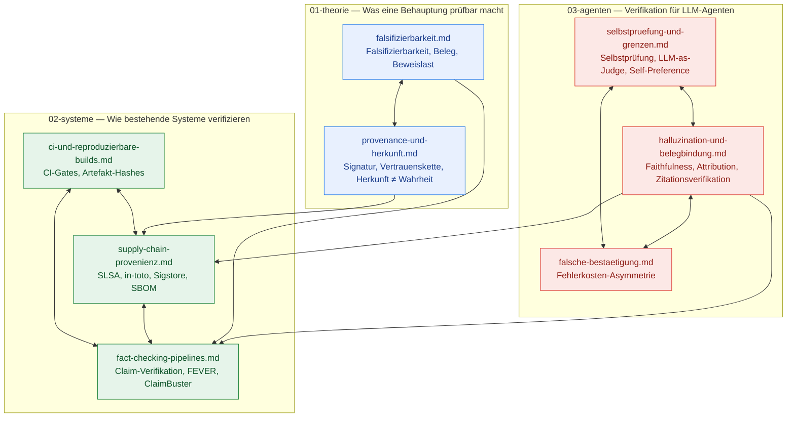

# Prüfer — Wiki: Unabhängige Verifikation von Behauptungen

Leitfrage: **Wie prüft man eine Behauptung über den Zustand der Welt unabhängig, ohne sie zu glauben — und was ist aus bestehenden Systemen übertragbar?**

Dieses Wiki trägt das Design des **Prüfers**: ein Werkzeug, das den Bericht eines Agenten gegen die Realität prüft, statt ihm zu glauben. Drei Cluster: was eine Behauptung prüfbar macht (*01-theorie*), wie bestehende Systeme Behauptungen verifizieren (*02-systeme*), und was speziell für LLM-Agenten gilt — warum ein Modell seine eigene Ausgabe nicht verlässlich prüft und warum die falsche Bestätigung der teure Fehler ist (*03-agenten*).

## Cluster-Karte

Die Kanten folgen den `related`-Feldern der Dateien: durchgezogene Cluster-in-terne Verweise sowie die wichtigsten Cluster-übergreifenden Brücken (Provenienz → Supply-Chain, Falsifizierbarkeit → Fact-Checking, Belegbindung → Supply-Chain und Fact-Checking). Die folgende Tabelle und der Abschnitt *Querverweise* nennen die konkreten Verbindungen.

## Dateien und Status

| Cluster | Datei | Inhalt | Quellen | Bilder/Diagramme | Status |
|---|---|---|---|---|---|
| 01-theorie | [falsifizierbarkeit.md](01-theorie/falsifizierbarkeit.md) | Falsifizierbarkeit, Beleg/Beweis/Beweislast, Zeuge vs. Beweis | 13 | 0 / 1 | Verifiziert |
| 01-theorie | [provenance-und-herkunft.md](01-theorie/provenance-und-herkunft.md) | Herkunftsnachweise, Signaturen, Vertrauensketten; Herkunft ≠ Wahrheit | 13 | 0 / 1 | Verifiziert |
| 02-systeme | [ci-und-reproduzierbare-builds.md](02-systeme/ci-und-reproduzierbare-builds.md) | CI-Gates, reproduzierbare Builds, Artefakt-Hashes als Zeugen | 13 | 0 / 1 | Verifiziert |
| 02-systeme | [supply-chain-provenienz.md](02-systeme/supply-chain-provenienz.md) | SLSA, in-toto, Sigstore, SBOM — was sie garantieren und was nicht | 19 | 0 / 1 | Verifiziert |
| 02-systeme | [fact-checking-pipelines.md](02-systeme/fact-checking-pipelines.md) | Redaktionelle Fact-Checks, ClaimBuster, FEVER, Full Fact | 16 | 0 / 1 | Verifiziert |
| 03-agenten | [selbstpruefung-und-grenzen.md](03-agenten/selbstpruefung-und-grenzen.md) | Selbstprüfung, LLM-as-Judge, Self-Preference, Reward-Model-Grenzen | 12 | 1 / 1 | Verifiziert |
| 03-agenten | [halluzination-und-belegbindung.md](03-agenten/halluzination-und-belegbindung.md) | Halluzinationstaxonomie, Faithfulness vs. Attribution, Zitationsverifikation | 9 | 1 / 1 | Verifiziert |
| 03-agenten | [falsche-bestaetigung.md](03-agenten/falsche-bestaetigung.md) | Fehlerkosten-Asymmetrie: falsche Bestätigung vs. falscher Alarm | 11 | 1 / 1 | Verifiziert |
| 99-sources | [bibliography.md](99-sources/bibliography.md) | Gesammelte Quellen, nach Cluster und Datei gruppiert | 106 | 0 / 0 | Verifiziert |

## Querverweise

- **Provenienz und Herkunft (01) ↔ Supply-Chain-Provenienz (02).** Signaturen und Attestierungen belegen Herkunft und Unversehrtheit relativ zu einem Vertrauensanker, nicht die Wahrheit des Inhalts ([provenance-und-herkunft.md](01-theorie/provenance-und-herkunft.md) ↔ [supply-chain-provenienz.md](02-systeme/supply-chain-provenienz.md)).
- **Falsifizierbarkeit und Beweislast (01) ↔ Fact-Checking (02).** Beide behandeln, wer die Beweislast trägt und welche Form eine Behauptung annehmen muss, um überhaupt widerlegbar zu sein ([falsifizierbarkeit.md](01-theorie/falsifizierbarkeit.md) ↔ [fact-checking-pipelines.md](02-systeme/fact-checking-pipelines.md)).
- **Halluzination und Belegbindung (03) ↔ Supply-Chain (02) ↔ Fact-Checking (02).** Belegauflösung, NLI-basierte Stützungsprüfung und Zitationsmetriken sind die übertragbaren Werkzeuge; Supply-Chain und Fact-Checking liefern die Vorbilder für unabhängige Prüfketten ([halluzination-und-belegbindung.md](03-agenten/halluzination-und-belegbindung.md)).
- **Falsche Bestätigung (03) ↔ Selbstprüfung (03).** Die Fehlerkosten-Asymmetrie begründet, warum Selbstauskünfte als Hypothesen zu behandeln sind und unabhängige Prüfung nötig ist ([falsche-bestaetigung.md](03-agenten/falsche-bestaetigung.md) ↔ [selbstpruefung-und-grenzen.md](03-agenten/selbstpruefung-und-grenzen.md)).
- **Falsche Bestätigung (03) ↔ CI und reproduzierbare Builds (02).** Der grüne Build als Analogie: Ein bestandener Check belegt, dass eine Prozedur ein Ergebnis meldete — nicht, dass das Ergebnis korrekt ist ([ci-und-reproduzierbare-builds.md](02-systeme/ci-und-reproduzierbare-builds.md)).

## Wie dieses Wiki zu lesen ist

- Jede Tatsachenbehauptung trägt einen Inline-Beleg im Format `[Titel](URL, accessed 2026-09-12)`; eigene Interpretationen sind mit *Eigene Analyse:* gekennzeichnet; widersprüchliche Quellen werden dual dargestellt und nicht aufgelöst.
- Alle Dateien sind **Verifiziert**: je Datei wurden Citation-Check (Stichproben auf Erreichbarkeit und Titel-Konsistenz) und Persona-Review durchgeführt; Ergebnisse und offene Lücken stehen im `persona_review`-Block der jeweiligen Frontmatter.
- Alle Quellen sind in [99-sources/bibliography.md](99-sources/bibliography.md) gesammelt (Stand 2026-09-12).

## Offene Punkte (bewusst zurückgestellt)

Aus den Persona-Reviews, für die Pruefer-Design-Phase statt für dieses Wiki:

- Quantitative Schwellenableitung (Kostenmatrix, Erwartungskosten) und Schätzung der Basisrate einer Agenten-Behauptung.
- Aggregation mehrerer Prüfschritte und Regeln für den dritten Ausgang „ungeprüft".
- Multi-Hop-Prüfung (mehrere Belege verknüpft) und Faktenprüfung gegen Weltwissen.
- Auswahlkriterien zwischen Detektor-Familien sowie Implementierungsdetails (NLI-Modelle, Retrieval, Kalibrierung, Kosten/Latenz).
- Empirische Evidenz zur Fehlerkosten-Asymmetrie speziell für Agenten-Verifikation; Fallbeispiele und konkrete Vorfälle.

## Provenienz dieses Wikis

Erstellt im yesresearch-Lauf `yesresearch/pruefer` (Worktree `.worktrees/yesresearch-proofboy-pruefer`, Basis: Master-Plan `yesdocs/pruefer/PLAN.md`). Die Bereichs-Agents für die drei Cluster wurden nach Abschluss der Recherche durch einen YesMem-Daemon-Restart beendet; die Integration (dieser Index, Bibliography, Gate-Checks) erfolgte in der P2-Orchestrator-Session. Kein Push, kein Merge — das übernimmt der Suborchestrator.
